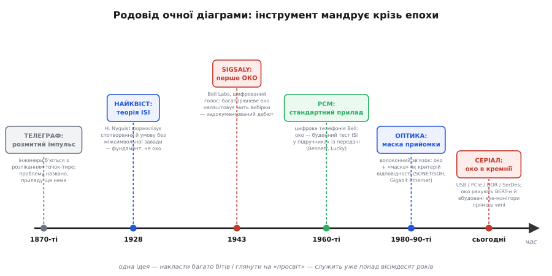
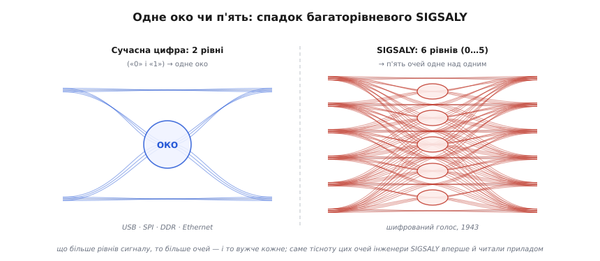

# 📜 Як народилося «око»: від шифрованого голосу війни до серіала в кремнії

У кроці про цілісність сигналу ми вже зустріли очну діаграму як готовий прилад: накладаєш тисячі бітів один на одного, синхронізувавши по тактах, — і посередині лишається порожнє «око», чия висота й ширина одним поглядом кажуть, чи здорова лінія. Картинка проста й переконлива настільки, що здається вічною, мовби була завжди, разом із самим осцилографом. Але вона не була. У неї є дата народження, місце й цілком конкретна причина — і причина ця, як не дивно, ховається в одному з найтаємніших проєктів Другої світової війни. Ця вставка — про те, **звідки** взявся цей погляд на сигнал, **чому** він спершу був зовсім не про «нулі та одиниці», як його **назвали оком** і як він перемандрував із військового вузла шифрованого зв'язку спершу в телефонію, потім у волокно, а тепер живе просто всередині ваших мікросхем.

Чому ця історія варта окремої розповіді, а не одного рядка «винайдено тоді-то»? Бо в ній видно дуже типову для техніки річ: **спершу з'являється проблема, потім — теорія, що її описує, і лише далі — прилад, який дає її побачити оком**. Око діаграми — це саме третій крок, прилад; і щоб оцінити, чому він влаштований саме так (чому накладають, чому дивляться на просвіт, чому колись очей було багато, а тепер одне), треба пройти всі три кроки по черзі. Почнімо з проблеми — вона старша за всю цифрову електроніку.

*Одна ідея — накласти багато бітів і подивитись на просвіт — мандрує понад вісімдесят років. Спершу телеграфісти лише називають проблему розмитого імпульсу; Найквіст у 1928-му дає їй теорію; SIGSALY у 1943-му вперше робить із неї прилад — багаторівневе «око» для наладки миті вибірки; у 1960-х око стає буденним тестом цифрової телефонії; з приходом волокна додається «маска» прийомки; нині око рахують прямо в кремнії високошвидкісних інтерфейсів.*

## Проблема, старша за цифру: розмитий імпульс телеграфа

Усе почалося задовго до транзисторів — ще в епоху телеграфу. Уявіть довгу лінію, якою біжать короткі імпульси струму: точки й тире азбуки Морзе. На вході оператор дає чіткий прямокутний поштовх. Але лінія — це не ідеальний дріт: у неї є опір, ємність на землю, індуктивність, і разом вони поводяться як фільтр, що зрізає швидкі частини сигналу. Чіткий поштовх дорогою **розпливається**: фронт пологішає, хвіст тягнеться, і якщо імпульси йдуть щільно, хвіст одного **наповзає** на сусідній. Два роздільні знаки на вході зливаються на виході в одну розмазану пляму, і приймальний апарат (а часто й людина-оператор) починає плутати, де кінчається одна крапка й починається інша.

Це і є, по суті, та сама біда, що мучить нас у цифрі сьогодні, тільки в найдавнішому вбранні: **сусідні символи заважають один одному** через те, що канал розмиває їх у часі. Телеграфні інженери ХІХ століття добре відчували цю проблему на дотик — вони мірялися довжиною ліній, швидкістю передачі, бачили, як зі швидкістю росте плутанина, — але назвати її точно, формулою, ще не вміли. Проблема була названа словами й відчута на практиці; математики, яка сказала б, **наскільки** швидко можна слати, поки символи ще роздільні, бракувало. Без такої математики годі було й мріяти про прилад, що показав би розмитість оком: щоб щось виміряти, спершу треба знати, **що саме** ти міряєш.

## 1928, Найквіст: проблемі дають ім'я та формулу

Першу строгу теорію цього розмиття дав інженер компанії Bell **Гаррі Найквіст** (*Harry Nyquist*, 1889–1976) — швед за походженням, який емігрував до США підлітком і став одним із головних теоретиків раннього зв'язку. У лютому 1928 року на зимовому з'їзді Американського інституту електроінженерів (AIEE) у Нью-Йорку він представив працю «Certain Topics in Telegraph Transmission Theory» («Деякі питання теорії телеграфної передачі»), що вийшла того ж року в *Transactions of the AIEE*, том 47, сторінки 617–644. *(Статус: усталений факт — праця багаторазово передрукована й цитована, дата й вихідні дані підтверджені.)*

Що зробив Найквіст? Він перевів інтуїтивну біду телеграфістів на мову частот і часу. Замість боротися з кожним окремим розпливанням він поставив питання інакше: **за яких умов потік імпульсів можна слати так, щоб у моменти вибірки сусіди один одному взагалі не заважали?** Виявилося, що існує особлива форма імпульсу й особливий ритм відліків, за яких хвіст кожного імпульсу проходить **точно через нуль** саме в ті миті, коли беруть вибірку сусідніх. Розмиття нікуди не дівається — але в потрібні моменти воно занулюється, і символи лишаються роздільними. Це і є знаменита **умова відсутності міжсимвольної завади** (англ. *intersymbol interference*, ISI — буквально «завада між символами»), а форми імпульсів, що її задовольняють, дотепер звуть найквістовими.

> 🔧 **Навіщо це.** Те, що ми у кроці про цілісність сигналу називали «закрилося око — пішли помилки», — це і є мова Найквіста, перекладена на картинку. Око закривається саме тоді, коли порушується його умова: хвости сусідніх бітів перестають зануляться в моменти вибірки й починають затягувати один одного. Тому коли в даташиті швидкого інтерфейсу пишуть про «ISI» чи про потрібну форму імпульсу — це прямий нащадок праці 1928 року, а очна діаграма просто робить ту саму ISI **видимою**.

Тут важливо чесно поставити межу, щоб не приписати Найквісту зайвого. Він дав **теорію** — умову, формулу, межу. Він **не** винайшов очну діаграму: у його праці немає ні осцилографа з накладеними бітами, ні «ока». Найквіст пояснив, **що** псує сигнал і **коли** символи лишаються роздільними; перетворити це знання на прилад, що показує здоров'я лінії одним поглядом, випало вже іншим людям і за зовсім інших обставин — за п'ятнадцять років, посеред світової війни. Саме там, де ціна помилки була найвищою, теорія вперше стала екраном.

## 1943, SIGSALY: око народжується в найтаємнішій кімнаті війни

Перейдімо до серця цієї історії. Під час Другої світової війни союзникам конче треба було щось, чого доти не існувало: **захищений голосовий зв'язок** на великі відстані — щоб Рузвельт і Черчилль могли говорити через океан, не боячись, що німці підслухають. Звичайний радіотелефон шифрувався примітивно й легко зламувався (ранню систему A-3 німці справді читали). Тож компанія Bell Telephone Laboratories взялася за систему, яка випередила свій час на десятиліття. Її назвали кодовим словом **SIGSALY** *(статус: усталений факт; система описана й розсекречена, дати підтверджені)*. Прототип будували під керівництвом **А. Б. Кларка** (*A. B. Clark*), і — деталь, що зачіпає історію обчислень загалом, — у роботі брав участь британський математик **Алан Тюрінг** (*Alan Turing*), який приїздив до Bell Labs у зв'язку з цим проєктом. Низку патентів за технічні рішення системи отримав інженер **Ральф Міллер** (*Ralph Miller*).

SIGSALY заробила в 1943 році й пробула в строю до 1946-го. І ось чому вона важлива не лише для криптографії, а й прямо для нашої теми: це була, по суті, **перша у світі діюча система цифрового зв'язку голосу**. Подумайте, скільки знайомих понять зійшлося в одній машині воєнних років. Голос розкладали вокодером (*vocoder*) на смуги, оцифровували **імпульсно-кодовою модуляцією** (PCM — pulse-code modulation), а тоді шифрували накладанням **одноразового блокнота** (*one-time pad*) — справді невзломного шифру з випадкового шуму, записаного на однакові платівки на обох кінцях. Усе це — цифрова обробка сигналу в 1943 році, коли до транзистора лишалося ще чотири роки, а до першого комп'ютера загального призначення — навіть більше.

А тепер — конкретні числа, бо вони пояснюють, чому око SIGSALY виглядало геть не так, як наше. Голос ділили на **десять каналів**, що покривали телефонну смугу приблизно від 250 до 2950 Гц. Кожен канал **вибирали 50 разів на секунду** — тобто кожні 20 мілісекунд, — і значення кодували **одним із шести рівнів** амплітуди, з числами від 0 до 5. Не два рівні, як у нашої двійкової логіки, а **шість**: це була багаторівнева (інженери кажуть *multilevel*) передача.

І саме тут народжується очна діаграма. Перед інженерами SIGSALY постало дуже практичне питання: канал зв'язку (а це були трансатлантичні радіолінії, далеко не ідеальні) розмиває й зашумлює переданий сигнал, тож на прийомі шість рівнів уже не стоять чітко, а «пливуть» і тремтять. **У який саме момент брати вибірку**, щоб найнадійніше відрізнити один рівень від іншого? Як налаштувати прилад, щоб мить відліку влучала туди, де рівні найкраще роздільні? Щоб **побачити** це, інженери зробили геніально просту річ: вони пустили прийнятий багаторівневий сигнал на осцилограф і **синхронізували його розгортку з тактом символів** — так, що багато послідовних інтервалів лягали на екрані один поверх одного. На екрані проступив характерний візерунок із просвітами між рівнями, і по ньому стало видно одразу: ось де рівні розходяться найширше — туди й треба ставити мить вибірки.

Саме це й зафіксовано як один із новаторських внесків SIGSALY: **перше застосування багаторівневої «очної» картини для наладки інтервалів вибірки — нова й важлива на той час вимірювальна техніка** *(статус: задокументований факт — наводиться у переліку значущих нововведень системи в довідкових джерелах, зокрема в енциклопедичному описі SIGSALY)*. Тобто очна діаграма народилася не в академічній лабораторії й не як абстрактна ідея, а як **робочий інструмент наладки** конкретної бойової системи зв'язку — щоб люди, які її обслуговували, могли оком зловити найкращу мить відліку посеред океану завад.

*Чому історичне око не схоже на сьогоднішнє. Сучасна двійкова лінія має два рівні («0» і «1») — між ними одне велике око, як ми бачили в кроці про цілісність. SIGSALY мала шість рівнів (0…5), а між шістьма рівнями вкладається п'ять просвітів — п'ять очей одне над одним, і кожне вужче, бо рівні тісніші. Саме читання тісноти цих очей і дало інженерам SIGSALY спосіб обрати найкращу мить вибірки.*

Зверніть увагу на цю несподіванку: **перша очна діаграма мала не одне око, а п'ять**. Це не випадковість і не екзотика — це проста геометрія, варта того, щоб її проговорити, бо вона освітлює саму суть приладу. Між двома рівнями сигналу око одне; між трьома — два; між шістьма рівнями SIGSALY їх рівно п'ять, одне над одним. Що більше рівнів утискаєш у той самий розмах напруги, то тісніші вони один до одного, то **вужче кожне око** — і то менший запас, з яким приймач відрізнить сусідні рівні. Інженери SIGSALY мусили дивитися саме на цю стопку вузьких очей і ловити мить, коли всі вони розкриті якнайширше. Двійкове око з одним великим просвітом, до якого ми звикли, — це просто **найпростіший окремий випадок** тієї самої картини: рівнів лише два, око одне, запас найбільший. Корінь же — багаторівневий, воєнний, і він пояснює, чому сьогодні, коли заради швидкості повертаються до багатьох рівнів (про це далі), око знову розпадається на стопку — точно як у 1943-му.

## Чому саме «око»: ім'я з простого впізнавання

Тепер про назву — питання, на яке кортить дати ефектну відповідь «хтось придумав термін такого-то року», але чесніше сказати інакше. **Око** (англ. *eye*) у цій діаграмі — назва **описова**, а не винайдена кимось одним у конкретну дату: вона прижилася сама, бо картина для двійкового сигналу до неприпустимого схожа на людське око *(статус: усталене, але без задокументованого «першого автора» терміна — це конвенція, що усталилася в інженерному вжитку, а не іменований винахід)*. Варто лише уявити двійкову очну діаграму, і впізнавання миттєве: відкритий простір посередині — це білок і зіниця, а опуклі дуги фронтів згори й знизу, що сходяться до кутиків, — наче повіки, які той просвіт обрамляють. Звідси й уся подальша мова, що нею ми вже користувалися в основному кроці: око **відкрите** чи **закрите**, **розкрив** ока по висоті, **ширина** ока — це не сухі терміни, а пряме продовження зорового образу. Інженеру не треба пояснювати, що значить «око зачинилося»: він це **бачить**, як побачив би заплющені повіки.

У цьому й сила вдалої назви — і причина, чому вона пережила всі епохи від платівок SIGSALY до сьогоднішніх осцилографів. Образ ока несе в собі рівно те, що треба зрозуміти: широко розплющене — добре, видно ясно, є запас; примружене — тривожно, запас тане; заплющене — сліпо, приймач уже не розрізнить біт. Жоден формальний показник не вкладається в голову так одразу, як ця картинка. Тому, хоч багаторівневе око SIGSALY мало п'ять «очей» і метафора там трохи натягнута (радше стос вузьких щілин, ніж одне виразне око), у двійкову епоху, що настала далі, назва лягла ідеально й закріпилася назавжди.

## 1960-ті: око стає буденним приладом цифрової телефонії

Війна скінчилася, SIGSALY розібрали, та сам прийом нікуди не зник — він чекав, поки цифрова передача вийде з військової таємниці в широкий світ. Сталося це у 1950–60-х, коли та сама компанія Bell узялася переводити **телефонну мережу** з аналогової на цифрову. Щоб ущільнити багато розмов в один кабель, голос почали оцифровувати тією самою імпульсно-кодовою модуляцією й гнати лініями як потік імпульсів — перші системи цифрової телефонії (відомі як T-carrier) пішли в експлуатацію саме тоді. А де потік імпульсів біжить реальною лінією, там одразу повертається стара біда Найквіста: міжсимвольна завада, розмиття, тремтіння фронтів.

І тут очна діаграма з вузькоспеціального військового трюку перетворюється на **щоденний інструмент** інженера зв'язку. Бо вона ідеально лягла на нову задачу: підключив осцилограф до лінії, синхронізував із тактом — і око одразу каже, чи доходить цифровий потік цілим, чи його вже з'їла завада. До 1960-х око стало настільки звичним способом оцінювати ISI, що ввійшло в підручники з передачі даних як стандартний прийом, а не якась хитрість. Його описують класичні праці тієї доби — наприклад, «Data Transmission» Беннета й Дейві (*Bennett & Davey*, 1965) та «Principles of Data Communication» Лакі, Залца й Велдона (*Lucky, Salz & Weldon*, 1968), що надовго стали основними книгами галузі *(статус: усталений факт; обидві праці — відомі підручники зв'язку 1960-х, вихідні дані підтверджені)*. Багато ключової роботи над ISI й боротьбою з нею зробили в тих самих Bell Labs протягом 1930–60-х — тобто прилад і теорія росли поряд, в одних стінах.

Зверніть увагу, що сталося з оком на цьому переході. У SIGSALY воно було багаторівневим — стос із п'яти очей. У цифровій телефонії, що пішла переважно двійковим шляхом, лишилося **одне** велике око між «0» і «1» — рівно той образ, який ми розбирали в основному кроці й який нині перший спадає на думку при словах «очна діаграма». Багаторівневий первень тимчасово відступив у тінь, поступившись простішій двійковій картині; повернеться він уже за кілька десятиліть, коли за швидкість знову доведеться платити багатьма рівнями.

## З міді у скло: око переходить в оптичний зв'язок

Наступний великий стрибок ока — з електричних ліній у **світло**. Коли в 1970–80-х розгорнувся волоконно-оптичний зв'язок, інженери зіткнулися з тими самими бідами, тільки в новому фізичному вбранні. Світловий імпульс у волокні теж розпливається — через **дисперсію** (різні складові світла біжать волокном трохи з різною швидкістю, тож імпульс розтягується в часі) — і теж зашумлюється на фотоприймачі. Іншими словами, ISI й шум нікуди не поділися; змінився лише носій — фотон замість електрона. А отже, знадобився той самий погляд: накласти багато бітів і подивитися на просвіт.

Очна діаграма перейшла в оптику майже без змін — і стала там **головним способом перевіряти якість лінії**. Та оптичний зв'язок додав до неї важливу нову рису, яку варто знати, бо вона дожила до сьогодні: **маску ока** (англ. *eye mask*). Ідея проста й строга. Замість того щоб інженер на око вирішував, «достатньо» чи «недостатньо» відкрите око, у центр діаграми й по кутах вписують заборонені зони — багатокутники, куди жодна траса сигналу заходити не сміє. Якщо хоч одна лінія сигналу перетнула маску — лінія тесту **не пройшла**, крапка. Маска перетворила око з якісної картинки на **кількісний критерій прийомки** «склав / не склав», який можна записати в стандарт і перевіряти автоматично. Так око вписали в галузеві стандарти високошвидкісного зв'язку — від оптичних ієрархій SONET/SDH до Gigabit Ethernet *(статус: усталений факт — масочне тестування ока є частиною відповідних стандартів зв'язку)*.

> 🔧 **Навіщо це.** Маска ока — це причина, чому сьогодні «пройшла плата перевірку цілісності чи ні» можна сказати об'єктивно, а не «ну, око ніби відкрите». Коли ви бачите в специфікації USB, HDMI чи Ethernet картинку ока із заштрихованим шестикутником посередині — це пряма спадщина оптичної доби: ваш сигнал мусить лишати ту зону недоторканою. Прилад, що його військові інженери крутили вручну, щоб зловити мить вибірки, перетворився на формальний тест відповідності, який пристрій або складає, або ні.

## Сьогодні: око живе в кремнії

І остання ланка — наш час, коли коло замкнулося. Сучасні швидкі цифрові інтерфейси — USB, PCIe, DDR-пам'ять, послідовні лінки SerDes усередині мікросхем — ганяють дані з такими темпами (гігабіти за секунду й більше), що кожна доріжка на платі поводиться як та сама розмиваюча лінія, з якої ми почали, тільки на межі фізичних можливостей. Тут очна діаграма з оглядового приладу стала **щоденним мірилом якості** на виробництві й при розробці: спеціальні прилади — генератори й аналізатори бітових послідовностей (BERT, від *bit error rate tester*) — будують око з мільйонів реальних бітів і одразу кажуть, який у лінії запас.

Більше того — і це справжнє повернення до коренів — око **переселилося всередину самих мікросхем**. У сучасних приймачах високошвидкісних інтерфейсів роблять **вбудовані «очні монітори»** (*on-chip eye monitor*): чип сам, без зовнішнього осцилографа, будує власну очну діаграму прямо в кремнії, міряє розкрив свого ока й на ходу підлаштовує під нього параметри приймача (наприклад, поріг рішення чи корекцію форми імпульсу), щоб тримати око розкритим попри старіння, нагрів і завади. Згадайте, з чого почалася ця історія: інженери SIGSALY дивилися на екран, щоб **вручну** обрати найкращу мить вибірки. Сьогодні мікросхема робить рівно те саме — будує око й ловить найкращу мить, — але **сама, мільйони разів на секунду**. Прилад наладки воєнних років став автоматичним рефлексом кремнію.

І ще одне коло замкнулося — багаторівневе. Пам'ятаєте шість рівнів SIGSALY й п'ять очей? Коли простого двійкового кодування перестало вистачати, щоб видавити з лінії ще більше швидкості, інженери повернулися до старої ідеї: слати **кілька рівнів** замість двох. Сучасний стандарт PAM4 кодує два біти одразу чотирма рівнями напруги — і його очна діаграма має не одне око, а **три, одне над одним**, кожне вузьке, точнісінько як у багаторівневого ока 1943 року. Те, що інженери SIGSALY вперше побачили на платівках шифрованого голосу, повернулося в каналах між сучасними процесорами — бо геометрія тут одна й та сама поза часом: більше рівнів — більше очей, вужчий запас, складніша наладка.

## Що з цієї історії лишається в руках

Зведімо нитку — і заберемо те, що змінює погляд на прилад із основного кроку. Очна діаграма, якою ви оцінюєте здоров'я лінії, — не вічна абстракція, а **третій крок** довгого ланцюга: телеграфісти ХІХ століття **назвали** біду розмитого імпульсу; Найквіст у 1928-му дав їй **теорію** й умову роздільності символів; інженери SIGSALY у 1943-му, посеред війни, зробили з неї **прилад** — багаторівневе око для наладки миті вибірки; цифрова телефонія 1960-х зробила око буденним, оптика 1980–90-х додала маску-критерій, а сьогодення вшило око прямо в кремній і повернуло багато рівнів. Кожна епоха брала ту саму просту ідею — накласти багато символів і подивитися на просвіт — і прикладала до свого носія: міді, скла, кремнію.

Практичний висновок із цього родоводу той самий, що й мораль багатьох історій техніки: те, що в підручнику виглядає як готовий, очевидний прийом, майже завжди народилося з гострої конкретної потреби — тут із потреби почути союзника через океан, не давши ворогові підслухати. І коли ви наступного разу глянете на очну діаграму свого інтерфейсу — одне двійкове око чи стос вузьких очей PAM4, — варто пам'ятати, що ви дивитеся тим самим поглядом, яким дивилися інженери Bell Labs над платівками SIGSALY вісімдесят років тому: шукаєте мить, коли символи найкраще роздільні, і просвіт, що каже, чи доходить сигнал цілим.
