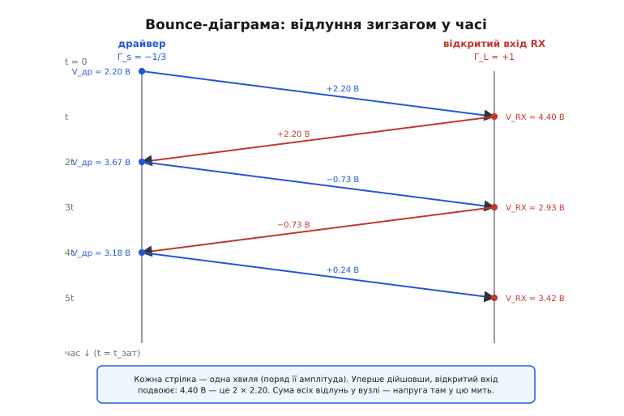
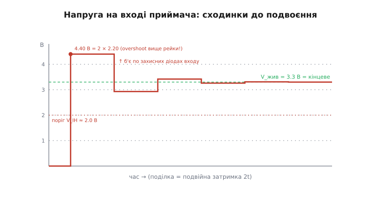

# 🧮 Покрокова арифметика відбиттів: будуємо форму дзвону руками

У самій темі ми вже знаємо *чому* з'являється дзвін: фронт виходить з драйвера, добігає до відкритого входу приймача, майже повністю відбивається назад, від драйвера відбивається знову — і так гуляє туди-сюди, поступово згасаючи. Слово «поступово» там стояло як обіцянка. Тепер ми її виконаємо: візьмемо реальні числа з тієї ж задачі — Z₀ = 50 Ом, драйвер із власним опором, відкритий вхід приймача — і **порахуємо кожне відлуння окремо**, а потім складемо з них повну форму напруги на вході приймача в часі. У кінці ми побачимо на власні очі, звідки береться перерегулювання майже до подвоєння рівня й чому дзвін згасає саме так, а не інакше.

Це і є мета вставки: не повторити, що дзвін буває, а **навчитися його рахувати**. Інструмент, яким це роблять інженери цілісності сигналу, простий, як арифметика в стовпчик, і називається bounce-діаграмою (або решітчастою, lattice). Опанувавши його, ти зможеш для будь-якої лінії сказати наперед: який буде overshoot, скільки сходинок, коли все вгамується — не запускаючи симулятор.

> 🔧 **Навіщо це.** Симулятор (SPICE, IBIS) порахує дзвін за тебе — але він не дасть **відчуття**, чому виходить саме стільки. А відчуття — це те, що рятує на платі: глянув на драйвер 25 Ом і доріжку 50 Ом — і вже знаєш, що буде помітний overshoot і кілька сходинок, бо неузгодження сильне й з обох боків. Ручний рахунок учить читати схему очима, а не лише запускати інструмент.

### Дві дійові особи: коефіцієнт відбиття на кожному кінці

Усе тримається на одній величині, яку ми вже зустріли в темі, — **коефіцієнті відбиття** Γ (грецька «гамма»). Нагадаю його суть із першопричини, бо далі ми застосуємо його **двічі за кожен оберт** хвилі, і важливо твердо розуміти, що він означає.

Коли хвиля напруги біжить лінією з хвильовим опором Z₀ і впирається в опір Z (кінець лінії, навантаження, будь-яке неузгодження), частина її проходить далі, а частина **відбивається** назад. Γ — це частка, що відбилася, як відношення відбитої напруги до падаючої:

```
Γ = (Z − Z₀) / (Z + Z₀)
```

Звідки саме така формула — не з повітря. На стику має виконатися дві умови одночасно: напруга по обидва боки однакова (це одна точка), і струм по обидва боки однаковий (заряд не зникає). Падаюча хвиля несе пару «напруга й струм», пов'язану через Z₀: u_пад / i_пад = Z₀. Відбита хвиля біжить **назад**, тож у неї та сама напруга-до-струму за модулем, але струм тече в інший бік: u_відб / i_відб = −Z₀. А на самому навантаженні повна напруга поділена на повний струм мусить дати Z. Якщо чесно зшити ці три твердження — повна напруга u_пад + u_відб, повний струм i_пад + i_відб, їхнє відношення = Z — і виразити u_відб через u_пад, випаде рівно (Z − Z₀)/(Z + Z₀). Формула — це просто «закон збереження на стику», переписаний для хвиль. Хто хоче бачити, звідки сам Z₀ як √(L/C) і чому хвиля взагалі має фіксоване відношення напруги до струму, — це закладено в [лінії передачі](book:communications/transmission-lines); тут ми беремо Z₀ як дане й працюємо з ним.

Три значення варто мати в пальцях, бо саме між ними живе вся цифрова реальність:

```
Z → ∞  (відкритий вхід)      : Γ = +1   уся хвиля назад, той самий знак
Z = Z₀ (узгоджено)           : Γ =  0   нічого не відбивається
Z = 0  (коротке на землю)    : Γ = −1   уся хвиля назад, протилежний знак
```

Знак — це половина всієї історії, і саме він визначить, дзвенітиме лінія чи лізтиме сходинками в один бік. Додатний Γ означає: відбита хвиля **додається** до того, що вже є, — напруга підскакує вище. Від'ємний означає: відбита хвиля **віднімає** — напруга просідає. Запам'ятаймо це; за хвилину знак вирішить усе.

Тепер головна думка, заради якої ми тут. У реальній лінії неузгоджені **обидва** кінці: і дальній (вхід приймача), і ближній (вихід драйвера). Тому є **два** коефіцієнти відбиття:

- **Γ_L** — на боці навантаження (load), дальній кінець, вхід приймача.
- **Γ_s** — на боці джерела (source), ближній кінець, вихід драйвера.

Хвиля, що повернулася до драйвера, не зникає — вона бачить опір драйвера як чергове неузгодження й відбивається від нього ще раз, з коефіцієнтом Γ_s, і знову летить до приймача. Ось чому відлунь багато: кожен повний оберт хвиля множиться на Γ_L (відбилась від приймача) і на Γ_s (відбилась від драйвера). Добуток Γ_s · Γ_L — це **коефіцієнт згасання за один оберт**: на стільки слабшає кожне наступне відлуння проти попереднього. Якщо цей добуток малий — дзвін гасне швидко; якщо близький до одиниці — лінія дзвенітиме довго. Уся форма сигналу — це згасальна геометрична прогресія, і ми зараз випишемо її члени.

### Скільки виходить з драйвера: початковий поділ напруги

Перш ніж щось відбиватиметься, треба знати, **яка хвиля взагалі вирушила** лінією. І тут перша тонкість, на якій спотикаються: драйвер виставляє на вихід не повну свою напругу, а **менше**. Чому — варто зрозуміти до кісток, бо це задає масштаб усьому подальшому.

У момент перемикання драйвер — це джерело напруги V_джерела з власним послідовним опором R_др (вихідний опір вентиля). Він підключається до лінії. Але лінія в перші миті — це **не** відкритий кінець і не коротке: поки хвиля ще не дійшла до дальнього кінця й не повернулася, драйвер **поняття не має**, що там на тому кінці. Усе, що він «бачить» спочатку, — це хвильовий опір лінії Z₀. Лінія в перший момент поводиться як звичайний резистор Z₀ на землю — бо саме таке відношення напруги до струму вона нав'язує хвилі, що в неї входить.

> 🔧 **Навіщо це.** Це ключ до всього ручного рахунку: **лінія для драйвера спершу — просто резистор Z₀**. Інформація про справжній далекий кінець іще «в дорозі» (летить зі швидкістю сигналу), тож перші 2·t_зат драйвер працює так, наче навантажений на Z₀. Хто це засвоїв — рахує початкову хвилю за п'ять секунд через звичайний поділ напруги.

Отже, у перший момент маємо простий подільник: R_др послідовно з Z₀. Напруга, що дістанеться лінії (і вирушить нею як перша хвиля V₁):

```
V₁ = V_джерела · Z₀ / (R_др + Z₀)
```

Підставмо числа нашої задачі. Беремо логіку 3.3 В, тож V_джерела = 3.3 В. Драйвер — типовий КМОН-вихід із вихідним опором R_др = 25 Ом (реальне значення для багатьох мікроконтролерів; у даташиті це «output impedance» чи його рахують із графіка «вихідний струм проти напруги»). Лінія — Z₀ = 50 Ом.

**Початкова хвиля (що вирушає лінією).**

```
V₁ = 3.3 В · 50 / (25 + 50)
   = 3.3 В · 50 / 75
   = 3.3 В · 0.667
   = 2.20 В
```

Лінією вирушає не 3.3 В, а лише **2.20 В**. Решта (1.1 В) упала на вихідному опорі драйвера. Це абсолютно нормально й тимчасово: коли все вгамується, на відкритому вході струму немає, на R_др падати нічому, і там усталиться повні 3.3 В. Але **дорогою туди** лінія несе тільки 2.20 В — і саме від цього числа тепер відбиватиметься все.

Заодно порахуймо два коефіцієнти відбиття для нашої задачі — вони знадобляться на кожному кроці.

**Коефіцієнт відбиття на приймачі (відкритий вхід).**

```
Γ_L = (Z_L − Z₀)/(Z_L + Z₀),  Z_L → ∞
    = +1
```

**Коефіцієнт відбиття на драйвері.**

```
Γ_s = (R_др − Z₀)/(R_др + Z₀)
    = (25 − 50)/(25 + 50)
    = −25 / 75
    = −0.333  (−1/3)
```

Зверни увагу на знаки — у них уся драма. Γ_L = +1: приймач відбиватиме все й **додаватиме** (звідси сплеск угору). Γ_s = −1/3: драйвер відбиватиме третину й **з протилежним знаком** (звідси корекція вниз на наступному кроці). Те, що знаки **різні**, і породить коливання — напруга стрибатиме то вище кінцевого рівня, то нижче, поступово сходячись. Якби обидва були додатні, вона лізла б сходинками в один бік без коливання. А добуток Γ_s · Γ_L = −1/3 каже: кожне наступне відлуння втричі слабше за попереднє й з оберненим знаком. Усе, апарат готовий — лишилося покрутити хвилю по колу.

### Bounce-діаграма: зигзаг хвилі в часі

Тепер інструмент. Хвиля бігає туди-сюди в просторі й часі водночас, і тримати це в голові важко. Інженери придумали діаграму, яка розгортає рух у зрозумілу картинку: дві вертикальні лінії — драйвер ліворуч, приймач праворуч; **час тече вниз**. Хвиля малюється похилими стрілками зигзагом: вирушила від драйвера вниз-управо, дійшла до приймача за час t_зат, відбилася вниз-уліво, дійшла до драйвера ще за t_зат, і так далі. Кожен похилий відрізок — одна хвиля з певною амплітудою; щойно вона впирається в стіну, та множить її на свій Γ і відправляє назад.


*Час тече вниз, поділка — одна затримка лінії t_зат. Біля кожної похилої стрілки — амплітуда тієї хвилі. Перша хвиля 2.20 В іде вправо; відкритий вхід (Γ_L = +1) відбиває її повністю, додаючи до того, що вже є, — тому в момент t напруга на вході стрибає до 4.40 В = 2 × 2.20. Назад до драйвера летить ті самі 2.20 В; драйвер (Γ_s = −1/3) відбиває −0.73 В уперед, і так амплітуди тануть утричі за оберт.*

Чому ця картинка така зручна. Щоб дізнатися напругу в будь-якій точці лінії в будь-який момент, проводимо туди вертикаль і **додаємо амплітуди всіх стрілок, що її перетнули** до цього часу. Напруга у вузлі — це сума всіх відлунь, які вже встигли там пройти. Усе. Жодних диференціальних рівнянь — тільки додавання чисел уздовж лінії на діаграмі.

Розгорнімо нашу задачу крок за кроком. Час міряємо в одиницях t_зат (затримка лінії в один бік); для нашої доріжки з теми це 0.8 нс, але формули працюють у будь-яких одиницях.

**Момент t = 0.** Драйвер виставляє першу хвилю V₁ = 2.20 В, вона рушає до приймача. У точці драйвера напруга вже 2.20 В. На вході приймача поки нічого — хвиля в дорозі.

**Момент t (хвиля дійшла до приймача).** Падає хвиля 2.20 В. Відкритий вхід має Γ_L = +1, тож відбивається +2.20 В назад. На вході приймача тепер сума падаючої й відбитої:

```
V_RX(t) = 2.20 + 2.20 = 4.40 В
```

Ось воно — **подвоєння**. Перша ж хвиля на відкритому кінці дала 4.40 В, рівно вдвічі більше за ту, що вирушила. І це **вище за живлення 3.3 В** — класичний overshoot, який лупить по захисних діодах входу. Відбита хвиля 2.20 В летить назад до драйвера.

**Момент 2t (відлуння дійшло до драйвера).** Падає 2.20 В, драйвер має Γ_s = −1/3, тож відбивається −0.73 В уперед. У точці драйвера сумуємо все, що там пройшло: початкові 2.20 + падаюча 2.20 + відбита (−0.73):

```
V_DRV(2t) = 2.20 + 2.20 − 0.73 = 3.67 В
```

Хвиля −0.73 В вирушає до приймача.

**Момент 3t (нове відлуння в приймача).** Падає −0.73 В, Γ_L = +1 відбиває ще −0.73 В. До того, що було на вході (4.40 В), додаємо обидві:

```
V_RX(3t) = 4.40 + (−0.73) + (−0.73) = 2.93 В
```

Напруга **просіла** — з 4.40 до 2.93 В, тобто перестрибнула кінцевий рівень 3.3 В униз. Це той самий від'ємний знак Γ_s у роботі: він розвернув корекцію вниз. Відбита −0.73 В летить до драйвера.

**Момент 4t (у драйвера).** Падає −0.73 В, Γ_s = −1/3 відбиває +0.24 В уперед:

```
V_DRV(4t) = 3.67 + (−0.73) + (+0.24) = 3.18 В
```

**Момент 5t (у приймача).** Падає +0.24 В, Γ_L = +1 відбиває +0.24 В:

```
V_RX(5t) = 2.93 + 0.24 + 0.24 = 3.42 В
```

Тепер напруга знову **піднялася** — до 3.42 В, ближче до 3.3, але цього разу зверху. Бачиш ритм? 4.40 (зверху) → 2.93 (знизу) → 3.42 (зверху) → і так напруга **стискається** до кінцевих 3.3 В з обох боків по черзі. Кожен наступний відскок утричі менший за попередній — бо добуток Γ_s·Γ_L = −1/3, і кожен оберт домножує відлуння на цю третину з мінусом.

Випишімо повний ряд напруг на вході приймача — це і є наш кінцевий результат:

```
t     V_RX, В   відхил від 3.3 В
─────────────────────────────────
1t     4.40      +1.10
3t     2.93      −0.37
5t     3.42      +0.12
7t     3.26      −0.04
9t     3.31      +0.01
...    → 3.30     → 0
```

Подивися на стовпчик відхилень: +1.10, −0.37, +0.12, −0.04… Кожне втричі менше за попереднє й з оберненим знаком — точнісінько (−1/3)ⁿ. Це **згасальна геометрична прогресія**, і саме вона на екрані осцилографа виглядає як дзвін: згасаюча хвиля навколо кінцевого рівня. Ми її не вгадали — ми її **порахували**, член за членом.

### Звідки кінцеві 3.3 В: сума нескінченного ряду

Маленька, але важлива перевірка, яка робить картину цілісною. Ми сказали, що напруга сходиться до 3.3 В. Це видно з таблиці, але красивіше — побачити, що так і **мусить** бути з самої прогресії, без жодної фізики «на пальцях».

Напруга на вході приймача — це початкова 4.40 В плюс усі наступні поправки, кожна втричі менша й з мінусом, що чергується. Якщо акуратно скласти всі парні відлуння, повний ряд для усталеного значення зводиться до простого виразу. Загальна формула для кінцевого рівня на відкритому кінці виходить така:

```
V_кінц = V₁ · (1 + Γ_L) / (1 − Γ_s·Γ_L)
```

Підставмо наші числа:

```
V_кінц = 2.20 · (1 + 1) / (1 − (−1/3)·1)
       = 2.20 · 2 / (1 + 1/3)
       = 4.40 / (4/3)
       = 4.40 · 3/4
       = 3.30 В
```

Сходиться рівно до 3.3 В — повної напруги логіки. І це не випадковість: на відкритому вході в усталеному стані струму немає, на вихідному опорі драйвера падати нічому, тож уся V_джерела опиняється на вході. Формула суми нескінченної прогресії й проста фізика «немає струму — немає падіння» дають **одне й те саме число** — гарний знак, що апарат правильний. Зверни увагу й на знаменник 1 − Γ_s·Γ_L: чим ближчий добуток коефіцієнтів до одиниці, тим повільніше гасне ряд і тим довше дзвенить лінія; у нас він −1/3, тож усе вгамовується за кілька обертів.

### Повна форма в часі: сходинки до подвоєння й назад

Тепер зберемо все докупи в те, що реально побачив би осцилограф на вході приймача. Напруга тримається сталою між приходами відлунь — тобто **сходинками**: рівень з'являється в моменти t, 3t, 5t… і тримається по 2t (повний оберт хвилі) до наступної поправки. З'єднаймо наші пораховані рівні в часі.


*Кожна сходинка тримається подвійну затримку лінії 2t. Перший стрибок одразу до 4.40 В — подвоєння хвилі, що вирушила, і він залітає вище живлення 3.3 В: це overshoot, який б'є по захисних діодах входу. Далі рівень стрибає то нижче, то вище кінцевих 3.3 В, з кожним разом утричі ближче, — це і є згасаючий дзвін. Горизонталь V_IH — поріг, вище якого вхід читає «одиницю»; видно, як близько до нього підходить просідання на 3t (2.93 В).*

Ця сходинкова картинка — головний практичний підсумок усієї арифметики. Прочитаймо з неї дві небезпеки, про які попереджала тема, тепер уже **з числами в руках**.

Перша — **overshoot**. Перший стрибок до 4.40 В сидить на 1.1 В вище живлення. Захисні діоди на вході мікросхеми (вони відводять напругу, що вилізла за межі живлення) тепер мусять проводити струм щоразу при перемиканні. Окремий сплеск вони витримають, але мільярди перемикань за життя пристрою помалу деградують вхід — це не «теоретична» шкода, а реальна причина передчасних відмов. І народжується вона не з поганої мікросхеми, а **з арифметики неузгодження**: Γ_L = +1 подвоїв хвилю.

Друга — **хибні перемикання**. Подивися на просідання до 2.93 В у момент 3t. Якби поріг V_IH був трохи вищий, або початкова хвиля трохи менша, ця сходинка пірнула б **під поріг** — і приймач на мить прочитав би «нуль» там, де мала стояти стійка «одиниця». Для лінії даних це, може, переживеться (її читають в інший момент), але для **тактового сигналу** чи **скидання** кожен перетин порога — це фронт: один справжній перепад логіка побачить як кілька тактів. Звідси «привиди», коли пристрій ловить зайві імпульси нізвідки. Тепер видно, **звідки** саме: з другої сходинки дзвону, що зачепила поріг.

> 🔧 **Навіщо це.** Ось чому ручний рахунок коштовний. Він одразу показує не лише «дзвін є», а **наскільки високий перший викид** (тут 4.40 В — небезпечно для входу) і **наскільки глибоке перше просідання** (2.93 В — небезпечно для порога). Два числа, які вирішують, чи треба термінувати лінію, і обидва витягуються з коефіцієнтів відбиття за п'ять хвилин на папері.

### Що змінює термінація — у тих самих числах

Кільце замикається там, де тема дала ліки. Тепер ми бачимо, **що саме** робить термінація з нашою прогресією, — і це найкраща перевірка розуміння.

Згадаймо **послідовну термінацію** з теми: резистор R_s біля драйвера, дібраний так, щоб R_др + R_s = Z₀. У нас R_др = 25 Ом, тож ставимо R_s = 25 Ом, і опір джерела стає 50 Ом — рівно Z₀. Що тепер із коефіцієнтом відбиття на драйвері?

```
Γ_s = (R_др + R_s − Z₀)/(R_др + R_s + Z₀)
    = (25 + 25 − 50)/(25 + 25 + 50)
    = 0 / 100
    = 0
```

**Γ_s став нулем.** А отже добуток Γ_s·Γ_L теж нуль — і вся наша згасальна прогресія обривається **після першого відлуння**. Хвиля вийшла, відбилася від відкритого входу (це відбиття нікуди не подіти — Γ_L досі +1), повернулася до драйвера й там **поглинулася без сліду**, бо джерело тепер узгоджене. Жодного другого оберту, жодних сходинок, жодного дзвону. Порахуймо, що при цьому виходить на вході. Початкова хвиля тепер ділиться навпіл (R_др + R_s = 50 = Z₀): V₁ = 3.3 · 50/100 = 1.65 В. На відкритому вході вона подвоюється: 1.65 · 2 = **3.30 В** — рівно повний рівень, з першого разу, без перельоту. Послідовна термінація не прибирає подвоєння на вході (воно й потрібне, щоб дійти до повного рівня), а **прибирає всі повторні відлуння** — обнуляє Γ_s. Ось чому її ставлять **біля драйвера**: щоб відбита хвиля гасла саме там.

А **паралельна термінація** (резистор Z₀ на землю біля приймача) б'є з іншого боку — вона обнуляє **Γ_L**. Поставили 50 Ом паралельно «нескінченному» входу — і навантаження стало рівним Z₀, тож Γ_L = (50 − 50)/(50 + 50) = 0. Тепер уже **перша** хвиля переходить у навантаження без відбиття — дзвону немає взагалі, ще до того, як він міг початися. Ціна — постійний струм через резистор, як і казала тема. Обидві школи термінації — це просто **обнулення одного з двох Γ** у нашій формулі: послідовна вбиває Γ_s, паралельна вбиває Γ_L. Щойно будь-який із них нуль — добуток нуль, прогресія не живе, лінія мовчить.

Ось у чому сила цього маленького апарату. Один-єдиний вираз Γ = (Z − Z₀)/(Z + Z₀), застосований двічі за оберт і складений у геометричну прогресію, пояснив **усе**: і подвоєння на відкритому вході, і чергування сходинок вище-нижче кінцевого рівня, і швидкість згасання дзвону, і те, чому послідовний резистор біля драйвера його гасить, а паралельний біля приймача не дає народитися. Коли наступного разу в даташиті пам'яті побачиш «послідовний резистор 22–33 Ω на лінії», ти вже не повіриш на слово — ти зможеш підставити числа й **побачити**, як цей резистор обнуляє Γ_s і обриває прогресію після першого ж відлуння.

---
