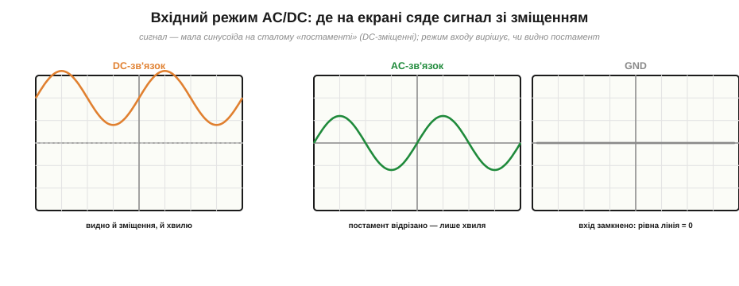

# Синусоїда на осцилографі

На папері синусоїда — це формула, графік, числа. Та інженер бачить її щодня **очима**, на екрані **[осцилографа](root:hw-sensing/oscilloscope)**, який малює напругу як графік у часі (вертикаль — вольти, горизонталь — час): масштаб осей задають ручки «В/поділка» й «час/поділка», а нерухомою картинку робить **тригер**. Наведімо цей прилад саме на синусоїду й навчімося знімати з екрана всі її параметри: амплітуду, період, частоту, RMS і навіть зсув фаз. Це місток між теорією хвилі й живим стендом: усе, про що міркують абстрактно, осцилограф показує наочно, клітинку за клітинкою.

Чому саме синус — добрий навчальний приклад? Бо він простий і впізнаваний, бо саме його дає **генератор сигналів** (перший прилад, який під'єднують до входу, щоб потренуватися), і бо на ньому видно всі три «виміри» хвилі одразу: висоту, ширину циклу й — коли каналів два — фазовий зсув. Опанувавши читання синуса, далі ви читатимете будь-яку форму.

### Зчитати амплітуду й період із клітинок

Головний прийом простий: усе на екрані рахують **у поділках** (клітинках сітки) і множать на масштаб. Для синуса це виходить особливо чисто.


*Зчитування синуса з сітки. По вертикалі: повна висота хвилі — 6 поділок, при «1 В/поділка» це розмах Vₚₚ = 6 В, отже, амплітуда Vₘ = 3 В. По горизонталі: один повний цикл займає 4 поділки, при «1 мс/поділка» це період T = 4 мс, звідки частота f = 1/T = 250 Гц. А діюче з амплітуди: Vᵣₘₛ = Vₘ/√2 ≈ 2.12 В.*

Робимо це по кроках. **Висота.** Найзручніше зміряти повний розмах — від нижнього піка до верхнього: порахували клітинки по вертикалі (на рисунку — 6) і помножили на «В/поділка» (1 В) — маємо Vₚₚ = 6 В. [Амплітуда](root:ph-waves/amplitude-frequency) вдвічі менша: Vₘ = Vₚₚ/2 = 3 В (не сплутати розмах з амплітудою!). **Ширина.** Тепер беремо один **повний цикл** — від гребеня до наступного гребеня (або від переходу через нуль до наступного в тому самому напрямку): порахували клітинки по горизонталі (4) і помножили на «час/поділка» (1 мс) — маємо період T = 4 мс. **Частота.** Її прилад прямо не показує — її **рахують** за формулою f = 1/T = 1/0.004 = 250 Гц.

Дрібна, але корисна порада зі зчитування: міряти **повні** величини — повний розмах і повний цикл — і ставити їх так, щоб вони займали **багато** клітинок. Що більший шматок екрана займає те, що міряєте, то менша відносна похибка ока. Якщо хвиля дрібна — додайте «В/поділка» чутливості; якщо в період влазить пів екрана зморщок — розтягніть розгортку.

### Отримати RMS з того, що видно

А де ж на екрані діюче значення? Прямо — ніде: осцилограф малює **миттєвий** сигнал, а [RMS](root:ph-electromagnetism/rms-value) — це похідна від форми величина. Та для **синуса** його легко отримати зі знятої амплітуди — просто поділивши на √2:

```
Vrms = Vm / √2 = 3 / 1.414 ≈ 2.12 В
```

І тут — важливе застереження. Ця формула Vₘ/√2 чинна **тільки якщо хвиля справді синусоїдна**. Осцилограф дає безцінну перевагу перед мультиметром: він **показує форму** і дозволяє переконатися, що перед вами чистий синус, а не спотворений сигнал. Якщо на екрані синусоїда з обрізаними верхівками чи горбата хвиля — ділити амплітуду на √2 вже не можна (вийде брехня, як і в дешевого мультиметра, що мовчки множить виміряне на той самий коефіцієнт). Сучасні цифрові осцилографи, до речі, часто вміють рахувати True RMS самі (пункт меню «measure»), чесно проганяючи кожен відлік через квадрат-середнє-корінь незалежно від форми, — і це найнадійніший шлях. Та коли під рукою аналоговий чи простенький прилад, ланцюжок «зміряв амплітуду оком → переконався, що це синус → поділив на √2» працює бездоганно.

### AC чи DC на вході: де сяде хвиля зі зміщенням

Вхід [осцилографа](root:hw-sensing/oscilloscope) має режими **AC / DC / GND**, і на синусоїді стає особливо наочно, навіщо вони. Часто корисний сигнал — це **мала синусоїда, що «сидить» на сталому постаменті**: скажімо, пульсації в кілька мілівольтів поверх живлення 5 В, або звуковий сигнал поверх постійного зміщення. Як осцилограф це покаже — залежить від вхідного режиму.


*Та сама мала синусоїда на сталому зміщенні в трьох режимах входу. **DC-зв'язок** пропускає все — видно й постамент (зміщення), і хвилю на ньому. **AC-зв'язок** відрізає сталу складову (постамент) — лишається сама хвиля, яку тепер можна розтягнути по вертикалі й роздивитися. **GND** замикає вхід на нуль — рівна лінія показує, де на екрані «нуль вольт».*

Три режими роблять ось що. **DC-зв'язок** (*DC coupling*) пропускає сигнал як є — і сталу складову, і змінну. Це чесна повна картина: видно, що хвиля піднята, скажімо, на 5 В. Та якщо постамент великий, а хвиля дрібна, доведеться так зменшити чутливість, що хвилі майже не буде видно. **AC-зв'язок** (*AC coupling*) ставить на вході конденсатор, який **відрізає сталу складову** й пропускає лише змінну — постамент зникає, хвиля «осідає» на центр екрана, і тепер її можна розтягнути по вертикалі й роздивитися дрібні деталі (саме так дивляться пульсації на лінії живлення). **GND** (*ground*) від'єднує вхід і показує рівну лінію — нею перевіряють, де на екрані рівень нуля, перш ніж міряти. Те, що AC-зв'язок прибирає сталу складову, — пряме застосування поділу сигналу на [сталу й змінну складові](root:ph-electromagnetism/dc-vs-ac): конденсатор пропускає змінне, тримає постійне, бо для нього важлива [реактивність на частоті](root:hw-components/capacitive-reactance).

### Бачити зсув фаз: дві хвилі на двох каналах

Нарешті — те, заради чого осцилограф особливо цінний і чого мультиметр не вміє в принципі. [Осцилограф](root:hw-sensing/oscilloscope) має **два (або більше) канали** і може показати дві хвилі водночас. Для змінного струму це вікно у **[фазу](root:ph-waves/phase)**: поклавши на екран дві синусоїди однакової частоти, ви прямо **бачите**, наскільки одна зсунута відносно іншої.

Робиться це так. Подаємо обидва сигнали на два канали, синхронізуємо тригер по одному з них (щоб картинка стояла), — і на екрані дві хвилі. Тепер міряємо **часовий зсув** Δt між їхніми однаковими точками (скажімо, між сусідніми переходами через нуль угору) — у клітинках, помножених на «час/поділка». А тоді переводимо час у градуси, бо повний період теж видно на екрані:

```
Δφ = 360° · (Δt / T)
```

**Приклад (зсув фаз із екрана).** На двох каналах — дві синусоїди. Період кожної T = 8 поділок, а зсув між їхніми переходами через нуль — Δt = 1 поділка. Який зсув фаз?

```
Δφ = 360° · (Δt / T) = 360° · (1 / 8) = 45°
```

Одна поділка зсуву на восьми поділках періоду — це 45°. Так, не маючи жодної формули самого кола, прямо з екрана дістають фазовий зсув між входом і виходом — а він каже найважливіше про те, що коло робить із сигналом. Це щоденний прийом налагодження: подати синус на вхід, дивитися вхід і вихід на двох каналах і читати, як змінилися амплітуда й фаза.

> 🔧 **Навіщо це.** Осцилограф — це очі інженера у світі змінного струму, і синус — перше, що цими очима вчаться бачити. Практичний порядок дій варто завчити: налаштувати [тригер](root:hw-sensing/oscilloscope) (інакше хвиля «біжить») → обрати вхідний режим (DC, щоб бачити зміщення; AC, щоб роздивитися дрібну хвилю на великому постаменті) → зчитати Vₚₚ і період у поділках → порахувати f = 1/T і, переконавшись, що це чистий синус, Vᵣₘₛ = Vₘ/√2. А коли треба фаза — два канали й Δφ = 360°·Δt/T. Цей набір рухів покриває величезну частку реального налагодження: від перевірки пульсацій живлення до вимірювання, що підсилювач робить із сигналом. Мультиметр скаже «скільки», осцилограф — «якої форми, як швидко й наскільки зсунуто».
