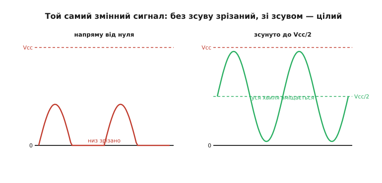
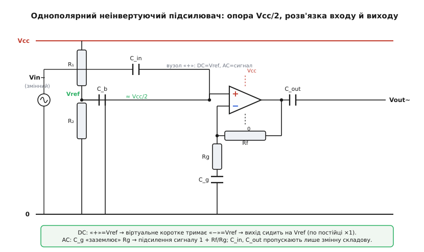
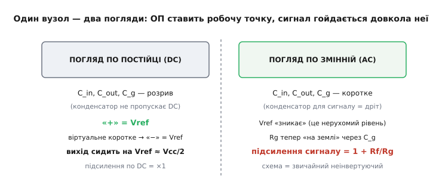

# ОП на однополярному живленні

<preknowlist>
- [Земля й живильні рейки](book:electronics/ground-power-rails) — напруга завжди різниця потенціалів, а нуль (спільну точку відліку) обираємо ми самі.
- [Повторювач напруги (буфер) на ОП](book:electronics/voltage-follower) — точно повторює напругу зі входу на вихід і при цьому здатний віддавати навантаженню струм.
- [АЦП](book:electronics/adc) — перетворює напругу в числовий код (для 12 біт це 0…4095), причому середині шкали відповідає половина опорної напруги.
</preknowlist>

Ми вже вміємо рахувати схеми на операційному підсилювачі майже не думаючи: ставимо віртуальне коротке, кажемо «у входи струм не тече» — і за три рядки маємо відповідь. Та якщо придивитися до кожного прикладу, який ми розбирали, виявиться тиха спільна умова: вихід ОП міг піти й у плюс, і **в мінус**. Інвертор перевертав сигнал нижче нуля; повторювач повторював і від'ємні напруги. Усе це мовчки припускало **дві** живильні рейки — плюсову й мінусову, з нулем посередині.

А плата, на якій ми працюємо, має **одну** шину: 3.3 В і землю. Мінусового джерела нема й не передбачається. І тут гарна, відпрацьована схемотехніка ОП раптом перестає працювати так, як на папері. Розберімося чому — і як це лагодять не заміною приладу, а **колом довкола нього**.

> 🔧 **Навіщо це.** Це не вправа на кмітливість, а щоденна реальність embedded. Мікрофон, давач вібрації, струмовий шунт, будь-який сигнал зі змінною складовою на платі з ESP32 чи STM32 мусить пройти через цей прийом, інакше до АЦП доїде лише половина. Не вмієш зміщувати сигнал у середину живлення — половина аналогових задач для тебе закрита.

### Де ламається звична схема

Уявімо найпростіше: на вхід неінвертуючого підсилювача подають **змінний** сигнал — скажімо, кволий звук із мікрофона, що гойдається на кілька мілівольтів довкола нуля. Хочемо підсилити його в 50 разів і віддати на АЦП. На ±-живленні це тривіально: вихід гойдається довкола нуля, амплітуда виросла — готово.

На одній шині починається біда. Вихід ОП фізично не може видати напругу **нижчу за свою найнижчу рейку**, а найнижча рейка тут — земля, 0 В. Коли математика підсилювача вимагає від виходу, скажімо, −0.4 В, вихідні транзистори впираються в землю й далі не йдуть: вихід «прилипає» до нуля. Уся нижня півхвиля стає плоскою лінією на нулі. Сигнал спотворений до невпізнання ще до того, як його оцифрували.


*Корінь проблеми та її розв'язок. Без зсуву сигнал гойдається довкола нуля, і все, що йде в мінус, зрізається об нижню рейку. Якщо ж посунути «нуль сигналу» до середини живлення, обидві півхвилі лишаються вище реальної землі й цілими.*

Причина суто фізична, і важливо бачити її окремо від двох золотих правил. Віртуальне коротке нікуди не зникло — ОП щиро намагається тримати V₋ = V₊ і виконати потрібне підсилення. Просто **виходу нема куди подітися**: він уперся в межу можливого. Це не порушення правил аналізу, а вихід за **робочий діапазон**, як у будь-якого реального приладу.

> Звідки взагалі ця незручність і чому базова схема ОП за замовчуванням чекає на мінусову рейку — це історія: підсилювач народився у світі ±15 В аналогових обчислювачів, а до однієї батарейної шини спустився лише з появою автомобільної електроніки. Коротко про цей шлях і про народження LM324/LM358 — у вставці [«Як ОП спустився з ±15 В на одну шину»](root:embedded/single-supply-opamp/hist-single-supply.md).

### Головна ідея: пересунути нуль у середину

Лагодять це не приладом, а **зміною точки відліку**. Згадаймо, що [напруга — завжди різниця](book:electronics/ground-power-rails), і нуль ми обираємо самі. Сигнал хоче гойдатися вгору й вниз від якогось рівня — то дамо йому цей рівень **не на землі, а посередині живлення**, на Vcc/2. Тоді «нуль сигналу» — це 1.65 В (за Vcc = 3.3 В), верхня півхвиля піднімається до 1.65 + амплітуда, а нижня **опускається до 1.65 − амплітуда**, лишаючись вище реальної землі. Обидві півхвилі цілі, бо тепер вони обидві в дозволеному діапазоні 0…Vcc.

Цей рівень Vcc/2 називають по-різному — **опорою зміщення** (англ. *bias reference*), «серединою живлення» (*mid-supply*), а часом і «віртуальною землею». Зверніть увагу на тонкість: це **не** та віртуальна земля, що виникає сама собою на інвертуючому вході під дією зворотного зв'язку. Тут ми **навмисне створюємо** фізичний вузол із напругою Vcc/2 й підвішуємо до нього схему. Назва збігається, природа інша: там — наслідок роботи петлі, тут — реальна точка, яку ми мусимо побудувати й живити.

Уся гра з однополярним ОП зводиться до двох речей: **зробити надійну опору Vcc/2** і **правильно завести в схему змінний сигнал так, щоб він гойдався довкола цієї опори, а не довкола нуля**. Розберімо обидві.

### Як зробити опору Vcc/2

Найдешевший спосіб дістати половину живлення відомий: [дільник напруги](book:electronics/voltage-divider) з двох однакових резисторів від Vcc до землі дає рівно Vcc/2 у середній точці. Поставив два по 100 кОм — і маєш 1.65 В. Здавалося б, питання закрите.

Та згадаймо, чим кепський голий дільник: він **кволий**. Його внутрішній (вихідний) опір — це два плеча паралельно, тут 50 кОм, і будь-яке навантаження, що бере струм, просадить цю напругу. А наш вузол Vcc/2 — це опорна точка для всієї схеми: до нього тягнеться вхід ОП, від нього відштовхується сигнал. Якби в цей вузол тік помітний струм, опора б «попливла».

На щастя, тут нам щастить із природою ОП. Сигнал ми заводимо на **неінвертуючий вхід «+»**, а в нього, за першим золотим правилом, **струм не тече** — вхідний опір ОП велетенський. Тобто статично дільник майже не навантажений, і свої Vcc/2 він тримає чесно. Проблема в іншому: **завади**. Шина живлення не ідеально чиста — на ній сидять пульсації від імпульсного перетворювача, цифрові сплески від мікроконтролера. Через дільник половина цього бруду потрапляє просто на опорний вузол, а звідти — на вхід ОП, і підсилюється разом із корисним сигналом.

Тому опору Vcc/2 майже завжди **розв'язують конденсатором на землю**: ставлять C_b (одиниці-десятки мікрофарад) паралельно нижньому плечу дільника. Разом із верхнім плечем цей конденсатор утворює фільтр низьких частот: для постійки він — розрив (опора лишається Vcc/2), а для змінних завад — майже коротке на землю. Брудна пульсація стікає в землю, не доходячи до входу. Це найдешевша й найпоширеніша конструкція опори: **два резистори плюс конденсатор**.

А коли цього мало? Коли до опорного вузла треба під'єднати щось, що **реально бере струм** — наприклад, опора має живити не один високоомний вхід, а кілька каскадів, або сам сигнальний ланцюг повертає в неї помітний струм. Тоді дільник підпирають [повторювачем (буфером)](book:electronics/voltage-follower): дільник задає лише **напругу** (його ніщо не вантажить), а струм навантаженню дає жорсткий вихід буфера. Це класична зв'язка «дільник + буфер», що перетворює кволу опору на тверду. Ціна — один зайвий ОП; зиск — Vcc/2, що не просідає ні за яких розумних навантажень.

> 🔧 **Навіщо це.** Правило вибору просте. Опора живить лише входи «+» кількох підсилювачів (струму майже не беруть) — досить **дільника з конденсатором**. Опора має давати струм (низькоомне навантаження, багато каскадів, довгі лінії) — став **буфер**. Найчастіша помилка новачка — кинути голий дільник без конденсатора й потім ловити на виході підсилений шум живлення.

### Як завести сигнал: розділовий конденсатор

Тепер маємо тверду опору Vcc/2. Лишилося завести змінний сигнал так, щоб він **додався** до цього рівня, а не замість нього. Якщо просто з'єднати джерело сигналу з опорним вузлом дротом, джерело **нав'яже свою постійну складову** й зіб'є наш ретельно виставлений Vcc/2. Нам потрібно пропустити **тільки змінну** частину сигналу, а постійний рівень лишити за схемою.

Це робить **розділовий конденсатор** (англ. *coupling capacitor*) — той самий [RC-фільтр високих частот](book:electronics/rc-high-pass): послідовний конденсатор C_in пропускає змінну складову, але **блокує постійну**. Сигнал проходить крізь нього «голим», без свого DC-рівня, і вже на нашому боці сідає на опору Vcc/2, яку задає дільник. Постійний рівень джерела лишається по той бік конденсатора й нашу робочу точку не чіпає. Так само конденсатор C_out на виході знімає змінну складову з підсиленого сигналу, відрізаючи постійні Vcc/2, на яких сидить вихід, — якщо наступному каскаду чи навантаженню потрібен «чистий» змінний сигнал.

Конденсатор C_in разом із опором, що стоїть **після** нього (тут — опір дільника відносно змінного сигналу), задає нижню межу смуги: f_c = 1/(2πRC). Нижче f_c сигнал почне слабнути й зсуватися за фазою. Тому C_in беруть так, щоб f_c лежала **нижче** найнижчої корисної частоти — з запасом. Деталі взаємодії розділового конденсатора з номіналами тракту й чому в аудіо біля навушників стоять «бочки» на сотні мікрофарад — у компонентній вставці [про розділовий конденсатор](book:electronics/rc-high-pass/comp-coupling-cap.md).

### Збираємо повну схему

З'єднаймо все докупи в робочий однополярний неінвертуючий підсилювач. Деталей небагато, але кожна на своєму місці.


*Однополярний неінвертуючий підсилювач цілком. Дільник R₁/R₂ із розв'язувальним C_b задає тверду опору Vcc/2 на вхід «+». Сигнал заходить крізь розділовий C_in. Rf і Rg задають підсилення, а C_g робить так, щоб по постійці підсилення було ×1 (вихід сидить на Vcc/2), а змінному сигналу діставалося повне 1 + Rf/Rg.*

Перелічимо ланцюжки за призначенням:

- **R₁, R₂** — дільник, що задає опору Vcc/2;
- **C_b** — розв'язує опору від завад живлення;
- **C_in** — пропускає на вхід «+» лише змінну складову сигналу, лишаючи робочу точку Vcc/2 недоторканою;
- **Rf, Rg** — задають підсилення, як у звичайному неінвертуючому підсилювачі;
- **C_g** — найхитріша деталь, про неї окремо;
- **C_out** — знімає з виходу чисту змінну складову.

Найцікавіше — навіщо **C_g** послідовно з Rg. Без нього схема мала б однакове підсилення і для змінного сигналу, і для постійної складової опори: вузол «+» сидить на Vcc/2, віртуальне коротке тягне туди ж «−», і ОП підсилив би сам рівень Vcc/2 у (1 + Rf/Rg) разів. Для Vcc/2 = 1.65 В і підсилення 50 це дало б на виході 82 В — звісно, вихід давно вперся б у рейку й застряг там. Схема просто не запрацювала б.

C_g лікує це елегантно. Для **постійки** конденсатор — розрив: Rg ніби від'єднаний, у схемі лишається тільки Rf, і підсилення дорівнює (1 + Rf/∞) = **×1**. Тобто по постійному струму ОП — звичайний повторювач: він просто повторює Vcc/2 зі свого «+» на вихід. Вихід **сам стає** на Vcc/2 — рівно туди, звідки сигналу зручно гойдатися в обидва боки. А для **змінного** сигналу C_g — коротке: Rg «заземлюється», і підсилення стає повним **1 + Rf/Rg**. Один конденсатор розділив два світи: постійка задає робочу точку, змінна підсилюється.

### Два погляди на один вузол

Цей прийом — серце розуміння однополярних схем, тож закріпимо його окремо. Та сама схема **поводиться по-різному** залежно від того, дивимося ми на постійну складову чи на змінну. Конденсатор — це міст між цими двома поглядами: для постійки він розрив, для змінної — дріт.


*Дві проекції однієї схеми. По постійці конденсатори розривають кола: ОП просто тримає вихід на опорі Vcc/2 (робоча точка). По змінній конденсатори стають короткими, опора «зникає» як нерухомий рівень, і перед нами знайомий неінвертуючий підсилювач. Розрахунок схеми = накласти ці два погляди.*

Це і є загальний метод роботи з будь-якою однополярною схемою на ОП: **порахувати окремо постійну складову** (де стоять робочі точки, чи всі входи й виходи в дозволеному діапазоні) — і **окремо змінну** (яке підсилення, яка смуга). Конденсатори підказують, який ланцюг у якому погляді «живий». Глибше про розділення постійного зміщення й змінного сигналу в підсилювачі — окремий крок курсу [про DC-зміщення і AC-сигнал](root:embedded/dc-ac-bias).

### Порахуймо реальну схему

Доведімо метод до чисел. Зберемо мікрофонний підсилювач на 3.3 В.

**Підсилювач електретного мікрофона: підсилення 50, смуга від 100 Гц.**

```
Дано: Vcc = 3.3 В, треба підсилення ×50 для звуку, нижня межа смуги fс ≈ 100 Гц.
Вхід ОП «бачить» опір дільника; для змінного сигналу це R1 ∥ R2.

1) Опора Vcc/2 — два однакові резистори:
   R1 = R2 = 100 кΩ  →  Vref = 3.3 · 100/(100+100) = 1.65 В
   опір дільника для сигналу: R1 ∥ R2 = 50 кΩ

2) Підсилення по змінній: 1 + Rf/Rg = 50  →  Rf/Rg = 49
   беремо Rg = 1 кΩ,  Rf = 49 кΩ ≈ 47 кΩ (стандартний номінал)
   тоді реальне підсилення = 1 + 47000/1000 = 48  (досить близько)

3) Розділовий C_in працює на опір дільника 50 кΩ:
   fс = 1/(2π·R·C)  →  C = 1/(2π·100 Гц·50000)
   C_in = 1/(2π·100·50000) ≈ 3.2·10⁻⁸ Ф ≈ 32 нФ → беремо 47 нФ (запас вниз)

4) C_g працює на Rg = 1 кΩ; його зріз має бути НИЖЧЕ за fс, щоб не з'їдати підсилення:
   для зрізу ~10 Гц: C_g = 1/(2π·10·1000) ≈ 16·10⁻⁶ Ф → беремо 22 мкФ

5) C_b (розв'язка опори) — десь 10 мкФ, разом із R1∥R2 = 50 кΩ
   дає зріз 1/(2π·50000·10⁻⁵) ≈ 0.3 Гц — давить усе вище майже до нуля.
```

Висновок: п'ять номіналів — і маємо робочий каскад. Вихід спокійно сидить на 1.65 В, звук гойдається довкола нього з підсиленням ~48, а смуга чесно тримається від ~100 Гц угору. Жодної мінусової рейки не знадобилося — ми **відтворили нуль** посеред живлення.

Зверніть увагу на логіку номіналів конденсаторів: зрізи C_in і C_g кладуть **нижче** робочої смуги, з запасом, бо інакше вони почнуть різати корисні баси. А C_b роблять найповільнішим — щоб давити пульсації живлення аж до часток герца. Усі три конденсатори — фільтри високих частот, просто на різні опори, тож і номінали різні.

### Сигнал в АЦП: однополярна схема й код

Тепер найважливіше для прошивки. Сигнал на виході гойдається довкола **Vcc/2**, а не довкола нуля. Якщо завести його прямо в АЦП мікроконтролера (без вихідного C_out), перетворювач побачить код, що коливається довкола **половини шкали**. Тиша — це не нуль, а середина діапазону.

Отже, у коді постійну складову треба **відняти**. Якщо АЦП 12-бітний (0…4095) і опорна напруга дорівнює Vcc, то Vcc/2 відповідає коду 2048, і «нульовий» сигнал — це саме 2048:

```c
// Сигнал заведено в АЦП БЕЗ розділового конденсатора:
// тиша сидить на середині шкали (Vcc/2), а не на нулі.
#define ADC_MIDSCALE  2048          // half of 4096 for a 12-bit ADC at Vref = Vcc

int16_t read_signal_centered(void) {
    uint16_t raw = adc_read();       // 0..4095, тиша ≈ 2048
    return (int16_t)raw - ADC_MIDSCALE;   // тепер тиша = 0, сигнал гойдається ±
}
```

Тонкість: опора Vcc/2, зроблена дільником, **прив'язана до Vcc** — і код середини шкали теж прив'язаний до Vcc (бо опорна напруга АЦП зазвичай теж Vcc). Тому замість магічної константи 2048 чесніше **виміряти середину наживо** при тиші — тоді дрейф живлення й розкид резисторів самі скомпенсуються:

```c
// Калібрування «нуля» при старті: усереднити кілька відліків тиші.
static int16_t zero_level = ADC_MIDSCALE;

void calibrate_zero(void) {
    int32_t acc = 0;
    for (int i = 0; i < 256; i++) acc += adc_read();
    zero_level = (int16_t)(acc / 256);    // реальна середина для ЦЬОГО екземпляра
}

int16_t read_signal(void) {
    return (int16_t)adc_read() - zero_level;
}
```

> 🔧 **Навіщо це.** Це та межа, де схемотехніка зустрічається з прошивкою. Якщо забути, що однополярний сигнал зміщений до середини шкали, програма братиме тишу за постійний сигнал у половину діапазону — і будь-яка обробка (визначення гучності, порогів, спектру) піде нанівець. Віднімання середини шкали в коді — рівноцінне «віртуальній землі» в залізі: ми й там, і там повертаємо нулю його сенс.

### Типові граблі

**Голий дільник без C_b.** Опора Vcc/2 ловить усі пульсації живлення, і вони лізуть на вихід, підсилені в десятки разів. Завжди став розв'язувальний конденсатор.

**Забули C_g.** Без нього ОП підсилює сам рівень Vcc/2 у (1 + Rf/Rg) разів, вихід упирається в рейку й застрягає — схема «мертва». C_g робить підсилення по постійці рівним ×1.

**C_in або C_g замалі.** Зріз ФВЧ заліз у робочу смугу — баси зрізані, фаза попливла. Клади зрізи з запасом нижче найнижчої корисної частоти.

**Вихід усе одно зрізається.** Навіть із правильним зміщенням до Vcc/2 розмах обмежений тим, як близько вихід ОП дістає до рейок. На 3.3 В звичайний (не rail-to-rail) каскад губить по вольту з боку — лишається кволенька смужка. Це вже не про коло, а про **сам прилад**: вибір rail-to-rail ОП і чому класичний каскад марнує діапазон — у [статті про ОП на 3.3 В](book:electronics/opamp).

**Не врахували зміщення в коді.** Сигнал у АЦП сидить на половині шкали; забув відняти — і вся обробка хибна.

### Підсумок

Однополярне живлення не ламає схемотехніку ОП — воно лише забирає мінусову рейку, а ми **повертаємо нуль** туди, де його бракує: у середину живлення. Ті самі два золоті правила, той самий [неінвертуючий підсилювач](book:electronics/inverting-noninverting) — просто гойдається він тепер довкола Vcc/2, а не довкола землі. А в прошивці ми робимо дзеркальний крок: віднімаємо середину шкали, повертаючи нулю його сенс уже в коді. Одна думка тримає весь прийом: нуль — не фізична даність, а точка, яку ми призначаємо там, де він потрібен, — і в залізі, і в коді.
