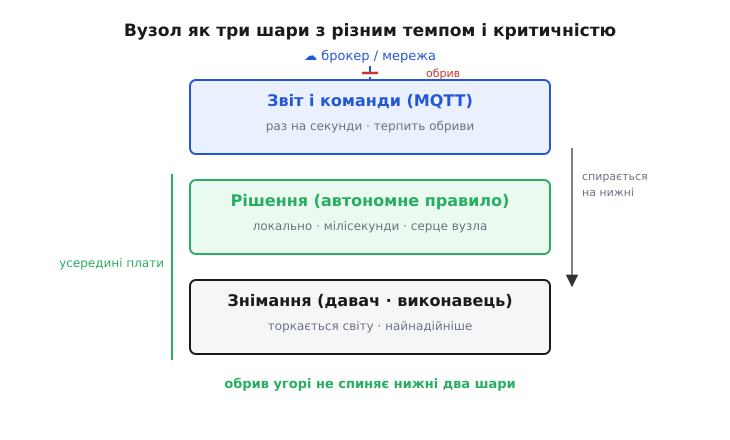
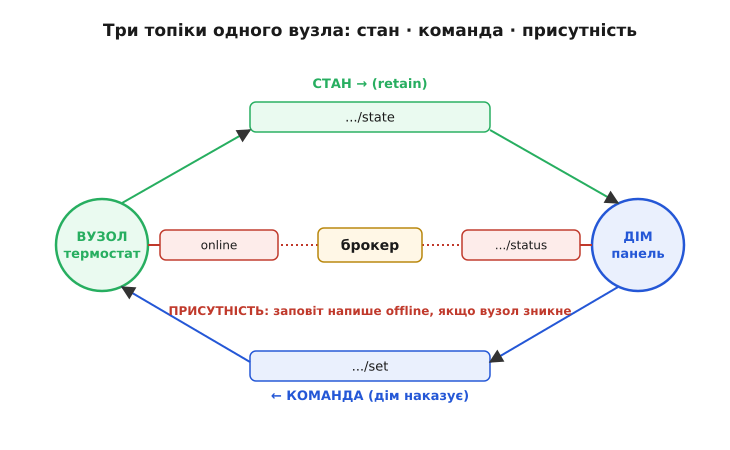

# Вузол розумного дому: давач + MQTT + автономна логіка

Дійшовши сюди, ти вже вмієш поодинці все, з чого складається такий пристрій. Ти читав давач оточення по [шині I2C](book:communications/i2c-bus), піднімав [Wi-Fi](book:communications/wifi) і швидко до нього перепідключався, гнав дані через [MQTT](book:communications/mqtt), будував [скінченні автомати](book:electronics/finite-state-machines), присипляв мікроконтролер і зберігав налаштування в [NVS](book:programming/nvs). Цей крок нічого нового про ці цеглинки не розкаже. Його задача інша — **скласти з них живий вузол**, і побачити, що складання ставить власні вимоги, яких не видно, поки дивишся на кожну цеглину окремо.

Бо «розумний дім» — це не одна велика програма десь у хмарі, що смикає лампочки. Це **рій дрібних самостійних пристроїв**: давач температури в кімнаті, реле під бойлером, контролер штор, кнопка біля дверей. Кожен такий пристрій зветься **вузол** (англ. *node*, «вузол мережі») — окрема плата зі своїм мікроконтролером, своїм давачем чи виконавцем, своєю прошивкою. Дім розумний рівно настільки, наскільки розумні його вузли й наскільки чисто вони між собою домовляються. І перше, що треба зрозуміти, — **скільки розуму лишити в самому вузлі**, а скільки віддати назовні.

## Спокуса зробити вузол німим

Найпростіша думка, яка спадає першою: хай вузол буде тупий. Давач щосекунди міряє температуру й шле її на сервер; сервер думає, вирішує «холодно — увімкни обігрівач» і шле вузлові-реле команду «замкнись». Уся логіка — в одному розумному центрі, а вузли лише руки й очі. Спокусливо: логіку правиш в одному місці, вузли взаємозамінні й дешеві.

І це працює — рівно доти, доки працює зв'язок. А він не працює завжди. Wi-Fi у квартирі — не дріт: роутер перезавантажують, сусідський канал забиває ефір, брокер на домашньому сервері падає під час оновлення, інтернет провайдер ремонтує пів дня. І ось у чому біда: якщо весь розум зовні, то з обривом зв'язку вузол **тупіє повністю**. Уяви вимикач світла, який перестає вмикати світло, коли ліг роутер. Термостат, що кидає гріти оселю, бо не докричався до хмари. Це не гіпотеза — це щоденний досвід дешевих «розумних» розеток, які без інтернету стають просто розетками, і то не завжди.

Звідси перший і головний висновок цього кроку, на якому тримається все далі:

> 🔧 **Навіщо це.** Мережа — це зручність, а не життєзабезпечення. Вузол мусить робити свою головну справу **сам**, навіть коли він сам-один у темряві без зв'язку. Датчик руху вмикає світло локально, за мілісекунди, дротом усередині плати — а не летить питати дозволу за океан. MQTT тоді потрібен не щоб *керувати* вузлом, а щоб він **звітував** про свій стан і **приймав нечасті нові настанови**. Розум лишається вдома, у вузлі; назовні йде лише розмова про нього.

Це і є **автономна логіка**, винесена в назву кроку: правило, за яким вузол живе, зашите в його власну прошивку й виконується без жодного пакета в ефір. Мережа зверху — лише спостерігає й зрідка підправляє.

## Три шари одного вузла

Коли приймаєш, що розум лишається в пристрої, вузол природно розпадається на три шари, і їх варто тримати подумки окремо, бо кожен має свій темп і свою надійність.

**Знімання** — нижній шар. Тут вузол торкається світу: читає давач, тисне на кнопку, крутить реле. Це швидко (мілісекунди) і мусить бути найнадійнішим — воно працює завжди, хоч що коїться нагорі.

**Рішення** — серединний шар, той самий автономний. Тут живе правило вузла: «якщо температура нижча за поріг — увімкни нагрів», «якщо рух і темно — засвіти на дві хвилини». Це теж локально й швидко; це серце вузла, і воно **не має права залежати від мережі**.

**Звіт і послух** — верхній шар, і тільки він виходить у радіо. Вузол публікує свій стан у MQTT (щоб дім бачив, що діється) і слухає команди (щоб дім міг втрутитися — змінити поріг, вимкнути вручну, попросити свіже показання). Це повільно (раз на секунди чи хвилини), терпить обриви й затримки — бо ні знімання, ні рішення від нього не залежать.

Розкладімо цю анатомію в одну картину, бо в ній — уся суть кроку.


*Вузол як три шари з різним темпом і різною критичністю. Знімання (давач, виконавець) і рішення (локальне правило) живуть усередині плати, працюють за мілісекунди й не залежать ні від чого зовнішнього. Лише верхній шар — звіт і прийом команд — виходить у мережу через брокер MQTT; він найповільніший і найкрихкіший, тому саме на нього кладемо все, що можна втратити без шкоди. Обрив нагорі (пунктир) відрізає верхній шар, але нижні два працюють далі — світло вмикається, нагрів тримається.*

Головна цінність цього поділу — у напрямку залежності. Верхній шар **спирається** на нижні (звітує про те, що вони роблять), але нижні **нічого не знають** про верхній і чудово живуть без нього. Це те саме правило, яке ти вже бачив у [автономній системі](root:embedded/autonomous-system) дрона: критичний контур керування крутиться сам, а зв'язок із землею — лише нагляд згори, чий обрив не роняє апарат. Розумний вузол дому — той самий принцип у мирному вбранні.

## Дві петлі, які не блокують одна одну

Тепер — як це лягає в код. Наївний код прошивки виглядав би так: у нескінченному циклі поміряти давач, потім під'єднатися до брокера, відіслати число, зачекати відповіді, поспати секунду, повторити. Кожен рядок чекає завершення попереднього. Це **блокувальний** стиль, і для вузла він згубний: щойно під'єднання до брокера зависне на п'ять секунд (а мережеві виклики зависають постійно), увесь вузол на ці п'ять секунд глухне — не поміряє давач, не смикне реле, не помітить кнопку. Верхній, найкрихкіший шар узяв би в заручники нижні.

Тому вузол будують як **дві незалежні петлі, що крутяться в різному темпі й не чекають одна одної**:

- **Швидка петля** — знімання й рішення. Крутиться часто (десятки-сотні разів на секунду), нічого мережевого не торкається, тому ніколи не зависає. Поміряв, застосував правило, за потреби смикнув виконавець — і далі.
- **Повільна петля** — звіт і команди. Спрацьовує зрідка (за таймером — раз на N секунд) або на подію. Тут і тільки тут дозволені мережеві дії, і навіть якщо котрась із них підвисне, швидка петля цього не відчує.

Щоб дві петлі жили в одному циклі й жодна нікого не блокувала, вся прошивка вузла пишеться **без `delay()`** — на порівнянні часу. Замість «поспати секунду» вузол дивиться на годинник: «чи минула секунда від минулого звіту? якщо так — звітуй». Так один `loop()` устигає обслужити обидві петлі, кожну в її темпі. Це той самий кооперативний неблокувальний стиль, який ти вже застосовував; тут він стає хребтом усього вузла.

Ось кістяк такого циклу. Це не псевдокод — це реальна структура прошивки ESP32, з якої виростає будь-який вузол.

**Умова: давач температури на I2C; реле нагрівача на виводі; вузол сам тримає температуру біля порога, а в MQTT публікує стан і слухає команду зміни порога. Мережа може зникати будь-коли — локальне регулювання від цього не залежить.**

```c
// --- Стан вузла (усе, чим він живе) ---
static float  g_temp        = 0.0f;    // останнє показання давача, °C
static float  g_setpoint    = 21.0f;   // поріг: нижче — гріти. Заводське значення
static bool   g_heater_on   = false;   // поточний стан реле
static bool   g_net_up      = false;   // чи є зв'язок із брокером
static uint32_t t_last_report = 0;     // коли востаннє звітували, мс

#define REPORT_PERIOD_MS  10000        // звіт раз на 10 с
#define HYSTERESIS        0.3f         // «мертва зона» навколо порога, °C

// --- ШВИДКА ПЕТЛЯ: знімання + рішення (жодної мережі) ---
static void control_step(void) {
    g_temp = sensor_read_celsius();    // читаємо давач по I2C

    // Автономне правило з гістерезисом: щоб реле не деренчало на межі
    if (!g_heater_on && g_temp < g_setpoint - HYSTERESIS) {
        g_heater_on = true;
        relay_set(true);               // локальна дія — дротом, миттєво
    } else if (g_heater_on && g_temp > g_setpoint + HYSTERESIS) {
        g_heater_on = false;
        relay_set(false);
    }
}

// --- ПОВІЛЬНА ПЕТЛЯ: звіт (тільки якщо є зв'язок) ---
static void report_step(uint32_t now) {
    if (now - t_last_report < REPORT_PERIOD_MS) return;  // ще не час
    t_last_report = now;
    if (!g_net_up) return;             // зв'язку нема — просто пропускаємо звіт

    char payload[64];
    snprintf(payload, sizeof payload,
             "{\"temp\":%.1f,\"heater\":%s,\"set\":%.1f}",
             g_temp, g_heater_on ? "true" : "false", g_setpoint);
    // стан → retain=1: хто підключиться пізніше, одразу побачить поточне
    mqtt_publish("home/livingroom/thermostat/state", payload, /*qos*/0, /*retain*/1);
}

void loop(void) {
    uint32_t now = millis();
    control_step();                    // крутиться щоразу — швидко й завжди
    report_step(now);                  // спрацьовує зрідка, за таймером
    mqtt_loop();                       // обслуговує з'єднання, не блокує
}
```

Придивись, чому це стійка конструкція. `control_step()` викликається на **кожній** ітерації `loop()` і ніколи не торкається радіо — тому реле реагує на температуру за мілісекунди, хоч зв'язок є, хоч його нема. `report_step()` спершу дивиться на годинник (`now - t_last_report`) і виходить, поки не настав час, — це і є заміна `delay()`. А головний запобіжник — рядок `if (!g_net_up) return;`: **нема брокера — вузол просто не звітує цього разу й іде далі гріти оселю**. Локальне регулювання не спотикається ні на секунду. Ось як виглядає «розум лишається вдома» в трьох рядках коду.

Зверни увагу й на **гістерезис** (гр. *hystéresis* — «відставання, запізнення») — мертву зону 0.3 °C навколо порога. Без неї реле клацало б туди-сюди на кожному дрібному коливанні температури біля межі, зношуючи контакти й деренчаючи. Це маленька, але типова деталь автономного правила: пристрій, що діє у фізичному світі, майже завжди потребує такої зони нечутливості, щоб не смикатися на шумі. Докладніше, як підбирати ширину зони й період, — у [замітці про регулювання з гістерезисом](root:embedded/smart-home-node/proj-hysteresis-control.md).

## Топіки вузла: стан, команда, присутність

Швидка петля розібрана. Тепер верхній шар — як вузол розмовляє з домом. Тут уся механіка MQTT тобі вже знайома; новина лише в тому, **як її прикласти до одного пристрою**, щоб дім бачив його ясно й міг ним керувати.

Вузлові потрібні три види топіків, і плутати їх — типова помилка початківця. Розділяй **стан**, **команду** й **присутність**:

- **Стан** (англ. *state*) — те, що вузол розповідає про себе: `home/livingroom/thermostat/state`. Публікує **вузол**, читає **дім**. Це поточне значення, тож публікуємо його з прапорцем **retain**, щоб панель, підключившись будь-коли, одразу побачила останній стан, а не порожнечу. Стан — це «як воно є».
- **Команда** (англ. *command*) — те, що дім наказує вузлу: `home/livingroom/thermostat/set`. Публікує **дім**, слухає (підписаний) **вузол**. Команду шлють зазвичай без retain — це разова подія «зроби зараз», а не значення, яке має висіти. Команда — це «зроби так».
- **Присутність** (англ. *availability*, «доступність») — живий вузол чи ні: `home/livingroom/thermostat/status` зі значенням `online`/`offline`. Це і є місце для [заповіту (Last Will)](book:communications/mqtt/detail), який ти вже знаєш: вузол лишає брокерові «offline» наперед, і якщо зникне раптово, брокер сам це опублікує. Присутність — це «чи він узагалі живий».

Розділення стану й команди — не педантизм, а захист від підступної петлі. Якби вузол і публікував, і слухав **той самий** топік, то власна публікація стану могла б повернутися до нього як «команда», і він зациклився б, ганяючи сам себе. Тому непорушне правило: **вузол публікує в один топік, а слухає інший**. Стан окремо, команда окремо — і петлі нема.


*Три ролі топіків одного вузла, і хто в якому напрямку говорить. `.../state` вузол публікує з retain — це його розповідь про себе, яку новий слухач бачить одразу. `.../set` вузол лише слухає — це канал команд від дому до нього. `.../status` тримає присутність через заповіт: поки вузол живий, там `online`, а зникне раптово — брокер сам напише `offline`. Стрілки навмисно різного напрямку: вузол ніколи не пише в той самий топік, який слухає, — інакше він почув би сам себе.*

Обробник вхідної команди тоді простий і робить рівно одне — оновлює локальний поріг, з якого тут-таки почне жити швидка петля:

```c
// Викликається бібліотекою, коли на підписаний топік прийшло повідомлення.
// topic/data — НЕ нуль-терміновані C-рядки, а шматки з довжиною (пастка ESP-MQTT).
static void on_command(const char *topic, int topic_len,
                       const char *data,  int data_len) {
    // Нас цікавить лише топік команди зміни порога
    if (topic_len == strlen("home/livingroom/thermostat/set") &&
        strncmp(topic, "home/livingroom/thermostat/set", topic_len) == 0) {
        char buf[16];
        int n = data_len < 15 ? data_len : 15;
        memcpy(buf, data, n); buf[n] = '\0';   // робимо з шматка справжній рядок
        float v = strtof(buf, NULL);
        if (v > 5.0f && v < 35.0f) {           // перевіряємо межі — чужому не довіряй
            g_setpoint = v;
            nvs_save_float("setpoint", v);      // запам'ятати, щоб пережити перезавантаження
        }
    }
}
```

Дві дрібниці тут несуть велику вагу. По-перше, `data` з ESP-MQTT — **не готовий C-рядок**, а шматок пам'яті з довжиною; його треба скопіювати й самому дописати `'\0'`, інакше `strtof` побіжить у чужу пам'ять — це класична пастка, на якій спотикаються всі. По-друге, перевірка `v > 5.0f && v < 35.0f`: команда прийшла ззовні, з мережі, і їй **не можна довіряти сліпо**. Зіпсований чи зловмисний пакет із порогом 900 °C не повинен звести вузол з розуму — тому діапазон перевіряємо завжди. І щойно поріг прийнято, ми **зберігаємо його в NVS**: інакше після першого ж перезавантаження вузол забув би налаштування й повернувся до заводського. Стійкий вузол пам'ятає, ким його зробили.

## Що діється, коли зв'язок падає

Ми вже заклали фундамент стійкості — швидка петля не залежить від мережі. Але верхній шар усе одно мусить достойно поводитися, коли брокер зникає, бо зникати він буде. Розберімо три речі, які тут вирішуються.

**Перепідключення — саме собою й терпляче.** Коли з'єднання рветься, вузол не має ні панікувати, ні лягати. Він просто раз за разом, зрідка, пробує під'єднатися знову — і живе собі далі між спробами. Класична пастка новачка — перепідключатися в щільному циклі без пауз: вузол забиває власний процесор і ефір марними спробами й розряджає батарею. Правильно — спроба, пауза (що росте від разу до разу, поки не впреться в стелю), знову спроба. А поки зв'язку нема, `g_net_up` стоїть `false`, звіти тихо пропускаються, і **регулювання йде своєю чергою**. Швидкий вхід у мережу після пробудження — окрема тонка тема, яку ти вже проходив у [швидкому підключенні Wi-Fi](root:embedded/wifi-fast-connect).

**Присутність через заповіт — щоб дім не гадав.** Коли вузол відпав, панель не повинна показувати його останню температуру як свіжу — це брехня, бо давач уже мовчить. Заповіт (Last Will) розв'язує це даром: під'єднуючись, вузол каже брокерові «якщо я зникну — напиши `offline` на мій топік статусу». Поєднай це з retain на тому ж топіку — і будь-яка панель, підключившись, одразу бачить, хто живий, а хто впав. Без заповіту довелося б самому городити тайм-аути; MQTT дає це на рівні протоколу.

**Втрачені показання — здебільшого не шкода.** Поки зв'язку не було, вузол не звітував. Треба надолужувати? Майже завжди — ні, і в цьому краса телеметрії стану: коли зв'язок вернеться, вузол опублікує **свіже** показання, а старі, пропущені, вже нікого не цікавлять — минула температура застаріла тієї ж миті, як з'явилася нова. Тому для стану ми свідомо беремо QoS 0 і просто пропускаємо звіти без зв'язку, не буферуючи їх. Інша річ — рідкісні **важливі події** («спрацював протік», «двері відчинили»), які втратити не можна; їх варто відкласти в чергу й дослати з QoS 1, коли зв'язок вернеться. Вибір, що берегти, а що можна губити, і є та сама ручка QoS, яку ти вже вмієш крутити свідомо; докладніше про буферизацію критичних подій — у [замітці про чергу подій при обриві](root:embedded/smart-home-node/proj-offline-buffer.md).

І останній запобіжник, без якого не буває надійного вузла, — [сторожовий таймер (watchdog)](book:programming/watchdog). Прошивка складна, у ній є мережеві виклики, і колись котрийсь із них зависне намертво чи трапиться помилка, яка заклинить цикл. Watchdog — це залізний таймер, який сам перезавантажить плату, якщо прошивка перестала його «гладити». Для вузла, що висить у стіні роками без нагляду, це різниця між «моргнув і оговтався сам» і «застряг мертвим, поки хтось не смикне живлення».

## Скільки їсти й скільки спати

Ще одне, що складання вузла вирішує наперед і що диктує всю решту архітектури, — **звідки живлення**. Тут два світи, і вузол належить до одного з них із самого початку.

Вузол **від мережі** (реле нагрівача, розетка, контролер штор) живиться завжди й нікуди не спить. Його головний клопіт — не батарея, а мізерне споживання в спокої (англ. *standby*) і **безпека мережевого живлення**, бо всередині — небезпечна напруга. Такий вузол може дозволити собі тримати Wi-Fi постійно ввімкненим і відповідати на команди миттєво; його швидка петля крутиться безперервно, як у прикладі вище.

Вузол **від батареї** (бездротовий давач температури, датчик відчинення вікна) живе роками від однієї батарейки, і тому все в ньому підпорядковано економії. Він не крутить безперервну петлю — він **прокидається зрідка** з [глибокого сну](book:programming/sleep-modes), міряє, шле одне число, засинає знову; більшість життя його процесор і радіо просто вимкнені. Для нього постійне MQTT-з'єднання зазвичай задороге — щоб його втримати, треба часто прокидатися на пінги, а кожне пробудження радіо коштує заряду. Тому такий вузол часто взагалі не тримає з'єднання постійно: прокинувся, швидко під'єднався, опублікував, від'єднався, заснув.

> 🔧 **Навіщо це.** Вибір «від мережі чи від батареї» — не деталь наприкінці, а перше рішення, що визначає всю прошивку. Живлений від мережі вузол проєктуєш навколо миттєвого відгуку й постійного зв'язку; батарейний — навколо сну, рідких пробуджень і кожної зекономленої мілісекунди радіо. Плутати ці два підходи — марно тримати радіо ввімкненим на батарейному давачі й за тиждень посадити батарею, або навпаки, приспати вузол-реле, який мусить відповідати вмить. Тому питання живлення ставлять першим, ще до першого рядка коду.

Ці два питання — як безпечно живитися від мережі з малим standby, і як витиснути роки з батареї — настільки місткі, що на них є окремі кроки далі в цьому модулі. Тут досить бачити розвилку й розуміти, що вона визначає форму всього вузла.

## Що ми склали

Пройдімо нитку від початку. Розумний дім — це рій самостійних вузлів, а не одна хмарна програма; тому перше рішення — **лишити розум у вузлі**, щоб він робив головну справу сам, без мережі. Звідси три шари — знімання, рішення, звіт — де верхній спирається на нижні, але нижні від нього не залежать. У коді це дві неблокувальні петлі: швидка (давач і локальне правило, завжди й миттєво) і повільна (звіт та команди через MQTT, зрідка й терпляче до обривів). Розмова з домом лягає на три чіткі топіки — стан із retain, команда, присутність через заповіт, — і вузол ніколи не слухає той топік, у який пише. Обрив зв'язку вузол переживає спокійно: локально гріє далі, звіти пропускає, перепідключається без паніки, а watchdog підстрахує від зависання. І над усім цим — розвилка живлення, що визначає, крутиться вузол безперервно чи більшість часу спить.

Оце і є вузол розумного дому: маленький автономний організм, який чудово живе сам і лише розповідає світові про себе. Далі в модулі ми озброїмо його способами говорити напряму із сусідами повз брокер, навчимо вперше налаштовуватися «з коробки» без прошивальника, впишемо його в готові системи дому й розберемо два боки живлення, які ми щойно тільки намітили.
