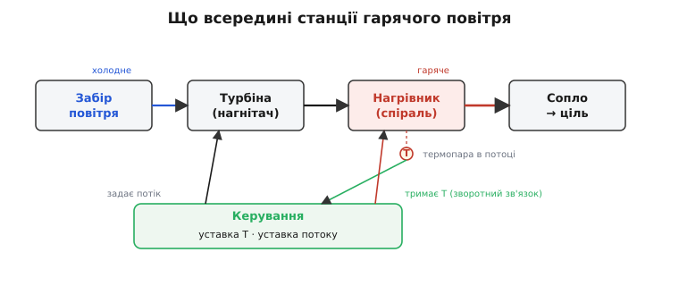
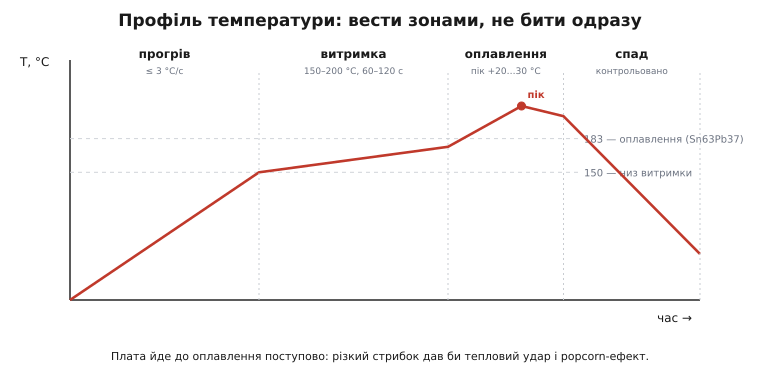
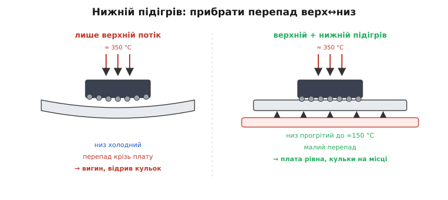

# 🔌 Станція гарячого повітря: коли тепло доводиться лити потоком

У темі ми вперлися в межу, де паяльник просто безсилий: контакти заховані **під** корпусом, на споді BGA чи великого QFN, і жалом туди не залізти — геометрія не лишає шпарини. Звідти й випливло єдине рішення: гріти не точку дотику, а **зону**, підняти всю ділянку плати до температури плавлення, щоб усі сховані з'єднання стали рідкими **водночас**, а далі поверхневий натяг сам стягне кожну кульку до свого майданчика. Інструмент, що це робить, — **паяльний фен** і його старший родич, **ремонтна станція гарячого повітря**. Розберімо його як клас: що в ньому всередині, чому саме так, як ним працювати й де він кусає за руки. Партномерів не буде — будова й правила однакові в кожного виробника, від двадцятидоларового фена до промислової ремонтної машини.

### Клас пристрою: нагрівник тепла без дотику

Назвімо річ точно. Перед нами **інструмент безконтактного нагрівання плати потоком гарячого повітря**. Усе сімейство — це варіації однієї ідеї на різних рівнях складності:

- **паяльний фен** (англ. *hot air gun*, *hot air pencil*) — ручний «олівець» або пістолет: турбіна жене повітря крізь нагрівальну спіраль, на виході — змінне сопло. Це робочий мінімум для столу й поля;
- **ремонтна станція гарячого повітря** (англ. *hot air rework station*) — той самий фен плюс точне керування температурою й потоком, а часто ще й **нижній підігрів** усієї плати знизу (інфрачервоною панеллю або зустрічним потоком повітря). Це інструмент для серйозного ремонту: BGA, великі корпуси, багатошарові плати.

Принципова відмінність від паяльника — у способі доставити тепло. Жало віддає тепло **дотиком** (теплопровідністю через площу контакту, як ми розбирали в темі); фен віддає його **рухомим повітрям** (вимушеною конвекцією — лат. *convectio*, «перенесення»). І саме «рухомим» тут — ключове слово, без якого не зрозуміти ні режимів, ні граблів.

> 🔧 **Навіщо це.** Поки на столі лише двовивідні деталі й корпуси з відкритими ніжками, фен не потрібен — паяльник швидший і точніший. Фен купують рівно тоді, коли вперше треба зняти або поставити корпус зі схованими контактами чи перепаяти мікросхему на сорок-вісімдесят ніжок без муки ловити кожну. Це не «кращий паяльник», а **інший інструмент під інший клас задач**: де жало безсиле геометрично.

### Чому рухоме повітря, а не просто гаряче

Спокуслива думка: якщо треба прогріти зону, чом би не покласти плату в гарячу шафу? Бо нерухоме повітря — **поганий провідник тепла**. Біля будь-якої гарячої поверхні застигає тонкий шар нерухомого повітря (англ. *boundary layer*, примежовий шар), і він працює як ковдра: тепло крізь нього просочується мляво. Саме тому в духовці їжа гріється повільно, а в духовці з вентилятором (конвекційній) — помітно швидше за ту саму температуру.

Фен робить рівно те саме на мікрорівні. Турбіна **зриває цей примежовий шар**: свіже гаряче повітря весь час підходить до поверхні плати замість того, щоб віддати тепло й застигнути поряд охолоджуючись. Тому потік переносить у плату набагато більше тепла за секунду, ніж та сама температура нерухомого повітря, — і робить це **керовано**: крутнув потік — змінив швидкість прогріву, не чіпаючи температуру.

Звідси одразу два важелі, якими ти керуєш, і їх не можна плутати. **Температура** повітря — це *стеля*, до якої може нагрітися ціль: вище за температуру струменя плата не підніметься хоч скільки чекай. **Потік** (швидкість повітря) — це *темп*, з яким ціль до тієї стелі підходить. Гаряче й повільно або тепліше й швидко можуть дати однаковий результат на з'єднанні — але зовсім різний на сусідніх деталях і на самому корпусі. Усе мистецтво фена — у грі цими двома важелями.

### Блок-схема: турбіна, нагрівник, керування

Усередині будь-якого фена, дешевого чи дорогого, той самий ланцюг із чотирьох ланок. Повітря заходить ззовні, турбіна (відцентровий нагнітач, у дешевих — мембранний мікрокомпресор) женеться його крізь **нагрівальну спіраль** (ніхромову або керамічну), розжарену електрикою, і виходить уже гарячим через **змінне сопло**, що формує струмінь. Це силова частина.

Але без керування цей ланцюг небезпечний: спіраль розжарюється до сотень градусів і без нагляду спалила б усе. Тому над силовою частиною стоїть **петля регулювання температури**. У потоці, біля самого нагрівника, сидить **термопара** (давач температури зі споюваних різнорідних металів — про неї нижче); вона весь час міряє, наскільки гаряче повітря йде з сопла, а керування підкручує струм у спіралі так, щоб температура трималася на твоїй уставці. Це класичний зворотний зв'язок: задав 350 °C — електроніка сама тримає 350 °C, гасячи й піддаючи нагрів.


*Тракт прямий: забір повітря → турбіна → нагрівник → сопло (за кольором стрілок — від холодного до гарячого). Термопара в потоці заміряє температуру струменя, а блок керування двома незалежними важелями тримає уставку температури (зворотним зв'язком на нагрівник) і задає потік (на турбіну).*

> 🔧 **Навіщо це.** Знаючи цю схему, розумієш дві типові несправності. Якщо фен «не гріє до уставки» — частіше винна не спіраль, а **термопара або контакт у ній**: давач бреше, що вже гаряче, і керування передчасно глушить нагрів. Якщо ж після вимкнення фен **продовжує гнати повітря ще пів хвилини** — це не поломка, а **обов'язкове продування**: турбіна женеться холодне повітря крізь розжарену спіраль, щоб та охолола й не перегоріла від власного залишкового жару. Вимикати фен «з розетки» одразу після роботи — вірний шлях спалити нагрівник.

#### Термопара: чому давач температури тут саме такий

Маленька, але повчальна деталь. Чому температуру струменя міряють **термопарою**, а не звичним давачем? Бо інші давачі тут або згоріли б, або були б надто повільні. Термопара — це просто **дві дротини з різних металів, споєні в точці**; на цьому стику народжується крихітна напруга, що залежить від температури (це **термоелектричний ефект**, який 1821 року описав німецький фізик-балт Томас Йоганн Зеебек — *Thomas Johann Seebeck*, родом із Ревеля, нинішнього Таллінна; це усталений факт). Спай — точкова, майже невагома цятка металу, тож вона **миттєво** відстежує температуру повітря, і їй байдуже до жару: робочі термопари спокійно живуть при сотнях градусів, де напівпровідниковий давач давно б помер.

Саме тому петля регулювання фена швидка: легка термопара не має теплової інерції й дає керуванню змінювати нагрів у реальному часі. Глибше про сам ефект і градуювання — в окремій книзі-атомі.

> 🌡️ Термопара — давач температури з двох споєних різнорідних металів: на стику виникає напруга, пропорційна різниці температур стику й вільних кінців (ефект Зеебека). Вона майже безінерційна й витримує дуже високі температури, тому годиться в потоці гарячого повітря, де звичайний давач згорів би.

### Сопла: формувати струмінь під розмір цілі

Сопло (англ. *nozzle*) — це не дрібний аксесуар, а спосіб **спрямувати тепло точно на ціль і нікуди більше**. Логіка добору проста й випливає з того, чим струмінь гірший за жало: повітря не вибирає мішень, воно гріє все, на що дме. Тож завдання сопла — **звузити струмінь до розміру корпуса**.

- **Вузьке кругле сопло** (кілька міліметрів) дає тонкий зосереджений струмінь — для дрібного: окрема двовивідна деталь, маленький SOT, точкова робота в тісноті між сусідами.
- **Широке кругле сопло** прогріває ширшу пляму — для корпусів середнього розміру, де треба рівно охопити всі ніжки одразу.
- **Профільне (квадратне/прямокутне) сопло під розмір корпуса** охоплює весь BGA чи QFP рівним кільцем гарячого повітря по периметру — так усі контакти доходять до плавлення **синхронно**, а центр корпуса не перегрівається. Це найкращий варіант для великих багатовивідних мікросхем.

Правило добору: сопло має бути **трохи більшим за корпус, але не набагато**. Завелике — гріє сусідів і марнує тепло; замале — доводиться водити феном по корпусу, контакти плавляться нерівномірно, один край відходить, поки другий ще твердий. Чим точніше сопло лягає на корпус, тим менше потрібен сам твій навик — геометрія робить роботу за тебе.

> 🔧 **Навіщо це.** Більшість «фен здуває дрібні деталі поряд» — це не завеликий потік, а **невдале сопло**: широкий струмінь б'є по всьому околу. Вузьке спрямоване сопло часто вирішує проблему краще, ніж прикручування потоку, бо лишає тепло там, де треба, і прибирає його звідти, де ні.

### Режими: температура й потік під клас корпуса

Тепер найголовніше — як виставляти два важелі. Загальної «правильної цифри» немає, бо все залежить від **припою під корпусом** і **маси, яку треба прогріти**. Але є логіка, з якої цифри виводяться.

**Температуру** ставлять із запасом над точкою плавлення припою — рівно як для жала в темі, лише тут струмінь гарячіший за саму ціль (повітря віддає тепло гірше за метал, тож стелю беруть вищою). Орієнтири перевірені:

```
припій під корпусом       плавлення      температура струменя
Sn63Pb37 (евтектика)      183 °C         ≈ 320–360 °C
SAC305 (безсвинцевий)     217 °C         ≈ 360–400 °C
```

Запас тут більший, ніж для жала, з простої причини: між соплом і з'єднанням лежить повітря й корпус, які з'їдають частину тепла, тож реальна температура на самій кульці завжди нижча за уставку струменя.

**Потік** добирають за масою цілі та за тим, чи є поруч щось, що здується. Велика мікросхема на товстій багатошаровій платі — це чималий теплоємний шмат металу; його прогрівають **вищим потоком**, бо інакше тепло витікатиме в мідь плати швидше, ніж надходить, і корпус ніколи не догріється. Дрібна деталь у тісноті — навпаки, **низький потік**, щоб не зірвати сусідів. Тут і ховається найчастіша пастка класу — про неї окремо нижче.

Окремий важіль на станціях — **темп нагріву**, тобто не одразу повна температура, а поступовий вихід на неї. Чому це критично, видно з повного теплового профілю.

### Тепловий профіль: чому не можна бити одразу

Завод не суне плату в піч на повний жар — він **веде** її температурою по чотирьох зонах, і ремонтник руками робить те саме. Це не примха, а захист плати й корпусів від теплового удару. Я перевірив цифри за галузевим стандартом J-STD-020, на який орієнтується вся індустрія; вони усталені.

```
зона            що відбувається                            орієнтир
1. прогрів      плата плавно гріється, випаровується        ≤ 3 °C/с
                розчинник з пасти/флюсу
2. витримка     тепло вирівнюється по платі, активується     150–200 °C, 60–120 с
   (soak)       флюс, оксиди очищаються
3. оплавлення   припій стає рідким, контакти зливаються,      пік на +20…30 °C
   (reflow)     поверхневий натяг центрує корпус             над плавленням
4. спад         плата охолоджується, припій застигає          контрольовано,
                                                              без різкого обдуву
```

Ще один параметр, який стереже завод, — **час над лінією плавлення** (англ. *time above liquidus*, TAL): скільки секунд припій лишається рідким. Норма — приблизно **60–150 секунд**, а в найгарячішій точці, у межах 5 °C від піка, плату тримають усього **20–30 секунд**. Сенс простий: припою треба встигнути розтектися й змочити метал, але **довше — лише шкода**: росте крихкий проміжний сплав на межі припою з міддю (інтерметалід), деградує сам корпус, повзе перегрів углиб плати.


*Плата йде до оплавлення не стрибком, а зонами: повільний прогрів (≤ 3 °C/с), витримка для вирівнювання тепла й активації флюсу, короткий пік на 20–30 °C над плавленням, тоді контрольований спад. Різкий стрибок одразу до піка дав би тепловий удар і popcorn-ефект.*

> 🔧 **Навіщо це.** Новачок ставить максимальну температуру й максимальний потік «щоб швидше» — і саме так колупає плати. Профіль — це твоя страховка: повільний прогрів не дає теплового удару, витримка вирівнює температуру по корпусу (щоб не сталося, що один край BGA вже плавиться, а другий ще холодний), короткий пік робить роботу й не встигає нашкодити. На простих станціях ти імітуєш профіль рукою: спершу гріє здаля широким струменем на середній температурі, потім підводь сопло й піднімай потік для оплавлення.

#### Popcorn-ефект: чому вологу мікросхему треба сушити

Окрема причина не бити одразу повним жаром, особливо в пластикові корпуси (BGA, QFN). Пластик їхнього корпуса з часом **вбирає вологу** з повітря, як губка. Якщо таку насичену вологою мікросхему різко нагріти до температури оплавлення, волога всередині **миттєво скипає в пару**, тиск пари рве пластик зсередини — корпус розшаровується чи здувається з характерним тріском, як зерно попкорну. Звідси й назва — **popcorn-ефект** (це усталений галузевий термін). Наслідок — тріщини, відшарування кристала, відмова деталі одразу або за місяці.

Тому корпуси, що довго лежали (особливо здерті з вологого складу чи зі старих плат), перед оплавленням **просушують** — витримують у сушарці при невисокій температурі (галузева рекомендація — близько 105–125 °C, години). А плавний профіль із зоною прогріву дає рештці вологи м'яко вийти, перш ніж припій стане рідким.

### Нижній підігрів: проти теплового удару й деформації

Тепер про найважливіший вузол серйозної станції, через який вона й коштує дорожче за простий фен. Уяви: ти дмеш гарячим струменем згори на корпус, а **низ плати лишається холодним**. Виникає різкий перепад температури **крізь товщу плати** — верх під 350 °C, низ ледь теплий. До чого це веде, видно з двох боків.

По-перше, **тепловий удар**. Будь-який різкий перепад температури — це механічна напруга: гаряче розширюється, холодне ні, і на межі між ними матеріал рве. Та сама фізика, що тріщить керамічний [конденсатор](root:hw-components/capacitor) при несиметричному прогріві в темі, тут рве більші речі — виводи, перехідні отвори, межі шарів. Глибше про передачу тепла й чому перепад небезпечний — у кроці курсу про теплопередачу.

> 🌡️ Тепло передається трьома шляхами — теплопровідністю (крізь тіло), конвекцією (рухомим повітрям чи рідиною) і випроміненням. Різкий перепад температури між сусідніми ділянками дає механічну напругу: гаряче розширюється, холодне ні, і на межі матеріал тріскається — це й є тепловий удар.

По-друге, **деформація багатошарівки**. Багатошарова плата (англ. *multilayer PCB*) — це бутерброд із кількох шарів міді й скловолокна, спечених разом. Нагрій його нерівномірно — верхні шари розширяться, нижні ні, і весь бутерброд **вигнеться**, як біметалева пластина. Для BGA це смертельно: коли плата під корпусом вигинається, кульки по краях масиву **відриваються** від своїх майданчиків, а коли плата охолоне й випрямиться — частина кульок уже застигла відірваними. Виходить «холодний» контакт там, де паяльником і не торкався.

Розв'язок — **нижній підігрів**: інфрачервона панель або зустрічний потік повітря знизу прогріває **всю плату** до помірних 130–160 °C *перед* тим, як зверху подати оплавлювальний жар. Тоді верхньому фену лишається додати невеликий перепад — від 150 °C до 217 °C, а не від кімнатних 25 °C. Перепад крізь плату малий, теплового удару нема, плата лишається рівною, кульки тримаються.


*Ліворуч: лише верхній струмінь — низ плати холодний, перепад крізь товщу вигинає багатошарівку, крайні кульки BGA відходять від майданчиків. Праворуч: нижній підігрів підняв усю плату до ≈150 °C, верхньому фену лишилось додати малий перепад — плата рівна, кульки на місці.*

> 🔧 **Навіщо це.** Нижній підігрів — це різниця між «зняв BGA й поставив новий за один підхід» і «плата вигнулась, половина кульок не контактує, грій по другому колу». Для дрібних корпусів на тонких платах ним можна знехтувати; для великих BGA на товстих багатошарівках без нього **не варто й починати** — інакше деформація з'їсть результат ще до того, як ти приберешся.

### Перший байт: як заговорити з феном

«Перший байт» для фена — це твоя перша вдала зміна корпуса. Покроково, на прикладі **демонтажу** мікросхеми (BGA чи великий QFN), де фен — єдиний інструмент:

```c
// Псевдопорядок руками (не код прошивки — послідовність дій):
// 1) Прикрити сусідні дрібні деталі термостійкою стрічкою (каптон).
// 2) Якщо є нижній підігрів — прогріти плату знизу до ~150 °C.
// 3) Поставити сопло під розмір корпуса; T ≈ 350 °C (Sn63Pb37) / ~390 °C (SAC).
// 4) Потік: помірний для дрібного, вищий для масивного корпуса на товстій платі.
// 5) Гріти зону рівномірно, кружляючи соплом по периметру корпуса.
// 6) Дочекатися, поки ВЕСЬ припій стане рідким (корпус ледь «плаває»).
// 7) Зняти корпус пінцетом одним рухом — БЕЗ ривка вниз чи вбік.
```

Як зрозуміти, що настав момент знімати? Корпус, чий весь припій уже рідкий, ледь помітно **«плаває»** на поверхневому натязі — його можна злегка зрушити пінцетом, і він повертається. Ось тоді, і ні секундою раніше, його піднімають **рівно вгору**, не дряпаючи майданчики. Поспішиш, коли частина припою ще тверда, — вирвеш майданчики разом з корпусом.

Установка нового корпуса — дзеркальна: на очищені й залужені майданчики кладуть корпус (для BGA — з нанесеними кульками), вирівнюють і гріють зону тим самим профілем, поки поверхневий натяг не **затягне** кожну кульку на своє місце з тим самим самоцентруванням, що ми бачили в темі. Тільки тепер воно працює по всьому масиву схованих контактів одразу — наосліп, але надійно, бо фізику не обдуриш.

> 🔧 **Навіщо це.** Найчастіша помилка першого разу — знімати корпус **зарано**, поки не весь припій рідкий. Терпіння тут — головний навик: грій, доки корпус сам не «попливе», і тільки тоді бери пінцет. Другий за частотою промах — **ривок**: тягнути корпус, поки він застигає. Знімати треба, поки рідко, рівно вгору, без бічних зусиль.

### Типові граблі класу

Кожна біда фена виростає з тієї самої властивості, що дає йому силу: **тепло доставляється рухомим повітрям, яке не вибирає мішень**. Звідси повний набір класичних помилок.

**Задертий потік здуває дрібні деталі.** Найзнаменитіші граблі. Поставив потік на максимум «щоб швидше прогріти» — і коли припій під сусіднім дрібним конденсатором розплавився, струмінь **здуває його з плати** або зсуває. Деталь шукай потім по всьому столу. Лік: потік **рівно стільки, скільки треба** для прогріву цілі, а сусідів прикрий стрічкою чи металевим екраном. Більший потік — не «потужніше», а «сильніше дме»; від нього тепла на цілі не сильно більше, а ризику здути сусідів — у рази.

**Перегрів плати від «гарячіше = краще».** Виставив 450 °C, бо «не плавиться» — і замість того, щоб розв'язати проблему, спалив флюс, обвуглив маску, переріс інтерметалід. «Не плавиться» феном, як і паяльником, майже завжди означає **брак флюсу або замалий потік/час**, а не замалу температуру. Підіймай флюс і терпіння, не градуси.

**Відшарування майданчиків (англ. *pad lift*).** Мідний майданчик тримається на платі шаром клею-смоли; перегрієш плату надовго — клей розм'якне, і майданчик **відходить** разом з корпусом, особливо коли тягнеш корпус, не дочекавшись повного розплаву. Це часто **невідновно**: майданчика більше нема, доведеться тягти перемичку до сусідньої доріжки. Захист — нижній підігрів (менший перепад, менший час верхнього жару), повний розплав перед зняттям і **жодних ривків**.

**Деформація багатошарівки** — уже розібрана: верхній жар без нижнього підігріву вигинає товсту плату, кульки BGA відходять. На тонких одно-двошарових платах це майже не загроза; на товстих багатошарових — головна причина невдалого монтажу BGA.

**Перегрів сусідів навколо цілі.** Навіть не здувши деталь, широкий струмінь може **переплавити** припій під сусідніми корпусами — і вони зсунуться чи відваляться непомітно, поки ти зосереджений на цілі. Тому сопло беруть під розмір корпуса, а не «з запасом», і прикривають окіл.

**Корпус «попкорнить».** Вологу мікросхему гріли різко, без просушування й без зони прогріву — пластик тріснув. Лік уже знаємо: сушити підозрілі корпуси, гріти плавним профілем.

> 🔧 **Навіщо це.** Помітна закономірність: майже всі граблі фена — це **надлишок** (надто потік, надто температура, надто поспіх), а не нестача. Інструмент карає за грубу силу. Хто працює феном спокійно — помірний потік, температура з невеликим запасом, повний прогрів перед зняттям, прикриті сусіди, — той міняє BGA без втрат; хто крутить усе на максимум «щоб швидше», той вчиться на зіпсованих платах.

### Варіації класу

Від дешевого до промислового змінюється не принцип, а **точність і автоматизація**:

- **Простий ручний фен** (часто в парі з паяльником в одній «дводільній» станції): уставка температури й потоку, термопара в потоці, продування при вимкненні. Профіль ведеш рукою. Цього досить для більшості ремонтів і дрібних BGA.
- **Цифрова станція з пам'яттю профілів**: екран, точне читання температури, **збережені профілі** (прогрів-витримка-пік-спад), часом давач температури плати окремо. Профіль відпрацьовує автоматично — повторюваність вища.
- **Станція з нижнім підігрівом** (ІЧ-панель або нижній фен): обов'язкова для великих BGA на товстих багатошарівках; знімає тепловий удар і деформацію, як розібрано вище.
- **Повна BGA-ремонтна машина**: верхній і нижній нагрів за заданим профілем під замкнутим керуванням, оптичне позиціонування корпуса, камера суміщення. Це вже заводський рівень — те саме фізичне ядро, обвішане автоматикою для повторюваності в потоці.

Як клас інструмента фен став масовим **наприкінці 1980-х — у 1990-х**, разом із поширенням поверхневого монтажу: коли деталі переїхали з ніжок-у-отвори на майданчики-на-поверхні, демонтаж жалом і відсмоктувачем перестав давати раду корпусам зі схованими контактами, і безконтактний прогрів зоною став безальтернативним (усталено за галузевими джерелами). Суть від найдешевшого фена до промислової машини не змінилась ні на йоту: турбіна, нагрівник, керована температура, потік під ціль — і та сама фізика поверхневого натягу, що сама ставить кожну кульку на місце, щойно припій став рідким.
