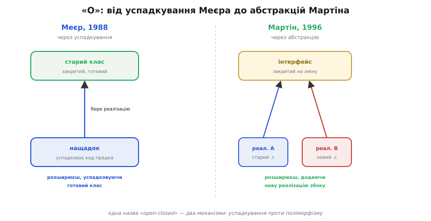
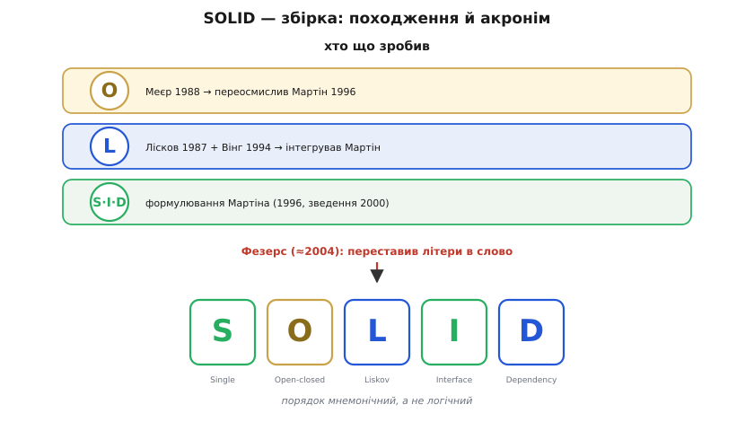

# 📜 Звідки взялися п'ять літер: історія SOLID

У головному кроці ми користувалися словом **SOLID** так, ніби воно завжди було — гарне, кругле, легко лягає на язик. Але назва бентежить рівно тим, що надто доладна: п'ять глибоких принципів проєктування, і всі п'ять, на диво, починаються рівно на ті літери, що складаються в слово «міцний». Так не буває з природними речами. Або хтось дуже постарався, або тут є історія — і вона є, причому повчальна. Бо ця історія розкриває те, що легко проґавити за зручним акронімом: **принципи й назва народилися окремо, у різний час і від різних людей**, а два з п'яти мають коріння глибше за все решта — у роботах, написаних ще до того, як Роберт Мартін узявся зводити їх докупи.

Знати цей родовід корисно не задля ерудиції. Він рятує від двох помилок. Перша — думати, що SOLID — це монолітне «вчення», яке хтось один вигадав цілим. Насправді це **збірка**: окремі правила, що визрівали в інженерній спільноті десятиліттями, і хтось їх зібрав, відібрав і дав спільне ім'я. Друга — приписати все одній людині. Як і з більшістю інженерних ідей (ми бачили це з [рівняннями пом'якшення](root:embedded/led-animation-patterns/hist-easing.md), де «винахід» був насправді впорядкуванням чужих формул), тут чесна атрибуція складніша за гасло «це придумав Дядько Боб».

## Що бентежило: код, що гниє

Почнімо з того самого, з чого починається головний крок, — з **гниття коду** (англ. *software rot*). Наприкінці 1980-х і в 1990-х об'єктно-орієнтоване програмування переживало бурхливу молодість: C++ виходив на широку сцену, усі вчилися ділити програму на класи, успадковувати, складати об'єкти. І швидко вилізла прикрість, яку молодий ентузіазм не передбачив. Об'єкти й класи самі собою не рятували від плутанини — навпаки, велика об'єктна система вміла загнивати так само, як і будь-яка інша, а часом ще й вигадливіше: успадкування плодило приховані зв'язки, зміна в базовому класі тихо ламала десяток похідних, а «гнучка» ієрархія за рік ставала клубком, який страшно чіпати.

Питання, що мучило інженерів того часу, звучало просто: **які саме рішення в проєктуванні роблять об'єктну систему стійкою до гниття, а які — крихкою?** Не «як писати класи синтаксично правильно» — це вже всі вміли, — а «як їх розставляти, щоб через два роки систему ще можна було розвивати, а не переписувати». Відповіді ходили розрізнено: одну ідею висловив хтось у книзі, іншу — хтось у статті, третю вивели з гіркого досвіду й переказували усно. Бракувало того самого, чого бракувало й Flash-аніматорам із попередньої історії, — **зібраного, названого, придатного для передавання набору**.

> 🔧 **Навіщо це.** Та сама біда, з якою боровся Мартін у 1990-х на серверних C++-системах, точнісінько повторюється у прошивці — лише ставки вищі. Драйвер, що за рік оброс логуванням і радіо; шар абстракції заліза, прибитий цвяхами до однієї моделі чипа; політика керування, яку не відірвати від периферії для тесту. Принципи, що визрівали тоді у великих об'єктних системах, лягають на вбудований C мало не дослівно — бо ворог один: зчеплення, що неконтрольовано росте.

## Хто зібрав: Роберт Мартін і колонка в C++ Report

Людина, що звела розрізнені правила в систему, — американський інженер **Роберт Сесіл Мартін** (*Robert Cecil Martin*, нар. 5 грудня 1952), якого галузь знає під прізвиськом «**Дядько Боб**» (*Uncle Bob*). Постать характерна: у програмування він прийшов сімнадцятирічним і **був самоуком** — без академічного диплома з інформатики, з практики. 1991 року заснував консалтингову й навчальну фірму **Object Mentor**, що вчила об'єктного проєктування й (згодом) екстремального програмування, а в середині 1990-х став **головним редактором журналу C++ Report** — тодішнього головного фахового видання про C++. *(Статус: усталено — біографія підтверджена його сторінкою й енциклопедичними джерелами.)*

Саме редакторство дало йому трибуну. У C++ Report Мартін вів авторську колонку «**Engineering Notebook**» («Інженерний записник»), і в ній **1996 року** один за одним вийшли тексти, що формулювали принципи поодинці. Першим — і програмним — був **«The Open-Closed Principle»** (січень 1996); за ним у тому-таки році йшли тексти про принцип підстановки, інверсію залежностей, сегрегацію інтерфейсів. Це ще не був SOLID — це були **окремі статті про окремі правила**, кожне зі своєю назвою, без спільної парасольки. *(Статус: усталено — статті C++ Report 1996 року задокументовані, OCP датовано січнем 1996.)*

Тут варто бути точним у дієсловах, бо в цьому вся сіль чесної історії. Мартін **не вигадав усі п'ять принципів з нуля**. Що він справді зробив — **відібрав, переформулював інженерною мовою, дав однакову подачу й зібрав в одне місце**. Деякі ідеї вже існували (про два з них — нижче, бо їхнє коріння глибше); інші він викристалізував із загального досвіду спільноти, надавши розпливчастим інтуїціям точне формулювання. Скажімо, **принцип єдиного обов'язку** (англ. *Single Responsibility*) у тій точній формі — «у модуля має бути рівно одна причина змінитися», — як ми її подали в головному кроці, — це саме Мартінове відточування давнішої туманної поради «модуль має робити одне». Робота збирача й формулювальника — не менша за роботу першовідкривача, але **це інша робота**, і змішувати їх означало б повторити ту саму імперію приписувань, від якої застерігає увесь курс.

Підсумок цього збирання Мартін виклав окремою працею — **«Design Principles and Design Patterns»** («Принципи проєктування й патерни проєктування»), що вийшла **2000 року** (copyright Robert C. Martin, 2000). Саме там п'ять принципів стоять разом, як свідома **«перша п'ятірка»** правил об'єктного проєктування проти гниття коду. Це і є той текст, на який спирається головний крок, коли каже, що «самі принципи сформулювали раніше». *(Статус: усталено — праця 2000 року з оригінальним копірайтом доступна в первинному вигляді.)*

```
рядок часу — формулювання принципів
  1988  Меєр: Open-Closed (через успадкування реалізації)
  1987  Лісков: підстановка (доповідь OOPSLA)
  1994  Лісков + Вінг: формалізація підтипізації
  1996  Мартін: колонка «Engineering Notebook» у C++ Report
        → OCP (січень), LSP, DIP, ISP — кожен окремою статтею
  2000  Мартін: «Design Principles and Design Patterns»
        → п'ять принципів зведені разом як «перша п'ятірка»
  2004  Фезерс: помічає, що літери складаються в SOLID
```

Зверніть увагу на дати в цьому рядку: два принципи (підстановки й «відкрите-закрите») мають коріння **раніше** за Мартінові статті. Це не випадковість і не дрібниця — це найцікавіша частина історії, і до неї ми зараз перейдемо.

## Глибше коріння «O»: Бертран Меєр і принцип відкритості-закритості

Літеру **O** — Open-Closed Principle — Мартін не вигадав. Він **успадкував саме слово** від людини, що ввела його за вісім років до його статті: швейцарсько-французького інформатика **Бертрана Меєра** (*Bertrand Meyer*). Меєр сформулював «принцип відкритості-закритості» (англ. *open–closed principle*) у своїй фундаментальній книзі **«Object-Oriented Software Construction»** («Побудова об'єктно-орієнтованого програмного забезпечення»), що вийшла **1988 року**. Це одна з найвпливовіших книг в історії об'єктного програмування взагалі, і термін «open-closed» прийшов саме звідти. *(Статус: усталено — авторство терміна за Меєром і рік книги підтверджені.)*

Але — і ось де історія стає по-справжньому повчальною — **Меєр мав на увазі не зовсім те, що Мартін**. Назва та сама, зміст усередині — різний. Розберімо обидва, бо різниця між ними — це маленький урок з історії самої ідеї.

**Версія Меєра (1988) трималася на успадкуванні реалізації.** Його логіка була така. Клас, який ти вже написав, відкомпілював і поклав у бібліотеку, де ним користуються інші, мусить бути **закритим** — стабільним, незмінним, бо від нього вже залежать. Але потреби ростуть, і клас треба якось **розширювати**. Як розширити, не чіпаючи закритого? Меєрова відповідь: через **успадкування**. Лишаєш старий клас недоторканим (він закритий), а нову поведінку додаєш у **похідному класі**, що успадковує старий і доточує/перевизначає, що треба (так клас лишається відкритим — будь-хто може породити від нього новий). Сам Меєр писав це приблизно так: клас закритий, бо його вже скомпільовано й використовують, — і водночас відкритий, бо будь-який новий клас може взяти його за предка й додати нові риси. Тобто механізм відкритості в Меєра — **успадкування реалізації** (англ. *implementation inheritance*): нащадок бере готовий код предка й надбудовує.

**Версія Мартіна (1996) переосмислила це через абстрактні інтерфейси.** За вісім років, що минули, спільнота набила гуль на успадкуванні реалізації: воно плодило тісне зчеплення нащадка з предком (нащадок знає й залежить від нутрощів предка), крихкі ієрархії та інші болячки. Мартін у своїй статті 1996 року переніс наголос: відкритість-закритість досягається не успадкуванням готового коду, а **залежністю від абстракції** — від **абстрактного інтерфейсу**, чия специфікація закрита на зміну, тоді як реалізацій за нею може бути скільки завгодно нових. Це рівно та картина, яку ми малювали в головному кроці на прикладі давачів тиску: політика залежить від абстрактного «давача», а кожна нова модель — це нова реалізація інтерфейсу, новий файл збоку; стара політика недоторкана. У літературі це пізніше так і назвали — **поліморфний принцип відкритості-закритості** (англ. *polymorphic OCP*), на відміну від давнішого, успадкувального. *(Статус: усталено — і Меєрове формулювання через успадкування, і Мартінове переосмислення через абстракції/поліморфізм задокументовані; стаття Мартіна — C++ Report, січень 1996.)*



*Та сама назва, два різні механізми. Ліворуч — Меєр, 1988: старий клас закритий, нову поведінку доточуємо в нащадку, що успадковує його реалізацію. Праворуч — Мартін, 1996: закритий не клас, а абстрактний інтерфейс; розширюємо, додаючи нові реалізації збоку, не чіпаючи ні інтерфейсу, ні старого коду. Назва перейшла від Меєра до Мартіна, а серцевина за вісім років змінилася — від успадкування до поліморфізму.*

Чому це варто знати інженерові, а не лише історику? Бо «O» — добрий приклад того, як **назва переживає свій первісний зміст**. Кажеш «open-closed», думаєш про абстрактні інтерфейси (Мартінова версія, та, що в SOLID), а слово прийшло від ідеї про успадкування (Меєрова версія). Якщо колись натрапите на старіший текст, де OCP пояснюють через успадкування реалізації, — це не помилка автора, а **первісне, Меєрове** значення. Обидва живі; знати треба, **котрим** ти користуєшся. У головному кроці й у нашому C-коді на vtable ми весь час маємо на увазі **поліморфну, Мартінову** версію — розширення через нові реалізації спільного інтерфейсу.

> 🔧 **Навіщо це.** У C, де класів і успадкування немає взагалі, Меєрова версія OCP буквально нездійсненна — нема чого успадковувати. А Мартінова — здійсненна повністю: абстрактний інтерфейс — це структура з вказівниками на функції, нова реалізація — новий `.c`-файл, що її заповнює. Тобто з двох історичних версій «O» прошивка на C природно бере саме пізнішу, поліморфну, — і це ще одна причина, чому для вбудованого коду важить саме Мартінове переосмислення, а не первісне Меєрове.

## Глибше коріння «L»: Барбара Лісков і умова на підтипи

Друга літера з глибоким корінням — **L**, Liskov Substitution Principle. І тут історія ще промовистіша, бо принцип **названо просто на честь людини**, чию ідею Мартін узяв і вбудував у свою п'ятірку. Літера «L» — не Мартінове слово й навіть не його формулювання; це **прізвище**.

Ідею висловила американська інформатикиня **Барбара Лісков** (*Barbara Liskov*) — постать першої величини в інформатиці, згодом лауреатка **премії Тюрінга** (2008, найвищої нагороди в галузі), професорка Массачусетського технологічного інституту (MIT). Сформулювала вона її **1987 року** в програмній доповіді на конференції OOPSLA під назвою **«Data Abstraction and Hierarchy»** («Абстракція даних та ієрархія»). Думка, яку вона там висловила, спершу звучала майже як обмовка, а виявилася наріжною: якщо `S` — підтип `T`, то об'єкти типу `S` мусять бути придатні скрізь, де програма очікує на `T`, **без зміни бажаних властивостей програми**. Інакше кажучи — підтип має бути справжнім різновидом, а не самозванцем, що лише вдає предка. *(Статус: усталено — доповідь Лісков 1987 року на OOPSLA та її формулювання задокументовані; премію Тюрінга Лісков здобула 2008-го.)*

Сім років по тому Лісков разом з іншою американською інформатикинею — **Жанет Вінг** (*Jeannette Wing*, теж згодом видатна постать, дослідниця в Карнегі-Меллон і Колумбійському університеті) — перетворили цю інтуїцію на **строгу математичну умову**. У статті **«A Behavioral Notion of Subtyping»** («Поведінкове поняття підтипізації»), що вийшла **1994 року** в журналі ACM Transactions on Programming Languages and Systems, вони дали точне означення, яке часто наводять у такій формі:

```
Нехай φ(x) — властивість, доведена для об'єктів x типу T.
Тоді φ(y) має бути істинною для об'єктів y типу S,
де S — підтип T.
```

Це і є **поведінкова підтипізація** (англ. *behavioral subtyping*): підтип успадковує не лише форму (набір методів), а й **усі доказувані властивості** предка — його обіцянки щодо поведінки. Саме звідси випливають ті чотири правила, що ми згадували в головному кроці (передумову можна тільки послаблювати, постумову — тільки посилювати, інваріанти зберігати, винятки не розширювати) — вони не вигадані наосліп, а **виведені** з цієї строгої умови Лісков і Вінг. *(Статус: усталено — стаття 1994 року, авторство й рік підтверджені; формулювання наведено в загальновживаному вигляді.)*

Тут теж є тонкість, варта точного дієслова. Мартін **не формулював** принцип підстановки — він **узяв готову, строго означену ідею Лісков (і Вінг) і вписав її у свою п'ятірку** як вимогу до тих самих реалізацій спільного інтерфейсу, про які йдеться в OCP та DIP. Тобто роль Мартіна щодо «L» — не автор, а **той, хто впізнав чужу фундаментальну ідею як необхідну ланку** свого набору й поставив її на правильне місце. Назвати «L» Мартіновим винаходом було б помилкою на кшталт тих імперських приписувань, від яких застерігає канон курсу: справжній автор ідеї — Лісков, формалізатори — Лісков і Вінг, а Мартінова заслуга — **інтеграція**, і вона теж справжня, але інша.

> 📜 Чому «збігу сигнатур замало» і як саме чотири правила випливають зі строгої умови Лісков-Вінг — окрема глибша тема. Поведінкова підтипізація означає, що підтип має зберігати весь [контракт](topic:programming/design-by-contract) предка, а не лише форму методів; повний розбір — у темі [Поведінкова підтипізація](topic:programming/behavioral-subtyping).

## Хто склав акронім: Майкл Фезерс і вдалий збіг літер

Отже, на 2000 рік ми маємо п'ять зведених разом принципів: один (SRP) — Мартінове відточування давньої поради, два (OCP, DIP) — Мартінові формулювання, де OCP ще й перейняв назву та переосмислив зміст Меєра, і два (LSP, ISP) — інтегровані чужі/спільні ідеї, де «L» — це строга умова Лісков і Вінг. **Назви SOLID ще немає.** Принципи ходять переліком, у якомусь порядку, без мнемонічної парасольки.

Останній штрих — і він теж не Мартінів — додав ще один інженер, **Майкл Фезерс** (*Michael Feathers*), знаний у галузі автор (зокрема книги про роботу зі старим, «успадкованим» кодом). Близько **2004 року** Фезерс звернув увагу на просту річ, яку доти ніхто не помічав: якщо взяти п'ять Мартінових принципів і **переставити їх у певному порядку**, то початкові літери їхніх назв — **S, O, L, I, D** — складаються в англійське слово **SOLID** («міцний», «надійний»). Він запропонував цей акронім Мартінові — і назва прижилася миттю, бо була ідеальною мнемонікою: п'ять окремих правил отримали одне коротке, змістовне, легко запам'ятовне ім'я. *(Статус: усталено в галузевому переказі — авторство акроніма за Фезерсом, близько 2004 року; це загальновизнана, багаторазово засвідчена історія, хоча й без єдиного «канонічного» першоджерела-дати.)*

Варто наголосити на двох речах, які цей фінал прояснює. По-перше, **акронім — це впорядкування, а не відкриття**: Фезерс не додав жодного нового принципу й не змінив жодного — він знайшов **порядок**, у якому наявні п'ять літер складаються в слово. По-друге — і це найважливіше для тверезого погляду — **порядок літер у SOLID мнемонічний, а не логічний**. Літери стоять так, щоб вийшло слово, а не за важливістю чи за залежністю одна від одної. Тому не варто читати в послідовності S→O→L→I→D жодного прихованого змісту — це не сходинки й не ієрархія. У головному кроці ми, навпаки, наприкінці показали справжній логічний зв'язок (усі п'ять — про стримування зчеплення, а DIP — серце); цей зміст у **природі** принципів, а не в **порядку** літер.



*Збірка у двох вимірах. Угорі — походження кожної літери: «O» прийшла від Меєра (1988) й переосмислена Мартіном; «L» — від Лісков (1987) і Лісков-Вінг (1994), інтегрована Мартіном; «S», «I», «D» — Мартінові формулювання (C++ Report, 1996; зведення 2000). Унизу — внесок Фезерса (≈2004): він не додав принципів, а знайшов порядок, у якому початкові літери складаються в слово SOLID. Назва — мнемоніка, а не логічна сходинка.*

## Що з цього винести

Ця історія дає три речі, корисні не лише для пам'яті, а й для тверезого розуміння самого SOLID.

**Перше — SOLID збірний, а не монолітний.** Це не вчення, що зійшло цілим з однієї голови, а **відібрана й названа збірка** правил, що визрівали в інженерній спільноті з кінця 1980-х. Розуміти його як збірку здоровіше: кожен принцип можна (і треба) зважувати окремо, застосовувати окремо, і жоден не святий лише тому, що потрапив до гарного акроніма. Саме тому в головному кроці ми й додали розділ «коли стримати запал»: збірка корисних правил — це інструмент під задачу, а не догма під виконання.

**Друге — чесна атрибуція тут не дрібниця.** Зведімо ролі без перекручень. **Бертран Меєр** (1988) увів сам термін і першу, успадкувальну версію OCP. **Барбара Лісков** (1987) висловила умову на підтипи, а вона ж із **Жанет Вінг** (1994) дала їй строгу форму. **Роберт Мартін** відточив SRP, сформулював свої версії решти (зокрема переосмислив OCP через абстракції 1996-го), інтегрував чужі ідеї й **звів усе разом** (2000). **Майкл Фезерс** (≈2004) дав назву. Жодне «це придумав Дядько Боб» не передає цієї картини — а сплощувати її означало б повторити рівно ту помилку колективного приписування одній постаті, від якої застерігає весь курс. Винаходи в інженерії майже завжди **колективні**, і SOLID — наочний приклад: ідея, формулювання, інтеграція, популяризація — чотири різні роботи чотирьох (а з Вінг — п'ятьох) різних людей.

**Третє — назва переживає зміст, тож звіряйся з джерелом.** «O» зберегла Меєрове слово, але несе Мартінів зміст; «L» — це прізвище, а не опис; порядок літер мнемонічний, а не логічний. Коли наступного разу почуєте впевнене «SOLID каже, що…», корисний рефлекс — спитати: **котра з версій, чий саме принцип, і чи це його зміст, чи лише його літера**. Той самий рефлекс, що рятує нас від імперських міфів в історії техніки, рятує й від поверхового розуміння власного інструмента: дивитися не на гарну обгортку, а на те, **хто, що й коли** насправді зробив.
