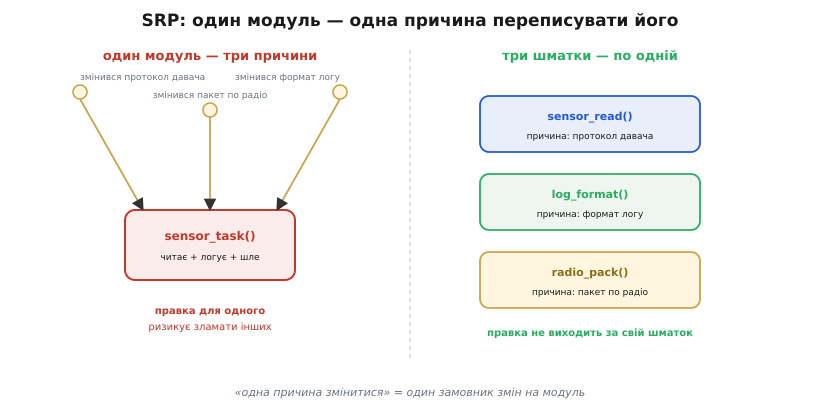
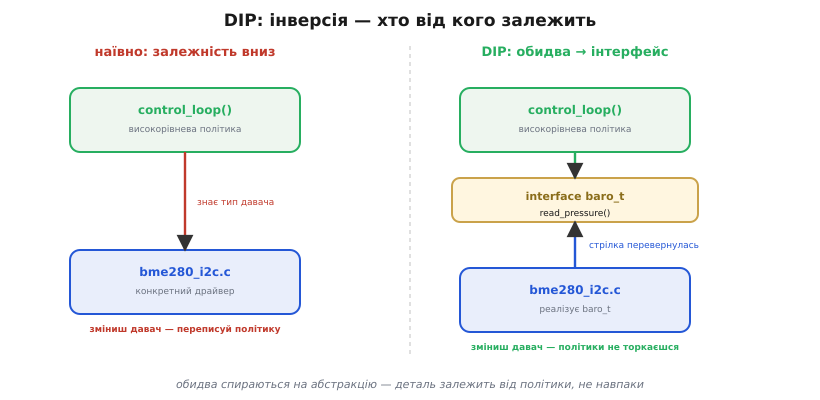
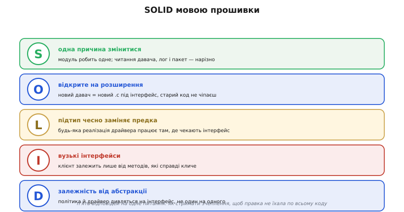

# Принципи SOLID

Прошивка рідко вмирає від одного великого провалу. Частіше вона **гниє** поволі: перший варіант чистий і зрозумілий, та з кожною правкою стає трохи заплутанішим, доки врешті будь-яка зміна не починає лякати — бо ніхто вже не певен, що ще вона зачепить. Класична картина: драйвер давача, який спершу просто читав температуру, за рік уже й логує, і пакує дані в радіопакет, і вмикає світлодіод тривоги. Тепер, щоб **підправити формат логу**, ви лізете в той самий файл, де живе обмін по шині, — і одним необережним рядком кладете давач. Зміна в одному місці б'є по тому, що з нею ніяк не пов'язане. Це не невдача програміста — це відсутність **меж**.

SOLID — це п'ять правил, які проводять ці межі свідомо, ще до того, як код почне гнити. Ім'я — мнемонічний акронім (англ. *acronym*, від грец. *ákron* — «край» + *ónoma* — «ім'я»: слово з початкових літер) з п'яти принципів: **S**ingle responsibility, **O**pen-closed, **L**iskov substitution, **I**nterface segregation, **D**ependency inversion. Самі принципи [сформулювали раніше](root:embedded/solid-principles/hist-solid-origin.md) — акронім лише зв'язав їх докупи й зробив запам'ятовним.

Зазвичай SOLID викладають мовою великих обʼєктно-орієнтованих систем — класи, успадкування, бізнес-логіка на сервері. Та суть його не в синтаксисі класів, а в **керуванні зчепленням** (англ. *coupling*: наскільки сильно один шматок коду залежить від іншого) — а ця біда у прошивці така сама гостра, як деінде, тільки ціна її вища: переписати помилку в полі, коли пристрій уже замурований у стіні, незрівнянно дорожче. Тому розберімо всі п'ять — але **мовою вбудованого C/C++**, де «обʼєкти» — це драйвери, шари абстракції заліза й модулі прошивки.

Одну межу ми вже провели в попередньому кроці: відділили **чисту логіку** від **доступу до заліза** швом, щоб логіку можна було тестувати на ПК без чипа. SOLID — це та сама думка, доведена до п'яти конкретних правил: де саме різати й чому.

> 🔧 **Навіщо це.** Прошивку пишуть роками й правлять руками багатьох людей; пристрій довго живе в полі, куди виправлення доставити важко. За таких умов головний ворог — не повільний алгоритм, а **код, який страшно чіпати**: коли невидимі зв'язки роблять кожну правку лотереєю. SOLID — це не академічна краса, а спосіб тримати прошивку такою, щоб через два роки в неї можна було сміливо внести зміну й не молитися.

## S — одна причина змінитися

**Single Responsibility Principle (SRP)** найчастіше переказують як «модуль має робити одне». Це наближення, і воно зраджує: «одне» — поняття гумове. Точніше формулювання Роберта Мартіна інше: **у модуля має бути рівно одна причина змінитися**. А причина зміни — це завжди хтось, кому щось знадобилося: інженер протоколу, відповідальний за формат логу, той, хто веде радіозв'язок. Кожен такий «замовник» тягне код у свій бік.

Повернімося до роздутого `sensor_task()`, що читає давач, форматує лог і пакує радіопакет. У нього **три** причини змінитися — бо за ним стоять три різні замовники. Змінився протокол давача — правимо цей файл. Змінився формат логу — знову цей самий файл. Змінився пакет по радіо — і знову він. Три незалежні мотузки тягнуть один шматок коду, і смикнувши за одну, ви хитаєте дві інші: правка формату логу проходить повз код шини, де помилитися — покласти давач.



*Зліва — `sensor_task()`, у якого три причини змінитися: протокол давача, формат логу, пакет по радіо. Правка для одного ризикує зачепити інших, бо вони в одному файлі. Справа — той самий код, розрізаний по осях змін: `sensor_read()`, `log_format()`, `radio_pack()`. Тепер у кожного шматка рівно один замовник, і правка не виходить за свої межі.*

Ліки — розрізати по **осях змін**: окремо читання давача, окремо форматування, окремо пакування. Тоді зміна формату логу зачіпає лише `log_format()` і фізично не може дотягнутися до коду шини. SRP не про те, щоб дрібнити код на крихітні функції заради дрібності, — а про те, щоб **речі, які міняються з різних причин, не жили в одному файлі**.

## O — відкрите на розширення, закрите на зміну

**Open-Closed Principle (OCP)** звучить як парадокс: модуль має бути водночас відкритим і закритим. Розгадка — у двох різних діях. **Відкритий на розширення** означає, що поведінку можна **додати**. **Закритий на зміну** — що додаєш ти, **не чіпаючи вже написаного й випробуваного коду**. Ідеал: нова можливість — це новий код збоку, а старий лишається недоторканим.

Уявіть функцію, що вміє говорити з трьома давачами тиску через `switch` по типу: гілка на кожну модель. Приїхав четвертий давач — і ви лізете в цей `switch` дописувати гілку. Файл, що працював роками, знову відкрито на правку — а отже, знову є шанс зламати три старі гілки заради однієї нової. Це **закрите на розширення, відкрите на зміну** — точно навпаки до того, чого хочеться.

OCP розвертає це через спільний **інтерфейс**. Політика працює з абстрактним «давачем тиску», не знаючи моделей; кожна модель — окрема реалізація цього інтерфейсу. Четвертий давач — це **новий файл**, що реалізує той самий інтерфейс; ні рядка в старій політиці міняти не треба. Поведінку **розширили**, код, який працював, лишили **закритим**. Як саме зробити такий інтерфейс у C, де немає класів, — нижче; це і є той прийом, що робить OCP можливим.

## L — підтип, що чесно заміняє предка

**Liskov Substitution Principle (LSP)** ставить умову на ті самі реалізації спільного інтерфейсу: будь-яку з них має бути можна підставити там, де код чекає на інтерфейс, — **і код не повинен помітити підміни**. Інакше OCP — пастка: ви додаєте новий драйвер «під той самий інтерфейс», а політика, написана під старі, з ним падає.

Звучить очевидно, та порушити це легко й тихо. Скажімо, інтерфейс давача обіцяє: `read()` повертає значення або код помилки, але **ніколи не блокує надовго**. Новий драйвер формально реалізує `read()` — та всередині чекає на повільну шину по пів секунди. Сигнатура та сама, **поведінка** інша; код керування, що розраховував на швидке повернення, зривається по таймінгу — і не там, де причина. Підтип лише **вдає** різновид, а насправді ним не є.

Це питання — коли один тип **по-справжньому** заміняє інший — глибше, ніж здається, і ми не розкриватимемо його тут. Воно строго розібране окремо: чотири правила (передумову можна лише послаблювати, постумову — лише посилювати, інваріанти зберігати, винятки не розширювати) і чому збігу сигнатур замало.

> 📜 Строге правило підстановки сформулювала **Барбара Лісков** (Barbara Liskov) 1987 року й уточнила 1994-го разом із Жанет Вінг — це **поведінкова підтипізація**: підтип має зберігати весь [контракт](topic:sf-release/design-by-contract) предка. Чотири правила, що з цього випливають, і їхній механізм — у темі [Поведінкова підтипізація](topic:sf-lang/behavioral-subtyping).

## I — вузькі інтерфейси замість одного товстого

**Interface Segregation Principle (ISP)** каже: **клієнт не має залежати від методів, яких не використовує**. Краще кілька вузьких інтерфейсів, кожен під свою потребу, ніж один товстий, що зібрав усе.

У прошивці це частий гріх роздутого шару абстракції заліза. Уявіть один інтерфейс «дисплей», що містить усе: намалювати піксель, прокрутити, керувати підсвіткою, читати тачскрін. Тепер код, якому треба лише блимнути підсвіткою, формально залежить від **усього** — зокрема й від тачскріну, якого на цій платі немає. Підсунути такому коду спрощену реалізацію (мок у тесті чи дисплей без сенсора) важко: доводиться затикати методи, які нікому не потрібні. А зміна в частині «тачскрін» перекомпільовує геть усіх клієнтів дисплея, навіть тих, хто його в очі не бачив.

Ліки — розрізати товстий інтерфейс на тонкі за ролями: окремо «малювання», окремо «підсвітка», окремо «дотик». Код бере рівно той шматок, який кличе, і ні від чого зайвого не залежить. ISP — це SRP, застосований до **інтерфейсів**: не звалюй у одну абстракцію речі, потрібні різним клієнтам.

## D — залежність від абстракції, а не від деталі

**Dependency Inversion Principle (DIP)** — серце всього й найвагоміший для прошивки. Звичайний порядок речей: високорівневий код (керування, політика) кличе низькорівневий (драйвер конкретного давача), а отже **залежить** від нього. Стрілка залежності дивиться вниз, до заліза. Наслідок: зміниш давач — мусиш переписувати політику, бо вона знає конкретну модель. Цінна, повільнозмінна логіка прив'язана до дрібної, часто змінюваної деталі — хвіст крутить собакою.

DIP розвертає стрілку. Між політикою й драйвером вставляють **абстракцію** — інтерфейс. Тепер **обидва** залежать від неї: політика кличе інтерфейс, а драйвер інтерфейс **реалізує**. Стрілка від драйвера тепер дивиться **вгору**, до абстракції, а не навпаки. Ось чому «інверсія» (англ. *inversion* — обертання): напрямок залежності перевернувся — деталь залежить від політики через спільний інтерфейс, а не політика від деталі.



*Зліва — наївно: `control_loop()` залежить прямо від `bme280_i2c.c`, знає конкретний давач; зміниш давач — переписуй політику. Справа — DIP: між ними інтерфейс `baro_t`; політика кличе інтерфейс, драйвер його реалізує. Стрілка від драйвера перевернулась угору — тепер деталь залежить від абстракції, і заміна давача політики не торкається.*

Цей самий прийом ми вже бачили в тестуванні: щоб відірвати логіку від заліза для перевірки на ПК, ми подавали залежність **ззовні** через шов — у бою справжній драйвер, у тесті мок. Те «впровадження залежності» і є DIP у дії: код не створює свою залежність сам, а приймає її готовою через інтерфейс. Тому DIP дає дві вигоди одним рухом: **гнучкість** (заміна драйвера без правки політики) і **тестовність** (підміна драйвера моком).

> 🔧 **Навіщо це.** DIP — це місток від «принципів» до тих самих швів, на яких тримається тестована прошивка. Без нього кожен виклик периферії зашитий прямо в логіку, і код неможливо ні перевірити без заліза, ні перенести на іншу плату. З ним заміна давача, портування на новий мікроконтролер і мок у тесті — це різні реалізації одного інтерфейсу, а політика лишається недоторканою. Як технічно зробити такий шов у C, докладно розбирає [тестування прошивки](root:embedded/firmware-testing).

## Як це робиться в C без класів

Тут постає чесне запитання: SOLID говорить про інтерфейси й підтипи, а в C немає ні класів, ні успадкування. Як же провести ці межі? Відповідь — двома прийомами, що дають OCP, LSP та DIP без жодного класу.

Перший — **непрозорий вказівник** (англ. *opaque pointer*: тип, чию структуру клієнт не бачить). У заголовку оголошуємо лише `typedef struct baro baro_t;` і функції над ним; поля ховаємо у `.c`-файлі. Клієнт тримає вказівник, кличе функції, але **не може** залізти всередину — це й є інкапсуляція руками. Другий — **структура з вказівниками на функції**, рукотворна таблиця методів (англ. *vtable*): інтерфейс — це структура з полями-функціями, а кожна реалізація заповнює їх своїми. Політика кличе `baro->read(baro)`, не знаючи, чий саме `read` там лежить, — справжній драйвер чи мок.

```c
// baro.h — інтерфейс: абстракція, від якої залежать обидві сторони
typedef struct baro baro_t;
struct baro {
    int (*read_pressure)(baro_t *self, uint32_t *out_pa);  // повертає 0 або код помилки
};

// політика залежить ЛИШЕ від baro_t — не від жодного драйвера (DIP)
int altitude_step(baro_t *baro, float *out_m) {
    uint32_t pa;
    int err = baro->read_pressure(baro, &pa);   // не знає, хто за інтерфейсом
    if (err) return err;
    *out_m = pressure_to_altitude(pa);
    return 0;
}
```

Новий давач — це новий `.c`, що заповнює `read_pressure` своєю функцією; `altitude_step` не змінюється ні на рядок (OCP). Будь-яка реалізація, що чесно тримає контракт «повернути 0 або код помилки, не блокувати», взаємозамінна (LSP). А в тесті на ПК ми кладемо в поле мок, що повертає сценарні значення, — і перевіряємо `altitude_step` без жодного давача (DIP як шов). П'ять абстрактних принципів зводяться до двох цілком земних прийомів C.

> ⚙️ Повний робочий приклад — заголовок інтерфейсу, два справжні драйвери (I2C і SPI), мок для тесту й хост-тест, що зшиває їх докупи, — з типовими пастками непрозорого вказівника й vtable у C: [Інтерфейс драйвера на vtable у C](root:embedded/solid-principles/proj-c-interfaces.md).

## Коли стримати запал

SOLID не безкоштовний, і це теж частина правди. Кожен інтерфейс — це зайвий рівень непрямого виклику (через вказівник на функцію, який компілятор часто не вбудує), трохи більше коду й більше файлів. На великій прошивці, що живе роками, ця ціна окуповується стократ. Та якщо ваша «система» — це блимання світлодіодом на 8-бітному чипі з двома кілобайтами пам'яті, обкладати єдиний драйвер інтерфейсами — марнування і місця, і ясності: ви додаєте машинерію розв'язування там, де нічого розв'язувати.

Правило тут таке саме, як скрізь у прошивці: **складність має заробити своє місце**. Заводьте інтерфейс там, де реально передбачаєте другу реалізацію (другий давач, мок для тесту, портування на інший чип) або де модуль став надто великим і його тягнуть у різні боки. Не заводьте — там, де реалізація завжди буде одна й мала. SOLID — це інструмент проти **зростання** зчеплення; де нема чому рости, нема й з чим боротися.



*П'ять принципів однією картою, мовою прошивки. S — модуль робить одне, з однієї причини. O — новий драйвер додається збоку, старий код не чіпаєш. L — будь-яка реалізація чесно заміняє інтерфейс. I — клієнт залежить лише від методів, які кличе. D — політика й драйвер дивляться на абстракцію, не один на одного. Це не п'ять окремих гасел, а п'ять відповідей на одне питання: як стримати зчеплення, щоб правка не їхала по всьому коду.*

Бо всі п'ять — про одне. SRP розрізає модулі по причинах змін; ISP розрізає так само інтерфейси; OCP додає нове, не чіпаючи старого; LSP стереже, щоб «нове» чесно лягало на місце; DIP перевертає залежність, щоб деталь корилася політиці. Разом вони не самоціль і не догма, а дисципліна проти однієї конкретної біди — **коду, який страшно чіпати**. А прошивці, яку не страшно чіпати, можна довіряти роками — і саме ця довіра, а не краса абревіатури, і є тим, заради чого SOLID варто знати.

---
