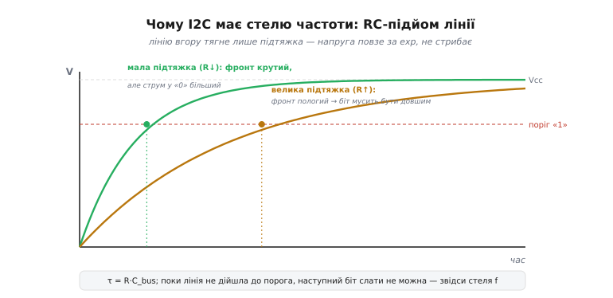
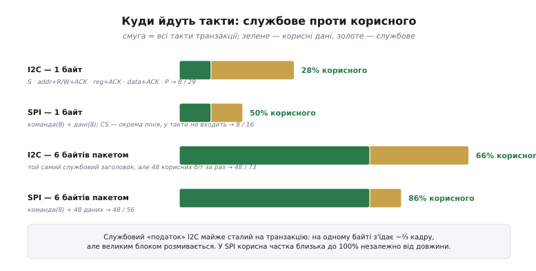
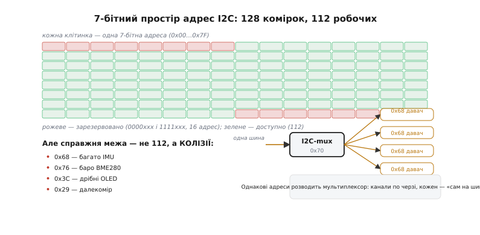
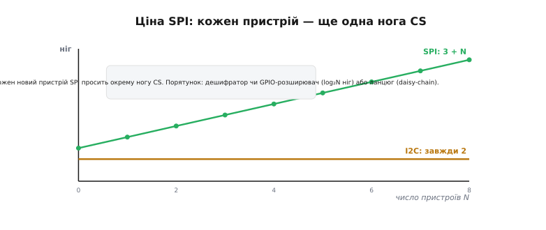
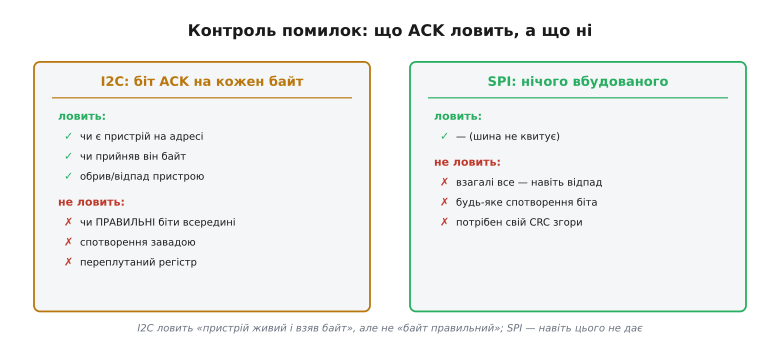

# SPI проти I2C — детально

У попередньому кроці ми звели вибір між [SPI](book:communications/spi-bus) і [I2C](book:communications/i2c-bus) до кількох простих правил: швидкість і потік — SPI, гроно дрібних давачів і мало ніжок — I2C, а найчастіше на платі — обидві разом. Ці правила працюють, і на щодень їх вистачає. Але вони — верхівка. Під кожним «за замовчуванням» лежить конкретна фізика й арифметика, і саме вона вирішує, де правило раптом ламається: чому I2C не розженеться, скільки насправді пристроїв на нього влізе, коли «мовчазний» SPI тихо віддасть сміття замість даних і чому додати шостий чіп на SPI буває дорожче, ніж здається.

Тут ми не переказуватимемо базовий крок, а **розкопаємо** його. Виведемо стелю частоти I2C з рівняння заряду лінії — не «десь три мегагерци», а звідки саме береться межа. Порахуємо, яка частка кадру насправді корисна, і побачимо, коли службовий податок I2C нищівний, а коли непомітний. Розберемо, чому семибітний простір адрес — це не 128 і навіть не 112 вільних місць, а куди менше через колізії, і як його розсовують. Пройдемо чотири режими такту SPI й покажемо, чому переплутаний режим дає не помилку, а зсунуті на біт дані. І доведемо до кінця думку про контроль помилок: що саме ACK ловить, чого не ловить ніколи, і чому на SPI цілісність — цілком на твоїй совісті.

Нитка та сама, що в базовому кроці, — **кожна шина виграє рівно в тому, на що націлена**, — але тепер ми побачимо механізм кожного виграшу й кожної розплати зсередини.

## Чому I2C має стелю частоти

Базовий крок казав: I2C повільний, десь до 3.4 МГц у найшвидшому режимі, тоді як SPI бере десятки. Це факт, але не пояснення. Пояснення починається з одного конструктивного рішення I2C, з якого випливає майже все інше: обидві лінії — [з відкритим стоком](book:electronics/open-drain) (англ. *open-drain* — «відкритий стік», бо стік вихідного транзистора нікуди не під'єднаний зсередини).

> 🔧 **Навіщо це.** Відкритий стік — не дрібна деталь схемотехніки, а корінь усього характеру I2C. Саме з нього ростуть і головна перевага (багато пристроїв на двох дротах без конфлікту виходів), і головна межа (стеля частоти). Не зрозумівши цей вузол, годі передбачити, де I2C зірветься на реальній платі.

Що це означає фізично. Кожен пристрій на шині може лінію тільки **притиснути до землі** — увімкнути свій нижній транзистор і злити струм. Підняти лінію до логічної одиниці не може **жоден** пристрій; угору її тягне єдиний зовнішній [резистор-підтяжка](book:communications/i2c-addressing) до живлення. Звідси відразу випливає, чому на шину можна повісити скільки завгодно пристроїв: якщо двоє водночас «говорять», гірше не стане — обидва лише тягнуть лінію донизу, конфлікту виходів (коли один штовхає вгору, а другий тягне вниз, і вони палять один одного струмом) просто не може виникнути. Це те, що робить I2C шиною, а не набором окремих зв'язків.

Але та сама конструкція ставить жорстку межу згори. Притиснути лінію донизу транзистор може **різко** — це активний, потужний прилад. А відпустити й дати їй піднятися — може тільки **пасивно**: транзистор вимикається, і лінію повільно тягне вгору кволий резистор. І от тут вступає фізика, якої не обійти. Будь-який провідник на платі, вхід кожного пристрою, кожен сантиметр доріжки має **ємність** відносно землі. Лінія разом з усіма причепленими входами — це, по суті, конденсатор `C_bus`. А резистор `R`, що заряджає цей конденсатор до живлення, разом із ним утворює [RC-коло](book:electronics/rc-filter) (англ. *resistor-capacitor* — «резистор-конденсатор»).

> 🔧 **Навіщо це.** Розуміння лінії як RC-кола — це той інструмент, яким інженер рахує підтяжку. Замалий резистор — і в стані «0» через нього тече надто великий струм, пристрій може не втягнути лінію достатньо низько; завеликий — і фронт розповзається, шина не тримає задану частоту. Правильне число — не з таблиці, а з цього рахунку.

Напруга на конденсаторі, який заряджають через резистор, не стрибає — вона **повзе за експонентою**:

```
V(t) = Vcc · (1 − e^(−t / τ))     де  τ = R · C_bus
```

Ось звідки береться стеля. Поки лінія піднімається від нуля до порога, за яким приймач упевнено бачить одиницю, наступний біт слати не можна — його просто не розрізнять на тлі недопіднятого фронту. Стандарт I2C формалізує це через **час наростання** `tr` — час, за який лінія проходить від 0.3·Vcc до 0.7·Vcc. І він жорстко обмежений: для стандартного режиму (100 кГц) — не більш як 1000 нс, для швидкого (400 кГц) — 300 нс, для Fast-mode Plus (1 МГц) — 120 нс. Полічімо, звідки ці числа.


*Лінію вгору тягне лише пасивна підтяжка, тож напруга повзе за exp, а не стрибає. Мала підтяжка (малий R) дає крутий фронт — але більший струм у стані «0». Велика підтяжка (великий R) економить струм, зате фронт пологий, і біт мусить бути довшим. Поки лінія не дійшла до порога, наступний біт слати не можна — звідси стеля частоти.*

**Приклад (звідки стеля 400 кГц при типовій ємності).** Візьмімо шину при межовій ємності `C_bus = 400 пФ` — це стеля, яку задає стандарт для стандартного й швидкого режимів, — і типову підтяжку. Скільки часу лінія піднімається до порога?

```
дано:  C_bus = 400 пФ = 400·10⁻¹² Ф
       R     = 1.6 кОм (типова підтяжка для швидкого режиму)
       поріг «1» ≈ 0.7·Vcc  (за визначенням tr стандарт бере 0.3…0.7)

τ = R · C_bus = 1.6·10³ · 400·10⁻¹² = 6.4·10⁻⁷ с = 640 нс

час від 0.3·Vcc до 0.7·Vcc:
  V/Vcc = 1 − e^(−t/τ)
  для 0.3:  t₃₀ = −τ·ln(1 − 0.3) = −640·ln(0.7) ≈ 228 нс
  для 0.7:  t₇₀ = −τ·ln(1 − 0.7) = −640·ln(0.3) ≈ 770 нс
  tr = t₇₀ − t₃₀ ≈ 542 нс
```

Отримані ~540 нс уже перевищують дозволені для швидкого режиму 300 нс — отже, з такою підтяжкою й такою ємністю шина 400 кГц не витягне: фронт задовгий. Щоб влізти в норму, треба або зменшити `R` (крутіший фронт, але більший струм витоку в стані «0»), або зменшити `C_bus` (коротші доріжки, менше пристроїв). А тепер видно й головне: **щоб піти на 1 МГц чи 3.4 МГц, стандарт мусив дозволити ще менший `tr`, а це вимагає або зовсім малих ємностей, або хитрих активних підтяжок** (у Hs-mode шина справді на час фронту підмикає струмове джерело замість простого резистора). Стеля частоти I2C — не примха комітету, а пряме рішення нерівності `tr ≤ (норма режиму)`, де `tr` росте разом із `R·C_bus`.

SPI цієї межі майже не має, і причина дзеркальна. Його лінії — [штовхай-тягни](book:communications/spi-lines) (англ. *push-pull* — «штовхай-тягни»): вихід активно **і** піднімає, **і** опускає лінію потужним транзистором в обидва боки. Фронт угору такий самий різкий, як і вниз, RC-повзання немає, тож такт можна гнати доти, доки встигає сам кремній приймача. Ось чому SPI живе на десятках мегагерц, а I2C впирається в одиниці: не тому, що «I2C повільний за задумом», а тому, що пасивний підйом відкритого стоку фізично не буває швидким на реальній ємності. Та сама відкритостокова конструкція, що дала I2C дешеве нарощування, забрала в нього швидкість — один компроміс, дві сторони.

## Куди йдуть такти: службове проти корисного

Другий вимір, у якому SPI випереджає, — **службовий податок**. Базовий крок сказав: у SPI службових біт майже немає, а I2C возить адресу й підтвердження на кожен байт. Тепер порахуємо цей податок точно, бо від нього залежить, коли різниця у швидкості кратна, а коли — на порядок.

Заведімо чесну міру: **коефіцієнт корисності** — частка тактів транзакції, що несуть власне дані, а не службу.

```
K = (корисні біти) / (усі біти транзакції)
```

Розберімо, з чого складається транзакція на кожній шині, коли треба прочитати з давача **один** регістровий байт.

На I2C один байт коштує напрочуд дорого. [Транзакція](book:communications/i2c-transaction) читання регістра — це насправді дві зчеплені операції. Спершу ведучий шле [умову старту](book:communications/start-stop-ack), потім адресу пристрою (7 біт) плюс біт напряму, і чекає підтвердження — біт ACK від пристрою. Далі шле номер регістра (8 біт) — знову ACK. Тоді — повторний старт, знову адреса з бітом «читання» — ще ACK. І лише тепер пливе корисний байт, за яким ведучий віддає свій ACK/NACK, і нарешті умова стопу. Полічімо такти:

```
S (старт)                         ~1
адреса+R/W (8) + ACK (1)          = 9
номер регістра (8) + ACK (1)      = 9
Sr (повторний старт)              ~1
адреса+R/W (8) + ACK (1)          = 9
корисний байт (8) + NACK (1)      = 9
P (стоп)                          ~1
─────────────────────────────────────
разом ≈ 39 тактів на 8 корисних біт
```

На один прочитаний байт іде близько 39 тактів — корисних із них 8. `K ≈ 8/39 ≈ 21%`. Чотири п'ятих смуги з'їдає службова обгортка адреси й квитувань. У SPI той самий одинарний доступ дешевший: ведучий опускає [CS](book:communications/chip-select), висуває байт-команду (номер регістра з бітом напряму, 8 тактів), тоді 8 тактів «порожнього», під час яких пристрій висуває дані. CS — окрема лінія, у такти не входить:

```
команда (8) + читання (8) = 16 тактів на 8 корисних біт
K = 8/16 = 50%
```

Половина проти п'ятої частини — SPI одразу вдвічі-втричі економніший на дрібному доступі. Але найцікавіше — що буде, коли читати не один байт, а **блок**.


*Смуга — це всі такти транзакції; зелене — корисні дані, золоте — службове. На одному байті службовий заголовок I2C з'їдає майже дві третини кадру, тоді як у SPI корисними лишається половина. Але великим блоком (шість байтів пакетом) сталий заголовок I2C розмивається, і його корисна частка підскакує; у SPI вона й так близька до максимуму незалежно від довжини.*

**Приклад (той самий службовий заголовок, розмитий блоком).** Прочитаймо шість поспіль регістрів давача — типове пакетне читання виміру (три осі по два байти). Службова частина I2C майже не змінюється: старт, адреса, регістр, повторний старт, адреса — а далі шість байтів течуть один за одним, кожен зі своїм ACK:

```
I2C, 6 байтів пакетом:
  службовий заголовок (S, addr, reg, Sr, addr) ≈ 29 тактів
  6 · (байт 8 + ACK 1)                          = 54 такти
  P                                             ~1
  ─────────────────────────────────────────────────
  ≈ 84 такти на 48 корисних біт → K ≈ 48/84 ≈ 57%

SPI, 6 байтів пакетом:
  команда (8) + 6·8 даних (48)                  = 56 тактів
  K = 48/56 ≈ 86%
```

Службовий заголовок I2C — майже **сталий на транзакцію**: заплатив за адресу й старт один раз, а далі кожен доданий байт коштує лише 9 тактів замість 39. Тому на одному байті `K` жалюгідні 21%, а на шести вже пристойні 57% — податок розмився. Звідси практичне правило, якого не було в базовому кроці: **на I2C читай пакетами, а не по байту**. Опитувати давач шістьма окремими однобайтовими транзакціями замість одного пакета — це втричі більше тактів на ту саму інформацію. У SPI ця різниця слабша (86% проти 50%), бо його заголовок і так крихітний, але й там блок вигідніший.

І от чому це вирішує на практиці, а не лише на папері. У жорсткому циклі керування — скажімо, стабілізації апарата, де давач треба опитати за фіксований бюджет часу — важить не тактова частота шини сама по собі, а **скільки корисних байтів вона віддасть за мілісекунду**. А це вже добуток частоти на `K`. I2C на 400 кГц з `K ≈ 21%` на дрібному доступі віддає корисних лише ~84 кбіт/с; SPI на 20 МГц з `K ≈ 86%` — понад 17 Мбіт/с. Різниця не «у п'ятдесят разів за частотою», а майже у двісті разів за корисним потоком. Ось справжня ціна службового податку.

## Скільки пристроїв насправді влізе на I2C

Базовий крок подавав головну перевагу I2C так: новий пристрій додається не дротом, а адресою. Це правда, і саме тому I2C незамінний на гроні дрібних давачів. Але «адресою» — означає, що адрес **скінченна кількість**, і тут ховається межа, про яку базовий крок мовчав. Розкопаймо її, бо об шматок цієї межі спотикається чи не кожен, хто вішає на шину другий однаковий давач.

Класична адреса I2C — **семибітна**. Сім біт — це 2⁷ = 128 різних значень, від 0x00 до 0x7F. Але не всі вони робочі: стандарт **резервує** краї простору. Адреси виду `0000xxx` (нижні вісім) і `1111xxx` (верхні вісім) віддані під службові потреби — загальний виклик, десятибітну адресацію, майбутні розширення. Лишається `128 − 16 = 112` придатних адрес.


*Сітка зі 128 комірок — увесь семибітний простір; рожеві краї (0000xxx і 1111xxx, разом 16 адрес) зарезервовані, зелених робочих лишається 112. Та справжня межа не 112: популярні класи чіпів масово сідають на ті самі кілька адрес (інерційні модулі на 0x68, барометри на 0x76, дрібні OLED на 0x3C), і два однакові пристрої конфліктують. Однакові адреси розводить мультиплексор — по черзі дає кожному канал, де він «сам на шині».*

Здавалося б, 112 — це вдосталь: хто вішає сотню давачів на одну плату? Але справжня межа — **не 112, а колізії**. Адресу пристрою призначає не ти, а виробник чіпа, зашивши її (часто з двома-трьома молодшими бітами, які можна перемкнути ніжками). І виробники масово тяжіють до тих самих «канонічних» адрес для свого класу пристроїв. Інерційні модулі десятками сидять на 0x68. Барометри — на 0x76. Дрібні OLED-дисплейчики — майже всі на 0x3C. Далекоміри — на 0x29. Тож щойно ти захотів **два однакові** давачі — скажімо, два барометри для різниці тисків, — вони обидва народжуються з адресою 0x76 і на одній шині одразу конфліктують: ведучий кличе 0x76, обидва відповідають, дані б'ються. Простір «на 112» вичерпується не тоді, коли ти повісив 112 чіпів, а тоді, коли повісив **два з однаковою зашитою адресою** — інколи вже на другому пристрої.

Розсовують цю тісноту трьома способами, і кожен варто знати.

Перший — **адресні ніжки**. Багато чіпів виводять один-три молодші біти адреси на зовнішні ніжки: під'єднав до землі чи до живлення — і той самий давач отримав іншу адресу. Це дає 2, 4 чи 8 копій одного пристрою на шині — але не більше, ніж дозволяє число ніжок. Два барометри BME280 так розводяться легко (одна ніжка → дві адреси), а от вісім однакових IMU з єдиною адресною ніжкою — уже ні.

Другий — [I2C-мультиплексор](book:communications/i2c-addressing/api-i2c-mux.md) (лат. *multiplex* — «багатоскладний»): окрема мікросхема, що сидить на головній шині за власною адресою й розгалужує її на кілька ізольованих під-шин. Ведучий каже мультиплексору «увімкни канал 3», і далі говорить із тим каналом так, ніби на ньому пристрій сам. Вісім однакових давачів на 0x68 висять на восьми каналах, і на кожному каналі 0x68 — унікальний. Ціна — зайва мікросхема, зайва адреса й те, що канали працюють **по черзі**, а не паралельно.

Третій — просто **друга шина**. Багато мікроконтролерів мають два (а то й більше) апаратних блоки I2C. Два однакові давачі можна розвести на дві фізичні шини — і жодних колізій, бо простір адрес у кожної шини свій. Це найдешевше рішення, коли пристроїв-двійників небагато, а вільний блок I2C у контролері є.

Порівняймо з SPI, щоб побачити протилежний компроміс. У SPI **немає адрес узагалі** — пристрій вибирає лінія CS. Тому проблеми колізій адрес не існує в принципі: хоч десять однакових давачів, кожен на своєму CS — і всі різняться. Але за це SPI платить рівно тим, від чого I2C рятував: **дротом на кожен пристрій**. Те, що на I2C виглядає як межа (скінченний простір адрес), на SPI обертається іншою межею (скінченне число вільних ніжок під CS). Один і той самий інженерний виклик — «як відрізнити пристрої на спільній шині» — дві шини розв'язали протилежно, і кожен розв'язок має власну стелю.

## Ціна SPI: лінії CS ростуть лінійно

Розкопаймо тепер розплату SPI, яку базовий крок згадав, але не довів до кінця: кожен пристрій вартий окремої лінії [вибору кристала](book:communications/chip-select) (англ. *chip select* — «вибір кристала»). Це просте твердження має нелінійні наслідки для плати, і саме вони інколи перевершують усі переваги швидкості.

Порахуймо ніжки як функцію числа пристроїв `N`. На I2C відповідь стала: `2` — дані й такт, скільки б пристроїв не було. На SPI три лінії спільні (такт, дані туди, дані назад), але CS — індивідуальний:

```
I2C:  ніжок = 2                (стала, не залежить від N)
SPI:  ніжок = 3 + N            (лінійно росте з кожним пристроєм)
```


*Число ніжок як функція кількості пристроїв. I2C тримається сталої лінії на двох — адреса замість дроту. SPI росте як 3 + N: три спільні лінії плюс окрема нога CS на кожен пристрій. На восьми пристроях це вже одинадцять ніжок проти двох. Порятунок — дешифратор чи GPIO-розширювач (log₂N ніг замість N), або ланцюг daisy-chain.*

На двох-трьох пристроях різниця дрібна: 5–6 ніжок SPI проти 2 в I2C — байдуже. Але зростання **лінійне**, і на восьми пристроях це вже `3 + 8 = 11` ніжок проти незмінних 2. На дрібному контролері, де кожна ніжка на рахунку, одинадцять ніжок під одну шину — розкіш, якої може просто не бути. Ось чому базове правило «багато дрібних пристроїв → I2C» тримається так міцно: не через швидкість, а через те, що `3 + N` упирається в бюджет ніжок задовго до того, як швидкість стане потрібна.

Але є три способи приборкати це зростання, і вони показують інженерну глибину теми.

**Дешифратор.** Замість тягти `N` ліній CS прямо з контролера, виведи `log₂N` ліній у дешифратор (англ. *decoder*) — мікросхему, що з двійкового числа на вході активує рівно один із `2ⁿ` виходів. Три ніжки контролера → дешифратор → вісім ліній CS. Число ніжок росте вже не як `N`, а як `log₂N`: щоб адресувати 8 пристроїв — 3 ніжки, 16 — 4, 256 — 8. Ціна — зайва мікросхема й те, що активним може бути лише **один** CS водночас (для SPI це якраз норма, тож обмеження безкоштовне).

**GPIO-розширювач.** Якщо вільних ніжок майже нема, лінії CS можна винести на розширювач портів — часто на тому самому I2C. Тоді SPI-пристрої вибираються через I2C-керовані ніжки. Виходить гібрид: швидкі дані течуть по SPI, а повільне перемикання CS — по економному I2C. Красива ілюстрація думки базового кроку, що шини не конкурують, а доповнюють одна одну.

**Ланцюг (daisy-chain).** Деякі SPI-пристрої вміють ставати в **ланцюг**: вихід даних одного заходить у вхід наступного, і всі діляться **одним** CS. Ведучий вкидає в ланцюг довгий потік, що прошиває всі пристрої наскрізь, як намистини на нитці. Ніжок — стільки ж, як на один пристрій, скільки б їх не було. Але не всі чіпи це підтримують, і протокол ускладнюється: тепер треба точно знати, скільки біт кому призначено в наскрізному потоці. Ланцюг перетворює `3 + N` знову на константу — ціною того, що пристрої мусять бути спеціально для цього придатні.

Зведімо обидві межі поряд, бо разом вони і є суть вибору. I2C платить за нарощування **простором адрес** (стеля — колізії, ~112 теоретично, часто одиниці на практиці), SPI — **ніжками** (стеля — `3 + N`, зазвичай кілька до десятка). I2C приборкують мультиплексором, SPI — дешифратором чи ланцюгом. Симетрія повна: обидві шини нарощуються, обидві мають стелю нарощування, і виграє та, чия стеля в **твоїй** конкретній платі далі — багато вільних ніжок і однакові пристрої штовхають до SPI, обмаль ніжок і різні пристрої — до I2C.

## Чотири режими такту SPI, яких I2C не має

Є вимір, де SPI не просто інший, а **складніший** за I2C, і базовий крок його зовсім не торкнувся, бо на рівні порівняння він не потрібен. Але для реальної роботи він критичний: SPI не має єдиного узгодженого способу, **коли саме** ловити біт з лінії. Їх чотири, вони звуться [режимами CPOL/CPHA](book:communications/cpol-cpha), і переплутати їх — класична причина, чому «правильно під'єднаний» пристрій віддає сміття.

Річ у тім, що SPI — синхронна шина: біт дійсний не «десь у часі», а **відносно фронту такту**. Але фронтів у кожного періоду два — наростання і спадання, — і рівень такту в спокої теж може бути двох сортів. Дві двійкові ознаки дають чотири комбінації:

```
CPOL (полярність такту): такт у спокої — 0 (низький) чи 1 (високий)
CPHA (фаза такту):       біт ловлять на ПЕРШОМУ фронті чи на ДРУГОМУ

           CPHA=0            CPHA=1
CPOL=0   режим 0           режим 1
CPOL=1   режим 2           режим 3
```

I2C цієї свободи не має взагалі: у нього такт завжди в спокої високий (відкритий стік!), а дані читаються, поки такт високий, — один-єдиний узгоджений спосіб на всіх. Це ще один бік того самого компромісу: жорсткіший, менш гнучкий I2C **не дає чого плутати**, а вільніший SPI дає аж чотири способи — і перекладає узгодження на розробника.

**CPOL** — це просто рівень такту, коли обміну немає. При `CPOL=0` лінія такту в спокої притиснута до нуля, і активні імпульси йдуть угору. При `CPOL=1` — навпаки, у спокої високо, імпульси вниз. Саме по собі це майже нешкідливо; головну кашу заварює друга ознака.

**CPHA** — на **котрому** фронті кожного періоду приймач фіксує біт. При `CPHA=0` біт ловлять на **першому** фронті періоду (передньому), а виставляють — заздалегідь, ще до нього. При `CPHA=1` навпаки: виставляють на першому фронті, а ловлять на **другому** (задньому). Ця різниця тонка, але наслідок грубий.

Ось чому переплутати режим гірше, ніж здається. Уяви, ведучий налаштований на `CPHA=0` (ловить на першому фронті), а пристрій очікує `CPHA=1` (виставляє на першому фронті). Тоді в мить, коли ведучий уже читає лінію, пристрій **щойно почав** її змінювати — біт ще не встояв. Приймач ухопить або старе значення, або перехідний брязкіт. І — головне — на виході це виглядає **не як помилка, а як зсунуті на один біт дані**: кожен байт наче поділений навпіл і склеєний із сусідом. Апарат не свариться, обмін «іде», але число, яке ти читаєш, — сміття, зсунуте відносно правди. Це підступніше за будь-який явний збій: шукати доводиться не обрив, а тихе спотворення значень.

> 🔧 **Навіщо це.** Перше, що дивишся в технічному описі SPI-пристрою, — його режим (часто пишуть як «SPI Mode 0» чи «CPOL=0, CPHA=0»). І перше, що звіряєш, коли пристрій віддає ніби-дані, але безглузді, — чи збіглися режими ведучого й веденого. Понад половина «не працює SPI» — саме розбіжність режиму або порядку біт (старший чи молодший уперед), а не поганий дріт.

Практичний висновок такий. Абсолютна більшість пристроїв живе в режимі 0 (`CPOL=0, CPHA=0`) — це негласний найпоширеніший вибір. Тому, беручи новий чіп, спершу пробуй режим 0; якщо дані зсунуті або перевернуті — лізь у технічний опис і став точно вказаний режим. І пам'ятай про порожню, але злу пастку: якщо на одній шині SPI висять пристрої **різних** режимів, ведучий мусить **перемикати** режим перед зверненням до кожного — інакше він говоритиме з одним у чужому для того такті. I2C такого класу помилок не має взагалі — ще одна ціна його жорсткості, обернена на перевагу.

## Розтягування такту: єдиний зворотний зв'язок за швидкістю

Є одна здатність I2C, якої в SPI немає навіть у зародку, і вона тонко змінює саму природу того, хто керує темпом обміну. Зветься вона **розтягування такту** (англ. *clock stretching* — «розтягування такту»), і випливає, знову ж таки, з відкритого стоку.

Згадаймо: такт `SCL` теж лінія з відкритим стоком, її вгору тягне підтяжка, а вниз — будь-який пристрій. Ведучий задає темп, притискаючи `SCL` то вниз, то відпускаючи. Але оскільки **притиснути** лінію може й ведений, він має право не відпустити `SCL`, коли ведучий уже хотів би пустити її вгору для наступного такту. Поки ведений тримає `SCL` унизу, ведучий фізично не може підняти лінію (пасивна підтяжка проти активного притискання завжди програє) — і мусить **чекати**. Це і є розтягування: ведений каже «стій, я ще не готовий», просто не відпускаючи такт.

Навіщо це потрібно. Уяви давач, який на команду читання мусить спершу зробити перетворення — виміряти, порахувати — і лише тоді має дані. На SPI такого зворотного зв'язку немає: ведучий жене такт у своєму темпі, і якщо пристрій не встиг — віддасть недороблене, а ведучий цього не помітить (SPI ж нічого не квитує). На I2C пристрій просто притримує `SCL`, доки не буде готовий, і ведучий терпляче чекає. Шина сама, на рівні заліза, підлаштовується під найповільнішого учасника.

Це ще один вияв глибшої різниці. I2C — шина з **двобічним** узгодженням: не лише ведучий керує веденим, а й ведений має важіль назад (притримати такт, не дати ACK). SPI — шина суто **однобічна**: ведучий диктує все — темп, момент, тривалість, — а ведений тільки підкоряється, не маючи як заперечити. Тому I2C стійкіший до повільних чи заклопотаних пристроїв, а SPI — швидший, але вимагає, щоб ведучий **сам** знав і поважав часові межі кожного пристрою. Гнучкість проти швидкості, і корінь той самий — активні лінії SPI проти відкритого стоку I2C.

Пастка тут у тому, що розтягування такту підтримують не всі ведучі однаково добре. Дешеві програмні реалізації I2C (коли шину «смикають» ніжками вручну, без апаратного блоку) інколи ігнорують розтягування — не перевіряють, чи справді `SCL` піднявся, перш ніж слати далі. З таким ведучим повільний пристрій, що розтягує такт, даватиме збої на рівному місці. Тому, обираючи давач, який відомо розтягує такт, варто впевнитися, що апаратний блок I2C у контролері це коректно підтримує — більшість сучасних підтримують, але дуже дрібні чи саморобні — не завжди.

## Кілька ведучих: арбітраж, якого SPI не вміє

Останній вимір, де I2C принципово багатший, — **кілька ведучих на одній шині**. Базовий крок згадав, що I2C це вміє, а SPI зазвичай ні. Розкопаймо, як саме I2C розрулює двох ведучих, що заговорили водночас, — бо це елегантний механізм, який знову-таки виростає з відкритого стоку, і бо він показує межу, за якою I2C теж здається.

Уяви двох ведучих (два контролери на спільній шині), що обидва вирішили почати передачу в один момент. На push-pull-шині це була б катастрофа: один штовхає лінію вгору, другий тягне вниз, вони палять струм і б'ють дані. Але на відкритому стоку — ні. Обидва можуть лінію тільки **притискати**. І тут працює просте фізичне правило: якщо хоч один притискає лінію донизу, вона **внизу**, хоч би скільки інших її відпускали. Лінія показує логічне «І» всіх виходів — досить одного нуля, щоб вона стала нулем.

На цьому й будується арбітраж. Обидва ведучі шлють свої адреси біт за бітом і **водночас читають лінію назад**. Поки їхні біти однакові — жоден не знає про суперника, обмін наче звичайний. Але щойно біти розійшлися — один шле «1» (відпускає лінію), другий «0» (притискає), — лінія фізично стає «0». Ведучий, що слав «1», читає з лінії «0» — **не те, що слав**, — і з цього миттєво розуміє: на шині є хтось іще, і той інший переміг. Він **тихо відступає**, не псуючи чужу передачу, а той, що слав «0», навіть не помічає боротьби — його передача триває неушкоджено. Переможець визначається без жодного окремого «судді»: сама фізика лінії й правило «нуль сильніший» усе вирішують.

Це вражаюче ощадливий механізм — арбітраж без арбітра, без окремих ліній, без протоколу перемовин, просто з електричної природи відкритого стоку. І помітьте наслідок: виграє той, чия адреса **менша** (більше нулів у старших бітах), бо нуль перемагає одиницю. Це не випадковість, а вбудований пріоритет.

SPI так не вміє в принципі. Його push-pull-виходи не дають зробити «нуль сильніший за одиницю» — два ведучі просто спалили б лінії. Тому SPI майже завжди має рівно **одного** ведучого; кілька ведучих на SPI роблять хіба зовнішніми хитрощами (перемиканням, хто зараз ведучий), а не вбудованим арбітражем. Це ще одне місце, де жорсткість відкритого стоку виявляється несподіваною перевагою: те, що обмежує швидкість, водночас дарує безкоштовний арбітраж.

Та ось де I2C, попри всю елегантність, здається сам. Багатоведучий режим на практиці **рідкісний і крихкий**. Він ускладнює кожного ведучого (той мусить постійно звіряти лінію, вміти відступати, повертатися), погано дружить із розтягуванням такту від різних сторін і в реальних платах приносить більше клопоту, ніж користі. Тому переважна більшість систем — навіть на I2C — тримають **одного** ведучого (мікроконтролер) і купу ведених. Механізм арбітражу існує, він красивий, але в щоденній розробці ним користуються нечасто. Це чесна деталь, якої не було в базовому кроці: «I2C підтримує кілька ведучих» — правда на папері, але на практиці цим майже не користуються, і закладати на це архітектуру варто лише за справжньої потреби.

## Контроль помилок: що ACK ловить, а що ні

Найважливіша різниця, яку базовий крок лише назвав, — **вбудований контроль помилок**. I2C квитує кожен байт, SPI не квитує нічого. Це звучить як чиста перевага I2C, і саме тому варто розкопати до дна: бо ACK ловить **не те**, що більшість гадає, а на SPI цілісність — узагалі поза шиною.

Розберімо спершу, що таке ACK механічно. Після кожних восьми біт передавач **відпускає** лінію даних (згадуємо відкритий стік), а приймач протягом дев'ятого такту або притискає її донизу (ACK, «взяв»), або лишає вгорі (NACK, «не взяв»). Передавач читає цей дев'ятий біт і знає, чи дійшло. Просто, дешево, вбудовано в кожен байт.

А тепер — головне питання, яке всі проминають: **що саме** цей ACK підтверджує?


*Дві колонки чесно показують межу. I2C з бітом ACK ловить: чи є пристрій на адресі, чи він прийняв байт, чи не відпав. Але НЕ ловить: чи правильні біти всередині байта, спотворення завадою, переплутаний регістр. SPI не має вбудованого нічого — не бачить навіть відпаду пристрою; будь-яку перевірку доводиться будувати згори власним CRC.*

ACK підтверджує рівно одне: **пристрій на цій адресі існує, живий і фізично прийняв вісім біт**. Це справді цінно. Якщо давач відпав, згорів, не запаявся чи ти назвав неіснуючу адресу — ти отримаєш NACK **одразу**, ще на адресному байті, і дізнаєшся про біду в ту ж мить. На SPI це неможливо: опустив CS у порожнечу, повисував такти — і отримав назад суцільні одиниці чи нулі (лінія без пристрою просто висить), нічим не відрізнивши «пристрій відповів» від «пристрою нема». Ось перша чесна перевага I2C: він бачить **присутність і живість** пристрою вбудовано.

Але — і це вирішальне — ACK **не бачить змісту**. Він підтверджує, що байт **прийнято**, а не що байт **правильний**. Якщо завада перекинула біт усередині байта, приймач однаково видасть ACK: він же отримав вісім біт, звідки йому знати, що третій мав бути нулем, а прийшла одиниця? ACK ловить обрив і відпад, але **не ловить спотворення**. Так само він не помітить, що ти звернувся не до того регістра, чи що пристрій повернув застаріле значення. Уся сімейка помилок «дані дійшли, але неправильні» проходить крізь ACK безслідно.

Звідси розвіюється поширена ілюзія, що «на I2C цілісність гарантована, а на SPI — ні». Насправді **жодна** з шин не гарантує правильність **вмісту**. I2C гарантує лише **доставлення** (дійшло/не дійшло), і то на рівні цілого байта, а не біт. Для справді критичних даних — на **обох** шинах — потрібен контроль вищого рівня: [контрольне число CRC](book:communications/crc) (англ. *cyclic redundancy check* — «циклічна надлишкова перевірка»), звірка сталого регістра-підпису (майже кожен давач має регістр `WHO_AM_I` зі сталим значенням — прочитав, звірив, переконався, що говориш із тим і біти не перекинуті), або повторне читання з порівнянням. I2C економить тобі перевірку **присутності**, але не перевірку **правильності**.

Тепер стає видно всю глибину різниці в контролі. На I2C у тебе безкоштовно є відповідь на «чи пристрій там і взяв байт» — і цього досить для більшості дрібних давачів, де завад мало, а обрив трапляється частіше за спотворення. На SPI ти не маєш **нічого** — навіть присутності; кожну перевірку, від «чи пристрій живий» до «чи біти правильні», доводиться будувати самому поверх шини. Це не робить SPI поганим — на швидкій короткій доріжці всередині плати завад майже нема, і відсутність контролю не болить; але робить його **відповідальнішим**: тиша SPI означає не «все гаразд», а «шина не має чим тобі сказати, гаразд чи ні».

Саме цю різницю в коді ми й побачили в базовому кроці — I2C-гілка обгортки повертає чесний код помилки, а SPI-гілка беззастережний нуль. Тепер зрозуміло, що це не недбалість, а точне відображення фізики: одна шина має чим підтвердити байт, друга — ні. Як зібрати обидві під спільною обгорткою так, щоб ця різниця жила в одній точці, а не розповзалася кодом, розібрано у вставці [одна плата, дві шини](root:embedded/spi-vs-i2c/proj-bus-abstraction.md).

## Де закінчуються обидві: відстань і завади

Наостанок доведімо до кінця думку, якою базовий крок лише махнув наприкінці: «метри або кабель із завадами → ні те, ні те». Тепер, знаючи внутрішню механіку, ми можемо сказати **чому** саме — і чому межа для обох шин лежить приблизно там само, хоч причини різні.

I2C впирається у відстань через ту саму RC-стелю, яку ми вивели на початку. Що довший провід, то більша `C_bus` — кожен сантиметр додає ємності. А ми бачили: `tr = R·C_bus`, і фронт розповзається пропорційно ємності. Метр дроту легко додає сотні пікофарад, `C_bus` вилітає за стандартні 400 пФ, фронт стає такий пологий, що навіть на 100 кГц лінія не встигає піднятися. I2C фізично **не про метри** — його відкритий стік і пасивна підтяжка захлинаються на ємності довгого проводу. (Є буфери-підсилювачі I2C, що продовжують шину, але це вже окремий прилад і окремий клопіт.)

SPI впирається в іншу стіну — **цілісність сигналу на швидкості**. Його push-pull-фронти круті, і на короткій доріжці це благо, але на довгому проводі круті фронти обертаються бідою: сигнал починає **відбиватися** від неузгодженого кінця лінії, як хвиля від стіни, і накладатися сам на себе. На десятках мегагерц довгий неузгоджений провід перетворює чіткий фронт на брязкіт із відлунь. До того ж SPI не має **жодного** захисту від завад (ми щойно бачили — нуль контролю), тож на кабель, де наводяться перешкоди, він віддасть спотворене й не поскаржиться. SPI фізично **не про метри** з протилежної причини: не пасивність, а навпаки — надто різкі фронти й нуль завадостійкості.

І ось чому обидві межі сходяться приблизно в одну точку — **сантиметри плати, не метри кабелю**. За цією межею обидві шини здаються, і починається зовсім інша інженерія: [диференційна пара](book:communications/differential-pair) (лат. *differentia* — «різниця»), де сигнал несуть **два** проводи протифазно, а приймач читає їхню **різницю**. Завада наводиться на обидва проводи однаково й у різниці **зникає** — тому диференційні шини (RS-485, CAN, USB, Ethernet) тягнуться на метри й крізь завади там, де SPI й I2C давно б захлинулися. Це не «краща шина», а **інша фізика під іншу задачу**: SPI й I2C оптимізовані під найдешевший обмін на сантиметрах усередині приладу, диференційні — під надійність на відстані ціною двох проводів на сигнал і складнішого приймача.

Так замикається картина. SPI й I2C — не суперники між собою й не універсальні шини: це дві точно налаштовані відповіді на **одну** задачу (дешевий синхронний обмін на платі), що розійшлися в протилежні боки одного компромісу. I2C поставив усе на ощадливість дротів — і заплатив швидкістю, бо пасивний підйом відкритого стоку повільний. SPI поставив усе на швидкість і прямоту — і заплатив дротами й повною відсутністю контролю, бо активні лінії не дають ані арбітражу, ані квитування. Кожна межа кожної шини, яку ми тут розкопали — стеля частоти, службовий податок, простір адрес, лінії CS, режими такту, контроль помилок, відстань, — виростає з цих двох кореневих рішень. Зрозумівши корінь, ти передбачиш будь-яку межу, не зазираючи в таблицю: спитай лише, чим ця шина платить за те, у чому сильна, — і відповідь знайдеться сама.
