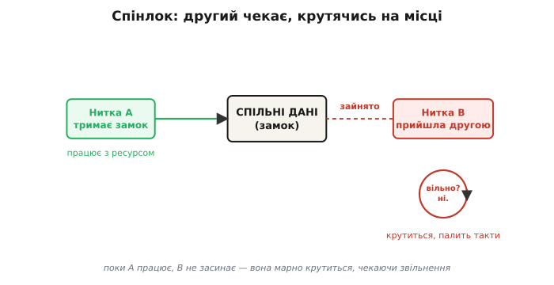
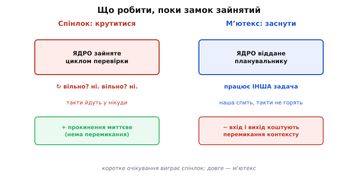
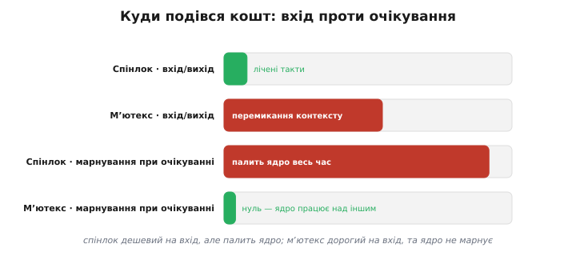
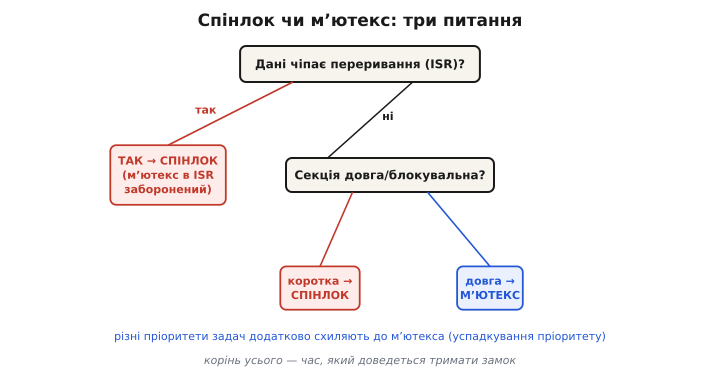

# Спінлок і мʼютекс: вибір і ціна

Тільки-но в прошивці зʼявляється друга нитка виконання — переривання поряд із головним циклом, дві задачі під планувальником, а на ESP32 ще й два ядра — миттєво виникає старе питання: що буде, якщо обидві торкнуться однієї змінної в один і той самий момент? Відповідь ми вже бачили: буде [гонка](topic:sf-tasks/atomicity-races) — лічильник зіпсується, покажчик зависне на півдорозі, прапорець прочитається застарілим. Лагодиться це одним прийомом: навколо спільних даних ставлять **замок**, і ввійти за нього одночасно може лише один. Та замок замку не рівня. Є два головні різновиди — **спінлок** і **мʼютекс**, — і вони лагодять ту саму проблему діаметрально протилежним коштом. Один палить процесор, але реагує за наносекунди; другий ввічливо засинає, але платить перемиканням контексту. Вибрати не той — це або підвісити систему, або викинути на вітер дорогоцінний час реакції. Ця тема — про те, як вони влаштовані всередині й коли який брати.

## Спільні дані й одна проста вимога

Згадаймо корінь біди. Операція `counter++` виглядає неподільною, але насправді це три кроки: прочитати з памʼяті, додати одиницю, записати назад. Якщо між читанням і записом утрутиться [переривання](topic:hw-arch/interrupts) чи інша задача — і теж зробить `counter++`, — одне з двох додавань зникне безслідно: обидва прочитали те саме старе значення. Шматок коду, який **мусить виконатися цілком, без втручання**, поки чіпає спільний ресурс, називають **критичною секцією** (англ. *critical section* — ділянка, де не можна пускати другого). Захистити її — означає гарантувати, що в ній за раз сидить рівно один.

> 🔧 **Навіщо це.** Критичні секції — не теоретична абстракція, а щоденна реальність прошивки. Кільцевий буфер, який наповнює ISR із UART, а спорожнює головна задача; лічильник подій, спільний для двох таймерів; структура стану, яку читає Wi-Fi-стек і пише ваш код. Скрізь, де двоє торкаються однієї памʼяті й хоч один із них **пише**, потрібен замок — інакше дані рано чи пізно поб’ються, і то так, що в полі цього майже не відтворити.

Замок дає одну-єдину обіцянку: поки я тримаю його, ніхто інший за нього не ввійде. Уся різниця між спінлоком і мʼютексом — у тому, **що робить той, хто прийшов до зайнятого замка й мусить почекати**. І саме ця дрібниця тягне за собою всю ціну.

## Спінлок: чекати, крутячись на місці

Найпростіше, що можна уявити: прийшов, побачив, що зайнято, — і **крутишся в порожньому циклі**, знов і знов перевіряючи, чи не звільнилося. Звідси й назва: процесор буквально **обертається** (англ. *to spin* — крутитися) на тому самому місці, спалюючи такти, доки замок не відпустять.

Звучить марнотратно — і так воно і є, якщо чекати довго. Але вся хитрість спінлока в тому, що **чекати він розрахований дуже коротко**. Якщо той, хто тримає замок, відпустить його за десяток-другий тактів, то альтернатива — приспати нашу нитку й розбудити пізніше — коштувала б у сотні разів дорожче за саме чекання. Дешевше покрутитися кілька наносекунд, ніж заводити всю машинерію засинання.

Серце спінлока — одна апаратна інструкція, яку процесор виконує **неподільно**: «порівняй і заміни» (англ. *compare-and-swap*) або «перевір і встанови» (англ. *test-and-set*). Вона за один незрушний крок дивиться, чи замок вільний, і якщо так — одразу ставить його зайнятим. Саме неподільність тут вирішує: два ядра можуть виконати цю інструкцію в той самий момент, але апаратура гарантує, що замок захопить **рівно одне** з них, а друге побачить «зайнято». Без такої інструкції сам замок став би джерелом гонки — двоє прочитали б «вільно» одночасно й обидва ввійшли б.



*Та, що захопила замок (зліва), спокійно працює з ресурсом. Та, що прийшла другою (справа), не засинає — вона крутиться в тісному циклі «вільно? ні. вільно? ні», спалюючи кожен такт, аж доки перша не зніме замок. Поки вона так крутиться, її ядро не робить нічого корисного — у цьому й уся ціна спінлока.*

### Один процесор: спінлок — це просто заборона переривань

На одноядерному мікроконтролері є тонкість, яка перевертає картину. Якщо втрутитися в нашу критичну секцію може лише **переривання** (інша задача не може — поки ми виконуємось, планувальник нас не зніме, доки ми самі не поступимося), то й «крутитися» нема потреби. Достатньо на час критичної секції **заборонити переривання** — і ніхто фізично не зможе влізти. Це і є спінлок у виродженому випадку: захист коштує дві інструкції (вимкнути переривання, увімкнути назад), і чекати взагалі нема кого.

Саме тому в класичній прошивці на одному ядрі «критична секція» історично означала просто пару `portDISABLE_INTERRUPTS()` / `portENABLE_INTERRUPTS()`. Швидко, дешево, надійно — поки ядро одне.

### Два ядра: чому заборони переривань уже мало

ESP32 зламав цю зручну картину, бо в нього **два ядра**. І тут криється пастка, на якій спотикаються всі, хто переносить код із одноядерного світу: **заборона переривань на одному ядрі ніяк не впливає на інше**. В ESP32 немає апаратного способу одному ядру вимкнути переривання сусідньому. Тож якщо ядро 0 заборонило собі переривання й полізло в спільну структуру, а ядро 1 у цей самий момент полізло туди ж — заборона переривань на ядрі 0 його не спинить. Гонка повертається, тільки тепер уже між ядрами.

Ось де справжній спінлок стає необхідним. Щоб захистити дані між ядрами, мало вимкнути собі переривання — треба ще й захопити **спільний замок у памʼяті**, який бачать обидва ядра. Те ядро, що прийшло другим, упреться в зайнятий замок і **закрутиться**, чекаючи, доки перше відпустить. Саме тому в ESP-IDF навіть «вимкнути переривання» зроблено через спінлок: операція робить обидві речі разом — глушить переривання на своєму ядрі **й** бере спільний замок проти сусіднього.

> 🔧 **Навіщо це.** Це найпідступніша частина переходу на ESP32. Код, що ідеально працював на 8-бітному чипі з самими `cli()`/`sei()`, на двоядерному ESP32 починає зрідка псувати дані — і знайти причину пекельно важко, бо баг спливає, лише коли обидва ядра збіглися в часі. Урок простий: на багатоядерному чипі захист спільних даних — це **завжди спінлок** (чи мʼютекс), а не гола заборона переривань. Заборона переривань лишається валідною тільки проти ISR на **тому самому** ядрі.

## Мʼютекс: чекати, заснувши

Тепер протилежна філософія. Уявімо, що критична секція довга: треба записати сторінку у Flash, переслати пакет, перерахувати велику таблицю — це мікросекунди, а то й мілісекунди. Крутитися весь цей час у порожньому циклі було б злочинним марнотратством: ядро паленіло б, нічого не роблячи, поки могло б виконувати іншу корисну роботу.

Тут вступає **мʼютекс** (англ. *mutex*, від *mutual exclusion* — взаємне виключення). Сама ідея «пускати рівно одного» й перші примітиви для неї народилися ще в 1960-х — їх дав Дейкстра під назвою [семафори](root:embedded/spinlock-mutex/hist-dijkstra-semaphore.md), а коротке слово «mutex» прижилося значно пізніше. Він теж пускає за замок лише одного, але той, хто прийшов до зайнятого, **не крутиться, а засинає**. Точніше — звертається до [планувальника](topic:sf-os/scheduler): «я заблокований, зніми мене з процесора й розбуди, коли замок звільниться». Планувальник прибирає нашу задачу зі списку готових і віддає процесор комусь іншому, кому є чим зайнятись. Коли власник нарешті відпускає мʼютекс, ядро знаходить сплячого, хто чекав, ставить його назад у готові — і той прокидається вже з замком у руках.

Вигода очевидна: поки одна задача чекає мʼютекса, процесор **не простоює**, а робить чужу корисну роботу. За довгу критичну секцію це окупається стократно. Платою ж стає **перемикання контексту** — заснути й прокинутися означає двічі зберегти й відновити повний стан задачі (регістри, стек), а це сотні тактів. Ось чому мʼютекс безглуздий для секції на десять тактів: накладні витрати на засинання перевищать саму роботу в багато разів.



*Дві відповіді на питання «що робити, поки замок зайнятий». Спінлок (ліворуч) тримає ядро в циклі перевірки — час іде в нікуди, зате прокинення миттєве. Мʼютекс (праворуч) віддає ядро планувальнику: поки ми спимо, працює інша задача, але вхід і вихід коштують перемикання контексту. Перше виграє на коротких очікуваннях, друге — на довгих.*

### Прихована суперсила мʼютекса: успадкування пріоритету

У мʼютекса є властивість, якої спінлок не має й мати не може, — і саме вона часто й вирішує вибір. Уявімо три задачі різного пріоритету. Низькопріоритетна взяла мʼютекс і працює. Її витісняє високопріоритетна, хоче той самий мʼютекс — і блокується, бо зайнято. Поки що все логічно. Але тут уривається **середньопріоритетна** задача, якій мʼютекс не потрібен зовсім, — і вона витісняє низькопріоритетну, бо за пріоритетом старша. Результат абсурдний: висока задача чекає на низьку, а та не може добігти й відпустити замок, бо її саму збила середня. Високопріоритетна стоїть, по суті, через задачу, нижчу за себе. Це класична [інверсія пріоритетів](topic:sf-os/priority-inversion) — і вона здатна зірвати реальний строк у системі реального часу.

Мʼютекс уміє цьому зарадити. Коли висока задача блокується на мʼютексі, який тримає низька, планувальник **тимчасово піднімає пріоритет** низької задачі до рівня високої — щоб ніяка середня вже не могла її витіснити. Низька добігає, віддає замок, її пріоритет повертається назад, висока прокидається. Цей механізм звуть **успадкуванням пріоритету** (англ. *priority inheritance*): власник замка на час «успадковує» пріоритет того, хто його чекає. Спінлок так не вміє — він узагалі не знає, хто чекає, бо очікувач просто крутиться. Це фундаментальна перевага мʼютекса там, де задачі мають різні пріоритети.

Варто чесно додати межу: успадкування пріоритету **не виліковує** інверсію повністю, а лише гамить її найгірший випадок. Воно прибирає зрив через середні задачі, але висока все одно мусить дочекатися, поки низька добіжить критичну секцію. Тому навіть із мʼютексом критичні секції тримають **короткими**.

## Ціна, розкладена поряд

Звести все докупи найлегше, дивлячись на те, **за що платиш у кожному випадку**. Спінлок дешевий на вхід і вихід (лічені інструкції) і миттєвий на прокинення, але **палить процесор**, доки чекає, і — найважливіше — **не дає засинати, поки тримаєш замок**. Останнє не примха, а залізне правило: якщо задача засне, тримаючи спінлок, то на іншому ядрі хтось закрутиться навколо цього замка **назавжди** — власник спить і не відпустить. Тому під спінлоком **не можна** робити нічого, що блокує: ні чекати на чергу, ні викликати функції, що можуть заснути, ні тим паче брати мʼютекс.

Мʼютекс — навпаки: дорогий на вхід і вихід (перемикання контексту), зате **не марнує процесор** під час очікування й **дозволяє** робити всередині довгі, блокувальні операції. Але має свою заборону-дзеркало: мʼютекс **не можна брати в [перериванні](topic:hw-arch/isr)**. Переривання не є задачею, його не можна приспати — а мʼютекс саме засинанням і працює. Тож якщо спільні дані чіпає ISR, мʼютекс відпадає в принципі: лишається спінлок (на ESP32) або заборона переривань (на одному ядрі).



*Де в кого витрати. Вхід і вихід: спінлок — лічені такти, мʼютекс — перемикання контексту (сотні тактів). Марнування процесора під час очікування: спінлок палить ядро тим більше, чим довше чекає; мʼютекс не палить нічого — ядро працює над іншим. Спінлок дешевий доти, доки чекати треба коротко; мʼютекс окупає свій вхід тим довше, чим довша критична секція.*

## Як це виглядає в коді

Візьмемо ESP-IDF — він дає обидва інструменти прямо, і контраст видно з першого погляду.

**Спінлок (для коротких секцій і захисту між ядрами).** Оголошуємо обʼєкт-замок типу `portMUX_TYPE`, ініціалізуємо його макросом, а критичну секцію обгортаємо парою макросів. Усередині — нічого блокувального, лише кілька швидких операцій над спільними даними:

```c
// спільний лічильник, який чіпають дві задачі на двох ядрах
static volatile uint32_t event_count = 0;
static portMUX_TYPE count_lock = portMUX_INITIALIZER_UNLOCKED;

void register_event(void) {
    taskENTER_CRITICAL(&count_lock);   // вимкнути переривання тут + узяти спільний замок
    event_count++;                     // КОРОТКО: лише те, що мусить бути неподільним
    taskEXIT_CRITICAL(&count_lock);    // відпустити замок + повернути переривання
}
```

Між `taskENTER_CRITICAL` і `taskEXIT_CRITICAL` має жити **щонайменше** коду — буквально кілька рядків, бо весь цей час інше ядро може крутитися навколо замка, а переривання на нашому ядрі мовчать. Якщо ту саму змінну чіпає ще й ISR, з обробника беруть варіант `taskENTER_CRITICAL_ISR(&count_lock)` — той самий замок, але правильний для контексту переривання.

**Мʼютекс (для довгих секцій між задачами).** Створюємо обʼєкт мʼютекса один раз, далі задача «бере» його перед роботою й «віддає» після. Усередині вже **можна** робити довге й блокувальне:

```c
static SemaphoreHandle_t flash_mutex;   // створити раз під час старту:
// flash_mutex = xSemaphoreCreateMutex();

void save_settings(const settings_t *s) {
    // чекати на замок до 100 мс; портить — засинаємо, а не крутимось
    if (xSemaphoreTake(flash_mutex, pdMS_TO_TICKS(100)) == pdTRUE) {
        flash_write_page(s);            // ДОВГО й блокувально — тут це дозволено
        xSemaphoreGive(flash_mutex);    // віддати замок: сплячий очікувач прокинеться
    } else {
        // за 100 мс не дочекались — замок досі чужий; обробити тайм-аут
    }
}
```

Два контрасти впадають у вічі. По-перше, `xSemaphoreTake` приймає **тайм-аут**: можна сказати «чекай не довше за 100 мс» — і якщо не дочекались, дістати відмову замість вічного зависання. Спінлок такого не вміє: він крутиться, доки не візьме, без жодного ліміту. По-друге, всередині мʼютекса стоїть `flash_write_page` — повільна, блокувальна операція; під спінлоком вона була б грубою помилкою, а тут вона рівно на своєму місці. Саме `xSemaphoreCreateMutex` (а не двійковий семафор) дає [успадкування пріоритету](topic:sf-os/priority-inversion) — двійковий семафор пускав би одного, але без захисту від інверсії.

## Як вибрати: три питання

Вибір зводиться до трьох питань, які варто ставити саме в цьому порядку.

**Перше: чи чіпає дані переривання?** Якщо так — мʼютекс відпадає (його не можна брати в ISR). Лишається спінлок або, на одному ядрі, заборона переривань.

**Друге: наскільки довга критична секція?** Кілька інструкцій, що мусять пройти неподільно (інкремент, читання пари полів, переставити покажчик) — спінлок: його миттєвість окупиться, а перемикання контексту тут було б смішним. Довга робота — запис у Flash, передача пакета, важкий розрахунок — мʼютекс: марнувати ядро в порожньому циклі стільки часу не можна.

**Третє: чи різні пріоритети в задач, що борються за замок?** Якщо так і секція не зовсім крихітна — мʼютекс, бо лише він рятує від інверсії пріоритетів успадкуванням. Якщо пріоритети однакові або секція в кілька тактів — питання знімається само.



*Три питання поспіль. Дані чіпає ISR — тільки спінлок (мʼютекс у перериванні заборонений). Інакше дивимось на тривалість: кілька тактів — спінлок; довга блокувальна робота — мʼютекс. На додачу, різні пріоритети задач схиляють до мʼютекса заради успадкування пріоритету. Корінь усього — час, який доведеться тримати замок.*

Поза цими трьома питаннями лишається одне золоте правило, спільне для обох замків: **тримай критичну секцію якомога коротшою**. Спінлок під довгою секцією палить друге ядро; мʼютекс під довгою секцією змушує високопріоритетну задачу чекати попри все успадкування. Найкращий замок — той, який тримають лічені такти й одразу відпускають. А найнадійніший спосіб уникнути обох цін — там, де вдається, узагалі не ділити дані між нитками: одна нитка володіє даними, інші **просять її** про зміни через чергу. Та коли ділити доводиться — між спінлоком і мʼютексом тепер вибирати свідомо: за тривалістю секції, за контекстом і за пріоритетами.

---
