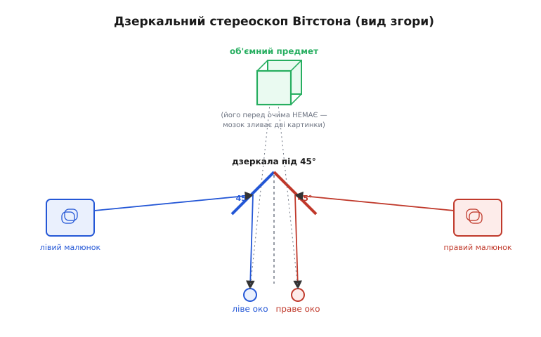

# 📜 Як Вітстон побачив об'єм у різниці двох очей

Найдивніше в історії стереозору — не те, що його відкрили, а те, **наскільки пізно**. Тисячоліттями люди дивилися на світ двома очима, малювали його, будували теорії зору, шліфували перспективу в живописі — і жоден не сказав уголос простої, лежачої на поверхні думки: **праве око й ліве око бачать злегка різні картинки, і саме з цієї різниці народжується відчуття об'єму**. Аж до 1838 року. Коли цю думку нарешті висловили й довели приладом, навіть сам автор зізнавався, що не розуміє, чому до неї не дійшли раніше — настільки вона проста. Розберімо, що саме заважало, як прийшло прозріння і чому воно справді перевернуло тодішнє розуміння зору. Це не просто гарна історія: той самий принцип, який Вітстон відкрив «у людину», сучасна стереокамера крутить навспак — і не зрозумівши перший бік, важко відчути другий.

## Що думали про глибину до Вітстона

Щоб оцінити переворот, треба спершу влізти в голову людини початку XIX століття й чесно спитати: а як вони пояснювали, що ми бачимо світ об'ємним, а не пласким, мов фотографію?

Відповідь у них була — і доволі переконлива. Глибину, вважали, мозок **домислює з підказок**. Дальній предмет виглядає меншим за ближчий такого ж розміру — це **перспектива**. Ближче перекриває дальше — **затулення**. Паралельні рейки сходяться до обрію. Тіні кажуть про форму, серпанок робить далекі гори блідими, а коли ви рухаєте головою, ближнє пропливає повз очі швидше за дальнє. Художники Відродження довели цю науку підказок до досконалості: пласке полотно, на якому ми **впевнено читаємо** простір і відстань. Леонардо да Вінчі (італ. Leonardo da Vinci) ретельно це вивчав і навіть зауважив одну незручну річ — пласка картина дає повну ілюзію глибини лише **одному** окові при нерухомій голові; двома очима картина все одно «зраджує» себе як пласку. Він підійшов упритул до загадки, але пояснення не дав.

> 🔧 **Навіщо це.** Ці «непрямі підказки» — не музейна старовина. Рівно на них тримається **монокулярна** оцінка дальності в техніці: одна камера на дроні судить про відстань до перешкоди з її видимого розміру, із того, як швидко вона «розпухає» в кадрі при наближенні, із перекриттів. Усе, що вмів живопис, уміє й алгоритм з одного ока — і має ту саму вроджену ваду: знайомий предмет незвичного розміру (іграшкова машинка зблизька проти справжньої здалеку) дурить його миттєво. Саме тому друге око — не розкіш, а інший, **прямий** канал глибини.

Була й окрема, тонша лінія міркувань — про самі **два ока**. Тут ланцюжок імен тягнеться глибоко. Ще Птолемей (грец. Ptolemaîos, ~II ст.) описав, що предмет поза точкою, на яку ми дивимося, двоїться, і мав на руках майже всі дані, щоб збудувати теорію глибини з розбіжності двох образів — але не зробив цього кроку. Альхазен (араб. al-Hasan ibn al-Haytham, ~XI ст.), а згодом Кеплер (нім. Johannes Kepler, 1611) і Декарт (фр. René Descartes, 1637) пов'язували відчуття відстані з **конвергенцією** — м'язовим зусиллям звести осі очей на близькій точці: що сильніше очі «косять» досередини, то ближча ціль. Це теж двоокий механізм, і він справді працює — але **зовсім інший**. Конвергенція — про **кут** між осями очей, тобто про спільне наведення обох очей на одну точку. Вона нічого не каже про те, що на цій точці **самі дві картинки відрізняються формою**.

І тут — філософська підпора всієї тодішньої картини. Джордж Берклі (англ. George Berkeley) у праці «An Essay towards a New Theory of Vision» (1709) доводив: відстань **сама по собі оку не дана**. Сітківка пласка, на ній — двовимірний відбиток; жодного «дальше-ближче» в сирому зображенні немає. Відчуття глибини, казав Берклі, ми **вивчаємо** — змалечку зв'язуючи те, що бачимо, з тим, що намацуємо рукою й проходимо ногами. Глибина — не пряме відчуття, а **навичка тлумачення підказок**.

Складімо це докупи — і стане видно, чому відкриття так забарилося. Панівна рамка казала: глибина в зір **не вшита**, вона домислюється. Два ока корисні хіба що кутом зведення (конвергенцією). А те, що **сама пара картинок** — ліва й права — несе точну, пряму інформацію про об'єм, не спадало на думку нікому, бо суперечило самій засаді «глибини в сирому зображенні немає». Загадка лежала на видноті десятки століть, прикрита переконливою, але хибною в цій частині теорією.

## Хто такий Чарлз Вітстон

Чоловік, що розрубав цей вузол, на астронома чи професійного фізіолога зору був мало схожий. Чарлз Вітстон (англ. Charles Wheatstone, 1802–1875) народився під Глостером в Англії, у родині, що торгувала музичними інструментами, і замолоду сам робив та продавав інструменти в Лондоні. Звідти, з акустики й коливань, почалася його наука: він досліджував, як звучить струна й резонує дерево, винайшов концертину (concertina) — ту саму ручну гармоньку-багатогранник. Це **усталений факт**: Вітстон був англієць, син інструментального майстра, що прийшов у фізику від звуку, а не від оптики.

Шлях від музики до фізики виявився коротшим, ніж здається. Коливання струни, біг хвилі дротом, мерехтіння іскри — усе це про **час і рух**, і саме там Вітстон був сильний. Він уславився хитрим дослідом із дзеркалом, що крутиться, аби зміряти, **як швидко** біжить електричний розряд у дроті (швидкості виходили шалені — сотні тисяч кілометрів за секунду). У 1834 році він став професором експериментальної філософії (так тоді звали фізику) у Королівському коледжі в Лондоні (King's College London). Його ім'я сьогодні чи не найгучніше звучить у [мості Вітстона](topic:hw-sensing/wheatstone-bridge) — схемі точного вимірювання опору; цікаво, що сам Вітстон її не винайшов, а лише зробив популярною, чесно вказавши справжнього автора, та назва приклеїлася до нього. Тут варто **розрізняти ідею й популяризацію**: міст — приклад того, як ім'я закріплюється за тим, хто *показав світові*, а не за тим, хто *придумав*. Зі стереоскопом, як побачимо, усе навпаки: там першість справді його, доведена приладом.

> 🔧 **Навіщо це.** Те, що відкривач об'ємного зору прийшов із **акустики й вимірювання швидкостей**, — не випадковість, а урок. Вітстон звик думати про **геометрію й час сигналу**, а не про «що відчуває душа». Саме інженерний, вимірювальний погляд — «а покажіть-но мені це **числом** і **приладом**» — дав змогу там, де філософи століттями міркували про природу відчуттів, поставити грубе, але вирішальне питання: що буде, **якщо подати в кожне око окрему картинку**?

## Прозріння: а що, як годувати очі різним

Ось серцевина всієї історії — і вона напрочуд проста.

Вітстон міркував так. Якщо два ока справді бачать ту саму сцену **трохи по-різному**, то відчуття об'єму має народжуватися не «десь у глибині душі», а прямо зі **складання цих двох різних картинок** у мозку. Думку легко висловити — але як її **довести**? Просто дивитися на світ двома очима безнадійно: там одразу намішані всі підказки разом — і перспектива, і конвергенція, і рух голови, — і не розплутати, що з чого. Потрібен був чистий дослід, який **відрізав би все інше** й лишив **єдину** діючу причину — різницю двох зображень.

І Вітстон придумав вивернути все навспак. Не розбирати, як око дивиться на світ, — а **самому згодувати кожному окові свою картинку** й подивитися, що вийде. Він узяв два пласкі малюнки **тієї самої** простої фігури — скажімо, куба чи піраміди, — але накреслені **так, як її бачило б кожне око окремо**: лівий малюнок — з точки лівого ока, правий — з точки правого, з тим самим крихітним зсувом ліній, що його дає рознесення очей на кілька сантиметрів. Жодного куба перед людиною немає — лише два пласкі креслення на папері. А тоді змусив ліве око бачити **тільки** лівий малюнок, праве — **тільки** правий.

Результат був приголомшливий. Мозок, отримавши дві пласкі, але по-різному зсунуті картинки, складав їх — і людина **бачила суцільний об'ємний предмет**, що висить у просторі. Куб ставав справжнім кубом із глибиною, хоча на столі лежали два аркуші з лініями. Зворотний бік теж підтверджував думку: якщо підсунути малюнки **навпаки** — лівий у праве око, правий у ліве, — об'єм **вивертався**, опукле ставало увігнутим. Глибина не «домислювалася з підказок» — вона **бралася просто з різниці двох зображень**, і нею можна було **керувати**, міняючи лише цю різницю.

Це і був вирішальний доказ. Не міркування про природу відчуттів, а **прилад, що вмикає й вимикає об'єм**, лишаючи всі інші підказки незмінними. Раз різницю картинок можна підсунути штучно — і об'єм з'являється, зникає, вивертається слухняно за нею, — значить, **саме вона** і є прямим джерелом глибини. Берклієве «в сирому зображенні глибини немає» впало: у **парі** зображень вона є, і то найпрямішим чином.

> 🔧 **Навіщо це.** Цей дослід — чистий зразок інженерного мислення, яке варто перейняти: щоб довести, що **саме X** дає ефект, треба зробити установку, де можна **крутити лише X**, лишивши решту нерухомою, — і дивитися, чи ходить ефект слідом. Вітстон ізолював «різницю картинок» від усіх інших підказок глибини й показав, що об'єм ходить **за нею одною**. Так само ми діємо, коли ловимо причину збою в апараті: міняємо по одному чиннику, поки відгук не зрушить.

## Стереоскоп: прилад, що годує очі різним

Лишалася технічна заковика: як **фізично** змусити кожне око бачити лише свій малюнок, та ще й так, щоб обидва зливалися в одну точку простору, де й «збереться» об'єм? Просто покласти два аркуші поряд не вийде — кожне око мимоволі підглядає в чужий, та й зливати їх свідомим косінням очей виснажливо й непевно.

Вітстон розв'язав це **дзеркалами**. Його прилад — **дзеркальний стереоскоп** (грец. *stereós* — об'ємний, тілесний + *skopéō* — дивлюся; буквально «дивитися на об'ємне») — ставив перед очима два пласкі дзеркальця, **зведені кутом одне до одного так, що кожне стояло під 45° до погляду**. Малюнки кріпилися збоку, ліворуч і праворуч від голови, кожен навпроти свого дзеркала. Ліве око, дивлячись прямо вперед, бачило в лівому дзеркалі **тільки лівий** малюнок (відбитий під прямим кутом збоку); праве — у правому дзеркалі **тільки правий**. Перегородка між дзеркалами не давала окові зазирнути в чужу картинку. А оскільки обидва дзеркала «направляли» свої зображення в одне місце прямо перед спостерігачем, мозок зводив їх докупи — і там, у порожнечі перед лицем, виростав об'ємний предмет.


*Схема приладу згори. Спостерігач дивиться вперед на пару дзеркал, зведених під 45° до погляду. Ліве дзеркало відбиває в ліве око лише лівий малюнок (збоку), праве — лише правий. Дві пласкі, по-різному зсунуті картинки зливаються в одну об'ємну, що «висить» прямо перед очима.*

Чому саме 45°? Це найприродніший кут, щоб **повернути погляд рівно на 90°** — від руху прямо вперед до картинки, що стоїть точно збоку. Дзеркало під 45° до променя відхиляє його на прямий кут (закон відбиття: кут падіння дорівнює куту відбиття, разом — 90°), тож око дивиться вперед, а «бачить» убік. Це дало змогу рознести малюнки далеко в боки, де вони не заважають один одному, і водночас звести їхні зображення в одну точку перед спостерігачем.

Тонкість, через яку прилад вийшов саме дзеркальним, а не простішим: у 1838 році **фотографії ще не існувало** (перші практичні знімки Дагера й Талбота прийшли наступного, 1839 року). Тож «стереопарою» Вітстона були **рисунки від руки** — геометричні тіла, накреслені за правилами перспективи з двох точок зору. А рисунок можна зробити скільки завгодно великим; великі ж картинки зручніше зводити саме дзеркалами, рознісши їх широко в боки. Згодом, коли з'явилася фотографія й парні знімки маленькими, Девід Брюстер (англ. David Brewster, шотландець) зробив компактніший **лінзовий** стереоскоп — кишеньковий ящичок із двома лінзами, який і пішов у мільйони вікторіанських віталень. Між Вітстоном і Брюстером потім спалахнула гучна суперечка про першість і про те, як саме «правильно» влаштований стереоскоп; але **хронологія усталена**: дзеркальний прилад і теорія Вітстона — 1838-й, лінзовий Брюстера — за кілька років по тому. Першість самої ідеї — диспаритету як джерела об'єму — належить Вітстону.

## 21 червня 1838: доповідь, що перевернула розуміння зору

Свою працю Вітстон виніс на найповажніший науковий осуд того часу — **Лондонське королівське товариство** (Royal Society of London). Доповідь він прочитав **21 червня 1838 року**, а текст вийшов того ж року в «Філософських трудах» товариства (Philosophical Transactions of the Royal Society) під назвою:

```
Contributions to the Physiology of Vision. — Part the First.
On some remarkable, and hitherto unobserved, Phenomena of Binocular Vision
```

(приблизно: «Внесок у фізіологію зору. Частина перша. Про деякі прикметні й досі не помічені явища двоокого зору»). Уже сама назва — тиха сенсація: «**досі не помічені**» (*hitherto unobserved*) явища двоокого зору. Не нова теорія поверх відомих фактів, а твердження, що ціле сімейство явищ, які кожна людина бачить власними очима щомиті, **ніхто доти не описав**. Дата, назва й місце — **усталений факт**, що його підтверджують і архіви самого Королівського товариства.

Чому це справді перевернуло розуміння зору, а не просто додало дрібний факт? Бо вдарило в **корінь** панівної картини. Доти глибину вважали **похідною** — мозок її *виводить* з підказок (розмір, перекриття, рух), як детектив відновлює подію з опосередкованих слідів. Вітстон показав, що є **прямий, ні з чого не виведений** канал: різниця двох зображень сама, безпосередньо, **є** глибиною для мозку. Зір перестав бути пласким відбитком, що його розум потім домальовує в об'єм; він виявився **двоканальним від природи**, із вбудованим відчуттям тривимірності. Це зрушило не одну деталь, а саму рамку: питання змістилося з «як розум *домислює* глибину» на «як мозок *обчислює* її з пари картинок» — питання, на яке фізіологія й техніка відповідають досі.

Найкраще дух того перевороту передає зізнання самого Вітстона: ефект такий простий, а спосіб такий очевидний, що він **дивувався, чому жоден художник чи філософ не натрапив на нього раніше** — адже закони перспективи, з яких усе випливає, були відомі століттями. Це чесне здивування — найкращий доказ, що загадка справді лежала на видноті, прикрита хибним переконанням, ніби «в зображенні глибини немає». Варто було це переконання струсити приладом — і об'єм буквально вискочив з-поміж двох аркушів паперу.

## Royal Medal 1840 і що було далі

Наукова спільнота оцінила вагу відкриття швидко. У **1840 році** Королівське товариство присудило Вітстонові **Королівську медаль** (Royal Medal) — одну з найвищих своїх відзнак — саме **за пояснення двоокого зору й перший показ стереоскопа**. Це **усталений факт**: нагорода прийшла за цю конкретну працю, а не за пізніші його винаходи в телеграфії чи акустиці.

А далі сталося те, що буває з рідкісними відкриттями: воно з лабораторії пішло **в кожен дім**. Щойно фотографія навчилася робити парні знімки, а Брюстер дав дешевий кишеньковий лінзовий стереоскоп, об'ємні фотокартки стали вікторіанською пристрастю — у віталень рікою потекли стереопари краєвидів, міст, чужих країв; люди вперше «побували» в об'ємних місцях, де ніколи не бували. Принцип, відкритий Вітстоном на креслениках куба, через століття проріс у 3D-кіно, окуляри віртуальної реальності, об'ємні екрани — усюди, де двом очам показують дві різні картинки.

І ось де коло замикається з нашою темою. Вітстон рухався в **один** бік: маючи дві картинки, **збирав** із них об'єм — у живій голові. Сучасна стереокамера на дроні чи роботі робить **точно навпаки**: маючи дві картинки з двох об'єктивів, вона **розбирає** з них глибину — числом, у процесорі. Та сама різниця зображень, той самий [диспаритет](root:embedded/stereo-vision), що Вітстон уперше показав джерелом об'єму; лише напрямок інший — не від двох картинок до відчуття, а від двох картинок до **відстані в метрах**. Природа винайшла цей фокус у двоокому зорі сотні мільйонів років тому; Вітстон у 1838-му нарешті його **зрозумів і назвав**; а ми навчилися повторювати його залізом і кодом. Кожна стереокамера — це перевернутий стереоскоп Вітстона, що замість показати мозкові об'єм рахує дальність сам.
