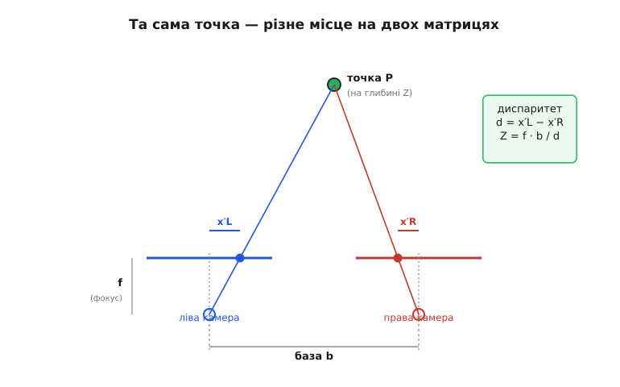
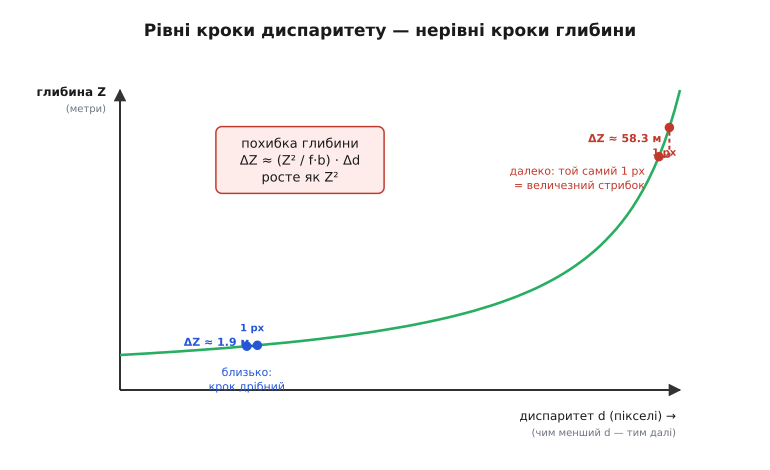
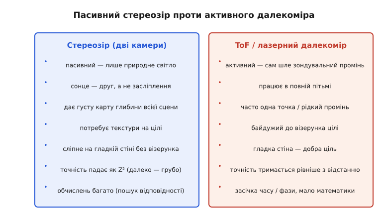

# Стереозір: глибина з двох очей

Коли ми складали [мапу безконтактних далекомірів](root:embedded/contactless-distance), майже всі способи виявилися **активними**: давач сам шле пінг чи промінь і слухає відлуння. Пасивний вимір ми тоді відклали одним реченням — «пара рознесених камер за зсувом зображень оцінює дальність на природному світлі». Настав час розкрити цю обіцянку, бо саме так бачимо ми самі: двома очима, без жодного «пінга». Це **стереозір** (гр. *stereós* — об'ємний, тілесний) — здобуття глибини з двох поглядів на ту саму сцену.

Чому взагалі два ока дають те, чого не дає одне? Закрийте одне око й спробуйте швидко поцілити кінчиком одного пальця в кінчик іншого, тримаючи руки на витягнутих ліктях. З двома очима — легко; з одним — раз по раз промахуєтесь. Одне око дає **плаский** знімок: напрямок на точку є, а от **як далеко** вона — мозок мусить вгадувати з непрямих підказок (розмір знайомих предметів, перекриття, тіні). Друге око, зсунуте вбік на кілька сантиметрів, бачить ту саму сцену **трохи інакше** — і ось ця різниця двох картинок несе в собі точну відстань. Лишається зрозуміти, як саме вона там захована й як її витягти числом.

### Та сама точка — у різних місцях кадру

Поставте перед собою палець і поморгайте по черзі лівим і правим оком. Палець «стрибає» туди-сюди на тлі, а далека стіна за ним майже не рухається. Це і є ключ: **близькі предмети зсуваються між двома поглядами сильно, далекі — слабко**. Той зсув положення тієї самої точки на двох зображеннях має власну назву — **диспаритет** (англ. *disparity* — розбіжність, нерівність).

Звідки він береться геометрично? Кожна камера — це, спрощено, точка-центр (куди сходяться промені) і площина-матриця за нею на відстані фокуса f, на яку лягає зображення. Промінь від реальної точки P проходить через центр і б'є в матрицю в певному місці. Зсунемо другу камеру вбік на відстань **базу** b — і промінь до тієї самої P пройде під іншим кутом, отже, влучить у **інше** місце своєї матриці. Різниця цих двох місць і є диспаритет.


*Дві камери, рознесені на базу b, дивляться на точку P. Промінь до P влучає в ліву матрицю в позицію x′L, у праву — в x′R. Чим ближча точка, тим сильніше розходяться ці позиції. Їхня різниця d = x′L − x′R прямо кодує глибину Z.*

Це та сама [тріангуляція](topic:electronics/triangulation), якою працюють дешеві ІЧ-давачі наближення, тільки навиворіт. Там був **один** випромінювач і **один** приймач, рознесені на базу, а вимірювали кут, під яким повертається власний промінь. Тут випромінювача немає зовсім — обидва прилади **приймачі**, а роль «двох кутів на ту саму точку» грають два зображення з природного світла. Принцип трикутника той самий: знаєш базу й два напрямки на вершину — знаходиш відстань до неї. Стереозір — це тріангуляція, що відмовилася від власного джерела світла й поклалася на чуже.

> 🔧 **Навіщо це.** Звідси одразу видно, **на що здатен** і **на чому спіткнеться** стереозір. Здатен: працювати тихо й непомітно, без випромінювання, що його хтось засіче чи що засліпить інший такий самий давач поряд; давати глибину не однієї точки, а **всього кадру** одразу. Спіткнеться: там, де на цілі **нема чого розрізнити** — бо щоб зміряти зсув тієї самої точки, цю точку треба спершу **впізнати** на обох кадрах. Рівна біла стіна для стерео — те саме, що поролон для ультразвуку: ціль ніби є, а «зачепитися» нема за що.

### Від диспаритету до метрів

Тепер зробимо головне — перетворимо зсув у пікселях на відстань у метрах. Геометрія двох подібних трикутників (промінь до P і зсув на матриці) дає напрочуд просту формулу, ту саму, що стоїть за кожною стереокамерою:

```
Z = f · b / d
```

де **Z** — глибина (відстань до точки), **f** — фокусна відстань камери у **пікселях**, **b** — база (відстань між камерами), **d** — диспаритет у **пікселях**. Повне виведення цієї рівності з подібних трикутників — окрема [вправа з геометрією стерео](root:embedded/stereo-vision/math-disparity-derivation.md): там видно, звідки взялася кожна літера, як база й фокус входять у відповідь і чому вимір на матриці треба вести в пікселях, а не в міліметрах.

Найважливіше в цій формулі — слово **обернено**. Глибина не пропорційна диспаритету, а **обернено пропорційна** йому: великий зсув означає близьку ціль, крихітний зсув — далеку. Близька точка дає десятки пікселів диспаритету, а точка за сто метрів — частку пікселя. Саме ця оберненість визначає весь характер стереозору, і за мить ми побачимо, чим вона коштує.

**Приклад (диспаритет у глибину).** Хай дві камери з фокусом f = 800 пікселів рознесені на базу b = 12 см = 0.12 м. Точку знайдено на лівому кадрі в стовпці x′L = 412, на правому — в x′R = 388. Порахуймо глибину:

```
d = x′L − x′R = 412 − 388 = 24 пікселі
Z = f · b / d = 800 · 0.12 / 24
Z = 96 / 24 = 4.0 м
```

Точка за 4 метри. Тепер та сама камера дивиться на щось далеке й знаходить диспаритет лише d = 3 пікселі:

```
Z = 800 · 0.12 / 3 = 96 / 3 = 32 м
```

Той самий прилад, та сама арифметика — а діапазон уже від метрів до десятків метрів, і весь він стискається в кілька пікселів зсуву.

### Чому стерео «грубшає» вдалині

Ось де оберненість показує зуби. Диспаритет ми міряємо не безмежно точно — у кращому разі з точністю до частки пікселя. Поставимо просте питання: якщо помилитися в диспаритеті всього на **один піксель**, наскільки схибимо в глибині? Близько й далеко відповідь буде разюче різна.


*Глибина Z від диспаритету d — гіпербола Z = f·b/d. Близько (зліва) один піксель диспаритету коштує крихітного кроку глибини. Далеко (справа), де крива стрімко злітає, той самий один піксель — це вже величезний стрибок у метрах. Похибка глибини росте як квадрат відстані.*

Механізм такий. Глибина ⇄ диспаритет — це гіпербола: біля близьких цілей вона полога (один піксель туди-сюди майже не зрушує Z), а вдалині — стрімка (той самий піксель підкидає Z на метри). Якщо акуратно продиференціювати Z = f·b/d, дістанемо, **наскільки** глибина чутлива до похибки диспаритету:

```
ΔZ ≈ (Z² / (f · b)) · Δd
```

Тут Δd — наша похибка в пікселях, ΔZ — спричинена нею похибка в метрах. Уся суть — у множнику **Z²**: похибка глибини росте не лінійно, а **як квадрат відстані**. Удвічі далі — учетверо грубіше. Це не вада конкретної камери, а вбудована властивість методу.

**Приклад (як росте похибка).** Візьмімо ту саму камеру (f = 800 px, b = 0.12 м) і реалістичну похибку зіставлення Δd = 0.2 пікселя. Порахуймо ΔZ на 4 метрах і на 32 метрах:

```
на 4 м:   ΔZ ≈ (4²   / (800·0.12)) · 0.2 = (16   / 96) · 0.2 ≈ 0.033 м  →  ±3.3 см
на 32 м:  ΔZ ≈ (32²  / (800·0.12)) · 0.2 = (1024 / 96) · 0.2 ≈ 2.13 м   →  ±2.1 метра
```

Зблизька — сантиметри, чудово. На тридцяти метрах — два метри похибки з тих самих 0.2 пікселя. Відстань зросла у 8 разів, а похибка — у 64 (8²) рази.

Тут і пролягає головна межа між стереозором і активним [лазерним далекоміром](topic:electronics/tof-laser). У далекоміра, що рахує час польоту, роздільність тримається **рівніше** по дальності — наносекундний таймер однаково цокає що на метрі, що на ста. У стерео ж роздільність **тане з квадратом відстані**. Тому стерео — інструмент **близького й середнього** простору: об'їхати перешкоду, втримати висоту, скласти карту кімнати; а вистежити щось за сто метрів краще довірити лазеру чи радару. Це той самий [бюджет похибок далекоміра](topic:electronics/distance-errors), лише з власним, квадратичним почерком.


*Два світи поряд. Стерео — пасивне, любить світло й текстуру, дає густу карту, але грубшає вдалині й вимагає рахунку. ToF/лазер — активний, працює в пітьмі, байдужий до візерунка, тримає точність далі, та зазвичай міряє точку, а не сцену. «Кращого» нема — є придатний під задачу.*

> 🔧 **Навіщо це.** Дві ручки керують усім бюджетом стерео: **база b** і **фокус f**. Обидві стоять у знаменнику похибки, тож **ширша база** й **довший фокус** (вужче поле зору) роблять вимір точнішим — диспаритет на ту саму ціль стає більшим, а Z² тисне слабше. Платня: ширша база робить давач габаритним і піднімає **мінімальну** дальність (надто близька ціль випадає з поля однієї камери), а довгий фокус звужує огляд. Тому базу й об'єктиви підбирають **під робочу дистанцію**: дрону для близького обльоту вистачить кількох сантиметрів бази й ширококутних камер, а далекому стереонагляду потрібні розставлені ширше камери з тіснішим полем. Це частина [читання характеристик давача](topic:electronics/sensor-characteristics): «дальність» стереокамери без вказаної бази й роздільності — порожнє слово.

### Найважче — впізнати ту саму точку

Уся арифметика вище починається з тихого припущення: ми **вже знаємо**, що стовпець 412 на лівому кадрі й стовпець 388 на правому — це **та сама** точка реального світу. А це і є найважча, найдорожча частина стереозору, бо камера віддає лише два поля яскравих пікселів, без жодної позначки «оце той самий ріжок столу». Знайти для кожної точки одного кадру її пару на іншому — задача **відповідності** (англ. *correspondence*, зіставлення).

На щастя, шукати доводиться не по всьому кадру. Якщо камери вирівняні (їхні матриці в одній площині, осі паралельні), то пара будь-якої точки лежить **на тому самому рядку** другого кадру — лише зсунута по горизонталі. Це різко спрощує пошук: не двовимірне нишпорення, а ковзання вздовж одного рядка. Властивість зветься [епіполярною геометрією](root:embedded/stereo-vision/math-disparity-derivation.md), а зведення кадрів до такого вирівняного вигляду — **ректифікацією**; реальні камери ніколи не стоять ідеально, тож кадри спершу подумки «випрямляють» за наперед виміряними параметрами.

Як же зіставляють точки вздовж рядка? Найпоширеніший і найпрямолінійніший спосіб — **блокове зіставлення** (англ. *block matching*): беремо навколо точки лівого кадру невеличке віконце пікселів (скажімо, 9×9), і ковзаємо ним по тому самому рядку правого кадру, шукаючи місце, де картинка у віконці **найсхожіша**. Зсув, на якому збіг найкращий, і є диспаритет цієї точки. Повторивши для кожного пікселя, дістаємо **карту глибини** всього кадру. Сам робочий алгоритм із метрикою схожості й типовими пастками — окремий [код блокового зіставлення](root:embedded/stereo-vision/proj-block-matching.md), бо там багато інженерних дрібниць, від яких залежить, працює воно чи бреше.

І ось тут вилазить уже згадана ахіллесова п'ята. Щоб віконце мало де «зачепитися», на цілі має бути **текстура** — візерунок, нерівність, край, будь-що неоднакове. На рівній білій стіні всі віконця вздовж рядка однакові, збіг неоднозначний, і диспаритет визначити **неможливо**: метод не каже «далеко», він каже «не знаю». Звідси типові діри в карті глибини на однотонних поверхнях, чистому небі, у темряві. Частина приладів обходить це **хитрістю**: підсвічують сцену проєктором випадкових цяток (так званий активний стерео), штучно даючи текстуру там, де її нема, — і тоді стерео працює навіть на голій стіні, лишаючись по суті тим самим зіставленням.

> 🔧 **Навіщо це.** Перше, що перевіряють, коли стереокамера видає дірчасту карту глибини, — це **текстуру сцени й освітлення**, а не саму камеру. Однотонна підлога, контрове сонце в об'єктив, сутінки — класичні причини «сліпоти». Друге — **калібрування**: формула Z = f·b/d вірна лише з точно відомими f і b та правильно випрямленими кадрами; збитий монтаж камер чи неточна ректифікація систематично зміщують усю шкалу глибини, рівно як забута двійка зміщувала шкалу [часу польоту](root:embedded/contactless-distance). Стерео, як ніякий інший давач, винагороджує акуратну геометрію й карає за недбалу.

### Звідки воно пішло

Те, що два ока бачать **трохи різні** картинки і саме з цієї різниці народжується відчуття об'єму, людство усвідомило напрочуд пізно — лише у 1838 році. Доти панувала думка, ніби глибину ми бачимо самими лиш непрямими підказками. Англійський фізик Чарлз Вітстон не лише довів, що джерело об'єму — **різниця ретинальних зображень**, а й побудував прилад, що це доводив: подаючи в кожне око окремий, навмисне зсунутий малюнок тієї самої сцени, він змушував мозок зливати їх у **об'ємну** картину з пласких. Як визрівала ця ідея, що їй передувало й чому вона перевернула тодішнє розуміння зору — у [розповіді про стереоскоп Вітстона](root:embedded/stereo-vision/hist-wheatstone.md).

Те, що сучасна стереокамера робить навспак — не показує мозкові дві картинки, а **рахує** з двох картинок глибину, — це той самий принцип Вітстона, лише обернений і доручений процесору. Природа винайшла його на сотні мільйонів років раніше; ми лише навчилися повторювати числом.

### Де воно в апараті

Стереозір — улюблений давач там, де треба **густа** картина глибини зблизька, та ще й непомітно: пара камер на дроні чи роботі дає не одну відстань, а карту всього, що попереду, на природному світлі, без випромінювання. На цьому будують обхід перешкод, утримання висоти над фактурною землею, грубу побудову карти. Голову готового зображення-глибини далі підхоплює [виявлення об'єктів](topic:algorithms/object-detection): знаючи, що «оце пляма пікселів — людина», і маючи її диспаритет, апарат знає не лише *що* перед ним, а й *як далеко*.

Та, як ми бачили з квадратичною похибкою й залежністю від текстури, поодинці стерео не всесильне. Тому серйозні апарати рідко кладуть усе на нього: стерео для близької густої картини, лазерний далекомір для точної далекої точки, ультразвук для м'яких перешкод, що оптику дурять, — а зводять їхні покази в одну несуперечливу оцінку методами [поєднання давачів](topic:communications/sensor-fusion). Стереозір тут — не суперник іншим далекомірам, а **один колір** у спільній палітрі сприйняття, найсильніший саме там, де решта слабка: коли треба тихо, на природному світлі й одразу про весь кадр.

---
