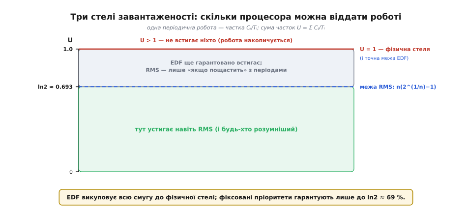
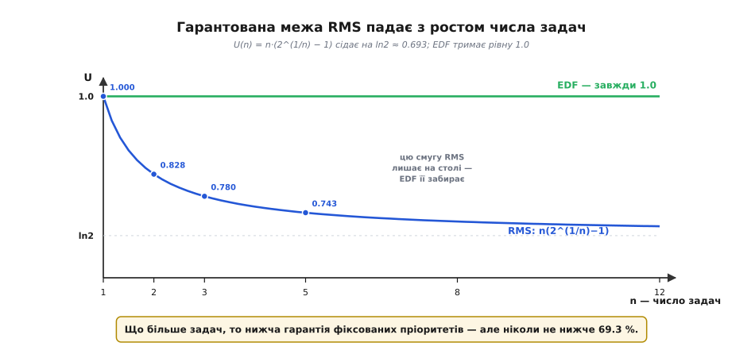
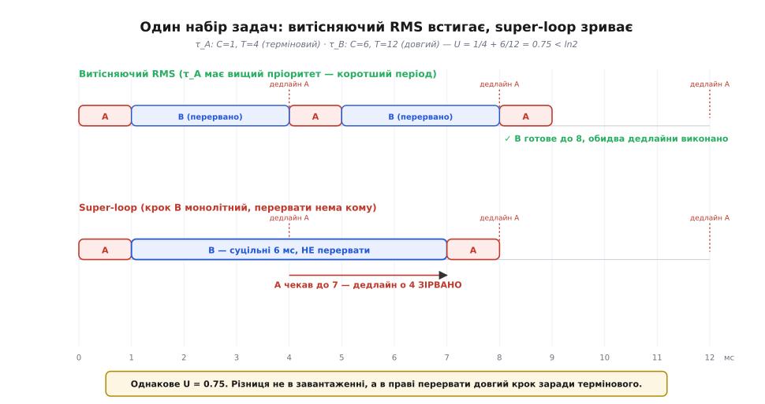

# 🧮 Межа планованості: від U ≤ 1 до ln2

Ми вже вивели, що завантаженість `U = Σ Cᵢ/Tᵢ` понад одиницю — це фізичний вирок: робота надходить швидше, ніж процесор її переробляє, і жоден планувальник тут не зарадить. І ми вже бачили, що super-loop починає зривати дедлайни **задовго до** цієї одиниці, бо не вміє перервати довгий крок заради термінового. Тут ми відповімо на питання, яке там лишилося відкритим: а **де саме** та межа для розумного, витісняючого планувальника? Чи справді він викуповує всю смугу до `U = 1` — чи теж лишає щось на столі, і скільки?

Відповідь виявиться напрочуд гарною і трохи несподіваною. Для планувальника з **фіксованими** пріоритетами (кожній задачі раз і назавжди призначили важливість) є сувора, доведена межа — і вона **не одиниця**, а десь коло `0.693`. А от планувальник, що переставляє пріоритети **динамічно**, за дедлайнами, дотягує рівно до одиниці — до самої фізичної стелі. Різниця між цими двома числами — не дрібниця реалізації, а глибокий факт про те, чим коштує тримати пріоритети сталими. Виведемо обидва результати від першопринципів, а тоді повернемося до super-loop і побачимо, чому йому мало навіть цієї межі.

Домовимося про модель, щоб говорити чітко. Маємо `n` **періодичних** задач на одному ядрі. Задача `i` пробуджується строго раз на **період** `Tᵢ`, щоразу вимагає до `Cᵢ` часу процесора (worst-case, найгірший її прохід) і мусить упоратися **до кінця свого періоду** — тобто її дедлайн збігається з наступним пробудженням (це так званий випадок «дедлайн дорівнює періоду», найпоширеніший і найчистіший для аналізу). Задачі незалежні: не чекають одна одну, не діляться даними. Планувальник **витісняючий** (англ. *preemptive* — той, що випереджає): він може будь-якої миті зупинити задачу, віддати ядро іншій і згодом повернутися. Питання одне: за якої завантаженості `U` можна **гарантувати**, що жодна задача ніколи не спізниться?

## Означення: чому частка Cᵢ/Tᵢ — це саме «частка процесора»

Спершу переконаймося, що `U` взагалі та величина, яку варто вимірювати. Візьмімо одну періодичну задачу: кожні `Tᵢ` мілісекунд вона з'їдає `Cᵢ` мілісекунд роботи. Тоді за будь-який довгий проміжок `L` вона пробудиться приблизно `L / Tᵢ` разів і забере разом

```
робота задачі i за час L  ≈  (L / Tᵢ) · Cᵢ  =  L · (Cᵢ / Tᵢ)
```

Поділивши на `L`, дістаємо частку часу, яку задача `i` вимагає **в середньому** від процесора, — рівно `Cᵢ / Tᵢ`. Це число зветься **завантаженістю** задачі (англ. *utilization* — використання). Воно безрозмірне: `Cᵢ` і `Tᵢ` в тих самих одиницях, тож секунди скорочуються. Задача з `C = 2` мс і `T = 10` мс має завантаженість `0.2` — просить п'яту частину ядра.

Сума по всіх задачах — повна завантаженість системи:

```
U = C₁/T₁ + C₂/T₂ + … + Cₙ/Tₙ = Σ (Cᵢ / Tᵢ)
```

І одразу — груба, але непорушна стеля. За будь-який довгий проміжок `L` уся потрібна робота становить приблизно `U · L`. Якщо `U > 1`, то потрібно **більше** процесорного часу, ніж узагалі є в проміжку, — фізична неможливість. Черги ростуть, дедлайни сипляться, і надолужити нема коли, бо кожен наступний період додає ще роботи. Тому

```
U ≤ 1   —   необхідна умова для будь-якого планувальника (фізична стеля)
```

Слово **необхідна** тут ключове: `U ≤ 1` мусить виконуватися, інакше глухо. Але чи **достатня** вона — чи будь-який набір із `U ≤ 1` реально розкладеться без зривів — залежить від планувальника. Ось де починається справжня історія, і де фіксовані та динамічні пріоритети розходяться.

> 🔧 **Навіщо це.** `Σ Cᵢ/Tᵢ` — це перший конверт, на якому рахують, чи взагалі має сенс проєкт. Виписали всі періодичні вимоги парами «як часто / скільки триває», склали частки — і якщо вже сума перевалила за одиницю, далі можна не думати: потрібне швидше ядро, менше роботи або хитріші періоди. Це числа, які треба знати **до** першого рядка коду.

## Інтуїція: чому фіксовані пріоритети лишають запас, а динамічні — ні

Перш ніж рахувати, вловімо суть на пальцях, бо саме інтуїція підкаже, звідки береться те дивне `0.693`.

Уявімо двох робітників з різними завданнями, що діляться одним інструментом. Перший спосіб керувати ними — призначити старшинство **раз і назавжди**: «ти завжди головніший, хапай інструмент першим». Це **фіксовані пріоритети**. Проблема в тому, що старшинство сліпе до поточної терміновості: молодший робітник, у якого горить дедлайн **просто зараз**, усе одно поступається старшому, у якого до дедлайну ще купа часу. Через цю сліпоту система іноді простоює на межі зриву, хоч роботи насправді небагато, — і щоб **гарантувати** відсутність зривів, доводиться лишати запас: не завантажувати ядро під зав'язку. Оцей вимушений запас і проступить як розрив між `0.693` і `1`.

Другий спосіб — не фіксувати старшинство, а щоразу дивитися, **у кого дедлайн ближче**, і давати інструмент йому. Це **динамічні пріоритети** за дедлайном. Тепер терміновість завжди перемагає: хто ближче до зриву, той і працює. Виявиться, що ця стратегія не марнує жодної краплини — вона тримає дедлайни аж до `U = 1`, до самої фізичної стелі. Запас не потрібен, бо планувальник ніколи не змушує термінову задачу чекати менш термінову.

Уже звідси видно природу різниці: **фіксований пріоритет платить запасом завантаження за простоту й передбачуваність**; динамічний забирає всю смугу, але коштує складнішого планувальника й гіршої поведінки в перевантаженні. Тепер — числа.


*Фізична стеля `U = 1` — і вона ж точна межа динамічного планувальника EDF. Фіксовані пріоритети (RMS) гарантують лише до `ln2 ≈ 0.693`; у сірій смузі між ними EDF ще певно встигає, а RMS — «як пощастить» із конкретними періодами. Понад одиницю не встигає ніхто.*

## Формальний апарат I: звідки береться межа RMS

Спершу треба розв'язати підпитання: якщо вже фіксувати пріоритети, то **як саме** їх розставити, щоб було найкраще? Відповідь дали Ліу та Лейленд (Chung Laung Liu та James W. Layland) у праці 1973 року «Scheduling Algorithms for Multiprogramming in a Hard-Real-Time Environment» (*Journal of the ACM* 20(1):46–61) — фундаменті всієї теорії реального часу *(усталений факт)*. Правило вийшло на диво просте: **що коротший період, то вищий пріоритет**. Задача, що пробуджується частіше, головніша. Це і є **планування за монотонністю частоти** (англ. *rate-monotonic scheduling*, RMS — «за монотонністю частоти»): пріоритет монотонно росте з частотою пробуджень.

І Ліу з Лейлендом довели сильне: **серед усіх можливих способів розставити фіксовані пріоритети RMS — найкращий**. Якщо якийсь набір задач узагалі можна розкласти з якимось сталим призначенням пріоритетів, то RMS його теж розкладе. Тож досить вивчити саме RMS — краще фіксовані пріоритети не вміють. *(Усталений результат тієї ж праці.)*

Тепер — головне питання: наскільки можна завантажити ядро, щоб RMS **гарантовано** встигав? Щоб відповісти, треба спершу впіймати **найгірший можливий збіг обставин**, бо гарантія — це саме про найгірше.

### Критична мить: коли всім найтяжче

Ключове спостереження Ліу й Лейленда зветься теоремою про **критичну мить** (англ. *critical instant*). Спитаймо: коли задачі найважче встигнути? Її затримує лише робота **пріоритетніших** задач — вони вихоплюють ядро поперед неї. Отже, найгірше для неї — коли всі пріоритетніші задачі захотіли ядро **рівно тоді ж**, коли й вона. Тоді перед нею вишикується максимально можлива черга старших, і її відсування — найдовше.

Звідси теорема: **найгірший час відгуку задачі настає, коли вона пробуджується одночасно з усіма пріоритетнішими**. Це дуже зручно — щоб перевірити планованість, не треба перебирати всі можливі зсуви фаз між задачами; досить розглянути **один** сценарій, де всі стартують разом. Якщо в цій найлихішій точці всі встигають — встигнуть завжди. *(Усталений результат.)*

### Виведення для двох задач

Найчистіше межа проступає на двох задачах — виведемо її повністю, бо саме тут видно **механізм**, з якого потім народжується загальна формула. Хай задача `τ₁` коротша (період `T₁`, робота `C₁`, тож пріоритетніша за RMS), а `τ₂` довша (`T₂ ≥ T₁`, робота `C₂`). За критичною миттю обидві стартують у нулі.

`τ₁` головніша, тож біжить одразу й кінчає за `C₁`. Далі — питання, чи встигне `τ₂` у своєму вікні `T₂`, попри те що `τ₁` регулярно її перериватиме. За час `T₂` задача `τ₁` пробудиться кілька разів і щоразу відбере `C₁`. Скільки разів? Стільки, скільки її періодів уміщається у вікні `τ₂`. Тут два випадки — за ними й ховається вся тонкість.

Хай для стислості `τ₂` встигає рівно на межі — з'їдає весь час, що лишає їй `τ₁`. Скільки часу лишається? З `T₂` треба відняти все, що вихопила `τ₁`. Позначмо `F = ⌊T₂ / T₁⌋` — скільки **повних** періодів `τ₁` уміщається у вікні `τ₂`. Найгірша для `τ₂` конфігурація — коли остання порція `τ₁` встигає повністю впасти у вікно (не «звисає» за край). Тоді на межі планованості:

```
C₂ = T₂ − (кількість запусків τ₁) · C₁
```

Гранична завантаженість — та, за якої `τ₂` тільки-но впорається. Виражаємо `U = C₁/T₁ + C₂/T₂` і питаємо: за яких `C₁`, `T₁`, `T₂` ця гранична `U` **найменша** — бо саме найменша гранична `U` і є **гарантованою** межею (нижче неї встигає будь-хто, вище — вже може зірватися хтось із найневдалішою комбінацією періодів).

Проведемо це на конкретному співвідношенні періодів, найпоказовішому — коли `T₂` між одним і двома `T₁` (тобто `1 ≤ T₂/T₁ ≤ 2`), тож `τ₁` встигає пробудитися у вікні `τ₂` двічі. Введемо частку `f = T₂/T₁ − 1` (наскільки `T₂` довший за один період `τ₁`, у частках). Аналіз Ліу й Лейленда дає граничну завантаженість як функцію `f`:

```
U(f) = 1 − f·(1 − f) / (1 + f)
```

Це парабола-подібна крива по `f`. Знайдемо її мінімум — беремо похідну по `f`, прирівнюємо до нуля. Викладки дають

```
мінімум при  f = √2 − 1 ≈ 0.414
U_min = 2·(√2 − 1) ≈ 0.828
```

Ось перший твердий результат: **для двох задач RMS гарантує планованість аж до U ≈ 0.828**. Нижче `0.828` — спокій за будь-яких періодів; між `0.828` і `1` — залежить від конкретних чисел (може встигнути, може ні); понад `1` — фізично глухо. Найгірше співвідношення періодів — `T₂/T₁ = 1 + (√2 − 1) = √2 ≈ 1.414`: саме коли довший період майже (але не зовсім) удвічі більший за коротший, RMS найкрихкіший.

Чому мінімум там, а не, скажімо, коли періоди рівні чи вдвічі різняться? Бо якщо `T₂/T₁` — рівно ціле (1, 2, 3…), періоди «гармонійні»: запуски `τ₁` акуратно вкладаються у вікно `τ₂`, не лишаючи недогризеного хвостика, і межа піднімається аж до `1`. А от коли відношення **між** цілими — запуск `τ₁` частиною звисає за край вікна, шматочок часу пропадає намарно, і саме це неповне вкладання стягує гарантію вниз. Найгірше пропадання — при `√2`. Це глибша причина, ніж просто «так вийшло з формули»: **межу RMS вниз тягне негармонійність періодів**, дрібне неспівпадання ритмів.

### Загальна формула й асимптота ln2

Те саме міркування для `n` задач (найгірший випадок — усі періоди «між» цілими відношеннями, кожне неповне вкладання відкушує свій шматочок) Ліу й Лейленд узагальнили в знамениту формулу:

```
U ≤ U(n) = n · (2^(1/n) − 1)
```

Підставмо кілька значень — і побачимо, як гарантія тане з ростом числа задач:

```
n = 1 :  1·(2¹    − 1) = 1.000
n = 2 :  2·(2^0.5 − 1) = 0.828
n = 3 :  3·(2^⅓   − 1) = 0.780
n = 4 :  4·(2^¼   − 1) = 0.757
n = 5 :  5·(2^0.2 − 1) = 0.743
n → ∞ :                 → 0.693
```

Для однієї задачі межа — цілком очевидна одиниця (сама на ядрі, бери хоч усе). Двох — `0.828`, як ми вивели вручну. Далі число монотонно спадає й **сідає на асимптоту**. Чому саме `0.693`? Візьмемо границю `n·(2^(1/n) − 1)` при `n → ∞`. Підстановка `x = 1/n → 0` перетворює її на `(2^x − 1)/x`, а це — за означенням похідної — похідна `2^x` у нулі, тобто `ln2`:

```
lim (n→∞) n·(2^(1/n) − 1) = ln 2 ≈ 0.6931
```


*Гарантована межа RMS падає зі зростанням числа задач — з `1.0` для однієї до асимптоти `ln2 ≈ 0.693`, але ніколи нижче. Смуга між кривою й лінією `1.0` — це те, що фіксовані пріоритети лишають на столі. EDF тримає рівну `1.0` за будь-якого числа задач.*

Ось звідки славнозвісне «правило 69 %»: якщо періодичних задач багато й ви нічого не знаєте про їхні періоди, тримайте сумарну завантаженість під `ln2 ≈ 0.693` — і RMS **гарантовано** встигне, хоч би як лягли фази й відношення періодів. Це та сама межа, на яку посилаються, кажучи «система з фіксованими пріоритетами може зривати дедлайни вже за 70 % завантаження».

Тут критично важлива одна засторога, бо на ній щороку спотикаються. Межа `n(2^(1/n)−1)` — **достатня, але не необхідна** (англ. *sufficient*): якщо `U` під нею — точно встигне; але якщо `U` над нею — ще **не факт**, що зірветься. Багато наборів із `U = 0.9` і навіть `0.99` чудово розкладаються під RMS — просто їхні періоди виявилися гармонійними. Формула навмисно **песимістична**: вона мусить пройти й найлихіший набір із даним числом задач, тож рубає із запасом. Тому провалений тест `U ≤ U(n)` — не вирок, а сигнал «перевір точніше». Точні перевірки існують: **гіперболічна межа** (Enrico Bini, Giorgio Buttazzo, Giuseppe Buttazzo, 2001–2003) заміняє суму часток добутком `Π(Cᵢ/Tᵢ + 1) ≤ 2` і ловить більше планованих наборів *(усталений результат)*; а **аналіз часу відгуку** (обчислити найгірший час відгуку кожної задачі й звірити з її дедлайном) дає **точну** відповідь «так/ні». Але як швидкий конверт «завантажив під 0.693 — сплю спокійно» формула Ліу-Лейленда неперевершена простотою.

> 🔧 **Навіщо це.** У прошивці на RTOS із фіксованими пріоритетами (як [FreeRTOS](topic:programming/freertos)) це ваш щоденний інструмент. Призначаєте пріоритети за періодами (коротший період — вищий пріоритет), рахуєте суму `Cᵢ/Tᵢ` і звіряєте з `n(2^(1/n)−1)`. Влізли під межу — гарантія без подальших перевірок. Не влізли — не поспішайте панікувати чи рвати на EDF: спершу застосуйте точний аналіз часу відгуку, бо ваш конкретний набір цілком може виявитися планованим. Число `0.693` — це поріг, за яким «очевидно безпечно» перетворюється на «треба перевіряти».

## Формальний апарат II: чому EDF дотягує до одиниці

Тепер динамічні пріоритети. Стратегія зветься **планування за найранішим дедлайном** (англ. *earliest deadline first*, EDF — «найраніший дедлайн першим»): щомиті ядро віддають тій готовій задачі, чий **абсолютний дедлайн** найближчий. Пріоритет тут не сталий — він міняється щоразу, бо з плином часу дедлайни насуваються з різною швидкістю. Ту саму задачу EDF може то підняти, то опустити залежно від того, наскільки їй зараз горить.

Ліу й Лейленд (у тій самій праці 1973 року) довели два факти *(усталені результати)*. Перший: **EDF оптимальний серед усіх планувальників** — якщо набір задач узагалі можна розкласти на одному ядрі бодай якось, EDF його розкладе. Другий, наслідок першого: **EDF планований тоді й лише тоді, коли `U ≤ 1`**. Не «до 0.693», не «до 0.828» — до самої фізичної стелі, і саме тому це «тоді й лише тоді» (англ. *iff*), а не просто «достатньо».

Уловімо, **чому** EDF витискає всю смугу, там де RMS змушений лишати запас. Згадаймо корінь слабкості фіксованих пріоритетів: старша задача відбирає ядро в молодшої **навіть коли молодшій горить, а старшій — ні**. EDF цю ваду усуває за побудовою: він завжди віддає ядро тому, кому горить найдужче. Ніколи не станеться, щоб задача з ближчим дедлайном чекала на задачу з дальшим. Через це не виникає того марного простою на межі зриву, що змушував RMS недовантажувати ядро, — і вся смуга до `U = 1` стає доступною.

Строгий доказ веде через поняття **вимоги процесора** (англ. *processor demand*): для будь-якого проміжку рахують, скільки роботи в ньому **конче мусить** бути виконано (у задач, чиї і пробудження, і дедлайн лягли всередину проміжку). Показують, що за `U ≤ 1` ця вимога на **будь-якому** проміжку не перевищує його довжини, — а EDF, працюючи завжди над найтерміновішим, цю вимогу вичерпує без зривів. Повне виведення довше, ніж нам тут треба; суть у тому, що оптимальність EDF — не щаслива випадковість, а прямий наслідок правила «найтерміновіше — першим».

Чому ж тоді світ прошивок здебільшого на RMS, а не на EDF, якщо EDF математично кращий? Бо в цьому числі — `U ≤ 1` — сховані практичні витрати, яких формула не показує. EDF мусить **безперервно переобчислювати**, у кого дедлайн ближче, — це складніший і повільніший планувальник, ніж проста черга за сталим пріоритетом. Гірше з поведінкою в **перевантаженні**: щойно `U` на мить перескочить одиницю (задача відпрацювала довше за свій `C`), EDF може зірватися **лавиною** — почати гнатися за вже пропущеними дедлайнами й повалити геть усе, тоді як RMS у тій самій біді жертвує передбачувано **лише** найнижчими пріоритетами, а термінові тримає. Для багатьох реальних систем ця передбачуваність відмови цінніша за зайві відсотки завантаження. Тому вибір між ними — не «краще/гірше», а компроміс: **EDF купує завантаження, RMS купує простоту й передбачуваний розпад під перевантаженням**.

## Де це працює: набір, що живе під RMS і гине в super-loop

Тепер — головне, заради чого й затівалася вся математика. Ми маємо дві межі для витісняючих планувальників: RMS до `n(2^(1/n)−1)`, EDF до `1`. І в обох випадках достатньо однієї умови — на **сумарну завантаженість** `U`. А тепер згадаймо третю умову, що з'явилася в основній темі саме для super-loop: йому мало малого `U`, він потребує ще, щоб **найдовший неперервний крок був коротший за найтісніший період**, `max(Cᵢ) < min(Tⱼ)`. Покажемо на конкретних числах, що це не той самий бар'єр — що набір може з великим запасом задовольняти межу RMS і при цьому безнадійно провалюватися в super-loop.

Візьмімо дві періодичні задачі:

```
τ_A (терміновий короткий крок):  C_A = 1 мс,  T_A = 4 мс
τ_B (довгий рідкісний крок):     C_B = 6 мс,  T_B = 12 мс
```

Спершу перевіримо витісняючі межі. Завантаженість:

```
U = C_A/T_A + C_B/T_B = 1/4 + 6/12 = 0.25 + 0.50 = 0.75
```

Тепер межа RMS для двох задач — ми вивели її вручну, `U(2) = 0.828`:

```c
// перевірка Ліу-Лейленда для двох задач
double U = 1.0/4.0 + 6.0/12.0;   // = 0.75
double bound = 2.0 * (pow(2.0, 0.5) - 1.0);   // = 0.828
// 0.75 < 0.828  →  RMS ГАРАНТОВАНО планований
```

`0.75 < 0.828` — набір проходить межу RMS **із запасом**. А отже, і EDF (`0.75 < 1`) його розкладе поготів. Переконаймося прямо, простеживши витісняючий RMS від критичної миті (обидві стартують у нулі; `τ_A` пріоритетніша — коротший період):

```
t=0..1   τ_A біжить (C_A=1), кінчає — дедлайн A о 4 виконано ✓
t=1..4   τ_B біжить 3 мс із потрібних 6
t=4..5   τ_A прокинулась (період!), ВИТІСНЯЄ τ_B, біжить 1 мс — дедлайн A о 8 виконано ✓
t=5..8   τ_B добігає решту 3 мс, разом 6 — кінчає рівно о 8, дедлайн B о 12 виконано ✓
```

Усі дедлайни виконано. Ключовий момент — о `t=4`: `τ_A` **перервала** довгий `τ_B`, устигла свою термінову роботу й повернула ядро. Саме право перервати й рятує.


*Однаковий набір, однакова завантаженість `U = 0.75`. Згори витісняючий RMS перериває довгий `τ_B` заради термінового `τ_A` о `t=4` — обидва дедлайни виконано. Знизу super-loop змушений відкрутити всі 6 мс кроку `B` як єдиний блок; `τ_A`, що мала спрацювати о `t=4`, чекає до `t=7` — і дедлайн о `4` зірвано.*

Тепер той самий набір у super-loop. Крок `B` — блокувальний, монолітний: почавшись, він з'їдає всі 6 мс, і перервати його нема кому. Перевіримо власну умову super-loop:

```
max(Cᵢ) = C_B = 6 мс
min(Tⱼ) = T_A = 4 мс
умова super-loop: max(Cᵢ) < min(Tⱼ)  →  6 < 4  →  ХИБНО
```

Умова порушена, і от що з цього виходить на осі часу:

```
t=0..1   крок A відпрацював (дедлайн A о 4 — поки гаразд)
t=1..7   крок B іде СУЦІЛЬНО 6 мс — перервати нема кому
t=4      τ_A мусила спрацювати знову — але цикл застряг у B
t=7      цикл нарешті доходить до A — запізнення 3 мс
         дедлайн A о 4 ЗІРВАНО (спрацювало о 7)
```

Той самий набір, та сама завантаженість `0.75`, що дала RMS зручний запас, — а super-loop зриває дедлайн `τ_A` на кожному обертанні, де довгий крок `B` накриває момент пробудження `A`. Ось точний, числовий доказ того, що ми стверджували раніше: **межа super-loop — не про завантаженість**. Він провалюється не тому, що ядру бракує часу (часу вдосталь, `U` далеко від межі), а тому, що не має **права перервати** довгий крок заради термінового. `U`-межа й умова `max(Cᵢ) < min(Tⱼ)` — два різні бар'єри, і super-loop мусить перелізти **обидва**, тоді як витісняючій системі досить першого.

Складімо всі три числа в одну шкалу, бо разом вони й дають повну мапу планованості:

```
U > 1                     : не встигає НІХТО (фізична стеля)
U ≤ 1                     : встигає EDF (динамічні пріоритети)
U ≤ n(2^(1/n)−1) ≈ 0.693 : встигає RMS (фіксовані пріоритети)
U під межею + max(Cᵢ)<min(Tⱼ) : встигає super-loop (без витіснення)
```

Кожен рядок згори вниз — суворіша умова, купована дедалі меншими можливостями планувальника. EDF, маючи право переставляти пріоритети щомиті, доходить до самої фізики. RMS, зафіксувавши пріоритети, платить за простоту запасом до `0.693`. А super-loop, не маючи навіть права **перервати**, мусить додатково гарантувати, що жоден його крок не переросте найтісніший період, — і саме ця остання, найжорсткіша умова, а не завантаженість, найчастіше й виносить йому вирок. Ось чому поява **короткого жорсткого дедлайну поряд із довгою роботою** — сигнал не «оптимізуй код», а «потрібне витіснення»: жодним прискоренням довгого кроку `max(Cᵢ) < min(Tⱼ)` не виконати, коли робота справді довга, — його можна лише **перервати**, а цього super-loop не вміє за побудовою.
