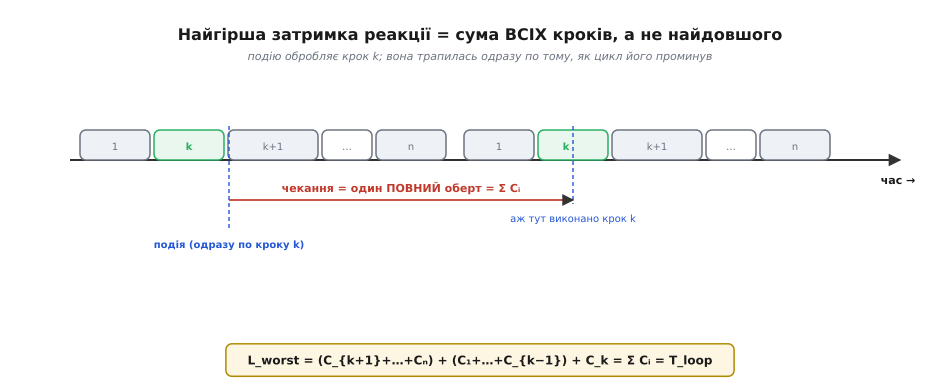
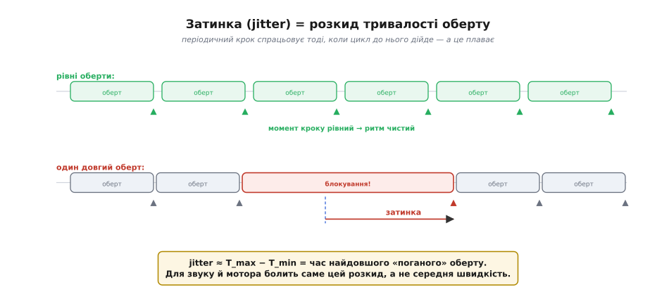
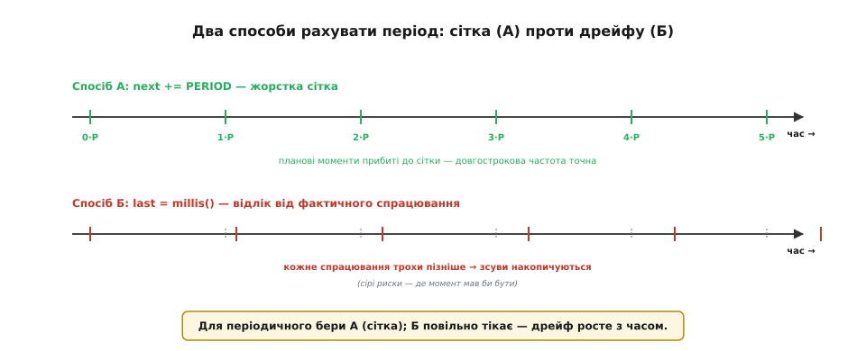
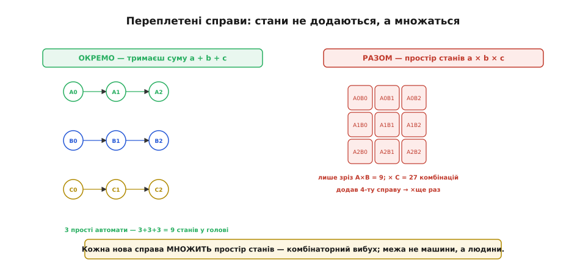
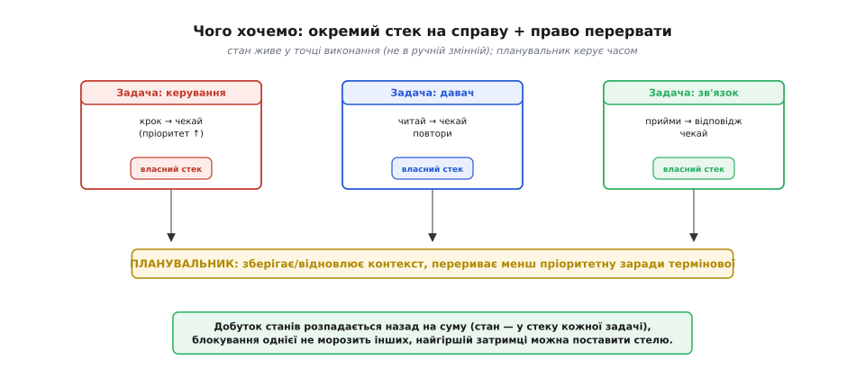

# Межі super-loop: детально

У [базовому кроці](root:embedded/super-loop-limits) ми назвали п'ять облич, якими super-loop упирається в стелю: блокування, в'яла чуйність, межа патерну `millis`, вибух машин станів і брак пріоритетів. Там ми показали їх на пальцях — щоб побачити, **що** ламається. Тепер копнемо глибше й спитаємо **наскільки** й **чому саме так**: виведемо формулу найгіршої затримки з нуля, покажемо, звідки береться затинка й чому середнє число тут бреше, розберемо, як завантаженість процесора ставить тверду межу «встигаємо чи ні», доведемо, чому дві манери рахувати `millis` дають різну довгострокову точність, і — найважче — покажемо на числах, що заплутаність машин станів росте не додаванням, а множенням. Це той самий сюжет, лише тепер із викладками, граничними випадками й реальним кодом прошивки, який видно на осцилографі.

Одразу застережемо межу розмови, щоб не плутати два різні «повільно». Super-loop **ніколи не буває швидшим за суму своїх кроків** — це його фізична стеля, і жоден трюк її не зсуне; можна лише зробити кроки коротшими. Усе, про що йдеться далі, — не про те, як прискорити цикл, а про те, як його **передбачити**: коли він устигає, наскільки рвана його реакція і де ця рваність стає нестерпною. Саме передбачуваність, а не гола швидкість, і виявиться тим, чого super-loop дати не може, — і саме її дасть перехід до задач.

### Скільки насправді чекає подія: виведення L_worst = Σ Cᵢ

Почнімо з чуйності, бо тут ховається найпоширеніша помилка інтуїції. Хочеться сказати: «найгірша затримка реакції — це найдовший крок циклу». Звучить розумно, але це **неправда**, і різниця буває в рази. Виведемо правильну відповідь чесно, з першопринципів.

Уявімо цикл із `n` кроків, що виконуються строго по порядку. Позначмо тривалість `i`-го кроку через `Cᵢ` (від англ. *computation* — обчислення; це час, який крок з'їдає щопроходу). Тоді повний оберт циклу триває

```
T_loop = C₁ + C₂ + … + Cₙ = Σ Cᵢ
```

Тепер нехай подію — натиснуту кнопку, прихід байта, спрацьований давач — обробляє якийсь конкретний крок `k`. Питання: у **найгіршому** разі скільки часу мине від моменту події до моменту, коли крок `k` її нарешті обробить?

Ключ — у слові «строго по порядку». Крок `k` виконується раз за оберт, у своїй позиції. Найлихіший збіг обставин — коли подія трапляється **одразу по тому**, як цикл щойно проминув крок `k` цього оберту. Тоді крок `k` цю подію проґавив (її ще не було, коли він виконувався) і зможе взятися за неї лише **наступного оберту**. А до наступного `k` треба спершу домолотити хвіст цього оберту — кроки `k+1 … n` — і початок наступного — кроки `1 … k−1`. Складімо:

```
чекання = (C_{k+1} + … + Cₙ)     ← хвіст поточного оберту
        + (C₁ + … + C_{k−1})     ← голова наступного оберту
        + C_k                    ← нарешті виконується крок k
        = Σ Cᵢ = T_loop
```


*Подію обробляє крок k. Найгірше, коли вона надходить одразу після того, як цикл проминув k: тоді її помітять лише на наступному k, а до нього треба пройти хвіст поточного оберту й голову наступного. Сума цих шматків — рівно один повний оберт, тобто Σ Cᵢ, а не найдовший крок.*

Дивовижно чистий результат: **найгірша затримка реакції дорівнює тривалості цілого оберту, а не найдовшого кроку**. Хвіст плюс голова плюс сам крок `k` завжди складаються в повний цикл, хоч би де в ньому сидів крок `k`. Ось чому інтуїція «винен найдовший крок» помиляється: винні **всі кроки разом**. Найдовший крок лише робить `T_loop` більшим — але навіть якби всі кроки були однакові, затримка все одно дорівнювала б їхній сумі.

Уточнимо межі цього твердження, бо вони важливі. По-перше, ми припустили, що подію обробляє рівно один крок і що вона не губиться (якщо крок `k` лише **зчитує стан**, приміром рівень на піні, то повільна подія дочекається; а от короткий імпульс між двома проходами `k` можна проґавити зовсім — і це вже не затримка, а **втрата**, окрема біда). По-друге, ми знехтували [перериваннями](topic:programming/interrupts): вони можуть вихопити процесор посеред будь-якого кроку. Переривання рятують саме **термінову** реакцію — обробник спрацьовує поза чергою за десятки тактів, — але тіло реакції все одно найчастіше живе в головному циклі (обробник має бути коротким), тож для «звичайної» роботи формула `L_worst = T_loop` лишається чинною. І по-третє: ми взяли `Cᵢ` сталими. У реальності вони плавають — і саме з цього плавання народжується наступна біда, затинка.

> 🔧 **Навіщо це.** Ця формула — ваш інструмент оцінки ще до першого запуску. Хочете гарантувати реакцію на кнопку за 20 мс — складіть найгірші тривалості **всіх** кроків циклу й перевірте, що сума менша за 20 мс. Якщо серед кроків є хоч один блокувальний на 50 мс, жодні оптимізації решти не врятують: `T_loop` уже понад межу. Саме так рахують, чи вкладається пристрій у вимогу до чуйності, — і саме тут super-loop найчастіше провалюється мовчки, бо на середньому проході все здається жвавим.

**Приклад: реальна затримка проти уявної.** Цикл верстата має п'ять кроків: опитати давачі (`C₁ = 0.2` мс), порахувати керування (`C₂ = 0.5` мс), оновити дисплей (`C₃ = 8` мс — повільна шина до екрана), записати рядок у журнал (`C₄ = 3` мс), перевірити кнопку аварійного стопу (`C₅ = 0.1` мс). Інтуїція каже: найдовший крок — дисплей, 8 мс, отже стоп спрацює найпізніше за 8 мс. Порахуймо чесно:

```c
// найгірший випадок: кнопку натиснуто одразу ПІСЛЯ перевірки стопу (крок 5)
// тоді її помітять лише наступного оберту, знову на кроці 5
T_loop = 0.2 + 0.5 + 8.0 + 3.0 + 0.1;   // = 11.8 мс
// стоп чекає майже цілий оберт, а не «найдовші 8 мс»
L_worst = T_loop;                        // = 11.8 мс
```

Реальна найгірша затримка — 11.8 мс, майже на половину більша за «очевидні» 8 мс. А додайте туди ще й запис на SD-картку, що зрідка блокує на 40 мс, — і найгірший оберт стрибне за 50 мс, хоч «типовий» лишиться коротким. Пристрій, що на столі реагує миттєво, у полі раз на кількасот проходів застигне рівно тоді, коли зійдуться найдовші кроки, — і зловити це буде важко, бо усереднена картина бреше.

### Затинка = T_max − T_min, і чому середнє тут бреше

Ми щойно припустили сталі `Cᵢ`. Насправді тривалість кроку плаває від проходу до проходу: гілка `if` то виконалась, то ні; давач цього разу відповів швидко, а наступного — забарився; журнал зрідка змиває буфер на диск. Через це й **тривалість цілого оберту** гуляє: буває короткий оберт `T_min`, а буває довгий `T_max`. Оцей розкид і є **затинка** (англ. *jitter* — тремтіння, дрож): не сама затримка, а її **непостійність** від проходу до проходу.

Чому це окрема біда, а не та сама чуйність? Бо для цілого класу задач болить саме рівність ритму, а не його швидкість. Періодичний крок — сформувати наступний семпл звуку, крутнути крок мотора, зняти показ давача точно раз на інтервал — у super-loop спрацьовує тоді, **коли цикл до нього дійде**. А доходить він щоразу в трохи інший момент, бо попередні кроки цього оберту зайняли трохи різний час. Момент періодичної дії «дихає» туди-сюди — і саме це дихання чути у звуку як хрип, видно в керуванні мотором як посмикування, ловиться в даних давача як фальшива складова частоти.


*Згори — рівні оберти: момент періодичного кроку припадає на однакові позначки, ритм чистий. Знизу — один оберт роздувся від блокування, і момент кроку зсунувся вправо. Різниця між тим, де крок мав спрацювати, і де спрацював, — це затинка; на слух і на моторі болить саме вона, а не середня швидкість.*

Оцінімо величину затинки. Періодичний крок спрацьовує на початку «свого» оберту; отже, інтервал між двома його спрацюваннями дорівнює тривалості оберту, що між ними вклинився. Найкоротший інтервал — `T_min`, найдовший — `T_max`. Розкид моменту, тобто розмах затинки, у першому наближенні:

```
jitter ≈ T_max − T_min
```

Ось чому **середня тривалість оберту нічого не гарантує**. Хай у нас цикл, де 999 проходів із тисячі тривають 1 мс, а кожен тисячний — 20 мс (зрідка блокує картка). Середній оберт — приблизно 1.02 мс, майже ідеал. Та звук усе одно захрипить, бо раз на тисячу семплів момент з'їде на 19 мс — а вухо ловить не середнє, а **найгірший випадок**. Тут криється глибша істина про системи реального часу: їхня якість вимірюється не середнім і навіть не типовим числом, а **хвостом розподілу** — найгіршим, хай і рідкісним, обертом. Super-loop цим хвостом керувати не вміє: досить однієї нової важкої справи — і `T_max` підскакує, тягнучи затинку за собою, хоч середнє майже не ворухнеться.

Звідси практичне правило вимірювання: профілюючи super-loop, дивіться не на середню тривалість оберту, а на **максимальну** за довгий прогін. Виміряти її легко просто в коді:

```c
void loop() {
    uint32_t t0 = micros();
    do_all_steps();                 // усі кроки циклу
    uint32_t dt = micros() - t0;    // тривалість цього оберту (стійке до переповнення micros)

    static uint32_t t_max = 0;
    if (dt > t_max) {               // тримаємо лише найгірший бачений оберт
        t_max = dt;
        Serial.printf("new worst loop: %lu us\n", t_max);
    }
}
```

Саме `t_max`, а не усереднення, скаже правду про чуйність і затинку. І щойно ви побачите, що `t_max` у рази більший за типовий оберт, — це кількісний доказ, що super-loop тримається лише «в середньому», а гарантії не дає. Гарантію верхньої межі затримки — те, чого super-loop не має принципово, — дає вже [операційна система реального часу](topic:programming/freertos): її сенс не в швидкості, а саме в **обмеженні найгіршого випадку згори**.

### Завантаженість процесора: коли цикл узагалі перестає встигати

Досі ми питали, наскільки рвана реакція. Є питання ще жорсткіше: а чи цикл **узагалі встигає** робити всю періодичну роботу вчасно? Тут super-loop підкоряється тому самому закону, що й будь-яка система з періодичними завданнями, і його варто вміти рахувати.

Нехай серед справ є періодичні: справа `i` мусить виконуватися раз на період `Tᵢ` і забирає щоразу `Cᵢ` часу. Частка процесорного часу, яку вона з'їдає, — це `Cᵢ / Tᵢ`. Сума таких часток по всіх періодичних справах зветься **завантаженістю** (англ. *utilization*, «використання»):

```
U = C₁/T₁ + C₂/T₂ + … = Σ (Cᵢ / Tᵢ)
```

Груба, але непорушна умова: якщо `U > 1`, процесор фізично не встигає — робота накопичується швидше, ніж виконується, і система «захлинається» (черги ростуть, дедлайни зриваються без надії надолужити). Це стеля, спільна для будь-якого підходу, і super-loop її не обходить. Але — і це головне — super-loop починає зривати дедлайни **задовго до** `U = 1`, бо не вміє переставляти роботу за терміновістю.

Розберімо чому, на найпростішому випадку. Хай є періодична справа з коротким періодом — скажімо, семпл звуку раз на 1 мс (`C = 0.1` мс, `T = 1` мс, це лише 10 % завантаження). І є рутина — оновлення дисплея на 8 мс, яке трапляється зрідка. У super-loop, коли надходить час дисплея, він виконується **цілком**, бо цикл лінійний і перервати його нема кому. Усі 8 мс звук чекає — і зривається вісім разів поспіль, хоч сумарна завантаженість системи мізерна. Формально `U` далеко від одиниці; практично — дедлайн зірвано, бо **довгий низькопріоритетний крок заблокував короткий терміновий**.

Ось точна межа super-loop, сформульована в цих термінах: він тримає дедлайни, лише поки **найдовший неперервний крок коротший за найтісніший дедлайн**. Тобто мало, щоб вистачало `U`; треба ще, щоб жоден окремий крок не був довшим за період найтерміновішої справи:

```
умова super-loop: max(Cᵢ) < min(Tⱼ)   для всіх кроків i та періодичних справ j
```

Щойно найдовший крок переростає найкоротший потрібний період — усе, super-loop приречений зривати цей період, хоч би скільки вільного часу лишалось усереднено. І тут криється якісна різниця з витісняючою системою: та може **перервати** довгий крок дисплея заради термінового семпла й повернутися до дисплея потім. Тому їй досить умови `U < межа` (для витісняючих планувальників з пріоритетами ця межа сувора й доведена — [розбираємо її окремо](root:embedded/super-loop-limits/math-utilization-bound.md)); super-loop же потребує додатково нездійсненного за наявності довгих кроків `max(Cᵢ) < min(Tⱼ)`. Саме нездоланність цього другого обмеження, а не брак «швидкості», і робить super-loop непридатним, щойно з'являється короткий жорсткий дедлайн поряд із довгою роботою.

> 🔧 **Навіщо це.** Перш ніж узагалі писати цикл, випишіть свої періодичні вимоги парами «як часто / скільки триває» і порахуйте дві речі: суму `Σ Cᵢ/Tᵢ` (чи є взагалі запас часу) і найдовший неперервний крок проти найкоротшого періоду. Перша перевірка — універсальна стеля; друга — власна стеля super-loop. Провалили другу, хоч перша з великим запасом, — це точний, кількісний сигнал, що вам потрібне **витіснення**, а не швидший код.

### Патерн millis: три граничні випадки, яких не видно згори

[Патерн `millis`](topic:programming/super-loop) — головний спосіб обійти блокування в super-loop без окремих потоків: замість `delay()` ми запам'ятовуємо мітку часу й на кожному проході питаємо, чи не пора діяти. У базовому кроці ми сказали, що в нього низька стеля. Тут розберемо три його тонкощі, які згори не видно, але кожна вже кусала не одного розробника: **нарізка** (гранулярність), **дрейф** (яка манера рахувати період точна) і **переповнення** (що станеться на 50-й день).

#### Гранулярність: наскільки дрібно вдалося порізати

Патерн `millis` імітує одночасність, ріжучи кожну справу на шматочки, що виконуються по одному щопроходу. Але між двома перевірками одного шматка минає **цілий оберт циклу** — а отже, `T_loop` стає **зерном часу** для всього. Ви не можете зреагувати чи діяти точніше, ніж раз на оберт. Якщо `T_loop = 5` мс, то будь-який ваш `if (millis() - last >= period)` спрацює із запізненням до 5 мс проти наміченого моменту — просто тому, що раніше цикл до перевірки не дійде. Точність періодичної дії обмежена згори тривалістю оберту, і покращити її можна лише вкоротивши оберт, тобто знову впершись у суму всіх кроків.

Звідси ще одна річ, яку легко проґавити: `millis` **не ділить неподільне**. Він працює, лише коли справу вже порізано на короткі неблокувальні шматки. Крок, що блокує **зсередини** (мережевий запит, читання картки, повільний давач із очікуванням готовності), нарізати нíчого — він атомарний зсередини, і `millis` над ним безсилий. Це та сама межа, що й у базовому кроці, лише сказана точніше: `millis` керує **проміжками між** шматками, але не вміє вкоротити **сам** довгий шматок.

#### Дрейф: сітка проти відліку від фактичного

Тепер тонкість, на якій спотикаються навіть досвідчені. Періодичну дію на `millis` можна написати двома способами, і вони **не еквівалентні** — один довгостроково точний, другий повільно тікає.

```c
// Спосіб А — «жорстка сітка»: наступний момент рахуємо від планового
static uint32_t next = 0;
if (millis() - next >= 0 ... ) { ... }        // спрощено; суть нижче
    // насправді:
if ((int32_t)(millis() - next) >= 0) {
    next += PERIOD;                            // прибиваємо до сітки 0, P, 2P, 3P…
    do_periodic();
}

// Спосіб Б — «відлік від фактичного»: запам'ятовуємо момент спрацювання
static uint32_t last = 0;
if (millis() - last >= PERIOD) {
    last = millis();                           // відлік від ТЕПЕР, а не від планового
    do_periodic();
}
```

Різниця в одному рядку — `next += PERIOD` проти `last = millis()` — а наслідок глибокий. У способі Б ми відлічуємо наступний період від **фактичного** моменту спрацювання. Але спрацювало воно з невеликим запізненням `δ` (бо цикл дійшов до перевірки не миттєво). Наступний період відлічиться від уже запізнілого моменту, до нього додасться нове `δ`, і так запізнення **накопичується**: за багато періодів дія повзе дедалі пізніше. Це й є **дрейф** (англ. *drift* — знесення, зсув).


*Спосіб А (next += PERIOD) прибиває моменти до сітки 0, P, 2P…: одиничні запізнення не накопичуються, довгострокова частота точна. Спосіб Б (last = millis()) відлічує від фактичного, уже запізнілого спрацювання — кожне запізнення додається до наступного, і моменти повзуть управо. Сірі риски — де момент мав би бути.*

Порахуймо дрейф на числах. Хай `PERIOD = 100` мс, а через важкі кроки кожне спрацювання запізнюється в середньому на `δ = 2` мс. У способі Б за годину набіжить:

```
спрацювань за годину ≈ 3600 с / 0.1 с = 36000
накопичене зміщення ≈ 36000 × 2 мс = 72 000 мс = 72 с
```

За годину дія «поїде» більш ніж на хвилину — годинник на такому коді відстане, семпли розсинхронізуються. У способі А того самого запізнення `δ` **не накопичується**: `next` завжди прив'язаний до жорсткої сітки `0, P, 2P, …`, тож одиничне запізнення компенсується наступного разу, і довгострокова частота лишається точною. (Ціна способу А — якщо цикл десь застряг довше за кілька періодів, `next` відстане настільки, що дія спробує «наздогнати» кількома спрацюваннями поспіль; це окремий випадок, який теж треба обробити, обмеживши наздоганяння.) Правило просте: для **періодичної** дії, де важлива довгострокова частота, беріть сітку (спосіб А); відлік від фактичного (спосіб Б) годиться лише для «зачекати приблизно стільки», де дрейф байдужий.

#### Переповнення: що станеться на 50-й день

І найкрасивіша тонкість. `millis()` повертає 32-бітове беззнакове число мілісекунд від старту. Воно не може рости вічно: максимум для 32 біт — це `2³² − 1 = 4 294 967 295`. Порахуймо, коли лічильник переповниться й скине в нуль:

```
2³² мс = 4 294 967 296 мс
       = 4 294 967.296 с
       ≈ 49.71 доби
```

Приблизно кожні **49.7 доби** `millis()` «перескакує» через нуль (англ. *rollover*, *wraparound* — переповнення з обгортанням). Пристрій, що працює місяцями без перезавантаження — шлюз, лічильник, метеостанція, — неодмінно цей момент переживе. І тут причаїлася підступна пастка. Наївний код

```c
if (millis() >= next) { ... }   // ПАСТКА: ламається на переповненні
```

на 50-й день зламається: `next` порахований до переповнення (велике число, близьке до `2³²`), а `millis()` після переповнення знову маленький — умова `millis() >= next` стане хибною надовго, і дія **застрягне** на десятки діб. Класична бомба сповільненої дії: код місяць працює бездоганно, а тоді раптово завмирає, і причину майже нереально відтворити на столі.

Рятунок елегантний — і працює саме завдяки тому, що арифметика **беззнакова**. Треба рахувати не «поточний час проти планового», а **різницю** «скільки минуло від мітки»:

```c
if (millis() - last >= PERIOD) { ... }   // ПРАВИЛЬНО: стійке до переповнення
```

Чому це рятує? Беззнакове віднімання за самим означенням виконується **за модулем 2³²**: якщо зменшуване менше за від'ємник (бо `millis()` уже перескочив через нуль, а `last` лишився з-перед переповнення), результат не стає від'ємним — до нього автоматично додається `2³²`, і виходить рівно правильна кількість мілісекунд, що минула. Покажемо на маленькому числі для наочності, узявши для прикладу 8-бітову арифметику (модуль `2⁸ = 256`), — логіка та сама, лише числа менші:

```
last     = 250   (мітка зроблена перед переповненням)
millis() =  10   (уже перескочив через 0: 251,252,…,255,0,1,…,10)
різниця  = 10 - 250 = -240  →  за модулем 256:  -240 + 256 = 16

тобто від мітки минуло рівно 16 «мс»
(5 кроків 250→255 плюс 11 кроків 0→10 — точно так)
```

Різниця вийшла правильна — 16, — попри те що лічильник між міткою й виміром перескочив через нуль. Те саме діється й на справжніх 32 бітах: `millis() - last` завжди дає коректний проміжок, аби тільки він сам не перевищував **половини** діапазону. Ось і остання межа: правило стійке, поки вимірюваний інтервал коротший за `2³¹` мс — приблизно **24.5 доби**. Довше — і різниця «загорнеться» повторно, ставши двозначною (модульна арифметика вже не відрізнить `Δ` від `Δ + 2³²`), тож для інтервалів у тижні й місяці 32 біт замало й треба ширший лічильник. Для звичайних інтервалів (мілісекунди, секунди, хвилини) правило `millis() - last >= PERIOD` — залізне, і саме так його треба писати завжди, навіть у коді, який «точно не працюватиме 50 днів»: одного дня він працюватиме.

### Машини станів: чому заплутаність множиться, а не додається

Тепер до серця того, чому super-loop «не масштабується». У базовому кроці ми сказали: кожна нова справа не додає заплутаності, а множить її. Це не метафора — це буквальна арифметика простору станів, і її варто побачити на числах, бо саме вона, а не якась технічна вада, кладе людську стелю патерну.

Згадаймо, звідки взагалі беруться машини станів. Проста послідовна думка — «зроби A, **почекай**, зроби B, почекай, зроби C» — у світі без блокування не може існувати як є: під час «почекай» цикл мусить займатися іншими справами, тож зупинитися й почекати ми не можемо. Доводиться **вивернути** послідовність навиворіт: завести змінну стану, і на кожному проході питати «у якій я фазі?», робити належне цій фазі й переходити далі. Лінійний код, що читався згори вниз, розсипається на набір станів і переходів між ними — **машину станів** (англ. *state machine*).

Для однієї справи це ще півбіди: три кроки з паузами дають три-чотири стани, які ще можна втримати в голові. Біда починається, коли справ **кілька й вони переплітаються** в одному циклі. І тут вступає в дію жорстока комбінаторика.


*Ліворуч: три справи як три окремі автомати — у голові тримаєш суму a + b + c станів (тут 3+3+3 = 9). Праворуч: ті самі справи, переплетені в одному циклі, — простір їхніх спільних станів є декартовим добутком a × b × c. Лише зріз A×B дає 9 клітинок, а з третьою справою — 27; кожна нова справа множить простір іще раз.*

Ось у чому суть. Якщо три справи були б **справді незалежні** — кожна у своєму окремому потоці, кожна нічого не знає про інших, — то, думаючи про систему, ви тримали б у голові стани **окремо**: `a` станів першої **плюс** `b` другої **плюс** `c` третьої. Разом `a + b + c` — сума. Але в super-loop вони живуть в **одному** циклі й **впливають одна на одну через час**: те, у якій фазі перша справа, змінює, коли й що робить друга. Щоб міркувати про систему коректно, доводиться тримати в голові не окремі стани, а **комбінації** — «перша у фазі 2, друга у фазі 1, третя у фазі 3». А кількість комбінацій — це вже **добуток**:

```
незалежно (окремі потоки):   a + b + c        ← сума
переплетено (один super-loop): a × b × c        ← добуток (декартів простір станів)
```

Порахуймо на скромних числах. Три справи по три стани кожна:

```
сума:    3 + 3 + 3 = 9    комбінацій станів
добуток: 3 × 3 × 3 = 27   комбінацій станів
```

Дев'ять проти двадцяти семи. Додаємо четверту справу на три стани:

```
сума:    9 + 3  = 12
добуток: 27 × 3 = 81
```

Дванадцять проти вісімдесяти одного. Різниця росте нестримно: сума — лінійно, добуток — **як степінь**. Ось точний зміст фрази «кожна нова справа множить заплутаність»: вона буквально **множить** розмір простору станів, у якому доводиться думати про правильність, ловити перегони й дошукуватися рідкісних збоїв. Це той самий **комбінаторний вибух** (англ. *combinatorial explosion*), що робить перебірні задачі нерозв'язними, — лише тут він вибухає не в машині, а в **голові супроводжувача**.

Тому межа тут — не технічна, а **людська**, і саме через це вона так небезпечна: компілятор не попередить, тести проходять, пристрій ніби працює. Але людина фізично не тримає у свідомості 81 комбінацію взаємних фаз — і тому раз у раз забуває якийсь перехід, ламає тонкий часовий баланс сусідньої справи однією правкою в цій, дивиться на рідкісний збій, що спрацьовує лише за конкретного збігу фаз, і не може його відтворити. Класичне «усе працювало, доки я не додав ще одну справу» — це буквально момент, коли добуток станів переріс те, що вміщає голова.

Додамо ще одну тонкість, яку часто недобачають, — **спільний стан**. Справи в super-loop не лише переплетені в часі; вони часто чіпають ті самі змінні (глобальний прапорець «пристрій зайнятий», спільний буфер, статус мотора). Через це фази не просто множаться комбінаторно — вони **зчіплюються причинно**: правильність однієї справи починає залежати від того, у якому стані інша лишила спільну змінну. Це та сама біда, що в справжній багатозадачності зветься **перегонами даних**, лише тут вона прихована за тим, що потік один. Розчепити цей клубок надійно вручну майже неможливо — і саме бажання розчепити його й підводить до думки, що кожна справа має жити окремо, зі **своїм** станом, недосяжним для інших.

### Пріоритети: чому переривань не досить

П'яте обличчя — брак пріоритетів. У super-loop справи перевіряються строго в порядку коду, тож терміновому нема як пробитися вперед: воно чекає своєї черги нарівні з найбуденнішою рутиною. Тут ми поглибимо два питання: **чому переривання не рятують повністю** і що саме дає справжній пріоритет, чого немає в циклі.


*Цикл іде за списком: оновити екран, записати лог, порахувати — і лише потім терміновий аварійний стоп. Сказати «це важливіше, виконай негайно» super-loop не вміє: терміновому доводиться чекати, доки відпрацює вся рутина перед ним.*

Перший інстинкт — «винесемо термінове на [переривання](topic:programming/interrupts)». І справді, апаратне переривання — єдиний у super-loop спосіб дати чомусь пріоритет: воно вихоплює процесор посеред будь-якого кроку, за десятки тактів. Але переривання — інструмент **вузький**, і його обмеження показують, чому їх не досить.

По-перше, обробник переривання мусить бути **коротким**. Поки він працює, інші (нижчопріоритетні) переривання чекають, а система, по суті, «сліпа» до нових подій. Тому в обробник не запхаєш повноцінну реакцію — розібрати пакет, порахувати керування, оновити екран. Правило залізне: обробник лише **фіксує факт** (звів прапорець, поклав байт у буфер) і негайно виходить, а важку роботу лишає головному циклу. А отже, тіло реакції все одно повертається в super-loop — з усіма його бідами.

По-друге, обробник **не може блокувати** й не може чекати. Викликати `delay()`, чекати на байт, брати повільний давач у перериванні — заборонено: це заморозить не лише цикл, а й усе, що нижче за пріоритетом. Тож будь-яка робота з очікуванням — знову в головний цикл.

По-третє, переривань фізично **небагато**, і вони прив'язані до апаратних подій (пін, таймер, готовність периферії). Ви не можете завести переривання на абстрактну програмну подію «місію завершено» чи «дані готові до обробки». І, найтонше, — між обробником і циклом виникає той самий **спільний стан** (прапорці, буфери), що вимагає обережності з перегонами; недбале звернення до спільної змінної з переривання й з циклу дає рідкісний, невідтворний збій. Механіку цих гонок і те, як обробник узгоджують за пріоритетами, розбираємо в темі [пріоритетів переривань](topic:programming/interrupt-priorities).

Складімо: переривання дають пріоритет лише **короткій, неблокувальній, апаратно прив'язаній** реакції. А більшість реальної термінової роботи — довша, з очікуванням, прив'язана до програмної логіки. Для неї в super-loop немає механізму сказати «**ця** робота важливіша за ту, тож хай іде першою, навіть перервавши іншу». Саме цього — програмного, витісняючого пріоритету над **звичайними** справами — і бракує; і саме це дасть планувальник із пріоритетами.

### Півзаходи: кооперативний цикл і чому він не рятує до кінця

Перш ніж визнати, що потрібне повноцінне витіснення, чесно розгляньмо проміжні рішення — вони популярні, і важливо розуміти, докуди вони дотягують, а де здаються. Це вбереже від двох помилок: тягти важкий RTOS туди, де вистачило б простішого, і навпаки — героїчно «дотискати» цикл там, де він уже безнадійний.

Найпоширеніший півзахід — **кооперативний цикл** (англ. *cooperative* — той, що співпрацює): ми лишаємо єдиний цикл, але оформляємо кожну справу як окрему функцію-крок, яку цикл викликає по черзі, а справи **добровільно** віддають керування, роблячи потроху й швидко повертаючись. Це вже майже планувальник — тільки без права **відібрати** процесор; він лише чемно передає його по колу, покладаючись на те, що кожна справа сама вчасно поступиться. Часто це доводять до **кооперативних потоків** (протопотоків, англ. *protothreads*) — трюку, що дозволяє писати справу як лінійний код із «паузами», а компілятор під капотом перетворює її на машину станів. Виглядає як розв'язання проблеми машин станів — і почасти воно й є, [окремо розберемо цей трюк на робочому коді](root:embedded/super-loop-limits/proj-cooperative-scheduler.md).

Але два корені біди кооперативний підхід **не виполює**. Перший: він, як і раніше, **не витісняє**. Якщо одна справа взяла довший шматок — чи то блокувальний виклик, який годі порізати, чи то просто важке обчислення, — усі інші **чекають**, бо відібрати процесор нема кому. Уся математика найгіршої затримки з початку цієї статті — `L_worst = Σ Cᵢ` — лишається чинною: кооперативний цикл робить кроки акуратнішими, але не вкорочує найдовший із них і не дає перервати його заради термінового. Другий корінь — у стеку. Протопотоки зазвичай **стекові без збереження стеку** (англ. *stackless*): їхні «паузи» не зберігають кадр викликів, тож локальні змінні між паузами **не виживають**, а поставити паузу всередині вкладеного виклику не можна. Тобто ілюзія лінійного коду тонка: щойно справі потрібні складний стан через паузу чи пауза в глибині виклику — трюк ламається, і ви знову вручну виносите стан у статичні змінні, тобто знову пишете машину станів.

Звідси видно точну межу півзаходів. Кооперативний цикл — чудовий вибір, коли справи **вже неблокувальні й короткі**, а вам бракує лише охайного способу їх чергувати й трохи причесати машини станів. Але він безсилий там, де є **принципово довгий чи блокувальний** крок або потрібне **тверде витіснення** термінового над рутиною. А це рівно ті випадки, задля яких і існує наступний рівень.

### Чого ми хочемо, тепер точно

Складімо все докупи — і побачимо, що п'ять скарг указують на три конкретні механізми, яких бракує. Не на «щось краще», а саме на ці три, і кожен прямо гасить свою біду.


*Кожна справа — окрема послідовна задача з ВЛАСНИМ стеком: її стан живе в точці виконання, а не в ручній змінній. Планувальник зберігає й відновлює контекст і має право перервати менш пріоритетну заради термінової. Так добуток станів розпадається назад на суму, блокування однієї не морозить інших, а найгіршій затримці можна поставити стелю.*

Перше — **власний стек на кожну справу**. Це найглибша зміна, і саме вона розчиняє машини станів. Коли справа має свій [стек](topic:programming/task-stacks), її стан живе **в точці виконання** — у тому, де саме стоїть лічильник команд і що лежить на стеку, — а не в ручній змінній `state`. Тоді «почекати» можна написати прямо посеред лінійного коду, і після паузи виконання просто продовжиться з того самого місця, з живими локальними змінними. Пам'ятаєте добуток `a × b × c`? Він розпадається **назад на суму** `a + b + c`: кожна справа знову тримає свій стан **сама, в собі**, і думати про них можна нарізно, бо їхні фази більше не переплетені в спільній голові циклу. Комбінаторний вибух зникає не тому, що ми стали розумніші, а тому, що стан перестав бути спільним.

Друге — **механізм чекання, що віддає процесор**. У super-loop «почекати» означало заморозити все; нам потрібне протилежне — щоб справа, кажучи «мені поки нема чого робити», **звільняла** процесор для інших. Тоді блокувальне очікування однієї справи (200 мс мережі, читання картки) перестає бути катастрофою: поки вона спить, працюють інші. Та сама операція, що нищила super-loop, стає нешкідливою паузою. І саме це відв'язує чуйність від суми кроків: `L_worst = Σ Cᵢ` тримається лише тому, що в циклі очікування = простій; коли очікування = поступка, формула більше не діє.

Третє — **витісняючий планувальник із пріоритетами**. Нам потрібен розпорядник, що серед готових справ обирає **найтерміновішу** й має право **перервати** менш важливу заради неї. Це те, чого не дали ні порядок коду, ні короткі переривання: програмний пріоритет над **звичайною** роботою. З ним найгіршій затримці термінової справи нарешті можна поставити **стелю** згори — бо її більше не тримає в заручниках довгий крок рутини. Саме обмеження найгіршого випадку, а не швидкість, і є та властивість, задля якої існують [операційні системи реального часу](topic:programming/freertos).

Кожен із трьох механізмів коштує — і про це чесно, щоб не творити нового міфу «RTOS завжди краще». Власний стек на задачу з'їдає **пам'ять** — від кількох сотень байтів до кількох кілобайтів на задачу, і замало виділити не можна (переповнення стека — загадковий збій), а забагато — марнотратство дорогої RAM. Саме перемикання контексту коштує **тактів**: на кожному перемиканні треба зберегти й відновити регістри ядра — на ARM Cortex-M вісім слів (32 байти) стека кладе апаратно вже сам вхід у переривання, решту доробляє планувальник, разом кілька мікросекунд щоразу. І найголовніше — з'являється цілий новий клас турбот: коли задачі справді біжать «одночасно» й чіпають спільні дані, повертаються **перегони й взаємні блокування**, тепер уже по-справжньому, і їх треба свідомо гасити чергами й семафорами.

Тому висновок — тверезий, той самий, що й у базовому кроці, лише тепер спертий на числа. Доки справ мало, вони короткі й неблокувальні, а `T_loop` з великим запасом менший за всі ваші дедлайни — super-loop найрозумніший вибір: простіший, передбачуваніший, ощадніший до пам'яті. Але щойно виведені тут межі спрацьовують разом — найгірший оберт `Σ Cᵢ` переростає дедлайн, затинка `T_max − T_min` псує звук чи керування, найдовший крок довший за найтісніший період, добуток станів переростає голову, а термінову роботу нема як пропустити вперед — це вже не привід дотискати цикл, а точний, кількісний сигнал, що час переходити до задач. Перший крок туди — поняття [задачі](topic:programming/tasks): те, що нарешті дає одній справі «почекати», не спиняючи інших, і з чого починається все інше.
