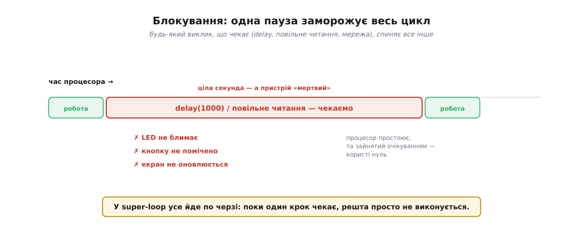
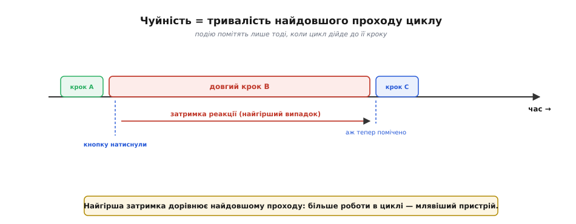
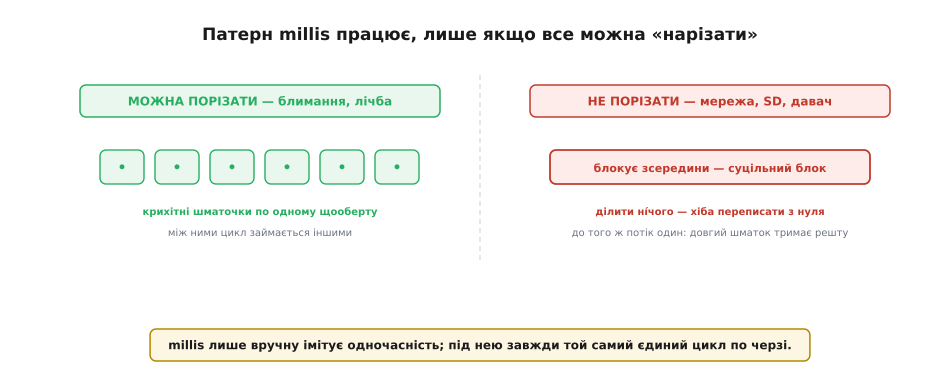
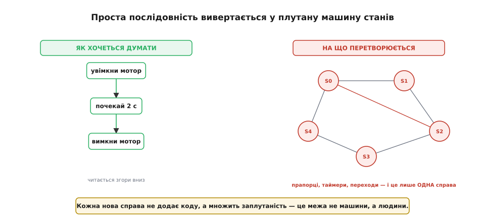
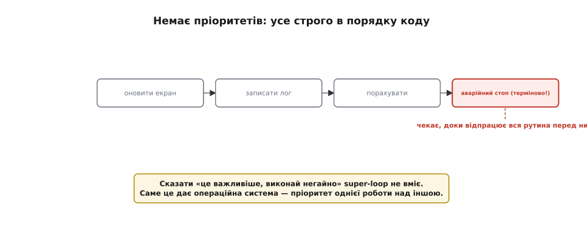
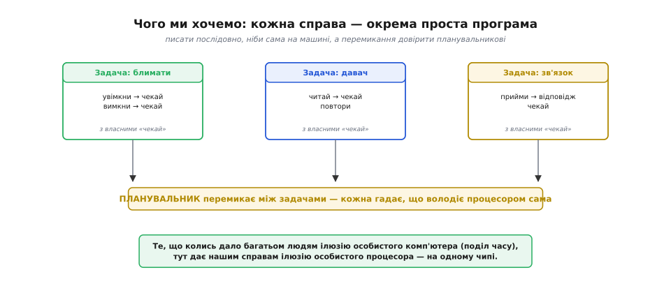

# Межі super-loop

[Super-loop](topic:programming/super-loop) простий і надійний для кількох коротких справ. Та варто навантажити його більшим — десятком справ, деякі з яких **мусять чекати**, — і чепурна модель починає тріщати. Ламається не **здатність** (super-loop теоретично може все), а **простота**: складність коду росте швидше за можливості, аж доки програму стає годі втримати в голові. Звідки ця біда береться, найкраще видно, якщо розкласти її на окремі обличчя: блокування, в'яла чуйність, межі патерну `millis`, вибух машин станів і брак пріоритетів. Кожне з них — самостійна тріщина, і разом вони й кладуть super-loop стелю.

### Блокування: одна пауза заморожує все

Головний лиходій — **блокування** (англ. *blocking* — перепиняти, загороджувати). Так називають будь-який виклик, що **чекає**: класичний `delay()`, повільне читання давача, очікування байта по зв'язку, мережевий запит. Біда в тім, що в super-loop усе виконується **по черзі**, тож поки один крок чекає, **весь** цикл стоїть — нічого іншого не відбувається.


*Поки в циклі тягнеться блокувальний крок (`delay(1000)` чи повільне читання), усе інше завмирає: світлодіод не блимає, кнопку не помічено, екран не оновлюється. Найприкріше — процесор тим часом простоює, та зайнятий очікуванням, тож користі з нього нуль.*

Наскільки це марнотратно, видно з простого підрахунку. Сучасний чип робить сотні мільйонів операцій за секунду — а через одне-єдине `delay(1000)` він цілу секунду стоїть стовпом, нічого не роблячи й нікому не відповідаючи. Це гірше, ніж просто повільно: пристрій на цей час фактично **мертвий**. І що більше в коді таких блокувальних місць, то частіше й довше все застигає. Уже звідси проступає межа super-loop: він зносить блокування лише доти, доки воно коротке й рідкісне.

Підступність блокування ще й у тім, що воно часто **приховане**. `delay()` видно одразу, а от що повільне читання вологоміра триває 50 мс, що `Serial.print` може **застрягти**, коли буфер переповнений, що бібліотека дисплея всередині чекає на готовність, — це з коду не впадає в око. Тож пристрій раптом починає «підморожувати» в найневиннішому місці. Перше правило діагностики тут: шукайте, **хто чекає**, — саме очікування, а не обчислення, найчастіше й краде чуйність. Тому досвідчений розробник, гортаючи чужу бібліотеку, насамперед видивляється в ній цикли очікування й виклики на кшталт `delay` чи `wait`.

### Чуйність = найдовший прохід

Друге обличчя проблеми — **чуйність** (англ. *responsiveness* — здатність відгукуватися), тобто як швидко пристрій реагує на події. У super-loop вона безжально проста: найгірша затримка реакції дорівнює тривалості **найдовшого проходу** циклу. Адже подію (натиснуту кнопку, прихід команди) цикл помітить лише тоді, коли дійде до відповідного кроку, — а в найгіршому разі вона трапиться якраз на початку довгого проходу й чекатиме майже до його кінця.


*Кнопку натиснули на початку довгого кроку — а помітять її аж наприкінці проходу. Затримка реакції в найгіршому разі дорівнює тривалості найдовшого оберту. Додаєш кроки чи довжиш їх — росте й ця затримка.*

Звідси неприємний висновок: **що більше роботи в циклі, то млявіший пристрій**. Доки прохід триває мікросекунди, реакція здається миттєвою; та коли в циклі назбирується важких кроків на десятки чи сотні мілісекунд, кнопки починають «залипати», звук — заїкатися, керування — запізнюватися. [Переривання](topic:programming/interrupts) рятують термінове — вони спрацьовують поза чергою, — але вони короткі й не годяться для повноцінної роботи; **головний потік** все одно гальмує, а більшість справ живе саме в ньому.

Окремо варто відрізняти **середню** затримку від **найгіршої**. Усереднено пристрій може здаватися жвавим, та керування й звук ламає саме найгірший випадок — рідкісний, але довгий прохід, що дає «затинку» (англ. *jitter* — тремтіння, дрож; коливання затримки від проходу до проходу). Для рівного звуку, плавного керування мотором чи точного опитування давача важлива не середня швидкість, а **гарантія**, що жоден прохід не затягнеться понад межу. Super-loop такої гарантії дати не може: досить однієї нової важкої справи — і найгірший випадок виростає, а з ним і помітні «затинки». Саме на цій гарантії й тримається відмінність: завдання операційної системи реального часу — не пришвидшити роботу, а **обмежити найгіршу затримку** згори, чого super-loop не вміє.

### Патерн millis рятує — але не завжди

Може здатися, що [патерн `millis`](topic:programming/super-loop) саме й рятує від блокування. Так, рятує — але має власну, доволі низьку стелю. Він працює лише тоді, коли **кожну** справу можна порізати на крихітні шматочки, що виконуються по одному щооберту. А багато операцій так **не вміють**: вони блокують **усередині себе**, і поділити їх не виходить.


*Ліворуч — справа, яку легко порізати на шматочки (блимання, лічба): патерн `millis` із нею чудово дає раду. Праворуч — операція, що блокує зсередини (мережевий запит, читання SD-картки, повільний давач): це суцільний блок, який не поділиш, хіба що переписати з нуля. До того ж один довгий шматок усе одно затримує решту — бо потік один.*

Тут криються одразу дві халепи. Перша: чужий код (бібліотека для дисплея, мережі, картки пам'яті) часто написаний **блокувально** — він сам усередині чекає, і ви не маєте куди вставити свою перевірку `millis`. Друга, глибша: навіть якщо ви все порізали, потік виконання **один**, тож варто комусь одному взяти довший шматок — і решта чекає. Патерн `millis` лише **вручну імітує** одночасність, а під нею завжди той самий єдиний цикл, що виконує все по черзі.

Частково тут зараджують **подієві** бібліотеки — ті, що не чекають, а викликають вашу функцію-обробник, коли результат готовий (зворотний виклик, англ. *callback* — виклик у відповідь). Вони допомагають не блокувати, та мають і свою ціну: логіка розсипається на розрізнені обробники, які важко зв'язати в єдину послідовну думку. Виходить той самий обмін: уникаєш блокування — платиш зрозумілістю. Цей компроміс і штовхає врешті до повноцінних задач, де «почекати» нарешті перестане бути проблемою.

> 🔧 **Навіщо це.** Перш ніж тягти важкий RTOS, чесно спитайте: а чи **всі** мої справи можна порізати на короткі неблокувальні шматки? Якщо так — [патерн `millis`](topic:programming/super-loop) ще довго вас вестиме, і ускладнювати не варто. Якщо ж серед справ є принципово блокувальні (мережа, файли, повільні протоколи) або їх просто забагато — це чесний сигнал, що super-loop вичерпується й час дивитися в бік задач.

### Ручні машини станів вибухають

Припустімо, ви все ж вирішили порізати кожну справу на шматочки. Тоді просту послідовну думку — «зроби A, **почекай**, зроби B, почекай, зроби C» — доводиться **вивертати** в машину станів: завести змінну стану, на кожному оберті перевіряти, у якій фазі ви зараз, робити належне й переходити далі. Для **однієї** справи це ще терпимо. Але справ багато, вони переплітаються — і машини станів **вибухають**.


*Ліворуч — як хочеться думати: проста послідовність «зроби — почекай — зроби», що читається згори вниз. Праворуч — на що вона перетворюється без блокування: плутана машина станів із купою переходів. А коли таких справ три й вони взаємодіють, їхні стани переплітаються в справжнє спагеті.*

Ось де ховається справжня причина, чому super-loop «не масштабується». Кожна нова справа не просто додає коду — вона **множить** заплутаність, бо мусить уживатися в часі з усіма іншими. Логіка, що в послідовному вигляді була б очевидною («увімкни мотор, зачекай дві секунди, вимкни»), розповзається на півдесятка станів, прапорців і таймерів, розкиданих по циклу. Люди **погано** тримають у голові таку ручну імітацію одночасності: легко забути перехід, переплутати стан, зламати чуже тонке налаштування часу однією правкою. Програма ще якось працює — та стає крихкою й страшною на дотик.

Найгірше виявляється під час супроводу. Машину станів важко **налагоджувати**: помилка — це не «не та формула», а неправильний перехід десь у плетиві умов, що спрацьовує лише за рідкісного збігу обставин. Класична фраза такого коду — «усе працювало, доки я не додав ще одну справу»: нова справа збила тонкий часовий баланс старих. Що більший проєкт, то страшніше до нього торкатися — а це вже не технічна межа, а **людська**, і саме вона зазвичай і вирішує перейти на задачі.

### Немає пріоритетів

Останнє обличчя проблеми — **відсутність пріоритетів**. У super-loop справи перевіряються строго в тому порядку, як написані в коді. А отже, **терміновому** нема як пробитися вперед: воно чекає своєї черги нарівні з найбуденнішою рутиною.


*Цикл перебирає справи в порядку коду: оновити екран, записати лог, порахувати… і лише потім — терміновий «аварійний стоп». Сказати «це важливіше, виконай негайно» super-loop просто не вміє: терміновому доводиться чекати, доки відпрацює вся рутина перед ним.*

Для багатьох пристроїв це фатально. Уявіть верстат, де є рутина (оновлювати дисплей, писати журнал) і є критична реакція (аварійний стоп за сигналом давача). У super-loop стоп чекатиме, доки цикл дійде до нього, — а це можуть бути ті самі небезпечні сотні мілісекунд. Звісно, найкритичніше виносять на переривання; та переривань небагато, вони мають бути блискавичними, і всю складну реакцію в них не запхаєш. Бракує саме того, що дає операційна система: можливості сказати «**ця** робота важливіша за ту, тож хай іде першою».

> 🔧 **Навіщо це.** Навчіться впізнавати симптоми, що super-loop вичерпався: пристрій «підморожує» під час певних операцій; блимання чи звук «затинаються»; додавання нової справи ламає час старих; у коді розрослося плетиво прапорців і станів; є робота, яку конче треба робити **першою**, а вона чекає в черзі. Помітили кілька таких ознак разом — це не привід героїчно «дотискати» super-loop, а чесний сигнал, що настав час задач і планувальника. І навпаки: нема цих ознак — не ускладнюй на порожньому місці.

### Де super-loop ламається: той самий код у двох світах

Покажемо злам на реальному коді. Пристрій має одночасно блимати світлодіодом раз на пів секунди й відповідати на мережевий запит, обробка якого блокує на 200 мс. У super-loop це виглядає так:

```c
void loop() {
    // 1) блимати рівно раз на 500 мс — неблокувально, на millis()
    static uint32_t last = 0;
    if (millis() - last >= 500) {
        last += 500;
        digitalWrite(LED, !digitalRead(LED));
    }
    // 2) відповісти на запит — а ця бібліотека блокує зсередини
    if (server.hasRequest()) {
        handleRequest();      // всередині ~200 мс: читає, рахує, шле
    }
}
```

Доки запитів нема, блимання рівне: перевірка `millis` миттєва, прохід триває мікросекунди. Та щойно надходить запит, `handleRequest()` забирає всі 200 мс — і на цей час `loop()` застигає. Подивімось на ритм блимання в цифрах:

```
очікувані перемикання LED:  0   500  1000  1500  2000   (мс)
запит прийшов о 480 мс, handleRequest() блокує 480..680 мс

о 500 мс LED мусив перемкнутися — але цикл застряг у handleRequest()
фактичне перемикання:  680 мс   (запізнення 180 мс)
```

Світлодіод смикнувся на 180 мс пізніше — блимання збилося з ритму, бо `millis`-патерн безсилий проти кроку, що блокує **зсередини**. І це лише дві справи; додайте читання давача, екран, ще один протокол — і найгірший прохід складеться з усіх блокувань разом, а «затинки» стануть постійними. Той самий код у світі задач пишеться як дві окремі прості програми:

```c
// Задача 1: блимати — наче вона сама-одна на процесорі
void blinkTask(void *arg) {
    for (;;) {
        digitalWrite(LED, !digitalRead(LED));
        vTaskDelay(pdMS_TO_TICKS(500));   // «віддай процесор іншим на 500 мс»
    }
}
// Задача 2: обслуговувати мережу — хай блокує скільки треба
void netTask(void *arg) {
    for (;;) {
        handleRequest();                  // 200 мс тут НЕ морозять blinkTask
    }
}
```

Ключова відмінність — у слові `vTaskDelay`. Це не `delay()`, що крутив би процесор намарно: задача каже планувальникові «мені поки нема чого робити», і той на ці 500 мс віддає процесор `netTask`. Поки одна задача блокує чи спить, інша працює — тому блимання тепер рівне навіть під час 200-мілісекундної обробки запиту. Та сама блокувальна операція, що нищила super-loop, у задачах стала нешкідливою.

### Чого ми насправді хочемо

Якщо скласти всі п'ять скарг докупи, з них сам собою проступає ідеал. Ми хочемо писати **кожну** справу як **окрему просту послідовну програму**: «зроби, почекай, зроби», читану згори вниз, ніби вона сама-одна володіє процесором. А нудне перемикання між цими програмами — хто коли біжить — хочемо **довірити комусь іншому**, хто робив би це чесно й, за потреби, з урахуванням пріоритетів.


*Омріяна картина: кожна справа — окрема проста послідовна задача з власними «чекай», написана так, ніби вона сама на машині. А планувальник перемикає між ними, і кожна гадає, що володіє процесором одноосібно. Це і є той самий поділ часу, що колись дав багатьом користувачам ілюзію особистого комп'ютера, — лише тепер на одному чипі.*

А це ж — рівно та сама ідея, що колись народила **поділ часу**: великий комп'ютер швидко перемикався між сеансами багатьох людей, і кожному здавалося, що машина його одного. Те, що тоді дало багатьом людям ілюзію особистого комп'ютера, тут дає нашим **справам** ілюзію особистого процесора. Кожну справу пишемо просто й послідовно, з її власними паузами, а спеціальний механізм — [планувальник](topic:programming/scheduler) (англ. *scheduler*, від *schedule* — розклад) — швидко перемикається між ними, зберігаючи й відновлюючи їхній стан. Так блокування однієї справи перестає морозити інші (поки одна чекає, планувальник віддає процесор іншій), чуйність відв'язується від найдовшого кроку, а пріоритети нарешті стають можливими. Ці окремі послідовні програми й звуться [задачами](topic:programming/tasks), а механізм перемикання — серцем [RTOS](topic:programming/freertos) (англ. *real-time operating system* — операційна система реального часу).

Ключове слово в цій мрії — **«чекай»**. У super-loop «почекати» означало заморозити все; у світі задач «почекати» означає інше — задача каже планувальникові «мені поки нема чого робити, віддай процесор іншим», і той радо віддає. Те саме блокувальне очікування, що нищило super-loop, у задачах стає **корисною паузою**, під час якої працюють інші. Саме ця зміна змісту слова «чекати» — і є серце всього підходу із задачами.

Скажемо чесно й про ціну переходу, щоб не творити нового міфу. Задачі та планувальник аж ніяк не безкоштовні. Кожна задача має власний **стек**, а отже, споживає пам'ять — від кількох сотень байтів до кількох кілобайтів на задачу. Саме перемикання контексту теж коштує процесорного часу — щоразу треба зберегти й відновити регістри ядра (на ARM Cortex-M це близько 64 байтів стека й кілька мікросекунд на перемикання). І, найголовніше, з'являється цілий новий клас турбот — про спільні дані між задачами, перегони й взаємні блокування. Тому RTOS — не «завжди краще», а **інструмент під певний клас задач**: коли блокувань і незалежних справ справді багато або конче потрібні пріоритети й тверда гарантія найгіршої затримки. Для простого ж пристрою super-loop і досі найрозумніший вибір — простіший, передбачуваніший і ощадніший до пам'яті. Тож братися за задачі варто **свідомо**, зважуючи цю ціну, а не женучись за гучним словом.

Висновок виходить тверезий. Доки справи короткі й їх мало, super-loop чудовий; та щойно з'являється принципове блокування чи багато взаємопов'язаних справ, він починає мучити і пристрій, і програміста. Вихід — дати кожній справі бути окремою простою програмою, а перемикання довірити [планувальникові](topic:programming/scheduler). Перший крок до цього — поняття [задачі](topic:programming/tasks): те, що нарешті дозволить одній справі «почекати», не спиняючи всіх інших.
