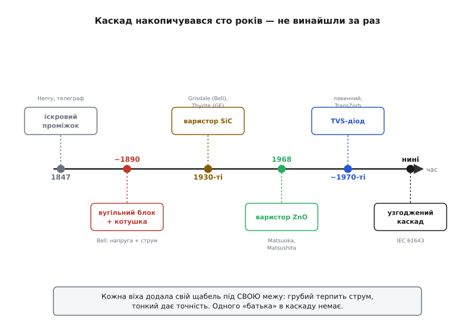

# 📜 Як захист від кидків став багатоступеневим

Каскад не винайшли. Його **набили гулями** — за сто з гаком років, у які кожне нове покоління інженерів ставило на лінію свій найкращий одинокий елемент, спокійно чекало на грозу, а тоді відкопувало на полі згорілі станції й дописувало до конструкції ще один щабель. Історія тут повчальна саме тим, що це **не** оповідь про геніальний винахід. Це оповідь про те, як фізична неможливість зробити один досконалий захисник поволі, наосліп, під тиском реальних збитків виштовхнула на світ багатоступеневу конструкцію — і в цієї конструкції немає одного «батька», бо кожен її щабель народжувався окремо, під свою власну межу.

Простежимо цей шлях від першого голого зазору в повітрі до сучасного узгодженого каскаду — і побачимо, що ту саму думку, з якої виростає вся тема, інженерія відкривала не раз, а щоразу заново, з кожним новим приладом.


*Сто років накопичення. Кожна віха додавала свій щабель під власну межу приладу; жоден крок не «закрив питання» сам, і жоден винахідник не зробив каскад цілком.*

## Голий зазор: телеграф і думка «дати розрядові інший шлях»

Усе почалося з телеграфу — першої в історії мережі довгих дротів, натягнутих між містами просто неба. Довгий дріт — це чудова антена для грози: близька блискавка наводить у ньому кидок на тисячі вольтів, і цей кидок біжить лінією просто в апаратну, спалюючи котушки приймачів і б'ючи операторів. Проблема постала рівно тоді, коли постала сама мережа, у 1840-х.

Перший розв'язок був геніально простий і містить у собі **все** майбутнє каскаду в зародку. Американський фізик **Джозеф Генрі** (Joseph Henry), той самий, чиїм ім'ям названо одиницю індуктивності, близько **1847 року** описав захист телеграфної лінії у вигляді простого **повітряного зазору** — щілини десь у пів дюйма між лінією та землею. Задум: нормальна телеграфна напруга щілину не перескочить, а грозовий кидок на тисячі вольтів — перескочить залюбки, спалахне іскрою й стече в землю, оминувши апарат. Це **усталений факт** (документований у ранніх працях і музейних зібраннях телеграфної доби); сама англійська назва пристрою — *arrester*, «затримувач», «зупинювач» — увійшла в ужиток тоді ж, а термін *lightning arrester* приписують **Александрові Джонсу** (Alexander Jones) близько **1852 року**, з першими патентами на поліпшені зазори до **1860-х**.

Придивіться, що тут уже є вся філософія теми. Захисник **нічого не затискає власним тілом** — він лише **дає кидкові кращий шлях повз те, що бережемо**. Це той самий принцип «кращого шляху», на якому стоїть і весь сучасний каскад. Іскровий проміжок телеграфу — прямий предок сьогоднішнього газорозрядника: [та сама навмисна щілина, що мовчить у нормі й закорочує лінію дугою вище порога](topic:electronics/gdt).

Але разом із розв'язком одразу народилася й **перша межа**, та сама, що потім гнатиме всю історію. Голий зазор рятував станцію, та рятував **грубо**: перш ніж пробитися, він пропускав уперед гострий пік у сотні вольтів, а сама іскра, спалахнувши, могла й не згаснути — «залипнути» дугою під робочою напругою лінії. Тому реальна інструкція тих років була не «поклався на зазор», а куди тверезіша: **у сильну грозу лінію взагалі рубали** — фізично вимикали станцію з дроту. Це вже перше визнання: **один елемент задачі не закриває**. Зазор бере кілоампери грози, але робить це надто грубо, щоб самому берегти чутливе. Через сто років ми скажемо те саме про газорозрядник — і саме тому поставимо за ним ще щаблі.

## Телефон і перший справжній поділ праці: напруга окремо, струм окремо

Телеграф передавав грубі імпульси, і йому грубого зазору майже вистачало. А от телефон приніс на ті самі стовпи щось значно тендітніше — **живу мову й чутливий мікрофон**, а разом із абонентським дротом завів кидок просто в житловий дім, до людини з трубкою біля вуха. Ставка різко зросла: тепер захист мусив не лише вберегти дороге залізо на станції, а й **не дати абонентові загинути**, розмовляючи під грозу, і не спалити дерев'яний будинок від струму, наведеного примітивною проводкою. Саме тут, наприкінці XIX століття, і стався **перший в історії свідомий поділ праці** між двома захисними елементами.

Телефонна компанія — передусім Bell System у США — поставила на вводі абонентської лінії не один захисник, а **два різні**, кожен під свою біду:

```
телефонний ввідний захисник (кінець XIX ст.):
  вугільний блок (carbon block)  — поперек лінії на землю
        іскровий проміжок між двома вугільними пластинами;
        закорочує КИДОК НАПРУГИ на землю
  теплова котушка (heat coil)    — у розрив лінії
        плавкий елемент, що замикає лінію на землю,
        коли крізь неї довго тече надлишковий СТРУМ
```

Вдумайтесь, наскільки це вже знайома картина. **Вугільний блок** — пара вугільних пластин із мікроскопічним зазором, той самий іскровий проміжок, лише мініатюрний — висів **поперек** лінії й гасив короткий стрибок напруги, закорочуючи його на землю. А **теплова котушка** стояла **в розрив** лінії й берегла від зовсім іншої біди — від **затяжного струму** (скажімо, коли на телефонний дріт десь падав силовий провід). Струм грів її резистивний елемент, той плавився й теж замикав лінію на землю, знімаючи напругу з абонента. Це **усталений факт**: класичний телефонний захисник Bell System (у пізнішій номенклатурі — протектори типу 100) саме так і будувався — вугільний блок плюс теплова котушка, аж до появи газових трубок.

І це вже — **каскад у зародку**, тільки поділений не «грубий → тонкий за напругою», а за самою **природою загрози**: один елемент проти стрибка напруги, інший проти затяжного струму. Ба більше: це рівно та розв'язка обов'язків, до якої в основній темі ми повертаємось під кінець, коли ставимо запобіжник у розрив поряд із затисками поперек. Телефонні інженери позаминулого століття намацали цю двоїстість руками, на живих збитках: **напругу й струм не вбереже один прилад**, бо це дві різні біди, і кожна вимагає свого тіла. Вугільний блок нічого не міг вдіяти проти повільного струму — він на нього просто не реагував; теплова котушка нічого не могла вдіяти проти наносекундного піку напруги — надто повільна. Довелося ставити обох.

Та й ця пара мала свою межу, і теж повчальну. Вугільний блок був **примхливий**: його пробивна напруга гуляла в широких межах, залежала від вологості й нальоту на пластинах, а сам він **зношувався** — вугілля потроху вигоряло, зазор «плив», і вчорашній надійний захист сьогодні пропускав кидок або, навпаки, підкорочував лінію шумом. Інженери вже тоді мріяли про щось стабільніше за дві вугільні пластинки — і ця мрія повела історію до наступного щабля.

> 🔧 **Навіщо це.** Ось де вперше в живій техніці проступила головна думка теми — і не в лабораторії, а на телефонному стовпі. Дві осі біди, напруга й струм, вимагають **двох різних тіл**: одне висить поперек і ловить стрибок напруги, друге стоїть у розрив і рве затяжний струм. Сьогодні ми пишемо це як правило монтажу — «запобіжник у розрив, затиски поперек», — але народилося воно з простого спостереження, що вугільний блок і теплова котушка **не заміняють одне одного**. Кожен глухий до чужої біди.

## Варистор: стабільна кераміка замість примхливого вугілля

Наступний щабель приніс не нову ідею захисту, а новий **матеріал** — такий, що затискав би напругу сам, тілом, без іскри та без вигоряння вугілля. Пошук стабільного «змінного опору», що різко падає вище порога, привів до класу приладів, які згодом назвуть **варисторами**. Сама назва — стягнення англійського *variable resistor*, «змінний опір»: опір, що залежить від прикладеної напруги.

Дорогу торували двома незалежними стежками, і обидві варто назвати чесно. Перший крок до нелінійного опору зробили **Ларс Ґрондаль** (Lars O. Grondahl) і **Пол Ґайґер** (Paul H. Geiger), описавши **1927 року** випрямляч на закисі міді (Cu₂O) — саме з цієї роботи виводять родовід варистора як приладу. Але захисником телефонних ліній став інший матеріал — **карбід кремнію** (SiC). У Bell Telephone Laboratories його опрацював **Роберт Ґрісдейл** (R. O. Grisdale) на початку **1930-х**, і — це прикметно для нашої теми — робив він це **прямо задля захисту телефонних ліній від блискавки**. Паралельно в General Electric на дослідженні **К. Б. Макекрона** (K. B. McEachron, публікація в Journal of the AIEE, **1930**) виріс промисловий матеріал під торговою назвою **«Thyrite»** — карбід-кремнієва кераміка для розрядників на силових лініях і для захисту телефонів. Це **усталені факти**, підтверджені кількома незалежними джерелами (зокрема оглядом історії варистора та фірмовими матеріалами).

Що дав варистор супроти вугільного блока? **Стабільність і плавність.** Замість двох вугільних пластинок із примхливою іскрою — тверде керамічне тіло, що затискає сплеск **власним об'ємом**, поглинаючи його енергію, і робить це передбачувано, не пливучи від вологи й не вигоряючи так швидко. [Керамічна таблетка, опір якої різко падає вище порога, — прямий нащадок цих SiC-варисторів 1930-х](topic:electronics/varistor); лише матеріал згодом зміниться.

Та зверніть увагу на найважливіше для сюжету теми: варистор **не витіснив** ані іскровий проміжок, ані плавкий елемент — він **став ще одним щаблем поряд із ними**. Карбід-кремнієвий розрядник затискав напругу м'якше й стабільніше за голу іскру, але грубого прямого удару грози на кілоампери одна керамічна таблетка не тримала — там і далі попереду мусив стояти витриваліший іскровий елемент. І струму, що тягнеться довго, варистор теж не рвав — це лишалося ділом плавкого. Кожен новий прилад не **заміняв** попередника, а **дописувався** до ланцюжка, беручи на себе рівно ту частку роботи, яку робив краще за всіх. Каскад ріс, а не перебудовувався.

## Кремній доводить затиск до досконалості: Зенер, лавина і TVS

Карбід-кремнієвий варистор затискав стабільно, та все ж **зависоко й грубувато** для нової епохи — епохи транзисторів, а потім і мікросхем, чиї входи гинуть уже від десятка зайвих вольтів. Потрібен був затискач **гострий, як бритва, і швидкий, як блискавка**: щоб доводив напругу до самих одиниць вольтів і встигав це зробити за наносекунди. Такий прилад дав кремнієвий **p-n-перехід у лавинному пробої**.

Теоретичний фундамент заклав американський фізик **Кларенс Зенер** (Clarence Zener), який **1934 року** першим описав механізм електричного пробою в діелектриках — ефект, згодом названий його ім'ям. Це **усталений факт**; варто лише розрізняти ідею й реалізацію. Сам Зенер **не робив** захисних діодів — він дав **теорію** пробою. Практичний прилад з'явився значно пізніше: близько **1950 року** у Bell Labs **Вільям Шоклі** (William Shockley) помітив передбачений ефект у кремнієвих діодах і назвав їх **діодами Зенера** на честь того, хто пробій передбачив. Тонкість, важлива для інженера: суто «зенерівський» пробій панує лише нижче ~5.5 В, а вище працює вже **лавинний** механізм — тож потужні захисні діоди, попри звичну назву, по суті **лавинні**. Ми вже спираємося на цю різницю, коли [добираємо стабілітрон під поріг обмеження](root:embedded/zener-schottky).

З цього кореня й виріс останній щабель каскаду — **TVS-діод** (*transient voltage suppressor*), лавинний перехід, навмисно згрублений і випробуваний під короткий потужний удар: велика площа переходу, щоб прийняти кіловати на мікросекунду, і те саме лавинне обмеження, що затискає напругу майже намертво за пікосекунди. [Найточніший і найшвидший затискач каскаду](topic:electronics/tvs-diode) — це просто силовий родич звичайного стабілітрона. Прилади ці розгорнулися у виробництво в **1970-х**; узвичаєне жаргонне слівце «транзорб» походить від торгової назви **TransZorb** — її ввела фірма General Semiconductor (нині у складі Vishay). Це **усталений факт** щодо походження назви; щодо точного «першого» року промислового TVS джерела обережні, бо межа між «лавинний діод узагалі» і «діод, спеціалізований під сплеск» розмита, а різні виробники йшли до нього паралельно — тому одного «винахідника TVS» історія теж не називає.

І знову — та сама пісня, що й на кожному попередньому щаблі. TVS **не скасував** ані варистор, ані іскровий проміжок. Він **не тримає** прямого удару грози: його малий гострий перехід спалить перший же серйозний струм. Він — **доводчик**, останній тонкий майстер, що бере вже ослаблений залишок і дотискає його до рівня, який стерпить чип. А щоб цей залишок був справді малим, попереду мусять стояти грубші й витриваліші щаблі — нащадки вугільного блока та SiC-варистора. Кремній дав каскадові його вершину, але **не** дав змоги обійтися одним елементом. Навпаки — саме поява надточного, але тендітного TVS остаточно закріпила потребу ставити перед ним когось витривалішого.

## Що змушувало ставити щаблі каскадом, а не один «найкращий»

Тепер, коли всі дійові особи на сцені, назвімо просто те, що століттями штовхало інженерів у той самий кут. Через усю історію червоною ниткою йде **одна й та сама фізична неможливість**: не буває тіла, водночас витривалого до великого струму **й** здатного на гострий точний затиск. Велике витривале тіло (іскра в газі, груба кераміка) неминуче грубе й повільне; мале точне тіло (кремнієвий перехід) неминуче кволе за енергією. Це не вада конкретного приладу, яку колись «допиляють», — це компроміс, вбудований у саму фізику, і кожне покоління впиралося в нього наново.

Тому щоразу, коли з'являвся новий, кращий за попередників елемент, він **не закривав задачу сам** — він лише додавав ще один рівень майстерності на своєму кінці шкали, лишаючи інші кінці попередникам:

```
хто                     що вміє найкраще            чого НЕ вміє сам
─────────────────────────────────────────────────────────────────────
іскровий проміжок/GDT   ковтати кілоампери грози    затиснути гостро й низько
варистор (SiC→ZnO)      стабільно поглинати         дійти до одиниць вольтів
                        сотні ампер                 та не старіти
TVS (лавинний діод)     затиснути до вольтів         пережити прямий удар
                        за пікосекунди              струму
плавкий / теплова       рвати затяжний струм        реагувати на швидкий
котушка                                             стрибок напруги
```

Гляньте на цю табличку — і побачите, чому «поставити один найкращий» ніколи не спрацьовувало. У кожного рядка є **порожня права колонка** — те, чого прилад не вміє. І закрити цю порожнечу можна лише сусідом, у якого ця саме клітинка — сильна. Іскровий проміжок дає струм, але не точність — по нього приходить варистор. Варистор дає стабільне поглинання, але не гострий затиск — по нього приходить TVS. А всі троє глухі до затяжного струму — тому поряд, у розрив, стоїть плавкий елемент. Кожен щабель латає діру попереднього. Витягніть один — і в захисті зяє саме та біда, від якої цей щабель беріг.

Останній штрих історії — коли цей століттями намацаний поділ нарешті **записали як інженерну норму**. У сучасних стандартах (сімейство **IEC 61643** для пристроїв захисту від перенапруги) каскад уже не самодіяльність монтажника, а формалізована система: грубий щабель на вводі, тонший нижче за течією, і — річ, яку в основній темі ми виводимо з арифметики «струм крізь опір дає напругу», — **обов'язкова відстань чи імпеданс між щаблями для їх узгодження**. Стандарт прямо вимагає **порядку десяти метрів кабелю** (або еквівалентного дроселя) між сусідніми ступенями, щоб грубий встиг перебрати удар, а не програв гонку швидшому й тендітнішому. Те, що телефонні інженери 1890-х робили чуттям, а їхні наступники — досвідом згорілих плат, урешті стало рядком у міжнародному стандарті. Це **усталений факт** (координація ступенів прописана в IEC 61643-12).

## Урок історії

Каскадний захист — рідкісно чесний приклад того, як **складність вузла народжується не з любові до складності, а з упирання у фізичну межу**. Ніхто не сідав проєктувати триступеневий каскад із чистого аркуша. Кожен щабель додали окремо, з відривом у десятиліття, під тиском конкретних збитків, і щоразу з тим самим гірким висновком: цей новий чудовий елемент теж не рятує сам. Іскровий проміжок телеграфу, вугільний блок і теплова котушка телефону, карбід-кремнієвий і цинк-оксидний варистори, лавинний TVS — це не конкуренти, з яких «переміг найкращий», а **співавтори однієї конструкції**, кожен зі своєю незамінною часткою.

І в цьому — головна причина, чому в каскаду **немає одного батька**. Його не «винайшли» в мить осяяння; його **виростили** сто років колективної впертості проти межі, якої не обійти. Хто зрозумів цю історію, той більше ніколи не спитає «а чому не поставити один найкращий елемент» — бо побачить за кожним щаблем сучасної плати тінь згорілої станції, що колись довела: одного не досить, і не буде досить ніколи.

**Дисципліна атрибуції.** Основні дійові особи цієї історії — американські дослідники та їхні установи: Joseph Henry (Смітсонівський інститут), Alexander Jones, Bell Telephone Laboratories (R. O. Grisdale), General Electric (K. B. McEachron), Clarence Zener і William Shockley (обидва — Bell Labs), General Semiconductor. Один важливий щабель — **не** американський: цинк-оксидний (ZnO) варистор, що витіснив карбід кремнію й став сьогоднішнім стандартом MOV, розробила команда **Мітіо Мацуоки** (Michio Matsuoka, яп. 松岡) у японській фірмі **Matsushita Electric** (нині Panasonic), яка **1968 року** вивела його на ринок під назвою ZNR. Це **усталений факт**, підтверджений і самою Panasonic, і незалежними оглядами; додам чесно, що Matsushita не стала монополізувати відкриття, а поділилася технологією з іншими виробниками, чим і рознесла ZnO-варистор світом. Винахід каскаду **колективний, поетапний і міжнародний**: американці дали іскровий проміжок, поділ «напруга/струм» і кремнієвий TVS; японці — сучасний матеріал варистора; міжнародна стандартизація (IEC) звела все в узгоджену систему. Жоден не «винайшов каскад один» — і саме це є найточнішим підсумком усієї теми.
