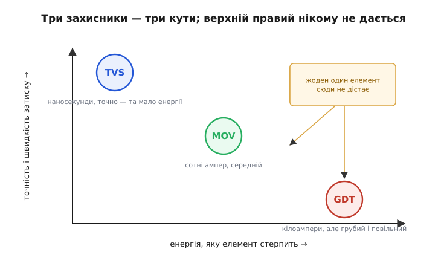
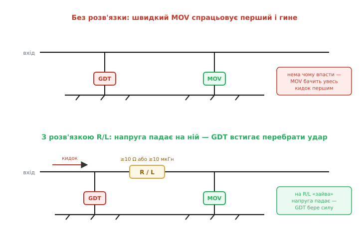
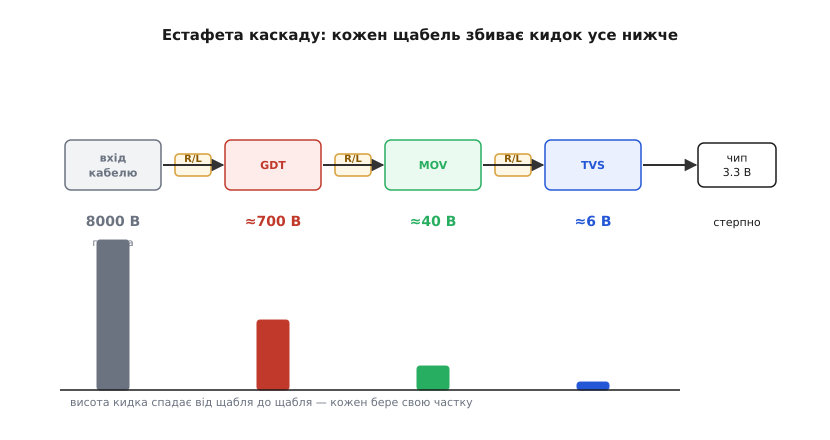
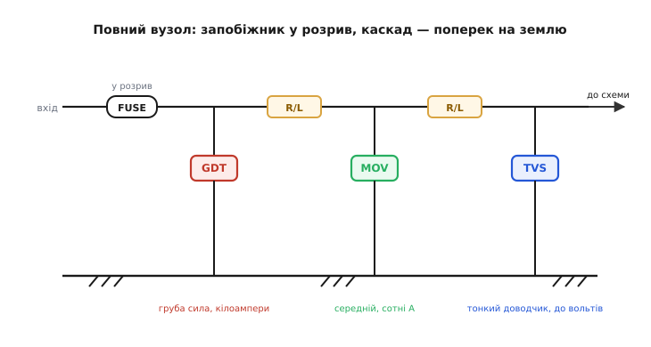

# Каскадний захист від перенапруги

<preknowlist>
- [Запобіжник](book:electronics/fuse-operation) — послідовний елемент, що згорає й розриває коло при затяжному надструмі; тут ми спираємося лише на цю базову роль.
</preknowlist>

Ми вже зібрали чималу шафку вартових. [Зенер обмежує напругу](root:embedded/zener-schottky), не пускаючи її вище безпечного рівня. [Гасний діод приборкує викид котушки, а обмежувальні діоди стережуть сигнальні входи](root:embedded/flyback-protection). А коли заходила мова про блискавку, ми вже бачили трьох важкоатлетів — газорозрядник, варистор і TVS — і навіть домовилися, що поодинці жоден із них задачі не закриває. Знаємо ми й простий запобіжник, що рве затяжний надструм. Тепер настав час зібрати це знання в один інженерний вузол і розібратися, **чому захист від серйозного кидка майже завжди багатоступеневий** і, найголовніше, що саме змушує ставити елементи саме каскадом, а не один «найкращий».

Тема ця — про пасивні компоненти в дії: ми не винаходитимемо нової фізики, а вчитимемося **компонувати** вже знайомі деталі так, щоб їхні слабкості взаємно прикривались. Це типова робота схемотехніка: окремий компонент простий, а от змусити кілька компонентів грати разом — мистецтво, де ціна помилки часто є згорілою платою.

### Чому одна деталь не рятує: дві осі, що тягнуть у різні боки

Почнімо з суті — з того, чому взагалі потрібен каскад. Будь-який кидок напруги, від [розряду статики з пальця](book:electronics/esd-damage) до наведення близької блискавки, має дві незалежні характеристики: **скільки він несе енергії** і **наскільки гостро й високо підскакує напруга**. І рятувати від нього треба теж за двома мірками — захисник мусить водночас **стерпіти струм удару, не згорівши** і **притиснути напругу досить низько й досить швидко**, щоб чутливий вхід уцілів.

Біда в тому, що ці дві вимоги в одному компоненті тягнуть конструкцію в **протилежні** боки. Щоб стерпіти великий струм, переходові чи тілу елемента потрібна велика площа й велика теплоємність — а велика площа означає велику ємність і повільнішу, «розмазанішу» реакцію. Щоб затиснути напругу гостро й точно, перехід має бути малим і швидким — а малий перехід згорить від першого ж серйозного струму. Велика енергоємність і гострий точний затиск — фізично несумісні в одному тілі.

Саме тому наші три важкоатлети розташувалися кожен у своєму кутку, і жоден не дістає до жаданого «багато енергії **і** точно»:


*Газорозрядник тримає кілоампери, але грубий і повільний. TVS затискає за наносекунди й точно — та великого струму не витримує. Варистор посередині. Кут «багато енергії й точний затиск» порожній: фізика не дає зробити такий один компонент, тому ролі доводиться поділити між кількома.*

Придивімося до кожного, бо саме їхні межі диктують усю конструкцію каскаду.

[**Газорозрядник** (GDT) — це навмисний зазор у колбі з газом, що мовчить у нормі й закорочує лінію на землю, коли напруга перескочить поріг пробою.](book:electronics/gdt) Він глитає **кілоампери** прямого чи близького грозового удару — дузі байдуже, скільки крізь неї струму. Але платить за це двома вадами: він **повільний** (вмикається за десятки-сотні наносекунд) і, спрацювавши, «провалює» лінію в дугу, пропустивши перед тим гострий пік у сотні вольтів. Для чутливого входу і цей пік, і затримка — смерть.

[**Варистор** (MOV) — керамічна таблетка, опір якої різко падає вище порога; вона затискає сплеск і поглинає його енергію тілом.](book:electronics/varistor) Він швидший за GDT і затискає напругу плавно (на десятках-сотнях вольтів замість провалу в дугу), тримає сотні ампер і чималу енергію. Та й він не ідеальний: затискає все ж зависоко для тонкої логіки, має помітну ємність і **старіє** — кожне спрацювання потроху руйнує кераміку.

[**TVS-діод** (супресор) — лавинний перехід, оптимізований під короткий потужний удар; він затискає напругу майже намертво за пікосекунди.](book:electronics/tvs-diode) Це найточніший і найшвидший затискач, що доводить напругу до рівня, який чип уже стерпить. Але його перехід малий: кіловати він приймає лише на коротку мить, а серйозний струм прямого удару спалить його першим.

> 🔧 **Навіщо це.** Розкласти ворога на дві осі — енергію й гостроту — це перший крок будь-якого захисного проєкту. Питання «чи витримає мій TVS грозу?» майже завжди має відповідь «ні, сам — ні»: він затисне ідеально, але згорить від струму. А питання «чи захистить мій GDT логіку на 3.3 В?» — теж «ні»: він стерпить струм, але пропустить на вхід сотні вольтів. Щойно бачиш, що один елемент мусив би бути водночас і витривалим, і точним, — знай, що тобі потрібен каскад.

### Поділ праці: грубий спереду, тонкий ззаду

Коли стало ясно, що героя не буде, розв'язок напрошується сам: **поставити елементи ланцюжком, від грубого до тонкого**. Першим на вході — найвитриваліший GDT: він приймає на себе основну лавину струму й грубо збиває кидок із кіловольтів до сотень вольтів. Від нього не вимагають точності, лише здатності пережити удар. Далі — варистор, що дотискає залишок до десятків вольтів. І останнім, упритул до чутливого входу, — швидкий TVS, що доводить напругу до одиниць вольтів, які чип витримає.

Це та сама стратегія «дати розрядові кращий шлях», яку ми вже розбирали для [захисту від блискавки](root:embedded/lightning-protection) — лише тепер ми дивимося на неї очима схемотехніка, що добирає конкретні компоненти й рахує, скільки лишиться чипові. Кожен щабель робить свою частку роботи: бере на себе стільки, скільки може, і передає далі вже менший, ослаблений кидок. Грубий бере силу, тонкий дає точність.

Логіка поділу глибша, ніж проста послідовність. Чому не можна просто поставити три однакові потужні елементи? Бо потужний елемент **зависоко затискає** — велика площа дає велику динамічну вольтову добавку під струмом. А три точні TVS поспіль? Бо перший же серйозний струм спалить усі три, перш ніж GDT-рівень захисту з'явиться. Тільки **різні** елементи на **різних** позиціях дають і витривалість, і точність: перший приймає енергію, останній дає чистоту затиску.

Але тут ховається пастка, через яку наївно складений каскад не лише не працює, а працює **гірше** за одинокий елемент. І щоб її обійти, потрібна непомітна, але вирішальна деталь.

### Серце каскаду: розв'язувальний імпеданс між щаблями

Уявімо, що ми поставили GDT і MOV поряд, обидва поперек лінії на землю, **без нічого між ними**. Прийшов кидок. Хто спрацює перший? Той, хто **швидший**, — а швидший тут варистор (наносекунди проти десятків-сотень наносекунд у GDT). Виходить халепа: тендітніший за енергією MOV кидається на удар першим і намагається з'їсти **весь** кидок сам, тоді як витривалий GDT ще навіть не встиг увімкнутись. MOV перевантажується енергією, на яку не розрахований, і гине — а GDT так і лишився глядачем.

Це не теоретична причепа, а головна причина, чому наївні каскади вигоряють. Найшвидший елемент завжди намагається взяти удар на себе, а найшвидший — зазвичай найкволіший за енергією. Якщо їх просто поставити поряд, грубий витривалий щабель не встигає до гри.

Розв'язок елегантний і випливає прямо зі знайомої арифметики «струм крізь опір дає напругу». Між щаблями ставлять невеликий **послідовний імпеданс** — резистор або дросель:


*Угорі: GDT і MOV поряд без розв'язки — швидкому MOV «нема чому впасти», він бачить увесь кидок першим і перевантажується. Унизу: послідовний R/L між щаблями змушує «зайву» напругу впасти на собі, тож поки MOV затиснув свою малу частку, напруга перед GDT встигає піднятися до його порога — і грубий елемент перебирає основний струм на себе.*

Як саме це рятує? Простежмо ланцюжок. Кидок приходить на вхід, де стоїть GDT, і одразу за ним — розв'язувальний імпеданс, а далі MOV. Швидкий MOV відмикається першим і починає тягти струм. Але цей струм тече **крізь розв'язувальний імпеданс**, і на ньому за законом Ома (а для дроселя — за V = L·di/dt) виникає **спад напруги**. Цей спад додається до напруги на MOV, тож **перед** розв'язкою, на вузлі GDT, напруга виходить помітно вищою — і вона встигає дорости до порога спрацювання GDT. GDT пробивається й перебирає основну лавину струму на себе, розвантажуючи MOV. Розв'язка ніби каже швидкому елементові: «не поспішай усе хапати — почекай, поки прокинеться сильніший».

Є й другий бік тієї самої медалі — **розв'язка в часі**. Поки повільний GDT тільки-но вмикається (його десятки наносекунд затримки), швидкий TVS чи MOV уже затиснув гострий передній фронт кидка, не пустивши його далі. Тобто послідовний імпеданс не просто перерозподіляє струм — він **розводить щаблі в часі**: тонкий швидкий встигає на гострий фронт, грубий повільний підхоплює основну енергію. Без розв'язки цього танцю немає — є лише штовханина, у якій кволий гине першим.

Скільки саме потрібно цього імпедансу? Тут інженерія дає на диво конкретну відповідь, закріплену в стандартах. Між сусідніми ступенями потрібен або шматок кабелю довжиною **порядку десяти метрів** (його власна індуктивність ≈ 10 мкГн якраз і служить розв'язкою), або, якщо місця нема, **спеціальний дросель на 10–20 мкГн** чи резистор **понад 10 Ом** замість нього:

```
розв'язка між щаблями каскаду:
  кабель ≥ ~10 м           → власна індуктивність ≈ 10 мкГн
  АБО дросель              ≈ 10…20 мкГн
  АБО резистор            > 10 Ом   (на сигнальних лініях, де струм малий)
```

На потужних мережевих лініях беруть саме **дросель** — він майже не гріється й не просідає напругу в нормі (індуктивність «непомітна» для повільного робочого струму 50 Гц, але «висока» для блискавичного фронту кидка). На сигнальних лініях, де робочий струм малий, частіше ставлять простий **резистор** на десятки-сотні ом: він заодно обмежує піковий струм крізь тонкий TVS і дешевший за дросель.

> 🔧 **Навіщо це.** Це найчастіша помилка початківця в захисті: поставити поряд GDT і TVS «для надійності» — і отримати каскад, що вигорає швидше за одинокий TVS, бо TVS бере на себе все, а GDT спить. Запам'ятай тверде правило: **між будь-якими двома ступенями захисту мусить бути послідовний імпеданс** (дросель на силовій лінії, резистор на сигнальній). Без нього це не каскад, а двоє елементів, що заважають одне одному. Розв'язка — не «додаткова обережність», а несуча конструкція всього вузла.

### Естафета: що лишається чипові

Тепер, коли розв'язка на місці, каскад працює як добре злагоджена естафета. Подивімося на нього в цілому, простеживши, як гасне кидок від щабля до щабля:


*Естафета каскаду на прикладі наведеної грозою напруги ≈8 кВ. GDT збиває головну лавину до сотень вольтів, MOV дотискає до десятків, TVS доводить до одиниць — рівня, який вхід на 3.3 В уже стерпить. Між щаблями — розв'язка R/L, на якій падає «зайва» напруга. Жоден щабель не робить усієї роботи: кожен бере свою частку.*

**Приклад. Що бачить вхід після триступеневого каскаду.** Хай у довгому кабелі давача наведено кидок ≈8 кВ — типова близька гроза.

```
вхід кабелю:                 8000 В
після GDT (груба сила, ~кА):  ≈ 700 В   ← збив головну лавину; для чипа ще смерть
після MOV (середній):         ≈  40 В   ← дотиснув залишок; ще трохи забагато
після TVS (тонкий, ~нс):      ≈   6 В   ← рівень, який вхід на 3.3…5 В уже стерпить
```

Вісім тисяч вольтів на вході — шість вольтів на чипі. І жоден герой тут не зробив усього: GDT збив тисячі вольтів, але лишив сотні; MOV дотиснув до десятків; і лише TVS довів до одиниць. Це і є поділ праці в дії — три скромні деталі разом долають те, чого жодна поодинці не подужала б.

Зверніть увагу на ще одну тонкість естафети: кожен наступний щабель працює зі **щораз меншим** струмом. Основну лавину забрав GDT, тож до MOV дійшла лише її частина, а до TVS — і поготів краплина. Саме тому останній, найкволіший за енергією TVS і виживає: він затискає вже ослаблений залишок, а не повний удар. Розв'язувальний імпеданс перед ним додатково обмежує цей залишковий струм. Уся конструкція влаштована так, щоб **тендітний працював у легких умовах**, а важку роботу робив витривалий.

### Чого каскад не вміє сам: повернення до запобіжника

Каскад затисків розв'язує задачу **напруги** — він не пускає кидок підскочити вище безпечного. Але є друга, незалежна біда, яку жоден затиск не закриває: **струм у часі**. Якщо джерело здатне тиснути перенапругу не мікросекунди, а довго — скажімо, у сигнальну лінію помилково потрапив силовий дріт, або GDT після спрацювання «залип» у дузі під робочою напругою, — то затиски почнуть пропускати крізь себе тривалий струм і **згорять від перегріву**. Адже ту саму кіловатну потужність, яку TVS спокійно приймає на мікросекунду, на мілісекундах уже нема куди подіти: тепло не встигає піти з кристала.

Ось чому каскад затисків ніколи не ставлять без послідовного **[запобіжника](root:embedded/fuses-ptc)** на вході. Поділ обов'язків чіткий: затиски (GDT, MOV, TVS) висять **поперек** лінії й гасять короткий потужний сплеск напруги; запобіжник стоїть **у розрив** лінії й рве затяжний надструм, від якого затиски б згоріли. Удвох вони накривають обидві осі біди — і миттєвий стрибок напруги, і тривалий струм.

Тут у гру входить [часострумова характеристика запобіжника та енергія let-through](root:embedded/fuses-ptc). Між запобіжником і затиском є тонке узгодження за часом. Затиск мусить **витримати** ту енергію, що проскочить, поки запобіжник перегоряє, — а скільки саме проскочить, описує число **I²t** (let-through, енергія до перегоряння). Якщо запобіжник «повільний», крізь нього встигне пройти багато енергії, і затиск за ним має бути відповідно витривалим. Тому в захисному вузлі ці двоє підбирають **разом**: запобіжник — щоб устиг обірвати затяжний струм раніше, ніж затиск перегріється; затиск — щоб пережив ту порцію енергії, яку запобіжник пропустить до свого перегоряння.

> 🔧 **Навіщо це.** Затиск без послідовного запобіжника — це закладена аварія. Класична картина: варистор постарів, почав підтікати, нагрівся й замкнувся накоротко — і якби перед ним не стояв запобіжник, цей пробитий диск опинився б прямим коротким на джерелі й загорівся. Запобіжник рятує: він рве цей струм. Тому золоте правило монтажу будь-якого захисного вузла — **запобіжник перший за течією струму, затиски за ним**. Поміняєш місцями — згорілий затиск лишиться під напругою без жодного захисту.

### Повна карта вузла: як це збирають на платі

Зведімо все докупи в один практичний вузол захисту входу — такий, який ви побачите на платі будь-якого пристрою, що живиться ззовні або має довгі кабелі:


*Повний вузол захисту входу. Запобіжник стоїть у розрив на самому початку. Далі поперек лінії на землю — три щаблі затисків від грубого до тонкого: GDT (груба сила, кілоампери), MOV (середній, сотні ампер), TVS (тонкий доводчик, до вольтів). Між щаблями в лінії — розв'язувальний імпеданс R/L. Праворуч уже захищена схема.*

Порядок елементів **у розрив**: спершу запобіжник (першим зустрічає струм), за ним послідовно тягнеться лінія крізь розв'язувальні імпеданси. Порядок щаблів **поперек**: GDT найближче до входу (приймає головний удар), MOV у середині, TVS останнім — упритул до того, що бережемо. Кожен наступний затиск точніший і кволіший за попередній, і кожен працює зі щораз меншим залишком кидка.

Не кожен реальний вузол має всі три щаблі. Це питання масштабу загрози, і добирають його тверезо, за тим, **звідки і який кидок прилетить**:

```
що захищаємо                          типовий каскад
─────────────────────────────────────────────────────────
короткий внутрішній сигнал, ESD       лише TVS (або вбудовані діоди чипа)
вхід живлення дрібного приладу        запобіжник + MOV + TVS
мережа 230 В, побутовий фільтр        запобіжник + MOV (часто з термозахистом)
довгий кабель назовні, гроза          запобіжник + GDT + R/L + MOV + R/L + TVS
антена, Ethernet між будівлями        GDT (грубий) + R/L + низькоємнісний TVS
```

Логіка проста: що жорсткіший і енергійніший очікуваний удар, то більше щаблів і то грубіший перший із них. Для [розряду статики](book:electronics/esd-damage) на короткому внутрішньому сигналі досить одного TVS — а часто й [вбудованих у чип захисних діодів](root:embedded/flyback-protection), бо енергія ESD мала. Для прямого чи близького грозового удару в зовнішній кабель потрібен повний каскад із грубим GDT спереду. Між цими крайнощами — усі проміжні варіанти.

> 🔧 **Навіщо це.** Не накручуй зайвих щаблів там, де загроза дрібна, — це марні гроші, місце й ємність на лінії. І не економ на щаблях там, де кабель тягнеться надвір, — там одинокий TVS згорить від першої ж серйозної грози. Правило добору: оціни **найгірший реальний кидок** (звідки лінія, чи назовні, чи близько гроза), постав грубий перший щабель під його **струм** і тонкий останній щабель під **напругу, яку витримує вхід**, а між ними — розв'язку. Решта — варіації цього кістяка.

### Земля під каскадом: куди стікає те, що відвели

Лишилася одна річ, без якої весь каскад можна викинути, — **земля**, у яку затиски зливають кидок. Ми вже бачили цю пастку, коли говорили про [захист входу від блискавки](root:embedded/lightning-protection): кидок — це струм у десятки ампер, що наростає за наносекунди, і коли він біжить **довгою тонкою доріжкою** від затиску до землі, на індуктивності цієї доріжки встигає набратися велика напруга. У підсумку вхід бачить не «затиснуті TVS-ом 6 вольтів», а ці 6 вольтів **плюс** кидок, що наскочив на індуктивності петлі землі, — десятки чи сотні зайвих вольтів. Затиск спрацював бездоганно, а довгий шлях у землю все звів нанівець.

Для каскаду це особливо болюче, бо тут струми найбільші — повз GDT тече вся лавина в кілоампери. Тому правило тверде: **кожен затиск з'єднують із землею щонайкоротшим товстим шляхом**, із мінімальною петлею, а самі затиски ставлять **щонайближче до точки входу** — щоб кидок не встиг пройти платою повз чутливі вузли, перш ніж його перехоплять. Кінчик-затиск — деталь; короткий шлях у землю — суть.

І остання знайома ідея — **єдина опорна земля**. Якщо «земля» каскаду сполучена із «землею» решти схеми довгим звивистим шляхом, то під час кидка ці дві землі на мить опиняться під різною напругою, і чутливий вузол дістане цю різницю просто в себе. Ліки ті самі, що й у великому масштабі: звести всі землі **в одну точку**, щоб під кидком уся плата піднімалась у потенціалі разом, лишаючись усередині себе на нулі. Підіймається все гуртом — стрибати напрузі нема між чим.

### Одна думка, з якої виростає весь вузол

Якщо охопити все разом, каскадний захист тримається на одній простій, але глибокій думці: **компроміс між енергією та точністю непереборний в одному компоненті, тож його обходять поділом праці в часі й просторі**. Грубий витривалий елемент спереду приймає силу; тонкий точний ззаду дає чистоту затиску; послідовний імпеданс між ними їх мирить, розводячи в часі; запобіжник у розрив страхує від затяжного струму; а коротка спільна земля випускає відведене, не давши йому стрибнути назад на вхід. Жодна з цих п'яти частин не зайва, і жодна не працює без решти.

Як інженерія дійшла до цієї багатоступеневості — не блискучим винаходом, а довгим упиранням у межі кожного приладу — варто прочитати окремо: це повчальний приклад того, що складність вузла народжується з фізичної неможливості зробити простіше.

> 📜 **Історія до теми:** [Як захист від кидків став багатоступеневим](root:embedded/surge-protection-cascade/hist-cascade.md) — від іскрового проміжку на телеграфних лініях через варистор і TVS до стандартизованого каскаду, і чому в нього немає одного «батька».

І найпрактичніша порада наостанок. Побачивши на чужій платі поряд із роз'ємом запобіжник, дросель чи резистор і кілька різних деталей поперек лінії на землю — не дивуйся «навіщо стільки». Це не перестраховка, а точно відміряний поділ праці: хтось рахував найгірший кидок і розклав його на щаблі так, щоб тендітне працювало в легких умовах, а важке брав на себе витривалий. Хто навчився бачити за купкою захисних деталей цей поділ за енергією та точністю — той проєктує надійні входи спокійно, без зайвих деталей і без фатальних дір.
