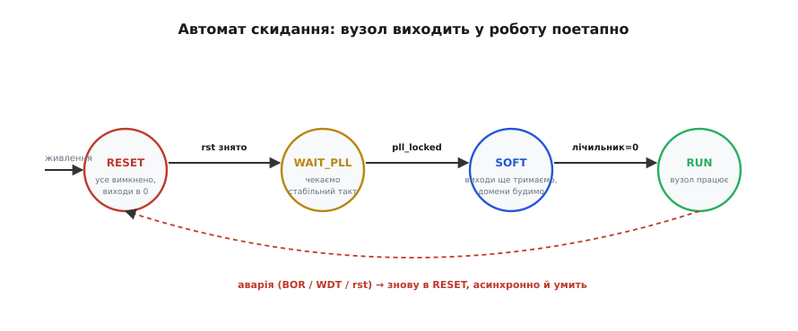
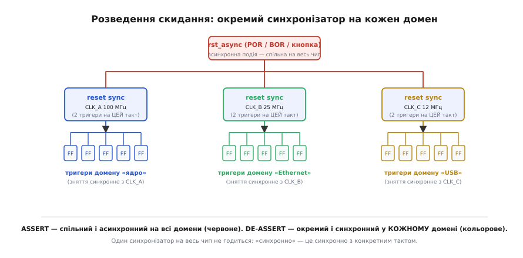

# ⚙️ Робочий вузол скидання: синхронізатор, автомат і розведення по платі

> У самій темі ми дійшли до закону «вмикай асинхронно, відпускай синхронно» й побачили синхронізатор скидання на двох тригерах. Тепер перетворімо цей закон на **код, який синтезується й працює** — спершу сам синхронізатор рядок у рядок, тоді **автомат скидання**, що тримає вузол у безпеці, доки система готується, і насамкінець найболючіше: як це скидання **розвести по реальній платі** з кількома тактовими доменами, не наступивши на три класичні граблі. Жодного псевдокоду — лише те, що ти справді впишеш у проєкт.

## Задача

Маємо цифровий вузол — нехай це FPGA з ядром, що мусить стартувати **передбачувано**. Зовнішнє скидання `rst_n` приходить асинхронно (кнопка, наглядач живлення, лінія від сусіднього чипа). Усередині вже не один такт, а **три** незалежні домени: ядро на 100 МГц, Ethernet-блок на 25 МГц, USB-блок на 12 МГц. І ще є PLL (англ. *phase-locked loop* — петля фазового автопідстроювання, що множить вхідну частоту), який після ввімкнення розгойдується не миттєво.

Треба збудувати вузол скидання, що виконує чотири умови водночас:

- **спрацьовує вмить** на будь-яку аварію, навіть коли такт ще мертвий (асинхронне вмикання);
- **знімається чисто й одночасно** в межах кожного домену, без метастабільності на фронті (синхронне зняття);
- **не випускає логіку в роботу, доки система не готова** — доки PLL не зловив частоту, доки не минув обов'язковий час на стабілізацію;
- **коректно розводиться** на тисячі тригерів по трьох доменах, не «розповзаючись» у часі.

Перші дві умови — це рівно той синхронізатор, до якого ми вже дійшли. Третя умова — нова: вона додає **послідовність станів**, тобто автомат. Четверта — суто інженерна, і саме на ній валиться найбільше проєктів. Розберімо все по порядку: задача ясна, переходимо до ідеї.

## Ідея

Розкладімо вузол на три шари, кожен робить рівно одне.

**Перший шар — синхронізатор** перетворює брудний асинхронний `rst_n` на чисте скидання, що вмикається асинхронно й знімається синхронно з тактом. Це низ, фундамент; усе інше спирається на нього.

**Другий шар — автомат скидання** (англ. *reset FSM*, finite-state machine). Він не випускає вузол у роботу одним стрибком. Натомість веде його **сходинками**: спочатку все тримається в скиданні; тоді чекаємо, поки PLL зловить частоту; тоді відлічуємо кілька чистих тактів; і лише тоді відпускаємо логіку. Якщо на будь-якій сходинці стається аварія — автомат **умить** падає назад на самий низ. Це і є «безпечний стан, доки готується система».

**Третій шар — розведення.** Вихід вузла скидання — це не один дріт «у все підряд». На **кожен тактовий домен** ставимо **свій** синхронізатор (бо «синхронно зняти» можна лише відносно конкретного такту), а його вихід ведемо **деревом** до всіх тригерів домену, стежачи, щоб скидання дійшло всюди майже водночас.

Ключова думка, на якій усе тримається: **вмикання й зняття скидання — це дві різні речі, і поводитися з ними треба по-різному**. Вмикання спільне, асинхронне, негайне на весь чип. Зняття — окреме в кожному домені, синхронне, з контрольованим таймінгом. Сплутати ці дві ролі — корінь майже всіх бід зі скиданням. Тримаючи це в голові, напишімо перший шар.

## Шар 1: синхронізатор скидання, що синтезується

У самій темі ми бачили, чому потрібні саме два тригери й чому вхід `D` першого прив'язаний до «1». Тут — як це виглядає мовою опису заліза, готове до синтезу. Спершу класичний варіант на **активно-низькому** асинхронному скиданні (саме так його дає більшість мікросхем — лінія `rst_n`, активна нулем):

```verilog
// Синхронізатор скидання: async assert, sync de-assert.
// rst_n активний НИЗЬКИМ (0 = «скидати»). Вихід rst_sync_n — теж активно-низький.
module reset_sync (
    input  wire clk,          // такт ЦЬОГО домену
    input  wire rst_n,        // асинхронне зовнішнє скидання (0 = скидати)
    output wire rst_sync_n    // у логіку домену: 0 = скидати, чисте зняття
);
    reg ff1, ff2;

    // АСИНХРОННА гілка в списку чутливості: posedge clk АБО negedge rst_n.
    // Саме negedge rst_n робить вмикання миттєвим, без чекання фронту такту.
    always @(posedge clk or negedge rst_n) begin
        if (!rst_n) begin
            ff1 <= 1'b0;      // assert: обидва тригери в 0 ВМИТЬ
            ff2 <= 1'b0;
        end else begin
            ff1 <= 1'b1;      // після зняття rst_n «1» вповзає за такт
            ff2 <= ff1;       // ...і ще за такт доходить виходу
        end
    end

    assign rst_sync_n = ff2;  // у логіку віддаємо ТІЛЬКИ другий тригер
endmodule
```

Прочитаймо найважливіший рядок — список чутливості `posedge clk or negedge rst_n`. Він каже синтезатору буквально таке: «онови ці тригери або на фронті такту, або **тієї ж миті**, коли `rst_n` упав у 0». Друге — це і є асинхронне вмикання: тригери дивляться на `rst_n` повз такт, тож гаснуть умить, навіть якщо `clk` стоїть. А коли `rst_n` повертається в 1, асинхронної гілки більше нема, працює лише `posedge clk` — і прив'язана до `D` логічна «1» проходить ланцюжком **за два фронти**. Зняття вийшло синхронним. Те, що ми малювали стрілками в темі, синтезатор дослівно покладе в кремній саме з цих рядків.

> 🔧 **Навіщо це.** Це не «один зі стилів», а **канонічний шаблон**, який розпізнають усі серйозні синтезатори й який радять виробники FPGA. Напишеш так — інструмент сам поставить два тригери поряд, накладе правильні перевірки таймінгу на зняття й не спробує «оптимізувати» ланцюжок. Напишеш скидання абияк — і отримаєш або зайву логіку, або непомічену метастабільність, що раз на тиждень валить плату незрозуміло чому.

Якщо проєкт працює з **активно-високим** скиданням (англ. *active-high reset* — `rst`, де 1 означає «скидати»; так заведено, наприклад, у світі ARM і в багатьох ASIC), той самий вузол лише дзеркальний:

```verilog
// Те саме, але rst активний ВИСОКИМ (1 = скидати). Гілка — posedge rst.
module reset_sync_ah (
    input  wire clk,
    input  wire rst,             // 1 = скидати, асинхронно
    output reg  rst_sync         // 1 = скидати, чисте зняття
);
    reg ff1;
    always @(posedge clk or posedge rst) begin
        if (rst) begin
            ff1      <= 1'b1;    // assert умить
            rst_sync <= 1'b1;
        end else begin
            ff1      <= 1'b0;    // зняття вповзає за два такти
            rst_sync <= ff1;
        end
    end
endmodule
```

Логіка та сама, перевертається лише полярність: тепер «скидати» — це 1, тож асинхронна гілка ловить `posedge rst`, а вповзає вже 0. Вибір полярності диктує плата (що дають мікросхеми навколо), а не смак; усередині ж вузол однаковий. Маючи чистий синхронізатор, надбудуймо над ним розум — автомат.

## Шар 2: автомат скидання, що тримає вузол у безпеці

Синхронізатор робить зняття чистим, але він **дурний**: щойно зовнішнє `rst_n` зникло, він за два такти відпускає логіку — байдуже, чи готова система. А вона часто не готова: PLL ще ловить частоту, конфігурація ще довантажується, зовнішня пам'ять ще прокидається. Випустити вузол у роботу на цьому етапі — отримати непередбачувану поведінку на «брудних» тактах. Потрібен хтось, хто **тримає скидання активним довше, ніж просить зовнішня лінія**, доки не виконано всі умови готовності. Цей хтось — невеликий автомат.

Чотири стани вистачає, щоб покрити типовий старт:


*Вузол не стрибає в роботу одним кроком, а проходить сходинки: RESET (усе вимкнено, виходи в 0) → WAIT_PLL (чекаємо стабільний такт) → SOFT (виходи ще тримаємо, будимо домени) → RUN (працює). Будь-яка аварія — просідання живлення, спрацювання наглядача, нове зовнішнє скидання — асинхронно й умить кидає автомат назад у RESET, звідки старт починається наново.*

- **RESET** — корінь. Усі скидання активні, всі виходи в безпечному стані (силові ключі вимкнені, шини в спокої). Сюди потрапляємо при ввімкненні живлення й сюди ж **умить** падаємо з будь-якого стану на аварію.
- **WAIT_PLL** — зовнішнє скидання зняте, але такт ще не годиться. Чекаємо сигналу `pll_locked`, що PLL зловив частоту. Тут скидання все ще тримається.
- **SOFT** — такт уже чистий, та ми не випускаємо все відразу. Відлічуємо лічильником кілька тактів (даємо пам'яті/периферії прокинутися) і поступово знімаємо скидання з підсистем. Виходи у зовнішній світ ще притримані.
- **RUN** — вузол повноцінно працює. Лишаємося тут, доки не прийде аварія.

Ось цей автомат на синтезованому Verilog. Зверни увагу: він **сам** живиться від уже синхронізованого скидання (`rst_sync_n` із шару 1) — автомат скидання теж тригери, і його теж треба коректно скидати:

```verilog
module reset_fsm #(
    parameter SOFT_CYCLES = 16           // скільки тактів тримати в SOFT
) (
    input  wire clk,
    input  wire rst_sync_n,              // ВЖЕ синхронізоване зовнішнє скидання
    input  wire pll_locked,              // 1 = PLL зловив частоту
    output reg  core_rst_n,              // скидання ядра (1 = працювати)
    output reg  out_enable               // дозвіл на виходи в зовнішній світ
);
    localparam RESET    = 2'd0,
               WAIT_PLL = 2'd1,
               SOFT     = 2'd2,
               RUN      = 2'd3;

    reg [1:0] state;
    reg [4:0] cnt;                       // лічильник тактів для стану SOFT

    always @(posedge clk or negedge rst_sync_n) begin
        if (!rst_sync_n) begin
            // АСИНХРОННЕ падіння в корінь: будь-яка аварія — миттєво сюди
            state      <= RESET;
            cnt        <= 5'd0;
            core_rst_n <= 1'b0;          // ядро скинуте
            out_enable <= 1'b0;          // виходи перекриті — це найважливіше
        end else begin
            case (state)
                RESET: begin
                    core_rst_n <= 1'b0;
                    out_enable <= 1'b0;
                    state      <= WAIT_PLL;   // skидання знято — рушаємо чекати такт
                end
                WAIT_PLL: begin
                    if (pll_locked) begin
                        cnt   <= SOFT_CYCLES[4:0];
                        state <= SOFT;
                    end
                    // інакше лишаємося тут і тримаємо все скинутим
                end
                SOFT: begin
                    core_rst_n <= 1'b1;       // ядро вже можна будити...
                    if (cnt == 5'd0)
                        state <= RUN;
                    else
                        cnt <= cnt - 5'd1;     // ...але виходи ще тримаємо
                end
                RUN: begin
                    core_rst_n <= 1'b1;
                    out_enable <= 1'b1;        // аж ТЕПЕР пускаємо у світ
                end
                default: state <= RESET;       // ловець «неможливих» станів
            endcase
        end
    end
endmodule
```

Простежмо, чому це **безпечно**. На ввімкненні живлення `rst_sync_n` низький, автомат сидить у RESET, `out_enable = 0` — жоден вихід не клацне зовнішнє реле чи силовий ключ. Зняли зовнішнє скидання — переходимо у WAIT_PLL і **застрягаємо** там, доки `pll_locked` не стане 1; весь цей час виходи перекриті. PLL зловив частоту — заходимо в SOFT, відлічуємо `SOFT_CYCLES` чистих тактів (ядро вже будимо, але світ ще не чіпаємо) і лише по нулю лічильника переходимо в RUN, де нарешті `out_enable = 1`. А тепер головне: гілка `if (!rst_sync_n)` стоїть **у списку чутливості асинхронно**, тож аварія в будь-якому стані — навіть у RUN — миттєво кидає автомат назад у RESET із перекритими виходами. Вузол фізично не може застрягти в роботі, коли живлення просіло.

> 🔧 **Навіщо це.** Стан SOFT — це не перестраховка, а пряма відповідь на реальну біду: якщо випустити виходи **до** того, як уся система прокинулася, перший же такт може кинути у світ хибний рівень — і силовий ключ відкриється в коротке, реле клацне даремно, шина побачить сміття. Окреме `out_enable`, що піднімається **останнім**, гарантує: назовні щось іде лише тоді, коли все всередині вже в порядку. Цей самий рецепт — «спочатку оживи нутрощі, виходи відпусти наостанок» — ти впізнаєш у послідовності ввімкнення будь-якого силового драйвера чи моста.

Зверни увагу на гілку `default: state <= RESET`. Двох бітів стану вистачає на чотири значення, і всі чотири задіяні, тож, здавалося б, `default` недосяжний. Але саме в цьому сенс: якщо тригери стану через збій (та сама метастабільність, космічна частинка, просадка живлення) опиняться в неможливій комбінації, `default` поверне автомат у безпечний корінь, а не лишить блукати. Це дешева страховка — один рядок, — а рятує від «завис незрозуміло як». Автомат готовий; лишається найважче — провести його сигнал по реальній платі.

## Шар 3: розведення скидання по платі й доменах

Тут ховається біда, якої не видно в симуляції й видно лише на столі. Сам синхронізатор бездоганний, автомат бездоганний, а плата стартує то так, то сяк. Причина майже завжди одна з трьох; розберімо всі.

### Граблі 1: скидання як дерево, а не як «довгий дріт у все»

Вихід вузла скидання треба підвести до **тисяч** тригерів. Спокуса — провести один товстий дріт, що по черзі заходить у кожен тригер. Але згадаймо, чому в темі ми так наполягали на синхронному знятті: усі тригери мусять вийти зі скидання **на одному фронті такту**. Якщо скидання повзе одним довгим ланцюгом, то на ближній тригер «відпустив» дійде, скажімо, за 0.3 нс, а на дальній — за 3 нс. За частоти 100 МГц період такту — 10 нс, і ця різниця вже зжирає третину запасу; підвищиш частоту — і різні тригери почнуть виходити зі скидання на **різних** фронтах. Це рівно та біда «половина бітів стану прокинулася на такт раніше», про яку ми говорили в темі.

Тому скидання розводять **деревом** (англ. *reset tree* — як і тактовий сигнал, англ. *clock tree*): сигнал гілкується, на кожному рівні стоять буфери, що підсилюють і вирівнюють, аби до **всіх** листків-тригерів фронт «відпустив» дійшов майже водночас. Розкид часу приходу зветься **перекосом** (англ. *skew*), і завдання дерева — тримати його малим. У FPGA це здебільшого роблять **глобальні лінії скидання** — спеціальні низькоперекосні мережі, ті самі, що розносять такт; інструмент кладе скидання в них автоматично, якщо ти не заважаєш.

> 🔧 **Навіщо це.** Звідси випливає дуже практична порада, що суперечить інтуїції: **не скидай у FPGA те, що скидати не конче треба**. Кожен тригер, якому ти дав скидання, доводиться під'єднати до дерева скидання — а це жере маршрутизацію й тисне на ту саму низькоперекосну мережу. Конвеєрний регістр у тракті даних, що за кілька тактів і так заповниться правильними числами, часто **не потребує** скидання взагалі: ввімкнувся в сміття — за три такти промився. Класична біла книга Xilinx так і зветься — «Get Smart About Reset: Think Local, Not Global» (Ken Chapman, Xilinx WP272, 7 березня 2008): глобальне скидання «у все підряд» не пришвидшує старт, а лише забиває маршрутизацію й опускає робочу частоту. *(Статус: усталена інженерна практика, підтверджена документом виробника.)* Скидай те, що мусить стартувати з відомого стану (автомати, керівні регістри, лічильники), і лишай у спокої те, що промиється само.

### Граблі 2: на кожен тактовий домен — свій синхронізатор

Це найчастіша й найпідступніша помилка. Інженер будує один прекрасний синхронізатор скидання й розводить його вихід на **весь** чип — і на ядро 100 МГц, і на Ethernet 25 МГц, і на USB 12 МГц. Логіка ніби струнка: скидання ж одне. Але згадаймо, що означає «синхронне зняття»: воно синхронне **відносно конкретного такту**. Синхронізатор, побудований на `CLK_A` (100 МГц), знімає скидання чисто **для домену A** — і тільки. Для домену B той самий вихід — це знову **асинхронний** сигнал, бо його фронт не має жодного стосунку до `CLK_B`. Він прийде в домен B будь-коли, зокрема на фронт `CLK_B`, — і тригери домену B знову ризикують метастабільністю на знятті. Ми старанно полагодили одну межу й відкрили її в усіх інших.

Правильно — поставити **окремий синхронізатор у кожному домені**, кожен на **своєму** такті:


*Асинхронне вмикання (червоне) — спільне на весь чип: одна подія rst_async гасить усі домени вмить. А зняття — окреме в кожному домені: на CLK_A, CLK_B і CLK_C стоять свої синхронізатори, кожен знімає скидання синхронно зі СВОЇМ тактом і веде власне дерево до тригерів свого домену. Один синхронізатор на весь чип не годиться: «синхронно» означає «синхронно з конкретним тактом».*

Зверни увагу на асиметрію картинки — у ній уся суть. **Вмикання** червоне й спільне: одна асинхронна лінія `rst_async` заходить у всі три синхронізатори, тож аварія гасить весь чип одночасно й умить, і для цього такт узагалі не потрібен. А **зняття** — три різні кольори: кожен домен відпускає скидання сам, синхронно зі своїм тактом. Та сама подія вмикає всіх разом, а відпускає кожного окремо. У коді це просто три копії модуля `reset_sync`, по одній на такт:

```verilog
// Спільне асинхронне вмикання, але окреме синхронне зняття в кожному домені.
wire rst_a_n, rst_b_n, rst_c_n;

reset_sync sync_a (.clk(clk_100), .rst_n(rst_async_n), .rst_sync_n(rst_a_n));
reset_sync sync_b (.clk(clk_25),  .rst_n(rst_async_n), .rst_sync_n(rst_b_n));
reset_sync sync_c (.clk(clk_12),  .rst_n(rst_async_n), .rst_sync_n(rst_c_n));

// далі: rst_a_n веде дерево по домену ядра, rst_b_n — по Ethernet, rst_c_n — по USB
```

Вхід `rst_async_n` у всіх трьох спільний — це і є асинхронне вмикання на весь чип. А виходи `rst_a_n`, `rst_b_n`, `rst_c_n` — три **різні** сигнали, кожен чистий лише у своєму домені, кожен веде своє дерево. Скидання вмикається скрізь умить, а знімається в кожному домені окремо й чисто.

### Граблі 3: перетин скидання між доменами

Лишається найтонше. Домени не живуть у вакуумі — вони **обмінюються** даними: ядро шле пакети в Ethernet-блок, USB-блок повертає статус ядру. І от ядро ще в скиданні, а Ethernet-блок уже вийшов у роботу (його `pll_locked` стався раніше, або просто домени відпустилися різночасно). Ethernet читає лінію `valid` від ядра — а та зараз тримається в скинутому, можливо невизначеному, стані. Або навпаки: ядро вже працює й шле дані в Ethernet, що ще скинутий, — і дані летять у нікуди, а коли Ethernet прокинеться, він підхопить тракт із середини й порахує сміття за справжній пакет.

Корінь у тому, що **домени виходять зі скидання різночасно**, а сигнали бігають між ними. Це окремий випадок переходу між тактовими доменами (англ. *CDC, clock-domain crossing*), тільки спричинений не різними частотами, а різними **моментами старту**. Лікують його трьома прийомами, часто разом.

Перший — **узгодити порядок виходу**. Якщо логіка вимагає, щоб ядро завелося раніше за периферію, автомат скидання тримає скидання периферії доти, доки ядро не дійде RUN. Тобто `out_enable` ядра стає однією з умов зняття скидання з Ethernet. Старт стає **послідовним**, а не «хто перший прокинувся».

Другий — **синхронізувати самі сигнали на межі**, а не лише скидання. Кожна однобітна керівна лінія, що йде з домену A в домен B, проходить **свій** двотригерний синхронізатор уже на боці B — точно той самий [двотригерний синхронізатор](book:electronics/metastability-timing/proj-two-ff-synchronizer.md), яким заводять будь-який асинхронний сигнал у тактовий світ. Тоді навіть якщо A ще в скиданні й тримає лінію в невизначеному, B побачить чистий рівень за пару своїх тактів.

Третій — для **багатобітних** даних (а не однобітних сигналів) двох тригерів **замало**, бо окремі біти приїдуть на різних тактах і дадуть проміжне сміття; тут потрібен повноцінний протокол переходу — черга **FIFO** з окремими доменами читання й запису, або рукостискання. Це вже не «про скидання», а загальна дисципліна CDC, та починається вона саме тут — з усвідомлення, що різночасний вихід зі скидання робить кожну міждоменну лінію асинхронною.

> 🔧 **Навіщо це.** Ця трійця пасток пояснює найгидкіший клас багів у цифрових проєктах: «плаває на старті». Плата вмикається сто разів правильно, а сто перший — зависає або видає сміття, і відтворити неможливо. Майже завжди причина — одна з трьох: довге скидання замість дерева (перекіс), один синхронізатор на всі домени (метастабільність на знятті в чужому домені) або несинхронізована лінія між доменами, що різночасно вийшли зі скидання. Хто тримає в голові всі три, той не ганяється за привидом тижнями, а перевіряє ці три речі першими.

## Те саме у прошивці мікроконтролера

Можна подумати, що автомат скидання — суто FPGA-річ. Але рівно та сама логіка живе й у звичайній прошивці на мікроконтролері, лише іншими словами: «не випускай систему в роботу, доки всі підсистеми не готові; на аварію — повертайся в безпечний стан». Кремній чипа вже зробив за тебе синхронізатор скидання (про це — наприкінці самої теми), і твоя прошивка стартує **після** того, як апаратне скидання знято чисто. Але далі контрольований старт — уже на тобі. Той самий автомат, лише на C:

```c
#include <stdint.h>
#include <stdbool.h>

typedef enum { RST_RESET, RST_WAIT_CLK, RST_SOFT, RST_RUN } reset_state_t;

/* апаратні перевірки/дії (реалізуються під конкретний чип) */
extern bool clock_stable(void);    /* генератор/PLL устаткувався? */
extern bool fault_active(void);    /* просіла напруга / наглядач / аварія? */
extern void outputs_disable(void); /* перевести виходи в безпечний стан */
extern void outputs_enable(void);  /* дозволити виходи у світ */
extern void core_bring_up(void);   /* ініціалізувати підсистеми */

reset_state_t reset_step(reset_state_t s) {
    /* аварія в будь-якому стані — миттєво в безпечний корінь (аналог
       асинхронної гілки у FSM на Verilog) */
    if (fault_active()) {
        outputs_disable();
        return RST_RESET;
    }
    switch (s) {
    case RST_RESET:
        outputs_disable();          /* виходи перекриті — найперше */
        return RST_WAIT_CLK;
    case RST_WAIT_CLK:
        return clock_stable() ? RST_SOFT : RST_WAIT_CLK;  /* чекаємо такт */
    case RST_SOFT:
        core_bring_up();            /* будимо нутрощі, виходи ще тримаємо */
        return RST_RUN;
    case RST_RUN:
        outputs_enable();           /* аж тепер пускаємо у світ */
        return RST_RUN;
    default:
        return RST_RESET;           /* ловець «неможливого» стану */
    }
}
```

Структура збігається з Verilog-версією рядок у рядок, бо задача та сама: `fault_active()` грає роль асинхронної гілки `if (!rst_sync_n)` — перевіряється **першою**, перш ніж будь-яка корисна робота, тож аварія завжди має пріоритет і повертає систему в корінь. Виходи перекриваються в RESET і дозволяються лише в RUN — те саме `out_enable`, що піднімається останнім. І той самий `default` ловить стан, якого «не може бути».

Різниця лише у фізиці. У FPGA `if (!rst_sync_n)` стоїть в апаратному списку чутливості й спрацьовує **буквально миттєво**, поза тактом. У прошивці `fault_active()` перевіряється **раз на оберт циклу** — тобто реакція швидка, але не миттєва, її затримка дорівнює часу одного проходу. Де цього замало (силова аварія, що вимагає реакції за наносекунди), у самому чипі є апаратні запобіжники — той же brown-out detector чи апаратне відключення ШІМ, — що б'ють повз прошивку, як `CLR` повз такт. Програмний автомат — це **верхній**, повільніший шар тієї самої ідеї; нижній, миттєвий, зашитий у кремній.

## Що з цього зібралося

Ми пройшли вузол скидання наскрізь — від одного рядка `posedge clk or negedge rst_n` до розведення по трьох доменах — і скрізь працював один закон, з яким ми вийшли з теми: **вмикай асинхронно, відпускай синхронно**. Синхронізатор втілює цей закон для одного домену; автомат скидання надбудовує над ним розум, тримаючи вузол у безпеці, доки система не готова, і повертаючи його в корінь на будь-яку аварію; розведення деревом і окремі синхронізатори на кожен домен доносять чисте скидання до тисяч тригерів, не розгубивши синхронності. Три класичні граблі — довгий дріт замість дерева, один синхронізатор на всі домени, несинхронізовані лінії між різночасно стартованими доменами — це не випадкові помилки, а три способи **порушити** той самий закон у трьох різних місцях. Тримай закон у голові — і кожен із цих багів видно ще до того, як він спалить плату на столі.
