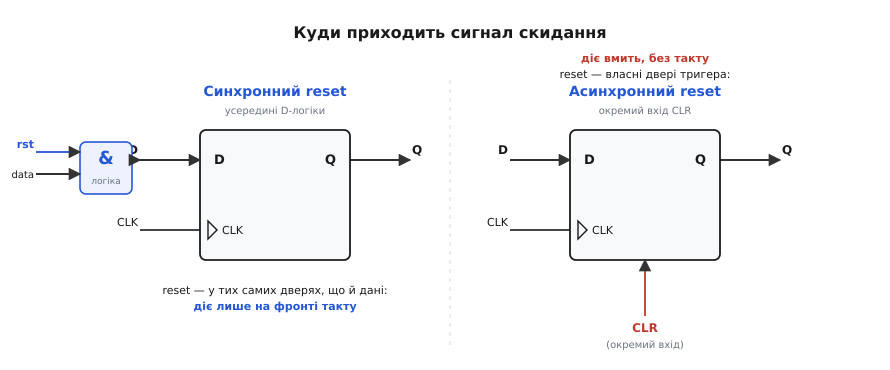
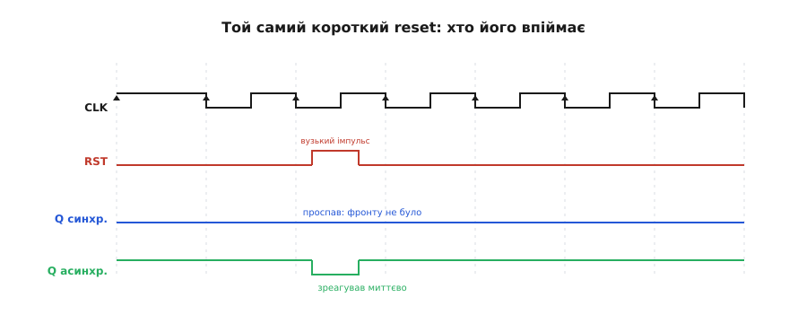
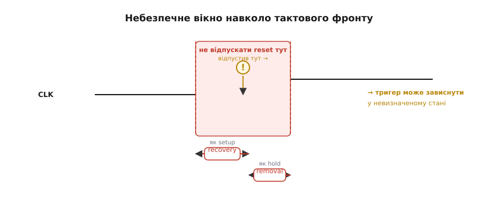
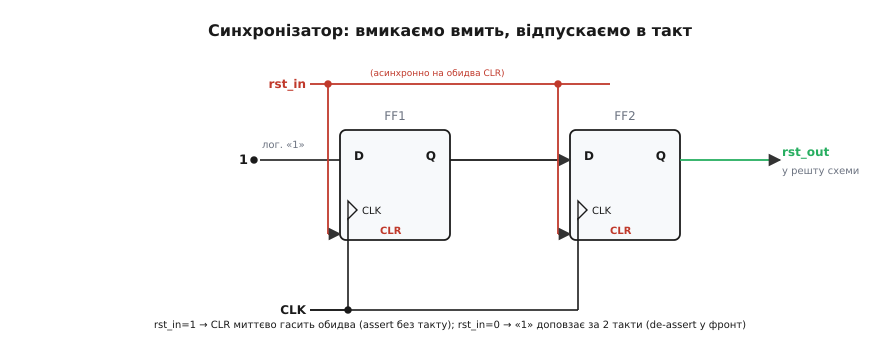

# Синхронне й асинхронне скидання в цифрових схемах

<preknowlist>
- [Метастабільність](root:hw-digital/metastability-timing) — коли вхід тригера змінюється надто близько до тактового фронту, тригер може зависнути в проміжному стані «ні 0 ні 1»; саме на цьому тримається головна ідея синхронізатора скидання.
- [Скінченні автомати](root:hw-digital/finite-state-machines) — цифровий вузол із фіксованим набором дозволених станів; потрапивши у стан поза таблицею, він поводиться непередбачувано (це один із наскрізних прикладів статті).
</preknowlist>

Будь-яка [послідовнісна схема](root:hw-digital/register) — лічильник, [автомат](root:hw-digital/finite-state-machines), регістр у FPGA, що ми складали з [макрокомірок](root:embedded/pal-to-fpga) — має одну спільну ваду: коли вмикається живлення, її [тригери](root:hw-digital/d-flip-flop) прокидаються у випадковому стані. Один ляже в 0, інший у 1, і це щоразу по-різному. Доти, доки ми не скажемо схемі «почни ось звідси», вона рахує від сміття — і поводиться непередбачувано. Сигнал, що силоміць заганяє всі тригери у відомий початковий стан, і зветься **скиданням** (англ. *reset* — повернути на місце, обнулити).

Питання, яке здається дрібним, насправді ламає схеми частіше, ніж будь-яка хитра логіка: **як саме цей сигнал має дістатися тригерів**? Виявляється, є рівно два способи, вони поводяться зовсім по-різному, і кожен має пастку, яку видно лише тоді, коли вже горить плата на столі. Розберімо обидва від першопричини — і побачимо, чому правильна відповідь поєднує їх обох.

### Навіщо взагалі скидати

Може здатися, що достатньо в коді прошивки на старті записати потрібні значення в регістри — і нащо тоді окреме «залізне» скидання? Але йдеться не про регістри, які бачить процесор. Йдеться про **тригери всередині цифрової логіки**: розряди лічильників, біти станів автоматів, конвеєрні регістри. Їх ніхто не «записує» командою — вони живуть власним життям на кожному фронті такту. Якщо такий автомат стартував зі стану, якого в його таблиці взагалі немає, він може зависнути назавжди або кинути назовні короткий хибний імпульс — а той уже клацне зовнішнє реле чи спалить силовий ключ.

> 🔧 **Навіщо це.** На реальній платі скидання — це не «гарна практика», а умова, без якої вузол просто не запуститься надійно. FPGA після подачі живлення завантажує конфігурацію, але стан тригерів усе одно треба привести до відомого; силовий драйвер мусить стартувати з вимкненим ключем, а не з тим, який випадково випав у 1. Скидання — це гарантія «з якого рядка почати».

Отже, сигнал скидання потрібен. Лишається головне: він приходить **ззовні** тактованої логіки (натиснули кнопку, просіла напруга, спрацював сторож), а живе схема **за тактом**. Зіткнення цих двох світів — асинхронної події і синхронного такту — і породжує весь сюжет.

### Дві двері: куди заходить сигнал скидання

Тригер має вхід даних D і вхід такту CLK; на активному фронті такту він захоплює те, що було на D. Сигнал скидання можна підвести до тригера двома принципово різними шляхами.

**Перший шлях — синхронний.** Ми не чіпаємо сам тригер, а домішуємо скидання в **логіку перед D**. Грубо кажучи, ставимо перед входом даних вентиль на кшталт «якщо `rst` активний — подай 0, інакше — звичайні дані». Тригер при цьому найзвичайнісінький, без жодних спеціальних входів. Він, як завжди, дивиться на D **лише на фронті такту** — а отже, і скидання спрацює лише на фронті.

**Другий шлях — асинхронний.** Майже кожен реальний тригер має, крім D і CLK, ще й окремий вхід — `CLR` (англ. *clear*, очистити) або `PRE` (англ. *preset*, попередньо встановити). Цей вхід б'є **повз** усю тактовану частину, прямо в бістабільну петлю тригера, і перемикає його **вмить**, не питаючи дозволу в такту. Активував `CLR` — вихід Q упав у 0 тієї ж наносекунди, фронт не потрібен.


*Синхронний reset зливається в ту саму логіку, що й дані, тож діє лише на фронті такту. Асинхронний reset заходить в окремий вхід CLR збоку тригера й перемикає його миттєво, незалежно від такту. Уся різниця між двома підходами народжується саме тут — у тому, через які двері проходить сигнал.*

Уся подальша різниця в поведінці випливає з цієї однієї картинки. Синхронне скидання — це звичайні дані, які чекають фронту; асинхронне — це окремий канал, що діє поза тактом. Подивімося, що кожен підхід дає і чим карає.

### Чим вони відрізняються на практиці

Найперша й найвідчутніша різниця — **що буде з дуже коротким імпульсом скидання**, коротшим за період такту. Уявімо завадовий сплеск на лінії `rst`, що зник між двома фронтами.


*Вузький імпульс скидання вмістився між сусідніми фронтами такту. Синхронний тригер його не помітив зовсім — він дивиться на скидання лише на фронті, а фронту в цьому вікні не сталося. Асинхронний тригер кинувся в 0 тієї ж миті й повернувся, коли імпульс зник. Та сама подія — протилежна реакція.*

Звідси два дзеркальні висновки. **Синхронне скидання само собою фільтрує вузькі завади**: усе, що не дожило до фронту такту, для нього не існує. Це чудово, коли імпульс — це шум; і це погано, коли імпульс був справжній, а ми його втратили. **Асинхронне скидання реагує на будь-який, навіть мікроскопічний сплеск**: воно ловить справжню короткочасну подію (скажімо, аварійне зникнення напруги), але так само слухняно ловить і голку завади, скинувши схему, коли цього ніхто не просив.

Друга різниця — **чи працює скидання, коли такт стоїть**. Поки немає тактових фронтів (генератор ще не запустився, або ми навмисне зупинили такт заради економії), синхронне скидання **безсиле** — нема на чому спрацювати. Асинхронне діє завжди, бо такт йому й не потрібен. Тому єдиний спосіб гарантовано привести схему до ладу, коли генератор ще не розкачався після ввімкнення живлення, — це асинхронний канал.

Третя різниця тонша — **скільки логіки коштує скидання**. Синхронний варіант домішується у вже наявну логіку перед тригером і у простих ПЛІС часто «безплатний». Асинхронний задіює окремий вхід `CLR`, який у деяких архітектурах (надто всередині великих FPGA) спеціальний і обмежений; буває, його доводиться емулювати додатковою логікою, і тоді «безплатний» уже він не виходить. Тут немає універсального переможця — усе залежить від того, яке залізо під схемою.

Зведімо ці три осі в одну думку. Синхронне скидання — **акуратне, передбачуване, але глухе, поки нема такту**. Асинхронне — **завжди напоготові, але надто чутливе й, що найгірше, небезпечне в один конкретний момент**. Саме цей момент — серце всієї теми.

### Підступ асинхронного скидання: момент відпускання

Асинхронне скидання здається ідеальним: діє вмить, працює без такту. Пастка ховається не в тому, як його **вмикають**, а в тому, як його **знімають**.

Поки `CLR` активний, тригер міцно тримається в 0 — тут жодних питань. Але настає мить, коли ми скидання **відпускаємо**, і тригер має знову почати слухати такт. І якщо ми відпустимо `rst` **рівно тоді, коли надходить фронт такту**, тригер опиниться в розпачі: чи я ще скинутий, чи вже захоплюю дані? Внутрішня бістабільна петля може зависнути в стані «ні 0 ні 1» — це та сама [метастабільність](root:hw-digital/metastability-timing), що чигає на кожен тригер, чий вхід міняється у заборонене вікно навколо фронту.

> Тригер захоплює чисто лише тоді, коли його вхід стабільний у вузькому вікні навколо фронту такту: трохи **до** фронту (час setup) і трохи **після** (час hold). Якщо вхід смикнувся саме в цьому вікні, тригер може на якийсь час зависнути в проміжному, «ні 0 ні 1» стані — це й є метастабільність. [Що це за вікно й чому петля тригера зависає](root:hw-digital/metastability-timing).

Для звичайного входу D ці два краї вікна звуться setup і hold. Для входу скидання вони мають власні назви, але це **той самий механізм**: зняття `CLR` — це теж зміна стану на вході тригера, і вона теж не сміє припасти на фронт.

```
recovery  ≈  аналог setup:  reset треба зняти ЗА деякий час ДО фронту такту
removal   ≈  аналог hold:   після фронту reset має ще ПОТРИМАТИСЯ деякий час
```

> 🔧 **Навіщо це.** Терміни **recovery** (англ. *recovery time*, час відновлення) і **removal** (англ. *removal time*, час зняття) ти зустрінеш у звіті таймінг-аналізу будь-якого FPGA-інструменту як окремий розділ перевірок поряд із setup/hold. Якщо там світиться «recovery violation» на лінії скидання — це не абстракція, а пряме попередження: схема може зависнути на старті, бо скидання знімається надто близько до фронту. Розуміючи, що recovery — це просто setup для reset, ти читаєш такий звіт без додаткового перекладу.


*Навколо активного фронту такту є заборонене вікно: recovery — перед фронтом (як setup), removal — після (як hold). Якщо асинхронне скидання знімається всередині цього вікна, тригер може зависнути в невизначеному стані. Лихо тут не тоді, коли скидання вмикають, а саме коли його відпускають.*

І це ще не вся біда. Уяви, що асинхронне скидання приходить **відразу на тисячу тригерів** великої схеми. Сигнал біжить по міді з різною затримкою, тож на дальній тригер «відпустив» дійде на частку наносекунди пізніше, ніж на ближній. Виходить, **різні тригери вийдуть зі скидання на різних фронтах такту**: одні почнуть рахувати на цьому такті, інші — на наступному. Автомат, половина бітів стану якого «прокинулася» на такт раніше за другу, легко провалюється в стан, якого в його таблиці нема. Це класична причина того, що схема стартує то правильно, то ні — «плаває» від увімкнення до увімкнення.

Отже, асинхронне **вмикання** скидання — благо (вмить, без такту, працює навіть при мертвому генераторі), а асинхронне **знімання** — джерело двох бід відразу: метастабільність на фронті й розповзання моменту виходу по схемі. Напрошується очевидний хід: узяти від кожного підходу його сильний бік.

### Найкраще з обох світів: вмикаємо асинхронно, відпускаємо синхронно

Якщо проблема лише в **знятті** скидання, то полагодьмо саме зняття — а вмикання лишимо асинхронним, бо там воно бездоганне. Тобто: скидання має **спрацьовувати вмить**, як асинхронне (щоб ловити аварію й працювати без такту), але **зніматися рівно по фронту такту й одночасно для всіх**, як синхронне. Цю ідею звуть **асинхронне вмикання, синхронне зняття** (англ. *asynchronous assert, synchronous de-assert*), а схема, що її втілює, — **синхронізатор скидання** (англ. *reset synchronizer*).

Будується він із двох тригерів у ланцюжок — це той самий [двотригерний синхронізатор](root:hw-digital/metastability-timing/proj-two-ff-synchronizer.md), яким переводять будь-який асинхронний сигнал у тактовий світ, лише застосований до скидання.


*Вхід даних першого тригера прив'язано до логічної «1». Зовнішнє скидання rst_in заходить асинхронно на входи CLR обох тригерів: щойно воно активне — обидва тригери вмить у 0, і вихід rst_out теж активний (вмикання без такту). Коли rst_in знімають, тригери більше не тримаються в 0, і «1» доповзає виходом за два фронти такту — тобто скидання знімається синхронно й чисто.*

Прослідкуймо логіку роботи по кроках, бо вона дуже гарна. Поки `rst_in` активний, він через `CLR` тримає обидва тригери в 0 — отже, `rst_out` активний **миттєво**, без жодного такту: асинхронне вмикання на місці. Тепер `rst_in` зняли. Входи `CLR` відпустили тригери, і на найближчому фронті перший тригер захоплює прив'язану до D логічну «1»; на наступному фронті ця «1» переходить у другий тригер, і `rst_out` нарешті стає неактивним. Тобто скидання **знімається строго по фронту такту**, а не будь-коли — синхронне зняття на місці.

А навіщо аж **два** тригери, чому не один? Бо момент, коли зовнішнє `rst_in` відпускає `CLR`, сам по собі асинхронний і може припасти на фронт — і перший тригер цілком може зловити метастабільність. Але далі цей хисткий стан має цілий період такту, щоб **розсмоктатися**, перш ніж його захопить другий тригер. На вихід `rst_out` потрапляє вже чисте, усталене значення. Два тригери різко знижують імовірність, що метастабільність дотече до самої схеми; для дуже жорстких вимог ставлять і три.

> 🔧 **Навіщо це.** Це не академічна вправа, а **стандартний будівельний блок** будь-якого серйозного FPGA- чи ASIC-проєкту. На кожен тактовий домен ставлять свій синхронізатор скидання (бо «синхронно» означає «синхронно з конкретним тактом»), його вихід ведуть деревом до всіх тригерів домену — і отримують скидання, що вмикається миттєво на аварію, а знімається чисто й одночасно. Хто розуміє цей вузол, той не дивується, чому в чужому коді на FPGA скидання чомусь проходить крізь пару зайвих тригерів, перш ніж кудись піти.

Чому склався саме такий компроміс і чому ASIC-світ та FPGA-світ десятиліттями сперечалися, [що ставити за замовчуванням](root:embedded/synchronous-reset/hist-reset-debate.md), — окрема й повчальна історія. А повний робочий код синхронізатора разом із [готовим автоматом скидання й типовими граблями розведення скидання по платі](root:embedded/synchronous-reset/proj-reset-fsm.md) винесений у проєктну вставку — там скидання постає вже не абстракцією, а конкретним C-вузлом прошивки.

### Те саме скидання живе всередині твого мікроконтролера

Може здатися, що вся ця розмова — лише про FPGA й ручну схемотехніку, а в прошивці на готовому мікроконтролері скидання «просто є». Насправді все навпаки: кожен мікроконтролер вирішує **рівно ту саму задачу** всередині себе, і робить це **точнісінько за описаним рецептом** — просто це сховано від тебе в кремнії.

У мікроконтролера є кілька джерел скидання, і всі вони — **асинхронні події**: подача живлення (англ. *power-on reset*, POR — скидання при ввімкненні), просідання напруги нижче порога (англ. *brown-out reset*, BOR — скидання при «затемненні» живлення), зовнішній вивід `RESET`, спрацьовування [сторожового таймера](root:hw-digital/finite-state-machines) (англ. *watchdog* — «вартовий пес»). Жодна з цих подій не питає дозволу в системного такту — вони можуть статися будь-якої миті. І тут чип робить рівно те, до чого ми щойно дійшли: **вмикає внутрішнє скидання миттєво**, а **знімає — синхронно з тактом**, та ще й не одразу.

Логіка зняття всередині чипа має одну додаткову, дуже розумну умову. Скидання не відпускають, **доки не стабілізується генератор**. Адже після подачі живлення кварцовий чи внутрішній генератор розгойдується не миттєво — перші такти «брудні», нерівні. Якби ядро почало виконувати код на цих хитких тактах, воно б повелося непередбачувано. Тому чип тримає скидання активним, **чекає, поки генератор устаткується**, і лише тоді знімає скидання — синхронно, відлічивши ще кілька чистих тактів. Наприклад, у родині PIC32 ядро починає вибирати першу інструкцію лише через **вісім тактів** системного годинника після того, як скидання знято й конфігурація завантажена.

```
Послідовність скидання в МК (спрощено):
  1. подія (POR / BOR / WDT / вивід RESET)  →  внутрішній reset УВІМКНЕНО вмить (асинхронно)
  2. чекаємо стабілізації генератора         →  reset усе ще тримається
  3. генератор устаткувався                  →  reset знімають СИНХРОННО з тактом
  4. ще N чистих тактів (напр., 8 у PIC32)   →  ядро починає виконувати код
```

> 🔧 **Навіщо це.** Це пояснює дві дуже практичні речі. По-перше, чому між подачею живлення й першим рядком твоєї прошивки минає відчутний час — це не гальмо, а навмисне очікування чистого такту (його враховують у [бюджеті часу завантаження](root:embedded/boot-time-budget)). По-друге, чому майже в кожному МК є **регістр причини скидання**: позаяк усі джерела асинхронні й зведені в один внутрішній сигнал, чип окремо запам'ятовує, **хто саме** скинув — щоб після старту прошивка могла спитати «мене перезапустив сторож чи просіла напруга?» і повестися відповідно. Без розуміння, що це все — один синхронізований канал скидання, ці регістри здаються випадковим набором бітів.

Регістр причини скидання — гарне завершення всієї нитки. Він існує саме тому, що скидання **прийшло асинхронно з кількох джерел**, було **зведене в один сигнал** і **синхронно знято**, — і єдине, що лишилося прошивці, це прочитати, з чого все почалося. Те, що в схемі на FPGA ти будуєш руками синхронізатором скидання, у мікроконтролері вже зібрано на кристалі за тим самим законом: **вмикай асинхронно, відпускай синхронно**. Зрозумівши цей закон один раз, ти впізнаєш його скрізь — від макрокомірки дешевого GAL до брауну-аут детектора в найновішому чипі.
