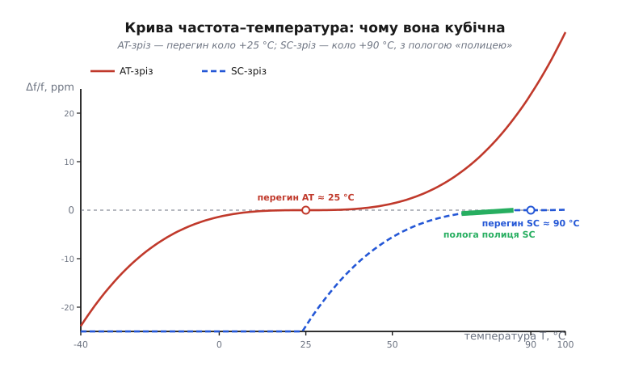
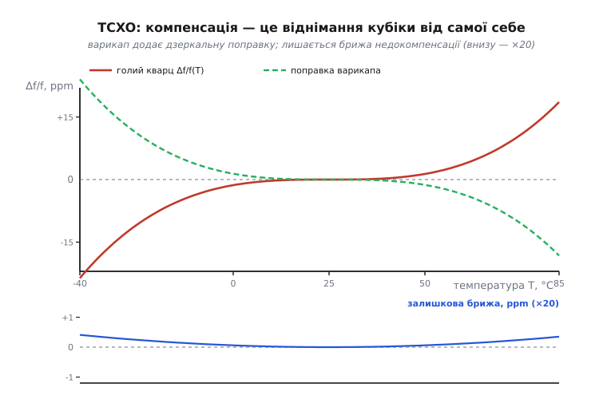
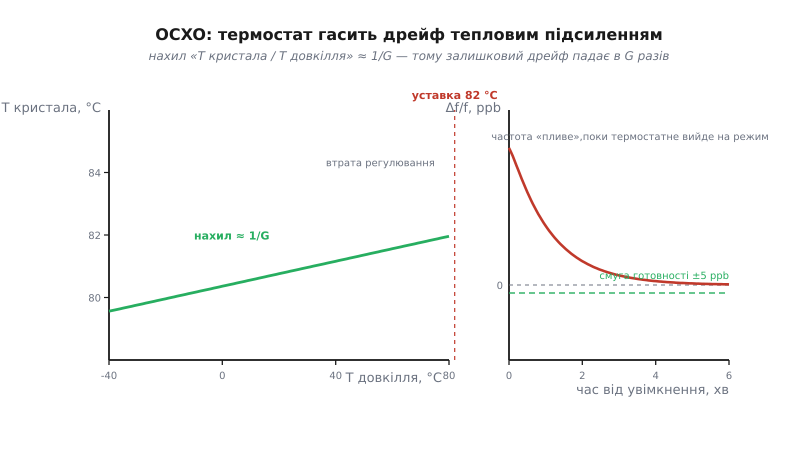
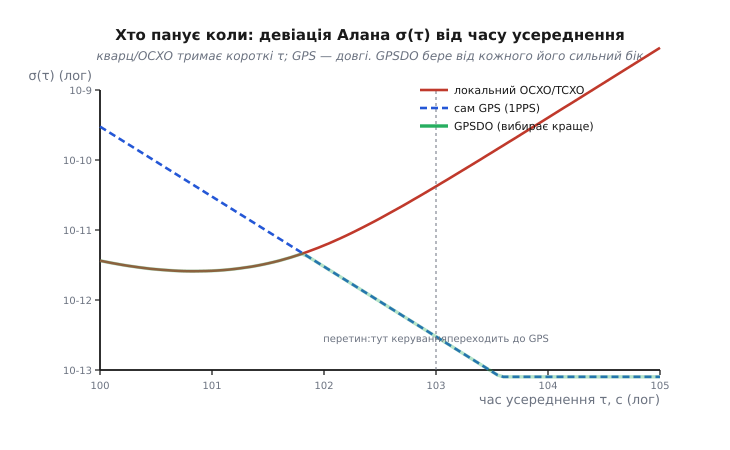

# TCXO та OCXO: механіка компенсації й термостатування

У базовому кроці ми поставили обидва прилади на [піраміду точності](root:embedded/tcxo-ocxo) й побачили головне: TCXO **виправляє** температурний дрейф кварцу обчисленою поправкою, а OCXO **не дає** цьому дрейфу виникнути, тримаючи кристал у термостаті. Тоді ми взяли це майже як факт — «є давач, є поправка», «є нагрівач, є стала температура». Тепер розберемо, **як саме** воно працює: звідки береться поправка й чому вона ніколи не буває ідеальною; наскільки взагалі можна «тягнути» частоту кварцу і що ставить цю межу; як термостат перетворює широкий розкид температури довкілля на вузеньку смужку всередині; і чому для одних задач панує TCXO, а для інших — тільки OCXO. Наприкінці зберемо все в одну картину стабільності — коротко- проти довгочасної — і побачимо, як [GPS-дисциплінований генератор](root:embedded/tcxo-ocxo) бере від кварцу й від супутника кожне його сильне.

Нитка простягається природно: щоб зрозуміти компенсацію, спершу треба точно знати **форму** того, що компенсуємо. З неї й почнемо.

## Форма ворога: чому крива саме кубічна

Кварц пливе з температурою не абияк. Якщо взяти найпоширеніший **AT-зріз** (пластину, вирізану з монокристалу під кутом близько 35°15′ до оптичної осі) і зміряти його частоту від −40 до +85 °C, вийде характерна полога S-подібна крива. Її форма не випадкова — вона **кубічна**, і зрозуміти чому означає зрозуміти половину всієї цієї теми.

Частота кварцу задана швидкістю пружної хвилі в пластині, а та швидкість — пружними сталими кристала (тим, наскільки «жорсткий» кварц на зсув). Пружні сталі, своєю чергою, залежать від температури. Розкладемо цю залежність у ряд коло якоїсь опорної температури T₀ — як будь-яку гладку залежність, її можна наблизити многочленом:

```
Δf/f(T) = a₁·(T−T₀) + a₂·(T−T₀)² + a₃·(T−T₀)³ + …
```

Тут Δf/f — відносне відхилення частоти від номіналу (у ppm), а a₁, a₂, a₃ — температурні коефіцієнти першого, другого й третього порядків. Уся хитрість AT-зрізу в тому, **під яким кутом** ріжуть пластину: цей кут добирають так, щоб одразу два молодші коефіцієнти — a₁ і a₂ — стали малими біля кімнатної температури. Коли **лінійний** член зникає, крива в тій точці йде горизонтально; коли зникає ще й **квадратичний**, вона там не має й вигину — це **точка перегину** (англ. *inflection point*), яку в кварцовому світі звуть **точкою повороту** (*turnover*). Для AT-зрізу вона лежить коло **+25…+27 °C** — навмисно біля кімнатної.

Що лишається, коли два молодші члени погашено? Найстарший, **кубічний**. Тому поблизу перегину закон спрощується до майже чистої кубіки, якщо міряти температуру **від точки перегину** Tᵢ:

```
Δf/f(T) ≈ a₃·(T − Tᵢ)³        (біля перегину, a₁,a₂ → 0)
```

Ось звідки S-форма: кубічна функція йде полого коло центру (де похідна мала) і круто розганяється на краях. Для AT-зрізу типове a₃ ≈ **1.0·10⁻⁴ ppm/°C³** (точне значення керується кутом зрізу — саме тому виробник кварцу продає «сорти» під різні діапазони). Порахуймо, що це дає на краю робочого діапазону.

**Приклад (розкид AT-зрізу на краю діапазону).** Кварц AT-зрізу, перегин Tᵢ = 26 °C, a₃ = 1.0·10⁻⁴ ppm/°C³. Наскільки попливе частота при −40 °C?

```
ΔT = T − Tᵢ = −40 − 26 = −66 °C
Δf/f = a₃·ΔT³ = 1.0·10⁻⁴ · (−66)³
     = 1.0·10⁻⁴ · (−287 496) ≈ −28.7 ppm
```

Майже −29 ppm лише від температури — і це на доброму кварці. На гарячому краю +85 °C вийде ΔT = +59 °C і Δf/f ≈ +20 ppm. Повний розкид від краю до краю — під 50 ppm. Саме цю дугу й треба або **зігнути назад** (TCXO), або взагалі **не дати кристалу по ній їздити** (OCXO). Що фізично стоїть за коефіцієнтами a₁, a₂, a₃ і як кут зрізу їх зсуває — повне виведення з пружних сталих у [🧮 Кубічна крива кварцу з першопринципів](root:embedded/tcxo-ocxo/math-tcxo-compensation.md).


*Обидві криві кубічні, різняться лише положенням перегину. AT-зріз (суцільна) має поворот коло +25 °C — тому в кімнатному діапазоні його дуга широка. SC-зріз (пунктир) має поворот коло +90 °C, і в тому вузькому вікні коло 70…85 °C крива йде майже плоско — саме там і тримають кристал в OCXO. Кут зрізу задає, де сидить перегин.*

> 🔧 **Навіщо це.** Кубічна форма — не абстракція, а те, що визначає весь бюджет вашого пристрою. По-перше, вона пояснює, **чому TCXO взагалі можливий**: дрейф не хаотичний, а описується трьома числами, тож його можна відняти. По-друге, вона підказує, де ставити перегин: якщо ваш пристрій завжди працює коло +25 °C, дешевий AT-кварц із перегином там уже сам по собі дає малий дрейф — інколи TCXO й не треба. По-третє, кубічний закон означає, що похибка на краях росте **як куб** відстані від перегину: розширити діапазон із ±40 до ±60 °C — це не в 1.5 раза гірше, а в (60/40)³ ≈ 3.4 раза.

## Скільки взагалі можна «тягнути» частоту: межа компенсації

TCXO компенсує дрейф не магією, а тим, що **зсуває** частоту кварцу в потрібний бік рівно настільки, наскільки її знесло. Але кварц — не гумовий: його частоту можна зрушити лише в дуже вузьких межах. Скільки саме — це не дрібниця, а **жорстка межа**, у яку впирається вся компенсація. Щоб її побачити, треба згадати, з чого кварц зроблений електрично.

Для зовнішньої схеми кристал поводиться як [чотириелементна модель BVD](root:hw-components/quartz-rlc-model): послідовна «механічна» гілка R₁–L₁–C₁ (маса, пружність і втрати колишеться пластини) і паралельна їй статична ємність електродів C₀. У цієї моделі є **два** резонанси: послідовний fs (де гілка R₁–L₁–C₁ має нульовий реактанс) і трохи вищий паралельний fp (де вся структура з C₀ разом іде в антирезонанс). Робоча частота генератора лежить **між** ними — і саме тим, куди в цьому вузькому вікні вона сяде, керує ємність, яку кварц «бачить» ззовні, — **навантажувальна** CL.

Залежність частоти від CL виводиться просто. Реактанс механічної гілки коло резонансу дорівнює нулю на fs; додаткова послідовна ємність CL зсуває точку нуля вгору на

```
Δf/f ≈ C₁ / (2·(C₀ + CL))
```

Ось де ховається межа. Уся «тяга» (англ. *pullability*) пропорційна **моторній ємності C₁**, а вона в кварці мізерна — фемтофаради, у тисячі разів менша за C₀. Тому все вікно fp − fs — це якісь **сотні ppm** на весь кристал, а реально доступний зсув від розумної зміни CL — ще менший, одиниці-десятки ppm. Порахуймо на конкретному кварці.

**Приклад (яку смугу дає варикап).** Кварц: C₁ = 5 фФ (5·10⁻¹⁵ Ф), C₀ = 3 пФ. Варикап у TCXO змінює CL від 12 до 32 пФ. Який діапазон підстроювання частоти?

```
при CL = 12 пФ:  Δf/f = C₁/(2·(C₀+CL)) = 5e-15/(2·15e-12) = 1.67e-4 = +167 ppm
при CL = 32 пФ:  Δf/f = 5e-15/(2·35e-12)                    = 0.71e-4 =  +71 ppm
розмах підстроювання = 167 − 71 ≈ 96 ppm
```

(Абсолютні числа тут — відносно ідеального fs; важливий саме **розмах** ≈ 96 ppm між крайніми CL.) Дев'яносто шість ppm «поля для маневру» — і це вже щедро. Порівняймо з ворогом: наш AT-кварц із попереднього прикладу гуляє на ~50 ppm від краю до краю. Отже, варикап **має** запас, щоб перекрити дрейф, — але запас не безмежний. Візьми кварц із меншою C₁ (наприклад, годинниковий камертон, де C₁ ще в рази менша) — і pullability впаде до одиниць ppm, вже не вистачить перекрити температуру. Звідси перший інженерний висновок:

Компенсація можлива тільки тому, що потрібний зсув (десятки ppm) **вкладається** у доступну тягу кварцу (теж десятки ppm). Це не завжди так — і саме тому TCXO будують на кварці з достатньою C₁, а не на будь-якому.

Друга тонкість: сама залежність Δf/f від CL — **нелінійна** (частота йде як 1/(C₀+CL)), та й ємність варикапа від напруги теж нелінійна. Дві нелінійності перемножуються, і мережа компенсації мусить це враховувати — інакше поправка, ідеальна в центрі, розсиплеться на краях. Повне виведення pullability з BVD і те, як два нелінійні перетворення складаються, — у вставці [🧮 Кубічна крива кварцу з першопринципів](root:embedded/tcxo-ocxo/math-tcxo-compensation.md).

> 🔧 **Навіщо це.** Pullability — це параметр, який ви особисто звірятимете, обираючи кварц для VCTCXO чи GPSDO. Якщо діапазон підстроювання генератора менший за суму «дрейф + старіння + запас», система **не зможе** втримати частоту в номіналі — вона впреться в край керування (railing) і далі поповзе безкарно. У GPSDO це проявляється як зрив утримання: петля крутить керувальну напругу до упору, а частота все одно не там. Тому pullability рахують **із запасом**: доступна тяга має покривати найгірший дрейф плюс старіння за весь строк служби.

## TCXO: компенсація як віднімання кубіки від самої себе

Тепер, знаючи форму дрейфу (кубіка) і межу тяги (десятки ppm через CL), складемо власне механізм. Ідея TCXO у своїй суті — **інверсія**: якщо кварц додає до частоти +Δf/f(T), мережа компенсації має додати рівно −Δf/f(T), і сума дасть нуль на будь-якій температурі.

Це означає, що коригувальна ланка мусить відтворити **дзеркальну кубіку**. Вона міряє температуру давачем, за нею обчислює потрібну поправку й прикладає її як напругу Vкор на варикап; варикап міняє CL; CL зсуває частоту на −Δf/f. Формально ланцюжок такий:

```
T → давач → Vкор = −f⁻¹(поправка) → варикап C(V) → CL → зсув частоти −Δf/f(T)
```

Ключове слово — **відтворити кубіку**. І ось де починаються два різні світи.

**Аналоговий TCXO** будує дзеркальну криву з фізичних деталей. Класика — мережа з кількох [термісторів](root:hw-sensing/ntc-thermistor) і резисторів: опір термістора сам по собі нелінійно падає з температурою, а вміло скомбінувавши кілька термісторів із різними номіналами й резисторів-подільників, отримують напругу, чий хід із температурою наближає потрібну кубіку. Це елегантно (жодного процесора, миттєвий відгук, копійчана собівартість), але точність обмежена: аналогова мережа наближає кубіку **приблизно**, номінали мають розкид, а підігнати її під конкретний екземпляр кварцу важко. Реальна межа аналогового TCXO — близько **±0.5…±1 ppm**.

**Цифровий TCXO** (DCXO, від *digitally-compensated*) робить те саме числом. Усередині — давач температури, таблиця поправок у EEPROM і ЦАП, що видає Vкор на варикап. На заводі кожен екземпляр **калібрують**: заганяють у термокамеру, міряють дрейф на кількох температурах і записують у його власну EEPROM коефіцієнти (чи цілу таблицю), що найкраще гасять саме **його** криву. Оскільки калібрують поекземплярно, DCXO б'є аналоговий: **±0.1…±0.2 ppm**, а найкращі — і краще.

Але — і це головне, що базовий крок лишив за кадром — **жодна компенсація не буває ідеальною**. Подивімося, чому.


*Угорі: голий кварц (червона кубіка) і дзеркальна поправка варикапа (зелений пунктир) — вони майже гасять одне одного. Унизу — те, що лишилося після додавання, підсилене в 20 разів: дрібна хвиляста **брижа недокомпенсації**. Поправка ніколи не лягає на криву ідеально, тож замість чистого нуля лишається залишковий дрейф на рівні часток ppm — саме він і задає підсумкову точність TCXO.*

Ця залишкова брижа береться з трьох джерел, і всі три варто розуміти:

**Похибка підгонки.** Поліном чи таблиця наближає кубіку лише **приблизно** — між точками калібрування крива поправки трохи розходиться зі справжньою. Аналогова мережа наближає грубше, цифрова тонше, але ідеально — ніколи. Звідси хвиляста форма залишку: він майже нуль у точках підгонки й трохи відходить між ними.

**Термогістерезис.** Кварц має неприємну властивість: його частота при даній температурі трохи **різна залежно від того, звідки ви до неї прийшли** — грієте ви кристал чи студите. Ця петля (гістерезис) — на рівні часток ppm, і компенсація її **не бачить**: давач міряє температуру, але не «історію». Для GNSS це дрібниця, для еталона — вже ні.

**Затримка й градієнт.** Давач сидить **поряд** із кварцом, а не в ньому. Коли температура довкілля різко міняється, кристал і давач нагріваються **не синхронно** — між ними виникає перепад. Поки він розсмоктується, поправка рахується для «не тієї» температури, і частота смикається. Тому TCXO гірше тримає частоту під **швидкими** температурними ударами, ніж у сталому режимі — параметр, який у даташиті ховається за «dynamic frequency vs temperature».

І останнє, що компенсація **не чіпає взагалі**: [старіння](root:hw-components/frequency-accuracy-ppm) — повільний відхід частоти з роками через релаксацію напружень у кристалі та в кріпленні. TCXO б'ється лише з температурою; старіння (типово одиниці ppm за рік у перший рік, потім менше) лишається й накопичується. Ось чому точні системи час від часу TCXO **перекалібровують** — найчастіше саме через вхід підстроювання VC, про який далі.

Про сам корпус, ноги (VDD, GND, OUT, OE/VC), два ґатунки виходу (clipped sine проти CMOS) і типові граблі підключення — узагальнено в [🔌 TCXO зсередини](root:embedded/tcxo-ocxo/comp-tcxo.md); тут ми свідомо лишаємось на рівні механіки, а не розпіновки.

## OCXO: термостат як підсилювач сталості

TCXO виправляє наслідок; OCXO усуває причину. Якщо температура кристала **не міняється**, то й кубічний дрейф, що від неї залежав, просто зникає — лишаються тільки дрібні внески (старіння, шум регулятора). Уся суть OCXO — тримати кристал за сталої температури. Питання лише: **наскільки** сталої і якою ціною.

Розберемо це кількісно, бо тут ховається красива ідея. Термостат (англ. *oven*) — це нагрівач із терморегулятором, що тримає уставку Tset вище за будь-яку очікувану зовнішню температуру (типово +75…+85 °C), щоб завжди тільки **догрівати**: нагріти легко, охолодити нічим. Регулятор — це замкнена петля [зворотного зв'язку](root:embedded/open-vs-closed-loop): він міряє температуру кристала й підливає стільки тепла, щоб тримати її на Tset. Як усяка петля зі скінченним підсиленням, він тримає уставку **не ідеально** — при зміні довкілля лишається дрібна похибка. Ключова величина — **теплове підсилення** (thermal gain) G: у скільки разів термостат **зменшує** вплив зовнішньої температури на кристал.

```
ΔTкристала ≈ ΔTдовкілля / G
```

Якщо G = 100, то стоградусний розмах довкілля (−40…+60 °C, тобто ΔTдовк = 100 °C) стискається до **1 °C** розмаху на кристалі. А тепер згадаймо кубічний закон: залишковий дрейф іде **як куб** відхилення від перегину, тож стиснувши температурний розмах у 100 разів, ми давимо дрейф навіть сильніше, ніж лінійно. Порахуймо весь ланцюжок.

**Приклад (від довкілля до частоти).** OCXO на SC-кварці: перегин Tᵢ = 85 °C, уставка Tset = 85 °C (просто на перегині!), a₃ = 1.0·10⁻⁴ ppm/°C³, теплове підсилення G = 100. Довкілля гуляє −40…+60 °C. Який залишковий дрейф частоти?

```
розмах довкілля:      ΔTдовк = 60 − (−40) = 100 °C
на кристалі:          ΔTкрист = 100 / G = 100 / 100 = 1 °C  (тобто ±0.5 °C коло Tset)
відхід від перегину:  |T − Tᵢ| ≤ 0.5 °C
дрейф:                Δf/f = a₃·(0.5)³ = 1.0e-4 · 0.125 ≈ 1.25e-5 ppm ≈ 0.0000125 ppm
```

Це **ppb-рівень** (мільярдні частки) — на три-чотири порядки краще за неприборканий кварц і в десятки разів краще за TCXO. Але зверніть увагу, **звідки** береться такий виграш: він множинний — теплове підсилення стискає температуру, а кубічний закон додатково давить дрейф на малому відхиленні. Тому OCXO ставлять уставку **точно на перегин** кристала: там навіть залишкове коливання ±0.5 °C майже не рухає частоту, бо крива в перегині плоска.


*Ліворуч: температура кристала майже не залежить від довкілля, поки нагрівач має запас (нахил лінії ≈ 1/G — тому широкий розмах довкілля стискається у вузьку смужку коло уставки). Вище за уставку термостат «здається» — охолоджувати нічим, і лінія знову йде 1:1. Праворуч: після ввімкнення частота помітно «пливе» кілька хвилин, поки термостат виходить на режим (warmup) — це неминуча плата за термостатування.*

Тут же видно **два обмеження** OCXO, яких у TCXO немає.

**Прогрів (warmup).** При ввімкненні кристал холодний, термостат мусить його розігріти до уставки — це хвилини, і весь цей час частота ще «пливе» по своїй кривій, поки не стабілізується температура. Для приладу на розетці це прийнятно (увімкнув і зачекав), для приладу, що часто спить і прокидається, — катастрофа. Форма перехідного процесу (експонента прогріву плюс можливе «вистрибування» через теплову інерцію) визначає, коли частоту вже можна вважати готовою.

**Апетит до живлення.** Нагрівач гріє **постійно**, і тим сильніше, чим холодніше довкілля. На морозі це можуть бути ват і більше — струм у сотні міліампер безперервно (у базовому кроці ми бачили: 0.5 Вт при 3.3 В — це 150 мА, від CR2032 батарея сідає за півтори години). Тому OCXO немислимий у кишеньковій техніці й живе там, де є розетка.

І окрема глибша тема — **вибір зрізу кварцу**. Прості OCXO ставлять AT-кварц (перегин ~25 °C, дешево), але найкращі беруть **SC-зріз** (*stress-compensated*, стрес-компенсований). Його ріжуть під подвійним кутом так, що він майже не реагує на **механічну напругу** — а саме напруга від нерівномірного нагріву псує частоту під час прогріву та при термоударах. У SC-зрізу перегин лежить високо, коло **+90 °C**, і крива там має особливо пологу ділянку (нижню точку повороту, LTTP) у діапазоні ~70…85 °C — ідеально для гарячого термостата. За це SC-зріз дає: **швидший прогрів** (менше «стрибає» від напружень), **удвічі-втричі краще старіння** й **меншу чутливість до вібрації** (g-sensitivity), ніж AT. Ціна — дорожчий кристал і складніший генератор (SC має кілька близьких мод, і схема мусить чіпляти саме потрібну). Тому AT-OCXO — це «добре й дешево», а SC-OCXO — «найкраще, коли треба еталон».

Найвимогливіші прилади йдуть іще далі — **подвійний термостат** (double oven): термостат усередині термостата. Зовнішній грубо тримає ~70 °C, внутрішній тонко доводить кристал до уставки. Два підсилення перемножуються (Gзаг = G₁·G₂), і залишкова похибка падає ще на порядок — за це платять іще більшим споживанням, розміром і прогрівом.

> 🔧 **Навіщо це.** Теплове підсилення G — це те, що ви читатимете в даташиті OCXO не прямо, а через параметр «frequency vs temperature» (скажімо, ±5 ppb у діапазоні −40…+85 °C). Із нього назад відновлюється, наскільки добре термостат душить довкілля. А warmup і споживання — це два числа, що вирішують, чи OCXO взагалі ляже у ваш пристрій: якщо живлення батарейне або пристрій часто спить, OCXO відпадає незалежно від того, яка в нього точність. Вибір «AT чи SC» ставте так: AT — коли досить ±20 ppb і бюджет тисне; SC — коли треба граничне старіння, стійкість до вібрації та швидкий вихід на режим.

## Дві осі стабільності: коротко- проти довгочасної

Досі ми говорили про точність як про одне число (ppm чи ppb). Але для генератора цього замало — і саме тут детальна картина розходиться з базовою. Годинник може бути **дуже стабільним від секунди до секунди** й водночас **повільно втікати** за тижні; а може навпаки — тремтіти щомиті, але в середньому за добу бути точним. Це **дві різні осі**, і плутати їх — типова помилка.

Розділяють їх за **часом усереднення** τ — інтервалом, на якому ми міряємо частоту:

- **Короткочасна стабільність** (малі τ, від часток секунди до секунд): наскільки рівні **сусідні** періоди коливань. Її псує **шум** (тепловий, фліккер) і [фазовий шум](root:hw-analog/jitter-phase-noise) генератора. Тут кварц чудовий: механічний резонанс із високою добротністю Q дає надзвичайно рівний хід на коротких відрізках.
- **Довгочасна стабільність** (великі τ, години-доба-роки): наскільки частота тримається **в середньому** протягом довгого часу. Її псують **старіння** й **залишковий температурний дрейф**. Тут кварц слабший: він повільно повзе.

Стандартна міра, якою це описують, — **девіація Алана** σ(τ) (англ. *Allan deviation*): вона показує, як розкид частоти залежить від часу усереднення τ. Звичайна статистична дисперсія тут не годиться, бо для дрейфливого генератора вона **не збігається** (що довше міряєш, то більший розкид від повільного повзання) — Алан свого часу й придумав міру, стійку саме до дрейфу. Її форма — крива в лог-лог осях: на малих τ падає (усереднення давить білий шум), виходить на «полицю» (фліккер-шум, який усередненням не задавиш), а на великих τ знову **росте** (дрейф і старіння беруть гору). Що таке девіація Алана, чому не звичайна дисперсія і як її рахують із ряду вимірів — у [девіації Алана](root:hw-components/allan-deviation/detail).

Тепер увімкнемо цю оптику на наші прилади. **TCXO** прибрав температурний дрейф — тобто підтягнув **середину** осі τ (десятки секунд-хвилини), але його короткочасний шум лишився таким, як у базового кварцу, а довгочасне старіння він не чіпає взагалі. **OCXO** тримає температуру сталою — це дає найкращу довгочасну стабільність серед кварцових (мала «полиця» й пізній підйом дрейфу), а SC-зріз додатково прибирає шумовий внесок напружень. Але навіть OCXO зрештою повзе від старіння — на великих τ його крива Алана теж піде вгору.

Ось чому «точність» генератора — це не число, а **крива**. І ось де народжується остання, найкрасивіша ідея цієї теми.

## GPSDO: зшити коротке кварцу з довгим супутника

Що, коли взяти генератор, сильний на **коротких** τ (кварц чи OCXO — рівний хід щомиті), і повільно підрівнювати його за джерелом, сильним на **довгих** τ (сигнал GPS, у якому зашита атомна точність супутникових годинників)? Кожне джерело закриває свій бік кривої Алана, а система бере від обох найкраще. Це і є **GPS-дисциплінований генератор** (GPSDO), який базовий крок згадав, а тепер розберемо як механізм.

GPS-приймач видає **1PPS** — імпульс раз на секунду, прив'язаний до атомного часу. На довгих інтервалах (години) він неперевершений: усереднившись, він точний до наносекунд, бо стоїть на цезієвих годинниках супутників. Але на **коротких** інтервалах 1PPS **тремтить**: кожен окремий імпульс гуляє на десятки наносекунд від квантування приймача, багатопроменевості, атмосфери. Тобто GPS — дзеркальна протилежність кварцу: чудовий на великих τ, поганий на малих.

GPSDO зводить їх у [петлю фазового автопідстроювання](root:hw-analog/phase-locked-loop): він порівнює фазу власного генератора з приходом 1PPS і повільно підкручує частоту генератора (через той самий вхід VC), щоб у **середньому** триматися супутника. Слово **повільно** тут — суть усього. Петлю навмисно роблять **дуже млявою** (стала часу — сотні-тисячі секунд):

- на **коротких** τ (менше сталої петлі) петля майже не втручається — панує **власний генератор**, віддаючи свою рівність;
- на **довгих** τ (більше сталої петлі) петля наздоганяє й притягує до GPS — панує **супутник**.

Точка, де крива генератора перетинає криву GPS, і задає, де ставити сталу петлі: там передавати кермо від одного до другого.


*Локальний OCXO (суцільна) добрий на коротких τ, але на великих піде вгору від дрейфу. Сам GPS (пунктир) поганий на коротких (тремтіння 1PPS), та невпинно кращає на довгих. GPSDO (товста бліда) бере нижчу з двох на кожному τ — рівність кварцу зшивається з атомною прив'язкою супутника. Точка перетину каже, де ставити сталу часу петлі.*

Тепер видно, **чому вибір локального генератора важить** — і чому базовий крок недарма зв'язав GPSDO і з TCXO, і з OCXO. Різниця вилазить у режимі **утримання** (holdover) — коли GPS **пропав** (тунель, глушіння, збій приймача). Петля лишається без опори, і система мусить триматися **самим власним генератором**, поки сигнал не повернеться:

- **GPSDO на TCXO** в утриманні попливе швидко — за хвилини-години набіжить помітна похибка (TCXO має гірший довгочасний дрейф). Годиться, коли GPS пропадає рідко й ненадовго.
- **GPSDO на OCXO** в утриманні тримається **годинами** з мізерною похибкою — тому базові станції зв'язку, де втратити синхронізацію не можна навіть на хвилину, беруть саме OCXO.

Розумні GPSDO ще й **вчаться**: поки GPS є, мікроконтролер запам'ятовує криву старіння й температурну поведінку **свого** генератора, і в holdover не просто «завмирає», а активно вводить вивчену поправку — фактично перетворюючи петлю на самонавчальний TCXO без давача температури, що прогнозує власний дрейф. Як улаштувати таку петлю в прошивці — цифрову дисципліну через ЦАП, PI-регулятор і holdover-логіку — у вставці [⚙️ Прошивка DCXO та GPSDO-петлі](root:embedded/tcxo-ocxo/proj-dcxo-compensation.md).

> 🔧 **Навіщо це.** GPSDO — це стандартна відповідь, коли треба **і** атомна довгочасна точність, **і** дешевизна: замість цезію на кожному вузлі ставлять кварц-OCXO плюс GPS-приймач за копійки. Але вся її надійність тримається на одному числі — **holdover**: скільки система протримається без GPS. Це число прямо диктує вибір локального генератора (TCXO чи OCXO чи навіть рубідій), сталу петлі та алгоритм навчання. Проєктуючи такий вузол, спершу спитайте «як довго й з якою похибкою треба пережити втрату GPS» — і вже з цього вибирайте генератор, а не навпаки.

## Як обрати: від вимоги до щабля, тепер із holdover

У базовому кроці ми вивели золоте правило: **спускайся пірамідою згори донизу, поки точності ще досить, і зупиняйся на найнижчому щаблі, що вкладається у вимогу**. Тепер, знаючи механіку, додамо до нього два виміри, яких простий ppm-погляд не бачить.

По-перше, **точність — це крива, а не число**. Перекладаючи вимогу в ppm, спитайте себе, про **який час** ідеться. «Не з'їхати з радіоканалу» — це коротко-/середньочасна вимога (секунди), і її часто закриває TCXO. «Не набігти більш ніж на секунду за рік» — це довгочасна вимога, і тут TCXO зі своїм старінням може провалитися, навіть маючи добрий ppm «на папері»; треба або OCXO, або періодична синхронізація. Спершу визначте вісь, тоді щабель.

По-друге, **згадайте про динаміку й старт**. OCXO дає ppb, але має прогрів і апетит — якщо пристрій батарейний чи часто спить, він відпадає **незалежно** від точності. TCXO стартує миттєво, але гірше тримає під термоударом. Ці «негладкі» вимоги (час старту, споживання, стійкість до вібрації) відсікають щаблі ще до розмови про ppm.

**Приклад (вибір під довгочасну вимогу з holdover).** Базова станція: частота має триматися в межах ±0.05 ppm, причому GPS іноді пропадає **на годину**, і весь цей час точність мусить триматися. Що обрати?

```
робоча вимога:  ±0.05 ppm — сам GPSDO дає легко (атомна прив'язка)
критичне число: holdover 1 год у межах ±0.05 ppm
TCXO у holdover: дрейф ~0.1…1 ppm/год → НЕ проходить (виїде за межу за годину)
OCXO у holdover: дрейф ~0.001…0.01 ppm/год → проходить із запасом
```

Отже, GPSDO **на OCXO**, а не на TCXO, — попри те, що «в нормі» обидва дали б однакову точність. Вирішила не робоча точність, а поведінка **без** GPS. Це типовий випадок, коли наївний ppm-погляд обманює, а вісь «довгочасна стабільність + holdover» дає правильну відповідь.

І навпаки — не переплачуйте. Кишеньковий GPS-трекер, що постійно бачить супутники й нікому не роздає час, чудово живе на простому **TCXO ±0.5 ppm**: короткочасної стабільності досить, щоб швидко зловити супутники, а довгочасну щомиті підрівнює сам GPS. Ставити туди OCXO — викинути батарею на нагрівач заради точності, якої ніхто не спитає.

Уся ця детальна картина — кубічна крива внизу, тяга кварцу як межа компенсації, інверсія в TCXO із неминучою брижею, теплове підсилення в OCXO, дві осі стабільності й зшивання їх у GPSDO — складається в одну думку, глибшу за базову піраміду. **Точність часу — не властивість компонента, а властивість усієї системи**: вона живе на різних часах по-різному, платиться прогрівом, споживанням і грошима непропорційно до виграшу, і найдешевше добувається не одним «найкращим» кристалом, а розумним поєднанням джерел, кожне сильне у своєму. Правильне інженерне питання — не «який генератор найточніший», а «скільки якої точності треба, на яких часах, і що станеться, коли зникне зовнішня опора».

> 🔧 **Навіщо це.** Практичний висновок усієї теми — тривимірний бюджет замість одного ppm. Складіть три колонки: **робоча точність** (ppm/ppb у нормі), **стабільність за часом** (короткочасна для радіо, довгочасна для відліку/синхронізації) і **негладкі межі** (старт, споживання, вібрація, holdover). Заповніть їх із вимоги задачі — і найдешевший щабель, що проходить усі три, знайдеться сам. Дев'ять разів із десяти це виявиться простий кварц або TCXO; OCXO й GPSDO лишіть для тих задач, де довгочасна вісь або holdover справді того вимагають.
