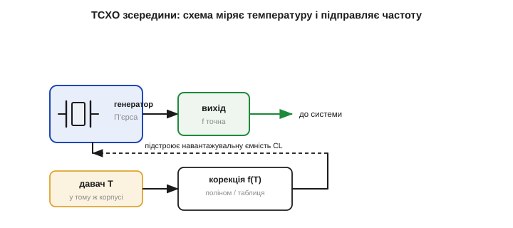
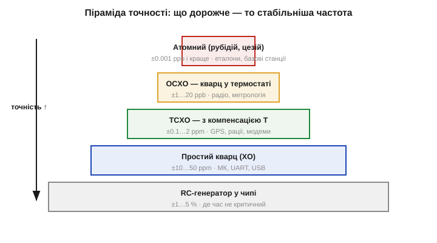

# TCXO та OCXO: коли потрібна компенсація температури

Звичайний кварц дає десятки ppm, і найбільший внесок у цю похибку — **температурний дрейф**: частота кварцу [помітно пливе зі зміною температури](topic:hw-components/frequency-accuracy-ppm). Якщо цю одну причину прибрати, точність стрибне на порядок-два. Саме це й роблять **TCXO** та **OCXO** — кварцові генератори з **компенсацією температури**. Вони стоять там, де частота має бути не просто доброю, а взірцевою: у навігації, радіо, метрології. А поряд із ними варто впорядкувати всі джерела частоти в єдину **піраміду точності**.

### TCXO: компенсувати, а не усувати дрейф

**TCXO** *(Temperature-Compensated Crystal Oscillator)* — генератор, що **вимірює власну температуру й підправляє частоту**, гасячи температурний дрейф кварцу. Ідея проста: дрейф звичайного кварцу хоч і є, але **передбачуваний** — це відома [крива «частота — температура»](topic:hw-components/frequency-accuracy-ppm). Якщо знати температуру, можна обчислити, на скільки частота «попливе», і скомпенсувати це наперед.

Усередині TCXO, в одному корпусі з кварцом, сидить давач температури. Його показ подається на коригувальну ланку — поліном чи таблицю, що відтворює криву, **дзеркальну** до температурного дрейфу кварцу. Логіка така: якщо при 60 °C кварц сам по собі поспішає на +15 ppm, ланка має на тих самих 60 °C підкрутити частоту на −15 ppm — і сума дасть нуль. Цю корекцію ланка прикладає через **підстроювальну ємність** — варикап (англ. *varicap*, від *variable capacitor*): діод, чия ємність залежить від прикладеної напруги. Тут працює ключова властивість [генератора на кварці](topic:hw-analog/pierce-oscillator): його частоту трохи зсуває навантажувальна ємність CL. Отже, змінюючи напругу на варикапі, а з нею CL, точно в такт виміряній температурі, схема безперервно тягне частоту назад до номіналу — куди б її не зносив дрейф кристала. Кварц «пливе» — а керована ємність його щоразу повертає.


*Будова TCXO. Давач температури (у тому ж корпусі, що й кварц) подає показ на коригувальну ланку f(T) — поліном чи таблицю. Та керує підстроювальною ємністю в генераторі, зсуваючи навантажувальну CL так, щоб скомпенсувати температурний дрейф кристала. На виході — частота, стабільна попри зміну температури.*

Результат — точність **±0.1…±2 ppm** у всьому робочому діапазоні температур, у десятки разів краще за неприборканий кварц, і все це за помірних розмірів і споживання (трохи більших за звичайний кварцовий генератор). Чому саме TCXO потрібен у радіо й навігації? Бо там частота — це безпосередньо точність. У [GPS-приймачі](topic:hw-sensing/gnss) похибка опорної частоти прямо переходить у похибку визначення координат і подовжує час «холодного старту»; у рації чи модемі завелике відхилення зсуває сигнал повз вузьку приймальну смугу, і зв'язку просто нема.

Чому радіоприймач такий вимогливий, варто відчути на числі. Радіоканали стоять вузькими «доріжками» по частоті, і приймач має влучити саме в свою. Скажімо, несуча 1 ГГц, а канал — лічені кілогерци завширшки. Подивимось, що дає звичайний кварц проти TCXO:

```
кварц ±20 ppm на 1 ГГц:  20·10⁻⁶ · 10⁹ = 20 000 Гц = ±20 кГц зсуву
TCXO ±0.5 ppm на 1 ГГц:  0.5·10⁻⁶ · 10⁹ = 500 Гц    = ±0.5 кГц
```

Двадцять кілогерц зсуву — це повз вузький канал, приймач сигналу не знайде; пів кілогерца TCXO — у межах каналу, зв'язок є. Ось чому на одній і тій самій частоті радіо потребує TCXO, а простий цифровий такт — ні: вимога народжується з вузькості каналу, а не з самої частоти. Тому TCXO — типовий супутник будь-чого, що ловить слабкий сигнал у вузькій смузі: GPS-модулі, рації, стільникові модеми, точні годинники. Як саме влаштована термокомпенсація й де такий модуль стоїть на платі — детальніше у [🔌 TCXO зсередини](root:embedded/tcxo-ocxo/comp-tcxo.md).

### OCXO: тримати кварц у термостаті

**OCXO** *(Oven-Controlled Crystal Oscillator)* розв'язує ту саму задачу інакше й радикальніше. Замість **компенсувати** наслідки дрейфу він **усуває причину** — не дає температурі кварцу мінятися взагалі. Кристал і його генератор поміщають у крихітний **термостат** *(oven)*: мініатюрний нагрівач із терморегулятором тримає кварц за сталої, наперед заданої температури — зазвичай близько +75…+85 °C, навмисне **вище** за будь-яку очікувану зовнішню, щоб термостат завжди тільки догрівав, а не мусив охолоджувати (нагріти легко, охолодити — важко). Хай як міняється довкілля, кристал «думає», що навколо завжди +80 °C. А якщо температура кристала стала, то й температурний дрейф, який від неї залежав, просто зникає — лишаються тільки дрібні внески (старіння, шум регулятора).

Точку термостата вибирають не абияк, а на «плоскій» ділянці температурної кривої кварцу (на перегині для AT-зрізу), де частота найслабше реагує на неминучі дрібні коливання температури всередині самого термостата, — так залишковий дрейф ще менший. Результат — найвища серед кварцових технологій стабільність: **±1…±20 ppb** *(parts per billion — мільярдних часток!)*, тобто ще в десятки-сотні разів краще за TCXO. Ціна теж велика: помітно більші розміри, відчутне споживання (нагрівач гріє постійно, особливо на холоді — це можуть бути ват чи більше) і час **прогріву** при ввімкненні — поки термостат вийде на режим, минають хвилини, і весь цей час частота ще «пливе». Тому OCXO ставлять у стаціонарну апаратуру, де є і розетка, і місце, і не шкода енергії: базові станції зв'язку, вимірювальні прилади, серверні джерела часу, лабораторні еталони частоти.

### TCXO чи OCXO: дві філософії боротьби з температурою

Корисно поставити ці два підходи поруч, бо вони — наочний приклад двох інженерних стратегій узагалі: **компенсувати наслідок** проти **усунути причину**. TCXO лишає кварцу його дрейф, але безперервно його **виправляє** обчисленою поправкою — це дешево, мало, економно, але точність обмежена тим, наскільки добре поправка збігається зі справжньою кривою (а крива ще й трохи різна для кожного екземпляра). OCXO взагалі **не дає** причині виникнути, тримаючи температуру сталою, — це точніше на порядки, але дорого, гаряче й повільно стартує.

Звідси й розподіл застосувань. TCXO беруть, коли треба добра точність у компактному, економному пристрої, що живиться від батареї і не може дозволити собі нагрівач: GPS у кишеньковому приймачі, рація, мобільний модем. OCXO беруть, коли потрібна гранична стабільність, а живлення й місце є: стільникова базова станція, еталон у лабораторії, сервер точного часу. Між ними є й проміжні рішення — мікро-OCXO малого споживання, цифрові TCXO з тонким калібруванням. Але сама розвилка «виправляти чи не допускати» — універсальна, і ви ще не раз зустрінете її в інженерії далеко за межами кварцу.

**Приклад (енергетична ціна термостата).** OCXO з нагрівачем, що в усталеному режимі споживає 0.5 Вт при 3.3 В. Який це струм і чи можна таке живити від батареї?

```
I = P / U = 0.5 / 3.3 ≈ 0.15 А = 150 мА  (постійно!)
від CR2032 (220 мА·год): 220 / 150 ≈ 1.5 години — і батарея сіла
```

Сто п'ятдесят міліампер безперервно — це у сто тисяч разів більше за струм [годинникового кварцу в режимі RTC](topic:hw-components/watch-crystal-rtc). Звідси очевидно, чому OCXO живлять лише від мережі, а в кишеньковій техніці він немислимий — там панує TCXO.

### Над кварцом: атомні еталони й «дисципліновані» генератори

Найвищий щабель — **атомні** еталони, де частоту задає не пружне тіло, а квантовий перехід в атомі: рубідії, цезії, водневі мазери. Атом — ідеальний резонатор: усі атоми цезію однакові, тож їхня частота переходу не залежить ні від виготовлення, ні від старіння, ні (майже) від температури. Стабільність — краще за мільярдні частки; саме за частотою переходу цезію-133 з 1967 року офіційно **означено секунду** в системі SI. Рубідієвий стандарт уже буває розміром із сірникову коробку й стоїть у базових станціях; цезієвий — лабораторний прилад.

Та для більшості пристроїв атомний еталон зайвий і недоступний — і тут є елегантний обхідний шлях, **дисциплінований генератор** *(disciplined oscillator)*. Ідея: узяти звичайний хороший кварц чи TCXO (він дає чудову **короткочасну** стабільність — рівні сусідні періоди) і повільно підправляти його за точним, але «далеким» зовнішнім джерелом — найчастіше за сигналом GPS, у якому зашито атомну точність супутникових годинників. Виходить **GPS-дисциплінований генератор** (GPSDO): кварц тримає рівний хід щомиті, а GPS раз у раз «підрівнює» його довгочасну точність до атомної. Так дешевий кварц позичає точність атомного годинника, не маючи його всередині, — і це ще одне нагадування, що точність часу можна не лише купити в одному компоненті, а й зібрати з кількох джерел, кожне сильне у своєму.

### Піраміда точності джерел частоти

Усі джерела опорної частоти зручно вибудувати в один ряд — від найгрубіших до взірцевих. Це і є інженерна **піраміда точності**: кожен щабель приблизно на порядок точніший і помітно дорожчий за попередній.


*Піраміда точності. Знизу вгору: RC-генератор у чипі (±1…5 %) → простий кварц XO (±10…50 ppm) → TCXO з компенсацією (±0.1…2 ppm) → OCXO в термостаті (±1…20 ppb) → атомний еталон, рубідій чи цезій (краще за ±0.001 ppb). Кожен щабель — приблизно вдесятеро-стократно точніший і дорожчий. Інженер обирає найнижчий, що вкладається у вимогу.*

На вершині піраміди — ті самі **атомні** еталони: вони не компонент на платі, а лабораторний чи станційний прилад, але концептуально це просто найвищий щабель тієї самої драбини точності. А найнижчий — простий [внутрішній RC-генератор мікроконтролера](topic:hw-analog/reference-frequency), з якого й починається будь-яка розмова про опорну частоту. Уся піраміда вкладається приблизно в сім порядків: від кількох відсотків RC до мільярдних часток атома.

Чому це саме піраміда, а не рівний ряд? Бо за кожен щабель угору платиш **непропорційно більше** — і грошима, і споживанням, і місцем, і часом старту, — а виграєш приблизно порядок точності. Перейти з RC на кварц майже задарма (копійки за деталь) і дає стрибок у тисячу разів. Наступний крок, на TCXO, коштує вже відчутно дорожче за просту точність. OCXO — це окремий прилад із нагрівачем і прогрівом. Атомний — узагалі інша вагова категорія. Тому й малюнок звужується догори: що вища точність, то менше пристроїв її справді потребують і то дорожче вона дається. Більшість масової техніки живе на двох нижніх щаблях — RC і кварц, — а верхні три потрібні вузькому колу задач.

Звідси й золоте правило вибору: **спускайся пірамідою згори донизу, поки точності ще досить, і зупиняйся на найнижчому щаблі, що вкладається у вимогу**. Спершу переклади вимогу задачі (секунди на добу, ширина смуги, бюджет зв'язку) у ppm — [спільну мову точності частоти](topic:hw-components/frequency-accuracy-ppm), — а тоді знайди найдешевший щабель, який цей ppm покриває. Будь-який крок вище за потрібне — це викинуті гроші, споживання й місце; будь-який нижче — гарантована відмова.

**Приклад (як обрати щабель).** Пристрою треба, щоб годинник не набіг більш ніж на 1 секунду за добу.

```
допустимо: 1 с/добу  →  X = 1 / 0.0864 ≈ 11.6 ppm
```

Отже, простий кварц на ±10 ppm якраз проходить, а на ±20 ppm — уже ні; брати TCXO немає сенсу — це переплата за непотрібну точність. А от якби вимога була «1 секунда за рік» (≈0.032 ppm), то ні кварц, ні навіть звичайний TCXO не годяться — потрібен щонайменше точний TCXO чи OCXO, або періодична синхронізація по мережі.

Уся ця піраміда — від [внутрішнього RC](topic:hw-analog/reference-frequency) внизу через [п'єзоелектричний кварц](topic:ph-condensed/piezoelectric-effect-quartz-resonance) усередині до атомного еталона вгорі — складається в одну карту джерел частоти: від того, чим вони відрізняються фізично, до того, як обрати потрібне під конкретну вимогу. Сенс цієї карти не в тому, щоб завчити окремі компоненти, а в тому, щоб уміти поставити правильне питання «скільки точності треба» і знайти найдешевшу відповідь.

> 🔧 **Навіщо це.** Уся піраміда — це інструмент для одного інженерного рішення: вибрати найдешевше джерело, що задовольняє вимогу. Спершу перекладіть вимогу задачі (секунди на добу, ширина радіосмуги, бюджет UART) у ppm — а тоді знайдіть найнижчий щабель піраміди, який у цей ppm вкладається. Платити за OCXO там, де досить кварцу, — марнотратство; ставити кварц там, де треба TCXO, — гарантована відмова. Точність частоти, як і все в інженерії, — це питання достатності, а не максимуму.
