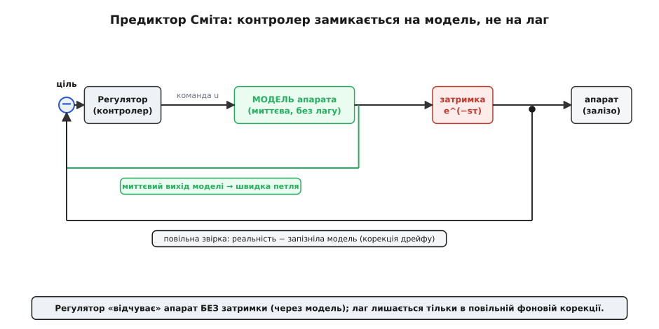
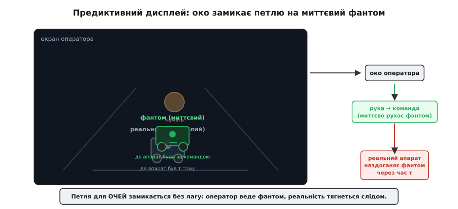

# 🧮 Запас по затримці й предиктивний дисплей: як обдурити лаг

У самій темі ми прийняли на віру одне речення: [затримка в петлі зворотного зв'язку з'їдає запас стійкості](topic:communications/latency-reliability) — корекція приходить, коли машина вже перелетіла ціль, і замість заспокоюватися контур розгойдується; поки добуток «швидкість × лаг» малий, оператор ще дає раду. Тут ми це речення **розберемо до кісток** — виведемо запас по затримці як число, яке можна порахувати, а тоді підемо далі, ніж просто «веди повільніше»: покажемо два інженерні способи винести затримку з петлі й один — найкрасивіший — обдурити її прямо в очах оператора. Наприкінці буде живий C-код предиктора й історія про те, як цим керували місячним ровером крізь секунду світлової затримки.

Одразу домовимось про мову. Коли контур розгойдується від лагу, у грі три величини: **τ** (тау, від грец. назви літери) — сама затримка в секундах; **ω** (омега) — частота коливання контуру в радіанах за секунду; і **φ** (фі) — фазове відставання, теж у радіанах. Усе виведення — це історія про те, як ці троє пов'язані.

## Затримка як фазове відставання: φ = ω·τ

Почнімо з питання, яке здається дивним: чому взагалі **час** (секунди затримки) перетворюється на **кут** (градуси відставання фази)? Адже стійкість контуру ми звикли міряти в градусах — запас по фазі. Звідки там градуси, якщо радіо просто спізнюється на мілісекунди?

Ось де ключ. Коли контур розгойдується, він робить це не як завгодно, а на цілком певній частоті — тій, на якій петля вже готова коливатися. Уяви, що ровер, ведений оператором, почав легенько нишпорити носом ліворуч-праворуч із періодом, скажімо, одна секунда. Це і є коливання контуру: рука коригує курс, машина реагує, оператор бачить перебір і коригує назад — і так по колу. Період T цього нишпорення задає частоту:

```
ω = 2π / T      [рад/с]
```

Тепер додаймо затримку. Хвиля курсу — це, по суті, синусоїда: курс гуляє туди-сюди як `sin(ω·t)`. Що робить чиста затримка τ із синусоїдою? Вона її **зсуває в часі** на τ — і більш нічого: форму не міняє, амплітуду не чіпає, лише пізніше. А зсунута в часі синусоїда — це та сама синусоїда, зсунута **по фазі**:

```
sin(ω·(t − τ)) = sin(ω·t − ω·τ)
```

Ось воно. Множник при t лишився ω, а всередині з'явився відняток **ω·τ** — і це відняток **фази**, тобто кут. Затримка τ секунд перетворилася на фазове відставання

```
φ = ω · τ      [рад]
```

І тут — уся суть, яку варто відчути шкірою. **Одна й та сама затримка дає різне відставання фази на різних частотах.** Секунда запізнення на повільному коливанні (ω мале) — це крихітний кут; та сама секунда на швидкому коливанні (ω велике) — величезний кут, хоч перевертай сигнал. Затримка сама собою нейтральна; небезпечною її робить **частота**, на якій контур пробує коливатися. Саме тому «веди повільніше» реально допомагає: повільніше водиш — нижча ω тих коливань, які ти збуджуєш, — менший кут з'їдає та сама затримка.

> 🔧 **Навіщо це.** Це пояснює, чому лаг б'є по керуванню, а не по телеметрії. Телеметрія — повільні, рідкі оновлення (мала ω), і навіть велика затримка дає там дрібний фазовий зсув: цифру на екрані запізнення майже не псує. А кермо — це швидка петля через руку оператора (велика ω), і там та сама затримка вже перевертає корекцію в антикорекцію. Один канал лаг терпить, другий — ні, і різниця саме в ω.

Цю лінійність варто уявити геометрично: на площині «частота → фазове відставання» рівняння φ = ω·τ — це **пряма з нахилу τ**, що виходить із нуля. Що більша затримка, то крутіша пряма; гранична затримка — це та пряма, яка саме на робочій частоті дістає межу запасу по фазі. Цю межу ми зараз і **виведемо** — і побачимо, звідки береться те число.

## Умова стійкості й τ_max = PM / ω_c: покрокове виведення

Тепер зберемо все в одну умову. Нам потрібні дві речі з [теорії стійкості контурів](root:embedded/loop-stability), яку ми проходили окремо: там ми ввели **частоту зрізу** ω_c і **запас по фазі** PM — саме на них тут усе тримається. Не переказуватимемо той матеріал, лише візьмемо готове й нагадаємо суть двома реченнями.

Перше — **частота зрізу** ω_c (англ. *crossover frequency*): та частота, на якій підсилення розімкненої петлі падає до одиниці. Простими словами — це і є частота, на якій контур «живе на межі» й найохочіше коливається; саме її ми й підставлятимемо як робочу ω. Друге — **запас по фазі** PM (англ. *phase margin*): скільки ще фазового відставання петля витримує на цій ω_c, перш ніж відставання дійде до фатальних 180° і корекція повністю обернеться на антикорекцію. PM — це подушка безпеки в градусах, яку контролер вже має **до** будь-якого радіо.

Логіка стійкості тепер вкладається у три рядки. Контур лишається стійким, поки повне фазове відставання на частоті зрізу не з'їдає всю подушку PM. Затримка додає до відставання свою частку φ = ω_c·τ. Отже:

```
крок 1 (умова):     ω_c · τ  <  PM        (лаг не має з'їсти весь запас)
крок 2 (межа):      ω_c · τ_max  =  PM     (рівність — точка втрати стійкості)
крок 3 (розв'язок): τ_max  =  PM / ω_c
```

Ось і вся формула запасу по затримці: **τ_max = PM / ω_c**. Стільки секунд лагу петля витримує, перш ніж почне розгойдуватися. Тільки будь обережний з одиницями: PM тут — у **радіанах**, не в градусах. Інженери зазвичай знають PM у градусах (кажуть «запас 45°»), тож переведи:

```
τ_max = PM[°] · (π / 180) / ω_c
```

Зверни увагу, який чесний і безжальний цей вираз. Чисельник PM — це «скільки запасу дав тобі контролер». Знаменник ω_c — «як швидко ти від нього вимагаєш реакції». Хочеш терпіти більший лаг — або нарощуй запас PM (роби контролер лінивішим, з більшим демпфуванням), або знижуй ω_c (веди повільніше, не смикай кермо різко). Іншого не дано: **добуток запасу по затримці на робочу частоту — це фіксована подушка PM**, і ти лише перерозподіляєш її між «швидко» і «терпляче».

### Worked-приклад: скільки лагу витримає петля ровера

**Умова.** Оператор веде ровер так, що контур «оператор + машина» має частоту зрізу ω_c = 3 рад/с (тобто найохочіше коливається з періодом близько двох секунд — типово для людини, що обережно коригує курс) і запас по фазі PM = 50°. Скільки затримки петля витримає до розгойдування, і чи вкладається в цей бюджет наш відеоканал на 50 мс, який ми рахували в темі?

```c
// Запас по затримці: τ_max = PM / ω_c  (PM у радіанах!)
float pm_deg = 50.0f;                       // запас по фазі, градуси
float w_c    = 3.0f;                         // частота зрізу, рад/с

float pm_rad  = pm_deg * 3.14159f / 180.0f;  // = 0.873 рад
float tau_max = pm_rad / w_c;                // = 0.873 / 3 = 0.291 с

// Порівняймо з наскрізним лагом петлі: відео 50 мс + команда назад ~50 мс
float tau_loop = 0.050f + 0.050f;            // = 0.100 с наскрізного лагу
float headroom = tau_max - tau_loop;         // = 0.291 − 0.100 = 0.191 с запасу
```

Виходить τ_max ≈ 291 мс — стільки лагу ця петля витримає на межі. Наш реальний наскрізний лаг ≈ 100 мс, тобто ми сидимо втричі нижче за межу, із запасом майже 200 мс. Оператор веде спокійно, розгойдування не буде. А тепер уяви, що ровер поїхав за обрій через стільникову мережу й лаг підскочив до 250 мс — ми впритул підповзли до 291 мс, і найменше пожвавлення керма (зростання ω_c) кине контур за межу. Ось коли число з формули перетворюється на відчутне «машину повело».

І ось чому наземне так прощає. Візьми ту саму формулу для коптера: щоб утриматися в повітрі, він змушений коригувати куди швидше — ω_c там не 3, а радше 15–30 рад/с. Підстав те саме PM = 50° → τ_max падає до 30–60 мс. Той самий лаг, що ровер не помічає, коптер уже виводить за межу стійкості. Різниця не в радіо — радіо однакове; різниця в тому, **як швидко машина мусить реагувати, щоб узагалі існувати**. Ровер може дозволити собі бути повільним, бо його безпечний стан — стояти; коптер не може, бо його безпечний стан вимагає активної роботи щомиті.

Цей зв'язок «оператор тримає певну ω_c і певний PM» — не наша вигадка, а перевірений експериментом закон. У 1960-х Роберт Мак-Руер (Robert McRuer) із колегами, вивчаючи пілотів у контурі керування літаком, вивів так звану **модель зрізу** (англ. *crossover model*): біля частоти зрізу передавальна функція розімкненої петлі «людина + машина» поводиться як ω_c·e^(−sτ)/s — тобто людина несвідомо **підлаштовує** свої дії так, щоб петля мала стабільний нахил і сталу ω_c, хоч би якою була машина, а власна реакція людини входить у цю петлю саме як чиста затримка e^(−sτ) з ефективним τ близько 0.2–0.3 с (нервово-м'язовий лаг плюс час на осмислення). *(Усталений результат теорії ручного керування, багаторазово підтверджений; τ людини тут — типовий діапазон, а не константа.)* Іншими словами, наша формула τ_max = PM/ω_c описує не лише машину — вона описує й **людину за пультом**, і саме тому додаткова затримка радіо так прямо додається до вже наявної затримки самого оператора.

## Затримка у передавальній функції: чому e^(−sτ) незручний

Досі ми говорили про фазу. Але щоб **проєктувати** контролер, а не лише оцінювати межу, затримку треба записати в мові передавальних функцій — тих самих дробів від s, якими описують ланки контуру. І тут чиста затримка виявляється на диво незручним звіром.

Затримка на τ секунд у мові Лапласа — це множник

```
e^(−sτ)
```

Красиво й точно — але це **не дріб**, а експонента, ще й від комплексного s. А майже вся інженерія контурів — методи налаштування, критерії стійкості, автоматичні синтезатори регуляторів — уміє працювати тільки з **раціональними** передавальними функціями, тобто відношеннями многочленів (полюси й нулі, скінченний порядок). Експонента e^(−sτ) має, грубо кажучи, нескінченно багато полюсів; вона ламає весь звичний апарат. Тому затримку доводиться **наближати раціональним дробом** — і найпоширеніший спосіб зробити це назвали ім'ям математика.

### Апроксимація Паде

**Апроксимація Паде** (Padé approximation, на честь Анрі Паде, фр. Henri Padé, який дослідив ці наближення наприкінці XIX ст.) — це наближення функції відношенням двох многочленів, підібраних так, щоб їхній розклад у ряд збігався з розкладом самої функції до якомога вищого порядку. *(Метод усталений, названий за Паде; тут — його стандартне застосування до затримки.)* Для затримки найпростіша, першого порядку, виглядає так:

```
              1 − sτ/2
e^(−sτ)  ≈  ─────────────
              1 + sτ/2
```

Придивімося, чому саме такий дріб, а не якийсь інший — тут ховається гарна ідея. По-перше, порахуй його при s=0 (стала складова, ω=0): чисельник і знаменник дорівнюють одиниці, дріб = 1, і e^(−0·τ) = 1 теж. Збігається: на нульовій частоті затримка нічого не робить, і наближення це поважає. По-друге — і це головне — обчисли **модуль** цього дробу для будь-якої чисто уявної s = jω. Чисельник 1 − jωτ/2 і знаменник 1 + jωτ/2 — комплексно спряжені, у них **однаковий модуль**, тож їхнє відношення по модулю рівно **одиниця** на всіх частотах. А чиста затримка e^(−jωτ) теж має модуль рівно одиницю — вона ж лише зсуває фазу, амплітуду не чіпає. Отже дріб Паде відтворює головну фізичну властивість затримки — «амплітуду не чіпаю, лише кручу фазу» — **точно**, а не приблизно. Наближеною лишається тільки сама фаза: дріб дає фазу −2·arctan(ωτ/2), і біля малих ω вона майже точно збігається з −ωτ (тим самим φ = ω·τ, з якого ми починали), а на високих частотах потихеньку розходиться.

Ось де межа цього трюку, і її треба знати. Наближення чесне лише **на низьких частотах** — там, де ωτ мале. Хочеш точніше на вищих — бери Паде вищого порядку (з квадратами й кубами s), але не захоплюйся: дуже високий порядок дає полюси, що збиваються в тісну купу й стають хворобливо чутливими до найменшої похибки, тож на практиці порядок вище десятого не беруть. Для контуру ровера вистачає першого-другого: нам треба, щоб модель ловила поведінку саме там, де контур коливається, а це низькі частоти.

> 🔧 **Навіщо це.** Практична користь Паде — суто інструментальна: він дозволяє **порахувати межу стійкості автоматично**. Записав контур ровера як раціональну передавальну функцію, вставив у нього дріб Паде замість e^(−sτ) — і будь-який стандартний метод (корені характеристичного рівняння, діаграма Найквіста, автосинтез регулятора) враз починає бачити затримку й видає ту саму τ_max, що ми виводили руками, але вже для складного контуру з кількома ланками, де олівцем не порахуєш. Це той місток, яким жива фізична затримка заходить у мертвий формалізм проєктування.

## Предиктор Сміта: винести затримку за контур

Наблизити затримку — це навчитися її **бачити** в моделі. Але є прийом сміливіший: узагалі **прибрати** її з контуру, щоб регулятор працював так, ніби лагу нема. Цю ідею 1957 року подав О. Дж. М. Сміт (O. J. M. Smith), і вона й досі — найвідоміший спосіб боротьби з мертвим часом у контурах керування. *(Усталено; авторство й дата задокументовані.)* Називають її **предиктором Сміта** (Smith predictor).

Ідея — майже фокус, і варто відчути її логіку, а не запам'ятати схему. Проблема лагу в тому, що регулятор бачить наслідки своєї команди **пізно**: скомандував — а результат на давачі з'явиться лише за τ, тож регулятор або чекає й гальмує, або нетерпляче перекладає ще, а тоді ловить перебір. Що, якби в регулятора була **модель** машини — досить точна, щоб миттєво передбачити, що команда зробить? Тоді хай регулятор замикається не на запізнілий реальний давач, а на **миттєвий вихід моделі**: скомандував — модель одразу каже, куди машина піде, і регулятор коригується без лагу, ніби затримки нема зовсім.


*Регулятор бачить не запізнілий реальний вихід, а миттєвий вихід МОДЕЛІ апарата (зелена швидка петля) — і тому працює так, ніби затримки нема. Реальне залізо, звісно, все одно відповідає із затримкою e^(−sτ); цю неминучу правду ловить друга, повільна петля: вона звіряє реальність із запізнілою моделлю й лише поволі підправляє дрейф. Затримка нікуди не зникла — її винесли зі швидкого контуру в повільну фонову корекцію.*

Але тут ховається чесний виверт, без якого фокус був би шахрайством. Якби регулятор замкнувся **тільки** на модель, він би повністю відірвався від реальності: модель ніколи не ідеальна, машина трохи не така, ґрунт трохи інший, і помилка моделі накопичувалася б, аж поки ровер поїхав би зовсім не туди, а регулятор цього б і не помітив. Тому Сміт додає **другу петлю** — повільну корекцію. Вона бере реальний, запізнілий вихід машини й віднімає від нього **так само запізнілу** модель (ту саму модель, пропущену через ту саму затримку). Якщо модель ідеальна — ця різниця нуль, і друга петля мовчить. Якщо модель бреше — різниця показує, **наскільки** бреше, і поволі підправляє. Отже:

```
швидка петля:   регулятор ⟵ миттєва модель          (працює без лагу)
повільна петля: корекція  ⟵ реальність − запізніла модель   (ловить дрейф моделі)
```

Краса тут ось у чому: затримка не зникла — це неможливо, фізику не обдуриш, реальний сигнал усе одно приходить пізно. Але її **винесли** зі швидкого контуру, який тепер тримає стійкість без огляду на лаг, у повільний контур корекції, де лаг уже не страшний, бо там нічого швидко не коливається. Ми ніби розрізали одну заражену лагом петлю на дві: одну швидку й здорову, другу повільну й терплячу.

І тут же — головна пастка, чому предиктор Сміта не панацея. Уся конструкція тримається на **точності моделі**. Дав погану модель — і швидка петля впевнено замикається на брехню, а повільна корекція не встигає це виправити; на межі це навіть **дестабілізує** контур замість стабілізувати. Тому для ровера в полі, де ґрунт непередбачуваний і модель руху груба, чистий предиктор Сміта в контурі приводу застосовують обережно. Зате його **ідея** — «замкни оператора на миттєву модель, а реальність хай наздоганяє» — лягла в основу набагато практичнішого й наочнішого прийому, до якого ми нарешті дійшли.

## Предиктивний дисплей: фантомний робот

Ось кульмінація, і вона елегантна до захвату. Дотепер ми обдурювали лаг у математиці контуру. А тепер обдуримо його **прямо в очах оператора** — бо, зрештою, у телекеруванні найповільніша й найважливіша петля проходить не через кремній, а через **людину**: око бачить відео, мозок вирішує, рука рухає стік. Якщо відео запізнюється на τ, то й ця людська петля розгойдується рівно з тієї ж причини — φ = ω·τ, тепер уже для контуру «оператор + запізніле відео».

Ідею подав Антал Бейці (Antal Bejczy) — угорський інженер, що втік з Угорщини після придушеного повстання 1956 року, здобув докторат у Норвегії й потрапив до Лабораторії реактивного руху NASA (JPL), де очолив програму телеробототехніки. Разом із Воном Кімом (Won Kim) і Стівеном Венемою (Steven Venema) він 1990 року представив роботу «Фантомний робот» (The Phantom Robot: Predictive Displays for Teleoperation with Time Delay). *(Усталено: доповідь на IEEE ICRA, Цинциннаті, 1990; автори й назва задокументовані.)*

Ідея така. На екрані оператора малюють **два** апарати. Один — реальний, знятий камерою: він показує, де ровер був **τ секунд тому**, бо це запізніле відео. Другий — **фантом**: намальована комп'ютером модель того самого ровера, яка слухається стіка **миттєво, без затримки**. Оператор веде очима **фантом**, а не запізнілу тінь. І в ту саму мить, коли рука штовхає стік уперед, фантом на екрані зрушує вперед — петля для очей замикається **без лагу**, бо фантом малює комп'ютер тут, локально, не чекаючи радіо. Реальний ровер, звісно, зрушить лише за τ — але це вже не турбує оператора, бо він орієнтується по фантому, а реальність слухняно наздоганяє фантом через час τ.


*На екрані два образи: блідий реальний ровер (де апарат був τ тому, із запізнілого відео) і яскравий фантом (де апарат буде за поточною командою, намальований миттєво). Око оператора замикає петлю на фантом — і лаг для очей зникає: рука рухає фантом без затримки, а реальне залізо тягнеться слідом і за час τ стає на місце фантома. Затримка лишилась у світі, але вийшла з контуру сприйняття.*

Помічаєш, що це **той самий предиктор Сміта**, лише петлю замкнено не через регулятор, а через **зорову систему людини**? Фантом — це «миттєвий вихід моделі», на який замикається оператор; запізніле відео — це «реальність», що приходить пізно; а звірка «фантом vs реальний апарат», яку робить око, — це та сама повільна корекція, що ловить дрейф моделі. Бейці, по суті, узяв ідею Сміта 1957 року й переставив її з контуру автоматики в контур людського сприйняття. І та сама пастка діє: фантом корисний рівно настільки, наскільки точна його модель руху — якщо намальований ровер повертає не так, як реальний, оператор поведе фантом красиво, а залізо зіб'ється з курсу.

Канонічний крайній випадок, задля якого це все й народжувалося, — керування апаратом на **іншому небесному тілі**, де затримка вже не мілісекунди радіо, а **фізична межа швидкості світла**. Від Землі до Місяця світло йде близько 1.28 секунди в один бік, тобто повний оберт «команда туди — картинка назад» — понад 2.5 секунди, і жоден буфер цього не скоротить: це відстань, поділена на швидкість світла. Саме крізь таку затримку 1970 і 1973 року вели місячні ровери «Луноход-1» і «Луноход-2» (сам апарат будувало конструкторське бюро Лавочкіна, а ходову частину — самохідне шасі — спроєктувала окрема команда Олександра Кемурджяна в ленінградському інституті ВНДІТрансмаш). Кемурджян — інженер вірменського роду, народжений 1921 року у Владикавказі. *(Усталено: дати польотів, ~2.5 с наскрізної затримки, п'ятеро операторів; етнічність і місце народження Кемурджяна уточнено за джерелами, а не за замовчуванням «радянський».)* Екіпаж із п'яти операторів на Землі вів машину по низькокадровому телевізійному зображенню, що оновлювалося раз на кілька секунд, і мусив **подумки передбачати** кожен рух наперед — фактично працюючи живим предиктором: команду давали не туди, де ровер видно на екрані, а туди, де він **буде**, поки картинка долетить. Предиктивний дисплей — це якраз спроба зняти цей нелюдський тягар із голови оператора й доручити передбачення комп'ютеру: хай фантом малює «де він буде», а людина просто веде фантом.

> 🔧 **Навіщо це.** Для наземного ровера в межах кілометрів світлова затримка мізерна, і фантом заради неї не потрібен. Але щойно ровер іде далеко за обрій через стільникову мережу, де лаг стрибає до сотень мілісекунд і **гуляє**, предиктивний дисплей стає найдешевшим способом повернути оператору плавне керування: увесь мережевий лаг лишається в тому, як реальне відео наздоганяє фантом, а рука оператора весь час веде миттєвий фантом і не відчуває розгойдування. Це не екзотика для космосу — це реальний інструмент для будь-якого телекерування, де відеоканал став надто повільним, щоб замкнути петлю очима безпосередньо.

## Живий предиктор положення на C

Зведімо теорію в код — найпростіший предиктор, що малює фантом ровера. Він і є та «модель», на яку замикається око: бере останню відому позицію з (запізнілої) телеметрії й **проганяє вперед** на час затримки за поточною командою швидкості й повороту. Це та сама [кінематика диференціального приводу](root:embedded/differential-drive-kinematics), якою ми рахуємо рух ровера, лише застосована не «зараз», а «на τ уперед».

**Умова.** З телеметрії щойно прийшла позиція ровера (x, y, курс θ), але вона застаріла на `latency` секунд. Оператор тримає команду: лінійна швидкість v та кутова ω_turn. Де намалювати фантом — де ровер опиниться, коли команда «долетить» і відпрацює свій лаг?

```c
#include <math.h>

typedef struct {
    float x;      // м, положення на площині
    float y;      // м
    float theta;  // рад, курс (0 = вздовж осі X)
} pose_t;

// Прогнати модель ровера вперед на dt секунд за командою (v, w_turn).
// v      — лінійна швидкість, м/с (уперед додатна)
// w_turn — кутова швидкість повороту, рад/с (ліворуч додатна)
// Інтегруємо простим кроком Ейлера — для малих dt (частки секунди) цього досить.
static pose_t rover_predict(pose_t p, float v, float w_turn, float dt) {
    const float STEP = 0.02f;                 // крок інтегрування 20 мс
    for (float t = 0.0f; t < dt; t += STEP) {
        float h = (dt - t < STEP) ? (dt - t) : STEP;   // останній крок — залишок
        p.x     += v * cosf(p.theta) * h;     // рух уздовж поточного курсу
        p.y     += v * sinf(p.theta) * h;
        p.theta += w_turn * h;                // курс повертається
    }
    // нормалізуємо курс у (−π, π], щоб не накопичувати оберти
    while (p.theta >  3.14159265f) p.theta -= 6.28318531f;
    while (p.theta < -3.14159265f) p.theta += 6.28318531f;
    return p;
}

// Куди малювати ФАНТОМ: беремо запізнілу позицію з телеметрії
// й проганяємо її вперед рівно на затримку каналу.
pose_t phantom_pose(pose_t last_known, float v, float w_turn, float latency_s) {
    return rover_predict(last_known, v, w_turn, latency_s);
}
```

Кілька рішень тут не випадкові, і варто їх побачити. Інтегруємо **малими кроками** `STEP`, а не однією формулою «шлях = швидкість × час»: поки ровер повертає (w_turn ≠ 0), курс міняється **дорогою**, і рухатися треба вздовж кривої, а не по прямій — дрібний крок цю кривину ловить, груба формула зрізала б кут. Останній крок беремо **залишком** `dt − t`, щоб проганяти рівно на `latency`, ні на мілісекунду більше. І головне — цей предиктор чесний рівно настільки, наскільки чесна модель: реальний ровер буксує, ґрунт неоднорідний, колеса прослизають, тож фантом і реальність поволі розходяться — і саме тому фантом ніколи не лишають самого, а **безперервно осаджують** свіжою телеметрією: кожен новий запізнілий кадр позиції — це `last_known`, від якого прогін починається наново. Ось вона, повільна корекція Сміта, у живому коді: швидка петля — фантом малюється щотакту без лагу; повільна — кожне оновлення телеметрії стягує фантом назад до реальності.

Пройдімо всю нитку ще раз, коротко. Затримка τ перетворюється на фазове відставання φ = ω·τ, і саме тому б'є по швидких петлях (кермо), а не по повільних (телеметрія). Контур витримує її, поки лаг не з'їв запас по фазі: **τ_max = PM / ω_c** — і ця ж формула, через модель зрізу Мак-Руера, описує самого оператора. Щоб затримку **проєктувати**, її наближають раціональним дробом Паде, який точно зберігає «амплітуду не чіпаю, лише кручу фазу». Щоб її **прибрати** з контуру — замикають регулятор на миттєву модель (предиктор Сміта), лишивши лаг у повільній корекції. А щоб обдурити її **в очах людини** — малюють миттєвий фантом поверх запізнілого відео (предиктивний дисплей Бейці), і оператор веде фантом, поки реальність наздоганяє. Затримку не можна знищити — фізику не обдуриш. Але її можна винести туди, де вона вже не розгойдує петлю: у повільну корекцію, за контур, за межі того, що бачить око.
