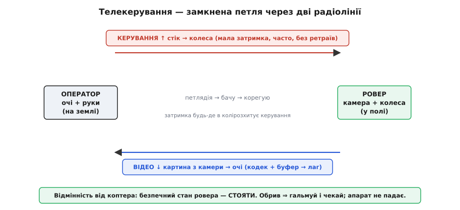
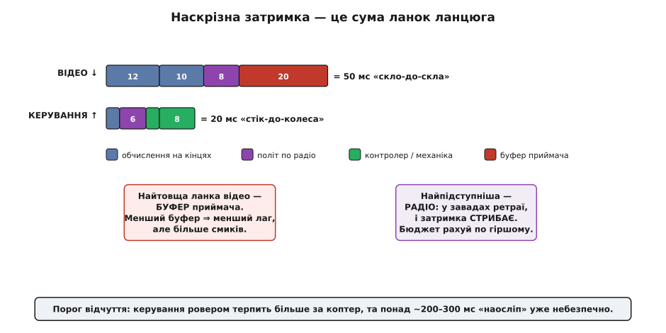
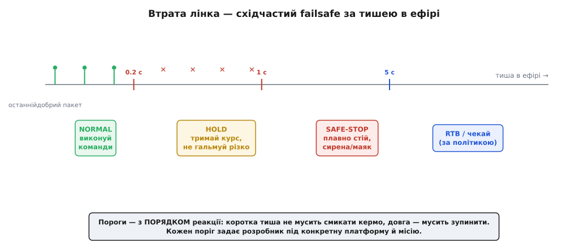

# Телекерування: затримки, відеоканал, втрата лінка

Ми вже зібрали ровер як машину: [шасі й привід](root:embedded/ugv-platform), [кінематику диференціального приводу](root:embedded/differential-drive-kinematics), логіку кермування. Тепер посадімо за нього людину — але не поряд, а за кілометр, з пультом і екраном. Це **телекерування** (від грец. *tēle* — «далеко», + керування): оператор веде машину, якої не торкається й часто навіть не бачить очима, а лише через камеру. Слово молоде — «телеоператор» як термін закріпили в 1960-х для маніпуляторів, що працювали з радіоактивним матеріалом за товстим склом, — але сама ідея старша за радіо: [перше судно на радіокеруванні Нікола Тесла показав ще 1898-го](root:embedded/teleoperation-latency/hist-teleautomaton.md), і вже тоді він мусив відповісти на питання, яким ми закінчимо цю статтю: що робить машина, коли перестає тебе чути?

Здавалося б, керувати ровером здалеку — те саме, що керувати ним із сідла, лише дроти довші. Насправді довгі «дроти» міняють усе. Між твоєю рукою й колесом тепер стоїть радіо, а радіо додає **час** і час від часу **мовчить**. Уся ця стаття — про три наслідки цієї відстані: **затримку** (усе відбувається пізніше, ніж ти думаєш), **відеоканал** (єдине твоє вікно в те, що там коїться, і воно теж запізнюється) і **втрату лінка** (рано чи пізно ефір змовкне — і машина має знати, що робити сама).

## Оператор у петлі: чому наземне легше за повітряне

Почнімо з головного зсуву в голові. Керуючи ровером здалеку, ти не «даєш команди» — ти **замикаєш петлю зворотного зв'язку** власними очима й руками. Механізм той самий, що ми розбирали для [стійкості контурів](root:embedded/loop-stability): дав команду → машина зреагувала → побачив результат → скоригував. Тільки тепер у цьому колі два довгі радіопрольоти: команда летить угору, картинка — вниз.


*Телекерування — це не «пульт → ровер», а замкнена петля через дві окремі радіолінії. Угору йде керування (стік → колеса): мала затримка, часто, без перевідправлень. Униз іде відео (камера → очі): якісне, та з лагом кодека й буфера. Затримка будь-де в цьому колі однаково розхитує керування. Ключова відмінність від коптера — безпечний стан ровера є статичним: зупинитися.*

Ці дві лінії — не вигадка цієї теми, а знайомі нам **ролі радіозв'язку апарата**, які ми вже розкладали по поличках: [керування, телеметрія й відео — окремі канали з різними вимогами](topic:sys-dron/control-telemetry). Керування — це висхідний канал (*uplink*), йому потрібна низька затримка й свіжість; відео — низхідний (*downlink*), йому потрібна смуга. Тут вони працюють у парі й замикають одну петлю через оператора.

І ось де наземне докорінно легше за повітряне — настільки, що це визначає всю подальшу інженерію. **Безпечний стан ровера статичний.** Коптер, який перестав слухатися, падає: гравітація не робить пауз, безпечної «нейтральної» дії в нього немає — тільки активно втриматися в повітрі або сісти. Ровер, який перестав слухатися, просто **стоїть**. Відпустив газ — колеса спинилися, і машина в безпеці сама собою. Ця, здавалося б, дрібниця перевертає бюджет ризику: там, де для коптера кожна зайва мілісекунда затримки й кожна секунда мовчання — крок до аварії, для ровера це переважно лише незручність. Ми повсякчас цим користатимемось: більшість «страшних» на повітрі проблем на землі мають дешевий і безпечний вихід — **гальмуй і чекай**.

> 🔧 **Навіщо це.** Перш ніж проєктувати телекерування, спитай себе: який у моєї машини безпечний стан? Для ровера це «стоп», для човна — «дрейф до берега чи малий хід проти течії», для маніпулятора — «завмерти й тримати». Уся логіка втрати лінка, яку ми напишемо нижче, — це просто «привести машину в її безпечний стан і чекати». Помилишся зі станом — і failsafe зробить гірше, ніж бездіяльність.

## Затримка: збери весь ланцюг в одне число

Тепер до першого наслідку відстані. Що саме запізнюється й на скільки? [Чому запізнення в петлі небезпечне — ми вже бачили в деталях](topic:com-transport/latency-reliability): затримка з'їдає запас стійкості, корекція приходить, коли машина вже перелетіла ціль, і замість заспокоюватися контур розгойдується. Не переказуватимемо той механізм — приймемо його й зробимо наступний, інженерний крок: **порахуємо затримку як одне число** для нашого ровера.

Головна помилка новачка — думати, що затримка «в радіо». Насправді радіо — лише одна ланка, і **час додається на кожній**. Розкладімо обидва прольоти петлі. Керування, «від стіка до колеса»: зчитати положення стіка → упакувати й віддати в радіо → політ кадру по ефіру → приймач розпакував → цикл прошивки ровера підхопив → драйвер розігнав мотор, машина фізично зрушила. Відео, «від скла до скла» (англ. *glass-to-glass* — від скла об'єктива до скла екрана): захопити кадр із сенсора → стиснути кодеком → пакети в ефір → зібрати на землі → декодувати → намалювати на екрані. Кожна стрілка — це мілісекунди, і повна затримка петлі — їхня **сума**.


*Наскрізна затримка — сума ланок ланцюга, а не «затримка радіо». Відео «скло-до-скла»: захоплення + кодек + канал + буфер приймача — і найтовща ланка тут часто саме буфер. Керування «стік-до-колеса» коротше: обчислення на кінцях + радіо + цикл контролера + інерція механіки. Радіо — найпідступніша ланка: у завадах з'являються перевідправлення, і затримка стрибає, тож бюджет рахують по гіршому випадку.*

Порахуймо відеопроліт для типового цифрового лінка на ровері. Числа беремо реальні: сучасні цифрові системи дають «скло-до-скла» приблизно [14–40 мс](root:embedded/teleoperation-latency/hist-teleautomaton.md) залежно від системи й режиму, і левову частку в бюджеті нерідко з'їдає не радіо, а **буфер приймача**.

**Умова.** Ровер шле HD-відео цифровим лінком: захоплення кадру 12 мс, стиск [кодеком](root:embedded/mjpeg-vs-h264) 10 мс, політ по каналу 8 мс, [буфер приймача](topic:com-signal/jitter-buffer) 20 мс. Скільки покаже екран — і чи встигне оператор об'їхати перешкоду, яку ровер уже майже дістав на швидкості 2 м/с?

```c
// Наскрізна затримка відеоканалу («скло-до-скла»), мілісекунди
int t_capture = 12;   // сенсор → кадр у памʼяті
int t_codec   = 10;   // стиск одного кадру
int t_channel = 8;    // пакетизація + політ по радіо
int t_buffer  = 20;   // буфер джитера на приймачі

int t_glass = t_capture + t_codec + t_channel + t_buffer;   // = 50 мс

// Скільки ровер проїде «наосліп» за час, поки кадр летить до очей:
float v = 2.0f;                       // м/с
float blind_m = v * t_glass / 1000.0f;   // = 2.0 · 0.050 = 0.10 м
```

Півметра буфера тут немає — вийшло 50 мс, і за цей час ровер на 2 м/с проходить **10 см наосліп**: те, що ти бачиш на екрані, машина проїхала десяту частку секунди тому. Плюс стільки ж на зворотний проліт команди — і сумарно між «побачив перешкоду» й «колеса почали гальмувати» набігає ближче до сотні мілісекунд і чверть метра шляху. На кроковій швидкості — дрібниця; на повній — уже відстань, на якій вирішується, зачепиш ти пеньок чи ні.

Звідси два практичні правила, які варто закарбувати. Перше: **найтовщу ланку шукай не в радіо, а в буфері** — саме він найчастіше домінує, і саме ним найлегше керувати (менший буфер — менший лаг, але, як ми знаємо з [теми про буфер джитера](topic:com-signal/jitter-buffer), ціною плавності: дрібніший запас частіше не встигає за відстаючими пакетами, і картинка сіпається). Друге: **радіо рахуй по гіршому випадку**, бо це єдина ланка, чия затримка **стрибає**. У чистому ефірі кадр проскакує швидко; на межі дальності чи у завадах починаються перевідправлення, і та сама лінія, що щойно давала 8 мс, дає 40. Проєктувати треба під поганий ефір, а не під лабораторний.

А тепер згадаймо про наземну поблажку. Для коптера навіть 50 мс — це вже помітно гірша керованість, а понад 100 мс літати важко. Ровер терпить значно більше: на кроковій швидкості можна вести машину й із затримкою в кілька десятих секунди — просто ведеш обережніше, з запасом на гальмування. Груба межа: поки добуток «швидкість × повна затримка» дає **менше за пів свого гальмівного шляху**, оператор дає раду; коли зрівнялося — час скидати швидкість. Це не магічне число, а той самий здоровий глузд, що й у водія в тумані: не їдь швидше, ніж бачиш і встигаєш спинитися.

## Відеоканал: єдине вікно, і воно теж запізнюється

Затримку ми порахували; тепер придивімося до самого відео — бо для оператора ровера це не «одна з телеметрій», а **єдине вікно** в те, що там коїться. Втратив картинку — і ти ведеш машину наосліп, навіть якщо керування ще працює. Тому відеоканал заслуговує окремої розмови: не як його фізично передати (це ми вже проходили), а який обрати під наземну машину й де в нього слабкі місця.

[Як біти відео фізично долітають з борту на землю — ми розбирали докладно](topic:com-transport/video-transmission): є дві геть різні за духом дороги. **Аналогове радіо** кладе відеохвилю просто на несучу — без стиску, без пакетів; звідси майже нульова затримка (менш як 10–30 мс) і плавне згасання картинки на краю дальності, але груба роздільність і шум. **Цифрова мережа** спершу [стискає кадр](root:embedded/mjpeg-vs-h264) і ріже на пакети — звідси HD, шифрування й можливість пустити відео хоч в інтернет, але ціною лагу кодека й буфера та різкого «розсипання» картинки, коли пакетів не стало. Не переказуватимемо ці механізми — застосуймо їх до ровера.

Для наземної машини вибір інший, ніж для гоночного коптера. Гонщик обирає аналог або найшвидшу цифру, бо йому критичні кожні 10 мс на швидкості 120 км/год. Роверу поспіх не потрібен — йому потрібні **дальність, стабільність і, дуже часто, вихід за пряму видимість**. Звідси три типові рішення, і кожне відповідає на своє питання.

Якщо ровер працює **в межах видимості чи трохи за нею** — цифровий радіолінк точка-точка (борт ↔ пульт напряму). Це золота середина: HD-картинка, помірна затримка, дальність кілометри. Якщо потрібне **гранично просте й дешеве рішення** з нульовим лагом, а якість вторинна (скажімо, ровер-розвідник, де важливо «бачити хоч щось миттєво») — старий добрий аналог іще живий. А якщо ровер має їхати **далеко за обрій** — у сусідній квартал, кар'єр, поле, — тоді відео пускають через **стільникову мережу** (LTE/5G → інтернет), і машина стає керованою хоч з іншого міста. Але тут з'являється нова, найпідступніша затримка — **мережева**: пакети йдуть через базові станції й сервери провайдера, маршрут щоразу інший, і до нашого бюджета «скло-до-скла» додаються десятки, а в поганому покритті й сотні мілісекунд, які ще й **гуляють**. Саме проти цього гуляння й стоїть [буфер джитера](topic:com-signal/jitter-buffer), який ми вже рахували: він вирівнює нерівний приплив ціною сталого лагу, і на стільниковому каналі його доводиться робити глибшим — тобто миритися з більшою затримкою заради того, щоб картинка не розсипалась.

> 🔧 **Навіщо це.** Вибір відеоканалу — це вибір, чим ти готовий пожертвувати. Хочеш дальність за обрій — плати мережевою затримкою й залежністю від покриття (пропало LTE — пропало відео). Хочеш нульовий лаг — плати якістю (аналог). Хочеш HD зблизька — бери цифровий лінк, але пам'ятай, що на краю дальності він не «тьмяніє», як аналог, а **обривається сходинкою**: щойно був чіткий кадр — і раптом стоп-кадр чи «квадратики». Для оператора це гірше за поступове згасання, бо втрату видно не заздалегідь, а вже фактом. Тому на цифрі критично мати **окремий, живучіший канал телеметрії**, який попередить про падіння сигналу до того, як зникне картинка.

І ось чому відео й керування майже завжди **розводять на різні лінії** — ми вже знаємо цей принцип із [ролей радіозв'язку](topic:sys-dron/control-telemetry), але на ровері він набуває прямого сенсу виживання. Уяви, що керування й відео йдуть одним каналом. Забився ефір завадою — і ти втратив **усе одразу**: і картинку, і кермо. А тепер розведімо: відео — по товстому цифровому каналу (жадібному до смуги, але не критичному), керування — по вузькому, живучому [RC-лінку](topic:sys-dron/rc-link) з іншою частотою й скромними вимогами. Тепер втрата відео лишає тобі кермо (можна обережно спинити машину «за приладами» — по телеметрії), а живучий канал керування тримається там, де жирне відео давно б обірвалося. Розділення каналів — це не акуратність, а **розділення режимів відмови**, щоб одна біда не забирала все.

## Втрата лінка: failsafe, який знає, що робити сам

І ось ми дійшли до питання, з якого починав ще Тесла. Радіо **неминуче замовкне** — не «якщо», а «коли». [Втрати пакетів — природа радіоканалу](topic:com-transport/latency-reliability): багатопроменеве завмирання топить окремі пакети, спотворене відкидає CRC, а на межі дальності потік просто уривається. Ми вже знаємо стратегію для керування: [не перевідправляти](topic:com-transport/latency-reliability) — команди йдуть часто, загубився кадр, за мить прийде свіжіший; а коли не приходить нічого — вступає **failsafe** (англ. *fail-safe* — «безпечний за відмови»). Тепер напишімо цей failsafe для ровера як живий код.

Насамперед — **як машина взагалі розуміє, що лінк мертвий?** Тиша неоднозначна: один загублений кадр — це норма, а не аварія. Механізм ми вже бачили на прикладі [MAVLink із землі](root:embedded/mavlink-from-ground) — це **серцебиття** (*heartbeat*): пульт (або наземна станція) шле короткий пакет ритмічно, скажімо десять разів на секунду, а ровер тримає **сторожовий таймер** (*watchdog*), який щоразу скидається на прихід. Прийшло серцебиття — таймер обнулився, машина спокійна. Серцебиття немає — таймер тікає. Перевищив поріг — лінк вважаємо втраченим. Це той самий підхід, що й [сторожовий таймер, який ми ставили на наземну станцію](root:embedded/mavlink-from-ground/proj-heartbeat-watchdog.md), лише тепер він стереже канал від імені самої машини.

Але — і це головна ідея всієї теми — **реакція на тишу не двійкова**. Було б грубо й небезпечно: щойно пропустили поріг — і одразу різко в стоп. Тиша буває різної тривалості, і розумна відповідь теж має бути **східчастою**.


*Втрата лінка — східці в часі, а не «є звʼязок / нема». Поки тиша коротка (частки секунди) — тримай останній курс, різко нічого не роби: імовірно, це просто збій кількох кадрів. Довша тиша — плавно зупинись і привернь увагу (сирена, маяк). Ще довша — активна дія за політикою місії: чекати оператора чи повертатися. Кожен поріг задає розробник під конкретну платформу.*

Логіка сходинок проста й уся випливає з наземної поблажки «безпечний стан — стоп». **Коротка тиша** (кількасот мілісекунд) — найімовірніше, просто провалилося кілька кадрів поспіль; смикати кермо було б гірше, ніж нічого не робити, тож ровер **тримає останню команду** й чекає. **Довша тиша** (секунда й більше) — лінк справді впав; машина **плавно зупиняється** (плавно, а не юзом, щоб не втратити керованість і не перекинутись) і **привертає увагу** — вмикає сирену чи маяк, бо стоїть тепер сама. **Зовсім довга тиша** (кілька секунд) — час на активну політику: або й далі чекати оператора на місці (для ровера це цілком безпечно — він же просто стоїть), або, якщо так задано місією й машина вміє, самостійно **повертатися до точки старту** (*RTB, return to base*) чи до місця, де був зв'язок.

Запишімо це станами. Ось скелет failsafe-автомата, який крутиться в головному циклі прошивки ровера:

```c
// Пороги тиші в мілісекундах — під конкретну платформу
#define T_HOLD_MS   300u    // коротша тиша: тримати курс
#define T_STOP_MS  1000u    // довша: плавний стоп + маяк
#define T_RTB_MS   5000u    // зовсім довга: політика місії

typedef enum { LINK_NORMAL, LINK_HOLD, LINK_STOP, LINK_RTB } link_state_t;

// silent_ms — скільки триває тиша; оновлює watchdog за heartbeat.
// Повертає, ЩО робити приводу цього такту.
link_state_t link_failsafe(uint32_t silent_ms) {
    if (silent_ms < T_HOLD_MS)  return LINK_NORMAL;  // ефір живий: слухай оператора
    if (silent_ms < T_STOP_MS)  return LINK_HOLD;    // тримай останній курс, не смикай
    if (silent_ms < T_RTB_MS)   return LINK_STOP;    // плавно спинись, увімкни маяк
    return LINK_RTB;                                 // за політикою: чекай або вертайся
}

// Застосування в головному циклі приводу:
void drive_tick(uint32_t now_ms, uint32_t last_hb_ms) {
    uint32_t silent = now_ms - last_hb_ms;           // тиша від останнього серцебиття
    switch (link_failsafe(silent)) {
        case LINK_NORMAL: apply_operator_cmd();      break;  // звичайне телекерування
        case LINK_HOLD:   hold_last_cmd();           break;  // не чіпати кермо
        case LINK_STOP:   ramp_to_stop(); beacon_on(); break; // плавно в нуль + маяк
        case LINK_RTB:    ramp_to_stop(); mission_rtb(); break;
    }
}
```

Придивись до кількох рішень у цьому коді, бо вони не випадкові. `ramp_to_stop()`, а не «мотори в нуль» — різкий обрив тяги на ходу означає юз і втрату керованості, тож швидкість **скидають рампою**, за кілька десятих секунди. `hold_last_cmd()` у стані `HOLD` навмисне **нічого не міняє**: короткий провал зв'язку — не привід перекладати кермо, бо через мить, найімовірніше, прийде свіжа команда, і смик був би зайвим. `beacon_on()` у стані `STOP` — тому що ровер тепер **нерухома перешкода** посеред дороги, про яку варто попередити людей довкола. І весь автомат — **однобічний за напрямком тривоги**: він піднімається по сходинках, поки тиша росте, і миттєво падає назад у `NORMAL`, щойно прийшло перше серцебиття (тиша обнулилась). Жодного гістерезису тут не треба — повернення зв'язку завжди безпечне.

> 🔧 **Навіщо це.** Пороги `T_HOLD`, `T_STOP`, `T_RTB` — не константи «з голови», а рішення під **конкретну машину**. Важкий повільний ровер може дозволити довший `HOLD` (він і так не набере небезпечної швидкості за пів секунди); легкий швидкий — навпаки, коротший, бо за ту саму тишу проїде далі. `T_RTB` взагалі диктує **політика місії**: розвідник у чужому дворі хай краще стоїть і чекає, ніж наосліп їде «додому» через невідомі перешкоди; а ось ровер на відкритому полі може безпечно вертатися. Головне правило: **failsafe мусить робити машину безпечнішою за бездіяльність, а не навпаки**. Якщо сумніваєшся, чи не нашкодить активна дія (RTB через перешкоди) — не роби її; для ровера чесний і майже завжди правильний вихід — просто **стояти й чекати**.

Останнє, що доводить усе докупи. Failsafe спрацював, машина стала — але **звідки оператор дізнається, що сталося?** Тут знову виручає розділення каналів: живучий канал телеметрії (той, що ми навмисне тримали окремо від жирного відео) доносить на пульт стан лінка й машини навіть тоді, коли відео вже впало. Оператор бачить не мертвий чорний екран без пояснень, а чіткий сигнал: «зв'язок втрачено, ровер зупинився там-то». Ось чому [окремий, живучий канал команд і телеметрії](topic:sys-dron/control-telemetry) — не розкіш, а частина failsafe: він перетворює німу аварію на кероване очікування, з якого є вихід.

## Що з цього забрати

Пройдімо нитку ще раз, тепер згори. Телекерування ровером — це **замкнена петля** через дві радіолінії, де оператор веде машину очима (відео вниз) і руками (керування вгору), а відстань додає в це коло **час** і зрідка **тишу**. Затримку рахуй як **суму всього ланцюга**, а не «затримку радіо»: найтовща ланка зазвичай буфер, найпідступніша — радіо (бо стрибає), і на щастя ровера наземна машина терпить куди більший лаг за коптер, бо її безпечний стан — просто стояти. Відеоканал — твоє **єдине вікно**, тож обирай його під задачу (аналог за нульовий лаг, цифра за HD зблизька, стільник за дальність за обрій) і **розводь із керуванням на різні лінії**, щоб одна завада не забрала все. А втрата лінка — не «якщо», а «коли», тож failsafe пиши **східчастим**: коротка тиша — тримай курс, довша — плавно спинись і посвіти маяком, зовсім довга — чекай або вертайся за політикою місії. І над усім цим — одне просте правило, яким керувався ще Теслин човен: машина, що перестала тебе чути, мусить сама привести себе в **безпечний стан**. Для ровера цей стан дешевий і надійний — зупинитися. Саме тому наземне телекерування прощає інженеру те, чого ніколи не пробачить повітряне.
