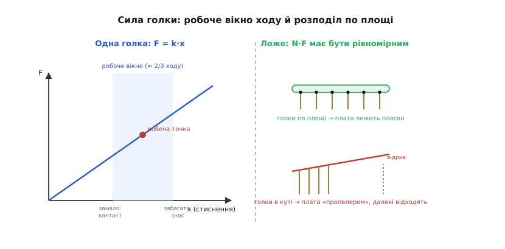
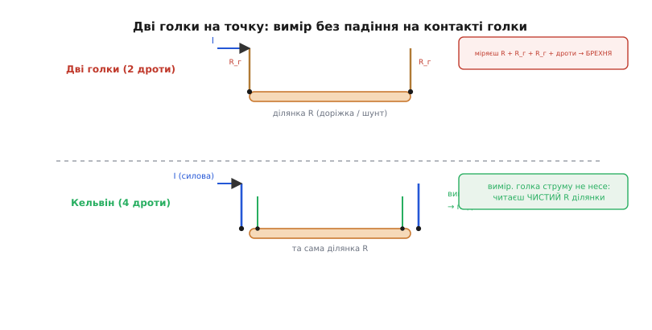
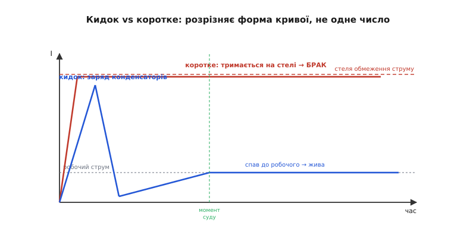

# Тест-джиг: механіка, електрика й фізика надійного вироку

<preknowlist>
- [DFM: проєктувати так, щоб можна було виготовити](root:embedded/dfm-basics) — плата мусить піти виробництву назустріч; тест-точки й доступ згори — теж рішення розводки.
- [Заводське прошивання й провізіонування](root:embedded/factory-provisioning) — той самий канал SWD, яким плату шиють на конвеєрі, джиг використовує й для тесту.
- [АЦП](book:electronics/adc) — як напруга перетворюється на ціле число порівнянням з опорною; уся вимірювальна частина джига стоїть на цьому.
- [Дільник напруги](book:electronics/voltage-divider) — два резистори ділять напругу у відомій пропорції; так шину 5 В заводять на вхід АЦП, що не терпить понад опору.
- [Закон Ома](book:electronics/ohms-law) — напруга = струм · опір; уся арифметика падінь на голках, доріжках і контактах — це він.
</preknowlist>

У базовому кроці ми зібрали тест-джиг як ідею: килим підпружинених голок, що за один притиск торкається десятків точок, контролер, який живить, шиє й міряє, і один чіткий вирок наприкінці. Цього досить, щоб зрозуміти, **навіщо** машина потрібна й **що** вона робить. Але щойно доходить до того, щоб таку машину справді побудувати — а не намалювати, — випливає рій питань, на які базова відповідь не дає: з якою силою тиснути голкою й звідки та сила береться; чому дві голки на одну точку міряють опір у сто разів точніше за одну; чому струм при вмиканні плати завжди підстрибує — і як відрізнити цей чесний стрибок від смертельного короткого; наскільки дрібну тест-точку голка ще влучить, а яку вже промине; і чому голка, що вчора давала контакт, сьогодні бреше. Це все — **фізика й інженерія машини**, і саме її ми тепер розгорнемо до дна.

Нитку поведемо знизу вгору, точно як сам джиг веде перевірку: спершу **механіка дотику** (як залізо торкається міді й не псує ні того, ні того), тоді **вимірювання** (як із дотику здобути чесне число), далі **живлення й послідовність** (як подати струм і не спалити плату), і насамкінець — **як усе це змушує плату мінятися ще в редакторі**. Історію народження цієї техніки — «ложе з цвяхів», ім'я «пого», прихід JTAG — ми вже пройшли [окремою розповіддю](root:embedded/test-jig-design/hist-bed-of-nails.md); а повний робочий код тесту «плата сама себе перевіряє й доповідає джигу» зібрано в [окремому прикладі](root:embedded/test-jig-design/proj-jig-selftest.md). Тут — те, що між ними: **чому машина влаштована саме так**.

## Сила голки: звідки береться притиск і чому він саме такий

Базова відповідь на «як торкнутися, не припаюючись» була: підпружинена голка, і пружина дає сталу силу. Це правда, але це лише перший шар. Копнімо: скільки саме сили, чому не більше й не менше, і що станеться, якщо промахнутися з цим числом.

### Пружина як закон Гука, а не як магія

Пружина всередині пого-штиря — це звичайна циліндрична пружина, а отже, підкоряється **закону Гука**: сила лінійно росте з тим, наскільки пружину стиснули.

```
F = k · x
```

де `F` — сила притиску, `k` — жорсткість пружини (скільки грамів на міліметр стиснення), `x` — наскільки плунжер утоплено в циліндр від вільного стану. Уся хитрість промислового штиря — у тому, що **робочу точку вибирають не де завгодно на цій прямій**, а в чітко визначеному вікні.

Подивись, що каже фізика штиря. У нього є **повний хід** (total travel) — уся відстань, на яку плунжер може втопитися до впору. І є **робочий хід** (working travel) — вужчий діапазон, у якому виробник обіцяє паспортну силу й ресурс; він становить приблизно **дві третини** повного (типово 60–70 %). Чому не весь? Бо на самих краях пружина або ще майже не стиснута (сила замала, контакт ненадійний), або вже майже до кінця (виток лягає на виток, сила стрибає нелінійно вгору, штир зношується втричі швидше й ризикує заклинити). Тож джиг проєктують так, щоб при закритій кришці кожен плунжер стояв **у середині свого робочого ходу** — там, де сила передбачувана, а запас є в обидва боки.

> 🔧 **Навіщо це.** Це число — глибина стиснення при закритій кришці — не абстракція, а розмір, який ти закладаєш у механіку джига з точністю до десятих міліметра. Якщо кришка тисне замало, голки стоять на початку ходу: сила мала, контакт то є, то нема, і плата хаотично «блимає» браком на добрих точках. Якщо тисне забагато, голки в кінці ходу: пружини перетиснуто, ресурс тане, а тонку плату може вигнути. Розрахунок «яку глибину дати» — це і є проєктування джига, і він весь тримається на `F = k·x`.

Типові числа, щоб відчути масштаб. Сила одного штиря лежить у діапазоні приблизно **25–200 грамів** залежно від задачі: легкі 25–50 гф — для ніжних площадок і гнучких плат; стандартні 75–100 гф — для звичайного функційного тесту; важкі 150–200 гф — там, де треба продавити товстий окисел або пропустити великий струм. Робочий хід — типово **0.5–2 мм**. Ці два числа й задають пружину: якщо тобі треба 75 гф при 1 мм стиснення, жорсткість пружини має бути близько 75 гф/мм.

### Сила однієї голки проти сили всього ложа

А тепер — момент, який у базовому викладі лишився за кадром і який регулярно ламає реальні джиги. Сила однієї голки — це дрібниця. Але голок **багато**, і їхні сили **додаються**, а тримати цю сумарну силу мусить кришка й механізм притиску.

```
F_сумарна = N · F_голки
```

Порахуй на прикладі. Плата з середнім джигом — це легко **сорок голок** по 100 гф кожна:

**Задача: яку силу тримає кришка на платі з 40 голок по 100 гф?**

```
F_сумарна = 40 × 100 гф = 4000 гф = 4 кгс ≈ 39 Н
```

Чотири кілограми, притиснуті до легкої плати завтовшки в півтора міліметра. Якщо ці чотири кілограми прикладені **рівномірно** — плата лежить спокійно, кожна голка робить свою частку. Але варто голкам згрупуватися в одному куті плати, а другий лишити без опори — і той навантажений кут прогинається, плата встає «пропелером», далекі голки відриваються від своїх точок, а близькі перетискаються. Ось звідки практичне правило: **голки треба розкладати по площі плати якомога рівномірніше**, а якщо це неможливо — додавати механічні опори (глухі штирі без електрики) у ненавантажені зони, щоб плата не гуляла.

Це та сама факірська арифметика, яку ми зустріли в [історії ложа з цвяхів](root:embedded/test-jig-design/hist-bed-of-nails.md): вага факіра тримається на сотнях цвяхів лише тому, що ділиться між ними; збери всі цвяхи в одну точку — і трюк скінчиться кров'ю. У джига дзеркально: рівномірне ложе тримає плату, зібране в купу — гне її.

Повне виведення механіки штиря — від закону Гука через прогин плати до вибору пружини під конкретне число циклів — винесено в [окрему математичну вставку](root:embedded/test-jig-design/math-contact-mechanics.md), щоб не рвати тут нитку; там же — звідки береться перехідний опір контакту й чому вістря роблять коронкою. Тут нам досить головного: **сила голки — це `k·x`, сила ложа — це `N·F`, і обидві треба тримати в голові, коли проєктуєш притиск**.


*Ліворуч: сила голки лінійно росте зі стисненням (закон Гука), але паспортну силу й ресурс виробник обіцяє лише в середній третині ходу — там і ставлять робочу точку, із запасом в обидва боки. Праворуч: сумарна сила N·F має розподілитися по площі — інакше плата встає пропелером, далекі голки відриваються, близькі перетискаються.*

## Перехідний опір: чому голка «бачить» не зовсім те, що є на платі

Тепер до вимірювання — і до найпідступнішого, що є в контакті голки з міддю. Коли ти прикладаєш голку до площадки, між ними виникає **перехідний опір** (contact resistance), і він ніколи не нульовий. Розуміти його треба тому, що цей опір **вмішується в кожен вимір**: голка міряє не напругу на площадці, а напругу після того, як струм протік крізь цей паразитний опір.

### Звідки взагалі береться опір у місці дотику

Здавалося б: метал торкнувся металу — має бути нуль. Але дві поверхні, хоч які гладенькі на око, насправді шорсткі під мікроскопом: вони торкаються не всією видимою площею, а лише вершинками нерівностей — **асперитами** (лат. *asper* — «шорсткий»). Струм змушений протискатися крізь ці кілька крихітних плямок замість усієї площі, і саме це звуження струму дає **опір звуження** (constriction resistance). Що менша реальна площа дотику — то тісніше протискається струм і то більший опір.

До цього додається друге — **плівка** на поверхні. Мідна площадка на повітрі одразу вкривається тонким шаром окислу, а після пайки — ще й флюсом. Ця плівка — діелектрик, вона мала б розірвати контакт зовсім. Але фізика рятує двома способами. Дуже тонку плівку (до ~2 нанометрів окисленого кисню) електрони **пробивають наскрізь квантовим тунелюванням** — досить напруги від ~30 мілівольтів, і струм тече крізь ізолятор, наче його нема. Товщу плівку (окисли, сульфіди понад ~10 нм) тунель уже не бере — її доводиться **пробивати** сильним полем, і цей процес звуть **фритуванням** (англ. *fritting* — від того, як під високою напругою в плівці пробивається провідний місток).

Ось чому вістря пого-штиря роблять **не тупим циліндриком, а коронкою з кількох гострих зубців**. Коли така коронка притискається із силою 100 грамів, уся ця сила зосереджується на кількох вістрях зубців — тиск під ними колосальний, зубці **продавлюються крізь окисел і флюс до чистого металу** і збільшують реальну площу дотику. Гостра коронка робить одразу дві добрі речі: механічно зчищає плівку (менше треба фритувати) і збільшує пляму контакту (менший опір звуження). Тому якісний штир дає малий і, головне, **повторюваний** перехідний опір — типово менше **10–20 мілліом**.

> 🔧 **Навіщо це.** Двадцять мілліом здаються дрібницею, поки ти міряєш напругу мілівольтметром — там струм через голку майже нульовий, і падіння на 20 мОм непомітне. Але спробуй **виміряти струм** плати або **перевірити низькоомний шунт**, і ці мілліоми стають брехнею: якщо через голку тече 1 ампер, на 20 мОм падає 20 мілівольтів, і твій вимір «поїхав» рівно на цю величину, ще й непередбачувано — від притиску до притиску контакт трохи різний. Саме тому для точних низькоомних вимірів одної голки замало, і тут з'являється прийом, якого в базовому викладі не було зовсім, — **чотиридротова схема**.

### Чотири дроти замість двох: як обійти опір голки

Ось задача, об яку розбивається наївний джиг. Треба перевірити, що падіння на силовій доріжці плати (або на шунті струму) не перевищує, скажімо, 50 мілівольтів під навантаженням 1 ампер — тобто що опір цієї ділянки менший за 50 мОм. Прикладаєш дві голки — одну до початку доріжки, одну до кінця, — жену через них струм і міряю напругу. Але кожна голка має свої ~20 мОм перехідного опору, дроти до контролера — ще стільки ж, і замість 50 мОм доріжки ти міряєш «50 + 20 + 20 + опір дротів» — тобто вдвічі більше, ніж є насправді, і плата хибно летить у брак.

Корінь біди: **той самий дріт несе й струм, і вимір напруги**. Струм, протікаючи крізь опір голки, створює на ній падіння — і це падіння домішується до того, що ти хочеш виміряти. Розв'язок геніально простий і зветься **чотиридротова**, або **кельвінова**, схема (на честь лорда Кельвіна, який її ввів для точних вимірів опору). Замість однієї голки на точку ставлять **дві**: одна — **силова** (force), лише жене струм; друга — **вимірювальна** (sense), лише читає напругу й струму крізь себе майже не пропускає.

Уся суть — у тому, що вимірювальна голка **не несе робочого струму**. А раз крізь неї струм не тече, то й падіння на її перехідному опорі за законом Ома — нуль (`U = I·R = 0·R = 0`), хоч би який опір мала сама голка. Вимірювальний дріт заходить рівно на ту точку, яку хочемо, і бачить її справжню напругу — не зіпсовану падінням на власному контакті. Силова голка хай має хоч 50 мОм перехідного опору — це вже нікого не турбує, бо струм крізь неї падає на ній, а не на вимірюваній ділянці.

```
Дві голки (2 дроти):  міряєш  R_доріжки + R_голки1 + R_голки2 + R_дротів  — брехня
Кельвін (4 дроти):    міряєш  тільки R_доріжки                            — правда

   силова голка ──[тече I]──►┐                    ┌──►[тече I]── силова голка
                             ●── ділянка R ──●
   вимір. голка ──[I≈0]─────►┘                    └──►[I≈0]──── вимір. голка
                             ↑                    ↑
                     тут читаємо напругу без падіння на контактах
```

Кельвінова схема опускає нижню межу вимірюваного опору з типових ~100 мОм (двома дротами) до одиниць мілліом і нижче — тобто дозволяє ловити те, чого двома голками не побачиш зовсім: **холодну пайку силового виводу, тонку доріжку, недопаяний шунт**. Ціна — вдвічі більше голок на кельвінову точку й окрема пара дротів. Тому чотиридротову схему кладуть **не скрізь**, а лише туди, де вимір справді низькоомний або струм великий: силові шини, вимірювальні шунти, роз'єми живлення. Решту точок міряють однією голкою — там перехідний опір і не заважає.


*Двома дротами струм і вимір ідуть тим самим шляхом, тож падіння на перехідних опорах голок домішується до результату. Кельвінова пара розводить ці ролі: силова голка несе струм і хай падає на своєму опорі скільки хоче, а вимірювальна голка струму майже не пропускає — за законом Ома падіння на її контакті нульове, і вона читає чисту напругу ділянки.*

## Живлення плати: чому струм завжди підстрибує і як не сплутати це з коротким

Механіку дотику й вимір ми розібрали. Але перш ніж щось міряти, джиг мусить **подати на плату живлення** — і саме тут ховається пастка, яку базовий виклад лише назвав («якщо струм зашкалює — коротке»), а тепер треба розкрити до механізму. Бо струм при вмиканні **зашкалює завжди**, навіть на ідеально справній платі, — і якщо джиг цього не розуміє, він або бракує всі добрі плати, або пропускає справжні короткі.

### Кидок струму — це чесна фізика конденсаторів

На кожній платі є конденсатори — по живленню їх десятки: великі електролітичні на вході, дрібні керамічні біля кожної мікросхеми. У момент подачі живлення всі вони **розряджені**, тобто напруга на них нуль. А конденсатор із нульовою напругою для джерела виглядає як **коротке замикання**: щоб миттєво підняти на ньому напругу, треба миттєво влити заряд, а це — величезний миттєвий струм. Цей стартовий сплеск звуть **кидком струму** (англ. *inrush current*), і він може вп'ятеро-вдесятеро перевищити робочий струм плати — на частки мілісекунди, поки конденсатори заряджаються.

Ось чому наївна перевірка «струм більший за поріг → коротке → БРАК» ловить не короткі, а власний кидок кожної справної плати. Плата, у якої в роботі 100 мА, на старті легко смикне 800 мА на пів мілісекунди — і тупий джиг з порогом 200 мА завалить її ні за що.

Різниця між кидком і справжнім коротким — **не у величині, а в поведінці в часі**. Кидок **спадає**: конденсатори за одиниці-десятки мілісекунд заряджаються, і струм падає до робочого. Коротке **не спадає**: якщо десь мідь замкнула мідь, струм упреться в межу джерела й **триматиметься** там, скільки не чекай, бо заряджати нема чого — енергія просто гріє перемичку. Тож розрізняти їх треба **за формою кривої струму в часі**, а не за одним миттєвим числом.

### Правильна послідовність: повільно піднімай, дивись на форму

Звідси — грамотний спосіб подати живлення, який робить будь-який серйозний джиг. По-перше, живлення на плату подають **не тумблером, а через керований ключ** (транзистор MOSFET або лабораторне джерело з обмеженням струму), щоб контролер міг і ввімкнути, і будь-якої миті **вимкнути** за мікросекунди. По-друге, джерело роблять **з обмеженням струму** (current limit): воно не дасть струму перевищити заданої стелі, хоч би що сталося, — тобто навіть у справжнє коротке воно вперся в межу й не спалить ні плату, ні себе. По-третє, після ввімкнення контролер **дивиться на криву струму в часі**:

- струм **піднявся й за кілька-десятки мілісекунд спав** до розумного робочого → це був кидок, плата жива, ідемо далі;
- струм **уперся в стелю обмеження й там сидить** довше за розумний час заряду → коротке, негайно знімаємо живлення й кажемо БРАК, не давши плати грітися.

```c
// Спрощена логіка: подати живлення й розрізнити кидок від короткого.
// jig_current_ma() читає струм крізь силову голку (шунт на боці джига).
bool jig_power_up_and_check(void) {
    jig_set_current_limit_ma(1500);   // стеля: вище кидка, але береже від пожежі
    jig_power_on_dut();               // увімкнути ключ живлення DUT

    uint32_t t0 = jig_millis();
    // Даємо кидку відбути своє: конденсатори мають зарядитись за INRUSH_MS.
    const uint32_t INRUSH_MS   = 50;
    const uint16_t I_SHORT_MA  = 1400; // майже стеля: якщо тут сидимо — коротке
    const uint16_t I_NORMAL_MA = 250;  // стеля робочого струму доброї плати

    // Фаза 1: перечекати кидок, але стежити, чи не сидимо на стелі надто довго.
    while ((jig_millis() - t0) < INRUSH_MS) {
        if (jig_current_ma() >= I_SHORT_MA &&
            (jig_millis() - t0) > 10) {     // на стелі довше 10 мс — це не кидок
            jig_power_off_dut();
            jig_fail("SHORT: current pinned at limit", jig_current_ma());
            return false;
        }
    }

    // Фаза 2: кидок мав минути. Тепер струм має бути робочий.
    uint16_t i_now = jig_current_ma();
    if (i_now > I_NORMAL_MA) {
        jig_power_off_dut();
        jig_fail("overcurrent after inrush", i_now);   // просідання/часткове коротке
        return false;
    }
    return true;   // живлення чисте, плата не гріється — можна шити й міряти
}
```

Зверни увагу на два числа-межі. `I_SHORT_MA` — майже на стелі обмеження: сидіти там довше кількох мілісекунд справна плата не може, бо її кидок давно мав спасти, тож це однозначне коротке. `I_NORMAL_MA` — стеля **робочого** струму: після кидка справна плата мусить укластися в нього, і якщо струм завис десь **між** кидком і коротким (наприклад, частково замкнутий вивід, що не коротить намертво, а лише підвантажує шину), джиг теж це впіймає у Фазі 2.

> 🔧 **Навіщо це.** Обмеження струму — це не «щоб точніше», а **щоб не спалити**. Уяви джиг без стелі, у який поклали плату з коротким під час пайки: джерело віддасть усе, що може, перемичка розжариться, плата задимить, а разом з нею може постраждати й голка, і сам джиг. Обмеження струму перетворює «спалили плату й голку» на «блимнули червоним і зняли плату». А розрізнення кидка й короткого за формою кривої — це те, без чого джиг або душить добрі плати хибним браком, або пропускає справжні короткі; обидві помилки коштують грошей, і обидві прибираються тим, що дивишся на **криву струму**, а не на одну точку.


*Струм на старті підстрибує в обох випадків, тож одне миттєве число їх не розрізнить. Справна плата: кидок від заряду конденсаторів швидко спадає до робочого струму. Коротке: струм упирається у стелю обмеження й там сидить, бо енергія не заряджає, а гріє перемичку. Джиг судить за формою кривої — спадає чи тримається, — а обмеження струму весь цей час береже плату й голку від пожежі.*

## Що ловить джиг, а що ні: покриття дефектів як число

Базовий крок сказав головне: джиг проєктують не «під максимум точок», а під **покриття дефектів**. Тепер розгорнімо це до інженерної величини, бо на серії покриття перестає бути гаслом і стає числом, за яке відповідаєш.

**Покриття дефектів** (fault coverage) — це частка можливих дефектів, які твій тест справді спіймає. Не «плата пройшла тест», а «які саме біди тест здатен виявити, а які проскочать повз нього незалежно від вироку». Це число рахують чесно: перелічуєш класи дефектів, що реально бувають на цій платі й цьому конвеєрі, і для кожного питаєш — чи є в тесті точка, що його зловить.

Класи дефектів на складеній платі згруповуються так:

- **Короткі** (замикання сусідніх ліній перемичкою припою чи флюсу) — ловляться вимірюванням струму й перевіркою, що лінії, які мають бути роз'єднані, справді не з'єднані.
- **Обриви** (непропай, холодна пайка, відірвана площадка, [надгробок](root:embedded/dfm-basics) — деталь, що стала дибки на одному виводі) — ловляться тим, що коло, яке мало проводити, не проводить: петлею GPIO, опитуванням давача, вимірюванням шини за дільником.
- **Не той номінал** (поставили резистор 10 кОм замість 1 кОм) — ловиться вимірюванням, що напруга чи струм там, де цей номінал працює, лежить у коридорі.
- **Мертва або не та деталь** (дохлий регулятор, чип-давач не тієї ревізії, переплутана полярність) — ловиться тим, що вузол не дає очікуваного відгуку: шина не піднялась, давач не відповів своїм підписом.
- **Не прошилась / прошилась не тим** — ловиться самим фактом, що плата не заговорила або заговорила чужим рапортом (детально — в [прикладі коду тесту](root:embedded/test-jig-design/proj-jig-selftest.md)).

І тут — тверезе визнання, якого гасло «перевіряй що ламається» не давало. **Жоден один метод не дає стовідсоткового покриття.** Голки ложа (внутрішньосхемний тест) чудово ловлять короткі, обриви й номінали там, **де є куди прикластися** — тобто на відкритій міді. Але вони **сліпі** до того, що сховане: з'єднання під корпусом BGA, доріжки між внутрішніми шарами плати, логіку всередині кристала. Саме тому в серйозному виробництві методи **складають шарами**, і кожен бере своє:

- **Оптичний огляд** (AOI) дивиться очима-камерою на пайку згори: бачить відсутню деталь, перевернуту полярність, явний непропай, надгробок — те, що видно **зовні**, але не перевіряє жодної електричної функції.
- **Внутрішньосхемний тест голками** (наш джиг) перевіряє **електрику** відкритих вузлів: короткі, обриви, номінали, живі деталі.
- **Граничний скан** (JTAG) лізе **всередину**, туди, куди голці зась: перевіряє з'єднання під BGA й між шарами, «тицяючи» віртуальними голками зсередини чипів (як народилась ця техніка — в [історії](root:embedded/test-jig-design/hist-bed-of-nails.md)).
- **Функційний тест** ганяє плату як цілий пристрій: подає бойові сигнали й дивиться, чи робить вона те, що має.

Поодинці кожен лишає діри; разом вони перекривають діри одне одного. Практичний орієнтир галузі: комбінація оптичного огляду з голковим тестом (або з тестом «літаючим щупом») дає **понад 95 %** сумарного покриття, і саме такої планки тримаються там, де надійність важлива. Твоя задача, проєктуючи джиг, — **не гнатися за 100 % одними голками** (це часто фізично неможливо й завжди дорого), а свідомо вирішити: що бере на себе джиг, а що доведеться дати іншому шару.

> 🔧 **Навіщо це.** Покриття як число рятує від двох протилежних дурниць. Перша — **тестувати все підряд**: ставити голку на кожну доступну точку «про всяк випадок», роздуваючи джиг, час циклу й ціну, хоча половина тих точок не ловить жодного ймовірного дефекту. Друга — **самозаспокоєння**: плата пройшла джиг, отже, вона добра. Ні: вона добра **в тому, що джиг здатен побачити**, а дефект під BGA він не бачив у принципі, хоч би скільки зелених вогників дав. Знаючи покриття числом, ти чесно кажеш: «джиг ловить 90 % наших дефектів, решту 10 % (сховане під корпусами) бере граничний скан» — і не дивуєшся потім браку, що проскочив крізь діру, якої ти просто не заклав.

## Джиг вимагає своє від плати: DFM із числами

Коло, як і в базовому кроці, замикається на [проєктуванні під виготовлення](root:embedded/dfm-basics): щоб джиг міг торкнутися точки, ця точка мусить існувати як відкрита мідь, доступна голці згори, і закладають її ще в редакторі плати. Базовий крок дав правила якісно — відкрита, велика, не під деталлю, не на via, з одного боку. Тепер дамо **числа й фізику за кожним правилом**, бо на серії «приблизно міліметр» перетворюється на конкретний розмір, який ти або заклав, або ні.

### Чому саме ~1 міліметр: складання допусків

Правило «тест-точка не менша за міліметр» здається взятим зі стелі. Насправді воно виводиться, і виведення повчальне. Голка мусить **влучити в площадку**, а між ідеалом і реальністю стоїть ланцюжок неточностей, кожна зі своїм розкидом:

- напрямні штирі тримають плату не ідеально — є люфт у монтажних отворах (десяті міліметра);
- сама плата виготовлена з допуском — доріжки й площадки лежать трохи не там, де в файлі (теж десяті);
- плита з голками свердлена з допуском — гнізда голок трохи зміщені;
- сама голка при стисненні трохи відхиляється вбік від осі.

Ключове: ці похибки **не додаються навпростець**, бо вони випадкові й незалежні — рідко всі промахнуться в один бік одночасно. Їх складають **корінь-квадратично** (root-sum-square, RSS) — так рахують сумарний розкид незалежних випадкових похибок:

```
Δ_сумарна = √(Δ₁² + Δ₂² + Δ₃² + Δ₄²)
```

**Задача: який діаметр площадки треба під голку, якщо кожне з чотирьох джерел дає ±0.15 мм?**

```
Δ_сумарна = √(0.15² + 0.15² + 0.15² + 0.15²)
          = √(4 × 0.0225)
          = √0.09
          ≈ 0.30 мм   (радіус розкиду навколо центру)
```

Тобто вістря голки з розумною певністю опиниться десь у колі радіусом ±0.30 мм від номінального центру, тобто в плямі діаметром ~0.6 мм. Щоб голка **гарантовано** лишилася на міді навіть при найгіршому збігу, площадку роблять помітно більшою за цю пляму розкиду — звідси й **близько міліметра** (типово 0.9–1.0 мм для звичайного джига; для точнішого можна менше, для грубого — більше). Це не магічне число, а **сума допусків твоєї механіки** — і якщо твої напрямні гірші, точку треба більшу.

### Решта правил — теж пряма фізика голки

**Відкрита, без маски.** Паяльна маска — це лак, діелектрик. Накрий нею площадку — і голка впреться в ізолятор, перехідного опору не буде взагалі, точка «мертва» для тесту. Тому в редакторі тест-точці **явно знімають маску** згори (opening), лишаючи голу мідь.

**Не на перехідному отворі (via).** Via — це площадка з діркою посередині. Вістря голки, тим паче гостра коронка, **норовить зісковзнути в дірку** й або промазати повз мідь, або застрягти. Тому під тест роблять **окрему суцільну площадку** без дірки; якщо треба взяти сигнал саме з via-кола, ведуть від нього коротку доріжку до окремої тест-площадки поруч.

**Не під деталлю й не впритул до високого корпуса.** Голка приходить згори по прямій. Якщо над площадкою нависає корпус деталі, голка **вдариться в нього**, а не в мідь, ще й може зламати і деталь, і себе. Тому навколо тест-точки лишають **зону без високих компонентів** (keepout) — досить, щоб тіло голки (а воно товще за вістря) пройшло вільно. Практично — кілька міліметрів чистого поля навколо кожної точки.

**Усі точки — з одного боку.** Голка тисне з одного напрямку; якщо точки на обох боках плати, потрібні **дві плити голок назустріч**, а це подвоює складність, ціну й проблему притиску (тепер обидві плити тиснуть плату, і вона між ними). Тому тест-точки за можливості **зганяють на один бік** — тоді досить одної нижньої плити, а зверху лише проста притискна кришка.

> 🔧 **Навіщо це.** Кожне з цих правил коштує в редакторі кілька хвилин, а порушене — тижні на серії. Забув зняти маску з десяти точок — і джиг, який ти вже зробив і налагодив, раптом бракує кожну плату, бо голки впираються в лак; шукаєш причину днями. Поставив точки на via — голки зісковзують, контакт «блимає», плата хаотично то проходить, то ні. Розкидав точки по обидва боки — і замість простого джига за день тобі рахують подвійний за тиждень. Тому список тест-точок і їхню геометрію узгоджують **до розводки**: спершу вирішуєш, які вузли перевіряти й з якою механікою, а вже під це лишаєш мідь потрібного розміру, відкриту, з одного боку, з keepout навколо.


*Розмір площадки — не зі стелі: чотири незалежні джерела похибки складаються корінь-квадратично в пляму розкиду близько 0.6 мм, і мідь роблять помітно більшою, щоб голка лишилась на ній при найгіршому збігу. Навколо — keepout під тіло голки; маску знято, щоб голка торкнулась металу; via під вістрям заборонено, бо голка в дірку зісковзує.*

## Джиг зношується: чому вчорашня голка сьогодні бреше

Останнє, чого базовий виклад не торкнувся зовсім, а на серії воно вилазить обов'язково: **джиг — механізм, і він зношується**. Голка, що давала чистий контакт першу тисячу плат, на десятитисячній починає підбріхувати, і якщо цього не розуміти, ти отримаєш найгидкіший вид браку — **хибний**, коли добрі плати летять у кошик через утомлену голку.

Звідки знос. По-перше, **пружина втомлюється**: за сотні тисяч циклів стиснення метал пружини поступово «сідає», сила притиску падає, і в якийсь момент її вже замало, щоб продавити окисел, — контакт погіршується. Якісні штирі витримують **500 тисяч циклів і більше** в чистих умовах, але «в чистих» — ключове застереження. По-друге, **вістря забруднюється**: продавлюючи флюс і окисел плата за платою, коронка накопичує на зубцях наліт, який сам стає ізолятором, — і чим брудніші плати йдуть крізь джиг, тим швидше. По-третє, **вістря тупиться** механічно: гострі зубці, якими коронка продавлює плівку, з часом заокруглюються, тиск під ними падає, продавлювати стає важче.

Наслідок усього цього однаковий — **перехідний опір повзе вгору**, спершу непомітно, потім до межі, за якою вимір псується. Це має свою назву в цеху — **дрейф**, а хибний брак від зношеного джига звуть NTF (англ. *no trouble found* — «біди не знайдено»): плату забракували, віддали на розбір, а вона справна — біда була не в платі, а в голці.

Як із цим живуть. **Профілактика:** голки періодично чистять (спеціальною гумкою чи щіточкою, що знімає наліт з коронки), а після паспортного ресурсу — **замінюють**; тому їх і роблять змінними, що сидять у гніздах-приймачах (receptacle), а не впаяними намертво. **Виявлення:** у джиг закладають **еталонну плату** (golden board) — свідомо справний зразок, який раз на зміну проганяють крізь тест; якщо еталон раптом «не проходить» або його виміри поповзли, це не еталон зіпсувався — це джиг дрейфонув, час чистити чи міняти голки. Так відрізняють дрейф машини від справжнього браку плат.

> 🔧 **Навіщо це.** Без цієї дисципліни джиг непомітно перетворюється з тестера на генератор хибного браку. Уяви: серія йде, відсоток браку тихо повзе з 2 % до 8 %, інженери місяць шукають, що зіпсувалося в **платах**, — а зіпсувалася голка, яка вже пройшла свій ресурс і бреше на добрих плятах. Еталонна плата ловить це за один прогін: якщо свідомо справна плата раптом не проходить, винен джиг, а не плата. Тому знос джига закладають у регламент нарівні з калібруванням приладів: чистка за графіком, заміна голок за ресурсом, еталон щозміни — і хибний брак не з'їдає прибуток серії.

## Що з усього цього забрати

Тест-джиг у базовому кроці був елегантною ідеєю; тут ми побачили, що за кожним його елементом стоїть конкретна фізика, і саме вона диктує, як машину будувати.

**Механіка дотику** — це закон Гука для однієї голки (`F = k·x`, робоча точка в середній третині ходу) і додавання сил для всього ложа (`N·F`, розподілене по площі, щоб плата не встала пропелером). **Вимір** упирається в перехідний опір контакту — опір звуження на асперитах плюс плівка, яку коронка продавлює, — і там, де вимір низькоомний чи струм великий, дві голки на точку (кельвінова схема) виграють у однієї стократ, бо вимірювальна голка струму не несе й падіння на своєму контакті не має. **Живлення** завжди дає кидок струму від розряджених конденсаторів, і відрізнити цей чесний кидок від смертельного короткого можна лише за формою кривої в часі — спадає чи тримається, — а обмеження струму весь цей час береже плату й голку від пожежі. **Покриття** — це число, а не гасло: жоден метод не ловить усе, тож голки, оптику й граничний скан складають шарами до понад 95 % разом. Усе це замикається на **DFM із числами**: розмір тест-точки — це корінь-квадратична сума допусків твоєї механіки, а не кругле число зі стелі. І останнє — **джиг зношується**: пружина сідає, коронка тупиться й брудниться, перехідний опір повзе, тож чистка за графіком, заміна голок за ресурсом і еталонна плата щозміни — не примха, а те, що відрізняє тестер від генератора хибного браку.

Плату, яку ми навчилися зробити придатною і до складання, і до тесту, лишилося вбрати в те, що витримає світ, — [корпус, IP-захист і роз'єми](root:embedded/enclosure-ip-rating): дощ, пил, вібрацію й падіння, від яких її досі беріг лише лабораторний стіл.
