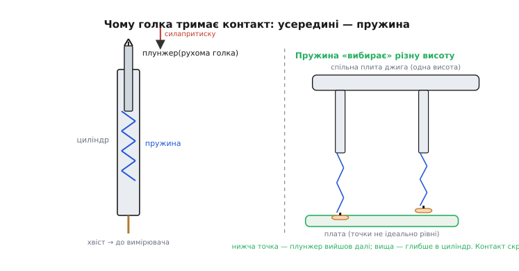
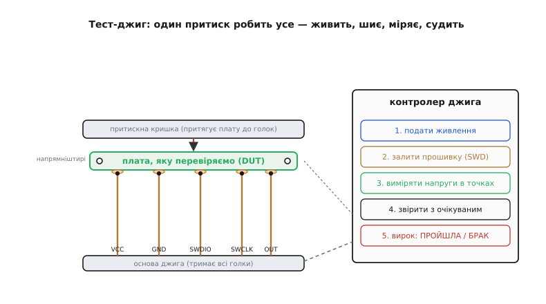
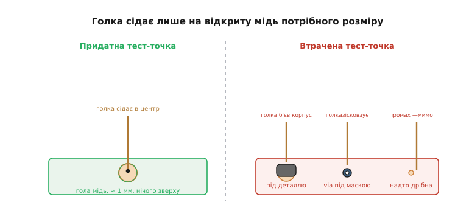

# Тест-джиг

У попередньому кроці ми навчилися [заливати прошивку просто на конвеєрі](root:embedded/factory-provisioning): плата ще їде стрічкою, а в неї вже вписано образ, серійний номер, ключі. Але залити прошивку — це половина справи. Звідки ти знаєш, що плата, у яку ти щойно все це вписав, узагалі **жива**? Що резонатор коливається, що живлення тримає три вольти й три десятих, що жоден із двохсот виводів не замкнуло сусіда під час оплавлення? Прототип ти перевіряв руками: тицяв щупом мультиметра, дивився на осцилограф, ганяв тестову прошивку й читав логи. Але тепер перед тобою не одна плата, а п'ятдесят на годину, і в кожної — по три десятки вузлів, які могли не вийти. Тицяти щупом у кожну — це тижні роботи й гарантовані пропуски.

Тест-джиг (*jig* — англ. «кондуктор, затискне пристосування»; так у металообробці звуть оснастку, що тримає деталь у точній позиції під інструмент) — це машина, яка робить цю перевірку за тебе, за кілька секунд, однаково для кожної плати. Ти кладеш плату, тиснеш кришку — джиг сам подає живлення, заливає прошивку, міряє напруги в десятках точок, ганяє коротку самоперевірку й показує один-єдиний вирок: **ПРОЙШЛА** зеленим або **БРАК** червоним. Розберімось, чому така машина взагалі потрібна, як вона фізично торкається плати, що саме варто міряти — і як конструкція плати мусить піти джигу назустріч, бо це, як ми побачимо, знову впирається в [ту саму виготовність](root:embedded/dfm-basics), про яку йшлося в попередньому розділі.

### На конвеєрі немає розумної руки, яка полагодить

Повернімося до головного зсуву, з якого виросла вся мала серія. Коли ти паяв прототип, ти був розумною зворотною зв'язкою: щось не працює — ти думаєш, міряєш, знаходиш холодну пайку, перепаюєш. На конвеєрі цієї руки немає. Плата, що зійшла зі стрічки, або поїде в корпус і до клієнта, або в кошик — і рішення про це треба ухвалити **тут і зараз, без роздумів**. Не «полагодити», а лише **розсортувати**: ця добра, ця в брак. Уся мета тесту наприкінці лінії — не діагностика, а швидкий і надійний вирок «годиться / не годиться».

І вирок цей мусить бути **дешевий у часі**. Якщо перевірка однієї плати забирає п'ять хвилин ручного тицяння, то партія на п'ятдесят штук — це чотири години, і людина неминуче десь позіхне й пропустить дефект. Якщо ж джиг дає вирок за десять секунд і не втомлюється, то ті самі п'ятдесят плат проходять за десять хвилин, і кожну перевірено **однаково суворо**. Ось звідки потреба в машині: не тому, що людина не вміє, а тому, що людина не масштабується, а конвеєр — це масштаб.

> 🔧 **Навіщо це.** Плата, що «начебто працює» на столі, і плата, яку **виміряли й підтвердили**, — це різні речі, і різниця в грошах величезна. Дефект, спійманий джигом за десять секунд, коштує кілька секунд роботи оператора. Той самий дефект, що проїхав далі, коштує складання корпусу, пакування, доставки — а якщо доїхав до клієнта в дроні, то й падіння апарата. Тому джиг ставлять **якнайраніше** в потоці: чим раніше відсіяно брак, тим дешевше він обійшовся.

### Голка з пружиною: як торкнутися плати, не припаюючись

Найперше фізичне питання: як машині надійно з'єднатися з платою, коли жодного роз'єму на ній може й не бути, а торкнутися треба одразу двадцяти точок — і так п'ятдесят разів поспіль, не псуючи ні плату, ні себе? Відповідь на диво стара й проста — **підпружинена голка**, яку на весь світ називають **pogo-pін** (англ. *pogo pin*; ім'я — від дитячого стрибунця-«кузнечика» *pogo stick*, бо голка так само пружинить угору-вниз на внутрішній пружині). Слово це, до речі, — зареєстрована торгова марка компанії Everett Charles Technologies, тож у стандартах його обережно пишуть «підпружинений контактний штир», але в цеху всі кажуть просто «пого».

Усередині такий штир — три деталі: порожнистий **циліндр** (barrel), рухома **голка-плунжер** (plunger), що виходить із нього назовні, і **пружина** між ними. Тисни на голку — вона втоплюється в циліндр, стискаючи пружину; відпусти — вистрибує назад. Хвіст циліндра припаяно до дроту, що йде до вимірювача. Уся хитрість — саме в пружині, і варто побачити, що вона дає.


*Ліворуч: усередині штиря — рухомий плунжер на пружині в циліндрі; сила притиску йде від стиснутої пружини, а не від того, як точно ти опустив плату. Праворуч: точки на платі ніколи не лежать в ідеальній площині — а голки закріплені в одній плиті на однаковій висоті. Пружина в кожній голці стискається на свою величину, тож і нижча, і вища точка отримують надійний контакт.*

Перше, що дає пружина, — **сталу силу притиску**. Плата ніколи не сідає в джиг ідеально: то трохи перекошена, то площадки на різній висоті на частки міліметра, то оператор притис сильніше чи слабше. Якби голки були жорсткі, це означало б то поганий контакт (не дотиснув), то погнуту плату чи зламану голку (передавив). Пружина ж «з'їдає» цю невизначеність: у якому б розумному діапазоні плата не опинилася, кожна голка тисне приблизно з тією самою силою — саме тою, на яку розрахована її пружина. Один притиск кришки — і всі двадцять контактів однаково добрі, хоч точки й на різній висоті.

Друге — **довговічність і чистий контакт**. Вістря голки роблять не тупим циліндриком, а коронкою з кількома зубцями: продавлюючись крізь тонкий шар окислу чи флюсу на площадці, зубці шкрябають до чистого металу й дають малий, повторюваний перехідний опір. Якісні штирі витримують сотні тисяч натискань — 500 тисяч циклів і більше в чистих умовах, — тобто одна плита голок обслуговує весь випуск серії й не одну.

Звідки взялася вся ця ідея — тісний килим із голок, у який утикають плату, — і чому інженери назвали його **«ложем із цвяхів»**, окрема цікава історія [про народження внутрішньосхемного тесту](root:embedded/test-jig-design/hist-bed-of-nails.md); тут важливо інше — що ця стара механіка й досі найдешевший спосіб торкнутися сотні точок за один рух.

### Джиг як машина: одне натискання — уся перевірка

Тепер зберімо машину цілком. Плита з голками — це серце, але навколо неї потрібне ще дещо, і кожна частина вирішує свою фізичну задачу.

Перша задача — **точно посадити плату**, бо голка діаметром із волосину має влучити в площадку розміром із макове зерно. Її вирішують **напрямні штирі** (tooling pins): два-три товсті штирі в основі джига входять у монтажні отвори плати (ті самі, якими вона потім прикручується в корпусі) і фіксують її в єдино правильній позиції. Плата лягає лише одним способом — і всі голки автоматично опиняються під своїми точками.

Друга задача — **притиснути й тримати**. Легка плата від тиску знизу просто підстрибне, тож зверху її притискає **кришка** — на завісах, з важелем чи пневматикою. Вона тисне плату вниз, на голки, стискаючи їхні пружини на робочу глибину. Поки кришка закрита — контакт тримається; відкрив — плата вільна, бери наступну.

Третя задача — власне **перевірити**, і тут джиг робить усе за один цикл. Подивись на послідовність.


*Один притиск кришки замикає весь ланцюг. Напрямні штирі ставлять плату в єдину позицію, кришка тисне її на голки, а голки під точками VCC, GND, SWDIO, SWCLK і виходом ведуть до контролера джига. Той відпрацьовує п'ять кроків поспіль: подає живлення, заливає прошивку по [SWD](root:embedded/jtag-swd-tools), міряє напруги в контрольних точках, звіряє їх з очікуваними — і показує один вирок.*

Контролер джига (часто це проста плата з мікроконтролером або невеликий промисловий модуль) веде цикл сам:

1. **Живлення.** Голки VCC і GND подають на плату живлення — контрольовано, з вимірюванням струму. Уже тут ловиться груба біда: якщо струм при вмиканні різко зашкалює, десь **коротке**, і далі йти не можна — джиг одразу каже «БРАК», не ризикуючи спалити плату.
2. **Прошивка.** Через голки SWDIO/SWCLK контролер заливає в мікроконтролер тестову (або вже бойову) прошивку — рівно так, як ми робили [на кроці провізіонування](root:embedded/factory-provisioning). Тепер плата може заговорити сама про себе.
3. **Вимірювання.** Голки на контрольних точках читають напруги: чи дає регулятор рівно 3.3 В, чи піднялися шини 1.8 В і 5 В, чи є опорна напруга там, де має бути.
4. **Звіряння.** Кожне значення порівнюється з очікуваним у певному **допуску** — не «рівно 3.3», а «між 3.20 і 3.40». Вийшло за межі — брак.
5. **Вирок.** Зелене світло чи червоне; часто ще й запис у журнал за серійним номером — щоб потім знати, що саме ця плата тест пройшла.

Найпростіша, але вже корисна перевірка — саме крок звіряння: узяти виміряне значення й глянути, чи лежить воно в допуску. На боці контролера джига це буквально кілька рядків:

**Задача: підтвердити, що шина 3.3 В у нормі (3.20…3.40 В).** Контролер читає напругу своїм [АЦП](root:hw-analog/voltage-divider) через голку й зіставляє з вікном:

```c
// поріг у мілівольтах: 3.3 В ±0.1 В
#define RAIL_3V3_MIN_MV  3200
#define RAIL_3V3_MAX_MV  3400

// перевірка однієї точки: чи напруга в допуску
bool check_rail(uint16_t measured_mv, uint16_t lo_mv, uint16_t hi_mv) {
    return (measured_mv >= lo_mv) && (measured_mv <= hi_mv);
}

// у циклі тесту:
uint16_t v3v3 = jig_read_probe_mv(PROBE_3V3);   // прочитати голку через АЦП
bool ok = check_rail(v3v3, RAIL_3V3_MIN_MV, RAIL_3V3_MAX_MV);
if (!ok) {
    jig_fail("3V3 out of range", v3v3);          // у журнал: що саме й скільки
    return;                                       // далі не йдемо
}
```

Оце «між lo і hi», а не «дорівнює», — суть промислового тесту. Ідеальних 3.300 В не буде ніколи: свій допуск має регулятор, свій — резистори дільника, свій — сам АЦП. Джиг перевіряє не рівність міфічному ідеалу, а **потрапляння в коридор, у якому плата ще справна**. Ширину коридору ти береш зі своєї схеми: з допусків компонентів та їхнього розкиду.

Повна ж перевірка ланцюгом «плата сама себе тестує й доповідає джигу» — з бойовою прошивкою, самоперевіркою на старті й розбором її відповіді на боці джига — це вже окремий [робочий приклад коду тесту](root:embedded/test-jig-design/proj-jig-selftest.md): і те, що виконує мікроконтролер плати, і те, що слухає й судить контролер джига.

### Що взагалі варто перевіряти: покриття, а не все підряд

Спокуса — виміряти якнайбільше. Але кожна точка тесту — це голка, дріт, місце на платі й час у циклі; міряти все підряд і дорого, і без потреби. Тому джиг проєктують не «під максимум точок», а **під покриття дефектів**: перевіряй те, що реально ламається, і так, щоб один вимір ловив цілий клас біди.

Розумний порядок — від найгрубшого до найтоншого. Спершу **живлення й короткі**: якщо шини немає або є коротке, решта тесту безглузда, тож це найперший і найдешевший бар'єр. Далі **життя мікроконтролера**: чи він стартував, чи прошився — це видно вже з того, що плата взагалі відповіла джигу. Потім **периферія й входи-виходи**: подати сигнал на вхід і побачити очікуване на виході; ввімкнути навантаження й зміряти струм; поворушити кожну лінію, куди міг замкнутися сусід. І насамкінець — **аналогові тонкощі**: точність опорних напруг, робота давачів, калібрування, якщо воно тут-таки й робиться.

Головний критерій — не «скільки точок», а **чи спіймає джиг ті дефекти, що реально бувають** саме на цій платі й на цьому конвеєрі: холодні пайки, перемички від оплавлення, [надгробки](root:embedded/dfm-basics), переплутану полярність, не той номінал резистора. Точка тесту, що не ловить жодного ймовірного дефекту, — це витрачена голка; а от одна вдало поставлена точка на виході вузла часто підтверджує справність усього ланцюга до неї.

### Джиг вимагає своє від плати — і це знову DFM

Тут коло замикається. Щоб джиг узагалі міг торкнутися точки, ця точка мусить **існувати на платі як відкрита мідь**, доступна голці згори. А це — рішення, яке ухвалюють не наприкінці, а ще коли [розводять плату](root:embedded/pcb-layout-flow): тестова точка (test point) — це навмисне лишена кругла пляма голого металу під голку, і її треба закласти заздалегідь, точно як репери й вільний край, про які ми говорили в [DFM](root:embedded/dfm-basics).


*Ліворуч — те, що потрібно голці: відкрита пляма міді десь на міліметр, вільна згори, куди штир сідає в центр. Праворуч — три типові промахи: точку сховали під корпусом деталі (голка вб'ється в компонент), поставили просто на перехідний отвір під маскою (голка зісковзне в дірку) або зробили меншою за влучність джига (штир промахнеться повз).*

Правил тут кілька, і всі — прямий наслідок фізики голки. Точка має бути **відкрита** — без паяльної маски згори, інакше голка впреться в лак. Досить **велика** — приблизно від міліметра, бо джиг ставить плату з певним допуском, і надто дрібну точку голка промине. **Не під деталлю й не впритул до високого компонента** — інакше штир ударить у корпус, а не в мідь. І краще **не на самому перехідному отворі** (via): голка норовить зісковзнути в дірку, тож під тест роблять окрему суцільну площадку. Ще зручно тримати всі тест-точки **з одного боку плати** — тоді досить одної плити голок, а не двох назустріч.

> 🔧 **Навіщо це.** Забув закласти тест-точки — і на етапі серії з'ясовується, що перевірити плату нема за що: доводиться або чіплятися голками просто за виводи дрібних мікросхем (ненадійно, дорого), або пускати серію взагалі без тесту й ловити брак уже в клієнта. Дешевше — за кілька хвилин розводки додати десяток мідних плям, поки плата ще в редакторі. Тому список того, що джиг має міряти, складають **до** розводки: спочатку вирішуєш, які вузли перевіряти, а вже під них лишаєш точки.

### Коли голкам нема куди сісти: віртуальні цвяхи

Лишається чесно сказати, де механіка здається. Що дрібніші корпуси й що більше виводів ховається **під** мікросхемою (як у корпусів BGA, де кульки припою — суцільним килимом під дном), то менше на платі місць, куди фізично можна прикласти голку. Настає межа, за якою «ложе із цвяхів» стає або неможливим, або дорожчим за саму плату.

Саме на цю стіну наштовхнулися ще наприкінці 1980-х — і відповіддю став **граничний скан** (*boundary scan*), він же JTAG за назвою групи інженерів, що його придумала: замість тицяти залізними голками ззовні, у самі мікросхеми **вбудували ланцюжок логічних «голок»**, який дозволяє по чотирьох дротах опитати й поворушити кожен вивід чипа зсередини. Фізичну голку замінили **віртуальною**. Той самий інтерфейс, яким джиг заливає прошивку, — [JTAG/SWD](root:embedded/jtag-swd-tools) — служить і каналом такого тесту. Але це вже логіка, а не механіка, тож тут лише позначмо: коли плата стає надто щільною для голок, тест переїжджає всередину кристалів.

Отже, тест-джиг — це відповідь на просте питання, що постає, щойно плат стає багато: **як за секунди й без розумної руки відрізнити живу плату від мертвої**. Відповідь механічна й елегантна — килим підпружинених голок, що за один притиск торкається десятків точок, контролер, який живить, шиє й міряє, і один чіткий вирок наприкінці. А ціна цієї відповіді сплачується не в цеху, а ще в редакторі плати: точки під голки, доступ згори, тест-точки з одного боку — усе те, що знову зводиться до [проєктування під виготовлення](root:embedded/dfm-basics). Далі — [корпус, захист і роз'єми](root:embedded/enclosure-ip-rating): плату, яку ми навчилися зробити придатною до складання й до тесту, тепер треба вбрати в те, що витримає дощ, пил і падіння.
