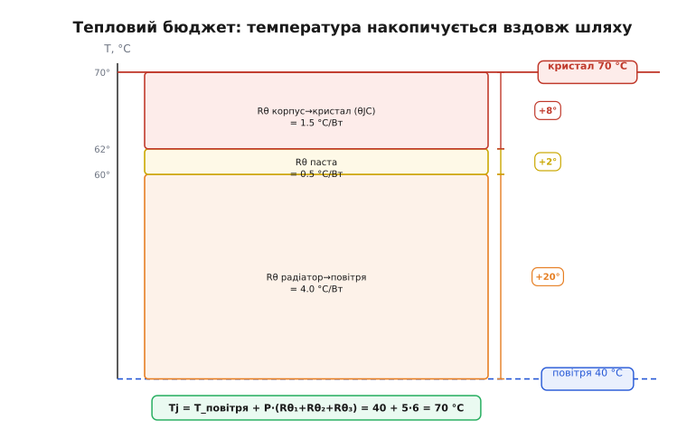
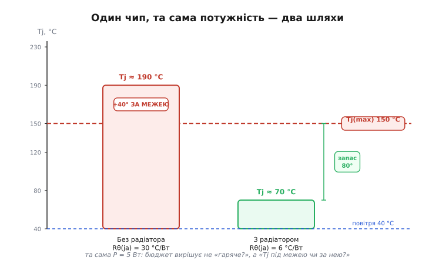
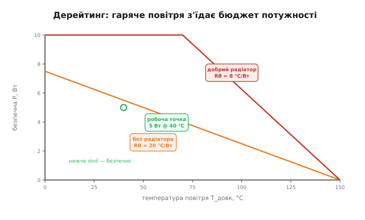

# Тепловий бюджет системи

<preknowlist>
- [Тепловий опір](topic:physics/thermal-resistance) — Rθ (°C/Вт) зв'язує перегрів із потужністю: ΔT = P·Rθ, а опори ланок уздовж шляху додаються поспіль; на цій одній формулі тримається весь бюджет.
</preknowlist>

Ми вже вміємо рахувати один тепловий опір і знаємо, якими трьома шляхами тепло тікає з деталі. Та реальна плата не складається з однієї деталі та одного шляху. На ній сидить регулятор, що гріється на ват, поряд — підсилювач на пів вата, десь у кутку — резистор, який спокійно розсіює свою чверть. Усе це замкнено в корпус, який літом стоїть на сонці, а зимою — у прохолодній кімнаті. Питання вже не «чи нагріється ця деталь», а інше, інженерне: **чи виживе вся система в найгірших умовах, які їй трапляться** — і якщо ні, де саме треба втрутитися.

Саме на це відповідає **тепловий бюджет** (*thermal budget*) — облік, який зводить докупи всі джерела тепла, усі шляхи його відведення й усі межі, що їх не можна переступати. Слово «бюджет» тут не випадкове: як у грошах ви звіряєте, чи стане доходу на витрати, так і тут ви звіряєте, чи стане здатності відвести тепло на ту потужність, що виділяється. Перевитратив грошей — борг; перевитратив тепло — згоріла деталь. І рахунок цей, на щастя, простий, бо стоїть на одному рівнянні, яке ми вже знаємо.

## Одне рівняння, на якому тримається весь облік

Згадаймо головний інструмент. Тепловий опір зв'язує три величини так само, як закон Ома зв'язує напругу, струм і опір:

> 🔧 Тепловий опір Rθ (в °C/Вт) каже, на скільки градусів нагріється тіло на кожен ват потужності, що крізь нього тече: ΔT = P·Rθ. Геометрично він — буквальний двійник електричного опору: Rθ = L/(k·A), де довший шлях гальмує тепло, а товщий і теплопровідніший — пропускає. Деталі — [тепловий опір і відведення тепла](topic:physics/thermal-resistance).

```
ΔT = P · Rθ

ΔT — перегрів над опорною точкою (°C)
P  — потужність, що розсіюється у вигляді тепла (Вт)
Rθ — тепловий опір шляху (°C/Вт)
```

Це і є вся арифметика бюджету. Уся складність — не в формулі, а в тому, **що підставити** в кожну букву: звідки береться P, з яких ланок складається Rθ і яку межу ставить виробник на кінцеву температуру. Розберімо по черзі — і складемо повний рахунок.

## P: скільки тепла насправді виділяється

Перша буква — потужність. Тут легко помилитися, бо не вся потужність, яку споживає деталь, перетворюється на тепло. Резистор — так, він увесь свій ват віддає теплом, бо саме розсіювання й є його робота. А от регулятор напруги частину потужності віддає **корисно** в навантаження, і гріє його лише **різниця** між тим, що ввійшло, і тим, що вийшло.

Найясніше це видно на лінійному стабілізаторі. Він тримає на виході нижчу напругу, ніж на вході, а зайве «спалює» на собі:

**Скільки гріється лінійний стабілізатор.** Вхід 5 В, вихід 3.3 В, навантаження тягне 0.5 А. Стабілізатор пропускає той самий струм наскрізь, а різницю напруг гасить на собі:

```
P = (U_вх − U_вих) · I = (5 − 3.3) · 0.5
P = 1.7 · 0.5 = 0.85 Вт
```

Майже ват тепла з крихітного корпусу — і це при тому, що в навантаження пішло лише 3.3 · 0.5 = 1.65 Вт. Третина всієї потужності стала теплом просто тому, що ми «опускали» напругу лінійно. Чому імпульсний перетворювач у цьому місці поводиться інакше й гріється куди менше — окрема велика тема, але саме звідси росте його перевага; докладніше — [лінійний проти імпульсного](root:embedded/linear-vs-switching).

> 🔧 **Навіщо це.** Перше, що треба зробити у тепловому бюджеті, — чесно порахувати P для кожного гарячого вузла, і саме **теплову** частину, не повну споживану. Для резистора це I²·R, для діода — приблизно U_пряма·I, для лінійного регулятора — (U_вх−U_вих)·I плюс власне споживання, для ключа на транзисторі — втрати провідності I²·R_ON плюс втрати перемикання. Помилитися тут означає закласти бюджет на половину реального тепла — і здивуватися, чому плата гаряча.

Окремо варто згадати, що багато деталей працюють **не весь час**. Світлодіод, що блимає, гріється лише поки світить; передавач радіо гріється лише в моменти передачі. Якщо деталь увімкнена малу частку часу, її **середня** теплова потужність менша за пікову рівно в стільки ж разів — і саме середню беруть у бюджет для повільних теплових процесів. Як рахувати цю частку часу, ми вже бачили на струмі споживання: та сама ідея робочого циклу працює й для тепла; основу дає [споживання плати](root:embedded/board-consumption). Але обережно: для коротких потужних імпульсів самого усереднення замало — кристал може встигнути перегрітися за один імпульс ще до того, як «середнє» щось скаже. Цю тонкість лишимо детальній версії; у базовому бюджеті повільних процесів беремо середню потужність.

## Rθ: ланки шляху додаються поспіль

Друга буква — тепловий опір. І тут головна ідея бюджету, заради якої він взагалі існує. Тепло від кристала не зникає на місці — воно проходить **дорогу** до повітря, і ця дорога складається з кількох відрізків, кожен зі своїм опором. Кристал → внутрішній кріплення → корпус → термопаста → радіатор → повітря. На кожному відрізку працює своя фізика (всередині — кондукція крізь тверде, наприкінці — конвекція з ребер; повний розбір — [три шляхи тепла](root:embedded/heat-transfer)), але для бюджету важливе одне: **усі ці опори стоять послідовно**, тож вони просто додаються.

```
Rθ(сумарний) = Rθ₁ + Rθ₂ + Rθ₃ + …
```

Це той самий принцип, що й послідовні електричні опори — і не випадково, бо тепловий опір і є двійником електричного. Потік тепла, як струм, тече одним руслом крізь усі ланки поспіль, тож кожна додає свій перепад температури. А коли опори додаються, **загальний перегрів накопичується** вздовж шляху: біля повітря деталь має температуру довкілля, а до кристала температура піднімається на суму всіх ΔT кожної ланки.


*Та сама потужність тече крізь усі ланки поспіль, і кожна підіймає температуру на свою частку P·Rθ. Знизу — температура повітря; вгору, ланка за ланкою, рівень росте до температури кристала. Видно одразу головне: найбільший стрибок дає ланка з найбільшим Rθ — тут це «радіатор → повітря», і саме на неї варто тиснути передусім.*

Виробник деталі зазвичай уже зводить внутрішні ланки в одне число. У даташиті ви знайдете два ключові значення теплового опору, і за ними стоїть міжнародний стандарт вимірювання (родина JEDEC JESD51 — щоб числа різних виробників можна було чесно порівнювати):

- **θJC** (junction-to-case, кристал → корпус) — опір від кристала до зовнішньої поверхні корпусу. Мале число (часто менше за °C/Вт у силових корпусів) — це той шлях, яким тепло виходить **назовні**, до радіатора.
- **θJA** (junction-to-ambient, кристал → повітря) — опір усього шляху аж до повітря, **без** зовнішнього радіатора, коли деталь просто стоїть на платі. Велике число (десятки, а то й сотні °C/Вт у дрібних корпусів) — бо крихітна власна поверхня корпусу віддає тепло повітрю кволо.

Ці два числа — два сценарії. θJA каже, що буде, якщо нічого не доробляти. θJC каже, з якого опору ви **стартуєте**, коли вирішуєте додати радіатор: до θJC ви тоді доточуєте опір пасти й опір самого радіатора, і всі вони знову додаються.

> 🔧 **Навіщо це.** Коли в даташиті ви бачите «θJA = 60 °C/Вт» — це вирок для голого корпусу: кожен ват підніме кристал на 60 градусів над повітрям. Пів вата — і кристал уже на 30° гарячіший за кімнату; ват — на 60°. Подивившись на θJA ще на етапі вибору деталі, ви відразу бачите, чи вистачить їй власного корпусу, чи доведеться думати про радіатор або ширші мідні полігони. Це число — перша теплова характеристика, яку треба знайти в даташиті, поряд із Tj(max).

## Межа: Tj(max), якої не можна переступати

Третій складник бюджету — не змінна формули, а **стеля**. У кожної напівпровідникової деталі є максимальна температура кристала, **Tj(max)** (*maximum junction temperature*; «junction» — той самий p-n перехід, серце деталі), за якою кремній перестає поводитися як належить, а далі й руйнується. Для звичайної цифрової мікросхеми це зазвичай близько 150 °C; багато силових транзисторів і діодів витримують до 175 °C, окремі — навіть 185 °C. Якщо в даташиті межа не вказана взагалі, інженери за замовчуванням беруть консервативні 150 °C.

Весь бюджет зводиться до однієї нерівності, яку треба виконати:

```
Tj = T_довк + P · Rθ(ja)  ≤  Tj(max)
```

Зліва — температура, до якої реально нагріється кристал у роботі: довкілля плюс увесь накопичений перегрів. Справа — межа виробника. Якщо ліва частина менша — система виживе; якщо більша — деталь перегріється, і питання лише в тому, **за скільки часу** вона помре. Звідси видно й чому довкілля так важливе: воно входить у Tj прямим доданком. Та сама плата з тим самим тепловиділенням, що спокійно живе при 25 °C у кімнаті, може переступити межу при 60 °C усередині закритого корпусу під сонцем — бо стартова точка піднялася на 35 градусів, і весь перегрів тепер відлічується від неї.

**Чи виживе регулятор без радіатора.** Той самий стабілізатор із P = 0.85 Вт, корпус із θJA = 60 °C/Вт, найгірше довкілля в корпусі пристрою — 55 °C. Перевіримо нерівність:

```
Tj = T_довк + P · θJA = 55 + 0.85 · 60
Tj = 55 + 51 = 106 °C
```

106 °C проти межі 150 °C — формально проходить, запас 44 градуси. Але якби довкілля було не 55, а 70 °C (закритий корпус, сонце), вийшло б 121 °C — усе ще під межею, проте запас тане. А якби струм виріс удвічі (P = 1.7 Вт), дістали б 55 + 1.7·60 = 157 °C — **за межею**, деталь горить. Той самий регулятор, ті самі θJA — а доля залежить від того, які найгірші умови ми чесно заклали в бюджет.

## Запас: чому не можна впритул до межі

Тут криється найважливіша інженерна звичка. Виконати нерівність Tj ≤ Tj(max) **впритул** — погана ідея, навіть якщо математика формально сходиться. Причин дві, і обидві серйозні.

Перша — **надійність**. Кремній не «працює до 150 і вмикає лампочку на 151». Чим гарячіший кристал, тим швидше деградують матеріали деталі, і залежність ця крута. Груба, але вкорінена в практику оцінка: кожні зайві 10 °C приблизно вдвічі вкорочують строк життя деталі. Цей орієнтир походить із рівняння Арреніуса для швидкості хімічних процесів (швед Сванте Арреніус, кінець XIX століття) і найточніше працює для електролітичних конденсаторів, де висихає електроліт; для напівпровідників він грубіший і має винятки, тож «вдвічі на 10 °C» — це правило великого пальця, а не закон. Але напрям певний: гарячіше — недовговічніше. Деталь, що живе на 145 °C, формально «в межах», та її ресурс — частка від того, що вона мала б на 100 °C.

Друга — **невизначеність самого рахунку**. Кожне число в бюджеті відоме приблизно. θJA в даташиті виміряне на стандартній тестовій платі з певною міддю — у вашій платі мідь інша. Термопасту нанесли тонше чи товще, ніж в ідеалі. Довкілля може виявитися гарячішим за розрахункове. Потужність у піку більша за середню. Кожна така дрібниця штовхає Tj вгору, і якщо ви сиділи впритул до межі — будь-яка з них вас за неї виштовхне.

Тому в тепловому бюджеті завжди закладають **запас** (*margin*, *derating*): цілять не в Tj(max), а помітно нижче. Поширена практика — тримати робочу температуру кристала десь на рівні 80% від абсолютної межі (для 150 °C це близько 120 °C, для 175 °C — близько 140 °C) або й нижче, якщо пристрій має жити роками. Бюджет, що сходиться з нерівністю «менше або дорівнює межі», але без запасу, — це не бюджет, що збалансувався, а бюджет, що от-от лусне.


*Та сама деталь, та сама P — але без радіатора (великий Rθ) кристал злітає за межу Tj(max), а з радіатором (малий Rθ) лишається під нею із запасом. Бюджет вирішує не питання «гаряче чи холодно», а саме це: робоча температура кристала під червоною лінією чи над нею — і наскільки далеко.*

## Як радіатор повертає бюджет у норму

Коли нерівність не сходиться, у вас три важелі — і всі три видно прямо у формулі Tj = T_довк + P·Rθ.

Можна **зменшити P**: узяти імпульсний перетворювач замість лінійного, транзистор із меншим опором у відкритому стані, рідше вмикати деталь. Можна **знизити T_довк**: провітрити корпус, відсунути гарячу деталь від інших джерел тепла. Але найчастіший важіль — **зменшити Rθ**, і саме для цього існує радіатор.

Радіатор не робить нічого магічного. Він просто **підмінює** велике θJA голого корпусу на куди менший сумарний опір: θJC (кристал → корпус, мале, нікуди не дінешся) плюс опір термопасти (малий, якщо пасти тонко й без повітря) плюс опір самого радіатора (тим менший, чим більша площа ребер і чим сильніший обдув). Усі троє додаються — і навіть так сума виходить у рази меншою за θJA, бо величезну власну «кволість» дрібного корпусу ми обійшли, давши теплу широку дорогу в повітря.

**Який радіатор потрібен.** Силовий транзистор розсіює P = 5 Вт, θJC = 1.5 °C/Вт, термопаста додає 0.5 °C/Вт, довкілля 40 °C. Хочемо тримати кристал не вище 110 °C (запас від межі 150 °C). Який тепловий опір радіатора Rθ(hs) допустимий?

```
Спершу — який сумарний Rθ можна дозволити:
Rθ(ja) ≤ (Tj − T_довк) / P = (110 − 40) / 5 = 14 °C/Вт

Відняти ланки, які вже зайняті:
Rθ(hs) ≤ Rθ(ja) − θJC − Rθ(паста) = 14 − 1.5 − 0.5 = 12 °C/Вт
```

Отже, годиться будь-який радіатор з опором до 12 °C/Вт — а це скромний радіатор, такі легко знайти. Перевіримо протилежне: **без** радіатора, з θJA того ж корпусу ≈ 40 °C/Вт, було б Tj = 40 + 5·40 = 240 °C — деталь миттєво згоряє. Радіатор збив сумарний опір із 40 до приблизно 14 °C/Вт і повернув кристал у безпечну зону. Числа корпусів і радіаторів тут — приклад; конкретні значення завжди беруть із даташита деталі та каталогу радіатора.

> 🔧 **Навіщо це.** Розрахунок радіатора — це віднімання: від дозволеного сумарного Rθ відняти те, що вже з'їли кристал і паста, а решта — це стеля для радіатора. Якщо ця стеля виходить дуже малою (одиниці чи частки °C/Вт), пасивного радіатора замало — потрібен обдув, бо саме вентилятор найдужче зменшує останню, найбільшу ланку «радіатор → повітря». А якщо стеля від'ємна — це сигнал, що жодним радіатором не врятуватися й треба зменшувати саму потужність.

## Бюджет залежить від довкілля: дерейтинг

Є ще один бік бюджету, який легко проґавити, дивлячись лише на кімнатну температуру. Оскільки T_довк входить у Tj прямим доданком, **максимальна потужність, яку деталь може безпечно розсіяти, залежить від температури повітря**. Чим гарячіше довкілля, тим менше «місця» лишається до Tj(max) — і тим менше тепла можна виділяти.

Перепишемо нерівність відносно P:

```
P(макс) = (Tj(max) − T_довк) / Rθ
```

Видно: коли T_довк росте, чисельник тане, і гранична потужність падає **лінійно** — від повної при прохолодному повітрі до нуля, коли довкілля саме дотягується до Tj(max) (там уже нічого не можна виділяти, бо кристал і так на межі). Саме цю залежність даташити малюють графіком, який називають **кривою дерейтингу** (*derating curve*): пряма, що спадає від певної температури до нуля. Робоча точка пристрою — його потужність при його найгіршому довкіллі — мусить лежати **під** цією прямою.


*Безпечна потужність лінійно спадає з температурою повітря: що гарячіше довкілля, то менше тепла можна виділити, перш ніж кристал дотягнеться до Tj(max). Менший тепловий опір (добрий радіатор) задирає всю пряму вгору — за тієї ж температури дозволяє більшу потужність. Робоча точка має лишатися нижче лінії; запас до неї — це той самий margin.*

Ось чому пристрій, що ідеально працює на столі в лабораторії при 23 °C, може почати збоїти в полі літнього дня при 45 °C у тіні (а в закритому корпусі — і всі 60). Нічого не зламалося — просто бюджет, порахований для кімнати, не врахував гарячого довкілля, і деталь з'їхала з-під кривої дерейтингу. Тому в чесному бюджеті за T_довк беруть **найгірше реальне** довкілля, у якому пристрій працюватиме, а не комфортну кімнату.

## Складаємо повний бюджет системи

Дотепер ми рахували по одній деталі. Тепловий бюджет **системи** робить те саме для всієї плати — і додає до картини два спільні ефекти, яких немає в окремій деталі.

Перший: **деталі гріють одна одну**. Повітря всередині корпусу спільне, і кожен ват, виділений будь-де, піднімає його температуру. Тому T_довк для кожної деталі — це не зовнішня кімната, а **внутрішня** температура корпусу, яка вже піднята сумарним тепловиділенням усіх сусідів. Гарячий регулятор підігріває повітря навколо чутливого давача; той бачить «довкілля» гарячішим, ніж надворі. Звідси проста, але важлива дія: рознести гарячі деталі, не ставити їх упритул до тих, кому важлива температура.

Другий: **сумарне тепло має кудись подітися з корпусу**. Скільки б ват ви не виділили всередині, врешті вони мусять вийти крізь стінки в зовнішнє повітря — а в корпусу теж є свій тепловий опір «нутро → зовнішнє повітря». Якщо всередині набирається, скажімо, 8 Вт, а корпус відводить їх із опором 5 °C/Вт, то нутро встановиться на 8·5 = 40 градусів вище за вуличне повітря — і саме від цієї піднятої температури кожна деталь починає свій власний відлік. Тому бюджет системи рахують у два яруси: спершу — наскільки сумарна потужність підігріває нутро корпусу над зовнішнім повітрям, а потім — наскільки кожен кристал піднімається над цим нутром.

Покроковий план чесного теплового бюджету виходить такий:

1. Для кожного гарячого вузла порахувати **теплову** P (не повну споживану).
2. Знайти Tj(max) і θJA (чи θJC) кожного з даташита.
3. Скласти сумарну потужність і оцінити, наскільки вона підігріє **нутро корпусу** над зовнішнім повітрям.
4. Для кожної деталі взяти за T_довк цю піднятy внутрішню температуру й порахувати Tj = T_довк + P·Rθ.
5. Звірити кожне Tj з його Tj(max) — і не впритул, а **із запасом** (цілитися нижче, типово ~80% межі).
6. Де нерівність не сходиться — застосувати важіль: менша P, нижче T_довк (вентиляція, рознесення деталей) або менший Rθ (радіатор, ширші мідні полігони, обдув).

> 🔧 **Навіщо це.** Тепловий бюджет роблять **на папері до того**, як замовлено плату, — бо переробляти залізо через перегрів довго й дорого, а порахувати ΔT = P·Rθ для кожного вузла — кілька рядків. Якщо хоч один вузол не проходить із запасом, краще дізнатися про це зараз: додати радіатор, обрати ефективніший перетворювач, рознести деталі чи закласти вентилятор — усе це рішення етапу проєктування, а не паніки над гарячою платою, що вимикається в полі.
