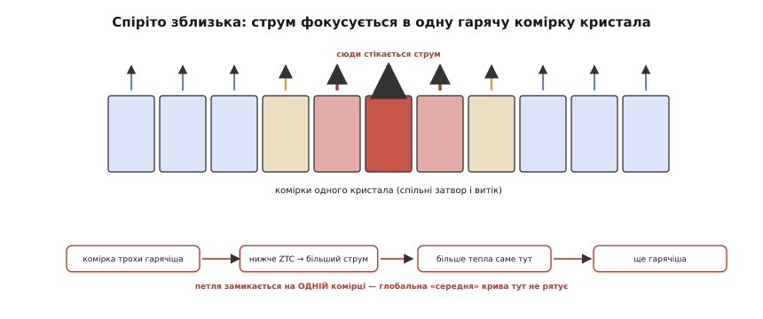
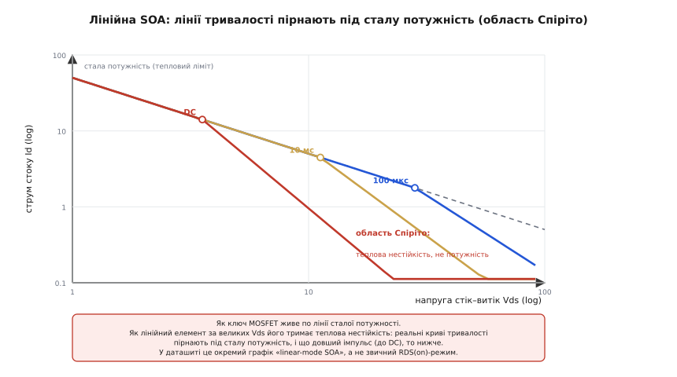
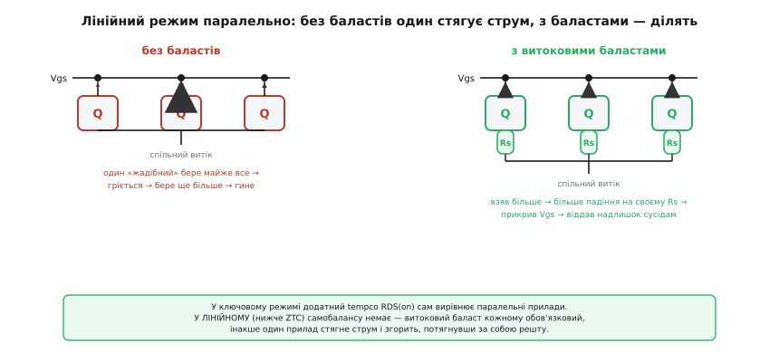

# 🔌 MOSFET у лінійному режимі: клас, що гине не там, де здається

У темі ми вже впритул підійшли до неприємної правди: MOSFET, який чудово служить **ключем**, у **лінійному** режимі поводиться зовсім інакше — і поширений міф «MOSFET сам себе балансує, у розгін не піде» там просто хибний. Ми побачили, де криві Id(Vgs) холодного й гарячого кристала перетинаються в точці ZTC, і що **нижче** неї гарячий прилад за тієї самої напруги затвора бере **більший** струм. Цього досить, щоб зрозуміти небезпеку. Але між «розумію небезпеку» і «обрав правильний транзистор і не спалив плату» лежить ще один шар — суто практичний: **як це читається в даташиті, де саме там захована точка ZTC, чому прилад із наднизьким Rds(on) у цій ролі гірший, і що робити, якщо MOSFET таки муситиме довго сидіти в лінії**. Цим шаром ми тут і займемося.

Це **узагальнений клас**, а не конкретний партномер: усе нижче однаково справджується для будь-якого N-канального силового MOSFET будь-якого виробника. Конкретні моделі різняться напругою, струмом і шириною безпечної області — але кістяк поведінки, ніжки, спосіб увімкнення й граблі в усьому класі ті самі, і саме їх варто тримати в голові, обираючи прилад для прохідного елемента, обмежувача пускового струму чи активного навантаження.

## Що означає «лінійний режим» і чим він відрізняється від ключа

Спершу домовмося про слова, бо плутанина тут коштує приладів. Інженери кажуть «лінійний режим» (англ. *linear mode*), маючи на увазі не «лінійну ділянку» вихідних характеристик, а зовсім інше: режим, де MOSFET **навмисне тримають напіввідкритим** і він одночасно несе **помітну напругу стік–витік і помітний струм**. Польовий транзистор має три способи жити, і їх легко переплутати:

- **Замкнений** (англ. *cut-off*): Vgs нижче порога, каналу нема, струм нуль — тепла нема.
- **Повністю відкритий ключ** (омічна, або тріодна ділянка): Vgs високе, канал широкий, прилад поводиться як маленький резистор Rds(on). Напруга на ньому мала (струм × Rds(on)), тож і тепло мале. **Це режим, у якому MOSFET проводить більшість свого життя в цифровій і силовій техніці.**
- **Активний** (англ. *saturation* у польовій термінології, він же лінійний режим у мові силовиків): Vgs трохи над порогом, прилад тримає струм майже **незалежно від Vds**, як кероване джерело струму. Тут на ньому водночас велика напруга й чималий струм — а отже **велика розсіювана потужність прямо на кристалі**.

> 🔧 **Навіщо це.** Уся небезпека класу — у третьому режимі, і саме туди MOSFET потрапляє в найкорисніших захисних схемах: прохідний транзистор лінійного стабілізатора, що спалює різницю вхід-вихід; обмежувач пускового струму, що тримає велику напругу, поки повільно заряджає вихідну ємність; активне навантаження для тесту блока живлення; ключ, який ми навмисне відкриваємо плавно, щоб не вдарити струмом. У кожному з них прилад **мусить** сидіти в активному режимі секунди чи й постійно — і саме там його обирають за зовсім іншим параметром, ніж ключ.

Ключова відмінність, яку ми вивели в темі, повторюється тут уже як робочий критерій. Повністю відкритий ключ нагрівається — його опір Rds(on) **росте** (додатний tempco), він починає трохи більше падати напруги, але струм у ключовому застосуванні задає зовнішнє коло, а не сам транзистор, тож петля не замикається: гарячіший ключ просто трохи тепліший, і все. У **активному** ж режимі струм задає **сам прилад** через Vgs — і ось тут нагрів, знижуючи поріг, піднімає струм, що піднімає тепло. Петля замикається. Це та сама петля додатного зворотного зв'язку, яку ми розбирали для всієї теми; механізм для біполярного транзистора, з якого вона історично відома, докладно розкритий окремо.

> Петля «нагрів → струм ↑ → потужність ↑ → ще нагрів» втікає, коли її підсилення за оберт (∂P/∂Tj)·θ досягає одиниці; для BJT за сталої напруги зміщення її жене −2 мВ/°C коефіцієнт Vbe, а гасять емітерним резистором і радіатором. Той самий каркас думки прикладемо до MOSFET. Деталі — [теплова втеча біполярного транзистора](root:hw-components/bjt-thermal-runaway).

## Де насправді ховається ZTC і чому tempco під нею додатний

У темі ми побачили перетин кривих і назвали точку ZTC. Тепер розберімо **чому** він узагалі існує — бо без цього не зрозуміти, чому в одних приладів він лежить зручно низько, а в інших небезпечно високо.

Струм стоку в активному режимі тягнуть угору й вниз дві протилежні температурні залежності, і ZTC — точка, де вони рівно гасять одна одну:

```
Чинник               напрямок із нагрівом      що робить зі струмом
─────────────────────────────────────────────────────────────────
рухливість носіїв    падає (решітка «густіша»)  тягне струм ВНИЗ
поріг Vth            падає (≈ −2…−6 мВ/°C)       тягне струм ВГОРУ
```

Рухливість (англ. *mobility* — наскільки легко носії рухаються в кристалі) з нагрівом **падає**: гарячіша кристалічна решітка дужче розсіює носії, тож за тієї самої напруги канал проводить **гірше**. Це той самий механізм, що робить додатним tempco Rds(on) повністю відкритого ключа, — і саме він рятує ключ. Але є й другий чинник: поріг відкривання Vth із нагрівом теж **падає** (типово на кілька мілівольт на градус). А нижчий поріг означає, що за тієї самої напруги затвора канал прочиняється **ширше** — струм росте.

Хто переможе — залежить від того, **наскільки високо над порогом** ми тримаємо затвор:

- За **малого Vgs** (трохи над порогом — це і є лінійний режим) рушієм струму є саме близькість до порога. Тут зсув порога на кілька мілівольт міняє струм відчутно, а втрата рухливості ще мало важить. Перемагає поріг → **гарячіший бере більший струм → tempco додатний → петля може втекти.**
- За **великого Vgs** (ключ навстіж) канал уже широко відкритий, поріг майже не впливає на струм, зате втрата рухливості б'є на повну. Перемагає рухливість → **гарячіший бере менший струм → tempco від'ємний → прилад сам стабілізується.**

ZTC — рівно та напруга затвора, де ці двоє в нічию. Нижче неї працювати в активному режимі **небезпечно**, вище — **безпечно**. І ось практичний наслідок, який легко проґавити: у деяких приладів за досить високого Vgs ZTC **зникає взагалі** — і в лінійному, і в активному режимі tempco стає від'ємним. Але це саме «досить високо», а реальний лінійний застосунок майже завжди сидить **низько**, під ZTC. Тому правило просте: **якщо не довів аналізом протилежне — вважай, що в лінійному режимі ти під ZTC, тобто в небезпечній зоні.**

> 🔧 **Навіщо це.** Знати, *де* ZTC, потрібно не з цікавості. Якщо робоча точка вашого лінійного елемента (та пара Vgs, Id, що тримає прилад) лежить **вище** ZTC — петля сама затухає, і прилад термостабільний без жодних хитрощів. Якщо **нижче** — потрібен або баласт, або інший прилад, або обидва. Перше, що дивишся в даташиті для лінійної ролі, — чи показано там графік передавальної характеристики Id(Vgs) для двох температур, і де вони перетинаються. Перетин і є ваш ZTC; де відносно нього сидить робоча точка — те й вирішує долю схеми.

Сам параметр, що зв'язує приріст Vgs із приростом струму, — це крутість, або передавальна провідність (англ. *transconductance*) gm = ∂Id/∂Vgs. Вона ж — головна підказка, чому наступний герой нашої розмови, прилад із наднизьким Rds(on), у лінійному режимі найгірший.

> Крутість gm показує, на скільки міліампер зміниться струм стоку на кожен мілівольт затвора. Що вища gm, то «нервовіший» прилад: дрібна зміна Vgs (хоч від сигналу, хоч від теплового зсуву порога) дає велику зміну струму. Докладно — [крутість (transconductance)](root:hw-analog/transconductance).

## Чому прилад із наднизьким Rds(on) — найгірший вибір для лінії

Тут — серце всієї вставки, бо саме на цьому місці гинуть плати. Інтуїція інженера підказує брати «найкращий» MOSFET: із якнайнижчим Rds(on), бо ж менший опір — менше втрат. Для ключа це правда. Для лінійного режиму це **прямий шлях до диму**, і причина глибша за просту арифметику tempco.

Як виробник домагається наднизького Rds(on)? Він робить на кристалі **дуже багато дрібних паралельних комірок** і дає їм **низький поріг та високу крутість**. Кожна комірка — крихітний транзистор; тисячі їх паралельно дають широченний канал і мізерний опір. Чудово для ключа. Але та сама конструкція в активному режимі дає три біди заразом:

**Перша — ZTC сидить високо.** Висока крутість і низький поріг means: зсув порога від нагріву дуже сильно впливає на струм, і щоб рухливість його переважила, треба загнати затвор дуже високо. Тому точка нічиєї відсувається вгору. А реальний лінійний застосунок працює низько, під нею, — тобто **гарантовано в небезпечній зоні з додатним tempco**. Старий, «повільний» прилад із вищим порогом мав ZTC нижче, і частина лінійного діапазону в нього була термостабільна; сучасний low-Rds(on) цю розкіш забрав.

**Друга, і головна — струм фокусується в одну комірку.** Ось де інтуїція про «середній» tempco ламається остаточно. Кристал **не ізотермічний**: через нерівномірність комірок, неоднакову тепловіддачу й розтікання тепла від дротяних виводів якась мікроскопічна ділянка завжди трохи гарячіша за решту. Якщо весь прилад сидить під ZTC, ця трохи гарячіша комірка має локально **додатний** tempco — і бере **більший** струм, ніж її сусіди за тієї самої спільної напруги затвора. Більший струм у ній — більше тепла **саме там** — вона ще гарячіша — бере ще більше. Струм **стягується** з усього кристала в один вузький розжарений канал, доки той не проплавиться. І ось ключове: прилад може гинути, навіть якщо **за середньою температурою всього кристала** робоча точка виглядає безпечно. Гине не «середній» прилад — гине одна комірка, у якій замкнулася локальна петля.


*Спіріто зблизька. Кристал не однорідно теплий: трохи гарячіша комірка, працюючи під ZTC, має локально додатний tempco й тягне більший струм за тієї самої спільної напруги затвора. Струм стягується з усього кристала в один розжарений канал, доки той не проплавиться. Глобальна «середня» крива тут не рятує — петля замикається на одній комірці.*

**Третя — менший кристал гірше тримає тепло.** Наднизький Rds(on) часто означає менший за площею кристал у тому самому корпусі (бо опір малий і так). Менша площа — гірше розтікання тепла, вища густина потужності в гарячій точці, гостріша теплова нестійкість. Прилад, оптимізований під найменший опір, водночас оптимізований під найгірше тримання локального перегріву.

Цю катастрофу — раптовий обрив безпечної області в активному режимі через фокусування струму — за межами теплового ліміту вперше детально описав і змоделював **Паоло Спіріто (Paolo Spirito) з Університету Неаполя імені Федеріко II** з колегами на початку 2000-х; відтоді її кличуть **ефектом Спіріто** (англ. *Spirito effect*), а відмови — Spirito-mode. *(Усталений факт; явище й термін загальновизнані в галузевих апнотах і наукових працях. Спіріто — італійський дослідник, університет у Неаполі.)* Промислове формулювання тих самих праць звучить так само, як наш висновок: що дужче виробники піднімають крутість заради нижчого Rds(on), то охочіше прилад відмовляє через нестійкі гарячі точки в лінійному режимі.

> 🔧 **Навіщо це.** Це найдорожча помилка класу, і її роблять знов і знов. Береш «хороший» MOSFET із мінімальним опором каналу, ставиш його прохідним елементом обмежувача чи активним навантаженням — у ролі ключа він ідеальний, а тут гине на першому ж серйозному пуску, бо в нього вузька лінійна область і він охоче фокусує струм. Тверде правило: **для лінійної ролі прилад добирають за областю безпечної роботи в лінійному режимі, а Rds(on) — справа десята** (він важить лише для тепла повністю відкритого ключа, а не для виживання в активному режимі). Низький опір тут не перевага, а тривожний знак: майже завжди він іде в парі з вузькою лінійною SOA.

## Як читати лінійну SOA (FBSOA) у даташиті

Тепер перейдімо до самого даташита й навчімося бачити те, на чому горять. Графік, що нам потрібен, зветься **SOA** (англ. *safe operating area* — безпечна робоча область), а для прямозміщеного приладу — **FBSOA** (*forward-bias SOA*). Це межа на площині «струм стоку Id — напруга стік–витік Vds», у логарифмічних осях, усередині якої прилад гарантовано виживає.

> Сама ідея SOA — спільна межа за струмом, напругою, потужністю й часом, всередині якої силовий прилад не руйнується, — це окрема базова тема. Тут нам потрібна лише її лінійна частина. Загальний огляд — [безпечна робоча область (SOA)](root:hw-components/soa-power-devices).

Картинка SOA складена з кількох прямих, і кожна — окрема фізична межа:

```
межа на графіку SOA      що обмежує            форма лінії (log–log)
──────────────────────────────────────────────────────────────────
горизонтальна вгорі      максимальний струм     горизонталь
похила під 45°           Rds(on): Id ≤ Vds/Rdson  пряма, нахил +1
похила під −45°          стала потужність         пряма, нахил −1
вертикаль праворуч       пробій Vds(max)          вертикаль
ще нижча похила          ТЕПЛОВА НЕСТІЙКІСТЬ      падає крутіше за −1
```

Перші чотири лінії — звичні, їх має кожен силовий прилад. А ось остання, **нижча за лінію сталої потужності**, — це і є слід ефекту Спіріто, і саме її треба навчитися бачити. Логіка така. Лінія сталої потужності Vds·Id = const — це проста теплова межа: скільки тепла кристал з корпусом устигають відвести. Якби MOSFET тримала лише вона, безпечна область за великих Vds обмежувалася б цією прямою. Але через фокусування струму прилад **гине раніше** — реальна межа провисає **під** лінію сталої потужності. І найважливіше для читання даташита: **наскільки нижче — залежить від тривалості**.


*Як читати лінійну SOA. Короткий імпульс (100 мкс) майже весь іде по лінії сталої потужності — встигає лише локально нагрітися. Що довший імпульс (10 мс і далі DC), то раніше крива відходить **вниз** від сталої потужності: за великих Vds прилад тримає вже не потужність, а теплова нестійкість, і часу на фокусування струму дедалі більше. У даташиті це окремий графік «linear-mode SOA» з кривими за тривалістю — а не звичний графік Rds(on).*

Чому форма саме така? Короткий імпульс (мікросекунди) кристал переживає майже по лінії сталої потужності: за такий час локальна гаряча точка не встигає глибоко розігнатися, і обмежує лише загальний нагрів. Що довший імпульс — то більше часу петля фокусування має на розгін, то нижче доводиться опускати дозволену межу. У **DC**-режимі (прилад тримає лінію постійно) теплова нестійкість обмежує струм **за будь-якої напруги** — крива провисає найглибше. Тому на графіку лінійної SOA малюють **сімейство кривих за тривалістю**: 100 мкс, 1 мс, 10 мс, 100 мс, DC — і що довша ваша робоча тривалість, то нижчу криву треба брати.

Звідси — практичний порядок читання даташита для лінійної ролі:

1. **Знайди графік SOA — і переконайся, що там є криві за тривалістю, а не лише одна лінія потужності.** Якщо виробник дає тільки лінію сталої потужності без провисання — або прилад справді з широкою лінійною областю (рідкість, зазвичай про це сказано прямо), або даташит просто не показує лінійну межу, і брати такий прилад у лінію наосліп **не можна**.
2. **Визнач свою робочу точку: яке максимальне Vds прилад тримає одночасно з яким Id і **як довго**.** Для обмежувача пускового струму це повна вхідна напруга × піковий струм заряду × час наростання виходу. Для лінійного стабілізатора чи активного навантаження це часто **DC**.
3. **Поклади свою точку на графік і знайди криву своєї тривалості.** Точка має лежати **під** нею з запасом. Лежить вище — прилад не виживе.
4. **Зведи це з реальною температурою корпуса.** Графік даний для певної температури корпуса (звично 25 °C); за гарячішого корпуса всю SOA треба **знизити** — про це окремо нижче.

> 🔧 **Навіщо це.** Найпідступніше в цьому графіку — те, що половину приладів він *взагалі не показує* лінійну межу, бо вони на лінію не розраховані, і виробник про це мовчить графіком. Інженер бачить гарну лінію потужності, кладе на неї точку — і не здогадується, що реальна межа на порядок нижча. Тому перший крок — не «чи влізає моя точка», а «чи є тут узагалі криві за тривалістю». Немає — це сигнал, що прилад ключовий, і в лінію його брати не можна без спеціальної перевірки.

## Що робити, коли MOSFET таки муситиме сидіти в лінії

Припустимо, аналіз показав: робоча точка лізе за лінійну SOA одного приладу. Є три важелі, і часто їх застосовують разом.

**Важіль перший — спеціальний linear-mode MOSFET.** Виробники роблять окремий клас приладів, навмисне оптимізованих під **широку лінійну SOA** замість найнижчого Rds(on). Їх конструюють так, щоб теплова нестійкість наставала якнайпізніше: ширший кристал, інша геометрія комірок, нижча крутість, ZTC посунутий нижче — усе протилежне до гонитви за опором. У даташиті такого приладу графік SOA показує криву DC, що йде майже по лінії потужності, а не круто провисає, і часто є явний підпис на кшталт «linear mode» чи «wide SOA». Заплатиш вищим Rds(on) і ціною — здобудеш живучість у лінії. Для серйозного лінійного елемента це найчистіше рішення: один правильний прилад замість боротьби з фокусуванням струму.

**Важіль другий — кілька приладів паралельно з баластами.** Якщо одного приладу замало по теплу, ставлять кілька паралельно — але тут чигає та сама пастка, що й усередині одного кристала, лише на рівні корпусів. Прилади сидять на **спільному затворі**, тож «жадібніший» (з трохи нижчим порогом чи трохи гарячіший) бере більший струм, гріється, під ZTC бере ще більший — і стягує струм на себе, доки не згорить, потягнувши за собою перевантажених сусідів. Це **загарбання струму** (англ. *current hogging*), яке ми вже зустрічали в темі для паралельних ключів. Лік той самий: **витоковий баласт кожному приладу** — невеликий резистор у витоці. Узяв прилад більший струм — упало більше напруги на його баласті — зменшилася напруга затвор-витік **саме на ньому** — прилад прикрився й віддав надлишок сусідам. Спроба загарбати струм сама себе карає.


*Чому в лінійному режимі баласт обов'язковий. Ліворуч — спільний затвор без баластів: «жадібний» прилад стягує майже весь струм, гріється, під ZTC бере ще більше — і гине. Праворуч — витоковий баласт Rs кожному: взяв більший струм → більше падіння на своєму Rs → менший Vgs саме на ньому → віддав надлишок. На відміну від ключового режиму, де додатний tempco Rds(on) вирівнює прилади сам, у лінійному (під ZTC) самобалансу немає — баласт необхідний.*

Тут — критична відмінність від ключового режиму, яку легко проґавити. Коли паралелять MOSFET як **ключі**, баласти часто **не потрібні**: додатний tempco Rds(on) повністю відкритих приладів сам вирівнює струм (гарячіший трохи дужче опирається й віддає надлишок). Звідси й береться оманливе «MOSFET самі балансуються паралельно». Але це правда **лише для ключів**. У **лінійному** режимі, під ZTC, самобалансу немає — навпаки, є антибаланс. Тому **в лінії баласт у витоці обов'язковий завжди**, навіть якщо для тих самих приладів у ключовому режимі він був би зайвий. Розмір баласта — компроміс: більший краще вирівнює, але й сам палить потужність і з'їдає керованість; беруть стільки, щоб найгірша очікувана різниця порогів давала прийнятну різницю струмів.

**Важіль третій — тримати робочу точку вище ZTC або зменшити θ.** Іноді схему можна перебудувати так, щоб лінійний елемент працював **вище** ZTC — тоді tempco від'ємний і петля затухає сама. А коли робоча точка незмінна, лишається класичний важіль усієї теми: зменшити тепловий опір θ — кращий радіатор, мідь під корпусом, тепловідвідний майданчик, — щоб той самий потік тепла давав менший приріст температури кристала й тримав підсилення петлі під одиницею. Це не скасовує фокусування струму всередині кристала, але дає запас.

> 🔧 **Навіщо це.** Порядок вибору такий. Спершу спитай, чи можна **уникнути** лінійного режиму взагалі — часто прохідний лінійний елемент варто замінити імпульсним перетворювачем, і тоді весь клас проблем зникає. Не можна уникнути — бери **спеціальний linear-mode прилад**, це найнадійніше. Не вистачає одного по теплу — **паралель із баластами**, ніколи без них. І завжди перевіряй, чи не можна посунути робочу точку вище ZTC або поліпшити тепловідвід. А «найкращий» MOSFET із мінімальним Rds(on) у лінію не став ніколи — він тут найгірший.

## Запас за температурою: SOA «тане» з нагрівом корпуса

Останнє, без чого попередня перевірка бреше. Графік лінійної SOA даний для **холодного корпуса** — звично 25 °C. У реальному пристрої корпус гарячий, і вся безпечна область **стискається**: що ближче температура кристала до паспортної межі (для кремнію звично 150–175 °C), то менше «голови» лишається до руйнування, то нижче треба опускати дозволену потужність. Даташит дає або коефіцієнт зниження, або готові криві SOA для кількох температур корпуса.

**Приклад: переведення лінійної межі на гарячий корпус.** Нехай за 25 °C прилад тримає в робочій точці деяку потужність розсіювання, а максимальна температура кристала — 175 °C. За температури корпуса 100 °C запас на нагрів кристала впав із (175−25)=150 °C до (175−100)=75 °C, тобто **вдвічі**:

```
запас(25 °C)   = 175 − 25  = 150 °C
запас(100 °C)  = 175 − 100 =  75 °C
коефіцієнт     = 75 / 150  = 0.5
дозволена P(100 °C) = 0.5 · P(25 °C)
```

Тобто за корпуса 100 °C дозволену лінійну потужність — а отже й висоту всієї SOA — треба брати **вдвічі меншою**, ніж показано на графіку 25 °C. Цей коефіцієнт прикладають до межі за потужністю (зсувають криву вниз), тримаючи Vds, або до струму. У лінійному режимі цей запас особливо святий: ми вже й так під ZTC, де гарячіший прилад бере більший струм, тож недооцінити нагрів корпуса означає подвійно недооцінити небезпеку.

> Чому взагалі треба свідомо тримати потужність нижче паспортної межі й як рахувати запас із температурою — окрема інженерна звичка. Докладно — [запас за потужністю (derating)](root:hw-components/power-derating).

Тут варто згадати рятівну дрібницю: майже всі **готові** лінійні елементи (інтегральні LDO, контролери з вбудованим прохідним транзистором) уже мають усередині **захист від перегріву кристала** — при перевищенні температури вони самі прикриваються. Це їхній власний останній рубіж проти теплової втечі прохідного елемента, який ми обговорювали в темі як апаратний поріг. Але щойно ви ставите **зовнішній дискретний** MOSFET у лінійну роль, цього захисту вже **немає** — вся відповідальність за SOA, баласти й запас лягає на вас. Дискретний прилад не знає своєї температури й не прикриється сам; його врятує лише правильний вибір і, за потреби, зовнішній тепловий нагляд.

## Типові граблі класу

Зведімо найчастіші помилки, на яких гине цей клас, — більшість випливає з усього сказаного, але побачити їх списком корисно.

**Вибір за Rds(on) для лінійної ролі.** Головні граблі, повторимо їх ще раз: найнижчий опір каналу — найгірша лінійна SOA. Прилад, ідеальний як ключ, у лінії фокусує струм і гине. Завжди дивись лінійну SOA, не опір.

**Паралель без баластів.** Перенесли звичку з ключового режиму («MOSFET самі балансуються») у лінійний — і перший же дисбаланс порогів спалив «жадібний» прилад. У лінії баласт у витоці кожному обов'язковий.

**Перевірка лише за середньою температурою.** Порахували нагрів усього кристала, точка влізла в SOA — і однаково згоріло, бо фокусування струму вбиває одну комірку задовго до того, як «середній» кристал дійде межі. SOA-крива вже враховує це провисання — користуйся нею, а не голим балансом потужності.

**Гарячий корпус знехтувано.** Перевірили SOA за графіком 25 °C, а корпус у роботі 90 °C — і реальна межа вдвічі нижча за враховану. Завжди переводь SOA на робочу температуру корпуса.

**Особливо підступний випадок — hot-swap і обмежувач пускового струму.** Це найчастіше місце, де дискретний MOSFET потрапляє в лінію, і граблі тут специфічні. Прилад тримає **повну вхідну напругу** одночасно з **піковим струмом заряду** протягом усього часу наростання виходу — це довгий імпульс глибоко в активному режимі, рівно та точка, де лінійна SOA провисає найдужче. Сплутати тут SOA ключову з лінійною — типова й дорога помилка: транзистор чудово ввімкне навантаження раз, а на іншому пуску (трохи гарячіший, трохи більша ємність) згорить.

> Як цей клас працює як завершений вузол — з контролером, що сам веде затвор, міряє струм і тримає прилад у SOA на кожному пуску, — розбирає окремий крок курсу. Там же видно, чому для нього транзистор беруть за імпульсною SOA, а не за опором: [активний обмежувач пускового струму](root:embedded/active-inrush-limiter).

**Швидкий старт як ще одна пастка.** Намагаючись «не палити тепло», інженер прискорює відкривання затвора, щоб прилад швидше проскочив лінійний режим. Іноді це правильно (коротший імпульс — вища дозволена SOA), але швидкий фронт б'є по навантаженню кидком струму заряду ємності й може дзвеніти на паразитній індуктивності. Тут компроміс: достатньо повільно, щоб не вдарити струмом, достатньо швидко, щоб коротший час у лінії підняв дозволену SOA. Золотої середини без розрахунку немає — її кладуть на той самий графік тривалості.

## Варіації класу

Наостанок — як той самий узагальнений клас проявляється в різних застосуваннях, бо акцент щоразу зсувається.

**Прохідний елемент лінійного стабілізатора.** Працює в лінії **постійно**: тримає різницю вхід-вихід за повного струму навантаження, DC. Найжорсткіший випадок для SOA — брати треба криву DC, найглибше провислу. Тут особливо вабить linear-mode прилад. У готовому LDO цей транзистор уже захищений вбудованим тепловим порогом; у дискретній «самозбірці» — ні.

**Обмежувач пускового струму / hot-swap.** Лінія **тимчасова**, але довга (мілісекунди) і глибока (повна напруга × піковий струм). Беруть криву своєї тривалості пуску; саме тут найчастіше плутають SOA ключову з лінійною.

**Активне навантаження для тесту блоків живлення.** Прилад навмисне тримають у лінії, поглинаючи задану потужність, часто DC і з широким діапазоном Vds. Класичне місце для спеціального linear-mode приладу або паралелі з баластами й добрим радіатором; робочу точку часто свідомо тримають вище ZTC.

**Підсилювач класу A та аналогові каскади.** Той самий механізм, але з акцентом на лінійність передавання, а не на виживання; tempco й термостабілізацію тут теж рахують, бо дрейф робочої точки псує сигнал. Це вже сусідня тема, де лінійний режим — норма, а не аварія.

Спільне в усіх варіаціях одне, і ним підсумуємо. **Щойно MOSFET тримає велику напругу одночасно з помітним струмом — він у лінійному режимі, і всі звички ключового світу тут зраджують.** Опір каналу більше не головний; головне — лінійна SOA з кривими за тривалістю, перевірена на робочій температурі корпуса, і свідомість, що під ZTC прилад фокусує струм і не балансується сам. Обери прилад за цим — і лінійний елемент служитиме роками; обери за «найнижчим Rds(on)» — і дістанеш ефектний дим там, де менш досконалий транзистор вижив би.
