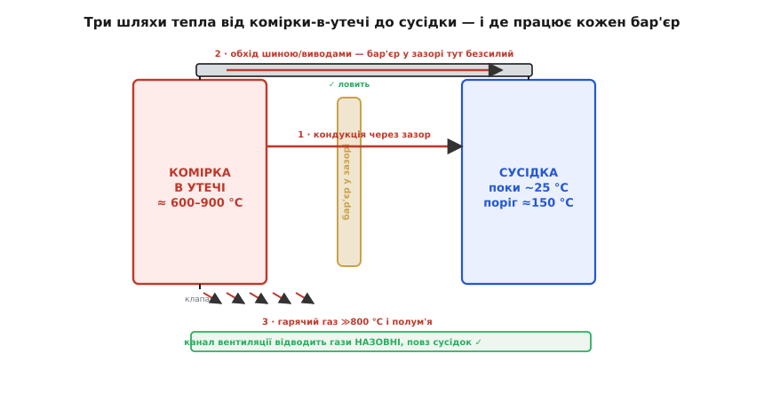
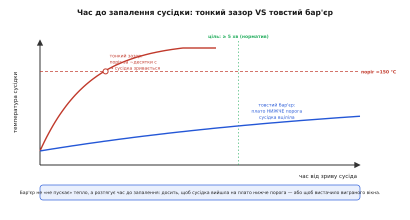
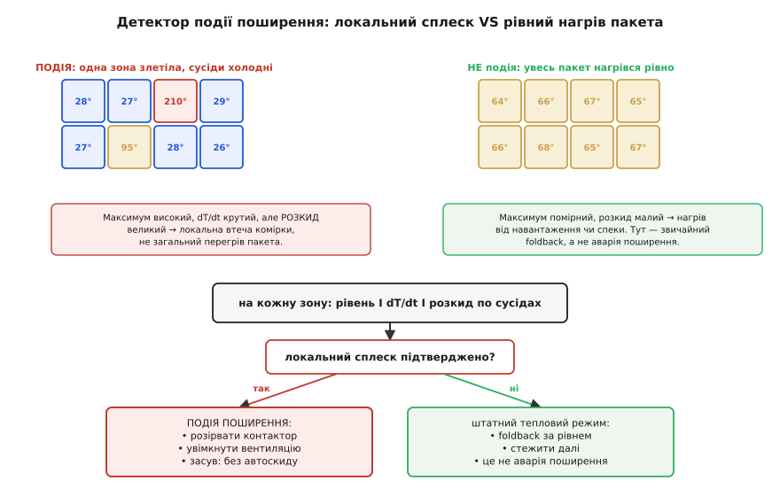

# ⚙️ Стримати поширення: бар'єри, зазори, вентиляція й детектор події

У темі ми дійшли до четвертого, найгрубішого рубежу оборони — **фізичного стримування**. Там ми домовилися про головне: коли одна комірка вже зірвалася, її не врятувати, тож завдання міняється — **не дати їй забрати з собою решту пакета**. Тоді ми лише назвали засоби: зазори, вогнетривкі бар'єри, канали для гарячих газів. Тут розгорнемо це в конструкторську задачу з числами: **які саме шляхи несуть тепло від комірки-в-утечі до сусідки, як грубо оцінити час до її запалення, чим його розтягнути — і як прошивка має впізнати, що йде саме поширення, а не звичайний нагрів, та скомандувати останньому рубежу електрики й вентиляції**.

Це не повторення теми, а її приземлення. Тема дала стратегію; цей крок дає лінійку, формулу й робочий код.

## Задача

Сформулюймо чесно й вузько, бо плутанина тут дорого коштує. Ми **не** боремося з утечею всередині однієї комірки — це окрема біда, і, як ми бачили, зовні її петлю вже не розірвати. Ми боремося з **поширенням** (англ. *propagation* — «розповсюдження») — ланцюговою реакцією, де жар, полум'я й розпечені викиди першої комірки доводять **сусідні** до їхнього власного порога втечі, ті запалюють наступних, і пакет згоряє хвилею. Одна згоріла комірка — прикра, але локальна втрата; пакет, що пішов хвилею, — пожежа, яку вже нічим не спинити.

Отже, нам треба двоє різних речей, і їх легко сплутати:

- **Конструкція**, що фізично гальмує передачу тепла від комірки до комірки настільки, щоб сусідка **не встигла** дійти свого порога запалення, поки перша догоряє. Це зазори, вогнетривкі прокладки, канали відведення газів — чиста механіка й матеріали, без жодної електроніки.
- **Прошивка**, що **впізнає подію поширення** — відрізнить «одна зона раптом злетіла, а сусідні ще холодні» від «увесь пакет потроху нагрівся під навантаженням» — і скомандує останньому електричному рубежу (розірвати [контактор](root:embedded/bms-architecture)) та активному стримуванню (увімкнути вентиляцію), а тоді **зафіксується** в аварії, не намагаючись «віджити» само.

Чому це окремий код, а не той самий тепловий захист, що в темі? Бо в темі функція `thermal_fault()` дивилася на **одну** температуру — найгарячішу комірку — і питала: «чи гаряче / чи круто росте». Цього досить, щоб зрізати струм заряду. Але проти поширення цього **замало**: гарячий пакет на спеці теж дасть високий максимум і помітний dT/dt, а це не аварія — це привід для м'якого foldback, не для розриву контактора й залпу вентиляції. Щоб не плутати пожежу з теплим днем, треба дивитися на **просторову картину**: подія поширення — це завжди **локальний** сплеск на тлі холодних сусідів. Саме цю різницю наш детектор і має ловити.

І ще одна частина задачі, суто інженерна: **груба оцінка**. Перш ніж проєктувати бар'єр, треба прикинути, з чим узагалі маємо справу — за скільки секунд сусідка дійшла б порога **без** бар'єра, і наскільки той час треба розтягнути. Без цієї оцінки бар'єр або буде картонним (не встигне), або золотим і завтовшки з цеглину (з'їсть половину енергії пакета на порожнечу). Тож почнемо з фізики шляху тепла, а вже на ній збудуємо і конструкцію, і код.

## Ідея: три шляхи тепла, три різні бар'єри

Перше прозріння, без якого все інше — стрілянина наосліп: тепло йде від комірки-в-утечі до сусідки **не одним шляхом, а трьома різними**, і кожен потребує свого засобу. Поставити «бар'єр» і заспокоїтися — типова й небезпечна помилка, бо бар'єр у зазорі закриває рівно один із трьох шляхів.


*Від комірки-в-утечі (≈600–900 °C) до сусідки (поки ~25 °C, поріг запалення ≈150 °C) тепло йде трьома шляхами: 1 — кондукція бік-до-боку через зазор (її ловить бар'єр у зазорі); 2 — обхід металевою шиною й виводами поверху, де бар'єр у зазорі безсилий; 3 — гарячий газ ≫800 °C і полум'я з клапана, проти яких потрібен канал вентиляції назовні. Три шляхи — три різні засоби.*

**Шлях перший — кондукція бік-до-боку через зазор.** Корпус комірки розжарюється, і тепло тече крізь те, що між боками сусідніх комірок: повітря, прокладку, конструкцію. Це найочевидніший шлях, і саме його закриває класичний **вогнетривкий бар'єр** у зазорі. У повільній, докритичній фазі — поки сусідка ще не зірвалася сама — кондукція через цей проміжок несе більшу частину тепла (за вимірами в пакетах — десь половину й більше переданої енергії). Тут бар'єр працює прямо: що нижча його теплопровідність і що він товщий, то повільніше тепло доходить до сусідки.

**Шлях другий — обхід металом: шина й виводи.** І ось перша пастка, на якій ловляться навіть досвідчені. Комірки з'єднані **струмовими шинами** (англ. *busbar*) через виводи — а метал проводить тепло в сотні разів краще за повітря чи бар'єрну прокладку. Тому навіть коли між боками комірок стоїть прекрасний вогнетривкий бар'єр, тепло спокійно **обходить** його поверху — крізь вивід однієї комірки, шину, вивід сусідньої. Виводи задумані як шлях для струму, але ж тепло тече тими самими мідними доріжками. Виміри підтверджують: навіть із ізоляційними прокладками між боками втеча розповзається **тангажем по шинах**. Звідси висновок, який мало хто закладає одразу: бар'єр у зазорі сам по собі **не повний** захист — обхід металом треба перекривати **окремо** (тонший переріз шини в містку між комірками як теплова «талія», розрив шини запобіжним елементом, рознесення виводів).

**Шлях третій — гарячий газ і полум'я.** Зірвавшись, комірка **вентилюється**: крізь запобіжний клапан вилітає струмінь розпечених горючих газів і твердих викидів (англ. *ejecta* — «викинуте»). Цифри тут моторошні, і їх варто тримати в голові: типова комірка викидає близько **30 г** твердого, рідкого й газуватого матеріалу **за секунду й менше**, початкова температура газів сягає **≈1500 °C**, а полум'я палає ще сотні мілісекунд (приблизно 250–900 мс). Цей струмінь, якщо його не скерувати, б'є прямо в сусідок і запалює їх миттєво — жоден бар'єр у зазорі тут не до речі, бо біда летить **повітрям**, а не крізь стінку. Проти неї працює інше: **канал відведення** (англ. *venting channel*), що приймає струмінь із клапана й веде його **назовні**, повз інші комірки й електроніку. Мета — не загасити (це майже неможливо), а **спрямувати**: дати гарячому газу зумисний, короткий шлях геть із пакета, перш ніж він знайде шлях до сусідок сам.

> 🔧 **Навіщо це.** Розкладання на три шляхи — це різниця між захистом, що працює, і театром безпеки. Бар'єр у зазорі без керування обходом по шині — це міцні двері в стіні з картону: тепло обійде. Бар'єр без вентиляції — двері, що тримають жар, поки крізь кватирку залітає вогнемет. Спершу називаєш **усі три** шляхи, тоді на кожен ставиш свій засіб — і лише так перевіряєш, що не лишив відчинених дверей.

Є й четвертий, тонший канал, який варто бодай знати. Ще **до** повної втечі комірка починає **парувати електролітом**: леткі розчинники (типово диметилкарбонат, DMC) виходять крізь клапан приблизно від 130 °C, осідають на сусідках і — за дослідженнями — навіть **кількасот міліграмів** такого конденсату на сусідній комірці здатні запустити її власну втечу. Тобто частина тепла й хімічної загрози переноситься **не як тепло взагалі**, а як горючий наліт. Для нас, проєктувальників, це ще один аргумент за **вентиляцію назовні**: канал, що відводить струмінь, заодно зносить геть і ці пари, не даючи їм осісти на сусідів.

## Груба оцінка: за скільки сусідка дійде порога

Перш ніж рахувати бар'єр, прикиньмо порядок величини — щоб знати, **скільки часу** ми взагалі стримуємо й **наскільки** його треба розтягнути. Точна теплова модель пакета — це скінченні елементи й дні роботи; нам же потрібна **інженерна оцінка на серветці**, що дасть правильний порядок і покаже, які важелі сильні. Тому свідомо спрощуємо.

Уявімо сусідню комірку як **єдину теплову масу** з температурою T (так звана зосереджена модель, англ. *lumped capacitance* — «зосереджена теплоємність»: припускаємо, що комірка прогрівається рівномірно, без перепаду всередині). У неї втікає тепловий потік Q від гарячого сусіда, а сама вона має теплоємність C = m·c (маса на питому теплоємність). Швидкість нагріву сусідки:

```
dT/dt = Q / C            C = m · c   (Дж/°C)
```

Якщо взяти, що головний шлях у докритичній фазі — кондукція через зазор, потік Q йде законом теплопровідності крізь прокладку:

```
Q = k · A · (T_гар − T) / d

  k — теплопровідність матеріалу зазору, Вт/(м·°C)
  A — площа боку комірки, м²
  d — товщина зазору/бар'єра, м
  T_гар — температура комірки-в-утечі
```

Об'єднавши, дістаємо швидкість нагріву сусідки й — найгрубіше — **час до її порога**, якщо вважати потік приблизно сталим на час догоряння першої комірки:

```
dT/dt ≈ k · A · (T_гар − T) / (d · m · c)

час до порога:  t_ign ≈ (T_поріг − T_поч) · m · c / Q
```

**Worked-приклад: тонкий повітряний зазор проти товстого бар'єра.** Призматична комірка, бік A ≈ 0.02 м² (приблизно 20×10 см), маса m ≈ 0.9 кг, питома теплоємність літієвої комірки c ≈ 1000 Дж/(кг·°C). Гаряча комірка тримає T_гар ≈ 700 °C, сусідка стартує з T_поч = 25 °C, її поріг запалення T_поріг ≈ 150 °C. Порахуймо два випадки.

```
Випадок А — тонкий повітряний зазор, d = 1 мм, k_повітря ≈ 0.03 Вт/(м·°C):
  Q = 0.03 · 0.02 · (700 − 25) / 0.001 = 405 Вт
  C = m·c = 0.9 · 1000 = 900 Дж/°C
  dT/dt = 405 / 900 = 0.45 °C/с   (на старті — далі сповільнюється, бо різниця падає)
  t_ign ≈ (150 − 25) · 900 / 405 ≈ 278 с   ... але це БЕЗ урахування,
          що тонкий зазор передає тепло й конвекцією/випромінюванням —
          реально куди швидше; груба оцінка тут оптимістична.

Випадок Б — товстий аерогелевий бар'єр, d = 3 мм, k_аерогель ≈ 0.02 Вт/(м·°C):
  Q = 0.02 · 0.02 · (700 − 25) / 0.003 = 90 Вт
  C = 900 Дж/°C
  dT/dt = 90 / 900 = 0.1 °C/с
  t_ign ≈ (150 − 25) · 900 / 90 ≈ 1250 с ≈ 21 хв
```

Що каже ця прикидка? По-перше, **порядок величини**: навіть груба модель показує, що різниця між картонним і пристойним бар'єром — це різниця між **хвилинами**. По-друге, важелі видно прямо у формулі: час до порога зростає **лінійно** з товщиною d і теплоємністю сусідки m·c, і **обернено** до теплопровідності k та площі контакту A. Тонший і менш теплопровідний бар'єр (менше k/d), важча комірка (більше m·c) — більше виграного часу. По-третє — і це чесне застереження — реальність **гірша** за цю оцінку: ми знехтували випромінюванням (а гаряча стінка світить тепло ~ T⁴), газовим струменем і обходом по шині. Тому інженер бере результат **із великим запасом**: якщо серветка обіцяє 5 хвилин, проєктуй на 15, бо третій шлях (газ) і метал з'їдять більшість запасу.


*Температура сусідки повзе до порога запалення (≈150 °C). Тонкий зазор доводить її туди швидко — сусідка зривається й хвиля йде далі. Товстий бар'єр настільки сповільнює потік, що сусідка виходить на плато НИЖЧЕ порога (комірка-в-утечі догоряє раніше, ніж сусідка встигає нагрітися) — або принаймні дає виграти потрібне вікно. Бар'єр не «не пускає» тепло — він РОЗТЯГУЄ час до запалення.*

Ось ключовий зсув розуміння, який дає ця картинка. Бар'єр **не зупиняє** тепло назавжди — це неможливо, тепло все одно протече. Бар'єр **виграє час**. А час — це все, що потрібно, бо комірка-в-утечі **догоряє за секунди-хвилини**: щойно вона вичерпала свою енергію й охолола, потік до сусідки падає. Якщо бар'єр розтягнув нагрів сусідки настільки, що та виходить на плато **нижче** свого порога, перш ніж перша догорить, — ланцюг **розривається**. Перемога не в тому, щоб не пустити жодного джоуля, а в тому, щоб сусідка не встигла дійти порога до того, як джерело вичерпається.

> 🔧 **Навіщо це.** Ця оцінка — мандат на матеріал і товщину бар'єра. З неї видно, чому повітряний зазор у міліметр — це не захист (хвиля піде), чому аерогель і слюда стали стандартом (наднизьке k за малої товщини), і чому ніхто не намагається «не пустити тепло зовсім» — ціль завжди «розтягнути час до порога довше, ніж горить джерело». Без числа на серветці бар'єр проєктують навмання; з ним — обирають товщину свідомо й одразу бачать, скільки запасу лишилося на газ і метал.

### Підступ бар'єра: він заважає й нормальному охолодженню

І тут чигає найглибша пастка всієї конструкції, через яку «просто поставити товстий бар'єр» не працює. Бар'єр, що добре стримує втечу, — це за визначенням **добрий теплоізолятор**. Але в [нормальному тепловому режимі пакета](root:embedded/battery-pack-thermal) нам треба рівно протилежне — **відводити** тепло від комірок, щоб вони не старіли й не перегрівалися під навантаженням. Той самий бар'єр, що в аварії рятує сусідку, у буднях **тримає** тепло в пакеті й заважає його зливати.

Це фундаментальний конфлікт, а не дрібниця компонування: ідеальна стінка проти поширення — це ідеальна перешкода нормальному охолодженню. Тому реальний пакет завжди **компроміс**, і його розв'язують хитро:

- **Анізотропні бар'єри** — матеріали, що проводять тепло вздовж (до радіатора чи холодної плити збоку) погано **впоперек** (від комірки до комірки). Тепло зливається в плановий бік, але не йде до сусіда.
- **Бар'єри з фазовим переходом** (англ. *phase-change material*, PCM) — речовина, що в нормі плавиться при помірній температурі, забираючи багато тепла на плавлення (буднє охолодження), а в аварії, вже розплавившись і перейшовши температуру втечі, працює як ізолятор; інколи додають **інтумесцентні** (спучувані) шари, що від жару розбухають у товсту ізоляційну піну саме під час події.
- **Розділення функцій** — тонкий теплопровідний шлях для буднього відведення (наприклад, до охолоджуваної плити внизу) **і** вогнетривкий бар'єр між боками для аварії; кожна функція має свій матеріал і свій напрямок.

Цей конфлікт — чому проєктування пакета проти поширення не зводиться до «товщого бар'єра», а є балансом між двома протилежними вимогами. І чому це **системна** задача, що поєднує конструкцію, матеріали й керування: жоден шар окремо її не розв'яже.

## Робочий код: детектор події поширення

Тепер прошивка. Її задача — **впізнати**, що йде саме поширення, і скомандувати фізичним рубежам. Нагадаю, чим це відрізняється від теплового foldback із теми: foldback дивиться на одну (найгарячішу) температуру й **плавно зрізає струм**; детектор поширення дивиться на **просторову картину** багатьох зон і ухвалює **двійкове, незворотне** рішення — рвати контактор і вмикати вентиляцію. Це різні інструменти для різних рішень, і плутати їх не можна: foldback на події поширення спрацює запізно й м'яко, а детектор поширення в буднях гахкав би контактором на кожен теплий день.

### Чому самого dT/dt мало: дивимося на розкид

Ключова ідея коду — **просторовий контраст**. Подія поширення має впізнаваний підпис: **одна зона стрімко злітає, а її сусіди ще холодні**. Загальний нагрів (спека, важке навантаження, слабке охолодження) виглядає інакше — **весь** пакет тепліє більш-менш рівно. Якщо детектор дивиться лише на максимум і його швидкість, він не відрізнить одне від одного: і пожежа в одній комірці, і гарячий день дадуть високий максимум. Рятує саме **розкид** (англ. *spread* — розмах між найгарячішою й найхолоднішою зонами): велика різниця між гарячою точкою й рештою — підпис **локальної** події; мала різниця за теплого пакета — підпис **загального** нагріву.


*Ліворуч: одна зона ≈210 °C серед холодних ~27 °C — максимум високий, dT/dt крутий, РОЗКИД великий → локальна втеча, аварія поширення. Праворуч: усі зони ~65 °C — максимум помірний, розкид малий → загальний нагрів, звичайний foldback, не аварія. Рішення на кожну зону враховує рівень І швидкість І розкид по сусідах; підтверджена подія рве контактор, вмикає вентиляцію й фіксується без автоскиду.*

Отже, детектор поєднує **три ознаки**, і подія поширення — це їхній збіг:

1. **рівень** — зона перейшла високий аварійний поріг (не «тепло», а «горить»);
2. **швидкість** — dT/dt зони крута (комірка в розгоні, а не повільно тепліє);
3. **розкид** — ця зона набагато гарячіша за решту (локальна точка, а не загальний нагрів).

Жодна ознака сама не достатня. Високий рівень без розкиду — це перегрітий пакет (лікувати foldback). Крутий dT/dt при ввімкненні навантаження — нормальний кидок. Великий розкид за низького рівня — просто нерівномірний пакет. А от **усі три разом** — це підпис, який ні спека, ні навантаження підробити не можуть.

### Перетворення в код

Зберемо детектор крок за кроком. Працюємо в десятих градуса цілими (як і весь тепловий захист у темі — без float у гарячому шляху), на масиві зон, кожна зі своїм давачем. Спершу — стан і пороги.

:::tabs
```c
// Детектор події ПОШИРЕННЯ теплової втечі по пакету.
// Не плутати з тепловим foldback: цей модуль ловить ЛОКАЛЬНУ подію
// (одна зона злетіла на тлі холодних сусідів) і ухвалює незворотне рішення.
#include <stdint.h>
#include <stdbool.h>

#define N_ZONES        8        // теплових зон пакета (по давачу на зону)

// ── Пороги (десяті °C, де доречно). Підбирати під конкретний пакет. ──
#define LVL_TRIP_C10   1200     // 120.0 °C — зона явно в утечі (не просто гаряча)
#define RATE_TRIP      80       // 8.0 °C/с — крутий розгін (десятих °C за секунду)
#define SPREAD_TRIP    600      // 60.0 °C — зона настільки гарячіша за медіану зон
#define PERSIST_TICKS  2        // підтвердити N послідовних тиків (проти одиничного збою)

typedef enum { PROP_IDLE, PROP_SUSPECT, PROP_LATCHED } prop_state_t;

typedef struct {
    prop_state_t state;
    int32_t  prev_c10[N_ZONES];   // попередній замір кожної зони (для dT/dt)
    uint8_t  suspect_cnt;         // скільки тиків поспіль бачимо підозру
    int8_t   hot_zone;            // індекс зони-винуватця (для логів і вентиляції)
    bool     have_prev;           // чи вже є попередній замір
} prop_detector_t;
```
```python
# Детектор події ПОШИРЕННЯ теплової втечі по пакету.
# Не плутати з тепловим foldback: цей модуль ловить ЛОКАЛЬНУ подію
# (одна зона злетіла на тлі холодних сусідів) і ухвалює незворотне рішення.
from enum import IntEnum
from dataclasses import dataclass, field

N_ZONES = 8            # теплових зон пакета (по давачу на зону)

# ── Пороги (десяті °C, де доречно). Підбирати під конкретний пакет. ──
LVL_TRIP_C10  = 1200   # 120.0 °C — зона явно в утечі (не просто гаряча)
RATE_TRIP     = 80     # 8.0 °C/с — крутий розгін (десятих °C за секунду)
SPREAD_TRIP   = 600    # 60.0 °C — зона настільки гарячіша за медіану зон
PERSIST_TICKS = 2      # підтвердити N послідовних тиків (проти одиничного збою)

class PropState(IntEnum):
    IDLE    = 0
    SUSPECT = 1
    LATCHED = 2

@dataclass
class PropDetector:
    state: PropState = PropState.IDLE
    prev_c10: list = field(default_factory=lambda: [0] * N_ZONES)  # для dT/dt
    suspect_cnt: int = 0          # скільки тиків поспіль бачимо підозру
    hot_zone: int = -1            # індекс зони-винуватця (для логів і вентиляції)
    have_prev: bool = False       # чи вже є попередній замір
```
:::

Далі — допоміжне: медіана зон як «фон» пакета, відносно якого міряємо розкид. Чому медіана, а не середнє чи мінімум? Бо медіана **стійка до викидів**: одна-дві гарячі зони (саме те, що ми шукаємо) її майже не зрушать, тож вона чесно показує «де перебуває основна маса холодних зон», на тлі якої гаряча точка стирчить.

:::tabs
```c
// Медіана температур зон — стійкий «фон» пакета (копіюємо, щоб не псувати вхід).
static int32_t zones_median(const int32_t *t_c10, int n) {
    int32_t buf[N_ZONES];
    for (int i = 0; i < n; i++) buf[i] = t_c10[i];
    for (int i = 1; i < n; i++) {            // сортування вставками — для 8 зон швидше за все
        int32_t key = buf[i]; int j = i - 1;
        while (j >= 0 && buf[j] > key) { buf[j + 1] = buf[j]; j--; }
        buf[j + 1] = key;
    }
    return buf[n / 2];
}
```
```python
# Медіана температур зон — стійкий «фон» пакета (копіюємо, щоб не псувати вхід).
def zones_median(t_c10, n):
    buf = sorted(t_c10[:n])          # копія + сортування (для 8 зон вартість дрібна)
    return buf[n // 2]
```
:::

Тепер серце — один тик детектора. Він рахує по кожній зоні три ознаки, шукає зону, де збіглися всі три, і вимагає, щоб підозра **протрималася** кілька тиків поспіль (захист від одиничного збою давача чи наведення). Підтвердивши — **фіксується** (англ. *latch* — засув) у стані `PROP_LATCHED`, із якого сам не виходить: теплова втеча не той випадок, де доречне тихе автовідновлення.

:::tabs
```c
// Один тик детектора. Викликати періодично (напр. раз на 100 мс) зі свіжими
// температурами зон (десяті °C) і кроком dt_ms між викликами.
// Повертає true, щойно подія поширення ПІДТВЕРДЖЕНА (і далі лишається true — засув).
bool prop_detector_tick(prop_detector_t *d, const int32_t *t_c10, uint32_t dt_ms) {
    if (d->state == PROP_LATCHED) return true;      // зафіксувалися — назад не вертаємось

    int32_t med = zones_median(t_c10, N_ZONES);
    bool suspect = false;
    int8_t who = -1;

    for (int z = 0; z < N_ZONES; z++) {
        // ознака 1: рівень — зона явно в утечі
        bool hot = (t_c10[z] >= LVL_TRIP_C10);

        // ознака 2: швидкість — крутий dT/dt саме цієї зони
        bool fast = false;
        if (d->have_prev && dt_ms > 0) {
            int32_t rate = (t_c10[z] - d->prev_c10[z]) * 1000 / (int32_t)dt_ms;
            fast = (rate >= RATE_TRIP);
        }

        // ознака 3: розкид — зона набагато гарячіша за фон пакета
        bool stands_out = ((t_c10[z] - med) >= SPREAD_TRIP);

        // подія поширення = ЗБІГ усіх трьох ознак на одній зоні
        if (hot && fast && stands_out) { suspect = true; who = (int8_t)z; break; }
    }

    // зберегти заміри для наступного dT/dt
    for (int z = 0; z < N_ZONES; z++) d->prev_c10[z] = t_c10[z];
    d->have_prev = true;

    // підтвердження персистентністю: підозра має протриматись PERSIST_TICKS поспіль
    if (suspect) {
        d->hot_zone = who;
        if (d->suspect_cnt < 255) d->suspect_cnt++;
        d->state = PROP_SUSPECT;
        if (d->suspect_cnt >= PERSIST_TICKS) {
            d->state = PROP_LATCHED;            // ПІДТВЕРДЖЕНО — фіксуємось
            return true;
        }
    } else {
        d->suspect_cnt = 0;                      // підозра зникла — скидаємо лічильник
        if (d->state == PROP_SUSPECT) d->state = PROP_IDLE;
    }
    return false;
}
```
```python
# Один тик детектора. Викликати періодично (напр. раз на 100 мс) зі свіжими
# температурами зон (десяті °C) і кроком dt_ms між викликами.
# Повертає True, щойно подія поширення ПІДТВЕРДЖЕНА (і далі лишається True — засув).
def prop_detector_tick(d: PropDetector, t_c10, dt_ms: int) -> bool:
    if d.state == PropState.LATCHED:
        return True                              # зафіксувалися — назад не вертаємось

    med = zones_median(t_c10, N_ZONES)
    suspect = False
    who = -1

    for z in range(N_ZONES):
        # ознака 1: рівень — зона явно в утечі
        hot = t_c10[z] >= LVL_TRIP_C10

        # ознака 2: швидкість — крутий dT/dt саме цієї зони
        fast = False
        if d.have_prev and dt_ms > 0:
            rate = (t_c10[z] - d.prev_c10[z]) * 1000 // dt_ms
            fast = rate >= RATE_TRIP

        # ознака 3: розкид — зона набагато гарячіша за фон пакета
        stands_out = (t_c10[z] - med) >= SPREAD_TRIP

        # подія поширення = ЗБІГ усіх трьох ознак на одній зоні
        if hot and fast and stands_out:
            suspect = True
            who = z
            break

    # зберегти заміри для наступного dT/dt
    d.prev_c10 = list(t_c10[:N_ZONES])
    d.have_prev = True

    # підтвердження персистентністю: підозра має протриматись PERSIST_TICKS поспіль
    if suspect:
        d.hot_zone = who
        if d.suspect_cnt < 255:
            d.suspect_cnt += 1
        d.state = PropState.SUSPECT
        if d.suspect_cnt >= PERSIST_TICKS:
            d.state = PropState.LATCHED          # ПІДТВЕРДЖЕНО — фіксуємось
            return True
    else:
        d.suspect_cnt = 0                        # підозра зникла — скидаємо лічильник
        if d.state == PropState.SUSPECT:
            d.state = PropState.IDLE
    return False
```
:::

Зверніть увагу на дві навмисні риси. По-перше, **персистентність**: ми не б'ємо аварію з першого збігу, а вимагаємо кількох тиків поспіль — інакше один збійний замір (наведення від силового ключа, стрибок коду АЦП) спричинив би хибний розрив контактора, а це сам по собі небезпечний відказ. По-друге, **засув без автоскиду**: підтвердивши подію, детектор більше **ніколи** не каже «вже все добре» сам — вийти з аварії може лише людина чи старший рівень логіки після того, як переконається, що пакет справді безпечний. Це той самий принцип, що в темі: теплова втеча — не місце для тихого самовідновлення.

### Команда фізичним рубежам

Детектор лише **виявляє**. Рішення треба **виконати** — і тут другий шматок коду, що перетворює підтверджену подію на дії заліза. Дій три, і порядок має значення.

```c
// Виконавчий бік: підтверджена подія поширення → команди залізу.
// Викликати щотик; усе всередині ідемпотентне (повторний виклик не шкодить).
extern void contactor_open(void);       // розірвати силовий контактор (знеструмити пакет)
extern void vent_fan_on(void);          // увімкнути активну вентиляцію/витяжку
extern void alarm_raise(uint8_t zone);  // підняти тривогу назовні (хост, сигнал, лог)

static void propagation_response(const prop_detector_t *d) {
    // 1) НЕГАЙНО розірвати струм: знята електрика прибирає джерело джоулевого
    //    підігріву й не дає аварії живитися струмом заряду/розряду.
    contactor_open();

    // 2) Увімкнути вентиляцію: гнати гарячі гази й пари розчинника НАЗОВНІ,
    //    подалі від сусідніх комірок і електроніки.
    vent_fan_on();

    // 3) Підняти тривогу: дати людині й системі знати ЯКА зона й що сталося —
    //    подія незворотна, хтось мусить оглянути пакет, перш ніж його вмикати.
    alarm_raise((uint8_t)d->hot_zone);
}

// Зібрати докупи в одному періодичному виклику.
static prop_detector_t g_prop;          // нульова ініціалізація = PROP_IDLE

void propagation_tick(const int32_t *zone_temps_c10, uint32_t dt_ms) {
    if (prop_detector_tick(&g_prop, zone_temps_c10, dt_ms)) {
        propagation_response(&g_prop);  // ідемпотентно: щотик підтверджуємо команди
    }
}
```

Чому **спершу контактор, тоді вентиляція**? Бо розрив струму прибирає **джерело** — джоулів підігрів від струму заряду/розряду, що інакше підливав би масла у вогонь і грів би справні комірки. Вентиляція ж бореться з **наслідком** — уже народженим гарячим газом. Спершу прибираємо причину, тоді розгрібаємо наслідок. І важлива дрібниця: команди **ідемпотентні** — `contactor_open()` і `vent_fan_on()` можна кликати щотик без шкоди, бо засув детектора щоразу повертає true. Так нам не треба пам'ятати «чи вже скомандували» — стан живе в одному місці, у засуві детектора, а виконавчий бік просто тупо й надійно повторює команду.

Окреме слово про **вентилятор**. У найгрубішому виконанні «вентиляція» — це пасивний канал, що просто веде струмінь назовні, без жодної електроніки; код тоді відпадає, лишається сама конструкція. Активний вентилятор додають, коли пасивної тяги мало (закритий корпус, багато комірок) — але тоді він сам стає вузлом, що може відмовити, тож на нього не покладаються як на єдиний рубіж. Конструкція (зазори, бар'єри, канал) лишається головною, а керована вентиляція — підмогою.

## Складність і пастки на МК

- **Стримування — не той самий захист, що foldback.** Тепловий foldback із теми плавно зрізає струм за однією температурою; детектор поширення ловить **локальну** подію за просторовою картиною й рве контактор. Не зливай їх в одну функцію: foldback на події поширення спрацює запізно й м'яко, а детектор у буднях гахкав би контактором на кожен теплий день.
- **Дивись на РОЗКИД, не лише на максимум.** Високий максимум сам по собі — це й пожежа, і спекотний день. Подія поширення = висока зона **на тлі холодних сусідів**. Без ознаки розкиду детектор плутатиме локальну втечу із загальним нагрівом і або проґавить аварію, або битиме хибну. Бери медіану зон як стійкий фон і шукай зону, що стирчить над ним.
- **Бар'єр у зазорі НЕ закриває обхід по шині.** Метал проводить тепло в сотні разів краще за прокладку, тож тепло обійде найкращий бар'єр крізь виводи й струмову шину. Перекривай обхід **окремо**: тонша «теплова талія» в містку шини, рознесені виводи, розрив шини запобіжним елементом. Бар'єр без керування обходом — міцні двері в картонній стіні.
- **Гарячий газ летить повітрям, а не крізь стінку.** Струмінь ≈1500 °C і полум'я з клапана запалять сусідок миттєво, оминаючи будь-який бар'єр між боками. Проти них — **канал відведення назовні**, не товщий бар'єр. Спрямувати, а не загасити: дай газу зумисний короткий шлях геть, перш ніж він знайде шлях до сусідок сам.
- **Бар'єр заважає й нормальному охолодженню.** Добрий ізолятор проти втечі — це погане відведення тепла в буднях. Не став «товщий бар'єр» наосліп: розв'язуй конфлікт анізотропним матеріалом (проводить у плановий бік, не до сусіда), фазопереходним/спучуваним шаром або розділенням функцій (окремий шлях для буднього зливу, окремий бар'єр для аварії).
- **Груба оцінка — обов'язкова, але оптимістична.** Серветкова модель (t_ign ≈ ΔT·m·c / Q) дає правильний порядок і показує важелі (товщина, теплоємність — у плюс; теплопровідність, площа — у мінус). Але вона нехтує випромінюванням, газом і металом, тож реальність гірша: проєктуй із кратним запасом, бо третій шлях з'їсть більшість виграного часу.
- **Персистентність проти одиничного збою.** Не рви контактор із першого збігу ознак: один збійний замір (наведення, стрибок АЦП) спричинив би хибний розрив — сам по собі небезпечний відказ. Вимагай кількох підтверджень поспіль; підозра зникла — скинь лічильник.
- **Засув без автоскиду.** Підтвердивши подію, детектор більше ніколи не каже «все добре» сам. Вийти з аварії — лише через людину чи старший рівень після огляду. Тиха спроба «віджити» після теплової втечі — найгірше, що може зробити прошивка.
- **Спершу причина, тоді наслідок.** Розрив контактора прибирає джерело (джоулів підігрів струмом), вентиляція бореться з уже народженим газом. Тому контактор — перший, вентиляція — другий. І роби команди ідемпотентними: тоді не треба пам'ятати «чи вже скомандував», стан живе в одному засуві.
- **Давач відстає від ядра комірки.** Термістор на корпусі бачить температуру **поверхні**, а втеча народжується в **товщі**; між ними затримка й перепад. Тому пороги детектора (рівень, dT/dt) став із поправкою на цю інерцію — реальне ядро вже гарячіше й крутіше, ніж показує давач, тож не зволікай із рішенням до «красивих» цифр на поверхні.
- **Не гаси вентилятором того, що має робити конструкція.** Активна вентиляція — підмога, а не головний рубіж: вона сама може відмовити (живлення, заклинило). Головне стримування — пасивне: зазори, бар'єри, канал. Керовану вентиляцію клади **поверх** надійної конструкції, ніколи замість неї.

Наскрізна думка цього кроку та сама, що пронизує весь захист від теплової втечі: проти поширення не існує одного засобу. Конструкція виграє час, перекриваючи **три** теплові шляхи різними способами; груба оцінка каже, **скільки** того часу й де його бракує; а прошивка впізнає **подію** за просторовим підписом і смикає останні фізичні важелі — контактор і вентиляцію — рішуче й незворотно. Жоден шар сам не рятує пакет; разом вони роблять так, що зрив однієї комірки лишається зривом **однієї** комірки. Саме в цьому й полягав сенс четвертого рубежу теми — і саме це ми тут довели до числа й коду.
