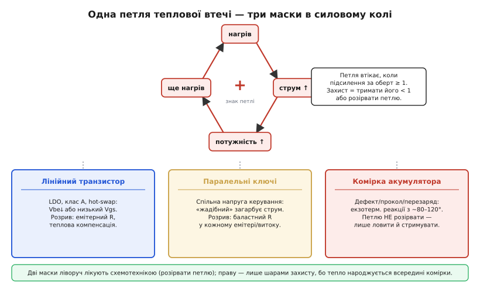
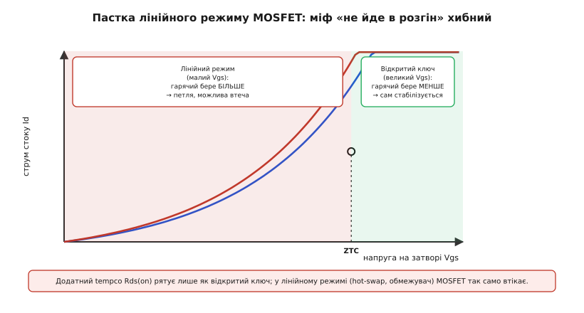
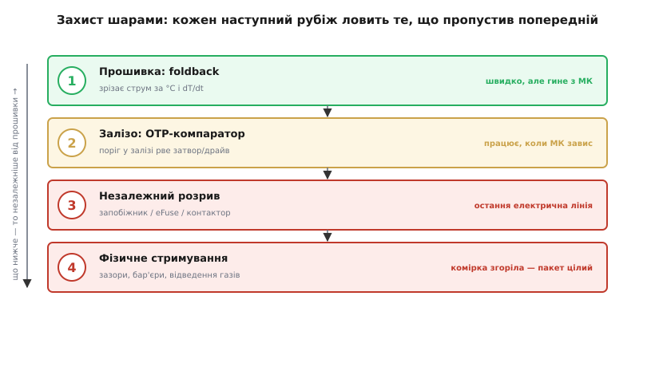
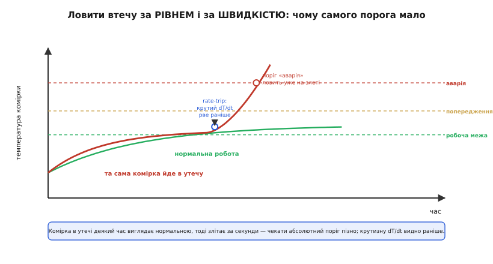

# Захист від теплової втечі

<preknowlist>
- [Тепловий розгін біполярного транзистора](topic:electronics/bjt-thermal-runaway) — та сама петля «нагрів → струм ↑ → тепло ↑» крупним планом: критерій зриву (∂Pc/∂Tj)·θ ≥ 1 і чому її гасить від'ємний зв'язок через емітерний резистор.
</preknowlist>

У попередньому кроці, [керуючи тепловим режимом батарейного пакета](root:embedded/battery-pack-thermal), ми весь час відводили тепло від **повільної** біди: старіння, що подвоюється з кожними десятьма градусами, і нерівномірного нагріву збірки. Там ми відводили, вирівнювали, плавно зрізали струм — і пакет жив довше. Але наприкінці того кроку лишилася тінь, яку жодне охолодження не скасує: **раптова** теплова втеча (англ. *thermal runaway* — «втеча тепла з-під контролю»), коли тепло народжується всередині деталі швидше, ніж устигає відводитися. Це окрема дисципліна, і саме нею ми тут займемося — не *як охолоджувати в нормі*, а **як спроєктувати захист на той випадок, коли нормальний режим уже зірвався**.

Спершу домовмося, що теплова втеча — це не одна вузька біда акумуляторів. Це **один фізичний механізм** з різними обличчями, і щойно ми його впізнаємо, увесь розкид «правил для силових схем» згорнеться в одну причину й один спосіб мислити про захист.

## Один механізм, три обличчя

Будь-яка теплова втеча — це **петля додатного зворотного зв'язку**: деталь гріється від власного струму, а від нагріву починає пропускати ще більший струм; більший струм дає більше тепла, тепло піднімає струм іще — і так по колу. Ми вже зустрічали цю петлю крупним планом у фізиці транзистора: [у BJT за сталої напруги зміщення нагрів зсуває вольт-амперну криву й сам по собі піднімає струм колектора (≈ −2 мВ/°C по Vbe), петля втікає, щойно її підсилення за оберт (∂Pc/∂Tj)·θ досягає одиниці, а лікують її емітерним резистором і радіатором](topic:electronics/bjt-thermal-runaway). Тут ми беремо ту саму петлю — але дивимося на неї очима **захисту цілої системи живлення**, а не одного транзистора.

Та сама петля проступає щонайменше в трьох місцях силового кола, і відмінність між ними визначає **чи можна її взагалі розірвати**.

**Перше обличчя — лінійний прохідний елемент.** Транзистор у лінійному режимі тримає на собі велику напругу за чималого струму: добуток Vce·Ic (або Vds·Id у польового) перетворюється на тепло прямо на кристалі. Це [лінійний стабілізатор (LDO), де прохідний транзистор «спалює» різницю вхід-вихід у тепло](root:embedded/linear-vs-switching), підсилювач класу A, активне навантаження, обмежувач пускового струму. Саме тут петля найзліша, бо потужність велика *постійно*.

**Друге обличчя — паралельні силові ключі.** Коли одного транзистора замало, ставлять кілька паралельно. Вони сидять на спільній керівній напрузі, тож «жадібніший» бере більший струм → гріється → за тією ж напругою бере ще більшу частку, відбираючи її в холодніших сусідів. Це **загарбання струму** (англ. *current hogging*): один прилад стягує на себе майже весь струм і гине, потім гинуть перевантажені сусіди. Дрібна неоднаковість приладів через спільну напругу стає смертельною нерівністю.

**Третє обличчя — комірка акумулятора.** Тут петля інша за природою: її жене не зсув переходу, а **екзотермічні хімічні реакції**. Як ми бачили на попередньому кроці, понад певну температуру (для типового Li-ion реакції розпаду плівки SEI стартують десь від 80–120°C) всередині комірки запускаються реакції, що **самі виділяють тепло**; виділене тепло пришвидшує реакції, що дають ще більше тепла. І ось ключова відмінність від двох попередніх облич: тепло народжується **в товщі самої комірки**, тож зовнішнім струмом цю петлю вже **не розірвати**.


*Нагрів → струм ↑ → потужність ↑ → ще нагрів — коло зі знаком плюс, що втікає, коли підсилення за оберт ≥ 1. Лінійний транзистор і паралельні ключі лікують схемотехнікою (розірвати петлю); комірку — лише шарами захисту, бо тепло народжується всередині неї.*

> 🔧 **Навіщо це.** Ця класифікація задає всю стратегію захисту, тож її варто тримати в голові постійно. Там, де петлю можна **розірвати** (лінійний елемент, паралельні ключі), захист — це насамперед **схемотехніка**: від'ємний зворотний зв'язок, баласти, теплова компенсація, запас по температурі. Там, де розірвати **не можна** (комірка з внутрішнім дефектом), захист — це **шари оборони**, що ловлять і стримують подію, якій уже дали початися. Сплутати ці два світи — типова й дорога помилка: на комірку не поставиш «емітерний резистор», а лінійний LDO не врятуєш «вогнетривкою прокладкою».

## Де петлю можна розірвати: розрив зв'язку

Почнемо з легшого випадку — лінійних елементів і паралельних ключів, де петля доступна зовні. Критерій стійкості (∂Pc/∂Tj)·θ < 1 із фізики транзистора прямо показує два важелі порятунку, і обидва ми вже зустрічали: зменшити θ (краще відводити тепло) або зменшити ∂Pc/∂Tj (зробити струм нечутливим до нагріву). У контексті захисту системи їх застосовують разом і свідомо, як проєктну дисципліну.

**Від'ємний зворотний зв'язок проти додатного.** Головний прийом — невеликий резистор у емітері (для BJT) або в витоці (для MOSFET), через який заводять зміщення. Щойно струм пробує зрости від нагріву, на цьому резисторі падає більше напруги, керівна напруга на самому переході зменшується — і струм повертається назад. Спроба втечі сама породжує силу, що її гасить. Той самий резистор, що рятує від тепла, заодно вирівнює робочу точку від розкиду приладів — один дешевий компонент проти трьох болячок. Деталі цього механізму ми вже розбирали у [BJT-розгоні](topic:electronics/bjt-thermal-runaway); тут важливо запам'ятати, що в **захисті** він працює як перший, безкоштовний рубіж: схема, у якій петля принципово затухає, не потребує жодного аварійного вимикання.

**Баласти на паралельних ключах.** Проти загарбання струму — той самий принцип, але по екземпляру: **кожному** транзистору свій маленький баластний резистор (англ. *ballast* — вантаж, що вирівнює). Тепер жадібність кожного сама себе карає: узяв більше струму — отримав більше падіння на своєму баласті, прикрився, віддав надлишок. Маленькі резистори змушують прилади ділити струм чесно.

**Окрема пастка — MOSFET у лінійному режимі.** Тут чигає поширений і небезпечний міф. Опір відкритого польового транзистора Rds(on) має **додатний** температурний коефіцієнт (гарячий MOSFET, повністю відкритий, опирається сильніше), і звідси роблять хибний висновок: «MOSFET сам себе балансує, у розгін не піде». Це правда **лише** для повністю відкритого ключа. У **лінійному** режимі — при малій напрузі на затворі, де MOSFET тримає і помітну напругу, і помітний струм (саме режим обмежувача пускового струму, hot-swap, лінійного підсилювача) — провідність визначає концентрація носіїв, а вона з нагрівом **росте**. Тобто гарячий MOSFET за тієї самої напруги затвора бере **більший** струм — чистісінький додатний зв'язок, така сама петля, як у BJT.


*Криві Id(Vgs) холодного й гарячого кристала перетинаються в точці ZTC (zero temperature coefficient). Нижче ZTC (лінійний режим, малий Vgs) гарячий пропускає більший струм — петля може втекти; вище ZTC, як повністю відкритий ключ, гарячий бере менше й сам стабілізується.*

Точку перетину звуть **ZTC** (англ. *zero temperature coefficient* — нульовий температурний коефіцієнт): нижче неї tempco струму додатний (небезпечно), вище — від'ємний (безпечно). Сучасні силові MOSFET із наднизьким Rds(on) тримають цю точку **високо**, тож у лінійному режимі вони ще вразливіші, ніж старі прилади. Практичний висновок жорсткий: якщо MOSFET *муситиме* довго сидіти в лінійному режимі, його не можна вибирати «за низьким Rds(on)» — треба дивитися на **область безпечної роботи в лінійному режимі** (FBSOA) у даташиті, і часто доводиться ставити кілька приладів паралельно з баластами або взагалі брати спеціальний «linear-mode» MOSFET. Глибше цей вибір — окрема прикладна задача: [як читати лінійну SOA в даташиті MOSFET, де ховається ZTC і чому low-Rds(on) прилад гірший для лінійного режиму](root:embedded/thermal-runaway-protection/comp-linear-mosfet.md).

**Запас по температурі (derating).** Останній важіль розриву — не давати деталі підходити близько до межі. Виробник гарантує характеристики до певної температури кристала; працювати треба з запасом, бо ближче до краю і θ погіршується, і петля підсилюється. Це окрема інженерна звичка: [навіщо знижувати допустиму потужність із нагрівом і скільки саме запасу закладати](topic:electronics/power-derating). Запас по температурі — найдешевший спосіб тримати підсилення петлі надійно нижче одиниці без жодної додаткової електроніки.

## Де петлю не розірвати: захист шарами

Тепер головне й найважче — комірка акумулятора (та й будь-яка деталь із внутрішнім дефектом), де тепло народжується всередині й петлю зовні не розкрутити. Тут міняється сама філософія: ми вже не сподіваємося **не дати** події статися — ми будуємо **шари оборони**, кожен із яких ловить те, що пропустив попередній, і робимо так, щоб навіть повна аварія однієї комірки не забрала весь пристрій.

Ключова ідея, яку легко проґавити: ці шари мусять бути **різної природи й різної швидкості**, і головні з них — **не в прошивці**. Бо прошивка може зависнути, мікроконтролер може скинутися саме тоді, коли він найпотрібніший. Захист, що залежить лише від програми, — це захист, який відмовляє разом із тим, від чого він мав боронити.


*Прошивковий foldback швидкий, але гине разом із МК; апаратний OTP-компаратор спрацьовує, коли МК завис; незалежний розрив (запобіжник / eFuse / контактор) — остання електрична лінія; фізичне стримування рятує пакет, коли комірка вже згоріла. Що нижчий рубіж, то незалежніший від прошивки.*

Пройдімо рубежі знизу вгору за надійністю.

**Рубіж 1 — прошивка: foldback за рівнем і за швидкістю.** Найгнучкіший, найрозумніший, але й найкрихкіший шар. Прошивка читає давачі, обирає **максимум** температури (керувати треба за найгарячішою коміркою, не за середньою) і плавно зрізає дозволений струм — рівно той [тепловий foldback, який ми зібрали на попередньому кроці](root:embedded/battery-pack-thermal). Але для захисту **саме від утечі** одного абсолютного порога замало, і ось чому.

**Чому самого порога мало: ловимо за швидкістю.** Комірка, що зривається в утечу, деякий час виглядає майже нормальною, а тоді **злітає за секунди**. Якщо чекати, поки температура дійде до аварійного рівня, рішення прийде, коли комірка вже в розгоні й рятувати майже нічого. Тому до порога за **рівнем** додають поріг за **швидкістю** — dT/dt: якщо температура росте надто круто, це сама по собі аварія, незалежно від того, який зараз абсолютний рівень. Крутий нахил видно **раніше**, ніж перетин високого порога, — і ці виграні секунди вирішують.


*Нормальний нагрів виходить на пологе плато; та сама комірка в утечі повзе як усі, тоді раптом злітає. Поріг «аварія» за рівнем ловить уже на злеті, коли пізно; rate-trip за крутизною dT/dt спрацьовує на самому коліні, набагато раніше.*

**Worked-приклад: захист за рівнем І за швидкістю.** Простий, але робочий шматок прошивки, що поєднує обидва пороги. Викликаємо його періодично (скажімо, раз на 100 мс); він повертає, чи треба бити аварію.

:::tabs
```c
// Тепловий захист комірки: спрацьовує за абсолютним рівнем АБО за крутизною.
// t_c10 — температура найгарячішої комірки в десятих градуса (372 = 37.2 °C),
// dt_ms — період між викликами в мілісекундах. Без float у гарячому шляху.
#include <stdint.h>
#include <stdbool.h>

#define T_TRIP_C10     600    // 60.0 °C — абсолютна аварія
#define RATE_TRIP      20     // 2.0 °C/с — крута втеча (десятих °C за секунду)

bool thermal_fault(int32_t t_c10, uint32_t dt_ms) {
    static int32_t prev = INT32_MIN;     // попередній замір
    bool fault = false;

    if (t_c10 >= T_TRIP_C10) {
        fault = true;                    // рубіж за рівнем
    }
    if (prev != INT32_MIN && dt_ms > 0) {
        // швидкість у десятих °C за секунду: (Δ десятих) * 1000 / Δмс
        int32_t rate = (t_c10 - prev) * 1000 / (int32_t)dt_ms;
        if (rate >= RATE_TRIP) {
            fault = true;                // рубіж за швидкістю — ловить раніше
        }
    }
    prev = t_c10;
    return fault;
}
```
```python
# Тепловий захист комірки: спрацьовує за абсолютним рівнем АБО за крутизною.
# t_c10 — температура найгарячішої комірки в десятих градуса (372 = 37.2 °C),
# dt_ms — період між викликами в мілісекундах. Ціла арифметика, без float.

T_TRIP_C10 = 600    # 60.0 °C — абсолютна аварія
RATE_TRIP  = 20     # 2.0 °C/с — крута втеча (десятих °C за секунду)

class ThermalGuard:
    def __init__(self):
        self._prev = None            # попередній замір

    def fault(self, t_c10: int, dt_ms: int) -> bool:
        fault = False

        if t_c10 >= T_TRIP_C10:
            fault = True             # рубіж за рівнем
        if self._prev is not None and dt_ms > 0:
            # швидкість у десятих °C за секунду: (Δ десятих) * 1000 // Δмс
            rate = (t_c10 - self._prev) * 1000 // dt_ms
            if rate >= RATE_TRIP:
                fault = True         # рубіж за швидкістю — ловить раніше

        self._prev = t_c10
        return fault
```
:::

Дві практичні дрібниці. По-перше, dT/dt **шумить**: один стрибок коду АЦП дасть фальшиву «крутизну». Тому на вхід подають не сирий замір, а трохи згладжений (медіана чи легкий фільтр кількох останніх значень), інакше захист зриватиметься на порожньому місці. По-друге, спрацювавши, прошивка не просто «вимикає» — вона переводить пакет у безпечний стан і **не повертається** сама, поки людина чи старший рівень логіки не підтвердить, що причина усунена; теплова втеча — не той випадок, де доречне тихе автовідновлення.

> 🔧 **Навіщо це.** Поріг за швидкістю — це різниця між «помітили пожежу, коли вона вже велика» і «помітили перші секунди розгону». У реальному пакеті rate-trip часто єдине, що встигає розірвати струм до того, як зрив однієї комірки стане незворотним. Але — і це головне — він живе в прошивці, тож сам по собі не врятує, якщо МК завис. Звідси наступний рубіж.

**Рубіж 2 — залізо: апаратний поріг (OTP).** Незалежний від прошивки шар. Простий компаратор (або вбудований у мікросхему вузол **OTP** — англ. *over-temperature protection*, захист від перегріву) стежить за термістором і, перейшовши поріг, **сам** знімає сигнал увімкнення з силового ключа чи драйвера — без участі мікроконтролера. Такий вузол спрацює, навіть якщо програма повисла в нескінченному циклі. Майже всі пристойні лінійні й імпульсні регулятори вже мають вбудований OTP: при перегріві кристала вони самі прикриваються — це їхній **власний** захист від теплової втечі прохідного елемента, без жодної прошивки. У пакеті ж окремий апаратний компаратор на термісторі найгарячішої зони — дешева й надійна страховка поверх прошивкового foldback.

**Рубіж 3 — незалежний електричний розрив.** Коли і прошивка, і апаратний поріг не спинили струм (або сам струм аварійний — внутрішнє коротке в комірці), лишається груба, але надійна остання лінія: **фізично розірвати коло**. Тут працюють три речі різного класу. Звичайний [плавкий запобіжник](root:embedded/fuses-ptc) перегорає від надструму — захищає від короткого, але «сліпий» до перегріву без надструму. **Електронний запобіжник** (англ. *eFuse*) — мікросхема, що сама стежить за струмом і температурою й розриває коло швидко й повторюваним порогом. А у великому батарейному пакеті розрив роблять силовим **контактором** (англ. *contactor* — потужне реле), яким [архітектура BMS](root:embedded/bms-architecture) фізично від'єднує пакет від навантаження за командою захисту. Спільне в них одне: вони рвуть **сам струм**, а не «просять» його зменшити, і не залежать від того, чи живий процесор.

**Рубіж 4 — фізичне стримування.** І нарешті шар, що береже вже не від струму, а від **наслідків** утечі, якій усе ж дали статися. Це чиста конструкція, не електроніка: між комірками лишають **зазори або вогнетривкі бар'єри**, щоб полум'я й жар однієї комірки не запалили сусідку; гарячі гази скеровують назовні **каналами вентиляції**, подалі від інших комірок і електроніки; механічна компоновка не дає розжареній комірці торкнутися сусідньої. Мета цього рубежу — не врятувати комірку (вона вже втрачена), а **виграти час і локалізувати біду**: щоб одна комірка згоріла сама, а пакет лишився цілим. Саме поширення (англ. *propagation*) ланцюгом — найстрашніше в пакеті, і весь четвертий рубіж існує проти нього. Як саме рахують теплові бар'єри, зазори й вентиляцію проти ланцюгової реакції — окрема конструкторська тема: [як стримати поширення втечі по пакету: бар'єри, зазори, вентиляція гарячих газів](root:embedded/thermal-runaway-protection/proj-propagation-barrier.md).

> 🔧 **Навіщо це.** Сила підходу — не в жодному окремому рубежі, а в тому, що вони **різної природи**. Прошивковий foldback швидкий і розумний, але гине з МК. Апаратний OTP тупий, зате працює, коли все інше зависло. Запобіжник чи контактор грубі, зате рвуть сам струм. Стримування не рятує комірку, зате рятує пакет. Жоден рубіж сам по собі не достатній; разом вони покривають слабкості одне одного. Питати треба не «який захист поставити», а «що станеться, якщо цей конкретний рубіж відмовить» — і доти, доки на кожен сценарій є наступна лінія.

## Сам давач не повинен брехати

Уся ця оборона тримається на одному: на тому, що температуру **виміряно правильно**. А давач — теж деталь, що може відмовити, і відмовити саме тоді, коли він найпотрібніший. Тут є підступ, специфічний для захисту: відмова давача може **замаскувати** аварію.

Розгляньмо NTC-термістор — стандартний вибір, дешевий напівпровідниковий резистор, опір якого падає з нагрівом (англ. *NTC* — *negative temperature coefficient*). Його читають дільником у АЦП. Тепер уявімо, що дріт до термістора **обірвався**. Залежно від схеми дільника, АЦП покаже або «нескінченний опір» (холодно як на полюсі), або «нуль» (гаряче як у печі) — і обидва варіанти однаково небезпечні, якщо прошивка їм наївно вірить. «Холодний» обрив дозволить повний струм у вже гарячий пакет; «гарячий» обрив навпаки спричинить вічну фальшиву аварію.

Лік — **перевіряти правдоподібність** показу, а не довіряти йому. Справний термістор за робочих умов не може показувати −40°C чи +150°C; код АЦП на самому краю шкали майже завжди означає не екстремальну температуру, а **обрив чи коротке**. Тому будь-який показ поза розумним вікном прошивка трактує не як температуру, а як **відмову давача** — і переходить у безпечний стан (зупиняє заряд/розряд), а не вірить абсурду.

**Worked-приклад: відсіювання брехливого давача.** Маленька функція-вартовий перед тим, як показ потрапить у захист.

:::tabs
```c
// Перевірка правдоподібності показу NTC. Повертає true, якщо значення робоче.
// adc — сирий код 12-бітного АЦП (0..4095) з дільника термістора.
#include <stdint.h>
#include <stdbool.h>

#define ADC_OPEN   60     // нижче — схоже на обрив (термістор «зник»)
#define ADC_SHORT  4035   // вище — схоже на коротке (термістор у нуль)

bool ntc_plausible(uint16_t adc) {
    if (adc <= ADC_OPEN)  return false;   // обрив дроту до термістора
    if (adc >= ADC_SHORT) return false;   // коротке або відпаяний дільник
    return true;                          // у робочому вікні — віримо
}
```
```python
# Перевірка правдоподібності показу NTC. Повертає True, якщо значення робоче.
# adc — сирий код 12-бітного АЦП (0..4095) з дільника термістора.

ADC_OPEN  = 60      # нижче — схоже на обрив (термістор «зник»)
ADC_SHORT = 4035    # вище — схоже на коротке (термістор у нуль)

def ntc_plausible(adc: int) -> bool:
    if adc <= ADC_OPEN:   return False    # обрив дроту до термістора
    if adc >= ADC_SHORT:  return False    # коротке або відпаяний дільник
    return True                           # у робочому вікні — віримо
```
:::

Поріг «обрив/коротке» ставлять **усередину** від країв робочого діапазону, з запасом, щоб справжня гранична температура ще читалася, а явно неможливий код уже відсівався. У серйозному пакеті йдуть далі: давачів **кілька**, і їхні покази звіряють між собою — якщо один раптом різко розійшовся з рештою сусідів (а тепло так стрибати не вміє), цьому давачу більше не вірять. Куди ставити давачі, скільки їх і як зводити докупи покази та підозри — це вже [робота архітектури BMS](root:embedded/bms-architecture), де моніторинг температури — одна з головних функцій поряд із напругою комірок.

> 🔧 **Навіщо це.** Захист, що сліпо вірить давачу, гірший за відсутність захисту: він створює оманливе відчуття безпеки й тихо пропускає аварію через обірваний дріт. Правило просте й непорушне: **невідома температура — це не «все добре», це привід зупинитися**. Безпечна відмова (зупинити) завжди краща за небезпечну (продовжити, бо «давач каже, що холодно»).

## Як рубежі складаються в систему

Зведімо все докупи на одному наскрізному прикладі — батарейному пакеті автономного пристрою, бо в ньому присутні всі обличчя петлі й усі рубежі заразом.

Прохідні елементи живлення (LDO, що годують логіку й давачі) захищені **розривом петлі**: правильним зміщенням, запасом по температурі й вбудованим OTP кожного регулятора — і додатково тим, що ми взагалі не змушуємо їх палити багато тепла, обираючи там, де можна, [імпульсні перетворювачі замість лінійних](root:embedded/linear-vs-switching). Силові ключі, що комутують навантаження, мають свої баласти, якщо їх кілька паралельно, і свій тепловий запас.

Самі комірки захищені **шарами оборони**. Прошивка читає кілька NTC, відсіює брехливі, бере максимум і веде foldback за рівнем **і** за швидкістю. Поверх неї незалежний апаратний поріг готовий зняти дозвіл, якщо МК завис. За ним — eFuse чи контактор, що рве сам струм при надструмі або за командою захисту. І нарешті конструкція пакета — зазори, бар'єри, вентиляція — стоїть проти поширення, якщо одна комірка все ж зірвалася. Кожен наступний рубіж незалежніший за попередній, і питання на кожному кроці те саме: *а якщо цей рубіж не спрацює — що далі?*

Окреме слово про **тестування**. Захист, якого жодного разу не випробували, — це здогад, а не захист. Перевіряти треба не лише «нормальний» шлях, а саме **відмови**: висмикнути дріт термістора й переконатися, що пакет зупинився, а не помчав; зімітувати завислий МК і побачити, що апаратний поріг таки зняв дозвіл; подати фальшиво круте dT/dt і впевнитися, що rate-trip спрацював. Це частина ширшої дисципліни [тестування відмовостійкості (fault injection)](root:embedded/fault-injection-testing): навмисно вносити несправності й дивитися, чи система падає **безпечно**.

На цьому тепловий бік автономного пакета захищено від найгіршого — від тієї події, яку в самій комірці вже не спинити, щойно нормальний режим зірвався. Наступне практичне питання автономного пристрою зовсім іншого роду й веде нас далі по курсу — до [аудиту струму спокою](root:embedded/sleep-current-audit): куди непомітно витікає енергія, поки пристрій мирно «спить».
