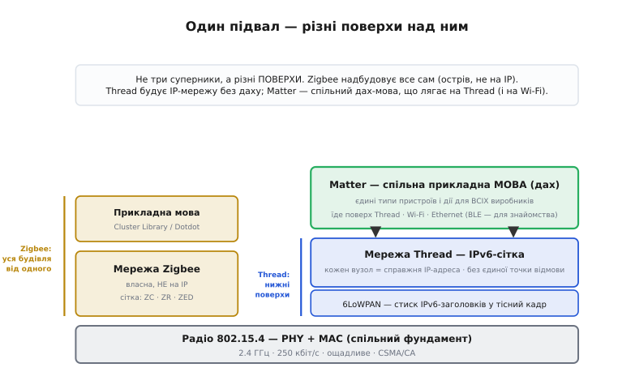
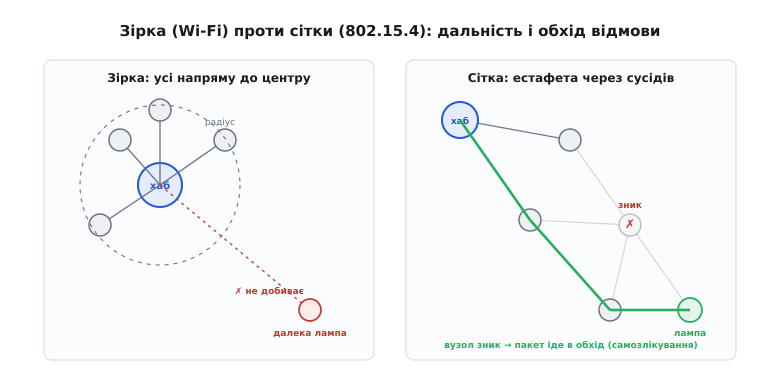

# Thread, Zigbee і Matter: стек розумного дому на 802.15.4

Ми вже вміємо рахувати [бюджет радіолінії](root:embedded/link-budget), розбираємо [покоління Wi-Fi](root:embedded/802-11-versions) і знаємо, як абоненти [ділять спільний ефір](root:embedded/multiple-access-methods). Здавалося б, для розумного дому цього досить: постав на лампочку Wi-Fi — і готово. Але спробуй — і впадеш у три прикрі стіни. Перша: Wi-Fi **ненажерливий** до струму, його радіо не годиться давачеві, що має жити рік від однієї батарейки (ми це бачили, коли говорили про [TWT у Wi-Fi 6](root:embedded/802-11-versions)). Друга: Wi-Fi **зірчастий** — кожен пристрій тягнеться напряму до роутера, і далека лампочка в гаражі просто не добиває. Третя, найболючіша: купив лампу одного бренду, розетку іншого, давач третього — і вони **не розмовляють** між собою, бо кожен говорить своєю мовою.

Звідси й виріс окремий світ радіо для розумного дому, де живуть три імені, що збивають з пантелику кожного новачка: **Zigbee**, **Thread** і **Matter**. Їх часто згадують поряд, ніби конкурентів, — і дарма. Уся плутанина зникає, щойно зрозумієш одну річ: **це не три суперники, а різні поверхи однієї будівлі**. Мета цієї теми — розкласти ту будівлю по поверхах: від спільного фундаменту-радіо знизу до спільної мови пристроїв нагорі. Коли побачиш поверхи, ти більше ніколи не сплутаєш, що з чим змагається, а що на чому стоїть.

> 🔧 **Навіщо це.** Коли ставиш на свій пристрій радіомодуль для розумного дому, у даташиті буде написано щось на кшталт «802.15.4, Zigbee 3.0, Thread 1.3, Matter-ready». Без карти поверхів це набір магічних слів. З картою — ти одразу бачиш: який фундамент (отже, яка дальність, швидкість і споживання), у яку мережу він стане і з ким зможе заговорити. Це різниця між «куплю й сподіваюся» та «знаю наперед, що воно вміє й з чим сумісне».

### Спільний фундамент: чому не Wi-Fi, а окреме радіо 802.15.4

Почнімо з підвалу, бо на ньому стоїть усе решта. Усі три імені — Zigbee, Thread і більшість мережі Matter — спираються на той самий радіостандарт: **IEEE 802.15.4**. Це родич того самого «802», що дав нам [802.11 (Wi-Fi)](root:com-transport/wifi), тільки гілка «.15.4» — про **низькошвидкісні персональні мережі малого радіуса** (*low-rate wireless personal area network*, LR-WPAN). Слово «персональна» тут означає не «приватна», а «навколо тебе, на десятки метрів» — на противагу «локальній» мережі Wi-Fi на весь будинок.

Чому під розумний дім зробили **окреме** радіо, а не взяли готовий Wi-Fi? Бо в давача й лампочки геть інші потреби. Wi-Fi заточений гнати **багато даних швидко** — відео, файли, гігабіти. А розумному давачеві треба раз на хвилину переслати кілька байтів («двері відчинено», «21.5 °C») — і **спати решту часу майже без струму**. Це протилежні задачі. Спроєктувати радіо під другу — означає викинути все зайве заради економії, і саме це робить 802.15.4.

Подивімося на його цифри — вони багато пояснюють. У головній всесвітній смузі 2.4 ГГц 802.15.4 дає лише **250 кбіт/с** — у сотні разів менше за Wi-Fi. Це не вада, а **свідомий вибір**: повільніший сигнал простіший, дешевший і — головне — потребує куди менше енергії на біт. Радіо вмикається на коротку мить, випльовує крихітний пакет і знову засинає. Смугу 2.4 ГГц поділено на **16 каналів** по 5 МГц (з 2.400 до 2.4835 ГГц); модуляція — **O-QPSK з розширенням спектра прямою послідовністю** (тим самим [DSSS, що ми бачили в боротьбі з глушінням](root:embedded/jamming-fhss)), що додає стійкості до завад у людному ефірі. *(Усе це — усталені факти стандарту IEEE 802.15.4 редакції 2003 року; є й повільніші суб-гігагерцові смуги — 868 МГц у Європі, 915 МГц в Америці — але дім стоїть переважно на 2.4 ГГц.)*

> 📡 **802.15.4 — що це й що ні.** Стандарт описує лише **два нижні поверхи**: фізичний рівень (радіо: смуга, модуляція, 250 кбіт/с) і канальний (як пакети ділять ефір, адресація сусідів, [CSMA/CA для уникнення колізій](root:com-transport/csma-ca)). І **все** — далі тиша. Він не каже, як з'єднати багато вузлів у мережу через увесь дім, як їх адресувати глобально, ані якими словами лампа скаже «увімкнись». Це навмисний мінімалізм: 802.15.4 дає лише надійний «постріл пакетом до сусіда», а що будувати поверх — лишає іншим. Саме тому над ним і виросли **різні** надбудови.

Отут і криється ключ до всієї плутанини. 802.15.4 — спільний підвал, але він **порожній зверху**. Над ним бракує трьох поверхів: **мережі** (як крихітні пакети дострибують через весь дім), **транспорту-адресації** (як кожен вузол має ім'я) і **прикладного рівня** (якими словами пристрої домовляються про дію). І Zigbee, і Thread, і Matter — це різні способи заповнити ці поверхи. Розгляньмо їх знизу вгору.

*Один підвал — радіо 802.15.4 (PHY + MAC). Над ним два різні «під'їзди» мережі: ліворуч цілісний стек Zigbee (власна мережа + власна прикладна мова), праворуч Thread (мережа на IPv6, але без верхнього поверху), а вже над Thread окремо лягає Matter — спільна прикладна мова. Видно одразу: Zigbee — це вся будівля від одного виробника правил; Thread — лише міцні нижні поверхи; Matter — дах, що накривається на Thread (а також на Wi-Fi).*

### Перша надбудова — мережа: як крихітний пакет дострибує через весь дім

Перш ніж розрізняти Zigbee і Thread, розберімо проблему, яку **обидва** мусять розв'язати, бо вона й визначає весь стек. Радіо 802.15.4 з його скромною потужністю добиває лише на сусідню кімнату. Як же лампочці в дальньому кутку поговорити з хабом біля вхідних дверей?

Відповідь — **сітка** (*mesh* — комірчаста мережа). Замість тягтися кожному напряму до центру (як у зірчастому Wi-Fi), вузли передають пакет **естафетою**: лампа в гаражі віддає пакет розетці в коридорі, та — давачеві у вітальні, а той уже хабу. Кожен вузол-ретранслятор робить лише короткий стрибок до сусіда — а разом вони покривають весь будинок. Більше вузлів — не гірше, а **краще**: мережа стає густішою й надійнішою.

І тут проявляється головна чеснота сітки — **самозлікування** (*self-healing*). Якщо якийсь вузол-ретранслятор зник (вимкнули розетку, сіла батарейка), пакет не губиться: сусіди знаходять **інший маршрут** в обхід. У зірці падіння єдиного шляху до роутера — це обрив; у сітці маршрутів багато, і мережа сама перешиває обхід. Саме тому сітка — природний вибір для дому, де пристрої з'являються, зникають і переїжджають.

*Ліворуч — зірка (Wi-Fi): усі промені сходяться в роутер, далека лампа поза радіусом — і обрив, якщо шлях один. Праворуч — сітка: вузли передають пакет естафетою сусід-сусідові, тож покриття тягнеться далі за один стрибок; коли вузол зникає (перекреслений), мережа сама знаходить обхідний маршрут. Густіша сітка — надійніша, а не повільніша.*

Щоб сітка працювала, у ній мусять бути різні **ролі**, і це теж спільне для Zigbee й Thread. Хтось має бути завжди ввімкнений і **ретранслювати** чужі пакети (такий вузол сидить на постійному живленні — розетка, лампа), а хтось — навпаки, лише зрідка прокидатися, сказати своє й заснути (давач на батарейці, який **нічого не ретранслює**, щоб берегти струм). Перші тримають кістяк сітки, другі живуть на її краях. Це фундаментальний поділ: **ретранслятори** на живленні vs **кінцеві вузли** на батарейках. Як саме його називають Zigbee і Thread — трохи різниться, і саме звідси почнімо їх розрізняти.

### Zigbee: уся будівля від одного власника правил

Історично першим порожній простір над 802.15.4 заповнив **Zigbee** — і заповнив його **цілком, згори донизу**. Це найстарший з нашої трійці: галузеве об'єднання Zigbee Alliance заснували [2002 року](root:embedded/thread-matter-zigbee/hist-zigbee-name.md), а першу специфікацію ратифікували 14 грудня 2004-го. *(Усталений факт; докладніше про сам альянс і кумедну назву — у вставці.)*

Сама назва — маленька історія, варта згадки. **Zigbee** походить від **зигзагу** (*zig-zag*), яким бджола малює свій «**вилястий танок**» (*waggle dance*), повернувшись у вулик, — так вона показує родичам напрямок до квітів. Аналогія напрочуд влучна: як бджоли передають одна одній дорогу маленькими сигналами, так і вузли сітки переказують пакети сусідами. *(Вилястий танок бджіл відкрив і описав етолог Карл фон Фріш на початку XX століття — усталений факт; зв'язок назви з ним докладніше — [у вставці](root:embedded/thread-matter-zigbee/hist-zigbee-name.md).)*

У Zigbee ролі сітки звуться так: **координатор** (*coordinator*, ZC) — головний вузол, що утворює мережу й тримає її коріння (зокрема ключі безпеки); **маршрутизатор** (*router*, ZR) — ретранслятор на постійному живленні, що передає чужі пакети; і **кінцевий пристрій** (*end device*, ZED) — ощадливий вузол, який лише говорить зі своїм «батьком» і **не ретранслює** нічого, тому може довго спати на батарейці. Це рівно той поділ ролей, що ми щойно вивели з природи сітки, — Zigbee лише дав їм імена.

Але головна риса Zigbee — **не** мережа, а те, що над нею. Zigbee — це **цілісний стек від підвалу до даху**: він описує не лише як пакети ходять сіткою, а й **якими словами** пристрої домовляються про дію. Цей верхній поверх — **бібліотека кластерів Zigbee** (*Zigbee Cluster Library*, пізніше перейменована на **Dotdot**): готовий словник на кшталт «увімкни/вимкни», «постав яскравість 70%», «яка температура?». Завдяки цьому словнику лампа й вимикач різних брендів **у теорії** розуміють одне одного без посередника.

> 🔧 **Навіщо це.** Цілісність Zigbee — і його сила, і його слабкість. Сила: купив Zigbee-хаб і Zigbee-лампу — усе працює з коробки, бо один стандарт покриває все. Слабкість: Zigbee — **острів**. Він говорить **власною** мовою, не сумісною ні з чим за межами Zigbee, і будувати міст у решту дому (Wi-Fi, інтернет, телефон) мусить **хаб-перекладач**. На практиці саме розбіжності в реалізаціях прикладного рівня й «профілів» між виробниками роками й псували сумісність — лампа одного бренду не завжди слухалася хаба іншого. Це і є та третя стіна, з якої ми почали, — і саме її прийшли ламати Thread і Matter.

Іще одне важливе про Zigbee, бо це його родова відмінність від наступника: Zigbee — **не на IP**. Він має власну, **непротоколову до інтернету** мережу й адресацію. Пакет Zigbee не є пакетом IP; щоб лампа потрапила «в інтернет» чи у застосунок на телефоні, хаб мусить **перекласти** Zigbee у звичні мережеві протоколи. Це ще один шар перекладу — і ще одне місце, де щось ламається. Запам'ятаймо цю рису: саме її переосмислив Thread.

### Thread: ті самі міцні нижні поверхи, але мовою інтернету

Тепер той самий підвал 802.15.4, та сама ідея сітки — але збудовано інакше. **Thread** (англ. *thread* — нитка) народився [2014 року](root:embedded/thread-matter-zigbee/hist-thread-matter.md): галузеву групу Thread Group заснували в липні 2014-го, серед засновників — Nest Labs (тоді вже куплена Google), Freescale Semiconductor, Silicon Labs, ARM, Samsung та інші. *(Усталений факт; Apple приєдналася 2018-го. Деталі — у вставці.)*

У чому ж відмінність, якщо радіо й сітка ті самі? У **мові мережі**. Зробивши головний вибір, творці Thread сказали: годі винаходити власну адресацію, як Zigbee, — **візьмімо IPv6**, ту саму версію інтернет-протоколу, якою живе сучасний інтернет ([IP-адреси й маршрутизацію ми вже бачили](root:com-transport/mac-ip-arp)). Кожен Thread-вузол отримує **справжню IPv6-адресу** — і стає повноправним мешканцем інтернет-світу, а не острівним пристроєм за перекладачем.

Як втиснути «важкий» IPv6 у крихітні пакети 802.15.4 на 250 кбіт/с? Адже IPv6-заголовок сам по собі більший за корисні дані давача. Тут і вмикається спритний шар-перехідник **6LoWPAN** (*IPv6 over Low-power Wireless Personal Area Networks* — «IPv6 поверх маломіжних персональних мереж»). Його робота — **стискати** громіздкі IPv6-заголовки до кількох байтів і **різати** довгі пакети на шматочки, що влазять у тісний кадр 802.15.4. Завдяки 6LoWPAN повноцінний IPv6 їде навіть по мізерному радіо. *(Це усталена основа Thread: 6LoWPAN поверх 802.15.4.)*

Ролі сітки в Thread схожі на Zigbee за суттю, але без єдиного «головного»: є **маршрутизатори** (*router*) — ретранслятори на живленні, що тримають кістяк; **кінцеві пристрої** (*end device*) — ощадливі вузли на батарейках; і **лідер** (*leader*) — один з маршрутизаторів, тимчасово обраний керувати мережею. Принципова відмінність від Zigbee-координатора: лідер **не незамінний**. Якщо він зникне, мережа **сама обере нового** з-поміж маршрутизаторів. Це робить Thread мережею **без єдиної точки відмови** — глибше самозцілення, ніж у класичної зірки з одним хабом.

> 🔧 **Навіщо це.** Те, що Thread-вузол має власну IPv6-адресу, — не формальність, а злам підходу. Лампа стає **звичайним мешканцем мережі**, з яким можна говорити тими самими протоколами, що й із сервером в інтернеті, — без острівного перекладача всередині. Це різко спрощує життя розробника: ти не вчиш окрему «мову Zigbee», а працюєш зі знайомими IP-інструментами. Саме на цій IP-природі Thread згодом і збудують спільний дах Matter — бо коли всі вузли «говорять IP», накрити їх єдиною прикладною мовою стає природно.

Але — і це критично для розуміння всієї будівлі — **Thread свідомо НЕ має верхнього поверху**. Він дає мережу й адресацію (IPv6 через сітку), надійну доставку крихітних пакетів — і на цьому зупиняється. Він **не каже**, якими словами лампа має сказати «увімкнись». Прикладного словника, як у Zigbee, у нього просто немає. Це не недогляд, а навмисний поділ праці: Thread будує **труби** (мережу), а **що нею слати** — лишає окремому стандарту. У будівлі він — міцні нижні поверхи без даху. І ось тут на сцену виходить третє ім'я.

### Matter: спільний дах — мова, якою всі врешті заговорили

Дійшли до верхівки — і до головної новини. Усі попередні роки кожна екосистема (Apple, Google, Amazon) мала **свій** прикладний поверх, і пристрої одного світу не розуміли іншого. Лампа «для Apple» не слухалася колонки Google. Ринок задихався від цієї роздробленості. Відповіддю став **Matter** (англ. *matter* — суть, річ, те, що має значення).

Matter — наймолодший: він почався [наприкінці 2019 року](root:embedded/thread-matter-zigbee/hist-thread-matter.md) як проєкт **Connected Home over IP** (CHIP — «дім, з'єднаний поверх IP»), і — нечуване — за столом сіли заклятні конкуренти **разом**: Amazon, Apple, Google і той самий альянс, що стояв за Zigbee. Перша специфікація Matter 1.0 вийшла 4 жовтня 2022 року. *(Усталений факт; той самий альянс саме тоді й перейменувався — про це нижче.)*

Що ж таке Matter за своєю суттю в нашій будівлі? Це **спільний прикладний поверх — дах**. Він робить рівно те, чого бракувало: задає **єдину мову** для типів пристроїв (лампа, розетка, замок, давач, термостат) і дій над ними, **спільну для всіх виробників і всіх екосистем**. Лампа з підтримкою Matter однаково слухається і дому Apple, і дому Google, бо говорить **не «мовою Apple» чи «мовою Google», а мовою Matter**. Це і є та сама роль, що її колись грала бібліотека кластерів Zigbee, — але цього разу **по-справжньому спільна**, бо за нею стоять усі великі гравці разом.

І ключове для нашої теми місце: **на чому Matter їздить**. Matter — це дах, і він лягає на **кілька** фундаментів одразу. Як мережу-носія Matter використовує **Thread** (для ощадливих сіткових пристроїв на батарейках), **Wi-Fi** (для пристроїв, яким треба смуга, — камер, дисплеїв) і **Ethernet** (дротові). А **Bluetooth Low Energy** служить лише для **знайомства** — первинного налаштування пристрою (*commissioning*): телефон через [BLE](root:com-protocol/ble-gatt) «зустрічає» нову лампу, дає їй ключі й заводить у потрібну мережу, після чого BLE більше не потрібен. *(Усталений факт: Matter працює поверх Wi-Fi, Ethernet і Thread; BLE — для введення в експлуатацію.)*

> 📡 **Чому Matter сів саме на Thread (а не на Zigbee).** Matter — прикладний поверх, і йому потрібна мережа, що **говорить IP**, бо сам Matter побудований на IP-протоколах. Thread дає рівно це: IPv6-сітку для ощадливих пристроїв. Zigbee ж має **власну, не-IP** мережу — Matter не може лягти прямо на неї без перекладу. Тому пара виходить природна: **Thread знизу — труби (IPv6-сітка), Matter згори — мова**, і разом вони покривають усю будівлю від радіо до дії. Старі Zigbee-пристрої теж можна ввести в дім Matter — але **лише через міст-перекладач** (*bridge*), який перекладає Zigbee у Matter.

> 🔧 **Навіщо це.** Ось практичний підсумок для розробника пристрою. Якщо твій виріб — ощадливий давач чи актуатор на батарейці, природний шлях нині: **Thread як мережа + Matter як мова**, і він з коробки стане в дім будь-якого з трьох гігантів. Якщо виробу треба смуга (камера) — Matter поверх **Wi-Fi**. Свіжі чіпи (наприклад, ESP32-C6, ESP32-H2) уже несуть радіо 802.15.4 саме заради Thread/Matter поряд із Wi-Fi/BLE. А Zigbee лишається величезним наявним парком пристроїв, який Matter не викидає, а підбирає через мости. Карта поверхів одразу каже тобі, що обрати під конкретний виріб — і чому.

### Хто є хто: альянси й чому імена плутаються

Лишилося прибрати останнє джерело плутанини — **назви організацій**, бо вони змінювалися й накладаються. Розплутаймо коротко, бо без цього легко загубитися в новинах.

Альянс, що створив **Zigbee** (Zigbee Alliance, з 2002 року), 11 травня 2021-го **перейменувався** на **Connectivity Standards Alliance** (CSA — «альянс стандартів зв'язку»). Саме CSA нині веде і Zigbee, і Matter. Тобто **той самий орган** стоїть і за найстарішим стеком (Zigbee), і за найновішим дахом (Matter) — звідси частина каші в головах. А **Thread** веде окрема **Thread Group** (з 2014-го). *(Усі дати — усталені факти.)*

> 📛 **Три імені — три ролі, не три суперники.** Закарбуймо різницю однією фразою кожному. **Zigbee** — цілісний стек-острів від одного власника правил: своя сітка + своя мова, працює з коробки, але сам по собі. **Thread** — лише міцні нижні поверхи: IPv6-сітка на 802.15.4, **без** прикладної мови. **Matter** — спільний дах-мова, що лягає на Thread (а також Wi-Fi/Ethernet) і нарешті дає сумісність між екосистемами. Zigbee займає всю будівлю сам; Thread + Matter будують її **вдвох**, поверхами.

### Зведімо будівлю докупи

Повернімося до тривоги, з якої почали: три імені поряд, ніби конкуренти. Тепер видно, що це **омана рівнів**. Усе стоїть на спільному підвалі — ощадливому радіо **802.15.4** (250 кбіт/с, 2.4 ГГц), свідомо повільному заради економії струму, з обов'язковою **сіткою** зверху, щоб крихітний сигнал дострибав через увесь дім. А далі починаються відмінності поверхів.

**Zigbee** надбудовує над підвалом **усю будівлю сам**: власну не-IP мережу й власну прикладну мову. Цілісно, з коробки — але острівно, мовою, не сумісною ні з чим, окрім Zigbee, через що екосистеми роками не сходилися. **Thread** будує лише **нижні поверхи**, зате **мовою інтернету**: IPv6 через 6LoWPAN, кожен вузол — повноправний IP-мешканець, мережа без єдиної точки відмови — але **без даху**, без слів для дії. **Matter** і є той **дах**: спільна прикладна мова для всіх виробників, що лягає на Thread (а також на Wi-Fi та Ethernet), а через мости підбирає й старий Zigbee.

Тому правильне питання — не «Zigbee чи Thread чи Matter», а «**який поверх**». Це різні поверхи однієї будівлі розумного дому: радіо-фундамент → мережа-сітка → прикладна мова. Знаючи цю карту, ти прочитаєш будь-який даташит радіомодуля, як відкриту книгу: побачиш, який у нього підвал (отже, дальність і споживання), у яку мережу він стане і якою мовою заговорить із рештою дому. А сам цей стек — лише **один кут** ширшого світу маломіжного бездротового зв'язку: поряд живуть [далекобійні LPWAN-мережі](root:embedded/lpwan) для кілометрових відстаней, де компроміси зовсім інші, — але це вже сусідня будівля.
