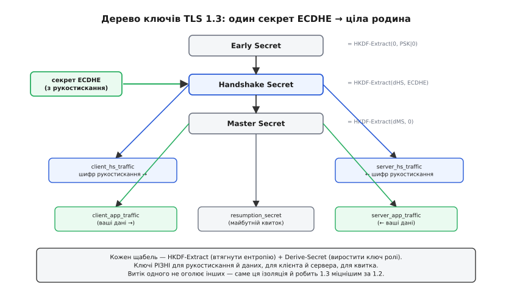
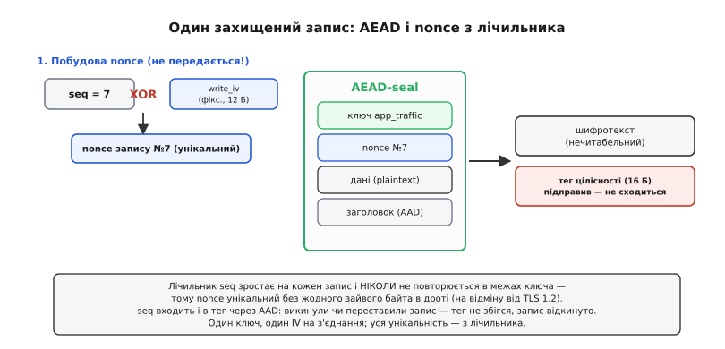
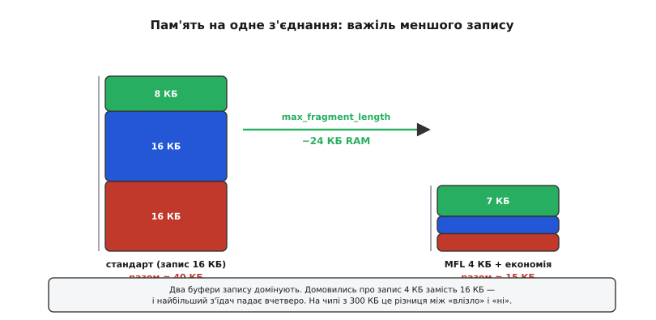

# TLS на мікроконтролері: як воно влаштоване всередині

<preknowlist>
- [Сокети TCP/UDP](root:sf-os/sockets-tcp-udp) — надійний потік байтів (TCP) і ненадійні датаграми (UDP); TLS лягає поверх TCP, DTLS — поверх UDP.
- [Secure boot](root:sf-security/firmware-secure-boot) — цифровий підпис і ланцюг довіри до незмінного кореня; TLS вживає ту саму механіку, лише повернуту назовні.
- [Апаратний корінь довіри](root:embedded/tpm-trustzone) — де на пристрої безпечно тримати приватний ключ, щоб його не вичитали з пам'яті.
- [NVS](root:sys-fw/nvs) — постійна пам'ять ключ-значення на пристрої; у ній переживає перезавантаження квиток відновлення сесії.
</preknowlist>

У базовій частині ми пройшли нитку згори: чужий дріт, три загрози, три гарантії TLS, обмін ключами Діффі — Гелмана, підпис і сертифікат, рукостискання за один оберт, чотири тиски на мікроконтролер. Там ми дивилися на TLS **ззовні** — як на чорну скриньку, що перетворює відкритий потік на захищений. Тепер відкриємо скриньку й подивимось, **як саме** ці шестерні зчеплені: з яких точно повідомлень складається рукостискання і що робить кожне, як з одного секрету ECDHE народжується не один ключ, а ціле дерево, як запечатано **кожен окремий** запис і чому там не летить жодного зайвого байта, звідки беруться ті кілобайти RAM до останнього числа, і що робити, коли навіть TCP під ногами зникає й лишається сама UDP-датаграма. Це та сама тема, але тепер — з відкритою кришкою.

Мета не в тому, щоб ви написали власний TLS (цього робити **не треба** — про це нижче), а в тому, щоб ви **розуміли, за що смикаєте**, коли конфігуруєте бібліотеку: чому один прапорець економить двадцять кілобайтів, а інший тихо ламає весь захист; чому одна крива швидша за іншу вдвічі; чому квиток відновлення — це вигідно, але з дрібним боргом. Коли машинерія прозора, ці рішення перестають бути ворожінням.

## Рукостискання під мікроскопом: повідомлення за повідомленням

У базовій частині рукостискання було трьома стрілками: пристрій кинув частку, сервер відповів часткою з сертифікатом, пристрій сказав «Finished». Насправді за цими трьома обертами ховається точна послідовність **іменованих повідомлень**, і кожне несе свою вагу. Розберімо їх по черзі — бо саме тут видно, **де** зосереджена ціна й **чому** саме там.

**ClientHello** — перше слово пристрою. Здавалося б, просто «привіт», але воно вантажене. У ньому пристрій відразу перелічує: які версії TLS він тягне (для 1.3 — спеціальне поле `supported_versions`, бо саме число «1.3» у старому полі версії лишили як «1.2» задля сумісності зі старими проміжними вузлами, що інакше рвали з'єднання); які набори шифрів пропонує; які **іменовані групи** (криві) знає для обміну ключами; і — головне — **вже кладе свою відкриту частку ECDHE** у поле `key_share`. Оце «наперед» — суть швидкості TLS 1.3: пристрій **вгадує**, яку криву обере сервер, і одразу шле частку саме для неї, не чекаючи запиту. Вгадав — і половина рукостискання вже позаду в першому ж пакеті.

А якщо **не** вгадав? Пристрій прислав частку для X25519, а сервер налаштований лише на іншу криву. Тоді сервер не може вивести спільний секрет — частки потрібної групи в нього немає. І замість ServerHello він відповідає **HelloRetryRequest**: «частку прислав не тієї групи, надішли для отакої». Пристрій викидає першу спробу, генерує **нову** частку для вказаної кривої й шле ClientHello вдруге. Наслідок прямий і болючий: рукостискання розтягується на **два оберти** замість одного (кажуть «2-RTT»), а на пристрої це друга порція еліптичної математики й другий похід через мобільний модем із його затримкою. Мораль для налаштування: список кривих пристрою й сервера має **перетинатися першою** позицією — тоді перше вгадування влучає, і HelloRetryRequest не спрацьовує ніколи. Це не абстракція: сплутані `groups_list` на клієнті й сервері — типова причина того, що з'єднання «то є, то зникає» й дивно повільне.

**ServerHello** — відповідь сервера, і саме з цієї миті починається магія. Сервер обрав групу й **кладе свою відкриту частку** ECDHE. Цього досить: у сервера тепер є **своя приватна** частка й **чужа відкрита** — а отже, він **уже може вивести спільний секрет**. І він його виводить негайно. Тому все, що йде в тому самому польоті **після** ServerHello, сервер **уже шифрує** ключем рукостискання. Це вирішальна відмінність від TLS 1.2, де сертифікат летів відкритим текстом: у 1.3 навіть особу сервера видно лише тому, хто пройшов обмін ключами.

Далі, вже під шифром рукостискання, ідуть три повідомлення поспіль:

**EncryptedExtensions** — дрібні домовленості, які не впливають на криптографію й тому можна відкласти під шифр: обраний прикладний протокол, узгоджений максимальний розмір запису (той самий важіль RAM, до якого повернемось), інші розширення. Те, що вони **зашифровані**, — приємний бонус приватності: сторонній не бачить навіть, який протокол ви узгодили.

**Certificate** — сервер шле свій сертифікат (а точніше, весь ланцюг до кореня). Ось **перша** дорога річ на мікроконтролері: сертифікат у форматі X.509 — це громіздка структура в кодуванні, яке треба розбирати, і кілька кілобайтів, які треба десь **прийняти й тримати**, поки перевіряєш. Ланцюг із двох-трьох сертифікатів легко дає 3–5 КБ, які мусять поміститися в буфер.

**CertificateVerify** — і ось **друга** дорога річ, серце автентичності. Сервер бере **геш усього рукостискання дотепер** (усіх повідомлень, що пролетіли) і **підписує** його своїм приватним ключем. Це тонший хід, ніж здається на перший погляд, тож затримаймось. Навіщо підписувати саме геш **транскрипту**, а не якесь фіксоване гасло? Бо транскрипт **унікальний для цієї сесії**: у нього вплетена свіжа відкрита частка ECDHE сервера й випадкові числа обох сторін. Самозванець не може взяти чужий старий підпис і підсунути його — той підпис прив'язаний до **іншого** транскрипту, з **іншими** частками. Підпис під транскриптом доводить одразу дві речі: що на тому кінці справді власник приватного ключа з сертифіката, **і** що він бачив рівно ту саму розмову, що й ми, — ніхто посередині нічого не переписав. Ось де на мікроконтролері горить процесор: **перевірка цього підпису** — повноцінна операція на еліптичній кривій, сотні тисяч тактів.

**Finished** (сервера, потім пристрою) — печатка під усім рукостисканням. Це код автентичності (MAC), узятий по всьому транскрипту на ключі, виведеному зі спільного секрету. Він каже: «я — та сама сторона, що вивела той самий секрет, і я бачив рівно цей транскрипт від початку до кінця». Обмінявшись Finished, сторони **математично впевнені**, що жоден біт рукостискання не підмінили: якби зловмисник посеред дороги викинув чи переставив бодай одне повідомлення, гелі транскриптів розійшлися б і Finished не зійшовся б. Після Finished пристрій перемикається з ключів рукостискання на ключі **даних** — і відкритий потік нарешті стає захищеним.

Тепер видно точну географію ціни. Уся дорожнеча TLS сидить у **двох** повідомленнях сервера — Certificate (кілька КБ RAM на розбір) і CertificateVerify (сотні тисяч тактів CPU на перевірку підпису) — плюс у власному виведенні спільного секрету ECDHE. Усе решта — ClientHello, ServerHello, EncryptedExtensions, Finished — дешеве. Саме тому вся інженерія далі крутиться навколо того, як цю коротку, але важку **першу зустріч** здешевити або взагалі пропустити.

## Одне зерно — ціле дерево ключів

У базовій частині ми зупинились на тому, що обидві сторони виводять «однакове число» — спільний секрет ECDHE. Але сказати, що цим числом одразу шифрують дані, було б неправдою, і за цією неправдою ховається одна з найглибших ідей TLS 1.3. Спільний секрет ECDHE **ніколи не вживають напряму**. Він — лише **зерно**, з якого за суворим правилом виростає ціле **дерево** окремих ключів: свій для кожної ролі, кожного напрямку, кожної фази розмови.

Навіщо така складність? Бо один ключ на все — крихкий. Якщо тим самим ключем шифрувати і рукостискання, і дані, і в обидва боки, то будь-яка слабкість в одному місці протікає в усі інші, а деякі криптографічні атаки саме й спираються на те, що той самий ключ бачив різні типи повідомлень. TLS 1.3 закриває цей клас загроз **конструктивно**: розділяє ключі так, що витік одного нічого не каже про решту. Ключ, яким шифрували рукостискання, — **не той**, яким шифрують дані. Ключ клієнта — **не той**, що ключ сервера. Ключ для майбутнього квитка відновлення — **знову інший**. Кожен ізольований.

Правило, за яким із зерна виростають ці ключі, зветься **key schedule** (англ. — «розклад ключів»), а рушій його — функція **HKDF** (англ. *HMAC-based Key Derivation Function* — виведення ключів на основі HMAC). У неї дві дії, і поділ праці між ними — вся суть. Перша, **HKDF-Extract**, бере сирий матеріал (той секрет ECDHE, у якому багато ентропії, але вона «нерівно розмазана») і **втягує** цю ентропію в один рівномірний ключ-корінь. Друга, **HKDF-Expand** (у TLS її звуть Derive-Secret), навпаки — з одного кореня **вирощує** скільки завгодно похідних ключів, кожен зі своїм **іменем-міткою**: рядок «tls13 c hs traffic» дає ключ трафіку рукостискання клієнта, «tls13 s ap traffic» — ключ даних сервера, і так далі. Мітка входить у виведення, тож два ключі з **різними** мітками математично незалежні, хоча й ростуть з одного кореня.


*Секрет ECDHE не вживають напряму — він лише вливається в сходи HKDF. Extract утягує ентропію в корінь, Derive-Secret вирощує з нього іменовані ключі. Ключі різні для рукостискання й даних, для клієнта й сервера, для квитка; витік одного не оголює інших. Саме ця ізоляція й робить TLS 1.3 структурно міцнішим за 1.2, ще до всіх викинутих легасі-можливостей.*

Дерево росте трьома щаблями, і на кожному в корінь **вливають** новий шматок матеріалу — це видно на схемі. Перший щабель, **Early Secret**, — коли ECDHE ще нема; сюди втягують попередньо поділений ключ (або нулі, якщо його нема). Другий, **Handshake Secret**, — сюди вливають **секрет ECDHE** з рукостискання; з нього ростуть два ключі трафіку рукостискання (клієнта й сервера), якими шифрують ті самі Certificate і CertificateVerify. Третій, **Master Secret**, — з нього ростуть ключі **даних** (client/server application traffic) і той окремий ключ, з якого потім зроблять **квиток** відновлення сесії. Кожен щабель — це «втягнути свіжий матеріал, тоді вирощувати ключі ролей»; наступний завжди спирається на попередній, тож усе дерево прив'язане до одного початкового зерна ECDHE.

Ця будова — не декоративна: вона прямо дає **пряму таємність**, про яку ми говорили в базовій. Ключі даних виведені з ефемерного секрету ECDHE, який існував лише під час цього рукостискання й якого більше немає. Довгостроковий ключ сервера в це дерево **не вливається зовсім** — він лише **підписав** транскрипт, але в саме виведення ключа шифрування не входить. Тому навіть повне викрадення довгострокового ключа сервера **згодом** не дає розшифрувати стару розмову: у дереві тієї розмови його ніколи й не було. У TLS 1.2 бувало інакше — там ключ міг залежати від довгострокового секрету напряму, і саме цю дірку 1.3 закрив, викинувши старий спосіб зовсім.

Повне виведення — з точними входами, мітками й тим, як у виведення вплітається геш транскрипту, — має свою вагу й свою красу; хто хоче простежити [весь ланцюг HKDF від секрету ECDHE до ключів запису](root:embedded/tls-embedded/math-key-schedule.md) число за числом, знайде його в окремій вставці, а для нитки тут досить головного: одне зерно, суворе правило, дерево ізольованих ключів, і жодного довгострокового секрету в гілках, що шифрують дані.

## Як запечатано один запис

Рукостискання позаду, ключі даних виведені. Тепер по каналу течуть **записи** (англ. *record*) — блоки, на які TLS ріже потік, — і кожен окремий запис треба запечатати так, щоб його не прочитали й не підмінили. Робить це **AEAD-шифр** (англ. *Authenticated Encryption with Associated Data* — шифрування з автентифікацією й супровідними даними): одна операція, що **заразом** і ховає вміст, і ставить печатку цілісності. У базовій ми назвали це «симетричним потоком»; тепер розберемо, що діється з **кожним** записом, бо там є тонкість, яку TLS 1.3 зробив напрочуд елегантно.

AEAD-шифр на вхід бере чотири речі: **ключ** (той самий на всі записи цього напрямку), **дані** (те, що ховаємо), **супровідні дані** (заголовок запису — його не ховають, але він має бути захищений від підміни) і — критично — **nonce** (англ. — «число, вжите один раз»). Nonce мусить бути **унікальним для кожного запису під одним ключем**. Це не забаганка, а питання життя й смерті шифру: якщо той самий ключ ужити з тим самим nonce двічі, більшість AEAD-шифрів **катастрофічно** розкриваються — з двох записів можна відновити відкритий текст, а для деяких режимів навіть підробити майбутні печатки. Тобто повторення nonce — це не «трохи слабше», а «захисту немає».

Як гарантувати унікальність nonce, не витрачаючи на це зайвих байтів у кожному пакеті? TLS 1.2 робив це незграбно: клав частину nonce **явно в кожен запис** — зайві вісім байтів на пакет, та ще й ці вісім байтів як випадкове число **закороткі**, щоб надійно не повторитися, через що траплялися реальні провали в кривих реалізаціях. TLS 1.3 вигадав інакше й краще. Він помітив очевидне: записи в TLS **йдуть по порядку**, тож у кожного вже є природний унікальний номер — **лічильник записів** (sequence number), що починається з нуля й росте на одиницю з кожним записом. Нехай же nonce **обчислюється** з цього лічильника, а не передається!

Формула гранично проста. Є **фіксований** для всього з'єднання вектор `write_iv` (виведений із дерева ключів, 12 байтів). Nonce конкретного запису — це:

```
nonce = write_iv XOR seq
```

де `seq` — номер запису, доповнений нулями зліва до 12 байтів, а XOR (виключне «або») — побітове складання. Оскільки `seq` унікальний для кожного запису, а `write_iv` сталий, результат XOR теж унікальний для кожного запису — і при цьому **не передається дротом узагалі**: обидві сторони мають той самий `write_iv` і той самий лічильник, тож рахують той самий nonce незалежно. Нуль зайвих байтів у пакеті, а гарантія унікальності — залізна.


*Лічильник seq зростає на кожен запис і не повторюється в межах ключа, тому nonce унікальний без жодного зайвого байта в дроті — на відміну від TLS 1.2. AEAD-seal одним рухом ховає дані й ставить тег. Лічильник входить і в тег через супровідні дані: викинули чи переставили запис — тег не збігся, і запис відкинуто.*

У цього лічильника є **другий** дар, окрім nonce. Він входить у розрахунок печатки (через супровідні дані), тож захищає не лише окремий запис, а й **порядок** записів. Уявіть, що зловмисник на дорозі не читає вміст (не може), але **викидає** третій запис або **переставляє** місцями другий і четвертий — сам факт такої підміни може щось зламати на прикладному рівні. З лічильником це неможливо: приймач чекає запис із номером 3, а бачить розрахований для номера 4 — печатка не сходиться, запис відкинуто. Порядок і повнота потоку захищені **безкоштовно**, самим лічильником.

Розгляньмо конкретний запечатаний запис, щоб побачити механіку цілком.

**Умова: пристрій відправляє п'ятий за рахунком запис даних; ключ і write_iv уже виведені з рукостискання.** Треба показати, що саме йде в AEAD і що виходить.

```c
// стан з'єднання (спрощено): ключ, фіксований IV, лічильник записів
uint8_t  key[16];          // ключ трафіку даних (з дерева ключів)
uint8_t  write_iv[12];     // фіксований на все з'єднання
uint64_t seq = 5;          // це п'ятий запис у цьому напрямку

// 1. nonce цього запису — БЕЗ передавання: рахуємо з лічильника
uint8_t nonce[12];
memcpy(nonce, write_iv, 12);
for (int i = 0; i < 8; i++)                 // seq лягає у молодші 8 байтів
    nonce[11 - i] ^= (uint8_t)(seq >> (8 * i));   // write_iv XOR seq

// 2. супровідні дані (AAD) — заголовок запису; НЕ шифрується, але захищене тегом
uint8_t aad[5] = { 0x17, 0x03, 0x03, len_hi, len_lo };   // тип + версія + довжина

// 3. запечатати: дані → шифротекст (тієї ж довжини) + тег 16 байтів
uint8_t  ct[MAX];
uint8_t  tag[16];
aead_seal(key, nonce, aad, sizeof aad, plaintext, pt_len, ct, tag);

// у дріт іде: aad ‖ ct ‖ tag.  seq НЕ передаємо — приймач знає його сам.
seq++;                                       // наступний запис — номер 6
```

Зверніть увагу на два місця. Перше — `seq` **не потрапляє** в дріт ніде: приймач тримає власний лічильник і знає, що це п'ятий запис, бо порахував попередні чотири. Друге — тег на 16 байтів: це і є та **печатка цілісності**, яку приймач перерахує зі свого ключа й nonce і звірить; розбіжність бодай на біт — і весь запис відкинуто, жоден байт не піде на прикладний рівень. Уся вартість тут — одна симетрична операція на запис, і вона **дешева** проти рукостискання: саме тому після важкої першої зустрічі розмова летить легко.

> 🔧 **Навіщо це.** Ця будова пояснює, чому в реальній прошивці **не можна** самому «трохи допомогти» шифру — наприклад, зберегти й перевикористати з'єднання в обхід бібліотеки, згубивши лічильник, або підмінити IV. Одне повторення nonce — і AEAD розкривається повністю. Тому лічильник і IV — це стан, який веде **бібліотека** й ніхто інший; ваша робота — не заважати їй і не намагатися «оптимізувати» те, що вже оптимальне. Коли розумієш, що nonce не передається й береться з лічильника, стає ясно, чому спроби «підняти те саме з'єднання після сну вручну» — це прямий шлях повторити nonce й зламати захист.

Двоє AEAD-шифрів, що їх реально вживає TLS 1.3 на пристроях, — **AES-GCM** і **ChaCha20-Poly1305** — по-різному рахують ту печатку. AES-GCM ставить тег через операцію в скінченному полі (GHASH), яка на процесорі без апаратної підтримки помітно повільна. ChaCha20-Poly1305 ставить тег через Poly1305 — множення й додавання за модулем простого числа, що чудово лягає на звичайні цілочислові команди. Звідси й та перевага ChaCha20 на чипах без AES-прискорювача, про яку йшлося в базовій; чому саме так і скільки саме виграшу — нижче, коли дійдемо до важелів.

## Чотири тиски, порахованих до кілобайта

Базова частина назвала чотири тиски якісно: RAM, Flash, CPU, сховище довіри. Тепер порахуймо їх — бо конкретні числа перетворюють «TLS тісний» на «ось скільки саме й ось який важіль скільки віддає».

**RAM — і чому саме буфери запису.** Найбільший з'їдач пам'яті — не ключі й не сертифікати, а **буфери запису**. TLS-запис за стандартом може сягати **16 КБ** (точніше 2¹⁴ байтів корисного вмісту). Бібліотека мусить мати місце **прийняти такий запис цілком**, перш ніж почне його розшифровувати: розшифрувати «половину» запису не можна — тег цілісності рахується по **всьому** запису, тож поки не зібрано весь, перевірити нічого. Отже, потрібен вхідний буфер під повний запис — до 16 КБ. І симетрично вихідний — щоб зібрати запис перед відправкою. Уже **32 КБ** лише на два буфери, ще до корисних даних. Додайте купу самого рукостискання — місце під розбір сертифіката, під проміжні числа еліптичної математики, під транскрипт для гешування, — і це ще 7–8 КБ. Разом близько **40 КБ на одне з'єднання**. На чипі з 300 КБ RAM це відчутний шмат; а якщо з'єднань треба два-три, картина стає гострою.

Важіль тут точковий і потужний: **домовитися про менший максимальний запис**. Якщо сторони погодяться, що записи не більші за 4 КБ, вхідний і вихідний буфери падають з 16 до 4 КБ кожен — і два буфери разом стискаються з 32 до 8 КБ. Мінус **24 КБ** з нічого, лише узгодженням числа на початку.


*Два буфери запису домінують у бюджеті. Домовились про запис 4 КБ замість 16 КБ — і найбільший з'їдач падає вчетверо, з 32 КБ буферів до 8. На чипі з 300 КБ це нерідко різниця між «влізло одне з'єднання» і «не влізло».*

Тут ховається важлива тонкість про **сам механізм** узгодження, і на мікроконтролері вона практична. Історично для цього був розширення `max_fragment_length` (RFC 6066): клієнт пропонує стелю, а сервер мусить її **луною повторити**. У цього способу два ґанджі. Перший: дозволені значення дискретні й малі — стеля не вища за 2¹² = **4096** байтів, тобто дрібнішого за 4 КБ теж не попросиш, лише 512/1024/2048/4096. Другий, підступніший: **сервер не може попросити менше, ніж клієнт** — він лише повторює клієнтське значення. А якщо саме **сервер** тісніший за клієнта (буває на симетричних вбудованих з'єднаннях «пристрій ↔ пристрій»)? Тоді він безсилий. Новіше розширення `record_size_limit` (RFC 8449) виправляє обидві біди: кожна сторона оголошує **свою** стелю незалежно, і діє менша з двох. Практичний нюанс, який варто знати, беручись за конкретну збірку: у популярній на мікроконтролерах mbedTLS довго був реалізований саме старий `max_fragment_length`, а не новіший `record_size_limit`, — тож на практиці ви крутите значення 512…4096 через нього, і в конфігурації бібліотеки цей самий важіль зветься максимальною довжиною вмісту запису.

**Flash — код, якого могло б не бути.** Прошивка TLS — це десятки кілобайтів коду: реалізації еліптичних кривих, розбір X.509 у його громіздкому кодуванні, кілька AEAD-шифрів, HKDF, робота з сертифікатами. Кожен **зайвий** підтримуваний варіант лежить у Flash мертвим вантажем. Тримаєте в збірці п'ять наборів шифрів «про всяк випадок» — це п'ять реалізацій у Flash, хоча з'єднання завжди йде **одним**. Тому вбудований TLS збирають **вибірково**: лишають рівно ту криву (скажімо, одну X25519), рівно той AEAD (один, потрібний під сервер) і викидають решту прапорцями компіляції. Різниця між «повною» й «підрізаною» збіркою легко сягає десятків кілобайтів Flash.

**CPU — де горять такти.** Ми вже локалізували гаряче місце: **обмін ключами ECDHE** (одна операція на кривій, щоб вивести спільний секрет) і **перевірка підпису** в CertificateVerify (ще одна операція на кривій). На скромному ядрі без апаратного прискорювача це разом **сотні мілісекунд**. Для пристрою, що прокидається раз на хвилину віддати показ і засинає, ці сотні мілісекунд «на розігрів каналу» — відчутна частка і часу неспання, і з'їденого заряду. Два важелі: **апаратний прискорювач** крипто (у сучасних мережевих мікроконтролерів він зазвичай є — бере на себе AES, іноді й операції на кривій), і вибір **коротшої, швидшої кривої**. X25519 тут — майже завжди правильний вибір, і не лише через швидкість.

Ось де варто затриматись, бо в базовій ми лише згадали «еліптичні криві», а різниця між кривими для мікроконтролера відчутна. **X25519** — крива, яку 2005 року опублікував Деніел Бернстайн (Daniel J. Bernstein) під назвою Curve25519; це усталений факт, крива й досі одна з двох обов'язкових груп у TLS 1.3. Її будували **навмисне** так, щоб бути швидкою й безпечною саме в реалізації: обчислення на ній природно виходить **сталим за часом** (constant-time), тобто триває однаково незалежно від секретних бітів. Це критично проти цілого класу атак — **за часом** (timing attack): якщо тривалість операції залежить від секрету, зловмисник, вимірюючи час, потроху **вичитує** секрет, навіть не бачачи його. Старіші криві легко реалізувати так, що час **тече** секрет; X25519 своєю будовою заганяє реалізацію в сталий час, закриваючи цю дірку **конструктивно**. Для пристрою, до якого ворог має фізичний доступ і може міряти струм чи час, це не абстракція, а справжній захист — тому там, де є вибір, беруть саме X25519: вона й швидша, і безпечніша в реалізації.

**Довіра — де тримати секрети.** Четвертий тиск — не про обчислення, а про **зберігання**. Кореневі сертифікати CA треба десь тримати незмінно (підмінили корінь — упав увесь ланцюг довіри). А **власний приватний ключ** пристрою, яким він засвідчує себе серверу (коли сервер теж хоче автентифікувати клієнта — так званий взаємний TLS), — це секрет, що прямо просить того самого захисту, який ми будували в темі про [апаратний корінь довіри](root:embedded/tpm-trustzone): щоб ключ **не витік** і щоб його не вичитали з пам'яті ні через порт налагодження, ні виколупуванням із Flash. Найкраще такий ключ не тримати в загальній пам'яті **взагалі** — про це в кінці, коли дійдемо до захищеного елемента.

Кожен тиск, отже, має свій важіль, і вся інженерія вбудованого TLS — це вправне смикання за чотири: менший запис (RAM), один набір шифрів (Flash), апаратне крипто й коротка крива (CPU), захищене сховище (ключі). Тепер — про вибір шифру, найтонший із важелів CPU.

## Чому ChaCha20 на голому ядрі виграє

Повернімось до двох AEAD-шифрів із їхніми різними способами ставити печатку — тепер із числами. AES-GCM спирається на дві речі: сам блоковий шифр AES і операцію GHASH для тегу (множення в скінченному полі GF(2¹²⁸)). Обидві на процесорі **без спеціальних команд** рахуються повільно: AES вимагає таблиць підстановок і багатьох раундів, а GHASH — незручного для звичайного ядра множення в полі. Саме тому на всіх «великих» процесорах давно є **апаратні** команди AES: там AES-GCM літає, і питання вибору не стоїть.

ChaCha20-Poly1305 будували з іншим прицілом — бути швидким **без** будь-якого спеціального заліза. ChaCha20 — це додавання, XOR і циклічні зсуви 32-бітних чисел, тобто рівно ті операції, які будь-яке ціле ядро робить нативно й швидко. Poly1305 — множення й додавання за модулем простого числа, знову ж таки лягає на звичайну арифметику. Наслідок: на ARM Cortex-M **без** AES-прискорювача ChaCha20-Poly1305 зазвичай **помітно швидший** за програмний AES-GCM — за різними вимірами від приблизно півтора до кількох разів на малих повідомленнях, залежно від реалізації. Це прямий виграш і в часі неспання, і в заряді батареї.

Тут потрібна чесна засторога, щоб не перетворити правило на догму. Перевага ChaCha20 — саме **без апаратного прискорення** й **на типовій, не вручну-оптимізованій** реалізації. Якщо AES-GCM написати **вручну асемблером** під конкретне ядро (Thumb-2), його можна розігнати в рази, і розрив із ChaCha20 звужується. А якщо на чипі **є** апаратний AES — він, звісно, обійде програмний ChaCha20. Тож правило звучить точно так: **немає апаратного AES → бери ChaCha20-Poly1305; є → бери AES-GCM з апаратним прискоренням.** У більшості мережевих мікроконтролерів апаратний AES **є**, тож на них частіше беруть AES-GCM; але на найдешевших ядрах без нього ChaCha20 — прямий і правильний виграш, і саме тому TLS 1.3 тримає його як повноцінний рівноправний шифр.

## Як цим користуватися насправді: mbedTLS і її ручки

Уся ця машинерія — рукостискання, key schedule, AEAD, важелі — вже написана, вивірена й портована. Писати власний TLS **не треба й небезпечно**: криптографічний код зловити тонкими помилками (той самий не-сталий час, той самий повторений nonce) настільки легко, що навіть фахівці роблять це роками; ваша задача — **правильно вжити** готову бібліотеку, а не переписати її. На мікроконтролерах стандарт де-факто — **mbedTLS**: невелика, модульна, з ручками рівно під ті чотири важелі. У базовій ми бачили найпростіший виклик через обгортку `esp_tls`; тут подивимось на **самі ручки** — на те, що ви реально крутите в конфігурації, коли підганяєте TLS під тісний чип.

Головних ручок стільки ж, скільки тисків.

**Розмір запису (RAM).** У конфігурації mbedTLS максимальну довжину вмісту запису задають прапорцем, і зменшення її з 16 КБ до 4 КБ (чи навіть менше під конкретний протокол) — той самий важіль RAM, що ми рахували. Це найбільша окрема економія пам'яті, і чіпати її треба свідомо: запис має вмістити найбільше повідомлення вашого прикладного протоколу (наприклад, найбільший MQTT-пакет чи HTTP-заголовок), інакше воно не пройде.

**Набір шифрів і криві (Flash + CPU).** У конфігурації вимикають **усі** непотрібні набори шифрів, лишаючи рівно один-два, і так само лишають рівно потрібні криві (одну X25519). Кожен викинутий варіант — це і Flash звільнений, і менше коду, у якому може ховатися вада.

**Апаратне крипто (CPU).** Прапорці, що перемикають AES, геш чи операції на кривій на **апаратний** блок чипа замість програмного, — на платах, де таке залізо є. Це різниця між рукостисканням на сотні мілісекунд і на десятки.

**Сховище довіри (ключі).** Указання, звідки брати кореневі сертифікати CA, і — за потреби взаємного TLS — інтерфейс до **захищеного зберігання** приватного ключа (щоб ключ жив не в загальній Flash, а в захищеному елементі; про це нижче).

Одна помилка тут коштує особливо дорого, і вона не в числах, а в **перевірці**. Покажемо її прямо, бо саме на ній ламаються реальні пристрої.

**Умова: увімкнути TLS-з'єднання, задавши режим перевірки сертифіката. Показати різницю між правильним і згубним рядком.** Ключове — режим перевірки, а не шифр.

```c
mbedtls_ssl_config conf;
mbedtls_ssl_config_init(&conf);

// ... тут завантажили кореневий сертифікат CA у ланцюг довіри ...
mbedtls_ssl_conf_ca_chain(&conf, &cacert, NULL);   // ← ось корінь довіри

// ПРАВИЛЬНО: вимагати й перевіряти сертифікат сервера.
// якщо ланцюг не сходиться до нашого кореня — рукостискання провалиться.
mbedtls_ssl_conf_authmode(&conf, MBEDTLS_SSL_VERIFY_REQUIRED);

// ЗГУБНО (так робити НЕ можна — це діра, яку ставлять «на час налагодження»):
// mbedtls_ssl_conf_authmode(&conf, MBEDTLS_SSL_VERIFY_NONE);
// шифр лишиться, але сервер не перевіряється — і повертається загроза
// «вдати з себе сервер» у повний зріст: шифруємо з ким завгодно.
```

Різниця між цими двома рядками — це різниця між замком, що **тримає**, і замком, що лише **зачиняється**. У режимі `VERIFY_REQUIRED` пристрій вимагає сертифікат, звіряє ланцюг до зашитого кореня, і якщо той не сходиться — рве з'єднання, і **жоден** байт даних назовні не піде. У режимі `VERIFY_NONE` шифрування **лишається** (канал зашифрований!), але сервер **ніхто не перевіряє** — тобто пристрій радо проведе рукостискання з будь-яким самозванцем, який перехопив з'єднання. Найгірше, що зовні таке з'єднання виглядає геть **справним**: «працює по HTTPS», трафік зашифрований, індикатор зелений. А захисту від підміни немає зовсім. Ця опція існує в **кожній** бібліотеці «щоб швидше запрацювало під час налагодження», і забутий `VERIFY_NONE` у продакшн-прошивці — найтиповіша й найдорожча вада вбудованого TLS. Конкретні кроки такого налаштування — від завантаження кореня до вибору шифрів під тісний чип — зібрані в окремому [практикумі з підганяння mbedTLS під мікроконтролер](root:embedded/tls-embedded/proj-mbedtls-tuning.md); тут головне — вкарбувати сам критерій перевірки будь-якої прошивки з TLS.

> 🔧 **Навіщо це.** Перше, що варто перевіряти в чужій (та й своїй) вбудованій прошивці з TLS, — **не** який шифр і не яка крива, а дві речі: чи справді завантажено кореневий сертифікат і чи `authmode` стоїть на `VERIFY_REQUIRED`, а не на `NONE`. Математика шифру майже ніколи не буває дірою — її написали правильно за вас. Діра майже завжди тут, у двох рядках конфігурації: порожній ланцюг довіри або вимкнена перевірка. Замок мусить не лише зачинятися, а й тримати — а тримає його саме перевірка сертифіката, не шифр.

## Коли під ногами не TCP, а гола датаграма

Досі ми мовчки припускали, що під TLS лежить **TCP** — надійний потік, що сам гарантує: байти дійдуть усі, по порядку, без дір. На цій гарантії тримається вся будова record layer: лічильник записів росте строго послідовно, бо TCP не дасть запису №5 прийти раніше за №4 чи зникнути. Але на мікроконтролері часто говорять **не** по TCP, а по UDP — голими датаграмами, які можуть **загубитися**, прийти **не в тому порядку** або **здублюватися**. Чому взагалі UDP? Бо він дешевший: немає з'єднання, немає підтверджень і повторів на рівні транспорту, менше стану в пам'яті, менше обмінів у ефірі — а для телеметрії, де втратити один показ не біда, це вигідно. І от тут звичайний TLS **ламається**: його record layer розрахований на впорядкований потік, а датаграми його не дають.

Для цього випадку є окремий діалект — **DTLS** (англ. *Datagram Transport Layer Security* — TLS для датаграм). Це той самий TLS з тими самими гарантіями, кривими й шифрами, але **перероблений** так, щоб пережити ненадійний транспорт під собою. Розберімо, що саме довелося переробити, — бо кожна зміна прямо випливає з того, що датаграма може зникнути чи переставитися.

Перша проблема — **лічильник записів**. У TLS над TCP приймач знав номер запису **неявно**, бо потік упорядкований: п'ятий прийшов після четвертого, крапка. У датаграмах так не можна: №5 легко прибуває раніше за №4, а №3 узагалі губиться. Тому DTLS **пише номер запису явно в заголовок** кожної датаграми — інакше приймач не знав би, який nonce рахувати й куди цей запис ставити. І приймач тримає **вікно** нещодавно бачених номерів, щоб відкидати **дублікати** (та сама датаграма прийшла двічі — типове для UDP) і надто старі спізнілі записи. Той самий лічильник, що над TCP був невидимим, над UDP стає явним полем і механізмом захисту від повторів.

Друга проблема — **саме рукостискання**. Воно складається з повідомлень, що йдуть **строго по черзі** (ClientHello → ServerHello → …), а над ненадійним транспортом будь-яке з них може загубитися — і рукостискання зависне назавжди, чекаючи те, що не прийде. Тому DTLS додає рукостисканню **власні** повтори й **нумерацію** повідомлень: кожне повідомлення має номер, кожна сторона **повторює** неотримане після тайм-ауту, а приймач **збирає** повідомлення в правильному порядку, навіть якщо датаграми прийшли переплутано. По суті, DTLS **сам** будує над UDP той шматочок надійності, який TCP давав задарма, — але лише для рукостискання, не для даних (дані так і лишаються «втратив — і байдуже»).

Третя, дрібніша: одне рукостискання може **не влізти** в одну датаграму (сертифікат великий, а датаграма обмежена розміром, який мережа пропустить без розрізання). Тому DTLS уміє **різати** одне повідомлення рукостискання на кілька датаграм і **збирати** назад — знову те, що над потоком робилося само.

І одна проблема, специфічна саме для «без з'єднання»: оскільки UDP не має рукостискання транспорту, зловмиснику легко **підробити адресу відправника** й завалити сервер запитами на важке рукостискання, ще й спрямувати відповіді на чужу адресу (**атака з підсиленням** — маленький підроблений запит породжує велику відповідь жертві). DTLS захищається дешевим трюком: перш ніж витрачатися на криптографію, сервер може відповісти **cookie** — маленьким числом, яке клієнт мусить повторити. Хто підробив адресу, той cookie не отримає (відповідь пішла на підроблену адресу) і рукостискання не продовжить; так відсіюються фальшиві запити до того, як сервер витратив на них хоч такт важкого крипто.

Підсумок простий: **потрібен надійний потік — TLS над TCP; хочете дешевизни UDP і готові миритися з втратами даних — DTLS.** Механіка захисту (обмін ключами, підпис, AEAD, дерево ключів) в обох однакова; різниця лише в тому, що DTLS **сам** латає ненадійність транспорту явним лічильником, повторами рукостискання, збиранням фрагментів і cookie. На мікроконтролері DTLS обирають для легкої телеметрії й протоколів на кшталт CoAP; для розмови, де важлива кожна доставлена байта (оновлення прошивки, команди), лишається TLS над TCP.

## Не платити за першу зустріч: відновлення, PSK і небезпека 0-RTT

Ми твердо встановили: уся ціна — у першій зустрічі (ECDHE + підпис + розбір сертифіката), а далі розмова дешева. Логічно хотіти цю першу зустріч **не повторювати**, коли пристрій говорить із **тим самим** сервером знову й знову. Базова частина назвала два шляхи — квиток відновлення й попередньо поділений ключ; тут розберемо їхню механіку та **точну ціну**, бо кожен здешевлення купує послабленням, і це послаблення треба розуміти, а не приймати наосліп.

**Відновлення сесії квитком.** Після першого повного рукостискання сервер виводить із дерева ключів окремий **resumption secret** (пам'ятаєте гілку на схемі дерева?) і пакує його в **квиток** — по суті, запам'ятаний спільний секрет, зашифрований ключем, який знає лише сервер. Пристрій зберігає цей непрозорий для себе квиток. Наступного разу він у ClientHello показує квиток замість того, щоб починати обмін ключами з нуля, — і сервер, розшифрувавши квиток своїм ключем, **пригадує** секрет тієї сесії. Повний обмін ECDHE з підписом і пересиланням сертифіката **пропускається**: рукостискання стає коротким і легким. Для пристрою на батареї це прямий виграш — заощаджені такти CPU обертаються на заощаджений заряд. Квиток можна навіть **пережити глибокий сон**, зберігши його в [постійній пам'яті](root:sys-fw/nvs): прокинувся — і відновив сесію швидко, без важкої математики.

Ціна квитка — **послаблення прямої таємності**, і варто розуміти, звідки воно. Пряма таємність трималася на тому, що ключ виведений з **ефемерного** секрету ECDHE, якого більше нема. Квиток же — це збережений секрет, який **живе** десь на сервері (і в пристрої). Поки він живий, він — ще одна ціль: викравши ключ, яким сервер шифрує квитки, зловмисник міг би відновити захист сесій, що спиралися на квитки. Тому квитки роблять **короткоживучими**: сервер видає їх на обмежений строк, після якого пристрій усе одно проходить **чесне повне** рукостискання наново, оновлюючи ефемерний секрет. Типовий вибір у вбудованому TLS саме такий: часту розмову — дешевим квитком, а раз на якийсь час — повну зустріч, щоб не тримати старий секрет живим надто довго. Можна попросити й **свіжий ECDHE навіть при відновленні** (щоб пряма таємність збереглася ціною одного обміну на кривій) — компроміс між «дешево» й «безпечно», який теж крутиться прапорцем.

**Попередньо поділений ключ (PSK).** Коли навіть короткого сертифіката й еліптичної математики забагато (немає Flash на розбір X.509, немає RAM на буфери, немає часу на підпис), є радикальніший шлях: пристрій і сервер **наперед** знають один спільний секрет, зашитий у прошивку ще на виробництві. Тоді **жодного** обміну ключами й **жодних** сертифікатів не треба — сторони впізнають одна одну за самим фактом, що обидві знають цей секрет, і виводять із нього робочі ключі через той самий key schedule (пам'ятаєте перший щабель — Early Secret, куди якраз і вливається PSK?). Виграш величезний: немає розбору сертифікатів (мінус Flash), немає підпису й ECDHE (мінус CPU), рукостискання коротке.

Ціна PSK теж прямо випливає з його будови. По-перше, зникає гнучкість публічних ключів: секрет **той самий** у пристрої й на сервері, тож витік із **будь-якого** боку валить захист — немає розділення на «таємний у власника, відкритий у всіх». По-друге, цей ключ треба **безпечно доставити** на кожен пристрій ще на заводі й **берегти** в кожному — а це знову задача захисту секрету з теми про [апаратний корінь довіри](root:embedded/tpm-trustzone). І за замовчуванням чистий PSK **не дає прямої таємності** (немає ефемерного ECDHE) — хоча TLS 1.3 дозволяє режим «PSK **разом із** ECDHE», який повертає пряму таємність ціною тієї самої операції на кривій. PSK — правильний вибір там, де пристрої й сервер **під одним господарем**, мережа замкнена, а ресурсів обмаль: промислові давачі в закритому контурі, прості вузли розумного дому. Для розмови з **публічним** сервером в інтернеті PSK не годиться — там немає способу наперед поділити секрет із кожним, і потрібні саме сертифікати з їхнім ланцюгом довіри.

**0-RTT — спокуса, за яку легко переплатити.** Є ще спокусливіший режим, що його TLS 1.3 дозволяє **при відновленні**: **0-RTT** (нуль обертів). Пристрій, маючи квиток, шле **корисні дані вже в першому ж пакеті**, ще до того, як рукостискання завершилось, — виводячи ключ для цих ранніх даних із секрету квитка. Затримка падає до нуля: не треба чекати навіть одного оберту, перш ніж заговорити. Для пристрою, що прокидається на частку секунди віддати показ і одразу заснути, це виглядає ідеально — і саме тут пастка.

Ранні дані 0-RTT купують швидкість **двома** серйозними поступками, і обидві треба знати. Перша: вони **не захищені прямою таємністю** — виведені з секрету квитка, а не зі свіжого ефемерного ECDHE, тож викрадення відповідного ключа згодом розкриє й ці ранні дані. Друга, **гірша**: ранні дані **можна повторити** (replay). Зловмисник на дорозі не читає їх (вони шифровані), але може **записати** перший пакет і **надіслати його серверу ще раз**, і ще раз — а сервер, не маючи повного стану рукостискання для розрізнення, може виконати вкладену команду **повторно**. Уявіть, що в ранніх даних — команда «збільшити лічильник» чи «відчинити»: повтор виконає її стільки разів, скільки зловмисник надішле копій. Тому 0-RTT **безпечний лише для строго ідемпотентних** операцій — таких, що повтор нічого не змінює (наприклад, читання, яке однакове хоч раз, хоч сто). Для будь-чого, що **змінює стан** (запис, команда, платіж), 0-RTT — пряма діра, і його там не вживають. Правило просте: **0-RTT — тільки для того, що не страшно виконати двічі**; сумніваєшся — не вмикай зовсім. Швидкість тут купується ризиком, і купувати її наосліп не можна.

## Де живе приватний ключ

Наскрізна нитка всіх чотирьох тисків мала одну спільну тінь — **секрет**. Кореневі сертифікати треба тримати незмінно; квиток — берегти; PSK — доставити й зберегти; а якщо пристрій **сам себе засвідчує** серверу (взаємний TLS, де сервер хоче знати, що на тому кінці **саме цей** пристрій, а не клон), — у нього є **власний приватний ключ**, і це найчутливіший секрет із усіх. Бо як тільки цей ключ витік, будь-хто може **вдати ваш пристрій**: сервер повірить клонові, що показав украдений ключ. Уся конструкція автентичності пристрою тримається на тому, що цей один ключ **не покине** пристрій ніколи.

Тримати такий ключ у звичайній Flash — погано: його можна вичитати через порт налагодження, виколупати з мікросхеми пам'яті, витягти дампом. Тому найкраще рішення — не тримати приватний ключ у загальній пам'яті **взагалі**, а віддати його **захищеному елементу** (secure element): окремій крихітній мікросхемі (або блокові всередині чипа), яка вміє **зробити операцію з ключем, не віддаючи сам ключ назовні**. Ключ **народжується всередині** такого елемента й **фізично не має шляху** вийти: ви не можете його прочитати навіть із власної прошивки. Коли TLS треба підписати транскрипт (той самий CertificateVerify) чи провести ECDHE, прошивка **не бере ключ** — вона **просить елемент** зробити підпис, і назад отримує лише **результат**, а ключ увесь час лишається замкненим у кремнії. Викрали пристрій, розібрали, вичитали Flash — ключа там **немає**; він у елементі, звідки його не дістати.

Це рівно той самий принцип **кореня довіри**, який ми будували в темі про [апаратний корінь довіри](root:embedded/tpm-trustzone), лише повернутий на потреби TLS: там незмінний корінь у кремнії доводив, що **код** свій; тут захищений елемент береже **ключ**, яким пристрій доводить серверу, що він свій. В обох випадках безпека тримається на одній фізично недоторканній ланці — не тому, що її перевірили, а тому, що її **неможливо** ні прочитати, ні підмінити. І в обох випадках висновок для розробника той самий: найцінніший секрет не зберігають — його **замикають** так, щоб з ним можна було лише **працювати**, але не **дістати**.

## Що лишається в голові

Пройдімо глибшу нитку ще раз, коротко. Рукостискання — не три стрілки, а точна послідовність повідомлень, і вся його ціна сидить у **двох**: сервер шле сертифікат (кілька КБ RAM на розбір) і **підписує транскрипт** у CertificateVerify (сотні тисяч тактів на перевірку); влучиш кривою з першого разу — один оберт, схибиш — HelloRetryRequest і два. Спільний секрет ECDHE — не ключ, а **зерно**: через сходи HKDF (Extract утягує ентропію, Derive-Secret вирощує ключі ролей) з нього росте **дерево** ізольованих ключів — окремі для рукостискання й даних, клієнта й сервера, майбутнього квитка; довгостроковий ключ сервера в гілки шифрування **не входить** — звідси й пряма таємність. Кожен запис пломбують **AEAD**, а його nonce не передають, а **рахують** як `write_iv XOR seq` — тож nonce унікальний без зайвих байтів, а лічильник заразом ловить викидання й перестановку записів; повторити nonce — розкрити шифр, тому цим станом відає лише бібліотека. Чотири тиски мають чотири важелі, тепер пораховані: менший запис збиває буфери з 32 КБ до 8 (RAM); один набір шифрів і одна крива звільняють Flash; апаратне крипто й швидка стала-за-часом X25519 гасять CPU; захищений елемент береже ключ. Немає апаратного AES — бери ChaCha20-Poly1305, вона на голому ядрі виграє. Зник TCP під ногами — бери DTLS, що сам латає ненадійність явним лічильником, повторами рукостискання й cookie. А щоб не платити за першу зустріч раз за разом, її **пропускають**: квитком (ціна — трохи прямої таємності, тому квитки короткоживучі), попередньо поділеним ключем (ціна — той самий секрет обабіч, тому лише в замкненій мережі), а спокусливий 0-RTT лишають **тільки** для того, що не страшно виконати двічі.

І над усім цим — одна думка, спільна з усією цією частиною курсу. Уся дорожнеча, уся інженерія, усі важелі TLS на мікроконтролері служать **одній** меті, заради якої все й починалося: зробити так, щоб пристрій, який вийшов на чужу дорогу, все одно розмовляв **таємно, цілісно й із тим самим**, за кого себе видає співрозмовник. Secure boot стереже, **який код** запустився. Корінь довіри стереже **секрети** всередині. А TLS стереже **розмову** назовні — і тепер ви бачите не лише **що** він робить, а й **як** кожна його шестерня зчеплена з рештою. Прибери будь-яку стіну — і у фортеці пролом; тримаються вони лише разом.
