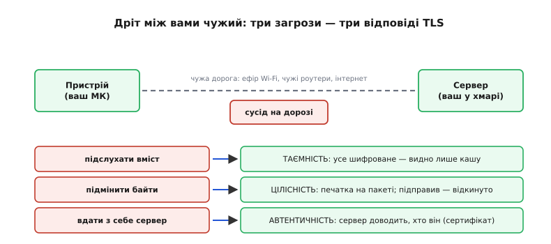
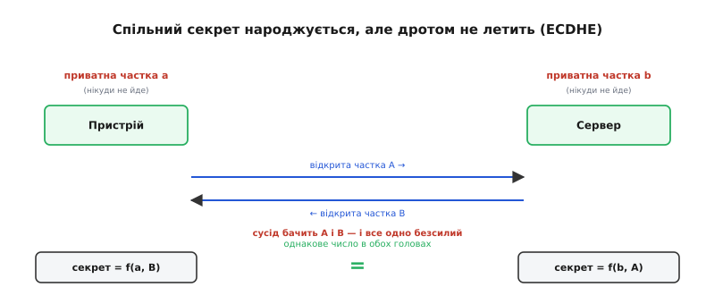
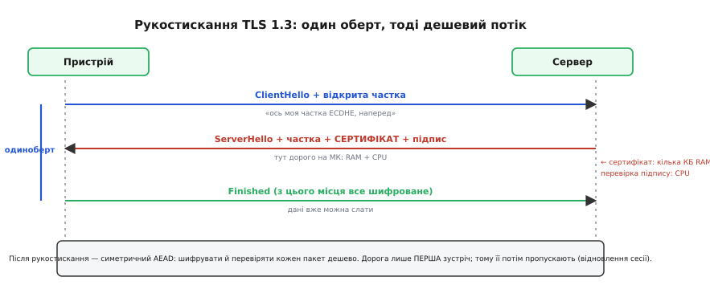
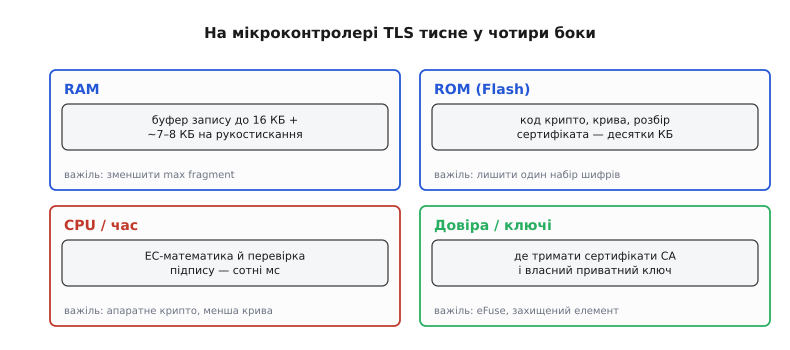

# TLS на мікроконтролері

Досі ми боронили пристрій **зсередини**: [захищене завантаження](topic:programming/firmware-secure-boot) не пускає в чип чужий код, а [апаратний корінь довіри](root:embedded/tpm-trustzone) ховає ключі так, щоб їх не дістав навіть той, хто тримає плату в руках. Але щойно пристрій відкриває [сокет](topic:programming/sockets-tcp-udp) і починає говорити з сервером, уся ця фортеця раптом стає майже ні до чого. Бо дані виходять за межі чипа — у дріт, в ефір, у чужий інтернет, — і там на них чекає геть інша загроза, від якої ні secure boot, ні TrustZone не рятують. Ця тема — про те, як захистити не сам пристрій, а **його розмову**: що діється між ним і сервером, поки байти летять чужою дорогою, і чому та сама задача, яку на великому комп'ютері вирішують не думаючи, на мікроконтролері раптом стає тіснуватою.

### Чому дріт — це чужа територія

Уявімо звичайне: пристрій під'єднався до Wi-Fi і шле на сервер показ давача — скажімо, температуру. Здається, що байти йдуть «від нас до нас». Насправді ж вони проходять через ефір (який чує кожна антена поблизу), через роутер сусіда чи кав'ярні, через десяток чужих маршрутизаторів в інтернеті. Кожна з цих ланок — **чужа рука на вашому пакеті**. І та рука вміє робити з ним не одне, а три різні лиха.

Перше — **підслухати**. Пакет летить відкритим текстом, тож будь-хто на шляху читає його, як листівку. Температура — дрібниця, а якщо це пароль до сервера, токен доступу, координати людини? Друге — **підмінити**. Дорога не лише читає, а й **переписує**: замінить у вашому пакеті «22 °C» на «-40 °C», і сервер послухняно ввімкне обігрів на повну. Третє, найпідступніше — **вдати з себе сервер**. Пристрій думає, що говорить із вашою хмарою, а насправді хтось перехопив з'єднання й **сам** відповідає замість неї: збирає ваші дані, шле пристрою фальшиві команди, і жодна сторона нічого не помічає.

> 🔧 **Навіщо це.** Ці три загрози — не страшилка для підручника, а щоденність будь-якого пристрою в мережі. Погодна станція, що шле дані відкрито, віддає їх кожному в ефірі. Замок, що приймає команду «відчинися» без перевірки джерела, відчиниться тому, хто ту команду підробить. Дрон, що вірить будь-кому, хто назветься його наземною станцією, полетить за чужим наказом. Захист розмови — не «краще з ним, ніж без», а те, без чого пристрою просто не можна виходити в мережу.

Отже, щоб розмова була безпечною, її треба зробити стійкою рівно до цих трьох речей. І три засоби захисту відповідають трьом загрозам майже дослівно.


*Пакет іде через ефір і чужі роутери — і на кожній ланці чужа рука вміє зробити три речі. TLS дає рівно три відповіді: таємність (усе шифроване), цілісність (печатка на пакеті — підправив, і його відкинуто), автентичність (сервер доводить, що він справді той). Захистити треба всі три, бо ланцюг рветься по найслабшій ланці.*

### Три гарантії, які дає TLS

Проти підслуховування — **таємність** (англ. *confidentiality*): усе, що йде дротом, шифроване, і чужий бачить лише незрозумілу кашу. Проти підміни — **цілісність** (англ. *integrity*): до кожного пакета додано криптографічну печатку, і якщо в дорозі змінили бодай один біт, приймач це помічає й пакет відкидає. Проти самозванця — **автентичність** (англ. *authentication*): перш ніж говорити всерйоз, сервер мусить **довести**, що він справді той, за кого себе видає, а не хтось посередині.

Цю трійцю й дає **TLS** (англ. *Transport Layer Security* — безпека транспортного рівня) — не якийсь один шифр, а **протокол**: узгоджений порядок дій, за яким дві сторони спершу домовляються про спільний секрет і перевіряють одна одну, а тоді ведуть захищену розмову. TLS не заміняє [TCP](topic:programming/sockets-tcp-udp), а лягає **поверх** нього: під ним звичайний надійний потік байтів, над ним — ваш прикладний протокол ([HTTP](topic:programming/web-server-mcu), [MQTT](topic:communications/mqtt)), а сам TLS сидить посередині й перетворює відкритий потік на захищений. Тому в назвах ви бачите цю букву «S»: HTTP**S** — це HTTP, пропущений крізь TLS; захищений MQTT — те саме.

Ім'я «TLS» відносно нове, а сама річ старша й довго звалася **SSL** (англ. *Secure Sockets Layer*). Ця історія — з тих, де за сухим протоколом стоять живі люди й гонитва браузерних воєн 1990-х; [як SSL народився в Netscape і став TLS](root:embedded/tls-embedded/hist-ssl-to-tls.md) варте окремої розповіді, а тут досить знати головне: те, що ми пишемо «TLS», у побуті часто досі кличуть «SSL», і це одне й те саме сімейство, лише різних поколінь. Сучасне покоління — **TLS 1.3**; на ньому й зосередимось, бо саме воно і найбезпечніше, і — що для нас важливо — найдешевше для маленького пристрою.

### Як домовитися про секрет із тим, кого вперше бачиш

Найглибша загадка тут ось яка. Щоб шифрувати розмову, обом сторонам потрібен **спільний таємний ключ** — однакове секретне число в пристрої і в сервері. Але вони ніколи раніше не зустрічалися й не мають наперед узгодженого пароля. А єдиний канал між ними — той самий відкритий дріт, який підслуховують. Як передати секрет каналом, де сидить підслуховувач, так, щоб секрет дізналися **тільки** двоє, а не третій, що чує кожен їхній байт?

На перший погляд це неможливо: усе, що ви кинете в канал, почує й ворог. І все ж вихід є, і він доволі дивовижний. Обидві сторони роблять так: кожна вигадує собі **приватну частку** — випадкове число, яке **нікуди не виходить**, лишається вдома. З неї кожна за спеціальним правилом рахує **відкриту частку** й **саме її** кидає в канал. Тепер у пристрої є своя приватна частка і чужа відкрита; у сервера — навпаки. І тут спрацьовує математична магія: якщо змішати **свою приватну** частку з **чужою відкритою** за тим самим правилом, обидві сторони дістають **однакове** число. Той самий секрет народжується в двох головах незалежно — а в дроті його не було ніколи.

А ворог? Він чув **обидві відкриті** частки — і все одно безсилий. Бо щоб відтворити секрет, йому потрібна **приватна** частка бодай однієї сторони, а вона нікуди не виходила. Правило навмисне таке, що з відкритої частки відновити приватну — задача, яку не подужати за розумний час навіть величезним обчисленням. Легко порахувати відкриту частку з приватної; практично неможливо — навпаки. Ось на цій нерівності все й тримається.


*Приватна частка кожної сторони лишається вдома; в дріт летять лише відкриті частки. Пристрій рахує секрет зі своєї приватної та чужої відкритої частки, сервер — навпаки, і виходить однакове число. Сусід бачить обидві відкриті частки й усе одно безсилий: без приватної частки секрет не відтворити. Секрет ніколи не летів дротом — він народився в обох головах одразу.*

Цей танець зветься **обміном ключами Діффі — Гелмана** — за іменами тих, хто перший показав, що так узагалі можна. У сучасному TLS його роблять на **еліптичних кривих** (звідси абревіатура ECDHE, англ. *Elliptic Curve Diffie–Hellman Ephemeral*), бо на них та сама стійкість досягається набагато коротшими числами — а на мікроконтролері, де кожен байт і кожен такт на рахунку, це вирішальна перевага. Слово «ephemeral» — «одноразовий» — тут теж не випадкове: приватні частки **вигадують заново на кожне з'єднання** і викидають після. Наслідок дуже приємний: навіть якщо колись хтось випише всю вашу зашифровану розмову й **згодом** якось добуде довгостроковий ключ сервера, стару розмову він **не** розшифрує — бо секрет тієї сесії народився з одноразових часток, яких давно немає. Цю властивість звуть **прямою таємністю** (англ. *forward secrecy* — таємність, спрямована вперед), і в TLS 1.3 вона **обов'язкова**: старий спосіб, де ключ шифрування напряму залежав від довгострокового ключа сервера, з нового протоколу викинули зовсім, саме щоб закрити цю дірку.

### Але з ким саме ти домовився?

Обмін ключами дає спільний секрет із кимось на тому кінці. Та він **не каже, хто той хтось**. І тут ховається пастка. Що, як самозванець із попереднього прикладу перехопив з'єднання й провів обмін ключами **сам**? Тоді пристрій чесно домовиться про секрет — але **з ворогом**, і той спокійно читатиме все, бо ключ у нього є. Таємність без автентичності марна: ви пошепки говорите з тим, хто прикинувся вашим сервером.

Отже, до обміну ключами треба додати **доказ особи**: сервер мусить показати, що він справді ваш сервер. І механізм цього доказу вам уже знайомий — це **цифровий підпис**, той самий, яким [захищене завантаження](topic:programming/firmware-secure-boot) звіряло прошивку. Пригадаймо суть: є пара ключів — **таємний** (його має лише власник) і **відкритий** (його знають усі). Підписати можна лише таємним; перевірити підпис — відкритим. Підробити підпис, не маючи таємного ключа, ніхто не може, а впізнати правильний — може кожен.

Сервер користається цим так: у нього є таємний ключ, який знає **тільки він**, і він **підписує** ним частину рукостискання. Пристрій перевіряє підпис відкритим ключем сервера — і якщо той сходиться, це доводить: на тому кінці справді той, хто володіє таємним ключем, а не самозванець (бо самозванець підпис не підробив би). Обмін ключами дав спільний секрет; підпис прив'язав цей секрет до **конкретної особи**. Разом вони й закривають усі три загрози одразу.

Лишається одне питання, дрібне на вигляд, та насправді ключове: звідки пристрій **наперед** знає правильний відкритий ключ сервера? Якщо його теж передавати дротом, самозванець просто підсуне **свій** — і кому тоді пристрій перевіряє підпис?

### Сертифікат і ланцюг довіри

Вихід — не передавати «голий» ключ, а передавати **сертифікат** (лат. *certus* — певний, і *facere* — робити; «засвідчення»). Сертифікат — це відкритий ключ сервера **разом із його ім'ям** (адресою), і все це **підписане кимось, кому пристрій уже довіряє**. Тобто третя сторона — **засвідчувач** (англ. *Certificate Authority*, CA) — своїм підписом каже: «я перевірив, що цей відкритий ключ належить саме цьому серверу». Пристрій перевіряє підпис CA — і якщо він сходиться, то вірить, що ключ у сертифікаті справжній.

Але звідки пристрій знає **відкритий ключ самого CA**, щоб перевірити його підпис? Та сама задача, лише на поверх вище. І розв'язок той самий, що й у secure boot: **ланцюг довіри**. Сертифікат сервера підписаний проміжним CA, той — головним (кореневим) CA, а **кореневий сертифікат** пристрій **носить у собі** — його зашивають у прошивку наперед. Перевірка йде знизу вгору: підпис під сертифікатом сервера звіряємо ключем проміжного CA, підпис під проміжним — ключем кореневого, а кореневому довіряємо **за визначенням**, бо він уже в нас, його ніхто дротом не підсовував.

> 🔧 **Навіщо це.** Це той самий корінь довіри, що й у [захищеному завантаженні](root:embedded/tpm-trustzone), лише повернутий назовні. Там незмінний корінь у кремнії доводив, що **код** свій; тут зашитий у прошивку кореневий сертифікат доводить, що **співрозмовник** свій. В обох випадках уся конструкція тримається на одній непорушній ланці, якій довіряємо не тому, що перевірили, а тому, що її неможливо підмінити. На пристрої це означає конкретну річ: у прошивці лежить набір кореневих сертифікатів, і з'єднання вдасться лише з тим сервером, чий ланцюг сходиться до одного з них. Підсунув хтось чужий сертифікат — ланцюг не замкнувся, перевірка провалилась, з'єднання розірвано, і жоден байт даних назовні не пішов.

Тут ховається пастка, на яку регулярно наступають: якщо код перевірку сертифіката **вимкнути** (а таку опцію мають усі бібліотеки, «щоб швидше запрацювало»), увесь захист від самозванця зникає. Шифрування лишиться, але шифрувати ви будете **з ким завгодно** — і повертається загроза «вдати з себе сервер» у повний зріст. Це найтиповіша й найдорожча помилка у вбудованому TLS: увімкнули шифр, вимкнули перевірку, і вийшов замок без язичка — зачиняється, а не тримає.

### Рукостискання: усе це за один оберт

Складімо тепер частини в один танець. Обмін відкритими частками, показ сертифіката, перевірка підпису, народження спільного секрету — усе це діється в короткій церемонії на початку розмови, яку звуть **рукостисканням** (англ. *handshake*). У TLS 1.3 воно навмисне стисле — вкладається в **один оберт** до сервера й назад (кажуть «1-RTT», англ. *round-trip time* — час на дорогу туди-назад):

- Пристрій одразу, у **першому** ж повідомленні, кидає свою відкриту частку ECDHE — не чекаючи, поки сервер її попросить, а наперед.
- Сервер відповідає своєю відкритою часткою, своїм **сертифікатом** і **підписом** — і з цієї миті вже має спільний секрет, тож решту відповіді шифрує.
- Пристрій перевіряє сертифікат і підпис, зі своєї приватної частки й чужої відкритої рахує **той самий** секрет — і з цього моменту вся розмова захищена.

Один оберт — і канал готовий. Чому це для нас важливо: попереднє покоління, TLS 1.2, потребувало **двох** обертів, а на пристрої, що виходить у мережу через мобільний модем із затримкою в пів секунди, кожен зайвий оберт — це секунди чекання й зайві мілі­ампер-години з батареї. TLS 1.3 зрізав цю ціну вдвічі.


*Пристрій одразу кидає свою відкриту частку ECDHE, не чекаючи запиту. Сервер повертає свою частку, сертифікат і підпис — і саме тут на мікроконтролері дорого: сертифікат займає кілька кілобайтів RAM, а перевірка підпису й еліптична математика з'їдають помітний час CPU. Далі йде дешевий симетричний потік. Дорога лише перша зустріч — тому її потім і намагаються пропустити.*

Помітьте на схемі, **де** зосереджена ціна: у другому повідомленні, де сервер шле сертифікат і де пристрій перевіряє підпис. Уся дорожнеча TLS — у цій **першій зустрічі**. Щойно рукостискання позаду й народжений спільний секрет, розмова йде на **симетричному шифрі**: кожен пакет шифрується й перевіряється цим одним ключем, і це вже дешево. Ось чому далі ми так хочемо цю першу зустріч **не повторювати щоразу** — але спершу подивімось, чому вона взагалі болюча саме на мікроконтролері.

### Чому на мікроконтролері це тісно

На настільному комп'ютері чи телефоні TLS — річ невидима: гігабайти пам'яті, потужний процесор із апаратним прискоренням шифрів, готове сховище сотень кореневих сертифікатів. Пристрій із мікроконтролером не має **нічого** з цього вдосталь, і та сама задача раптом починає тиснути одразу з чотирьох боків.

**Перший тиск — оперативна пам'ять.** У пристрою її бувають десятки-сотні кілобайтів на все — а TLS хоче собі відчутний шмат. Найбільший з'їдач — **буфер запису** (англ. *record buffer*): протокол шле дані блоками-«записами», і стандарт дозволяє запис завбільшки до 16 КБ. Бібліотека мусить мати місце прийняти такий запис цілком, і то в обидва боки — а це вже під 32 КБ лише на буфери, ще до будь-яких корисних даних. Плюс саме рукостискання просить ще 7–8 КБ купи на еліптичну математику та розбір сертифіката. На чипі з 300 КБ RAM це половина всієї вільної пам'яті — на одне з'єднання.

**Другий тиск — Flash (ПЗП).** Код, що вміє еліптичні криві, розбір сертифікатів у їхньому громіздкому форматі, кілька алгоритмів шифрування — це десятки кілобайтів прошивки, яких могло б і не бути. Кожен зайвий підтримуваний набір шифрів — ще код, який лежить у Flash і займає місце.

**Третій тиск — процесорний час.** Еліптична математика й перевірка підпису — це не миттєво: на скромному ядрі рукостискання може тривати сотні мілісекунд, а без апаратного прискорювача крипто — і того довше. Для пристрою, що прокидається раз на хвилину, віддає показ і засинає, ці сотні мілісекунд «на розігрів каналу» — відчутний шмат і часу, і заряду батареї.

**Четвертий тиск — де тримати довіру.** Кореневі сертифікати CA треба десь зберігати (і не дати їх підмінити — інакше весь ланцюг довіри падає). А **власний приватний ключ** пристрою, яким він себе засвідчує серверу, — це секрет, що прямо просить того самого захисту, який ми будували в темі про [корінь довіри](root:embedded/tpm-trustzone): щоб ключ не витік і щоб його не вичитали з пам'яті.


*На великому комп'ютері TLS майже безкоштовний; на мікроконтролері він тисне одразу в чотири боки, і кожен має свій важіль послаблення. RAM — зменшити максимальний розмір запису. ROM — лишити рівно один потрібний набір шифрів. CPU — увімкнути апаратне крипто й узяти коротшу криву. Довіра — тримати ключ у eFuse чи захищеному елементі. Уся інженерія вбудованого TLS — про ці чотири важелі.*

Кожен тиск має свій **важіль**. Пам'ять RAM послаблюють, домовляючись із сервером про **менший максимальний запис** (не 16 КБ, а, скажімо, 4 КБ) — це відразу вивільняє десятки кілобайтів буферів. Flash економлять, лишаючи в збірці **рівно один** потрібний набір шифрів замість усіх. Процесорний час рятує **апаратний прискорювач крипто**, який має більшість сучасних мікроконтролерів для мережі, і вибір **коротшої еліптичної кривої**. А захист ключа — це якраз ті засоби з попередніх тем: пропалений у eFuse, схований у захищеному елементі. Уся інженерія TLS на пристрої зводиться до вправного смикання за ці чотири важелі.

І тут-таки видно, чому для мікроконтролера так люблять один конкретний шифр — **ChaCha20-Poly1305**. Класичний AES на процесорі без апаратного прискорення рахується повільно; ChaCha20 же навмисне спроєктований так, щоб бути швидким на **звичайних** цілочислових операціях — на чипі без AES-прискорювача він **на чверть-третину швидший** за AES. Тому там, де апаратного AES немає, беруть саме його — це прямий виграш і в часі, і в заряді.

### Як це виглядає в коді

На щастя, усю цю машинерію вам не писати руками — її вже написали, і не раз. Найпоширеніша на мікроконтролерах бібліотека TLS — **mbedTLS**: невелика, портована на купу чипів, зі зручними «ручками» для послаблення саме тих чотирьох тисків. Її [шлях від хакерського проєкту до стандарту вбудованого TLS](root:embedded/tls-embedded/hist-mbedtls.md) сам по собі повчальний, а тут важить те, що на ESP32, наприклад, вона вже вбудована в середовище, і поверх неї є ще простіша обгортка. Захищене з'єднання в ній заводиться майже так само коротко, як звичайний сокет:

**Умова: підключитися до сервера по TLS, перевіривши його за зашитим кореневим сертифікатом, і надіслати рядок.** Ключове — **не забути** передати сертифікат CA: без нього перевірка автентичності не відбудеться.

```c
#include "esp_tls.h"

// кореневий сертифікат CA — зашитий у прошивку (масив байтів у Flash).
// без нього перевірити сервер нічим — і весь захист від самозванця зникає.
extern const uint8_t ca_pem_start[] asm("_binary_ca_pem_start");
extern const uint8_t ca_pem_end[]   asm("_binary_ca_pem_end");

void send_reading(float temp_c) {
    esp_tls_cfg_t cfg = {
        .cacert_buf   = ca_pem_start,               // ← ось той корінь довіри
        .cacert_bytes = ca_pem_end - ca_pem_start,
        // за замовчуванням бібліотека ПЕРЕВІРЯЄ сертифікат сервера цим коренем.
        // .skip_common_name чи вимикання перевірки тут НЕ чіпаємо — це діра.
    };

    // одним викликом: TCP-з'єднання + рукостискання TLS + перевірка сертифіката
    esp_tls_t *tls = esp_tls_init();
    if (esp_tls_conn_http_new_sync("https://api.example.com", &cfg, tls) != 1) {
        esp_tls_conn_destroy(tls);
        return;                                     // не зійшлось — назовні НІЧОГО не пішло
    }

    char body[64];
    int n = snprintf(body, sizeof body, "{\"t\":%.1f}", temp_c);

    // з цієї миті write/read шифрують і перевіряють кожен байт автоматично
    esp_tls_conn_write(tls, body, n);

    esp_tls_conn_destroy(tls);                      // закрити з'єднання й звільнити пам'ять
}
```

Зверніть увагу, як мало тут «про безпеку» видно очима — і як багато її діється всередині. Рядок із `cacert_buf` — це і є **весь** ланцюг довіри: зашитий корінь, яким бібліотека мовчки перевіряє сертифікат сервера під час `esp_tls_conn_http_new_sync`. Якщо перевірка провалиться, виклик поверне не одиницю, ми вийдемо — і **жодного** байта корисних даних назовні не піде. А `esp_tls_conn_write` виглядає як звичайний запис у сокет, але під ним уже працює симетричний AEAD-шифр: кожен пакет автоматично шифрується й позначається печаткою цілісності. Уся складність — обмін ключами, підпис, шифр — схована; ваша відповідальність зводиться до одного, зате головного: **передати правильний корінь і не вимкнути перевірку**.

> 🔧 **Навіщо це.** Саме тут найчастіше й ламаються реальні пристрої — не в математиці шифру, а в цих двох рядках. Порожній `cacert_buf` або опція «пропустити перевірку», поставлена «на час налагодження» й забута, — і пристрій, що начебто «працює по HTTPS», насправді готовий шифрувати з будь-яким самозванцем. Перше, що варто перевірити в будь-якій вбудованій прошивці з TLS: чи справді передається сертифікат CA і чи **не** вимкнено перевірку. Замок мусить не лише зачинятися, а й тримати.

### Не платити за рукостискання щоразу

Ми з'ясували, що вся дорожнеча — у першій зустрічі: обмін ключами, підпис, розбір сертифіката. А що, як пристрій говорить із **тим самим** сервером знову й знову — прокидається щохвилини й шле показ? Проходити повне рукостискання щоразу — це щоразу платити ті сотні мілісекунд CPU і ту купу RAM. Марнотратство очевидне.

Тому в TLS є **відновлення сесії** (англ. *session resumption*): після першого повного рукостискання сервер видає пристрою невеликий **квиток** (англ. *session ticket*) — по суті, запам'ятаний спільний секрет у зашифрованому виді. Наступного разу пристрій показує цей квиток замість того, щоб знову домовлятися з нуля, — і повний обмін ключами з підписом **пропускається**. Розмова відновлюється майже миттєво, без важкої математики й без пересилання сертифіката. Для пристрою на батареї це прямий виграш: заощаджені такти CPU — це заощаджений заряд, а квиток можна навіть **пережити глибокий сон**, зберігши його в [постійній пам'яті](topic:programming/nvs), щоб і після пробудження відновити сесію швидко.

Ціна тут — компроміс, і його варто розуміти: квиток трохи послаблює ту саму пряму таємність, заради якої ми брали одноразові частки. Тому квитки роблять **короткоживучими** — сервер видає їх на обмежений строк, після чого пристрій усе-таки проходить повне рукостискання наново. Це і є типовий вибір у вбудованому TLS: часту дешеву розмову — квитком, а раз на якийсь час — чесну повну зустріч.

### Коли навіть сертифікат — це забагато

Буває, що пристрій такий крихітний, а мережа така замкнена, що й короткого сертифіката, і еліптичної математики — забагато: не вистачає ні Flash на код розбору сертифікатів, ні RAM на буфери, ні часу на підпис. Для таких випадків у TLS є простіший шлях — **попередньо поділений ключ** (англ. *Pre-Shared Key*, PSK): пристрій і сервер **наперед** знають один спільний секрет (його зашивають у прошивку ще на виробництві), тож жодного обміну ключами й жодних сертифікатів не треба — сторони одразу впізнають одна одну за тим, що обидві знають цей секрет.

Виграш величезний: немає розбору сертифікатів (менше Flash), немає підпису й еліптичної математики (менше CPU), рукостискання коротке й легке. Але й ціна відповідна. По-перше, зникає гнучкість публічних ключів: секрет **той самий** у пристрої й на сервері, тож витік його з **будь-якого** боку — і захист упав. По-друге, той самий ключ треба **безпечно доставити** на кожен пристрій ще на заводі й берегти в кожному — а це знову задача захисту секрету з теми про [корінь довіри](root:embedded/tpm-trustzone). PSK — правильний вибір там, де пристрої й сервер під одним господарем, мережа замкнена, а ресурсів обмаль: промислові давачі в закритому контурі, прості вузли розумного дому. Для розмови з публічним сервером в інтернеті PSK не годиться — там потрібні саме сертифікати з їхнім ланцюгом довіри.

### Що лишається в голові

Пройдімо нитку ще раз, коротко. Щойно пристрій виходить у мережу, його дані летять **чужою дорогою**, де їх можуть підслухати, підмінити й де хтось може вдати з себе сервер. TLS закриває всі три загрози трьома гарантіями: **таємність** шифром, **цілісність** печаткою, **автентичність** підписом. Спільний ключ для шифру народжується **обміном Діффі — Гелмана на еліптичних кривих**: секрет виникає в обох головах одразу, а дротом ніколи не летить; одноразові частки дають **пряму таємність**. Автентичність тримається на **цифровому підписі** й **ланцюгу сертифікатів**, що сходиться до зашитого в пристрої кореня — рідного брата того кореня довіри, яким ми звіряли прошивку. Уся ця церемонія — **рукостискання** — вкладається в один оберт, але саме вона на мікроконтролері тисне на **RAM, Flash, CPU й сховище ключів**, і вся інженерія тут — про важелі, що ці тиски послаблюють: менший запис, один набір шифрів, апаратне крипто й ChaCha20, захищене сховище секрету. А щоб не платити за важку першу зустріч раз за разом, її **пропускають** відновленням сесії; там же, де й сертифікат завеликий, беруть **наперед поділений ключ**.

Головне ж — одна думка, спільна з усім, що ми будували в цій частині курсу. Захист пристрою — не одна стіна, а кілька, і кожна прикриває свій напрям. Secure boot стереже, **який код** запустився. Корінь довіри стереже **секрети** всередині. А TLS стереже **розмову** назовні. Прибери будь-яку — і фортеця має пролом; тримаються вони лише разом.
