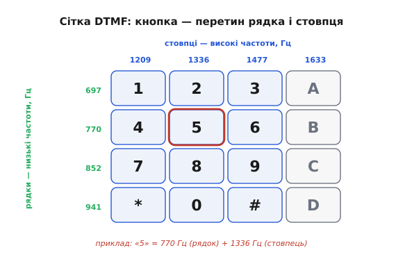
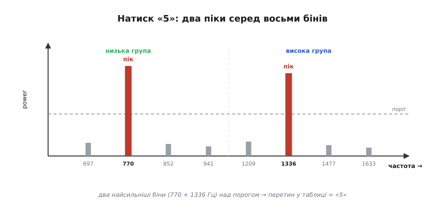

# Виявлення тонів

Часто від вбудованої системи треба зовсім просте: **почути, чи звучить наперед відома частота**. Чи натиснули цифру на телефонній клавіатурі. Чи дав хтось у мікрофон свисток-команду. Чи спрацював заданий «біп» тривоги. Чи торкнули струну тієї самої висоти, на яку налаштовуємо тюнер. У всіх цих задачах нас не цікавить весь спектр сигналу — цікавлять **одна-дві конкретні частоти**: є вони чи нема, і наскільки сильні.

Ми вже бачили, чому таке питання найприродніше розв'язувати в частотній області: [тон лишається тоном незалежно від фази, гучності й моменту початку](root:embedded/why-frequency-domain), а в часі той самий тон, зсунутий чи притишений, виглядає геть інакше. Частота дивиться в **суть** коливання, тому розпізнавання за нею стійке до перешкод там, де зіставлення форми хвилі розсипається. Цей крок — про те, **як саме** перетворити цю ідею на кілька рядків коду, що надійно працюють на копійчаному мікроконтролері.

### Не стріляти з гармати по горобцях

Найочевидніший шлях — узяти готову бібліотеку [швидкого перетворення Фур'є](book:algorithms/fft) (ШПФ — алгоритм, що рахує спектр за `N·log₂N` операцій замість `N²`), порахувати весь спектр і глянути, чи є пік на потрібній частоті. Працює. Але задумаймося, **за що ми платимо**.

ШПФ рахує **весь** спектр — усі `N/2` частот від нуля до половини частоти дискретизації. А нам потрібна рівно одна (або вісім для телефонної клавіатури). Виходить, дев'яносто з лишком відсотків роботи летить у кошик: ми обчислили сотні бінів, щоб глянути на один. Для слабкого восьмибітного МК це і зайві такти, і зайва пам'ять — увесь масив результату треба десь тримати, та ще й часто потрібен буфер під проміжні комплексні числа.

> 🔧 **Навіщо це.** На детекторі однієї частоти різниця між «порахувати все» і «порахувати потрібне» — це різниця між тим, чи влізе детектор у бюджет тактів поряд з рештою роботи прошивки, чи з'їсть його весь. Коли в системі вже крутиться регулятор, опитування давачів і зв'язок, кілька зайвих тисяч множень на кожен блок — відчутна стаття витрат.

Тож рецепт інший: рахувати **лише ту частоту, що цікавить**. І для цього є точний інструмент.

### Вибірковий детектор однієї частоти

Магнітуду одного-єдиного біна спектра можна дістати, **не рахуючи решти**. Її дає крихітний рекурентний фільтр другого порядку: відліки женуться один за одним крізь простий цикл із двох комірок пам'яті, а наприкінці з цих двох чисел дістаємо «скільки» шуканої частоти було в сигналі. Коштує це близько `N` множень на одну частоту — проти `N·log₂N` усього ШПФ, та ще й рахунок іде **на льоту**, поки відліки лише надходять з АЦП.

Це [алгоритм Ґерцеля](root:embedded/why-frequency-domain/proj-goertzel.md) — там розписано, звідки береться рекурсія (це цифровий **резонатор**, налаштований на шукану частоту: тон у такт розгойдує його, решта лишає спокійним), наведено робочий C-код і розібрано пастки реалізації. Тут ми беремо його як готову цеглину й дивимося, **як з неї скласти детектор**. Усе, що нам треба пам'ятати з його механіки, — три речі:

```
1) налаштовуємо фільтр на частоту-ціль однією сталою coeff = 2·cos(2π·k/N)
2) проганяємо N відліків крізь рекурсію (два числа стану)
3) дістаємо power — квадрат магнітуди шуканої частоти
```

`power` велике — тон присутній; близьке до нуля — його нема. Усе виявлення тону зводиться до цього одного числа й порівняння з порогом.

### Один тон — це лише половина історії

Якби в реальних системах ловили **одну** частоту, на цьому можна було б і спинитися. Але найпоширеніший випадок виявлення тонів влаштований хитріше — і саме його хитрість пояснює, чому ця тема варта окремого кроку.

Згадаймо телефонну клавіатуру. Здавалося б, найпростіше: одна кнопка — один тон, дванадцять кнопок — дванадцять частот. Чому ж кожна кнопка звучить **двома** тонами водночас? Бо одного тону **небезпечно мало**. Людський голос, музика з радіо, гавкіт собаки, шурхіт у слухавці — усе це багате на одиночні частоти, і будь-яка з них могла б випадково збігтися з «командною» й набрати зайву цифру. Систему, що слухається одного тону, надто легко обдурити.

Вихід, який знайшли в Bell Labs на початку 1960-х, елегантний: вимагати **збігу двох** частот одночасно. Імовірність, що голос чи шум випадково дадуть рівно цю пару й нічого зайвого поряд, мізерна. Звідси й назва — **DTMF** (англ. *dual-tone multi-frequency* — двотонова багаточастотність). Вісім частот поділили на дві групи: чотири «рядкові» (низькі) й чотири «стовпцеві» (високі). Кожна кнопка бере по **одній з кожної групи** — як координати клітинки в таблиці.


*Кнопка — це перетин рядка й стовпця. Чотири низькі частоти задають рядок, три (а в повному наборі — чотири) високі — стовпець; натиснута клавіша звучить сумішшю однієї низької та однієї високої. Так дванадцятьма кнопками керують лише сім частот, а вимога збігу пари робить систему глухою до випадкового голосу й шуму.*

Цей трюк «координат» дає ще одну вигоду, окрім захисту від випадкових спрацювань: дванадцять (а з четвертим стовпцем — шістнадцять) кнопок кодуються **сімома-вісьмома** частотами замість шістнадцяти. Менше частот — простіший і дешевший детектор. Те, що в 1963 році було потрібне, щоб здешевити телефонну станцію, сьогодні так само цінне для мікроконтролера: вісім бінів Ґерцеля замість шістнадцяти.

> 🔧 **Навіщо це.** Принцип «вимагай збігу кількох ознак» виходить далеко за телефонію. Будь-який тоновий пульт, тонове керування реле по радіо, акустичний «ключ» — усе будують на двох (чи більше) одночасних тонах саме тому, що один легко підробити випадково. Проєктуючи власну тонову команду, беріть пару рознесених частот, а не один тон, — і хибних спрацювань стане на порядки менше.

Історію того, як народилася ця двотонова схема — три роки досліджень людського фактора, чому обрали саме музичні інтервали між частотами й чому жодна частота не є цілою гармонікою іншої, — розказано окремо: [як з'явився Touch-Tone](root:embedded/tone-detection/hist-touch-tone.md).

### Детектор DTMF: вісім бінів і дві координати

Тепер у нас є все, щоб скласти детектор. Логіка проста й гарно лягає в код:

1. Набрати блок з `N` відліків з АЦП на частоті дискретизації `fs`.
2. Прогнати блок крізь **вісім** фільтрів Ґерцеля — по одному на кожну з восьми частот DTMF.
3. У низькій групі знайти **найсильніший** бін, у високій — теж найсильніший.
4. Перевірити, що обидва переможці впевнено перевищують поріг (тон справді є, а не шум).
5. За парою «рядок + стовпець» прочитати цифру з таблиці.

Серце — таблиця частот. Низька група задає рядок, висока — стовпець; на перетині стоїть символ:

```
                стовпці (високі), Гц
              1209    1336    1477   (1633)
рядки  697  →   1       2       3     (A)
(низькі)
       770  →   4       5       6     (B)
       852  →   7       8       9     (C)
       941  →   *       0       #     (D)
```

Наприклад, цифра «5» — це 770 Гц (другий рядок) і 1336 Гц (другий стовпець). Натиснули «5» — і в спектрі піднімаються рівно два піки, на 770 і 1336 Гц; усі інші шість бінів лишаються низькими. Детектор бачить ці два піки й однозначно читає цифру.


*Вісім бінів, два переможці. На вісім частот DTMF наведено вісім фільтрів Ґерцеля. Натиск кнопки «5» підіймає рівно два — найсильніший у низькій групі (770 Гц) і найсильніший у високій (1336 Гц). Їхній перетин у таблиці й дає відповідь. Решта шість бінів лишаються в шумі — їх перевіряють лише на те, чи не зависокі вони (інакше пара ненадійна).*

Ось як ця логіка виглядає в коді. Скористаймося потоковим Ґерцелем як готовим інструментом і зосередьмося на **рішенні** — виборі двох координат:

```c
#include <stdint.h>

#define NBLOCK 205          // довжина блоку (про вибір — нижче)
#define FS     8000.0f      // частота дискретизації, Гц

// вісім частот: спершу чотири низькі (рядки), потім чотири високі (стовпці)
static const float dtmf_freq[8] = {
    697.0f, 770.0f, 852.0f, 941.0f,        // [0..3] — рядки
    1209.0f, 1336.0f, 1477.0f, 1633.0f     // [4..7] — стовпці
};

// таблиця символів: [рядок][стовпець]
static const char dtmf_sym[4][4] = {
    { '1', '2', '3', 'A' },
    { '4', '5', '6', 'B' },
    { '7', '8', '9', 'C' },
    { '*', '0', '#', 'D' },
};

// goertzel_power() — з кроку про алгоритм Ґерцеля
float goertzel_power(const float *x, int N, float target, float fs);

// повертає розпізнаний символ або 0, якщо тон не впізнано
char dtmf_decode(const float *x, int N)
{
    float p[8];
    for (int i = 0; i < 8; ++i)
        p[i] = goertzel_power(x, N, dtmf_freq[i], FS);

    // найсильніший бін у кожній групі
    int row = 0, col = 4;
    for (int i = 1; i < 4; ++i) if (p[i]     > p[row]) row = i;
    for (int i = 5; i < 8; ++i) if (p[i]     > p[col]) col = i;

    // ... перевірки надійності (нижче) ...

    return dtmf_sym[row][col - 4];
}
```

Кістяк готовий. Але між «знайшли два найсильніші біни» і «впевнено назвали цифру» лежить найважливіша частина — **перевірки надійності**. Без них детектор «упізнаватиме» цифри в чистому шумі.

### Зробити виявлення надійним

Найгрубіша помилка початківця — порівнювати `power` з **абсолютним** порогом, підібраним за столом. Він збреше за першої ж зміни умов, і ось чому.

**Поріг має бути відносним, а не абсолютним.** Значення `power` росте і з гучністю сигналу, і з довжиною блоку `N`. Голосніший абонент, тихіший мікрофон, інше підсилення тракту — і абсолютний поріг, ідеальний для одного рівня, або пропускає тихі тони, або ловить шум на гучних. Надійніше брати поріг **відносно енергії самого блоку**: тон вважаємо присутнім, лише якщо два його біни забирають вагому частку всієї енергії, а решта — мало. Так детектор сам підлаштовується під гучність.

```c
// загальна енергія блоку (грубо — сума квадратів відліків)
float total = 0.0f;
for (int n = 0; n < N; ++n) total += x[n] * x[n];

// два переможці мусять разом нести помітну частку енергії блоку
if (p[row] + p[col] < 0.10f * total)
    return 0;   // замало — це не тон, а шум
```

**Перевірка «жодного зайвого тону».** Справжній натиск дає рівно **два** сильні біни — по одному в групі. Якщо у групі поряд із переможцем стирчить другий майже такий самий бін, це не чистий DTMF, а каша: накладені голоси, музика чи дві кнопки разом. Надійний декодер вимагає, щоб переможець у кожній групі **виразно** переважав другого за ним:

```c
// другий за силою в кожній групі має бути помітно слабшим
float row2 = 0.0f, col2 = 0.0f;
for (int i = 0; i < 4; ++i) if (i != row && p[i] > row2) row2 = p[i];
for (int i = 4; i < 8; ++i) if (i != col && p[i] > col2) col2 = p[i];

if (row2 > 0.5f * p[row] || col2 > 0.5f * p[col])
    return 0;   // у групі два суперники — ненадійно
```

**Перекіс між групами (twist).** У справжньому DTMF низький і високий тони мають близьку силу; великий розрив (його звуть *twist* — «перекіс») виказує спотворення тракту або підробку. Промислові декодери відкидають пару, де один тон набагато гучніший за інший. Для першого детектора досить грубої версії: відношення `power` двох переможців має лежати в розумних межах (скажімо, не більше восьмикратного в будь-який бік).

**Дебаунс — підтвердження часом.** Один блок міг збігтися випадково. Тому рішення приймають, лише коли **кілька блоків поспіль** дали той самий символ, а між цифрами вимагають паузу-тишу. Це той самий [антитремтливий захист, що й на механічній кнопці](book:electronics/contact-debounce): не вір першому імпульсу, дочекайся стабільної картини. Без нього одна цифра «дзвенітиме» серією повторів.

> 🔧 **Навіщо це.** Усі чотири перевірки — це різниця між іграшкою, що працює на тихому столі, і детектором, що тримається в реальному каналі з шумом, луною й перепадами гучності. Промислові DTMF-чипи десятиліттями втілювали рівно цей набір правил; коли пишете свій декодер, не пропускайте їх — саме хибні спрацювання, а не пропуски, найболючіші в керуванні.

### Чому саме N = 205

У коді стоїть `N = 205` при `fs = 8000` Гц — це не випадкове число, і за ним ховається важлива пастка виявлення тонів.

Фільтр Ґерцеля міряє не точно вашу частоту, а **найближчий бін** `k = round(f·N/fs)`. Бін — це «комірка» спектра завширшки `fs/N`. Якщо шукана частота лягає **точно в центр** біна, уся її енергія збирається в цей бін, і `power` виходить максимальним. Якщо ж частота сидить **між** бінами, її енергія [розтікається на сусідні](book:math/windowing-leakage) — це явище звуть **витоком** (англ. *leakage*), — і виміряне `power` занижується, іноді сильно. Детектор стає мляво чутливим саме там, де має бути найгострішим.

Тому `N` підбирають так, щоб **усі вісім** частот DTMF лягли якнайближче до центрів своїх бінів. При `fs = 8000` Гц значення `N = 205` робить це майже ідеально для всієї вісімки — історично саме його й беруть у телефонних декодерах. Перевірмо на крайніх частотах:

```
f = 697 Гц:   k = round(697·205/8000)  = round(17.86) = 18
f = 1633 Гц:  k = round(1633·205/8000) = round(41.85) = 42
```

Числа лягають близько до цілих — отже, обидві частоти добре потрапляють у свої біни, і витік малий. Якби ми взяли «кругле» `N = 256`, частоти посідали б між бінами, і детектор плутався б на тихих тонах.

> 🔧 **Навіщо це.** Це загальне правило виявлення тонів, не лише для DTMF: **спершу підбери `N` під свої частоти, потім пиши код**. Хочеш ловити дві свої частоти-команди — порахуй для них `k = f·N/fs` за різних `N` і візьми те `N`, де обидва `k` найближчі до цілого. П'ять хвилин арифметики рятують від загадкових «іноді не спрацьовує».

Є й зворотний бік `N`. Ширина біна `fs/N` — це **роздільність**: що менше `N`, то грубіше детектор розрізняє близькі частоти, але то швидше реагує (менше відліків чекати). Що більше `N` — то гостріше розрізнення й нижча чутливість до шуму, але то довша затримка. Це той самий компроміс «точність проти швидкості», що пронизує всю цифрову обробку: довший блок бачить чіткіше, але відповідає пізніше.

### Де воно живе в прошивці

Складімо все докупи — як детектор тонів вписується в реальну прошивку. Ланцюг короткий і прямий:

```
АЦП (fs=8000 Гц, переривання) → набір блоку N відліків
   → банк Ґерцеля (8 фільтрів)
   → вибір рядка й стовпця + перевірки надійності
   → дебаунс (підтвердження кількома блоками)
   → подія «натиснуто цифру X»
```

АЦП кидає відліки в переривання; коли набралося `N`, основний цикл (або окреме завдання) проганяє блок крізь банк фільтрів і виносить рішення. Потоковий Ґерцель дає змогу взагалі обійтися без великого буфера — рахувати прямо в перериванні по одному відліку, — але для першої версії простіше зібрати блок і обробити його цілим.

Повний робочий декодер з банком фільтрів, усіма перевірками надійності та скінченним автоматом дебаунсу зібрано окремо: [декодер DTMF на C](root:embedded/tone-detection/proj-dtmf-decoder.md). Там код доведено до стану, у якому його можна вставити у прошивку.

І наостанок — про межі. Виявлення тонів сяє, коли частоти **відомі наперед** і їх **небагато**: команди, цифри, заданий біп. Щойно частот стає багато або вони наперед невідомі (треба побачити **весь** спектр — який завгодно тон, висота довільної ноти, повна картина вібрації), вибірковий детектор програє: вісім Ґерцелів — дешевше за ШПФ, вісімдесят — уже ні. Тоді повертаються до [повного ШПФ](book:algorithms/fft) і шукають піки в усьому спектрі. Правило просте й випливає з усього сказаного: **мало відомих частот — Ґерцель; багато чи невідомі — ШПФ**. Виявлення тонів — це мистецтво не рахувати зайвого, і вся його сила в тому, що ви наперед знаєте, що шукаєте.
