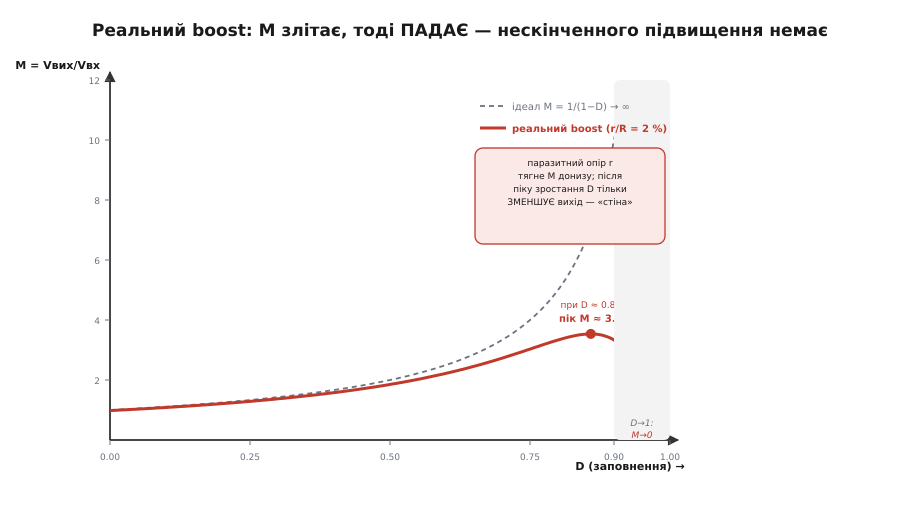

# 🧮 Коефіцієнт перетворення M(D): виведення й межа реальності

> Одна проста рівність — середня напруга на котушці за період дорівнює нулю — породжує геть різні криві M(D) для buck, boost і buck-boost. Ми виведемо всі три з першопринципу, побачимо, чому кожна крива має саме таку форму, а тоді додамо те, про що ідеальні формули мовчать: паразитні опори, які не дають boost підвищувати нескінченно, і краї діапазону, де топологія просто відмовляє.

Ми вже вибирали топологію за напрямком: вниз — buck, вгору — boost, гуляє навколо — buck-boost. Тепер настав час підвести під це число. Скільки саме дає кожна топологія? Від чого залежить? І де закінчується її здатність — бо в кожної є стеля, і краще знати про неї до, а не після паяння.

Уся кількісна відповідь ховається в одному коефіцієнті.

### Означення: що таке M

**Коефіцієнт перетворення** M — це відношення вихідної напруги до вхідної:

```
M = Vвих / Vвх
```

Для buck M < 1 (знижуємо), для boost M > 1 (підвищуємо), для інвертувального buck-boost M < 0 (ще й перевертаємо знак). Керуємо цим числом одним важелем — **коефіцієнтом заповнення** D (англ. *duty cycle*, від *duty* «робота» — частка періоду, коли головний ключ увімкнений; 0 ≤ D ≤ 1). Уся інженерія імпульсного перетворювача зводиться до питання: як M залежить від D? Ця залежність M(D) і є паспорт топології — вона каже, куди топологія тягне напругу й наскільки сильно.

Забігаючи наперед, три відповіді разюче різні:

```
buck:        M = D               (пряма: 0 … 1)
boost:       M = 1/(1−D)         (крива, що злітає: 1 … ∞)
buck-boost:  M = −D/(1−D)        (від'ємна, від 0 до −∞)
```

Дивовижа в тому, що всі три — наслідок **однієї** фізичної рівності. Виведімо її й побачмо, звідки береться така несхожість форм.

### Інтуїція: чому котушка диктує коефіцієнт

Серце будь-якого з цих перетворювачів — котушка, яку ключ то під'єднує до одних напруг, то до інших. Ключ клацає десятки чи сотні тисяч разів за секунду, і котушка щоразу відповідає зміною струму. Але у **сталому** режимі — коли перетворювач уже вийшов на робочу точку й лише тримає її — струм котушки на початку кожного періоду мусить дорівнювати струмові в кінці. Інакше він повзе з циклу в цикл угору чи вниз, а це вже не сталий режим.

Ось із цієї простої вимоги — «струм повернувся до себе» — випливає все. Напруга на котушці й швидкість зміни струму пов'язані жорстко:

```
Vл = L · (di/dt)      →      di = (Vл / L) · dt
```

Проінтегруймо за повний період. Сумарна зміна струму — це інтеграл di, тобто інтеграл від Vл, поділений на L. Якщо струм повернувся до себе, ця сумарна зміна дорівнює нулю, а отже нулю дорівнює й **інтеграл напруги за період**:

```
Δiпер = (1/L) · ∫₀ᵀ Vл dt = 0     ⇒     ∫₀ᵀ Vл dt = 0
```

Це і є **вольт-секундний баланс**: середня напруга на котушці за період дорівнює нулю. Він не постулат, а прямий наслідок періодичності. Повне «на пів сторінки» виведення для buck лежить окремо — [🧮 Вольт-секундний баланс](topic:electronics/buck/math-volt-second.md); тут беремо його як робочий інструмент і застосовуємо до всіх трьох топологій підряд.

> 🔧 **Навіщо це.** Вольт-секундний баланс — не «одна з формул», а майстер-ключ. Замість запам'ятовувати три різні вирази M(D) (і плутати їх на іспиті чи біля плати), тримаєш у голові **один** принцип і за півхвилини виводиш будь-який. Більше того — той самий принцип дасть коефіцієнт SEPIC, Ćuk, forward, чого завгодно з котушкою. Вивести надійніше, ніж пригадати.

Тонкий, але глибокий момент: чому взагалі можна говорити про «середню» напругу й не занурюватися в кожен наносекундний стрибок? Бо котушка з конденсатором — фільтр нижніх частот, і на частоті перемикання все високочастотне згладжено; лишається повільна, усереднена картина. Формально це узаконив **Слободан Ћук** (серб.-амер. інженер) у докторській 1976 р. в Каліфорнійському технологічному, разом із Р. Д. Мідлбруком — метод усереднення в просторі станів (англ. *state-space averaging*). Вольт-секундний баланс — це його найпростіший, статичний випадок: усереднили, прирівняли похідну до нуля, дістали робочу точку. *(Свідчення: авторство методу документоване — теза Ћука 1976 і спільна стаття Middlebrook–Ćuk на IEEE PESC того ж року.)*

### Формальний апарат: три виведення підряд

Рецепт щоразу той самий: у кожній із двох фаз ключа записуємо напругу на котушці, множимо на тривалість фази, додаємо, прирівнюємо до нуля. Різниться лише **до чого приєднана котушка** у кожній фазі — і саме це дає різні криві.

**Buck.** У фазі ВКЛ (тривалість D·T) лівий кінець котушки на вході, правий на виході; напруга Vвх − Vвих. У фазі ВИКЛ ((1−D)·T) лівий кінець сідає на землю крізь діод; напруга −Vвих.

```
(Vвх − Vвих)·D·T  +  (−Vвих)·(1−D)·T = 0
(Vвх − Vвих)·D − Vвих·(1−D) = 0            | скоротили T
Vвх·D − Vвих·D − Vвих + Vвих·D = 0
Vвх·D − Vвих = 0
```

Звідки **M = Vвих/Vвх = D**. Пряма лінія. Оскільки D не може перевищити 1, buck **фізично замкнений під M = 1** — він не вміє підвищувати, і це не обмеження реалізації, а сама алгебра. Половина заповнення — половина напруги; чверть — чверть. Просто й лінійно.

**Boost.** Тепер котушка стоїть інакше. У фазі ВКЛ ключ коротить її правий кінець на землю, і вся вхідна напруга лягає на котушку: Vл = Vвх (струм росте, котушка накопичує енергію). У фазі ВИКЛ ключ розмикається, і котушка, доливаючи свою енергію, женеться до виходу: Vл = Vвх − Vвих (тепер від'ємна, бо Vвих > Vвх, — струм спадає, віддаючи енергію).

```
Vвх·D·T  +  (Vвх − Vвих)·(1−D)·T = 0
Vвх·D + (Vвх − Vвих)·(1−D) = 0
Vвх·D + Vвх − Vвх·D − Vвих·(1−D) = 0
Vвх − Vвих·(1−D) = 0
```

Звідки **M = Vвих/Vвх = 1/(1−D)**. І ось де народжується злет. Коли D → 1, знаменник (1−D) → 0, а M → ∞. Формально boost обіцяє **яке завгодно** підвищення — треба лише тримати ключ увімкненим майже весь період. Запам'ятаймо цю обіцянку: за мить реальність її відкличе.

**Buck-boost (інвертувальний).** Котушка у фазі ВКЛ — як у boost, під повною Vвх (лівий кінець на вході, правий на землі): Vл = Vвх. Але у фазі ВИКЛ вона розряджається **на вихід, перевернувши полярність** — правий кінець тепер задає вихід, а вихід від'ємний: Vл = Vвих (де Vвих < 0).

```
Vвх·D·T  +  Vвих·(1−D)·T = 0
Vвх·D + Vвих·(1−D) = 0
Vвих·(1−D) = −Vвх·D
```

Звідки **M = Vвих/Vвх = −D/(1−D)**. Мінус — це перевернутий знак виходу (звідси й «інвертувальний»). За модулем |M| = D/(1−D): при D < 0.5 виходить зниження (|M| < 1), при D = 0.5 рівно −Vвх (|M| = 1), при D > 0.5 підвищення (|M| > 1). Одна топологія накриває **весь** діапазон — тому вона й потрібна, коли вхід гуляє навколо виходу.

Три різні криві — і жодну не довелося запам'ятовувати. Змінювали лише те, до чого приєднана котушка у двох фазах; баланс робив решту.


*Одна рівність, три форми. Buck (M = D) — пряма, назавжди під межею M = 1. Boost (M = 1/(1−D)) злітає до нескінченності при D → 1. Buck-boost (за модулем D/(1−D)) проходить одиницю рівно при D = 0.5 — ліворуч знижує, праворуч підвищує. Форма кривої й диктує «природний напрямок» кожної топології.*

### Розмах пульсацій струму котушки

Баланс каже, що струм **повертається** до себе за період, але нічого не каже про те, наскільки він **гуляє** всередині періоду. А цей розмах — пульсація ΔI — визначає й вибір котушки, і межу режимів, тож дістаньмо і його. Він випливає з тієї самої рівності di = (Vл/L)·dt, тільки інтегруємо не за весь період, а лише за фазу зростання (ВКЛ), де напруга на котушці стала:

```
ΔI = (Vл, ВКЛ / L) · Δtвкл = (Vл, ВКЛ / L) · (D / f)
```

де f = 1/T — частота перемикання, Δtвкл = D·T = D/f. Підставмо напругу фази ВКЛ для кожної топології:

```
buck:        ΔI = (Vвх − Vвих) · D / (L · f)
boost:       ΔI = Vвх · D / (L · f)
buck-boost:  ΔI = Vвх · D / (L · f)
```

Розмах прямо пропорційний напрузі на котушці й часу, за який ця напруга діє, і обернено — до індуктивності (більша котушка «неохочіше» змінює струм) та частоти (менше часу на розгін за цикл). Перевірка на здоровий глузд: те саме ΔI мусить вийти й з фази ВИКЛ, коли струм спадає, — і виходить, бо це буквально та сама рівність з іншого боку. Для buck при Vвх = 12 В, Vвих = 5 В, L = 6.8 мкГ, f = 500 кГц маємо ΔI = (12−5)·0.417/(6.8·10⁻⁶·500·10³) ≈ 0.86 А. Як із цільового ΔI дістати саму індуктивність і чому цілять у 30–40 % струму навантаження — окремо в [🧮 Пульсації струму котушки](topic:electronics/buck/math-inductor-ripple.md).

Тут важить наслідок для нашої розмови про напрямок. У boost і buck-boost напруга фази ВКЛ — це **вся вхідна напруга**, а не різниця Vвх − Vвих, як у buck. Тому за однакових L і f ці топології природно пульсують сильніше, а їхня котушка возить **вхідний** струм (більший за вихідний, бо підвищуємо напругу — знижуємо струм). Звідси й типова пастка: рахувати котушку boost під вихідний струм. Ні — під вхідний, бо саме він тече крізь неї цілий час, і саме він, помножений на квадрат, гріє її опір. А тепер до того, чому цей опір змінює навіть саму M.

### Межа реальності: паразитні опори проти нескінченного boost

Ідеальна формула M = 1/(1−D) обіцяла boost будь-яке підвищення. Це очевидно завелика обіцянка: якби вона справджувалася, одна котушка робила б із батарейки хоч кіловольт. Розберімо, **чому саме** реальність її не тримає — і виведімо справжню стелю.

Уся справа в тому, що в реальному boost є **паразитний послідовний опір** r на шляху струму: активний опір дроту котушки (DCR), опір відкритого ключа (R_он), падіння на діоді (яке теж поводиться як опір). Складімо їх в одне r. У фазі ВКЛ увесь вхідний струм тече крізь цей опір, гріючи його; частина вольт-секунд, що мали б піти на підняття напруги, губиться на r. І що глибше ми заганяємо D до одиниці, то **більший** струм тече крізь котушку (бо на виході та сама потужність береться від дедалі меншого «вікна» часу віддачі), і то дужче цей опір з'їдає результат.

Проведімо баланс акуратніше, з опором r у контурі, і розв'яжімо відносно M (виведення трохи довше за ідеальне, тож наведу результат — його дає той самий вольт-секундний баланс плюс баланс струму, з урахуванням падіння I·r):

```
M = Vвих/Vвх = ( 1/(1−D) ) · 1 / ( 1 + r / (R·(1−D)²) )
```

де R = Vвих/Iвих — опір навантаження (не плутати з паразитним r). Придивімося. Перший множник — ідеальний boost, що злітає. Другий — **гальмівний**: у знаменнику r/(R·(1−D)²), і коли D → 1, (1−D)² → 0, тож цей доданок → ∞, а весь другий множник → 0. Двобій двох множників: перший тягне M вгору як 1/(1−D), другий — вниз як (1−D)². Другий сильніший (квадрат бере гору), тож на межі перемагає він: **M → 0**, а не в нескінченність.

Отже реальна крива M(D) не злітає, а **злітає до піку й падає назад до нуля**. Десь є найвища точка — там boost віддає максимум, на який здатен, і далі накручувати D не просто марно, а **шкідливо**: додаткове заповнення лише зменшує вихід.


*Ідеал (пунктир) обіцяє M → ∞ при D → 1. Реальний boost із паразитним опором r/R = 2 % (суцільна) злітає лише до піку M ≈ 3.5 при D ≈ 0.86 — і за піком падає до нуля. «Стіна» праворуч: подальше зростання D тільки зменшує вихід. Ось чому нескінченного підвищення не буває.*

Знайдімо пік точно — це варте зусиль, бо результат напрочуд красивий. Максимум M(D) там, де похідна нуль. Диференціювання дає умову (1−D)² = r/R, тобто:

```
D* = 1 − √(r/R)          (де пік)
Mмакс = 1 / (2·√(r/R))    (сама стеля)
```

Стеля boost залежить **лише** від відношення паразитного опору до опору навантаження. Це і є кількісна відповідь «чому не нескінченно»: скільки завгодно підвищити не можна, бо тебе тримає √(r/R). Хочеш вище — або зменшуй r (товща мідь котушки, кращий ключ, синхронний випрямляч замість діода), або… збільшуй R, тобто **бери менший струм** (легше навантаження). Ось де все сходиться воєдино: стеля boost — не стала топології, а функція **робочої точки за струмом**.

### Наскрізний приклад: як стеля з'являється з навантаженням

Візьмімо один фізичний boost — скажімо, з сумарним паразитним r = 0.5 Ом (DCR котушки + опір ключа + внесок діода) — і спробуймо ним підняти 3.6 В до 12 В (потрібне M = 12/3.6 ≈ 3.33). Ідеальна формула радить D = 1 − 1/M = 1 − 0.3 = 0.70 і мовчить про решту. Подивімося, що каже реальна формула за **різних струмів навантаження** (R = Vвих/Iвих = 12/Iвих):

```
Iвих     R      r/R     Mмакс=1/(2√(r/R))   12 В досяжні?     ККД на 12 В
─────────────────────────────────────────────────────────────────────────
50 мА   240 Ом  0.0021     10.9              так, D≈0.71         98 %
200 мА   60 Ом  0.0083      5.5              так, D≈0.73         90 %
500 мА   24 Ом  0.0208      3.5              так, D≈0.81         64 %
1 А      12 Ом  0.0417      2.45          НІ — стеля нижча!       —
2 А       6 Ом  0.0833      1.73          НІ — стеля нижча!       —
```

Читаймо цю таблицю повільно, бо в ній — уся суть. На **легкому** навантаженні (50 мА) паразитний опір мізерний проти R, стеля аж 10.9, і 12 В беруться майже ідеально: D ≈ 0.71, ККД 98 %. Ростемо до 500 мА — стеля падає до 3.5, лише трохи вище за потрібні 3.33; щоб дотягтися, контролер задирає D аж до 0.81 (не 0.70!), а ККД валиться до 64 %: більшість енергії горить на r. А за 1 А стається найцікавіше: **Mмакс = 2.45 стає нижчою за потрібні 3.33** — і жоден коефіцієнт заповнення вже не дасть 12 В. Перетворювач упирається в стіну: крутиш D угору — вихід не росте, а падає. На осцилографі це виглядає як просадка виходу під навантаженням, яку «нізащо не виправити» накручуванням — бо виправляти нема чим, це фізична межа цього r за цього струму.

Ось чому boost «не дає нескінченного підвищення» — і чому відповідь **завжди прив'язана до струму**. На міліамперах він підніме хоч у десять разів; на амперах велике підвищення просто недосяжне з тим самим залізом. Практичний висновок жорсткий: якщо треба і велика кратність, і помітний струм — або радикально знижуй r (а це дорого й громіздко), або не бери boost зовсім, а став ізольовану топологію з трансформатором, де кратність задають витки, а не гнаний до одиниці D.

> 🔧 **Навіщо це.** Ця стеля рятує від годин марного налагодження. Коли boost «не тягне» задану напругу під навантаженням, новачок крутить D і міняє контролер; той, хто знає √(r/R), одразу дивиться на паразитний опір і струм — і бачить, що впирається у фізику, а не в налаштування. Правило на кожен день: тримай робочу точку boost подалі від D ≈ 0.85; якщо розрахунок жене D вище — це сигнал, що топологія на межі, і треба або зменшувати r, або міняти підхід.

### Граничний аналіз: що кажуть краї діапазону

Формули найкраще перевіряти на краях — там, де вони або підтверджують чуття, або ловлять пастку. Пройдімося по D = 0 і D = 1 для кожної топології.

**D → 0** (ключ майже завжди вимкнений). Buck: M = D → 0 — виходу нема, логічно (котушку майже не під'єднують до входу). Boost: M = 1/(1−D) → 1 — і це тонкість: boost **не вміє віддати менше за вхід**, його дно — це M = 1, наскрізний прохід через діод. Хочеш нижче — boost безсилий, потрібен buck. Buck-boost: |M| → 0 — виходу нема, теж логічно.

**D → 1** (ключ майже завжди ввімкнений). Buck: M → 1, стеля прямого проходу; вище — ніяк. Ідеальний boost: M → ∞, але, як ми щойно бачили, реальний — M → 0 через паразитний опір, зі стелею десь посередині. Buck-boost: |M| → ∞ ідеально, а реально — та сама історія, що й у boost: паразитний опір заганяє в стелю й розворот. Обидва підвищувальні типи ділять **однакову хворобу країв**, бо в обох котушка при D → 1 возить дедалі більший струм крізь скінченний опір.

Звідси й **робочі вікна** — де топологію тримають на практиці. D тримають подалі від обох країв: заблизько до нуля — струм котушки стає переривчастим (режим DCM), і формула M(D) вже інша, з третьою фазою (окрема тема — межа [CCM/DCM](topic:electronics/ccm-dcm-boundary), яку ми тут припускали пройденою, беручи безперервний струм); заблизько до одиниці — стеля паразитних опорів і втрата керованості. Типове здорове вікно — приблизно D ≈ 0.1 … 0.85. Якщо ТЗ виштовхує розрахунковий D за ці межі, це не привід «дотиснути», а сигнал, що топологія обрана на грані свого діапазону — і варто повернутися на крок назад, до вибору класу.

### Підсумок

Уся кількість вибору топології тримається на одній рівності: у сталому режимі середня напруга на котушці за період дорівнює нулю. З неї ми вивели три несхожі криві — buck M = D (пряма під стелею M = 1), boost M = 1/(1−D) (злет), buck-boost M = −D/(1−D) (від'ємна, наскрізь від зниження до підвищення) — змінюючи лише те, до чого котушка приєднана у двох фазах. Та сама рівність дала розмах пульсацій ΔI = (Vл/L)·Δt і нагадала, що котушка підвищувальних топологій возить більший **вхідний** струм. А коли ми чесно додали паразитний опір, ідеальний злет boost обернувся кривою з піком і стелею Mмакс = 1/(2√(r/R)): нескінченного підвищення немає, а досяжна кратність падає з ростом струму навантаження. Краї діапазону підтвердили решту: boost не опускається нижче входу, обидва підвищувальні типи задихаються при D → 1, а здорове робоче вікно лежить приблизно між D ≈ 0.1 і 0.85. Тому вибір топології за напрямком — не лозунг, а число з відомою стелею: тепер, поглянувши на ТЗ, ти не лише знаєш, куди топологія тягне напругу, а й наскільки далеко вона здатна це зробити — і де впреться.
