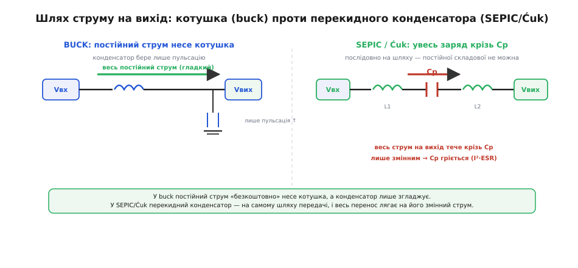
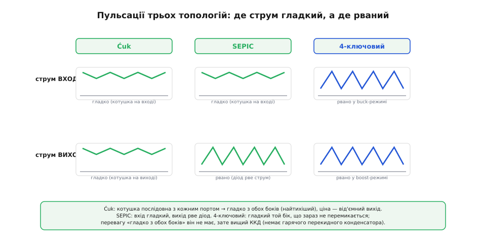

# 🧮 Широкий вхід із +/− виходом: чому перекидний конденсатор гарячий

Ми вже назвали трьох кандидатів на «широкий вхід, вихід вище й нижче»: SEPIC, Ćuk і 4-ключовий buck-boost. Назвати легко, а от **обрати** між ними — це вже не про полярність виходу, а про те, скільки заряду возить один конкретний конденсатор, скільки тепла з цього виходить і як воно лягає на плату. Тут ми виведемо це число з нуля — з балансу заряду, так само як баланс вольт-секунд дав нам коефіцієнти перетворення. З нього стане видно і чому SEPIC та Ćuk мають гарячий елемент, якого немає в 4-ключовому, і звідки беруться їхні пульсації, і чому правило вибору між трьома виглядає саме так.

Одне уточнення про метод, перш ніж рахувати. Коефіцієнти перетворення трьох топологій ми вже маємо з балансу вольт-секунд для котушки: та сама дисципліна («у сталому режимі усереднене за такт мусить бути нулем»), тільки застосована до напруги на котушці. Тут ми застосуємо ту саму думку до **заряду в конденсаторі** — і саме вона видасть головне число.

Спершу домовимося про назву. Той конденсатор, що стоїть **між** двома котушками (у SEPIC — послідовно в силовому шляху, у Ćuk — теж), у літературі звуть по-різному: coupling capacitor, series capacitor, energy-transfer capacitor. Ми зватимемо його **перекидним** — бо його робота саме така: за один такт він набирає заряд з одного боку, за другий скидає його на другий, і так перекидає енергію крізь себе, а не повз себе. Слово точне: у buck чи boost котушка **накопичує** енергію в магнітному полі й віддає її туди ж, куди тече струм; а тут конденсатор **транспортує** заряд з боку входу на бік виходу. Ця різниця — «накопичує на місці» проти «перевозить наскрізь» — і є коренем усього, що буде далі.

## Означення: середній струм у конденсаторі за такт мусить бути нулем

Почнемо з тієї самої дисципліни, що дала баланс вольт-секунд для котушки, тільки застосуємо її до конденсатора. Основне рівняння конденсатора:

```
i_C = C · dV_C/dt
```

Струм крізь конденсатор — це швидкість зміни напруги на ньому, помножена на ємність. Переставимо й проінтегруємо за один період перемикання T:

```
ΔV_C = (1/C) · ∫₀ᵀ i_C dt
```

Ліворуч — на скільки змінилася напруга на конденсаторі за період. А тепер ключове спостереження, те саме, що для котушки. У **усталеному режимі** (steady state) кожен такт схожий на попередній: напруга на перекидному конденсаторі на початку періоду й наприкінці однакова, інакше вона повзла б від такту до такту без упину. Отже ΔV_C = 0 за період. Підставимо:

```
∫₀ᵀ i_C dt = 0     →     середній струм у конденсаторі за такт = 0
```

Це **баланс заряду** (charge balance) — конденсаторний двійник балансу вольт-секунд. Сенс фізичний: скільки заряду за такт у конденсатор увійшло, стільки й вийшло, бо накопичити його назавжди нікуди — напруга обмежена усталеним режимом. Звучить як бухгалтерська дрібниця, та за хвилину з неї випаде, що перекидний конденсатор мусить пропустити крізь себе **весь** струм, який топологія передає з входу на вихід. І саме тому він гарячий.

> 🔧 **Навіщо це.** Баланс заряду — це та сама лінійка, що баланс вольт-секунд, тільки для конденсаторів. Нею ти за півсерветки знаходиш і середню напругу на перекидному конденсаторі (скільки він мусить витримати), і діюче значення струму крізь нього (скільки він грітиме) — два числа, від яких прямо залежить, який конденсатор ставити й чи не він завалить надійність усієї схеми. Без цієї лінійки лишається тицяти пальцем у небо й міряти вже спаяне.

## Інтуїція: чому крізь перекидний конденсатор іде вся передана потужність

Перш ніж рахувати, збудуймо картину на пальцях — бо коли вона є, формула стає лише підтвердженням очевидного.

Візьмімо SEPIC. Схема така: вхід → котушка L1 → далі ключ вниз на землю, а від тієї ж точки перекидний конденсатор Cp веде до другого вузла, де стоять котушка L2 (на землю) і діод на вихід. Простежмо, куди тече вихідний струм, такт за тактом.

Коли ключ **замкнений**, вхідна котушка L1 накопичує енергію від входу, а діод на виході **закритий** (він під зворотною напругою). Питання: звідки в цю мить бере струм навантаження? Вихідний конденсатор і... струм L2, що замикається через перекидний конденсатор Cp назад на ключ. Тобто заряд для виходу в цій фазі йде **крізь Cp**.

Коли ключ **розмикається**, обидві котушки перекидають свій струм на вихід крізь діод — і струм L1 при цьому теж іде **крізь Cp** (бо Cp стоїть послідовно на шляху від L1 до вихідного вузла). Знову крізь Cp.

Виходить, **у жодній фазі перекидний конденсатор не буває в стороні**: він завжди на шляху струму, що передається з входу на вихід. Порівняй із вихідним конденсатором buck — той лише згладжує пульсації, беручи на себе змінну складову, а постійну складову несе котушка повз нього. Тут навпаки: перекидний конденсатор не збоку від шляху, а **на самому шляху**, послідовно. Тому крізь нього мусить пройти весь заряд, що йде на вихід, — за такт стільки, скільки навантаження спожило за такт.

Ось звідки береться теза «возить усю передану потужність». Точніше — весь **заряд**, а отже й струм, а грітиме він на своєму паразитному опорі пропорційно квадрату струму. Порівняння з котушкою тут ламається в найважливішій точці, і це варто проговорити прямо: у котушці buck постійна складова струму — це «безкоштовний» перенос, вона майже не гріє осердя (гріє мідь, але то інше). У перекидному конденсаторі постійної складової струму бути **не може** — баланс заряду це щойно заборонив. Тож весь перенос лягає на **змінну** складову, а змінна складова — це саме те, що гріє конденсатор на його послідовному опорі. Конденсатор змушений робити постійну роботу (перевозити заряд) виключно змінним струмом. У цьому вся біда.


*Ліворуч — buck: постійний струм на вихід несе котушка, а конденсатор лише зрізає пульсації, тому його струм малий. Праворуч — SEPIC/Ćuk: перекидний конденсатор стоїть послідовно на шляху передачі, крізь нього проходить увесь заряд на вихід, а постійної складової йому мати не можна — отже весь перенос лягає на змінний струм, який його й гріє.*

У Ćuk картина ще чистіша й через це показовіша. Там перекидний конденсатор стоїть **строго послідовно** між входом і виходом, а обидві котушки — L1 на вході, L2 на виході — увімкнені так, що їхні струми гладкі (котушка послідовна з кожним портом). Уся передача енергії з входу на вихід фізично йде **крізь конденсатор**: він єдиний елемент, що з'єднує вхідну частину з вихідною по постійному струму (точніше — по переносу заряду, бо постійного струму крізь нього, знову ж, нема). Тому в Ćuk особливо очевидно: конденсатор — це серце передачі, і воно працює на повну.

## Формальний апарат: діюче значення струму перекидного конденсатора

Тепер порахуймо число. Мета — діюче (RMS) значення струму крізь Cp, бо саме воно, помножене на паразитний опір ESR (англ. *equivalent series resistance* — еквівалентний послідовний опір), дає теплові втрати P = I²_rms · ESR.

Розгляньмо Ćuk як найчистіший випадок (у SEPIC результат виходить того самого порядку, лише з іншою розкладкою за фазами). Позначимо коефіцієнт заповнення D (частка періоду, коли ключ замкнений), вхідний струм I_вх (він же середній струм L1) і вихідний струм I_вих (середній струм L2). З балансу потужності без втрат:

```
Vвх · I_вх = Vвих · I_вих     →     I_вх / I_вих = Vвих / Vвх = |M|
```

де |M| = D/(1−D) — уже знайомий коефіцієнт перетворення buck-boost за модулем. Тепер — струм крізь Cp у кожній фазі. Скористаймося балансом заряду для L1 і L2, але простіше глянути прямо на топологію.

**Фаза замкненого ключа (тривалість D·T).** Ключ замкнений. У Ćuk у цій фазі перекидний конденсатор **розряджається струмом вихідної котушки**: крізь нього тече −I_вих (знак — умовний, важлива величина). Тобто:

```
i_Cp = −I_вих   протягом  D·T
```

**Фаза розімкненого ключа (тривалість (1−D)·T).** Ключ розімкнений. Тепер конденсатор **заряджається вхідним струмом**: крізь нього тече +I_вх.

```
i_Cp = +I_вх    протягом  (1−D)·T
```

Перевіримо балансом заряду — це водночас і контроль, що не наплутали зі знаками:

```
заряд за такт = (−I_вих)·(D·T) + (I_вх)·((1−D)·T) = 0
              →  I_вх·(1−D) = I_вих·D
              →  I_вх / I_вих = D/(1−D) = |M|   ✓
```

Збіглося з балансом потужності — отже картина фаз правильна. Тепер діюче значення. Струм — це прямокутна «двоступінчаста» хвиля: рівень −I_вих частку часу D і рівень +I_вх частку (1−D). Діюче значення такої хвилі:

```
I_Cp,rms = √[ D·I_вих² + (1−D)·I_вх² ]
```

Це вже придатна для рахунку формула, і в неї варто вчитатися. Підставимо I_вх = I_вих · D/(1−D), щоб виразити все через вихідний струм:

```
I_Cp,rms = I_вих · √[ D + (1−D)·(D/(1−D))² ]
         = I_вих · √[ D + D²/(1−D) ]
         = I_вих · √[ D·(1−D) + D² ] / √(1−D)
         = I_вих · √[ D ] / √(1−D)
         = I_вих · √( D/(1−D) )
```

Ось воно, чисте й промовисте:

```
I_Cp,rms = I_вих · √( D/(1−D) ) = I_вих · √|M|
```

(У ці формули ми свідомо не включили дрібну трикутну пульсацію струму котушок — вона додає лічені відсотки й лише злегка піднімає RMS; тут важить головний член, а він саме такий.)

Прочитаймо результат. При D = 0.5 (вхід ≈ вихід) маємо I_Cp,rms = I_вих · √1 = I_вих — конденсатор возить струм **рівно як навантаження**. При D = 0.67 (підвищення вдвічі, |M| = 2) — I_Cp,rms = I_вих · √2 ≈ 1.41·I_вих. При D = 0.75 (|M| = 3) — уже 1.73·I_вих. Що глибший режим підвищення, то більший струм крізь конденсатор **відносно виходу**, бо росте вхідний струм, а він тече крізь Cp у фазі заряду.

**Порахуймо на живому ТЗ.** Ćuk-перетворювач: Vвх = 5 В, Vвих = −12 В (за модулем 12 В), навантаження 1 А (тобто I_вих = 1 А). Скільки грітиме перекидний конденсатор і чи витримає звичайна кераміка?

```
|M| = Vвих/Vвх = 12/5 = 2.4
D:  |M| = D/(1−D) = 2.4  →  D = 2.4/(1+2.4) = 0.706
I_вх = I_вих·|M| = 1·2.4 = 2.4 А

I_Cp,rms = I_вих·√|M| = 1·√2.4 = 1.55 А

тепло, якщо ESR = 10 мОм (типова MLCC-збірка):
   P_Cp = I_Cp,rms²·ESR = 1.55²·0.010 = 0.024 Вт  → терпимо
тепло, якщо взяли один дешевий конденсатор з ESR = 60 мОм:
   P_Cp = 1.55²·0.060 = 0.144 Вт  → відчутний саморозігрів
```

Різниця між «терпимо» і «гаряче» — цілком у ESR перекидного конденсатора. Півтора ампера діючого струму — це не абстракція: на поганому конденсаторі вони перетворюють його на грілку, яка ще й сохне (електроліт випаровується, ESR росте, тепло росте — [позитивний зворотний зв'язок](root:embedded/thermal-runaway-protection), що вбиває надійність). Тому в SEPIC і Ćuk перекидний конденсатор беруть **не за ємністю, а за струмом і ESR** — часто це паралель кількох MLCC заради низького сумарного ESR і розкладання тепла по площі. Ось де ховається «гарячий, дорогий, часто визначає надійність».

> 🔧 **Навіщо це.** Формула I_Cp,rms = I_вих·√|M| — це той рядок, який треба тримати в голові, обираючи SEPIC чи Ćuk. Він одразу каже: конденсатор мусить бути розрахований на струм не менший за вихідний, а в режимі підвищення — помітно більший. Купиш конденсатор «на потрібну напругу й ємність», забувши про струм, — і він або перегріється, або деградує за місяці. З цим числом добираєш ripple-current rating (допустимий діючий струм) свідомо, а не на око.

## Чому 4-ключовий buck-boost вільний від цього тепла

Тепер стає видно, у чому головна перевага 4-ключового, про яку базова стаття сказала одним рядком «немає гарячого перекидного конденсатора». Розгляньмо його будову: це буквально [buck](topic:electronics/buck) і [boost](topic:electronics/boost), склеєні спільною котушкою. Ліворуч — напівміст buck (два ключі), праворуч — напівміст boost (два ключі), між ними **одна** котушка. Перекидного конденсатора немає взагалі.

Простежмо шлях енергії. Коли Vвх > Vвих, права половина «застигає» (нижній boost-ключ завжди відкритий шлях на вихід), а ліва працює як звичайний buck: котушка передає енергію крізь себе, магнітним полем. Коли Vвх < Vвих, застигає ліва (buck-ключ постійно замкнений), а права працює як boost. У зоні Vвх ≈ Vвих обидві половини перемикаються по черзі, зшиваючи режими. У жодному з цих станів **немає елемента, що перевозив би весь заряд змінним струмом**: енергія йде крізь котушку, а котушка носить постійну складову «безкоштовно» (гріє лише мідь опором обмотки, а не змушена все робити пульсацією). Конденсатори на вході й виході — лише згладжувальні, як у звичайному buck: беруть на себе тільки пульсацію, а не весь перенос.

Ось чому 4-ключовий виграє в ККД: він **прибрав з силового шляху той самий елемент, що в SEPIC і Ćuk мусив гріти**. Ціна — замість одного перекидного конденсатора тепер чотири ключі й розумніше керування (гладко перемикати між buck-, boost- і змішаним режимами, інакше вихід смикається в зоні переходу). Але транзистор з малим опором каналу грітиме менше за конденсатор, змушений возити струм, — і при однаковій потужності 4-ключовий стабільно дає на кілька відсотків вищий ККД. Коли керувати чотирма ключами стало дешево (усе в одній мікросхемі), це й посунуло SEPIC там, де важить кожен відсоток і кожен градус.

Складімо порівняння в одну таблицю — тепер уже з числами й механізмом, а не гаслами:

| Риса | SEPIC | Ćuk | 4-ключовий buck-boost |
|---|---|---|---|
| Полярність виходу | додатна | **від'ємна** | додатна |
| Магнітні елементи | 2 котушки (можна зв'язані) | 2 котушки (можна зв'язані) | **1 котушка** |
| Перекидний конденсатор | так, гарячий | так, гарячий | **немає** |
| Струм крізь Cp | ≈ I_вих·√|M| | ≈ I_вих·√|M| | — |
| Пульсація на вході | помірна (котушка L1 згладжує) | **гладка** (котушка послідовна) | пульсуюча у boost-режимі |
| Пульсація на виході | пульсуюча (діод рве струм) | **гладка** (котушка послідовна) | пульсуюча у buck-режимі |
| Захист виходу від КЗ | **так** (Cp рве постійний шлях) | **так** (Cp рве шлях) | ні (потрібен окремий) |
| ККД | середній | середній | **найвищий** |
| Ключів | 1 (+діод) | 1 (+діод) | 4 |
| Складність керування | проста | проста | висока (зшивання режимів) |

## Пульсації: чому Ćuk найтихіший, а SEPIC компроміс

Формула струму крізь Cp пояснила тепло. Тепер друга вісь — пульсації, і вона теж випливає з топології, а не з магії. Ключ у тому, **де стоять котушки відносно портів**.

У **Ćuk** вхідна котушка L1 увімкнена **послідовно з входом**, а вихідна L2 — **послідовно з виходом**. Котушка — це інерція для струму: вона не дає струмові стрибати. Отже і вхідний, і вихідний струм у Ćuk — **гладкі трикутники з малою пульсацією**, бо на кожному порту стоїть котушка-згладжувач. Це робить Ćuk найтихішим із трьох за кондуктивними завадами: він не пускає в мережу живлення різкі імпульси струму, які потім треба ловити [вхідним EMI-фільтром](root:embedded/emi-filter-design). За чистоту входу й виходу платимо від'ємною полярністю — не завжди зручною, часто вимагає ще однієї інверсії десь далі.

У **SEPIC** вхідна котушка L1 теж послідовна з входом — тому **вхід у SEPIC теж досить гладкий**, це його спільна з Ćuk перевага перед boost (у boost вхідна котушка теж на вході, але сам boost прозорий для КЗ; SEPIC додає захист). А от **вихід** у SEPIC — інша річ: там стоїть діод, який щотакту різко рве струм, і на вихід іде **пульсуючий** струм, який мусить зрізати вже вихідний конденсатор. Тому SEPIC — компроміс: гладкий вхід, але шумніший вихід, ніж у Ćuk.

У **4-ключовому** пульсація «мігрує» залежно від режиму. У buck-режимі (Vвх > Vвих) вихід гладкий (котушка перед вихідним конденсатором, як у звичайному buck), а вхід пульсує. У boost-режимі (Vвх < Vвих) навпаки: вхід гладкий, а вихід пульсує (діод/синхронний ключ рве струм). У зоні переходу поводиться змішано. Тобто 4-ключовий не має вбудованої переваги Ćuk «гладко з обох боків» — за неї він і не платив від'ємною полярністю.

Зведімо різницю в одну картину, бо тут словами легко заплутатися:


*Струм на вході (згори) і на виході (знизу) для трьох топологій. Ćuk: котушка послідовна з кожним портом — гладко з обох боків, найтихіший, ціна — від'ємний вихід. SEPIC: вхід гладкий (котушка на вході), вихід пульсує (діод рве струм). 4-ключовий: гладкий бік — той, де зараз не перемикається (buck-режим гладить вихід, boost-режим — вхід).*

Звідси практичне правило пульсацій, яке лягає поверх правила тепла: якщо схема стоїть поряд із чутливим до завад по живленню вузлом (радіо, точний [АЦП](topic:electronics/adc), давач) і потрібні і вгору-вниз, і чистота з обох боків — **Ćuk** дає це майже задарма, і від'ємну полярність тоді терплять або обертають далі. Якщо ж полярність мусить бути додатною й важить чистота **входу** (не виходу) — **SEPIC** годиться. Якщо важить ККД, а пульсацію все одно давить окремий фільтр — **4-ключовий**.

## Розводка: де кожна топологія коле око монтажникові

Остання вісь — фізична розводка (layout), і вона теж прямо випливає з того, що ми вивели. Перекидний конденсатор возить великий діючий струм із крутими фронтами — отже його **петля має бути короткою**, інакше паразитна індуктивність доріжок перетворить круті фронти струму на викиди напруги (за U = L·di/dt), які дзвенять і сиплють завадами.

- **SEPIC і Ćuk.** Дві котушки й гарячий перекидний конденсатор між ними. Критична петля — та, якою тече струм Cp у фазі заряду й розряду: конденсатор, ключ, котушки. Її тримають щільною. Дві котушки з'їдають площу; якщо взяти **зв'язані** котушки (обидві обмотки на спільному осерді, англ. *coupled inductor*) — площа менша й пульсація може ще зменшитися завдяки взаємній індуктивності, але з'являється вимога до узгодження обмоток. Гарячий конденсатор варто рознести на кілька MLCC у паралель — і заради ESR, і щоб розмазати тепло по міді, а не пекти в одній точці.
- **4-ключовий.** Одна котушка, зате **дві** критичні комутаційні петлі — ліва (buck-напівміст із вхідним конденсатором) і права (boost-напівміст із вихідним конденсатором). Кожну треба тримати щільною окремо, як у звичайних buck і boost. Плюс складніший розвід затворів чотирьох ключів. Зате немає гарячого конденсатора, який диктував би окрему теплову увагу. На практиці 4-ключовий майже завжди беруть **інтегрованим** — power-stage чи вся мікросхема разом із ключами, — і тоді розводка зводиться до двох акуратних петель конденсаторів біля корпусу, а решту зробив кремній.

Прикмети на готовій платі, що прямо продовжують навик упізнавання топології за виглядом: **дві котушки з помітним конденсатором строго між ними** — це SEPIC або Ćuk (розрізняє полярність виходу й те, чи вихідний струм гладкий); **одна котушка між двома парами ключів** (або мікросхема з однією котушкою й чотирма силовими виводами) — 4-ключовий. Якщо біля двокотушкового вузла бачиш паралель кількох однакових конденсаторів у самому центрі — це майже певно перекидний конденсатор, якому дали низький ESR і розклали тепло; його гаряча роль тепер тобі зрозуміла зсередини.

## Де в темі це працює: правило вибору між трьома

Тепер зберемо все виведене в одне рішення — те саме, що базова дала однією гілкою «широкий вхід, +вихід, захист КЗ → SEPIC», але вже з механізмом за кожним словом.

Порядок питань такий:

```
1) Полярність виходу?
     від'ємна припустима (або потрібна) → Ćuk
         (найтихіший: гладко вхід і вихід; ціна — гарячий Cp)
     мусить бути додатна → далі

2) Що важливіше — ККД чи дешевизна+захист виходу?
     важить ККД, пульсацію додавить окремий фільтр → 4-ключовий buck-boost
         (немає гарячого Cp → на кілька % вищий ККД; ціна — 4 ключі, складне керування)
     важать дешевизна й вбудований захист виходу від КЗ, ККД другорядний → SEPIC
         (простий, 1 ключ, Cp рве шлях; ціна — гарячий Cp і шумніший вихід)
```

Коротко це можна тримати як три образи, тепер уже підкріплені числом:

- **Ćuk** — коли треба **тиша** з обох боків і не заважає **мінус**. Дві котушки послідовно з портами гладять струм; перекидний конденсатор возить I_вих·√|M| і гріє — його добирають за струмом.
- **SEPIC** — коли треба **дешево, +вихід і захист виходу**, а ККД не критичний. Той самий гарячий конденсатор, але полярність додатна й вихід рве діод (шумніший, ніж у Ćuk).
- **4-ключовий** — коли треба **ККД і +вихід**, а на керування й чотири ключі готовий піти. Прибрав гарячий конденсатор із силового шляху — тому й найефективніший.

Механізм за всіма трьома один: **перекидний конденсатор возить весь заряд на вихід і не має права на постійну складову струму, тому весь перенос лягає на змінний струм — а він гріє**. SEPIC і Ćuk терплять це заради простоти й захисту (SEPIC) чи заради чистоти струмів (Ćuk); 4-ключовий викидає конденсатор і платить складністю. Знаючи це число — I_Cp,rms = I_вих·√|M| — ти вибираєш не за таблицею напам'ять, а за фізикою, яку сам щойно вивів.

## Історія: серб у Caltech і телеком у Bell Labs

Ці топології — ровесники кінця 1970-х, і за кожною стоїть конкретна людина й конкретна потреба.

**SEPIC** широко приписують Р. П. Мессі та Е. К. Снайдеру (R. P. Massey, E. C. Snyder) — інженерам, пов'язаним із Bell Labs. Їхня доповідь пролунала на конференції IEEE Power Electronics Specialists Conference (PESC) 1977 року; у джерелах її наводять під назвою на кшталт «High Voltage Single-Ended DC-DC Converter». Потреба була телекомівська: живлення без інверсії полярності з мінливого джерела, чого buck-boost тих років не давав без обертання знаку. Статус атрибуції варто назвати чесно: це **усталена галузева атрибуція** — її повторюють даташити, довідники й навчальні матеріали, — але первинну доповідь у джерелах цитують нечасто, і побачити оригінал складніше, ніж хотілося б. Тож ім'я авторів беремо як загальноприйняте, не як звірене за першоджерелом.

**Ćuk-топологію** названо за **Слободаном Ćuk** (Slobodan Ćuk; прізвище читається «Чук») — сербом, що народився в Белграді (тоді Югославія) і 1972 року переїхав до США за підтримки NASA. Тут атрибуція значно твердіша й документована. Він захистив докторську в Каліфорнійському технологічному інституті (Caltech) у листопаді 1976 року; тема — «Modeling, Analysis, and Design of Switching Converters». Його науковим співавтором і старшим колегою був Р. Д. Міддлбрук (R. D. Middlebrook) — той самий, чиє ім'я стоїть на [методі вимірювання петлевого підсилення](root:embedded/loop-gain-measurement); разом вони 1976 року дали славнозвісну працю «A General Unified Approach to Modelling Switching-Converter Power Stages» (метод усередненого простору станів, що й досі — основа аналізу імпульсних перетворювачів). Перший патент на Ćuk-перетворювач подано 1977 року; за винахід топології та її розширень Ćuk дістав нагороду **IR-100** (від журналу *Industrial Research*) 1980 року, а всього тримає понад 30 патентів на нові концепції імпульсного перетворення. Тут важливо не сплутати виміри: серб за етнічністю й походженням, громадянин Югославії при народженні, а вся інженерна робота — американська, у Caltech; топологія — це його **документований, запатентований** внесок, а не пізніша приписка. Саме перевага «гладко з обох боків», яку ми вивели, і була тим, заради чого Ćuk будував схему так, а не інакше.

**4-ключовий buck-boost** як **інтегрована мікросхема** прийшов помітно пізніше — коли керувати чотирма ключами стало дешево й компактно (усе в одному кристалі з розумним контролером режимів). Сама ідея склеїти buck із boost спільною котушкою стара, але зробити її практичною, ефективною й простою у застосуванні змогли лише інтегральні рішення пізніших десятиліть. Саме тому сьогодні 4-ключовий часто витісняє SEPIC там, де важить ККД: історично молодша топологія отримала перевагу не через нову фізику, а через дешевий кремній для керування — той самий кремній, що прибрав із силового шляху гарячий конденсатор і лишив від нього тільки згадку.
