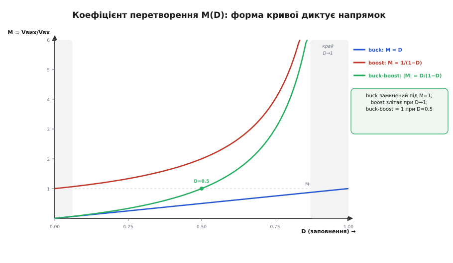

# Вибір топології живлення — детально

Базова тема дала метод: п'ять питань, карта областей, таблиця випадків, пастки. Він працює — за секунди перетворює ТЗ на клас перетворювача. Але він працює тому, що спирається на речі, які базова лише **назвала**, не довівши: чому buck уміє лише вниз, boost лише вгору, а buck-boost — в обидва боки; чому boost прозорий для короткого замикання; чому помпа тягне тільки міліампери; чому глибоке зниження на високій частоті раптом ламає навіть правильно обраний buck. Тут ми ці «чому» **виводимо** — і побачимо, що дерево рішення не довільне, а прямо випливає з фізики кожної топології. Коли розумієш вивід, дерево перестає бути таблицею для запам'ятовування: ти реконструюєш його сам із перших засад щоразу, коли до ТЗ додається новий рядок.

Нитку ведемо так само, як у базовій, лише глибше. Спершу — єдиний закон, з якого ростуть усі коефіцієнти перетворення (баланс вольт-секунд). Тоді виводимо з нього M(D) кожної котушкової топології й читаємо з формул їхні природні напрямки та **межі робочого діапазону** — саме межі, а не самі формули, і виганяють тебе з топології в сусідню. Далі — гранична механіка, якої базова не торкалась: стеля коефіцієнта заповнення, зіткнення з мінімальним часом увімкнення при глибокому зниженні, режими CCM/DCM і як вони зсувають вибір. Потім — помпа з боку її вихідного опору (звідки «лише міліампери» як число, а не гасло), ізольовані щаблі за потужністю з механізмом кожного переходу, і наскрізні worked-приклади вибору вже з числами й кодом. Насамкінець — та сама карта пасток, але тепер кожна пастка виведена, а не просто названа.

## Один закон на всі котушкові топології: баланс вольт-секунд

Buck, boost, buck-boost, SEPIC, flyback — усі вони котушкові, і всі підкоряються одному-єдиному закону. Зрозумієш його раз — і коефіцієнт перетворення будь-якої з них виведеш на серветці. Закон зветься **балансом вольт-секунд** (англ. *volt-second balance*), і ось звідки він береться.

Напруга на котушці (індуктивності) зв'язана зі швидкістю зміни струму крізь неї:

```
V_L = L · (dI/dt)
```

Перепишемо як зміну струму за час: за проміжок Δt, поки на котушці стоїть напруга V_L, струм зміниться на

```
ΔI = (V_L / L) · Δt
```

Тепер ключова вимога. Перетворювач працює **періодично**: кожен такт повторює попередній. Щоб струм у котушці не зростав і не спадав від такту до такту нескінченно (інакше котушка або насититься, або струм згасне до нуля й режим зміниться), за **повний період** сумарна зміна струму має дорівнювати нулю:

```
ΔI за період = 0   ⟹   сума (V_L · Δt) за період = 0
```

Ось і весь закон. **Добуток напруги на котушці й часу, поки ця напруга діє, підсумований за період, дорівнює нулю.** Інтеграл V_L·dt має розмірність вольт·секунда — звідси назва. Фізичний зміст простий: скільки вольт-секунд «залили» в котушку за час увімкнення ключа, стільки ж мусять «вилити» за час його вимкнення. Магнітний потік у осерді за період повертається туди, звідки почав.

> 🔧 **Навіщо це.** Це не абстракція для іспиту, а робочий інструмент за столом. З балансу вольт-секунд ти за 30 секунд знаходиш робочий коефіцієнт заповнення для будь-якого Vвх/Vвих — а знаючи його, одразу бачиш, чи не впираєшся в межі (про них далі). Той самий закон дає й розмах пульсацій струму котушки, тобто напряму підказує її індуктивність. Уся арифметика вибору топології стоїть на цих трьох рядках.

Тепер прикладемо закон до кожної топології. Домовимось про позначення: D — **коефіцієнт заповнення** (англ. *duty cycle*, від *duty* — «частка роботи»), тобто частка періоду, коли головний ключ **увімкнений** (0 < D < 1); T — період; отже ключ увімкнений час D·T, вимкнений — (1−D)·T. Розглядаємо усталений режим неперервного струму (котушка ніколи не розряджається до нуля — режим CCM, до якого повернемось окремо).

### Buck: чому лише вниз

У [buck](book:electronics/buck)-перетворювачі котушка одним кінцем через ключ бачить то вхід, то землю, а іншим — тримає вихід. Розберемо дві фази.

**Ключ увімкнений (час D·T).** Котушка ввімкнена між входом і виходом; напруга на ній:

```
V_L(on) = Vвх − Vвих
```

(Vвх вище за Vвих, тож напруга додатна — струм у котушці **зростає**, вона накопичує.)

**Ключ вимкнений (час (1−D)·T).** Верхній ключ розімкнено, струм котушки тепер тече крізь нижній ключ (діод або синхронний MOSFET) із землі; лівий кінець котушки — на нулі:

```
V_L(off) = 0 − Vвих = −Vвих
```

(Напруга від'ємна — струм **спадає**, котушка віддає накопичене у вихід.)

Прикладаємо баланс: вольт-секунди «за» дорівнюють вольт-секундам «проти».

```
(Vвх − Vвих) · D·T  +  (−Vвих) · (1−D)·T  =  0
```

Скорочуємо T, розкриваємо:

```
(Vвх − Vвих)·D − Vвих·(1−D) = 0
Vвх·D − Vвих·D − Vвих + Vвих·D = 0
Vвх·D − Vвих = 0
```

Звідси **коефіцієнт перетворення buck**:

```
M = Vвих / Vвх = D          (0 < D < 1  ⟹  0 < M < 1)
```

Читаємо результат. D — це частка від нуля до одиниці, отже Vвих завжди **менша** за Vвх. Це не властивість деталей, не наслідок втрат — це математичний факт із балансу вольт-секунд. Buck **фізично не може** підняти напругу: хоч постав D=1 (ключ увімкнено весь час), у краю дістаєш лише Vвих = Vвх, і то втративши будь-яке регулювання. Ось де в дереві рішень береться «завжди нижче → buck»: топологія має вбудовану стелю M = 1, і перейти її ніяк.

### Boost: чому лише вгору

У [boost](book:electronics/boost) котушка стоїть одразу за входом, а ключ періодично замикає її дальній кінець на землю.

**Ключ увімкнений (D·T).** Котушка ввімкнена прямо між входом і землею:

```
V_L(on) = Vвх
```

(Уся вхідна напруга — на котушці; струм **швидко зростає**, котушка накачується. Діод на вихід замкнений.)

**Ключ вимкнений ((1−D)·T).** Струм котушки мусить кудись іти — і йде крізь діод у вихід. Тепер котушка ввімкнена між входом і виходом:

```
V_L(off) = Vвх − Vвих
```

(Vвих вище за Vвх, тож напруга від'ємна — струм спадає, котушка **додає свою накопичену енергію поверх входу**.)

Баланс:

```
Vвх · D·T  +  (Vвх − Vвих) · (1−D)·T  =  0
Vвх·D + Vвх·(1−D) − Vвих·(1−D) = 0
Vвх − Vвих·(1−D) = 0
```

Звідси **коефіцієнт перетворення boost**:

```
M = Vвих / Vвх = 1 / (1−D)          (0 < D < 1  ⟹  M > 1)
```

Тепер видно симетрію з buck. (1−D) — теж число від нуля до одиниці, але воно в **знаменнику**, тож M завжди **більше** за одиницю. Boost фізично не вміє знижувати: за D=0 маєш M=1 (просто провід крізь котушку й діод), а будь-який робочий D дає вихід **вище** входу. Ось «завжди вище → boost».

І тут же виринає перша нетривіальна межа, якої базова не пояснювала числом. Дивись, що робить M при D→1:

```
D = 0.5  →  M = 2
D = 0.8  →  M = 5
D = 0.9  →  M = 10
D = 0.95 →  M = 20
D = 0.99 →  M = 100 (?)
```

Формула обіцяє нескінченне підвищення при D→1 — але це **брехня ідеалу**. У реальній котушці є опір, у ключі — опір, у діоді — падіння. Коли D наближається до одиниці, час (1−D), за який котушка встигає віддати енергію у вихід, стискається до нуля, а струм крізь неї росте до небес, щоб перенести ту саму потужність за коротший інтервал. Опори перетворюють цей великий струм на тепло швидше, ніж росте вихід. На практиці boost видихається на M ≈ 5…8 (D ≈ 0.8…0.87): далі ККД валиться, котушка й ключ перегріваються. **Тому «треба ×10 і більше» — це вже сигнал іти геть від простого boost** до трансформаторної топології (flyback, push-pull), де кратність задає **виток**, а не коефіцієнт заповнення. Дерево рішень цього не показує — але вивід показує, і це рятує від спроби витиснути з boost те, чого фізика не дає.

### Buck-boost: чому в обидва боки і чому інверсія

Класичний (інвертувальний) [buck-boost](book:electronics/buck-boost) поєднує риси обох. Котушка, як у boost, під час увімкнення бачить весь вхід; але вихід у нього **від'ємний**.

**Ключ увімкнений (D·T).** Котушка між входом і землею:

```
V_L(on) = Vвх
```

**Ключ вимкнений ((1−D)·T).** Струм котушки перекидається через діод на вихід, а вихід — від'ємний:

```
V_L(off) = Vвих   (Vвих < 0, тобто ця напруга від'ємна)
```

Баланс:

```
Vвх · D  +  Vвих · (1−D)  =  0
Vвих · (1−D) = −Vвх · D
```

Звідси **коефіцієнт перетворення інвертувального buck-boost**:

```
M = Vвих / Vвх = −D / (1−D)
```

Три речі читаються одразу. По-перше, знак **мінус**: класичний buck-boost дає від'ємний вихід із додатного входу. Ось звідки в дереві «потрібен −5 В → інвертувальна гілка»: це не хитрість схемотехніка, а прямий наслідок того, як котушка перекидає струм у вихід. По-друге, за абсолютною величиною |M| = D/(1−D) пробігає **весь діапазон** від 0 (при D→0) до нескінченності (при D→1), проходячи через 1 при D = 0.5. Тобто та сама схема дає |Vвих| і менше, і більше за Vвх — залежно лише від D. Ось «гуляє навколо → buck-boost». По-третє, точка перелому — рівно D = 0.5: нижче половини заповнення виходить зниження, вище — підвищення.

А **4-ключовий** buck-boost (той, що дає **додатний** вихід у обидва боки — саме його бере дерево для «12 В з 4S») — це буквально buck-каскад і boost-каскад на спільній котушці, що керуються по черзі. Коли Vвх помітно вище цілі — працює тільки buck-половина (M = D_buck), boost-ключі стоять. Коли Vвх помітно нижче — працює тільки boost-половина (M = 1/(1−D_boost)), buck-ключі відкриті навстіж. У вузькій зоні, де Vвх ≈ Vвих, обидві половини перемикаються в межах періоду. Тому 4-ключовий і вміє додатний вихід і вгору, і вниз без інверсії — він просто **склеює** дві прості топології, кожна зі своєю вже виведеною формулою.

Три виводи, три формули — і все дерево «напрямку» тепер стоїть не на пам'яті, а на балансі вольт-секунд:

```
buck:            M = D              < 1     (тільки вниз)
boost:           M = 1/(1−D)        > 1     (тільки вгору)
buck-boost:      M = −D/(1−D)       весь діапазон, з інверсією
4-ключ. b-b:     склейка buck+boost  весь діапазон, +вихід
```


*Коефіцієнт перетворення від коефіцієнта заповнення для трьох базових топологій. Buck — пряма M = D, замкнена під одиницею. Boost — крива 1/(1−D), що злітає в нескінченність при D→1. Buck-boost за модулем D/(1−D) проходить через 1 при D=0.5. Затінені краї (D→0 і D→1) — зони, куди в реальності не заходять: там ККД валиться й вилазять граничні ефекти. Саме форма цих кривих, а не таблиця, диктує природний напрямок кожної топології.*

Поглиблене виведення цих коефіцієнтів разом із розмахом пульсацій струму, впливом паразитних опорів і граничним аналізом при D→1 — у вставці [🧮 Виведення коефіцієнтів перетворення з балансу вольт-секунд](root:embedded/topology-map/math-conversion-ratios.md).

## Межі робочого діапазону: що справді виганяє з топології

Формули M(D) кажуть, що будь-яку кратність нібито можна дістати правильним D. На папері. За столом тебе виганяє з топології не сама формула, а **край** її діапазону, де прості моделі ламаються. Базова тема назвала межі («boost видихається», «глибоке зниження важке») — тут виводимо, **де саме** й **чому** край, і як його розпізнати в цифрах ТЗ.

### Стеля коефіцієнта заповнення

Жоден реальний ключ не тримається увімкненим весь період. Йому потрібен час на перемикання, а синхронному верхньому ключу з бутстреп-живленням (англ. *bootstrap* — «сам себе за шнурівки»: конденсатор, що заряджається, поки нижній ключ відкритий, і потім живить драйвер верхнього) потрібен **проміжок вимкнення**, щоб цей конденсатор перезарядився. Тому контролери мають **максимальний коефіцієнт заповнення** D_max — типово 0.85…0.95.

Для buck це означає **межу за зниженням у зворотний бік — межу мінімального перепаду**, тобто скільки вхідної напруги мінімум треба над виходом. Якщо Vвх лише трохи вище Vвих, потрібен D близький до 1 — а його немає. Порахуймо на конкретиці: buck із D_max = 0.9 робить із входу максимум

```
Vвих(max) = D_max · Vвх = 0.9 · Vвх
```

Тобто щоб надійно тримати 3.3 В, вхід не має падати нижче 3.3/0.9 ≈ 3.67 В. Ось точний, а не приблизний, корінь того, чому «одна банка LiPo (3.0–4.2 В) → 3.3 В» **не** розв'язується простим buck: на сівшій банці вхід 3.0 В < 3.67 В, buck упирається в стелю D і **втрачає вихід**. Дерево ловить це як «вхід перетинає ціль» — а вивід дає точне число, за яким видно, що перетин настає ще до формальної рівності Vвх = Vвих, бо стеля D з'їдає останні відсотки перепаду. Тому там і потрібен buck-boost, а не buck: не тому, що вхід «іноді нижче», а тому, що навіть коли він **трохи вище**, стелі D вже бракує.

Симетрично для boost є **межа за мінімальним підвищенням** (мінімальний D і мінімальний час вимкнення), але вона зазвичай не така болюча, бо boost рідко просять на кратність, близьку до 1.

### Зіткнення з мінімальним часом увімкнення: чому глибоке зниження на високій частоті ламається

Ось ефект, якого базова тема не торкалась зовсім, а він щодня валить проєкти. Візьмемо buck із бортової мережі: Vвх = 48 В, Vвих = 3.3 В. Потрібен коефіцієнт заповнення

```
D = Vвих / Vвх = 3.3 / 48 ≈ 0.069
```

Ключ має бути увімкнений лише ~6.9 % періоду. Тепер згадаймо, що контролер має **мінімальний час увімкнення** t_on(min) — фізично найкоротший імпульс, який драйвер і ключ здатні відтворити (типово 50…100 нс). Порахуймо, який час увімкнення виходить на популярній частоті 2 МГц:

```
T = 1 / f = 1 / 2 000 000 = 500 нс
t_on = D · T = 0.069 · 500 нс ≈ 34.5 нс
```

34.5 нс — це **менше** за t_on(min) ≈ 60 нс типового контролера. Ключ фізично не встигає вмикатися на такий короткий час. Що станеться? Контролер не зможе тримати такий малий D — він почне **пропускати** імпульси (pulse skipping), вихід стрибне вгору, пульсації зростуть, регулювання розсиплеться. Формула M = D досі правильна — але **реалізувати** потрібний D залізо не може.

З цієї стіни рівно три виходи, і всі троє — типові інженерні рішення:

```
1) знизити частоту:  f = 300 кГц → T = 3.33 мкс → t_on = 0.069·3.33мкс ≈ 230 нс  ✓
   (ціна: більша котушка й конденсатори — менша частота, більший накопичувач)
2) два каскади:      48 В → 12 В (buck), 12 В → 3.3 В (buck)
   кожен зі здоровим D (0.25 і 0.275); ціна — другий каскад (і множення ККД!)
3) інша топологія:   при дуже глибокому зниженні — трансформаторна (виток задає кратність)
```

Ось чому «глибоке зниження на високій частоті» — окремий пункт вибору, а не дрібниця налаштування. Точка ТЗ, що виглядала як звичайний buck, під тиском t_on(min) **зсувається** або в нижчу частоту, або в багатокаскадну схему, або зовсім в іншу топологію. І помітити це можна лише порахувавши t_on = (Vвих/Vвх)·(1/f) і порівнявши з даташитом — око тут не допоможе. Ціна другого шляху — той самий каскадний ККД, що [множиться, а не додається](root:embedded/topology-map/math-efficiency-chain.md); тому два buck по 92 % дають 0.92² ≈ 85 %, і це теж треба покласти на терези.

> 🔧 **Навіщо це.** Ця перевірка — три множення на калькуляторі — рятує від найпідступнішої помилки вибору: обрати правильний клас (buck) і правильну частоту (2 МГц, «щоб котушка була дрібна»), а тоді тижнями ловити, чому вихід «плаває». Причина не в розводці й не в компенсації петлі — а в тому, що обраний D фізично не вміщається в період. Порахуй t_on ще на етапі ТЗ — і або опустиш частоту, або закладеш два каскади свідомо, а не в паніці після першого прототипу.

### Режими CCM і DCM: коли котушка встигає спорожніти

Досі ми мовчки припускали неперервний струм котушки (**CCM**, англ. *continuous conduction mode*): струм ніколи не падає до нуля, котушка завжди «жива». Але на **малому навантаженні** струм може встигнути спасти до нуля ще до кінця такту — і котушка частину періоду стоїть порожня. Це **розривний режим** (**DCM**, англ. *discontinuous conduction mode*), і він міняє поведінку так, що це прямо стосується вибору.

Чому взагалі буває DCM? Розмах пульсацій струму котушки ΔI не залежить від навантаження — його задає напруга й індуктивність (той самий баланс вольт-секунд). А середній струм котушки **дорівнює** струму навантаження (для buck) чи пов'язаний з ним. Коли навантаження мале, середній струм малий, і якщо він падає нижче половини розмаху пульсацій (I_навант < ΔI/2), нижній край пульсації сягає нуля — далі струм не може стати від'ємним у діоді (він однобічний), тож котушка просто чекає порожньою. Настає DCM.

Що це дає для вибору топології:

- **Формули M(D) в DCM інші** — вони починають залежати від навантаження й індуктивності, а не лише від D. Boost у DCM здатний на вищі кратності «на папері», але з поганим регулюванням. Розраховувати робочу точку за CCM-формулою в зоні DCM — помилка.
- **Асинхронний перетворювач у DCM «безпечніший» на легкому навантаженні**: діод природно не пускає зворотний струм, тож немає втрат на прокачуванні енергії туди-сюди.
- **Синхронний у чистому CCM на легкому навантаженні марнує заряд**: коли навантаження майже нуль, синхронний нижній ключ пускає струм назад, ганяючи енергію по колу й гріючи ключі даремно. Саме тому для батарейних пристроїв беруть режим **PFM** (пропуск імпульсів на легкому навантаженні) — контролер сам іде в переривчастий режим і засинає між пачками, різко піднімаючи ККД у сні. Це вже вторинна вісь із базової теми — але тепер видно її корінь: PFM існує, щоб не платити CCM-податок на порожньому ходу.

Отже межа CCM/DCM — не академічна тонкість, а те, що вирішує **синхронний чи асинхронний**, **forced-PWM чи PFM** — вторинні осі, які базова назвала, а тут ми прив'язали до конкретного струму переходу I_навант = ΔI/2. Практичний висновок: якщо пристрій довго живе на мікроамперах сну й зрідка прокидається на ампери — тобі майже напевно потрібен перетворювач із авто-PFM, бо в CCM він з'їв би батарею на порожньому ходу.

## Помпа з боку вихідного опору: звідки «лише міліампери» як число

Базова тема повторює: [зарядна помпа](book:electronics/charge-pump-conv) — «лише міліампери». Тут виведемо це **числом**, бо саме число вирішує, чи ляже твоє ТЗ в помпу, чи ні.

Помпа не має котушки; вона перекладає заряд конденсаторами. Ключова її властивість — **еквівалентний вихідний опір** R_out, який росте, коли частота перекладання падає або конденсатори малі. Для простого подвоювача (англ. *doubler*) чи щабля Діксона наближено:

```
R_out ≈ 1 / (f · C)
```

де f — частота перекачування, C — робочий (летючий) конденсатор. Цей опір стоїть **послідовно** з ідеальним подвоєним джерелом, тож під навантаженням вихід просідає:

```
Vвих ≈ M_ідеал · Vвх − I_навант · R_out
```

Ось де ховаються «міліампери». Порахуймо конкретно: подвоювач із f = 1 МГц і C = 1 мкФ.

```
R_out ≈ 1 / (10⁶ · 10⁻⁶) = 1 / 1 = 1 Ом
```

Один ом здається дрібницею — поки струм малий. На 10 мА просідання лише 10 мВ, помпа тримає. А тепер спробуймо витягти з неї «реальний» струм, скажімо 500 мА:

```
просідання = 0.5 А · 1 Ом = 0.5 В
```

Півв'ольта провалу — і це ще не все. Уся ця потужність I²·R_out = 0.5²·1 = 0.25 Вт горить **усередині помпи**, на її ключах і опорі конденсаторів, як на резисторі. Спробуй 1 А — просідання цілий вольт, розсіяння цілий ват на крихітній мікросхемі, вихід валиться, корпус пече. Ось точний механізм за гаслом «помпа тягне лише міліампери»: у неї **послідовний вихідний опір**, і будь-який помітний струм на ньому і просідає напругу, і перетворюється на тепло. Котушкового накопичувача, що переносив би енергію майже без втрат, у помпі просто немає.

Звідси й друга пастка з базової — «помпа на проміжну напругу палить, як лінійний». Тепер вона виводиться: якщо ти живиш помпою напругу, що **не збігається** з її природною кратністю (×2, ×3, ½), різницю вона гасить на тому самому R_out — тобто поводиться як лінійний стабілізатор з усіма його втратами, лише ще й галасливіший. Помпа економна **тільки** в точці своєї кратності й тільки на малому струмі; збий будь-яку з цих двох умов — і вона гірша за звичайний LDO.

Багатощаблева помпа Діксона (та, що робить високу напругу для програмування flash — рядок із таблиці базової) множить це на кількість щаблів: N щаблів дають ідеально (N+1)·Vвх, але кожен додає свій R_out, тож повний вихідний опір росте з N, і струмова здатність тане ще швидше. Тому Діксон і сидить рівно там, де він у базовій карті — у лівому нижньому куті: висока напруга, але **мікроамперний** струм програмування, де R_out у мегаомах ще прийнятний.

Історію винаходу цієї схеми — як Джон Діксон 1976 року зробив помпу, чия кратність не залежить від числа щаблів, щоб живити внутрішні +40 В у ранній енергонезалежній пам'яті, — розкриває вставка [📜 Помпа Діксона: заряд без котушки](root:embedded/topology-map/hist-charge-pump-lineage.md).

## Ізоляція: щаблі за потужністю й механізм кожного переходу

Базова каже: «flyback до ~100 Вт, далі forward і мости». Це щаблі, і кожен перехід між ними має конкретну фізичну причину, а не просто «більше потужності». Розберемо драбину, бо на реальному ТЗ треба знати **де** зіскочити на наступний щабель.

**Чому взагалі трансформатор.** [Flyback](book:electronics/flyback-isolated) та його родичі мають трансформатор із двох причин, і їх варто розділяти. Перша — **безпека**: гальванічна розв'язка рве провідний шлях від небезпечної мережі до того, чого торкається людина; це вимога, а не оптимізація (перше питання дерева). Друга — **кратність витком**: трансформатор дає велику зміну напруги через відношення витків n, а не через край коефіцієнта заповнення. Саме тому «230 В → 5 В» (кратність ~46) беруть трансформаторною топологією, а не boost/buck: витком таку кратність дістати легко й з добрим ККД, а коефіцієнтом заповнення — ні (згадай стелю D і крах boost при великій кратності). Дві причини часто збігаються (мережа й вимагає розв'язки, і має велику кратність) — але не завжди, і плутати їх не варто.

Тепер драбина потужності з механізмом переходу:

- **Flyback (до ~100…150 Вт).** Найпростіший ізольований: один ключ, трансформатор працює **як зв'язана котушка** — накопичує енергію при ввімкненому ключі, віддає у вихід при вимкненому (звідси *flyback* — «відкидання назад»). Немає окремого вихідного дроселя — дешево, мало деталей. Стеля ~100 Вт — не жорстка межа, а точка, де недоліки flyback стають дорогими: осердя возить **всю** енергію пачками (велике й гаряче на великій потужності), а індуктивність розсіювання б'є викидом по ключу тим сильніше, чим більший струм, і потребує снабера, що сам палить частину потужності. За цією точкою вигідніше перейти на forward.
- **Forward (≈100…500 Вт).** Трансформатор працює **як справжній трансформатор** — передає енергію крізь себе в **той самий** момент, поки ключ увімкнений (не накопичує й потім віддає, як flyback). Осердя менше навантажене (не тримає всю енергію), тож на середній потужності воно менше й прохолодніше. Ціна — потрібен окремий вихідний дросель і схема **розмагнічування** осердя (воно возить потік в один бік і мусить повертатися). Перехід flyback→forward — це, по суті, обмін «простіше, але осердя тягне все» на «складніше, але осердя розвантажене».
- **Півміст і повний міст (від ~500 Вт до кіловатів).** Осердя качають потік в **обидва** боки за період (двотактно) — воно використовується вдвічі повніше, тобто на ту саму потужність осердя вдвічі менше, ніж у однотактному forward. Ціна — чотири ключі (повний міст) чи два ключі плюс два конденсатори (півміст) і складніше керування. Перехід на мости настає там, де однотактні топології впираються в розмір осердя й пікові струми.
- **LLC-резонансний (сучасний вибір на середню-велику потужність, де важать ККД і тиша).** Особливий різновид мостового: додає резонансний контур, щоб ключі перемикалися в нулі напруги (м'яке перемикання), різко зрізаючи втрати перемикання й завади. Це вже не про «більше потужності», а про «та сама потужність, але холодніше й тихіше» — сучасні зарядні пристрої ноутбуків саме такі.

Драбина читається так: рухаєшся вгору по потужності — і зіскакуєш на наступний щабель тоді, коли **недолік поточного** (гаряче осердя flyback; неповне використання осердя forward) стає дорожчим за **складність наступного**. Точні межі (100 Вт, 500 Вт) — орієнтири, а не закони; справжній критерій — де крива «ціна недоліку» перетинає криву «ціна складності».

Історію того, як народилися ці топології — від механічно-переривчастого запалювання Кеттерінга (по суті, flyback на контактах) до самозбудного «дзвінкого» перетворювача (RCC), що й досі живить дешеві зарядки, — подає вставка [📜 Від дзвінкого дроселя до flyback: родовід ізольованих](root:embedded/topology-map/hist-isolated-lineage.md).

## Широкий вхід із додатним виходом: SEPIC, Ćuk і 4-ключовий — хто коли

Базова дає SEPIC як відповідь на «широкий вхід, +вихід, захист КЗ». Але для цього ж запиту є щонайменше три кандидати, і вибір між ними — типова точка, де інженер спотикається. Розкладемо.

Усі троє вміють вихід і вище, і нижче входу, з **додатною** полярністю (на відміну від інвертувального buck-boost). Різниця — у ціні, ККД і чистоті.

- **SEPIC** (англ. *single-ended primary-inductor converter* — «перетворювач з однотактною первинною котушкою»). Дві котушки й конденсатор між ними; цей конденсатор **рве постійний шлях** від входу до виходу — звідси захист виходу від КЗ (короткого замикання) і від наскрізного струму, чого немає в boost. Але той самий конденсатор возить **весь** струм навантаження змінною складовою — він гарячий, дорогий і часто визначає надійність усієї схеми. ККД середній: два магнітні елементи й важкий конденсатор.
- **Ćuk-перетворювач** (за прізвищем **Слободана Ćuka**, серба, що 1976 року захистив докторську в Caltech; читається «Чук»). Схожий на SEPIC — теж дві котушки й перекидний конденсатор, — але дає **від'ємний** вихід і має чудову рису: **гладкий струм і на вході, і на виході** (обидві котушки послідовні з портами), тобто найтихіший із трьох за пульсаціями. Ціна — від'ємна полярність (не завжди зручна) і той самий гарячий перекидний конденсатор, що тут ще й возить усю передану потужність.
- **4-ключовий buck-boost** — той самий, що ми вивели вище як склейку buck+boost. **Найвищий ККД** із трьох (немає гарячого перекидного конденсатора, енергія йде крізь одну котушку), додатний вихід, широкий діапазон. Ціна — чотири ключі й складніше керування (треба гладко зшивати режими в зоні Vвх ≈ Vвих, інакше вихід смикається).

Правило вибору між ними, яке базова не давала:

```
потрібен найвищий ККД, +вихід, не шкода 4 ключів  → 4-ключовий buck-boost
потрібні дешевизна й захист виходу, ККД другорядний → SEPIC
потрібен найтихіший вхід/вихід, −вихід прийнятний   → Ćuk
```

Історично SEPIC і Ćuk — ровесники кінця 1970-х: SEPIC широко приписують Мессі та Снайдеру (Bell Labs, доповідь на IEEE PESC 1977; статус — усталена галузева атрибуція, хоч первинне джерело в довідниках цитують нечасто), а Ćuk-топологію — Слободану Ćuku в Caltech приблизно тоді ж (його ім'я стоїть на понад 30 патентах, за винахід топології він дістав IR-100 1980 року). 4-ключовий buck-boost як **інтегрована мікросхема** прийшов значно пізніше, коли керувати чотирма ключами стало дешево — і саме тому сьогодні він часто витісняє SEPIC там, де важить ККД. Розводку, струм перекидного конденсатора й порівняння цих трьох детально — у вставці [🧮 SEPIC, Ćuk і 4-ключовий: струми, ККД, розводка](root:embedded/topology-map/math-wide-input-topologies.md).

## Наскрізний вибір із числами: три ТЗ від вимоги до схеми з розрахунком

Базова показала два ТЗ на рівні дерева. Тут проженемо три — з числами, межами й кодом, — щоб побачити, як вивід ловить те, чого дерево на око не бачить.

**ТЗ 1. Промислова шина 24 В → 3.3 В / 2 А, частота хочемо високу.** Виглядає як тривіальний синхронний buck. Але спершу перевіримо межу мінімального часу увімкнення — той самий крок, що рятує від «плаваючого виходу».

```
D = Vвих/Vвх = 3.3/24 = 0.1375
на f = 2 МГц:   t_on = 0.1375 · (1/2e6) = 68.75 нс
```

68.75 нс — на межі типового t_on(min) ≈ 60…70 нс. Ризиковано: на верхньому краї входу (якщо 24 В інколи стрибає до 30 В) D впаде до 0.11, t_on до 55 нс — і контролер почне пропускати імпульси. Висновок виводу: або опустити частоту до ~1 МГц (t_on ≈ 137 нс, безпечно), або обрати контролер із гарантовано малим t_on. На око цього не побачиш — лише розрахунком.

```c
// Перевірка мінімального часу увімкнення для buck — робимо на етапі ТЗ.
// Якщо t_on виходить менший за даташитний t_on(min) — топологія/частота
// не реалізовні: буде пропуск імпульсів і втрата регулювання.
#include <stdio.h>

int buck_min_on_ok(float vin_max, float vout, float f_hz, float t_on_min_ns) {
    float D    = vout / vin_max;          // найменший D — на найбільшому вході
    float t_on = D / f_hz * 1e9f;         // час увімкнення, нс
    printf("D=%.3f  t_on=%.1f нс  (межа %.0f нс)\n", D, t_on, t_on_min_ns);
    return t_on >= t_on_min_ns;           // 1 = реалізовно, 0 = ні
}

int main(void) {
    // 24-В шина, що інколи стрибає до 30 В; ціль 3.3 В; 2 МГц; контролер 60 нс
    if (!buck_min_on_ok(30.0f, 3.3f, 2.0e6f, 60.0f))
        printf("-> 2 МГц не тягне: опусти частоту або зміни контролер\n");
    // те саме на 1 МГц
    buck_min_on_ok(30.0f, 3.3f, 1.0e6f, 60.0f);
    return 0;
}
```

**ТЗ 2. Одна банка LiPo (3.0–4.2 В) → 3.3 В / 0.5 А для логіки.** Дерево каже buck-boost («вхід перетинає ціль»). Виведемо, **чому** саме, а не buck, через стелю D.

```
щоб тримати 3.3 В простим buck, треба Vвх ≥ Vвих / D_max
при D_max = 0.9:   Vвх ≥ 3.3 / 0.9 = 3.67 В
```

Банка живе від 4.2 В (повна) до 3.0 В (сіла). Уже при 3.67 В (а це ще далеко не розряджена банка!) buck упирається в стелю й починає губити вихід. Тобто **більшу частину розряду** банки простий buck не втримав би 3.3 В — саме тому тут потрібен 4-ключовий buck-boost, що на верху діапазону працює buck-половиною, а нижче 3.67 В плавно докидає boost-половину. Дерево дало відповідь із однієї фрази; вивід показав точку 3.67 В, за якою видно, що «іноді нижче» насправді означає «нижче протягом більшої частини життя батареї».

**ТЗ 3. Гірлянда з 8 світлодіодів послідовно від 5 В.** Базова згадала «boost-драйвер» одним рядком. Порахуймо, чи це взагалі boost, і чи не вилазить його межа кратності.

```
8 світлодіодів × 3.2 В (типово білий) = 25.6 В потрібно на виході
з 5 В:  M = 25.6 / 5 = 5.12
D:  M = 1/(1−D)  →  1−D = 1/M = 1/5.12 = 0.195  →  D ≈ 0.805
```

M ≈ 5, D ≈ 0.8 — це вже **верхній край** робочої зони простого boost (пам'ятаєш: далі ККД валиться). Тобто ТЗ на межі: boost іще тягне, але без запасу. Якби діодів було 12 (M ≈ 7.7, D ≈ 0.87) — вивід уже гнав би нас до трансформаторного драйвера чи розбиття гірлянди на дві коротші. Ось де вивід рятує: «boost-драйвер» з базової правильний **для восьми діодів**, але той самий рядок таблиці стає пасткою для дванадцяти, і лише розрахунок кратності показує межу.

```c
// Boost-драйвер послідовної гірлянди: перевіряємо, чи кратність у робочій зоні.
// M > ~6…8 (D > ~0.85) — простий boost видихається: бери трансформатор
// або розбий гірлянду на дві коротші.
#include <stdio.h>

void led_boost_check(int n_leds, float vf, float vin) {
    float vout = n_leds * vf;
    float M    = vout / vin;
    float D    = 1.0f - 1.0f / M;      // з M = 1/(1−D)
    printf("%d LED: Vout=%.1f В  M=%.2f  D=%.2f  -> %s\n",
           n_leds, vout, M, D,
           (D > 0.85f) ? "МЕЖА boost: трансформатор або дві гілки"
                       : "простий boost ОК");
}

int main(void) {
    led_boost_check(8,  3.2f, 5.0f);   // на верхньому краю — ще ОК
    led_boost_check(12, 3.2f, 5.0f);   // за межею — треба інше рішення
    return 0;
}
```

Три ТЗ — і в кожному вивід зловив те, повз що дерево пройшло б мовчки: реалізовність частоти, справжню частку розряду батареї, край кратності boost. Дерево дає **клас** за секунди; вивід за хвилину каже, чи цей клас **витримає** саме твої числа, чи вже треба на сусідній щабель.

## Пастки, тепер виведені

Базова показала шість пасток картинкою й назвала спільний корінь — ставлення до перетворювача як до чорної скриньки. Тепер, маючи виводи, ми можемо кожну з них не просто назвати, а **вивести** — і тоді вона стає очевидною, а не завченою.

- **«boost захистить вихід»** — ні, бо в boost від входу до виходу йде **наскрізний діод** (той самий, крізь який котушка віддає енергію). КЗ на виході — це КЗ прямо на вхід крізь цей діод; жодного розриву на шляху немає. SEPIC рве шлях перекидним конденсатором — тому й захищає, а boost не може за самою будовою.
- **«помпа потягне реальний струм»** — ні, бо в неї послідовний R_out ≈ 1/(f·C), на якому будь-який помітний струм і просідає напругу, і горить теплом (вивели вище: 1 А на 1 Ом = вольт провалу й ват тепла). Це не питання «кращої помпи» — це вбудований опір способу переносити заряд конденсаторами без котушки.
- **«мережа без ізоляції»** — тут вивід простий і страшний: без гальванічної розв'язки будь-яка точка «землі» пристрою електрично з'єднана з мережею, тобто під потенціалом, що вбиває. Це не про ККД — про життя; тому ізоляція — перше й безумовне питання дерева.
- **«котушка boost під вихідний струм»** — вивід прямо з режиму роботи: у boost котушка стоїть на **вході** й несе **вхідний** струм, а він більший за вихідний рівно на кратність (бо потужність зберігається: Vвх·Iвх ≈ Vвих·Iвих, отже Iвх = Iвих·M). Порахуй котушку під вихідний струм — і вона насититься від реального вхідного, що в M разів більший.
- **«flyback без снабера»** — вивід із фізики трансформатора: частина потоку не зчіплюється з вторинною обмоткою (індуктивність розсіювання), і коли ключ рве струм, ця незчеплена енергія не має куди піти, крім як стрибнути напругою на стоці ключа (V = L·dI/dt при різкому обриві дає викид у сотні вольт). Снабер (гасильна RC- чи діодна ланка) поглинає цей викид; без нього ключ пробиває першим же тактом.
- **«помпа на проміжну напругу»** — вивели: різницю між входом і природною кратністю помпа гасить на R_out, тобто працює лінійним стабілізатором із його втратами, лише галасливішим. Економна вона тільки в точці своєї кратності.

Спільний корінь тепер видно не як гасло, а як механізм: **кожна пастка — це наслідок того, як саме топологія рухає енергію** (наскрізний діод boost, конденсаторний перенос помпи, розсіювання flyback, вхідне розташування котушки boost). Тримай у голові **шлях енергії** кожної топології — і жодна з цих шести пасток тебе не дістане, бо ти побачиш її ще до першої паяної точки.

## Підсумок

Базова тема дала метод; ця — його **фундамент**. Усі напрямки дерева (вниз — buck, вгору — boost, навколо — buck-boost, від'ємний — інвертувальний) ми вивели з одного закону — балансу вольт-секунд — і побачили, що коефіцієнти M = D, M = 1/(1−D), M = −D/(1−D) не властивість деталей, а математичний факт про те, скільки вольт-секунд котушка приймає й віддає за період. З форми кривих M(D) стало видно природні межі: buck зі стелею M = 1, boost із крахом ККД при D→1 і кратності понад ~6, buck-boost, що покриває весь діапазон коштом інверсії або чотирьох ключів.

Далі ми вийшли за межі базової туди, де ховаються справжні рішення. Стеля коефіцієнта заповнення дала **точне** число (Vвих ≤ D_max·Vвх), за яким видно, чому «одна банка → 3.3 В» вимагає buck-boost ще до формальної рівності напруг. Зіткнення з мінімальним часом увімкнення показало, чому глибоке зниження на високій частоті ламає навіть правильний buck — і три виходи з цієї стіни (нижча частота, два каскади, трансформатор). Межа CCM/DCM прив'язала вторинні осі (синхронність, PFM) до конкретного струму переходу. Вихідний опір помпи R_out ≈ 1/(f·C) перетворив гасло «лише міліампери» на число, з якого одразу видно і просідання, і тепло. Драбина ізольованих (flyback → forward → мости → LLC) дістала механізм кожного щабля — де саме недолік поточного стає дорожчим за складність наступного. І три топології широкого входу (SEPIC, Ćuk, 4-ключовий) розклалися за ККД, чистотою й ціною з чітким правилом, коли яку.

Головне, що дає цей глибший шар: дерево рішень із базової перестає бути таблицею, яку треба пам'ятати. Ти реконструюєш його щоразу з перших засад — а тому впораєшся й з тим ТЗ, якого в таблиці немає, і побачиш пастку там, де таблиця мовчить. Коли клас обрано й межі перевірені, лишається інженерія вузла: порахувати котушку й конденсатори, обрати контролер, замкнути й [виміряти петлю зворотного зв'язку](root:embedded/loop-gain-measurement) — але це вже не вибір топології, а її втілення, і воно стоїть на твердому: правильний клас, підтверджений виводом, а не вгаданий.
