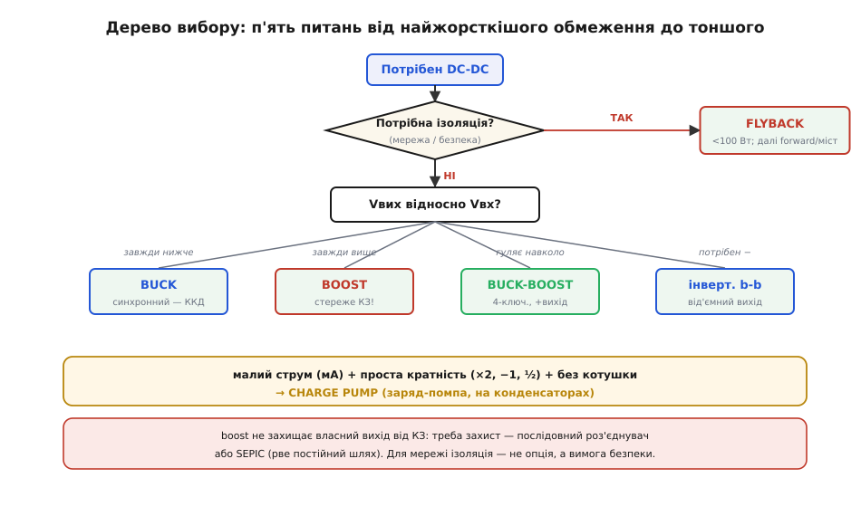
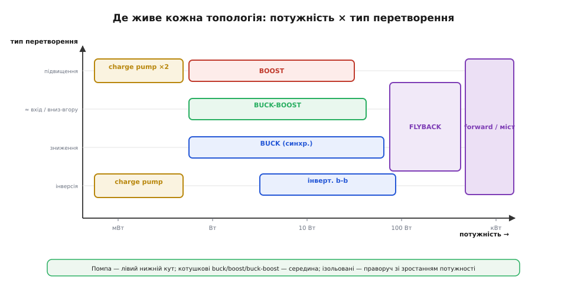
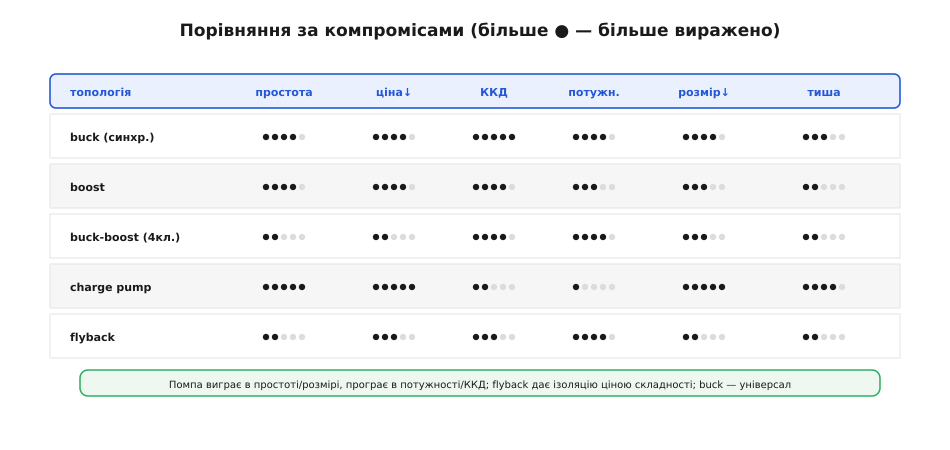
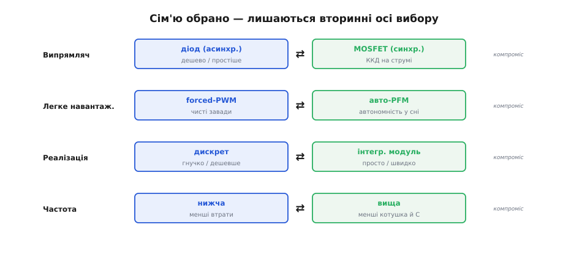
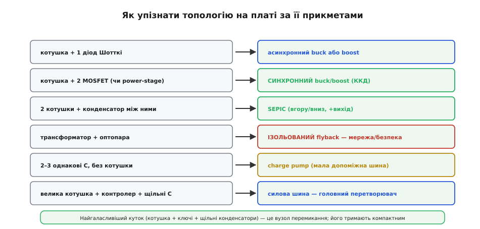
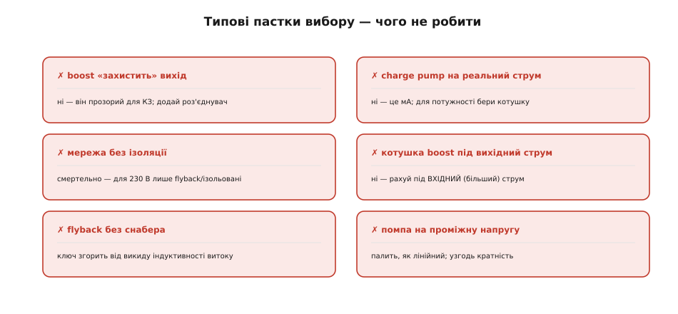

# Вибір топології живлення

Перетворювати постійну напругу можна кількома способами: [buck](root:hw-power/buck) знижує, [boost](root:hw-power/boost) підвищує, [buck-boost](root:hw-power/buck-boost) робить і те, і те (інвертувальний або 4-ключовий), [зарядна помпа](root:hw-power/charge-pump-conv) обходиться без котушки, а [flyback](root:hw-power/flyback-isolated) ще й розв'язує вхід із виходом. Кожен з них — окрема тема зі своєю фізикою. Але за робочим столом постає інше питання: **дано конкретне ТЗ — яку топологію брати?** Відповідь має приходити за секунди й упевнено, а не методом спроб. Ця тема — саме про це рішення: дерево питань, карта областей, таблиця типових випадків і перелік пасток. Швидко перетворювати вимоги на клас перетворювача — окремий інженерний навик, і його варто відточити так само, як уміння читати схему.

Одразу про межу. Точне проєктування вузла — номінали котушки й конденсаторів, вибір контролера, компенсація петлі — це велика робота поза цією темою. Тут лише **обираємо клас** перетворювача. Це перше й найважливіше рішення: помилка тут робить усі подальші розрахунки марними, бо рахуватимеш не ту схему.

### П'ять питань, що ведуть до рішення

Вибір зводиться до короткого ланцюжка питань, які ставлять **саме в цьому порядку** — від найжорсткіших обмежень до тонших. Жорстке обмеження одним махом викреслює цілі сім'ї топологій, тож із нього й починають.


*Дерево рішення. Перша розвилка — ізоляція: для живлення від мережі це не вибір, а вимога безпеки. Далі — напрямок: вихід завжди нижче, завжди вище чи гуляє навколо входу. Окрема гілка веде до зарядної помпи для малих струмів без котушки. Унизу — нагадування про захист: boost власний вихід не стереже.*

- **Питання 1 — ізоляція.** Чи треба електрично розв'язати вхід і вихід? Для всього, що живиться **від мережі** й до чого торкається людина, відповідь — так, і це не обговорюється: беремо flyback (до ~100 Вт) або його старших родичів (forward, міст) для більшої потужності. Якщо ізоляція не потрібна — рушаємо далі.
- **Питання 2 — напрямок.** Як вихід стоїть відносно входу? **Завжди нижче** — buck. **Завжди вище** — boost. **Гуляє навколо** (вхід то вищий, то нижчий за ціль — класична банка LiPo) — buck-boost: для додатного виходу 4-ключовий, для від'ємного — інвертувальний.
- **Питання 3 — малий струм без котушки.** Окрема гілка: якщо струм малий (міліампери), кратність проста (×2, −1, ½), а котушку ставити не хочеться — зарядна помпа.
- **Питання 4 — захист виходу.** Якщо обрано boost, варто пам'ятати: він **прозорий для короткого замикання** — від входу до виходу йде наскрізний діод, і КЗ на виході б'є просто у вхід. Потрібен захист виходу чи можливість його знеструмити — додають послідовний роз'єднувач або беруть SEPIC (англ. *single-ended primary-inductor converter* — «перетворювач з однотактною первинною котушкою»): дві котушки з конденсатором між ними рвуть постійний шлях і дають вихід вище й нижче входу.
- **Питання 5 — полярність і дрібниці.** Потрібен від'ємний вихід — інвертувальна гілка; потрібна гранична простота при дрібному струмі — помпа.

Порядок питань не випадковий. Ізоляція стоїть першою, бо це питання **безпеки**, а не оптимізації: якщо пристрій від мережі, жодні переваги buck за ККД не зроблять неізольовану схему придатною — вона просто небезпечна для життя. Лише прибравши жорсткі обмеження, переходять до тонших — напрямку, струму, ціни. Так дерево щоразу відсікає велику гілку варіантів, замість перебирати всі топології поспіль.

### Приклад вибору: від ТЗ до рішення

Метод найкраще видно в дії. Візьмемо два реальні ТЗ — саме такі трапляються щодня.

**Дрон на 4S.** Дрон живиться від чотирибаночного LiPo (12.0–16.8 В), і треба дві шини: **5 В / 3 А** для логіки та **12 В / 0.5 А** для підвісу камери.

```
шина 5 В:
  1) ізоляція?  ні (одна батарея, спільна земля)
  2) напрямок?  вхід 12-16.8 В завжди ВИЩЕ 5 В → завжди зниження → BUCK
  3) струм 3 А — помітний → синхронний buck (вищий ККД, менше тепла)
  → рішення: синхронний buck, forced-PWM (поряд радіо — потрібні чисті завади)

шина 12 В:
  1) ізоляція?  ні
  2) напрямок?  вхід гуляє НАВКОЛО 12 В (повна 16.8 — вище, сіла 12.0 — рівно/нижче)
                → перетинає ціль → BUCK-BOOST (4-ключовий, додатний вихід)
  → рішення: 4-ключовий buck-boost
     (або buck, якщо змиритися з провалом 12 В на сівшій батареї)
```

Уся тонкість — у другій шині. «12 В з 4S» виглядає як просте зниження, та коли батарея сідає до 12 В, вхід падає **до самої цілі** — і чистий buck уже не втримає 12 В на виході. Дерево ловить це на питанні 2: вхід **гуляє навколо** виходу, отже потрібен buck-boost. Помилка тут коштувала б мерехтіння підвісу під кінець польоту — саме тоді, коли заряд найдорожчий.

**Давач від монетної батарейки.** Бездротовий давач живиться від CR2032 (≈3.0 В, із розрядом сповзає до 2.6 В), а радіо хоче 3.3 В короткими сплесками по кілька міліампер. Тонкість тут у тому, що монетна батарея має [великий внутрішній опір](root:hw-power/battery-aging), тож на коротких сплесках струму її напруга помітно просідає.

```
  1) ізоляція?  ні
  2) напрямок?  вхід 2.6-3.0 В нижчий за 3.3 В → підвищення → BOOST
  3) струм малий, але СПЛЕСКАМИ — монетна батарея має великий внутрішній опір
  → рішення: boost із добрим вхідним конденсатором, що тримає сплески радіо,
     щоб батарея не просідала; помпа тут не годиться — радіо просить мА пачками
```

Два ТЗ — і за п'ять питань кожне дало рішення без жодного перебору варіантів. Саме цим дерево й економить час: воно не лишає простору вгадувати.

### Карта: де живе кожна топологія

Ті самі рішення зручно покласти на дві осі — **потужність** і **тип перетворення**. Кожна топологія тоді займає свою область, і вибір стає пошуком: у чию область потрапляє точка цього ТЗ.


*Кожна топологія має свою область. Зарядна помпа сидить у лівому нижньому куті — мала потужність, фіксовані кратності. Котушкові buck, boost і buck-boost займають широку середину. Ізольовані тягнуться праворуч: flyback на малій-середній потужності, а forward і мости — на великій. Підбираючи топологію, фактично шукаєш, у чию область падає твоя точка за потужністю й відношенням Vвих/Vвх.*

Карта відразу показує **межі**. Помпу не потягнеш у праву частину — там велика потужність, на яку вона не здатна. Boost сам по собі не зайде в зону ізоляції. А flyback не вартий заходу в лівий нижній кут, де вистачить копійчаної помпи. Знайдемо на карті типові шини: «5 В / 3 А з бортової мережі» сідає в зону buck посередині; «−5 В кілька мА» падає в лівий нижній кут помпи; «5 В із розетки» стрибає далеко праворуч, у смугу ізоляції до flyback. Що далі точка праворуч (більша потужність) і що ближче до смуги ізоляції — то дорожчим і складнішим стає рішення.

> 🔧 **Навіщо це.** Карта дисциплінує ще на етапі ТЗ. Добрий інженер не заганяє себе в правий верхній кут без потреби: чим скромніша вимога до потужності й чим далі від ізоляції, тим простіший, дешевший і прохолодніший перетворювач. Часом достатньо переписати ТЗ — знизити шину, рознести навантаження — і точка з'їжджає в дешеву область сама.

### Таблиця типових embedded-випадків

Найшвидший шлях — упізнати своє ТЗ серед типових. Більшість реальних задач — це варіації кількох рядків.

| Випадок | Vвх | Vвих | Брати | Чому |
|---|---|---|---|---|
| Логіка з шини 5 В | 5 В | 3.3 В | синхронний **buck** | малий перепад, помітний струм, ККД |
| 1 банка LiPo → логіка | 3.0–4.2 В | 3.3 В | 4-ключ. **buck-boost** | вхід перетинає ціль |
| 1 банка → USB | 3.0–4.2 В | 5 В | **boost** | завжди підвищення |
| Від'ємна шина для ОП (мА) | 3.3/5 В | −5 В | **charge pump** (інвертор) | малий струм, без котушки |
| Бортова мережа → сильний 5 В | 9–16 В | 5 В | синхронний **buck** | потужність, ККД, тепло |
| Мережа → 5 В (зарядка) | 230 В ~ | 5 В | **flyback** | ізоляція + велике зниження |
| Світлодіодна гірлянда | 5–12 В | десятки В | **boost** (драйвер) | підвищення, керування струмом |
| Широкий вхід, +вихід, захист КЗ | 5–15 В | 12 В | **SEPIC** | вгору-вниз + захист |
| Напруга програмування flash | 3.3 В | ~12 В (мА) | **charge pump** (Діксон) | малий струм, без котушки |

Якщо ТЗ схоже на котрийсь рядок — починають із тієї рекомендації, а тоді уточнюють дрібниці. Таблиця дає не остаточну відповідь, а **надійну відправну точку**, від якої думка вже не блукає з нуля.

### Порівняння за компромісами

Коли кілька топологій підходять за функцією, вибір вирішує **зв'язне обмеження** — те, чого найменше: місце, гроші, ват-години чи тиша (рівень завад).


*Грубе порівняння за шістьма осями. Помпа виграє в простоті й розмірі, але програє в потужності та ККД. Flyback дає ізоляцію ціною складності. Buck — універсальна робоча конячка з добрим балансом усюди. Дивитися варто на свою найвужчу вісь: якщо тисне розмір — це одне рішення, якщо ват-години — інше.*

Користуватися матрицею просто: знаходять свою **найвужчу** вісь і рухаються вздовж неї. Носимий пристрій — тиснуть розмір і ват-години, важать стовпці «розмір» і «ККД», і наперед виходять дрібний синхронний buck або помпа. Дешева масова іграшка — головне ціна й простота, тут асинхронний buck чи boost поза конкуренцією. Промислова шина від мережі — байдуже до розміру, головне надійна розв'язка, отже flyback попри всю складність. Матриця не каже «оце найкраще взагалі» — вона каже «оце найкраще під **твоє** обмеження». Тому перший крок завжди той самий: чесно назвати, чого найменше — місця, грошей, заряду чи тиші, — і вже тоді читати таблицю.

> 🧮 **Каскади з'їдають ККД.** Коли перетворювачі стоять ланцюгом ([buck](root:hw-power/buck) → [LDO](root:hw-power/ldo), кілька шин одна з одної), їхні ККД **множаться**, а не додаються: 0.92 × 0.66 = 61 %, і один добрий перетворювач легко б'є два посередні. Як рахувати ланцюг і де зникають відсотки — у вставці [🧮 ККД ланцюга перетворень](root:embedded/topology-map/math-efficiency-chain.md).

### Сім'ю обрано — лишаються вторинні осі

Вибір класу — лише перше рішення. Усередині кожної сім'ї лишаються **вторинні** осі, кожна зі своїм компромісом.


*Після вибору класу лишаються чотири осі. Випрямляч — діод (дешево) чи MOSFET (синхронний, ККД). Легке навантаження — forced-PWM (чисті завади) чи авто-PFM (автономність у сні). Реалізація — дискрет (гнучко, дешевше) чи інтегрований модуль (просто, швидко). Частота — нижча (менші втрати) чи вища (менші котушка й конденсатори).*

> 🔧 **Навіщо це.** Ці вторинні рішення часто важать не менше за вибір класу. Той самий buck можна зробити дешевим асинхронним для іграшки або синхронним із PFM для пристрою, що місяцями живе на батарейці. Тож, обравши «buck», не зупиняються: проходять і ці осі під своє ТЗ — інакше правильний клас дасть неправильний пристрій.

### Упізнати топологію на чужій платі

Зворотний навик не менш корисний: подивитися на готову плату й **прочитати**, що за перетворювач там стоїть.


*Прикмети читаються з вигляду. Котушка з одним діодом Шотткі — асинхронний buck або boost. Котушка з двома MOSFET (чи інтегрованим power-stage) — синхронний. Дві котушки з конденсатором між ними — SEPIC. Трансформатор з оптопарою — ізольований flyback (мережа, безпека). Лише два-три однакові конденсатори без котушки — зарядна помпа.*

> 🔧 **Навіщо це.** Цей навик економить години при ремонті, рев'ю чужої плати чи виборі готового модуля. Велика котушка біля контролера зі щільними конденсаторами — головна силова шина; трансформатор з оптопарою — небезпечна первинна сторона, до якої не лізуть під напругою. Прочитавши топологію, вже знаєш і її сильні місця, і слабкі. Бачиш дросель, поруч мікросхему й діод Шотткі, а вихід «гуляє» — це асинхронний buck, і діод Шотткі підказує, де шукати втрати й тепло. Помічаєш дві котушки з конденсатором між ними — це SEPIC, отже хтось навмисно хотів і вгору-вниз, і захист виходу. Топологія — як підпис інженера: вона розповідає, чого він боявся і що оптимізував.

### Типові пастки

Помилки вибору, що повторюються найчастіше, варто бачити разом — бо в них **спільний корінь**. Усі вони народжуються зі ставлення до перетворювача як до чорної скриньки, що «просто робить напругу». Щойно тримаєш у голові, **як** він її робить — boost має наскрізний діод до виходу, помпа возить заряд пакетами, flyback рве струм у котушці й тому потребує снабера (англ. *snubber*, від *to snub* «приборкати» — гасильна ланка з резистора й конденсатора чи діода, що поглинає викид напруги від індуктивності розсіювання й не дає йому пробити ключ), котушка boost несе більший вхідний струм, — кожна пастка стає очевидною ще до того, як припаяно першу деталь.


*Шість найчастіших пасток. Покладатися на boost у захисті виходу — він прозорий для КЗ. Тягнути помпою реальний струм — це лише міліампери. Живити пристрій від мережі без ізоляції — смертельно. Рахувати котушку boost під вихідний струм замість більшого вхідного. Ставити flyback без снабера — ключ згорить від викиду. Гнати помпу на проміжну напругу — палить, як лінійний.*

Тому ці шість помилок — не дрібні недогляди, а наслідок пропущеного розуміння механізму. І саме розуміння того, **як** перетворювач працює, відмежовує впевнений вибір від угадування.

### Підсумок

Вибір топології — не вгадування, а короткий ланцюжок питань: спершу **ізоляція** (для мережі обов'язкова, тоді flyback), тоді **напрямок** (вниз — buck, вгору — boost, гуляє — buck-boost), тоді особливі випадки (малий струм без котушки — помпа; потрібен захист виходу — роз'єднувач або SEPIC). Карта «потужність × перетворення» показує область кожної топології, таблиця типових випадків дає готову відправну точку, а компроміси (ціна, розмір, ККД, тиша) і вторинні осі (синхронність, PFM, інтеграція, частота) уточнюють рішення. Не менш корисно — упізнавати топологію на платі за прикметами та обходити шість типових пасток. У підсумку маєш не лише картину того, **як** працює кожен перетворювач, а й чіткий метод, **який** із них брати під конкретну задачу. Коли клас обрано, лишається довести вузол до робочого стану: спроєктувати його під ТЗ і виміряти, що він справді тримає напругу, ККД і пульсації.
