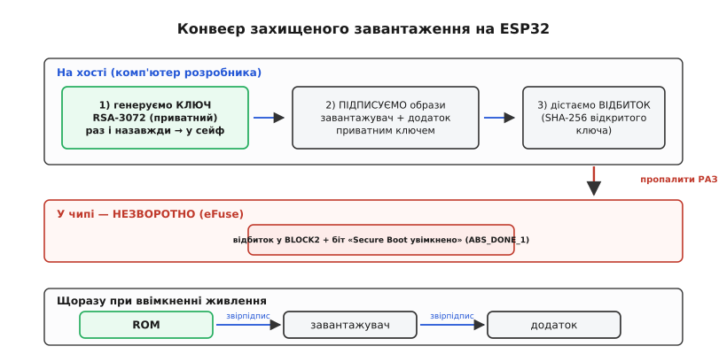
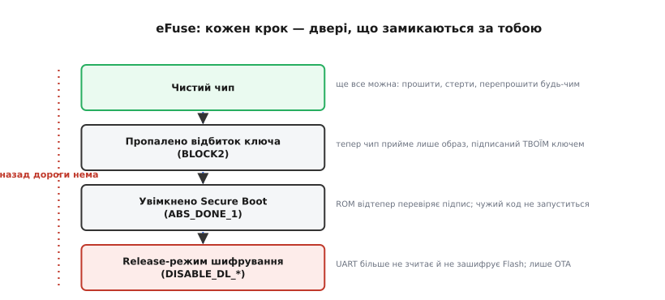

# ⚙️ Захищене завантаження на ESP32 від нуля: ключ, підпис, eFuse

> У темі ми дійшли до головної думки: корінь довіри мусить жити в **залізі**, бо код завжди можна переписати. На ESP32 цей корінь — незмінний boot ROM плюс пропалені в eFuse біти. Тепер перетворімо думку на **руки**: справжню послідовність команд, якою ви вмикаєте захищене завантаження на чипі, що лежить на столі. Згенеруємо ключ, підпишемо образ, пропалимо відбиток у eFuse, увімкнемо прапорець — і простежимо, як ROM звіряє весь ланцюг від першого байта до додатка. Наприкінці — поєднання з шифруванням Flash і чесний перелік того, на чому люди роблять із чипа цеглину. Жодного псевдокоду: усе, що тут написано, ви справді наберете в терміналі.

## Задача

Маємо ESP32 і прошивку в ESP-IDF. Зараз чип завантажує **будь-що**, що лежить у Flash: підмінив образ — він слухняно його запустив. Це нормально на столі, та неприйнятно у пристрої, який поїде в поле й потрапить комусь у руки. Треба зробити так, щоб чип **запускав лише наш код** — підписаний нашим ключем — і відмовлявся від чужого, навіть якщо нападник перепаяв Flash, залив свій образ і смикає всі лінії.

Сформулюймо чотири умови, які мусять виконатися **разом**:

- чип приймає **лише** образ, підписаний нашим приватним ключем, і відкидає будь-який інший;
- перевірку робить ланка, **яку не можна переписати**, — інакше нападник просто викине перевіряльник;
- увімкнений захист **не вимикається назад** — інакше зловмисник з фізичним доступом «розблокує» чип і обійде все;
- секрети в самому Flash (ключі, конфіг) не лежать відкритим текстом — інакше їх вичитають дампом мікросхеми.

Перші три умови закриває **захищене завантаження** (англ. *Secure Boot*), четверту — **шифрування Flash** (англ. *Flash Encryption*). У темі ми бачили, **чому** так має бути; тут — **як** це робиться на конкретному чипі.

> 🔧 **Що саме треба знати з теми.** Корінь довіри — незмінний boot ROM (його неможливо переписати) плюс **eFuse**: біти, які пропалюються рівно раз і назад у нуль не вертаються. Туди кладуть відбиток нашого відкритого ключа й прапорець «захист увімкнено». Маючи незмінний корінь, будують **ланцюг**: ROM звіряє підпис завантажувача, завантажувач — підпис додатка. Усе це розібрано в темі-власнику цієї вставки.

Перш ніж торкатися заліза, варто знати головну особливість ESP32, від якої залежить уся обережність далі.

## Ідея: один незворотний крок, але правильний

На багатьох платформах захист можна ввімкнути «на пробу» й вимкнути. На ESP32 — **ні**. Вмикання захищеного завантаження пропалює біти eFuse, а пропалений біт — це фізично перепалена перемичка: назад у нуль вона не повертається ніколи. Тож уся стратегія зводиться до одного: **зробити незворотний крок рівно раз і рівно правильно**.

Звідси випливає природний порядок дій, і кожен крок не випадковий — він відрізає шлях назад, тож робити їх треба в правильній черзі.

**По-перше, ключ.** Генеруємо пару ключів RSA: приватним підписуватимемо образи, відкритий лишиться у відбитку на чипі. Приватний ключ — **єдина** річ, яку не можна загубити: загубив його — і більше ніколи не підпишеш оновлення для цього чипа, бо інший ключ він не прийме.

**По-друге, підпис на хості.** Образи завантажувача й додатка підписуються приватним ключем **на комп'ютері розробника**, не на чипі. Чип лише **перевіряє** підпис — для цього йому потрібен не сам ключ, а тільки відбиток відкритого.

**По-третє, відбиток у чип.** У eFuse пропалюємо **SHA-256-відбиток** відкритого ключа (не сам ключ цілком — лише його хеш) і прапорець «Secure Boot увімкнено». Це той самий незворотний крок.

**По-четверте, перевірка ланцюга.** Тепер при кожному старті ROM рахує відбиток вкладеного у завантажувач відкритого ключа, звіряє з пропаленим, перевіряє підпис — і лише тоді віддає владу. Завантажувач так само звіряє додаток.


*Три поверхи за часом і місцем. На хості (раз) родиться приватний ключ, ним підписуються образи, з відкритого дістається відбиток. У чип незворотно пропалюється відбиток і прапорець — це єдиний крок, що ріже шлях назад. А далі щоразу при ввімкненні ROM звіряє підпис завантажувача, завантажувач — підпис додатка. Ключ живе на хості й у чип цілим не потрапляє ніколи.*

Тримаючи цю картину в голові, пройдімо кроки по черзі — з реальними командами.

## Крок 0: чи годиться ваш чип

Перш ніж щось пропалювати, переконаймося, що чип узагалі вміє Secure Boot v2. Це не дрібниця: **класичний ESP32 підтримує Secure Boot v2 лише з ревізії кремнію v3.0** (її ще звуть ECO3). На старіших ревізіях ESP32 був Secure Boot v1 з іншою, слабшою схемою; саме v1 свого часу зламали апаратною атакою на стороні, тож нову розробку ведуть на v2. *(Статус: усталено, за документацією Espressif; вимога ревізії v3.0 — у програмному посібнику ESP-IDF.)*

Перевіримо ревізію прямо з командного рядка — інструментом `esptool`, що спілкується із завантажувачем у ROM:

```
esptool.py --port /dev/ttyUSB0 chip_id
```

У відповіді шукаємо рядок `Chip is ESP32-D0WD-V3 (revision v3.0)` або вищу. Якщо ревізія нижча за v3.0 — Secure Boot v2 на цьому чипі недоступний, і команди нижче просто не дадуть очікуваного результату.

> 🔧 **Навіщо це.** Ця перевірка — не формальність. Опція Secure Boot v2 в налаштуваннях ESP-IDF з'являється лише після того, як ви виставите мінімальну ревізію чипа на v3.0 (`CONFIG_ESP32_REV_MIN`). Спроба ввімкнути v2 на старішому чипі або не покаже потрібних пунктів, або поведеться не так, як ви очікуєте. Дізнатися про несумісність **до** пропалювання, а не після, — різниця між «узяв інший чип» і «зробив цеглину».

Чип годиться — генеруємо ключ.

## Крок 1: генерація ключа RSA-3072

Secure Boot v2 на ESP32 підписує образи за схемою **RSA-PSS** на ключі **RSA-3072**. Розберімо обидві назви, бо вони не випадкові.

**RSA-3072** — це звичайний RSA з модулем завдовжки 3072 біти. Чому саме стільки, а не 2048? Запас на роки наперед: чип живе в полі довго, ключ змінити після пропалювання вже не вийде, тож беруть із гаком, щоб не виявитися зламним за десять років. **RSA-PSS** (англ. *Probabilistic Signature Scheme* — імовірнісна схема підпису) — це сучасний, стійкіший спосіб **формувати** підпис, ніж старий PKCS#1 v1.5: він підмішує в кожен підпис випадкову «сіль», тож два підписи того самого образу різні, і ціла родина атак на стару схему просто не працює. ESP32 використовує PSS із параметрами: хеш SHA-256, маскувальна функція MGF1, довжина солі 32 байти (це відповідає RFC 8017, розділ 8.1.1). *(Статус: усталено, за документацією Espressif і RFC 8017.)*

> 🔧 **Що таке цифровий підпис.** Підпис — це число, яке може порахувати лише власник **приватного** ключа, а перевірити — будь-хто з **відкритим**. Перевірка доводить дві речі: образ не змінено й він від власника ключа. На ESP32 приватним ключем підписують образ на хості, а чип перевіряє підпис відкритим — точніше, тим відкритим, чий відбиток пропалено в eFuse. Глибше про підпис образу прошивки — у статті про [підпис образу](root:sf-devices/ota-image-signing).

ESP-IDF дає зручну обгортку, яка генерує ключ потрібної схеми:

```
idf.py secure-generate-signing-key --version 2 secure_boot_signing_key.pem
```

Те саме можна зробити нижчим інструментом `espsecure.py` напряму — він дає більше контролю:

```
espsecure.py generate_signing_key --version 2 --scheme rsa3072 secure_boot_signing_key.pem
```

На виході — файл `secure_boot_signing_key.pem`: PEM-файл із **приватним** ключем RSA-3072. Це і є той єдиний секрет, від якого тепер залежить доля чипа.

> 🔧 **Навіщо це.** Цей файл — не «один із артефактів збірки», а **головний секрет проєкту**. Покладіть його туди, де лежать паролі від продакшну, а не в репозиторій поряд із кодом. Якщо він витече — нападник зможе підписувати образи, які ваш чип прийме за свої, і весь захист обнулиться. Якщо ви його **втратите** — не зможете випустити жодного оновлення для вже пропалених чипів, бо інший ключ вони відкинуть. У командах це означає одну дисципліну: ключ генерується раз, кладеться в надійне сховище (а краще — у апаратний модуль чи HSM), і резервна копія робиться **до** першого пропалювання, а не після.

Ключ є — підписуймо образи.

## Крок 2: підпис образів на хості

Тут ESP-IDF дає два шляхи, і вибір між ними — це насправді вибір **моделі довіри до власного комп'ютера**.

**Шлях перший, простий: збірка підписує сама.** У налаштуваннях (`idf.py menuconfig` → Security features) вмикаємо Secure Boot v2 і вказуємо шлях до приватного ключа. У файлі `sdkconfig` це виглядає так:

```
CONFIG_SECURE_BOOT=y
CONFIG_SECURE_BOOT_V2_ENABLED=y
CONFIG_SECURE_SIGNED_APPS_RSA_SCHEME=y
CONFIG_SECURE_BOOT_BUILD_SIGNED_BINARIES=y
CONFIG_SECURE_BOOT_SIGNING_KEY="secure_boot_signing_key.pem"
```

Після цього звичайна збірка одразу віддає **підписані** образи:

```
idf.py build
```

Завантажувач і додаток виходять уже з прикріпленим блоком підпису. Зручно, але є ціна: приватний ключ лежить на машині збірки, тож ви довіряєте підпис автоматиці. Для навчання й дрібних проєктів — добре; для серйозного продакшну ключ тримають окремо від збірки.

**Шлях другий, обережний: підпис окремо.** Вимикаємо автоматичне підписування (`CONFIG_SECURE_BOOT_BUILD_SIGNED_BINARIES=n`), збираємо **непідписані** образи, а тоді підписуємо їх руками — на іншій, захищеній машині, де живе ключ:

```
idf.py build
espsecure.py sign_data --version 2 --keyfile secure_boot_signing_key.pem \
    --output bootloader-signed.bin build/bootloader/bootloader.bin
espsecure.py sign_data --version 2 --keyfile secure_boot_signing_key.pem \
    --output app-signed.bin build/my_app.bin
```

Команда `sign_data --version 2` бере готовий образ, рахує над ним підпис RSA-PSS приватним ключем і дописує **блок підпису** в кінець. Цей блок містить сам підпис і відкритий ключ (його модуль, експоненту й допоміжні числа) — усе, що чипу потрібно, аби перевірити підпис, не маючи приватного ключа.

> 🔧 **Навіщо це.** Розділення «зібрав ↔ підписав» — це той самий принцип, що й у TrustZone з темою: код, який торкається секрету, тримають окремо й маленьким. Машина збірки тягне сторонні бібліотеки, оновлюється, до неї має доступ команда — будь-яка з цих дірок могла б злити ключ. Винісши підпис на окрему ланку, ви звужуєте місце, де секрет узагалі присутній. На столі під час навчання користуйтеся простим шляхом; коли проєкт іде в серію — згадайте, що другий шлях існує саме для цього.

Образи підписані. Тепер найвідповідальніше — пропалити чип.

## Крок 3: пропалювання відбитка ключа в eFuse

Чип перевіряє підпис не цілим відкритим ключем, а **відбитком** — SHA-256-хешем від нього. Цей відбиток і пропалюється в eFuse. На класичному ESP32 він лягає в блок **BLOCK2** (його ще позначають `BLK2`), і чип підтримує **рівно один** ключ — на відміну від ESP32-S2/S3, де можна пропалити до трьох ключів і відкликати скомпрометований. *(Статус: усталено, за документацією Espressif: класичний ESP32 v3.0 зберігає один блок підпису й один відбиток.)*

Пропалюємо відбиток інструментом `espefuse.py`. Зверніть увагу: на вхід команда бере **відкритий** ключ (а не приватний) — або PEM-файл відкритого ключа, або приватний, з якого вона сама дістане відкритий:

```
espefuse.py --port /dev/ttyUSB0 burn_key_digest secure_boot_signing_key.pem
```

Команда розбере ключ, порахує SHA-256-відбиток і запропонує пропалити його в BLOCK2. Вона **навмисно незручна**: вимагає підтвердження — набрати велике `BURN`. Це остання межа перед незворотним кроком.

> 🔧 **Чому не назвою блока.** Не пропалюйте відбиток через загальну команду з іменем `BLOCK2` напряму — лише через `burn_key_digest`. Причина практична: при ручному записі в блок порядок байтів вийде інший, ніж очікує ROM, і захист буде або непробивний у поганому сенсі (чип не прийме навіть ваш образ), або зі знятим захистом читання. `burn_key_digest` сам кладе відбиток у правильному порядку й виставляє правильні біти захисту: відбиток лишається **читабельним**, але **захищеним від запису**. Читабельний навмисно — щоб ROM міг його прочитати й порівняти; захищений від запису — щоб ніхто не підмінив його іншим.


*Кожен крок незворотний і відрізає шлях назад. Чистий чип приймає будь-що. Пропалили відбиток — чип хоче лише ваш підпис. Увімкнули прапорець — ROM почав перевіряти. Перевели шифрування в release — UART більше не зчитає Flash. Праворуч від кожного кроку — що він фактично замикає. Помилка на будь-якій сходинці лишається на чипі назавжди.*

Відбиток на місці. Лишилося ввімкнути сам захист.

## Крок 4: увімкнути прапорець Secure Boot

Поки пропалений лише відбиток, ROM його ще не **використовує** — для цього є окремий біт `ABS_DONE_1` («Secure Boot увімкнено»). Розділення навмисне: спершу ви кладете на чип відбиток правильного ключа й переконуєтеся, що все зійшлося, і лише потім — окремою дією — наказуєте ROM відтепер перевіряти підпис.

Найбезпечніший і рекомендований спосіб увімкнути цей біт — **не** пропалювати його руками, а дати це зробити **самому завантажувачу при першому старті**. Коли образи зібрані з увімкненим Secure Boot v2, перший підписаний завантажувач, запустившись, сам допалює потрібні біти. Тому на практиці крок 4 — це не окрема команда, а просто **прошивання підписаних образів**:

```
idf.py -p /dev/ttyUSB0 flash monitor
```

При першому завантаженні підписаний завантажувач перевірить себе, допалить `ABS_DONE_1` — і відтепер захист працює. У `monitor` ви побачите рядки про ввімкнення Secure Boot. Чому так краще, ніж пропалювати біт руками: завантажувач увімкне захист **лише** якщо вже лежать правильно підписані образи, тож ви не опинитеся в стані «захист увімкнено, а валідного образу нема» — класична дорога до цеглини.

> 🔧 **Навіщо це.** Порядок «спершу образи, потім захист» — це страховка від найдурнішої й найболючішої помилки: увімкнути перевірку підпису, коли у Flash ще немає чим її пройти. Якщо ввімкнути `ABS_DONE_1` на чипі з непідписаним або не тим завантажувачем, ROM при наступному старті не знайде валідного підпису — і відмовиться завантажуватися взагалі. А оскільки крок незворотний, перепрошити нормально вже не вийде. Довіривши вмикання завантажувачу, ви прив'язуєте незворотний крок до умови «валідний образ уже на місці», і ця прив'язка рятує чип.

Захист увімкнено. Простежмо, що тепер відбувається при кожному старті.

## Крок 5: як ROM звіряє ланцюг при кожному старті

Тепер кожне ввімкнення живлення проходить ту саму перевірку — і це рівно той **ланцюг довіри**, який ми будували в темі, лише в конкретних кроках ESP32:

```
1. ROM читає біт Secure Boot у eFuse → увімкнено.
2. ROM бере відкритий ключ із блока підпису завантажувача,
   рахує його SHA-256-відбиток, звіряє з пропаленим у BLOCK2.
   ✗ не збігся — стоп, далі не йдемо.
3. ROM перевіряє RSA-PSS-підпис завантажувача цим ключем.
   ✗ не збігся — стоп.
4. ROM передає владу завантажувачу.
5. Завантажувач так само перевіряє підпис ДОДАТКА.
   ✗ не збігся — стоп (або, якщо є OTA, відкат на інший образ).
6. Завантажувач передає владу додатку.
```

Зверніть увагу на крок 2: чип спершу перевіряє, що **відкритий ключ у образі — той самий**, чий відбиток пропалено, і лише тоді довіряє підпису. Без цього нападник просто доклав би до образу **свій** відкритий ключ і свій підпис — усе б «зійшлося» само з собою. Прив'язка до пропаленого відбитка розриває цей трюк: чужий ключ дасть інший відбиток, і перевірка впаде вже на кроці 2.

> 🔧 **Навіщо це.** Це той самий механізм «корінь у кремнії перевіряє наступну ланку», тільки тепер ви бачите, **де** він фізично. Крок 1 спирається на незмінний boot ROM (його не переписати), крок 2 — на пропалений відбиток (його не підмінити). Усе інше — підписи в образах, які можна перевірити, бо є непорушна точка опори. Підмінив нападник завантажувач — упаде крок 3; підмінив додаток — упаде крок 5; доклав свій ключ — упаде крок 2. Жодна підміна не проходить, бо кожна впирається в незмінний корінь.

Підпис захищає від **запуску** чужого коду. Та сам наш код у Flash досі лежить відкритим текстом — його можна вичитати. Закриймо й це.

## Крок 6: поєднання з шифруванням Flash

Захищене завантаження й шифрування Flash вирішують **різні** задачі, і саме тому їх вмикають разом. Підпис не дає чужому коду **запуститися**. Шифрування не дає **прочитати** те, що у Flash: дамп мікросхеми дасть нападнику лише шум.

Тут важлива технічна деталь, на якій люди спотикаються, переносячи знання з новіших чипів. **Класичний ESP32 шифрує Flash не так, як ESP32-S2/S3.** На S2/S3 застосовано стандартний AES-256-XTS — режим, спеціально створений для шифрування носіїв. А класичний ESP32 використовує **AES-256 у власному «підкрученому» режимі**: ключ для кожного 32-байтового блоку **виводиться** з головного ключа, домішуючи до нього зміщення блока у Flash (так звана «правка ключа», англ. *key tweak*). Мета та сама — однаковий відкритий текст у різних місцях Flash дає різний шифротекст, — але механізм інший. *(Статус: усталено, за документацією Espressif; не плутати з XTS на S2/S3.)*

Ключ шифрування — це 256 біт у блоці eFuse `flash_encryption` (на класичному ESP32 це BLOCK1). Його, як і відбиток підпису, можна або згенерувати на хості й пропалити, або довірити генерацію самому чипу.

**Хостовий шлях** — згенерувати ключ і пропалити вручну:

```
idf.py secure-generate-flash-encryption-key flash_encryption_key.bin
idf.py -p /dev/ttyUSB0 efuse-burn-key flash_encryption flash_encryption_key.bin
```

**Чиповий шлях** (типовий) — завантажувач при першому старті сам згенерує випадковий ключ генератором випадкових чисел і запише його в eFuse. Цей шлях надійніший проти витоку ключа, бо ключ **узагалі ніколи не залишає чип**: ні ви, ні хтось інший його не бачить.

Тепер — найважливіша відмінність двох режимів шифрування, у якій уся різниця між «зручно налагоджувати» і «готово в серію».

**Режим розробки** (англ. *Development*) лишає лазівку: можна ще кілька разів перепрошити Flash через UART відкритим текстом — завантажувач його зашифрує на льоту. Лічильник `FLASH_CRYPT_CNT` лишається незахищеним, тож стан шифрування ще можна перемикати обмежену кількість разів. Зручно, доки ви налагоджуєте.

**Режим випуску** (англ. *Release*) лазівку замуровує. Завантажувач допалює біти `DISABLE_DL_ENCRYPT`, `DISABLE_DL_DECRYPT`, `DISABLE_DL_CACHE` і захищає від запису лічильник `FLASH_CRYPT_CNT`. Після цього **UART-завантажувач більше не вміє шифрувати чи дешифрувати Flash**: залити новий відкритий образ через кабель уже не можна — лише через OTA, бо там образ приходить уже в потрібному вигляді. У `sdkconfig` режим обирається так:

```
CONFIG_SECURE_FLASH_ENC_ENABLED=y
CONFIG_SECURE_FLASH_ENCRYPTION_MODE_RELEASE=y
```

(для налагодження замість останнього рядка ставлять `CONFIG_SECURE_FLASH_ENCRYPTION_MODE_DEVELOPMENT=y`).

> 🔧 **Навіщо це.** Різниця режимів — пряма відповідь на питання «чи я ще налагоджую, чи вже віддаю пристрій людям». Поки розробляєте — режим розробки дає перепрошити чип кабелем, і це рятує години. Але **продакшн-пристрій мусить піти в режимі випуску**, інакше нападник з кабелем перепише вам Flash відкритим текстом і весь сенс шифрування зникне. Поширена й болюча помилка — забути перемкнути режим перед серією: пристрої їдуть у поле з відчиненими дверима. Тому перемикання на release роблять частиною випускового списку, а не «колись потім».

Окрема тонкість при поєднанні захищеного завантаження й шифрування — **захист ключів на читання різний**. Відбиток підпису лишається читабельним (бо ROM мусить його читати для звірки), а ключ шифрування Flash, навпаки, **захищають від читання** — щоб його не вичитали й не розшифрували Flash деінде. Ці дві вимоги не конфліктують, бо лежать у різних блоках eFuse з різними правами; інструменти ESP-IDF виставлять їх правильно самі, якщо ви не лізете в блоки руками.

> 🔧 **Навіщо це разом.** Підпис без шифрування — двері на замку, але стіни скляні: код не запустиш чужий, зате весь наш видно дампом, і секрети в ньому — теж. Шифрування без підпису — стіни глухі, але двері навстіж: прочитати не можна, проте запустити чужий образ — будь ласка. Лише разом вони дають замкнену скриньку: і не запустиш чужого, і не прочитаєш свого. Тому виробник і радить вмикати їх **парою** для продакшну. Менший пристрій без зовнішнього TPM саме цією парою й будує свій корінь довіри — рівно те, про що йшлося наприкінці теми.

Залишається одна практична дрібниця, що ламає збірку на рівному місці.

## Маленька пастка збірки: образ підріс

Увімкнення захищеного завантаження й шифрування **збільшує завантажувач** — у ньому з'являється код перевірки підпису й роботи з ключами. Якщо ваша таблиця розділів (англ. *partition table*) припускала старий, менший завантажувач, новий може **не влізти** у відведене місце й налізти на наступний розділ. Збірка або прошивання тоді впадуть із помилкою про перекриття розділів.

Лікується це зсувом — даємо завантажувачу більше місця, відсунувши таблицю розділів далі у Flash (опція `CONFIG_PARTITION_TABLE_OFFSET`, типово зсувають з `0x8000` на `0x10000`). Дрібниця, але якщо про неї не знати, перший же білд із Secure Boot валиться незрозумілою помилкою. *(Статус: усталено, типова примітка в документації ESP-IDF.)*

## Складність і пастки

Тепер головне — те, заради чого варто було проходити все по кроках. Захищене завантаження на ESP32 неважке **технічно**: команд небагато. Воно небезпечне **незворотністю**. Кожна пастка нижче — це чийсь перетворений на цеглину чип.

**Втрата приватного ключа = кінець оновлень.** Це найважче й найчастіше. Пропалили відбиток, увімкнули захист — і загубили `secure_boot_signing_key.pem` (диск помер, машину переставили, файл лежав лише в одному місці). Усе: цей чип більше **ніколи** не прийме оновлення, бо інший ключ він відкине, а пропалений відбиток не змінити. Пристрій працюватиме з тим, що в ньому є, до самої смерті — без жодного патча. Лік один і простий: резервна копія ключа в надійному сховищі **до** першого пропалювання.

**Увімкнути захист раніше за валідний образ = миттєва цеглина.** Пропалили `ABS_DONE_1` на чипі, де ще немає правильно підписаного завантажувача, — і наступний старт уже не пройде перевірку, а перепрошити нормально не можна. Саме тому вмикання довіряють завантажувачу при першому старті (крок 4): він увімкне захист **лише** маючи валідний образ. Не пропалюйте `ABS_DONE_1` руками наперед.

**Забути режим випуску для шифрування = відчинені двері.** Пристрій із шифруванням у режимі розробки їде в поле — і нападник з кабелем перепрошиває йому Flash відкритим текстом, обходячи весь захист. Перемикання на release — обов'язковий пункт випускового списку, не «потім».

**Тренуватися на бойовому чипі.** Спокуса пропалити одразу «той самий» чип, що поїде в пристрій, велика — а помилки незворотні. Відпрацюйте всю послідовність на **окремому** чипі чи дешевій платі, яку не шкода зробити цеглиною. Кілька зіпсованих копійчаних модулів під час навчання дешевші за один зіпсований пристрій із поля.

**Лізти в блоки eFuse руками.** Пропалювання «сирою» командою з іменем блока замість `burn_key_digest`/`burn_key` дає неправильний порядок байтів і неправильні біти захисту. Користуйтеся **спеціальними** командами під кожен ключ — вони знають, як і що виставити.

**Залишити відкритий UART-завантажувач у продакшні.** Навіть із Secure Boot чужий код не запуститься, але відкритий UART-завантажувач дає нападнику читати eFuse та інші лазівки. Для серії його режим завантаження теж варто прикрити — це окрема настройка, але та сама логіка: у полі зайвих відчинених дверей не лишають.

> 🔧 **Навіщо це наприкінці.** Зведімо все до однієї думки, з якою варто йти від цієї вставки. Захищене завантаження на ESP32 — це не складний код, а **дисципліна незворотності**. Команд небагато, і кожна проста; небезпечне те, що жодну з них не можна «відмінити». Тому вся майстерність тут не в знанні прапорців, а в порядку дій і резервних копіях: зберегти ключ **до** пропалювання, увімкнути захист **після** валідного образу, перемкнути режим **перед** серією, потренуватися на **чужому** чипі. Хто тримає в голові цю чотирку, той будує справжній корінь довіри в кремнії; хто ні — робить дорогі цеглини. Сам же принцип, заради якого все це затівалося, лишається той самий, що й у темі: довіра мусить спиратися на залізо, бо код завжди можна переписати.
