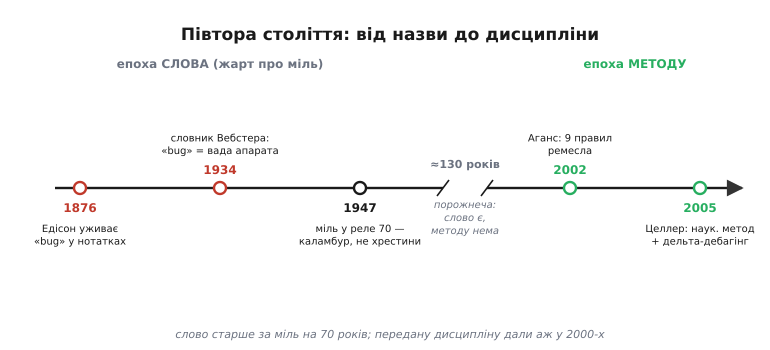

# 📜 Від міллю в реле до дисципліни: як відлагодження стало наукою

Майже кожен інженер знає історію про міль. Дев'ятого вересня 1947-го з релейної машини витягли мертвого метелика, приклеїли скотчем у журнал — і відтоді, мовляв, помилки в машинах звуться «баг» (англ. *bug* — комаха, жучок). Гарна легенда, і майже все в ній переказано криво. Міль не породила слово «баг» — слово було старше за неї на сімдесят років. Ґрейс Гоппер, чиїм ім'ям цю історію підписують, метелика **не знаходила** й у журнал **не вписувала**. А найголовніше: сам випадок із міллю — не про народження терміна, а про **жарт**, і справжня історія тут не в тому, звідки взялося слово, а в тому, як від цього жарту людство за півстоліття дійшло до **методу** — до того самого наукового пошуку несправності, що тримає цей крок курсу. Розберімо все по черзі: що там сталося насправді, чому слово старше за міль, і хто перетворив кпин на дисципліну.

## Що там сталося насправді: міль, реле 70 і слово «actual»

Спершу — факти, без прикрас. Того дня в Гарварді працювала машина **Mark II** (повна назва — Aiken Relay Calculator, релейний калькулятор Ейкена): не електронна, а **релейна**, тобто рахунок вели тисячі електромеханічних перемикачів, кожен із яких фізично клацав контактами. О **15:45** оператори натрапили на збій і почали шукати винуватця. У **панелі F**, між контактами **реле № 70**, застряг метелик: контакт, зачиняючись, розчавив його, і комаха тримала коло розімкненим. Міль витягли пінцетом, приклеїли скотчем просто на сторінку лабораторного журналу й підписали рукою:

```
First actual case of bug being found.
(Перший дійсний випадок виявлення «бага».)
```

Той журнал зі справжнім метеликом на сторінці нині лежить у Смітсонівському музеї (National Museum of American History у Вашингтоні). Це справжня річ, не легенда — сторінку можна побачити.

А тепер — чесне розведення заслуг, бо саме тут переказ найчастіше бреше. **Ґрейс Гоппер** (англ. Grace Hopper, 1906–1992) — видатна американська програмістка, тоді офіцерка резерву флоту, — **була в команді Mark II**, але метелика витягла не вона й запис зробила не вона. Це зробив хтось із техніків нічної зміни; почерк у журналі, за оцінкою самого музею, **найпевніше не Гопперин**. Чому ж історія причепилася до її імені? Бо Гоппер **розповідала її пів життя** — на конференціях, у телестудіях, адміралам — розповідала так смачно й доречно, що ім'я оповідачки зрослося з подією. Тут корисно розрізняти те, що в техніці плутають повсякчас: **зробити** щось і **прославити** щось — різні заслуги. Гоппер не знайшла того багу, але зробила його знаменитим; і саме друге, а не перше, закарбувало випадок у пам'ять цеху.

> Статус доказовості: **усталено**. Дата, машина (Mark II / Aiken Relay Calculator), панель F, реле № 70, час 15:45, точний текст запису та місце зберігання (Смітсонівський музей) підтверджені кількома незалежними джерелами, зокрема каталогом самого музею. Те, що почерк «найпевніше не Гопперин» і що метелика знайшла й вписала не вона, — теж позиція музею та збіжних історичних розборів; сама Гоппер у пізніших розповідях **не** приписувала собі знахідку. Ім'я техніка, який приклеїв міль, надійно не задокументоване — тож називати конкретну людину було б домислом.

Але справжня сіль цієї сторінки — не метелик, а одне-єдине слово в підписі: **actual** («дійсний», «справжній»). Запис каже не «перший баг», а «перший **дійсний** випадок, коли баг виявився комахою». Жарт працює лише тому, що слово «bug» ті інженери **вже вживали** — і то давно, і зовсім не про комах. Ось де легенда розсипається остаточно, і починається справжня історія слова.

## Слово було старше за міль: Едісон і «маленькі вади»

Якщо міль 1947-го не породила «баг», то звідки він узявся? Слід веде на сімдесят років назад, до **Томаса Едісона** (англ. Thomas Edison, 1847–1931) — і ще глибше в саму мову.

Едісон уживав «bug» у робочих нотатках уже **в липні 1876-го**, б'ючись над мультиплексним телеграфом. У **серпні 1873-го** він подав патентний застереж (англ. *caveat*), де описав «**bug trap**» — «пастку на жучків» у своїй системі квадруплексного телеграфу: пристрій, що ловив паразитні збої лінії. А в двох листах **1878 року** він виклав саме те значення, яке й дожило до нас. У березні — президентові Western Union Вільяму Ортону: «Ви частково мали рацію, я таки знайшов *bug* у своєму апараті, але не в самому телефоні». І в листопаді — Теодорові Пушкашу, докладніше й майже афористично:

```
«Bugs» — так звуться ці маленькі вади й труднощі —
дають про себе знати, і потрібні місяці пильного
спостереження, вивчення й праці, перш ніж
дійдеш до успіху чи певної невдачі.
```

Прочитайте цей рядок уважно — і побачите, що Едісон описує рівно те, чим ми займаємося весь цей крок курсу: **маленька схована вада, яку доводиться довго вистежувати**. Півтора століття тому, ще до всякої електроніки, інженер уже назвав ворога тим самим словом і вже знав головне про нього — що він дрібний, упертий і потребує терплячого полювання.

Чи означає це, що «баг» **вигадав** Едісон? Ні — і тут теж треба бути точним. Слово в такому переносному сенсі вже носилося серед телеграфістів і механіків; корені його ще давніші — середньоанглійське *bugge* («страховисько», звідки й *bugbear*, і *bugaboo*), споріднене з валлійським *bwg*. Едісон не викарбував слово з нічого — він **уживав наявний жаргон** і своєю славою рознiс його: уже до кінця 1880-х телеграфні підручники згадували Едісонову «bug trap» як звичний термін. А ще за пів століття до міллю, у **1934-му**, солідний словник Вебстера вже спокійно тлумачив «bug» як «**ваду в апараті**». Тобто на момент, коли метелик застряг у реле 70, слово «баг» було не новинкою, а **побутовим інженерним терміном із багаторічним стажем**.

> Статус доказовості: **усталено** щодо самих фактів — нотатка 1876-го, застереж 1873-го з «bug trap», листи 1878-го до Ортона й Пушкаша з наведеним значенням, словникова стаття Вебстера 1934-го. **Спірне** лише слово «coined» («вигадав»), яке подеколи чіпляють до Едісона: надійні джерела показують, що він **популяризував наявний жаргон**, а не створив термін; давніші корені (*bugge*, *bwg*) документовані окремо. Тож чесне формулювання — «Едісон рознiс і закріпив у техніці старе слово», а не «винайшов його».

Тепер зрозуміло, чому підпис під міллю такий дотепний. Ті інженери роками казали «баг» про невидимі, переносні вади — про «жучків» у метафоричному сенсі. І раптом попався **буквальний** баг: справжня комаха, що справді зіпсувала машину. Ось чому запис — «перший **дійсний** випадок». Це не проголошення нового терміна, а **каламбур на старому**: уперше метафоричний «жучок» виявився жучком із крильцями. Легенда перевернула жарт із ніг на голову, зробивши з кпину «момент народження слова». Слово вже жило; міль лише подарувала йому найзнаменитішу ілюстрацію.

## Прірва між словом і методом

І ось тут — найцікавіший поворот, заради якого варто було все це розбирати. Назвати ворога — ще не значить уміти його бити. До 1947-го (і ще довго потому) інженери мали **слово** для несправності, але не мали **методу** її шукати. «Відлагодження» (англ. *debugging* — «вибавляння від жучків»; саме дієслово «debug» зринає у друку теж рано, у 1945-му, в авіаційному журналі) лишалося **мистецтвом**, а не наукою: хто здогадливіший, хто довше сидить, у того й виходить. Кожен полював по-своєму, ділився хіба усними побрехеньками про хитрі випадки, і жодного зводу правил, жодної передаваної дисципліни не існувало. Знання жило в головах майстрів і вмирало разом із їхнім досвідом.

Це дивно тільки на перший погляд. Насправді так буває майже завжди: **практика випереджає теорію на десятиліття**. Люди будували мости, не знаючи опору матеріалів; плавили сталь, не знаючи металургії; і відлагоджували машини, не маючи теорії відлагодження. Робиш річ довго — назбируєш чуйку; але чуйка не передається, доки хтось не сяде й не **сформулює** її в правила, які можна вивчити, а не тільки вистраждати. Саме цього — переходу від чуйки до дисципліни — і бракувало пів століття після міллю.

Перелам стався пізно, вже у нашому столітті, і його зробили **дві книжки**, написані з двох різних кінців. Одна — рукою практика, що все життя лагодив залізо й код і вирішив нарешті записати, **як** він це робить. Друга — рукою науковця, що спитав: а чи не можна відлагодження поставити на той самий фундамент, що й усю решту науки, — на **науковий метод**? Разом вони й перетворили жарт про міль на ремесло, якому можна навчити. Розгляньмо обидві.

## Стовп перший — практик: Девід Аганс і дев'ять правил

У **2002 році** інженер **Девід Аганс** (англ. David J. Agans) видав тонку книжку з довгою назвою — *Debugging: The 9 Indispensable Rules for Finding Even the Most Elusive Software and Hardware Problems* («Відлагодження: дев'ять незамінних правил, щоб знайти навіть найневловніші проблеми в софті й залізі»). Аганс не був теоретиком; він десятиліттями лагодив реальні системи — і ключове слово в назві **hardware**: правила писалися не лише про код, а й про залізо, ту саму суміш, що й у нашому курсі. Він зробив просту, але рідкісну річ: сів і **виклав явно** те, що добрі відлагоджувачі роблять чуттям, не вміючи пояснити. Дев'ять правил, кожне — коротке гасло, яке легко тримати в голові посеред полювання:

```
1. Understand the system      — Зрозумій систему
2. Make it fail               — Домогися, щоб падало
3. Quit thinking and look     — Годі думати — дивись
4. Divide and conquer         — Ділити навпіл
5. Change one thing at a time — Міняй одне за раз
6. Keep an audit trail        — Веди журнал
7. Check the plug             — Перевір очевидне («чи ввімкнено в розетку»)
8. Get a fresh view           — Глянь свіжим оком
9. If you didn't fix it,      — Якщо не полагодив —
   it ain't fixed                воно не полагоджене
```

Три перші правила — серце всього, і не випадково саме на них спирається цей крок курсу. **«Зрозумій систему»** стоїть першим, бо шукати ваду в тому, чого не розумієш, — марно: ти не відрізниш хибну поведінку від правильної, якщо не знаєш, якою правильна має бути. Спершу — як воно **мусить** працювати; тоді видно, де воно **відхилилось**. **«Домогися, щоб падало»** — те саме приборкання плавучого багу, з якого ми починаємо будь-яке полювання: доки збій не відтворюється **щоразу**, кожен дослід — ворожіння, а не дослід. І, нарешті, найгостріше й найвлучніше — **«Годі думати — дивись»**: не вигадуй теорій про причину, а піди й **побач** справжній збій на найнижчому рівні. Аганс б'є тут у головну ваду інженерів — схильність **гадати** замість **дивитися**: полагодиш свій здогад, а не справжню проблему, і за тиждень баг вернеться. Решта шість правил — про те саме, тільки з інших боків: ділити простір навпіл, міняти по одному, записувати, не зневажати очевидного, кликати свіже око й не оголошувати перемогу, доки не **довів**, що причина справді усунена.

> Статус доказовості: **усталено**. Рік видання (2002), автор (David J. Agans), повна назва та точний перелік і формулювання дев'яти правил підтверджені за виданням і незалежними оглядами. Українські відповідники в дужках — робочий переклад гасел, самі англійські формулювання наведені як в оригіналі.

Внесок Аганса — не в тому, що він відкрив щось незнане. Досвідчені майстри й до нього ділили навпіл і міняли по одному. Внесок у тому, що він **зробив мовчазне знання переданим**: перетворив «чуйку, яку наживаєш роками» на дев'ять речень, які новачок може прочитати за вечір і застосувати завтра. Це і є перший крок будь-якого ремесла до зрілості — коли майстерність нарешті вкладається в правила, яких можна **навчити**, а не тільки самому вистраждати.

## Стовп другий — науковець: Андреас Целлер і науковий метод

Аганс дав ремісничі правила. Але чи можна піти глибше — і показати, що відлагодження за самою своєю природою є **наука**, з тим самим апаратом, що фізика чи біологія? Це зробив **Андреас Целлер** (нім. Andreas Zeller) — професор програмної інженерії в **Саарландському університеті** (нім. Universität des Saarlandes, м. Саарбрюкен, Німеччина). У **2005 році** вийшла його книжка *Why Programs Fail: A Guide to Systematic Debugging* («Чому програми падають: посібник із систематичного відлагодження»), і вона поставила під ремесло теоретичний фундамент.

Головна теза Целлера — та сама, з якої починається цей крок курсу: **відлагодження треба вести за науковим методом**. Не осяянням, а циклом, яким наука здобуває будь-який закон природи. Спостерігай збій. Висуни **гіпотезу** про причину, узгоджену зі спостереженнями. Виведи з неї **передбачення** — «якщо причина саме така, то станеться ось те». Постав **дослід**, що це передбачення перевірить, — і то дослід, здатний гіпотезу **вбити**, а не лише полестити їй. Підтвердилось — крок до істини; спростувалось — гіпотезу геть, наступну. І, як усякий науковець, веди **журнал**: Целлер прямо радить записувати гіпотези й досліди, щоб відлагодження стало явним і відтворюваним, а не борсанням наосліп. Те, що Аганс подав як окремі правила («веди журнал», «домогися, щоб падало»), Целлер зшив в одну систему, показавши, що всі вони — грані єдиного наукового циклу.

Але Целлер відоміший навіть не книжкою, а винаходом, який зробив трохи раніше й який чудово вінчає всю цю історію, — **дельта-дебагінгом** (англ. *delta debugging*). Ще у **1999-му** він виступив із доповіддю, чия назва звучить як зойк кожного, хто щось налагоджував: «*Yesterday, my program worked. Today, it does not. Why?*» — «Учора моя програма працювала. Сьогодні ні. Чому?». І дав на це машинну відповідь. Уяви: між робочою вчорашньою версією й зламаною сьогоднішньою — сотні дрібних відмінностей (у коді, у вхідних даних), і одна з них — винуватець. Дельта-дебагінг **автоматично** знаходить цю відмінність, **діленням навпіл**: бере половину відмінностей, пробує — впало чи ні; за результатом відкидає половину й повторює. Це та сама бісекція, що тримає весь наш крок, тільки доручена алгоритмові, який жене її механічно, без утоми й здогадів, і вилущує з тисячі відмінностей одну фатальну за десяток кроків. Целлер довів цю ідею до строгого алгоритму (у працях 1999–2002 років, разом із Ральфом Гільдебрандтом) — і бісекція з ремісничого прийому стала формальним, доказовим методом.

> Статус доказовості: **усталено**. Автор (Andreas Zeller), його кафедра в Саарландському університеті, книжка *Why Programs Fail* (2005) з наголосом на науковому методі й журналі відлагодження, а також авторство дельта-дебагінгу з доповіддю 1999 року («Yesterday, my program worked…») та подальшою формалізацією разом із Р. Гільдебрандтом — підтверджені публікаціями кафедри й незалежними оглядами. Книжка здобула 2006 року галузеву відзнаку Jolt Productivity Award.

Ось де історія замикається на самому початку цього кроку. Коли ми казали, що «відлагодження — це не здогад, а наука», і що головний рух — «ділити навпіл», — ми переказували не власну примху, а зрілу дисципліну, до якої техніка йшла з часів міллю. Аганс дав правила, за якими діє майстер; Целлер показав, що ці правила — **грані наукового методу**, і навіть навчив машину виконувати одне з них замість людини.

## Що з цього забрати: від жарту до дисципліни

Складімо всю дугу в одну лінію, і вона розкаже головне краще за будь-який підсумок.


*Півтора століття від назви до дисципліни. Ліворуч — епоха слова: Едісон рознiс старий жаргон «bug» у техніку, до 1934-го значення «вада в апараті» вже в словнику, а міль 1947-го лише подарувала наявному слову найзнаменитішу ілюстрацію — це був каламбур («перший дійсний випадок»), а не народження терміна. Праворуч — епоха методу: аж на початку 2000-х Аганс виклав чуйку майстрів у дев'ять переданих правил, а Целлер поставив під них науковий фундамент і навчив машину ділити навпіл. Довга порожнеча посередині — ті десятиліття, коли слово вже було, а методу ще не було.*

Три речі варто винести з цієї історії, і кожна цінна сама по собі.

Перша — **чесність із фактами**. Найвідоміша легенда галузі майже вся перекручена: міль не породила слово, Гоппер його не вигадала й метелика не знаходила, а сам запис — жарт про старий термін, а не хрестини нового. Це добра щеплення проти того, як узагалі народжуються технічні міфи: справжню, трохи складнішу історію (слово старше за випадок; заслуга оповідачки — не заслуга винахідника) підмінюють зручною казкою про єдиний геніальний момент. Хто вміє бачити цю підміну в історії про міль, той обережніший і до інших «моментів народження».

Друга — **назвати ворога й уміти його бити — різні речі, розділені прірвою в пів століття**. Едісон дав слово 1876-го; передану дисципліну пошуку дали Аганс і Целлер аж за сто з гаком років. Стільки часу знадобилося, щоб мовчазна майстерність вклалася в правила, яких можна навчити. Це нагадує, що чуйка, хай яка коштовна, лишається безплідною для цеху, доки хтось не сформулює її явно.

Третя — і найпрактичніша — **той метод, яким ти щойно вчився шукати несправність, не з примусу взявся й не з чиєїсь примхи**. «Дій за науковим методом», «домогися, щоб падало», «годі думати — дивись», «ділити навпіл», «веди журнал», «міняй одне за раз» — це не набір випадкових порад, а вистраждана, перевірена десятиліттями дисципліна, зведена в правила Агансом і поставлена на науковий фундамент Целлером. Метелик у реле 70 дав нашому ремеслу ім'я. Аганс і Целлер дали йому зброю. І коли наступного разу пристрій зробить дурню, а ти замість гадати підеш ланцюгом назад, поставиш дослід і розколеш простір навпіл — ти повторюватимеш не власний винахід, а дозрілу науку, чий шлях від жарту з міллю до строгого методу щойно пройшов перед тобою.
