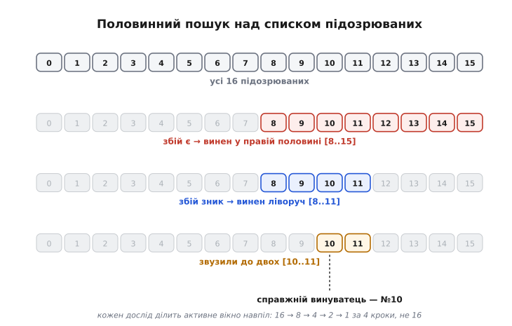
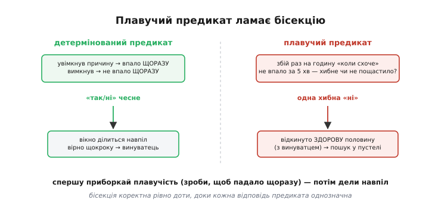
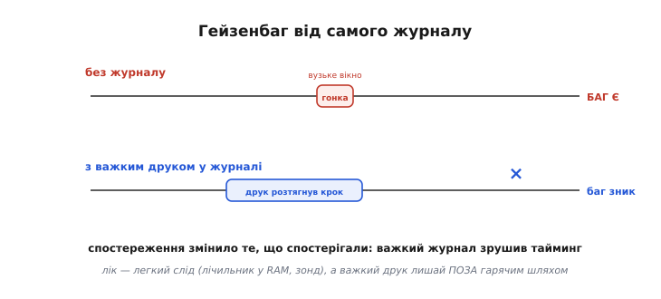

# ⚙️ Бісекція як робочий код прошивки

Гасло «діли навпіл» звучить самоочевидно, поки ти водиш щупом руками: тицьнув посередині тракту, глянув на число, обрав половину. Але тільки-но підозрювані — не п'ять фізичних точок на платі, а **двадцять гілок коду** чи **десяток вузлів периферії**, кожен з яких можна ввімкнути й вимкнути прапорцем, ручний розріз перетворюється на морочливе перемикання: закоментував блок, перезібрав, прошив, погнав дослід, розкоментував, знову перезібрав… За півдня такого й дисципліна вивітрюється, і починаєш угадувати — рівно те, від чого метод мав урятувати.

Тож зробімо бісекцію **кодом**. Не начерком на серветці, а модулем прошивки, який тримає список підозрюваних, сам вмикає рівно потрібну їх половину, питає в тебе (чи в автоматичного предиката) «відтворилось?» — і за log₂(N) кроків тицяє пальцем у винуватця. Той самий модуль несе **журнал дослідів**: гіпотеза → дослід → результат, записаний машиною, а не пам'яттю, і лишений у прошивці **назавжди** під прапорцем компіляції — щоб наступного разу, коли баг вигулькне в полі, каркас пошуку вже стояв напоготові, а не збирався заново в паніці.

І тут-таки два підводні камені, об які цей код розбивається, якщо їх не бачити. Перший: бісекція коректна **лише доти, доки предикат чесний** — недетермінований «то падає, то ні» заводить пошук не в ту половину й тихо бреше про результат. Другий, тонший: сам **журнал може стати причиною** — важкий друк зрушує тайминг і гасить той самий баг, що ти ловиш. Обидва розберемо з кодом і обійдемо.

> 🔧 **Навіщо це.** Ручна бісекція над кодом і периферією — це десятки циклів «правка → збірка → прошивка → дослід», і кожен ручний крок додає шанс на помилку та спокусу зрізати кут. Коли пошук — це масив прапорців і один цикл, машина робить рутину, а ти лишаєш собі те, що не автоматизуєш: висунути гіпотезу й прочитати результат. А журнал у прошивці означає, що каркас пошуку не помирає з кінцем сесії: він переїжджає з проєктом і чекає під `#ifdef`, доки знадобиться знову.

## Задача

Окреслимо рівно те, що модуль має робити, — і чого свідомо не робить, бо в інструменті відлагодження зайва хитрість це зайва пастка й зайвий гейзенбаг.

- **Тримати список підозрюваних** — упорядкований масив «вузлів», кожен з яких можна незалежно **ввімкнути або вимкнути** одним прапорцем. Вузол — це або гілка коду (додатковий фільтр, зайвий крок обробки, необов'язкова фіча), або вузол периферії (окремий давач, радіо, зовнішній чип), або підозрюваний коміт/зміна. Спільне одне: його присутність у роботі системи вмикається й вимикається програмно.
- **Вмикати задану підмножину** підозрюваних — не по одному, а цілу половину списку за раз, — і давати системі попрацювати саме в цій конфігурації.
- **Питати предикат** «чи відтворюється збій» — функцію, що повертає чесне так/ні для поточної підмножини ввімкнених вузлів. Предикат може бути ручний (людина дивиться й тисне кнопку) або автоматичний (код сам ловить симптом — прапорець аварії, лічильник перезавантажень, вихід за поріг).
- **Звужувати навпіл**: за відповіддю предиката відкидати половину списку й повторювати, доки лишиться один вузол — винуватець. За log₂(N) дослідів, не за N.
- **Вести журнал дослідів** — машинний запис «крок · яку гіпотезу перевіряли · яку підмножину ввімкнули · що відповів предикат», який лишається в прошивці під прапорцем компіляції й нічого не важить, коли прапорець знято.

Чого модуль **не** робить, навмисно. Не вгадує, **як** розбити список на half — порядок вузлів задає інженер (хто краще знає, які підозрювані «сусіди»); модуль лише ділить уже заданий порядок. Не бореться сам із плавучістю предиката — приборкати баг до впевненого відтворення це **окремий крок, що передує** бісекції (нижче побачимо, чому інакше не можна). Не тягне динамічної пам'яті, не потребує ОС: голий масив, один цикл, придатний і на восьмибітному МК. І не претендує замінити `git bisect` для суто програмної регресії в історії — там уже є готовий інструмент; наш модуль про те, що `git bisect` не покриває: **живі вузли заліза й коду**, які вмикаються на працюючому пристрої.

## Ідея

Уся ідея вкладається в один образ: **вимикач на кожного підозрюваного** й **один цикл**, що клацає їх половинами.

### Підозрюваний як вузол із вимикачем

Почнімо з того, що взагалі означає «ввімкнути-вимкнути підозрюваного». У прошивці це майже завжди прапорець, який гілка коду читає перед тим, як зробити свою справу:

```c
if (suspect_enabled(SUS_EXTRA_FILTER))
    apply_extra_filter(&sample);   // підозрюваний вузол: додатковий фільтр
```

або ввімкнення периферії:

```c
if (suspect_enabled(SUS_RADIO))
    radio_start_tx();              // підозрюваний вузол: радіопередавач
```

Ключ у тому, що **всі** підозрювані читають свій дозвіл з одного місця — з бітової маски ввімкнених вузлів. Тоді «ввімкнути половину списку» — це просто виставити відповідні біти маски, а сам код гілок міняти не треба взагалі. Ось базовий каркас: перелік вузлів, маска, функція-запит.

```c
#include <stdint.h>
#include <stddef.h>

// ── Список підозрюваних. Порядок задає інженер: сусіди в списку — «близькі»
//    підозрювані, щоб розріз навпіл був осмислений. Максимум — розрядність маски.
typedef enum {
    SUS_EXTRA_FILTER = 0,   // зайвий крок обробки сигналу
    SUS_DMA_PATH,           // передача через DMA замість копіювання
    SUS_RADIO,              // радіопередавач
    SUS_EXT_SENSOR,         // зовнішній давач на шині
    SUS_WATCHDOG_FEED,      // годування сторожа з фонової задачі
    SUS_POWER_SAVE,         // перехід у режим зниженого споживання
    SUS_LOG_FLUSH,          // скидання журналу у Flash
    SUS_OTA_CHECK,          // фонова перевірка оновлень
    SUS_COUNT               // скільки всього підозрюваних (не вузол!)
} suspect_t;

// Маска ввімкнених вузлів: біт i виставлено ⟺ вузол i зараз працює.
// 32 біти → до 32 підозрюваних; треба більше — uint64_t або масив слів.
static uint32_t g_enabled_mask = 0;

// Гілка коду / вузол периферії питає СЕБЕ: мені зараз працювати?
static inline int suspect_enabled(suspect_t s) {
    return (g_enabled_mask >> (uint32_t)s) & 1u;
}

// Виставити маску напряму (усі вузли з бітом 1 — увімкнені).
static inline void suspects_set_mask(uint32_t mask) {
    g_enabled_mask = mask;
}
```

Порядок у переліку — не абищо. Бісекція ділить **діапазон індексів**, тож сусідні за номером вузли мають бути й «сусідами за підозрою»: якщо ти здогадуєшся, що біда десь у ланцюгу обробки сигналу, склади всі підозрювані кроки обробки поряд, а периферію — окремим блоком далі. Тоді перший же розріз навпіл осмислено відділить «обробку» від «периферії». Це та сама думка, що й у пошуку по впорядкованому масиву: половинний пошук працює лише тому, що елементи розкладені так, що «ліворуч» і «праворуч» щось означають.


*Список підозрюваних як масив індексів. На кожному кроці ввімкнено рівно активне вікно `[lo..hi]` (пофарбоване), решта вимкнена (сіре). Предикат каже, чи відтворився збій при цій підмножині, — і вікно ділиться навпіл: збій є, поки ввімкнена ця половина, значить винуватець тут; збою нема — він у відкинутій частині. Шістнадцять підозрюваних гинуть за чотири досліди (16 → 8 → 4 → 2 → 1), а не за шістнадцять.*

### Один цикл, що ділить навпіл

Тепер серце. Ми тримаємо **активне вікно** `[lo..hi]` — діапазон індексів, серед яких точно сидить винуватець. Спершу воно охоплює весь список. На кожному кроці:

1. беремо середину `mid`;
2. вмикаємо **нижню** половину вікна `[lo..mid]`, решту вимикаємо;
3. питаємо предикат — чи відтворився збій;
4. якщо **так** — винуватець серед ввімкнених, звужуємо вікно до `[lo..mid]`; якщо **ні** — він серед вимкнених, звужуємо до `[mid+1..hi]`.

Повторюємо, доки `lo == hi` — це й є єдиний вцілілий підозрюваний. Ось базова логіка, поки без журналу й без оборони — щоб побачити скелет чистим:

```c
// Предикат: повертає 1, якщо при ПОТОЧНІЙ масці збій відтворюється, інакше 0.
// Реалізацію дає інженер під конкретний баг (див. нижче варіанти).
typedef int (*predicate_fn)(void);

// Скласти маску з бітами, виставленими для індексів [a..b] включно.
static uint32_t mask_range(int a, int b) {
    uint32_t m = 0;
    for (int i = a; i <= b; i++)
        m |= (1u << (uint32_t)i);
    return m;
}

// Половинний пошук над підозрюваними [0..n-1]. Повертає індекс винуватця.
// ПЕРЕДУМОВА: збій відтворюється, коли ввімкнено ВЕСЬ список (інакше винного
// в списку нема, або предикат бреше — див. пастки).
static int bisect_suspects(int n, predicate_fn repro) {
    int lo = 0, hi = n - 1;
    while (lo < hi) {
        int mid = lo + (hi - lo) / 2;          // без переповнення

        suspects_set_mask(mask_range(lo, mid)); // ввімкнути нижню половину вікна
        settle_and_run();                        // дати системі попрацювати (див. нижче)

        if (repro())                             // збій є, поки ввімкнено [lo..mid]?
            hi = mid;                            //   так → винуватець тут
        else
            lo = mid + 1;                        //   ні  → він у верхній половині
    }
    return lo;                                    // lo == hi: єдиний вцілілий
}
```

Придивись до інваріанта, бо на ньому все тримається: **у вікні `[lo..hi]` винуватець є завжди**. Спершу це так за передумовою (увесь список дає збій). Кожен крок його зберігає: якщо збій відтворився при ввімкненій нижній половині — значить, вимкненого досить не було, щоб його прибрати, отже винуватець серед ввімкнених, і нове вікно `[lo..mid]` його містить; якщо не відтворився — прибирання нижньої половини баг усунуло, отже він був там, звужуємо до `[mid+1..hi]`. Інваріант не рветься ніде, тому коли вікно стисло до однієї клітинки, у ній і сидить винуватець. Це та сама залізна логіка, що робить половинний пошук у масиві правильним, — тільки роль «більше/менше» грає «відтворюється/ні».

Дрібниця з `mid = lo + (hi - lo) / 2` замість `(lo + hi) / 2` — не косметика: для великих індексів `lo + hi` могло б переповнитися, а різницевий вираз — ні. На восьми підозрюваних це байдуже, але звичка писати так рятує, коли той самий цикл колись піде по тисячах комітів.

### `settle_and_run` — дати системі проявити себе

Один рядок вище легко проґавити, а він критичний: `settle_and_run()`. Виставити маску мало — треба **дати системі попрацювати в цій конфігурації достатньо довго**, щоб баг устиг (чи не встиг) проявитися. Скільки — диктує сам баг: якщо приборканий баг падає за секунду безперервної передачі, треба гнати передачу секунди зо три з запасом; якщо він проявляється за сотню ітерацій головного циклу — прокрутити тисячу.

```c
// Дати ввімкненій конфігурації попрацювати, доки баг устигне проявитися.
// Тривалість — з ЗАПАСОМ над тим, за скільки приборканий баг падає (див. пастки).
static void settle_and_run(void) {
    reset_symptom();                 // очистити ознаку збою перед дослідом
    run_workload_for_ms(3000);       // прогнати навантаження, що провокує баг
}
```

Саме тут ховається перший підводний камінь, тому запам'ятай його вже: якщо `settle_and_run` **коротший**, ніж треба, предикат почне повертати «не відтворилось» не тому, що винного вимкнено, а тому, що баг **просто не встиг** — і бісекція піде хибним шляхом. Це і є недетермінований предикат у дії; повернемось до нього в пастках.

## Робочий код

Тепер зберемо повний модуль — з предикатом, журналом і правильною послідовністю. Він самодостатній: підстав перелік підозрюваних, дай реалізацію `run_workload_for_ms` / `symptom_seen` під свій пристрій — і бісекція готова бігати.

### Предикат: чесне «так/ні»

Предикат — місце, де абстрактне «відтворюється збій» стає конкретним кодом. Найнадійніший предикат — **автоматичний**: код сам ловить симптом, без людини в циклі, бо людина втомлюється й помиляється. Симптомом може бути будь-що вимірне — прапорець аварії з обробника, лічильник перезавантажень (через [регістр причини скидання](root:hw-arch/reset-causes)), вихід виміру за поріг. Ключова вимога — **однозначність**: після `settle_and_run` симптом або є, або нема, без «може».

```c
// ── Ознака збою. Її виставляє те місце коду, що ловить симптом (ISR аварії,
//    перевірка порогу, лічильник скидань). reset_symptom() чистить перед дослідом.
static volatile int g_symptom_seen = 0;

void reset_symptom(void)  { g_symptom_seen = 0; }
void mark_symptom(void)   { g_symptom_seen = 1; }   // клич із місця, що ловить збій

// Автоматичний предикат: після навантаження дивимось, чи виставилась ознака.
static int predicate_symptom_flag(void) {
    return g_symptom_seen;
}

// Приклад місця, що ловить симптом: перевірка виміру на абсурд.
void on_new_sample(int32_t value) {
    if (value < SANE_MIN || value > SANE_MAX)
        mark_symptom();          // збій проявився — зафіксувати
}
```

Коли автоматичний симптом не виловити (баг видно лише оком — скажімо, спотворення на дисплеї), предикат стає **ручним**: система вмикає підмножину, блимає підказкою й чекає натиску кнопки «так/ні». Це повільніше й вимагає уважності, зате часом єдиний спосіб.

```c
// Ручний предикат: показати підмножину, спитати людину кнопками.
static int predicate_ask_human(void) {
    prompt("Дефект видно? YES=кнопка1  NO=кнопка2");
    return wait_button_yes_no();     // блокуюче очікування чесної відповіді
}
```

### Журнал: гіпотеза → дослід → результат, під `#ifdef`

Ось друга половина модуля — **журнал**, який робить пошук наукою, а не блуканням. Кожен дослід лишає запис: номер кроку, яку гіпотезу перевіряли, яку маску ввімкнули, скільки вузлів було активно, що відповів предикат. Записує **машина**, тож нічого не забудеться й не спотвориться пам'яттю. І весь журнал сидить під прапорцем компіляції `DEBUG_JOURNAL`: увімкнув — маєш повний слід досліду; зняв у релізному складанні — від журналу не лишається **жодного** байта коду.

```c
// ── Журнал дослідів. Живе в прошивці НАЗАВЖДИ, але важить щось лише коли
//    зібрано з -DDEBUG_JOURNAL. Без прапорця макроси розкриваються в порожнечу.
#ifdef DEBUG_JOURNAL

  // Куди писати слід. journal_out — легкий вивід (напр. слід через зонд,
  // а не важкий друк у порт: чому саме легкий — див. пастку про гейзенбаг).
  #define JOURNAL(step, hypo, mask, active, verdict) \
      journal_out("#%d | гіпотеза: %s | маска=0x%08lX | активних=%d | -> %s\n", \
                  (step), (hypo), (unsigned long)(mask), (active), \
                  (verdict) ? "ВІДТВОРИВСЯ" : "чисто")

  #define JOURNAL_NOTE(msg)         journal_out("   %s\n", (msg))
  #define JOURNAL_NOTE_FMT(...)     journal_out(__VA_ARGS__)   // форматований рядок сліду

#else
  // Реліз: журналу нема зовсім. Аргументи-вирази навіть не обчислюються.
  #define JOURNAL(step, hypo, mask, active, verdict)  ((void)0)
  #define JOURNAL_NOTE(msg)                            ((void)0)
  #define JOURNAL_NOTE_FMT(...)                        ((void)0)
#endif

// Порахувати ввімкнені вузли в масці (для запису «скільки активних»).
static int popcount_mask(uint32_t m) {
    int c = 0;
    while (m) { c += (int)(m & 1u); m >>= 1; }
    return c;
}
```

Зверни увагу на дві речі. По-перше, в релізі `JOURNAL(...)` — це `((void)0)`: компілятор викидає і виклик, і обчислення аргументів, тож ані рядка-формату, ані `popcount` у прошивку не потрапляє. Журнал **безкоштовний**, коли вимкнений, — саме тому його не страшно лишати в коді назавжди. По-друге, вивід іде через `journal_out`, а не через звичайний важкий друк, — і це не випадковість, а оборона від гейзенбага, до якої дійдемо в пастках: чим легший слід, тим менше він чіпає тайминг того, що ми ловимо.

### Бісекція з журналом і гіпотезами

Тепер з'єднаємо цикл із журналом. Різниця з голим скелетом одна, але важлива: кожен крок **іменує свою гіпотезу** й **записує результат**. Гіпотеза — це коротке речення, що саме перевіряє цей розріз («біда в нижній половині: обробка сигналу»); модуль її не вигадує, а бере з таблиці, яку інженер склав під свій список. Записана гіпотеза перетворює безлику маску `0x000000F0` на думку, яку через тиждень можна перечитати й зрозуміти.

```c
// Людські імена гіпотез під конкретний список (паралельно suspect_t).
// Тут — по імені кожного вузла; можна давати й змістовніші формулювання.
static const char *SUS_NAME[SUS_COUNT] = {
    "зайвий фільтр", "шлях DMA", "радіо", "зовн. давач",
    "годування сторожа", "енергозбереження", "скид журналу", "перевірка OTA"
};

// Повна бісекція: половинний пошук + журнал досліду на кожному кроці.
// n — скільки підозрюваних (2..32); repro — предикат. Повертає індекс винуватця.
int bisect_debug(int n, predicate_fn repro) {
    int lo = 0, hi = n - 1, step = 0;

    JOURNAL_NOTE("=== бісекція старт: перевіряю, що весь список дає збій ===");
    suspects_set_mask(mask_range(lo, hi));       // ввімкнути ВСІХ
    settle_and_run();
    if (!repro()) {
        // Весь список — і збою нема. Винного в списку немає, бісекція неможлива.
        JOURNAL_NOTE("увесь список чистий: винуватця в списку НЕМА (або предикат бреше)");
        return -1;
    }

    while (lo < hi) {
        int mid = lo + (hi - lo) / 2;
        uint32_t m = mask_range(lo, mid);        // вмикаємо нижню половину вікна

        suspects_set_mask(m);
        settle_and_run();
        int verdict = repro();

        JOURNAL(++step,
                SUS_NAME[mid],                    // гіпотеза: межа розрізу — на цьому вузлі
                m, popcount_mask(m), verdict);

        if (verdict) hi = mid;                    // збій лишився → винуватець у [lo..mid]
        else         lo = mid + 1;                // збій зник     → він у [mid+1..hi]
    }

    JOURNAL(++step, SUS_NAME[lo], (1u << (uint32_t)lo), 1, 1);
    JOURNAL_NOTE("=== ВИНУВАТЕЦЬ ЛОКАЛІЗОВАНИЙ ===");
    return lo;
}
```

Зверни увагу на **перший дослід перед циклом** — він не формальність. Бісекція має сенс лише тоді, коли ввімкнення **всього** списку дає збій: це означає, що винуватець справді в списку. Якщо весь список чистий — винного серед підозрюваних нема (шукати треба ширше), або, гірше, предикат недетермінований і збрехав. Тому чесна бісекція **починається з перевірки передумови**, а не одразу з розрізу; пропустиш її — і на плаваючому багу цикл щось «знайде», але то буде випадковий вузол, а не причина.

### Як це запускають

І нарешті — виклик. Зазвичай бісекцію запускають окремою «діагностичною» гілкою прошивки: спеціальна команда з терміналу, довгий натиск кнопки на старті, окремий білд `-DDEBUG_JOURNAL`. Вона проганяє пошук і друкує журнал зі знайденим винуватцем.

```c
// Діагностична точка входу: запустити бісекцію й показати результат.
void run_bisection_diagnostic(void) {
    JOURNAL_NOTE("--- діагностика: локалізація несправності бісекцією ---");

    int culprit = bisect_debug(SUS_COUNT, predicate_symptom_flag);

    if (culprit < 0) {
        report("бісекція: винуватця в списку не знайдено (розшир список або приборкай баг)");
    } else {
        report_fmt("бісекція: винуватець — вузол #%d (%s)", culprit, SUS_NAME[culprit]);
    }
    suspects_set_mask(0);                 // прибрати за собою: вимкнути всіх
}
```

Пройдімо очима, що сталося. Замість того щоб руками коментувати вісім блоків коду по черзі, перезбираючи прошивку щоразу, ми виставили список раз, натиснули команду — і за **три** досліди (log₂8) машина звузила вісім підозрюваних до одного, лишивши по собі журнал, який каже не лише «винен вузол #2», а й **як** до цього дійшли: які підмножини вмикали, що відповів предикат на кожній. Це і є бісекція як код: рутину віддано машині, дисципліну вшито в цикл, слід записано назавжди.

Той самий принцип «предикат керує половинним пошуком» давно живе й у [контролі версій](root:sf-release/version-control): команда `git bisect run <скрипт>` проганяє двійковий пошук по історії комітів, а роль предиката грає **код виходу скрипта** — нуль «добре», ненуль «погано». Це рівно наш `repro()`, тільки над комітами замість вузлів заліза. Наш модуль бере ту саму ідею туди, куди `git bisect` не дістає, — у **живі** гілки коду й вузли периферії працюючого пристрою.

## Складність і пастки

Модуль короткий, а спіткнутися в ньому можна двічі — і обидва рази тихо, без явної помилки, з фальшивим результатом на виході. Розберімо обидві пастки з механізмом, бо саме вони відрізняють робочий інструмент від коду, що «начебто шукає».

### Складність: log₂(N) проти N, і чого це варте

Спершу — навіщо весь клопіт, у числах. Наївний перебір по одному вимикає підозрюваних по черзі: у найгіршому разі **N** дослідів на N вузлів. Бісекція ділить активне вікно навпіл щокроку, тож доходить до одного за **⌈log₂ N⌉** дослідів:

```
підозрюваних N      перебір по одному      бісекція ⌈log₂N⌉
      8                    до 8                    3
     16                    до 16                   4
     32                    до 32                   5
   1000                   до 1000                 10
```

Виграш росте не лінійно, а разюче: тисяча підозрюваних — десять розумних дослідів замість тисячі тупих. Але за цю швидкість платять **двома передумовами**, і якщо котрась не виконана, бісекція не просто повільніша — вона дає **хибну** відповідь:

- **винуватець рівно один** (чи хоча б домінантний): якщо збій дають **два незалежні** вузли, розріз навпіл заплутається — вимкнеш один, збій лишиться через другий, і пошук звинуватить не того. Тоді бісекцію повторюють, знявши вже знайденого, — ловлять винуватців по одному.
- **вимикання підозрюваного справді усуває його внесок**: якщо вимкнений вузол лишає по собі слід (не звільнив ресурс, не скинув стан), «вимкнено» насправді не чисте — і розріз бреше. Тому `settle_and_run` мусить приводити систему в **однаковий вихідний стан** перед кожним дослідом (звідси `reset_symptom` і, за потреби, скидання периферії).

Обидві передумови — не формальність, а межа застосовності. Бісекція — гострий ніж рівно доти, доки простір справді ділиться навпіл; де внески переплетені, ніж тупиться, і треба спершу розчепити підозрюваних.

### Пастка перша: недетермінований предикат ламає бісекцію

Це найпідступніше, бо код виглядає бездоганно, а бреше результат. Уся коректність бісекції спирається на одне: **відповідь предиката однозначна**. Увімкнув винуватця — впало **щоразу**; вимкнув — не впало **щоразу**. А тепер уяви, що баг плаває: падає раз на хвилину «коли схоче». Тоді `settle_and_run` тривалістю три секунди іноді зловить збій, а іноді — ні, **незалежно** від того, чи ввімкнено винного. Предикат поверне «чисто» не тому, що винуватця вимкнено, а тому, що **баг просто не встиг** цього разу.

Дивись, що станеться далі. Винуватець — у ввімкненій нижній половині, але предикат випадково сказав «чисто». Бісекція вирішить, що винного тут нема, і **відкине здорову половину разом із винуватцем** — звузить вікно до частини, де його немає зовсім. Далі вона слухняно шукатиме в пустелі й «знайде» якийсь випадковий вузол. Ти отримаєш чітку, впевнену відповідь — і вона буде **неправильна**, бо один-єдиний хибний «ні» на початку відрізав ціле піддерево з винуватцем усередині.


*Чому предикат мусить бути чесний. Ліворуч: детермінований предикат дає однозначне так/ні, вікно ділиться вірно, винуватець знаходиться. Праворуч: плавучий баг («то падає, то ні») змушує предикат іноді сказати «чисто», хоч винний ввімкнений, — і бісекція викидає здорову половину з винуватцем, а далі шукає там, де його нема. Один хибний «ні» отруює весь пошук.*

Звідси залізне правило: **приборкай плавучість перш ніж запускати бісекцію**. Це рівно та робота, з якої в темі починають будь-яке полювання, — зробити, щоб падало **щоразу**: знайти умову, від якої залежить збій, і підсилити її (гріється — прогріти феном; на довгому кабелі — взяти довший; раз на тисячу пакетів — гнати мільйон). Аж коли баг падає впевнено, `settle_and_run` дає чесне так/ні, і бісекція стає коректною.

Коли приборкати до **абсолютної** певності не вдається, лишається інженерний компроміс — **притлумити** недетермінованість статистикою, а не вдавати, ніби її нема. Замість одного прогону предикат робить кілька й вирішує за більшістю; тривалість добирають так, щоб хибне «чисто» стало рідкісним:

```c
// Стійкіший предикат для НЕ до кінця приборканого багу: кілька прогонів,
// вирок за більшістю. Це ПАЛІАТИВ — краще приборкати баг до однозначності.
// Асиметрія навмисна: «відтворився» довіряємо одразу (хибних спрацювань
// симптому зазвичай нема), а «чисто» вимагаємо підтвердити кількома спробами.
static int predicate_majority(void) {
    const int TRIES = 5;
    for (int i = 0; i < TRIES; i++) {
        reset_symptom();
        run_workload_for_ms(3000);
        if (symptom_seen())
            return 1;          // хоч раз відтворився — віримо: винуватець тут
    }
    return 0;                  // жодного разу за 5 спроб — вважаємо чистим
}
```

Тут закладено несиметрію, і вона осмислена. Хибне «відтворився» (симптом спрацював, хоч винного вимкнено) буває рідко — тож першому ж «так» можна вірити. А хибне «чисто» (баг не встиг) — головна загроза, тому «чисто» ми оголошуємо лише після **кількох** невдалих спроб поспіль. Це зсуває ймовірність помилки в бік «краще зайвий прогін, ніж хибно відкинута половина». Але затям: `predicate_majority` — **пластир**, а не ліки. Він зменшує шанс збрехати, не прибираючи причини. Справжній лік — приборкати баг; статистика лише рятує, коли приборкати до кінця не вийшло.

> 🔧 **Навіщо це.** «Не можу стабільно відтворити» — не дрібна незручність, а **пряма заборона** на бісекцію: half-search над брехливим предикатом не повільний, а невірний, і найгірше — впевнено невірний. Тому порядок дій незмінний: спершу приборкай плавучість до чесного так/ні, і **лише тоді** запускай пошук. Плутати ці два кроки місцями — марнувати досліди на пошук у половині, з якої винуватця вже випадково викинуто.

### Пастка друга: гейзенбаг від самого журналу

Друга пастка тонша, бо причиною стає **сам інструмент відлагодження**. Журнал ми додали, щоб бачити хід пошуку, — а він може **прогнати той самий баг, що ми ловимо**. Ім'я цьому — **гейзенбаг** (англ. *heisenbug*, гра на прізвищі Вернера Гайзенберга й його принципі невизначеності; термін з'явився в друці ще на початку 1980-х і розійшовся після статті Джима Ґрея про збої систем 1985 року): баг, що зникає, щойно ти пробуєш його спостерігати.

Механізм фізичний, не містичний. Уяви, що приборканий баг — це **гонка** двох задач у вузькому вікні: одна встигає чи не встигає торкнутися спільного стану раніше за іншу, і від цих кількох мікросекунд залежить збій. Тепер ти вставляєш у гарячий шлях **важкий друк** у журнал — форматований `printf` у повільний порт на пів мілісекунди. Цей друк **розтягує** крок, зсуває тайминг — і гонка, яка ледь встигала, тепер не встигає. Баг зникає. Не тому, що ти його полагодив, а тому, що **журнал сам його загасив**. Знімеш журнал — баг повернеться; лишиш — його не спіймати. Пастка замкнулась.


*Як журнал сам себе обманює. Угорі: без журналу гонка встигає спрацювати у вузькому вікні — баг є. Унизу: важкий друк у гарячому шляху розтягує крок, зсуває тайминг — гонка більше не встигає, баг «зник». Спостереження змінило те, що спостерігали. Лік — легкий слід (лічильник у RAM, слід через зонд) і винесення важкого друку геть із чутливого до часу місця.*

Оборона — не «не вести журналу» (без нього ми знову блукаємо), а вести його **так, щоб він майже не важив за часом**. Три прийоми, від найлегшого:

Перший і головний — **не друкувати в гарячому шляху взагалі**. У чутливому до часу місці лише збільш **лічильник у RAM** (наносекунди) або торкни вивід зонда (один запис у регістр), а важкий розбір друкуй **потім**, коли дослід скінчився й тайминг уже не важить:

```c
// ЛЕГКИЙ слід у гарячому шляху: лише інкремент у RAM (наносекунди, без друку).
static volatile uint32_t g_trace[SUS_COUNT];

static inline void trace_hit(suspect_t s) { g_trace[s]++; }   // клич у гонці — дешево

// Важкий друк — ПІСЛЯ досліду, поза чутливим до часу вікном.
static void trace_dump_after_run(void) {
    for (int i = 0; i < SUS_COUNT; i++)
        JOURNAL_NOTE_FMT("вузол %-18s: спрацювань %lu\n", SUS_NAME[i],
                         (unsigned long)g_trace[i]);
}
```

Другий — якщо слід усе-таки треба в реальному часі, лити його **найменш втручальним каналом**. Це рівно той [вибір каналу виводу](root:embedded/debug-io-comparison), що ми зважували раніше: слід через налагоджувальний зонд (SWO/ITM) коштує кількох тактів на слово й майже не чіпає час, тоді як `printf` у UART з'їдає сотні мікросекунд і **сам стає причиною**. Тому в макросі `JOURNAL` вивід і йде через легкий `journal_out`, а не через звичайний важкий друк.

Третій — вимірювати **збурення** й тримати його малим. Якщо ввімкнення журналу відчутно зсуває, за скільки падає приборканий баг (був стабільний — став плаваючий), журнал уже втручається надто грубо: полегши слід, доки поведінка з журналом і без нього не зійдеться. Це прямий наслідок першої пастки: інструмент, що робить детермінований баг плаваючим, руйнує передумову бісекції.

> 🔧 **Навіщо це.** Найгидкіший результат відлагодження — коли інструмент **лагодить** баг на час свого ввімкнення й ховає його на час вимкнення: ти то бачиш чисто, то знову падаєш, і не можеш зловити мить. Гейзенбаг — сигнал, що причина чутлива до **часу** (гонка, вузьке вікно в перериванні), а твій слід надто важкий. Тому журнал у цьому модулі навмисне **легкий за замовчуванням** (інкремент у RAM, слід через зонд, важкий друк — після досліду) і **безкоштовний у релізі** (`#ifdef` викидає його дощенту). Правило просте: що чутливіший до часу баг, то легший має бути слід, яким ти за ним стежиш.

---

Отже, бісекція як код прошивки — це **масив підозрюваних із вимикачем на кожного**, **один цикл**, що вмикає половину активного вікна й питає предикат «відтворюється?», і **журнал під `#ifdef`**, який записує гіпотезу, маску й вирок кожного досліду й лишається в прошивці назавжди, нічого не важачи в релізі. Інваріант «у вікні `[lo..hi]` винуватець є завжди» веде пошук до єдиного вузла за log₂(N) дослідів замість N — але лише за двох передумов: винуватець домінантний і вимикання справді усуває його внесок. Дві пастки чигають тихо, з фальшивим результатом на виході. Перша: **недетермінований предикат** — плаваючий баг змушує предикат брехати, і один хибний «ні» відрізає піддерево з винуватцем; тому спершу приборкай плавучість до чесного так/ні (а де не вдалось — притлум статистикою, несиметрично довіряючи «відтворився» більше за «чисто»), і **лише тоді** дели навпіл. Друга: **гейзенбаг від самого журналу** — важкий друк у гарячому шляху розтягує тайминг і гасить гонку, яку ти ловиш; тому слід тримай легким (лічильник у RAM, слід через зонд), важкий друк виноси за межі чутливого вікна, а збурення міряй і не пускай зростати. Машині — рутину перемикань і чесний запис; інженерові — гіпотезу й прочитання результату. Так гасло «діли навпіл» стає інструментом, що дає той самий результат будь-кому, а не щасливим здогадом.
