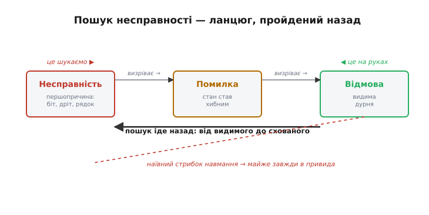
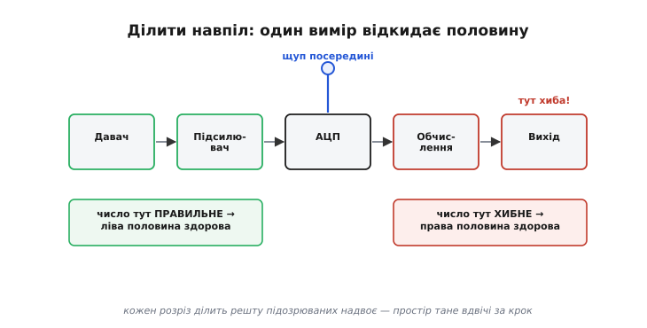

# Систематичний пошук несправності

Цей модуль дав нам повну майстерню. Ми навчилися заглядати в живу програму [зондом і GDB](root:embedded/openocd-gdb), піднімати з мертвого пристрою [посмертний дамп](root:embedded/core-dump), перекладати голі адреси аварії в назви функцій через [addr2line](root:embedded/addr2line-workflow), розкидати по коду друк і слухати його [різними каналами](root:embedded/debug-io-comparison), міряти [споживання](root:embedded/measure-consumption) до наноампера. У руках — осцилограф, логічний аналізатор, мультиметр, лічильник, дебагер. І все одно рано чи пізно настає вечір, коли пристрій робить дурню, майстерня повна інструментів, а ти сидиш і не знаєш, за який узятися.

Бо майстерня — це ще не **метод**. Молоток не каже, куди бити. Найдорожчий осцилограф безпорадний, якщо ти чіпляєш його щуп навмання, «а раптом тут». І провалюється відлагодження майже завжди не через брак приладу, а через брак **дисципліни думки**: інженер угадує причину, міняє перше, що спало на думку, — і сподівається, що допоможе. Іноді щастить. Частіше — ні, бо здогад був хибний, а ще частіше «виправлення» додає другий баг поверх першого, і тепер їх два.

Цей крок — не про новий прилад. Він про те, **як думати**, коли баг уже перед тобою: як із хаосу симптомів вийти на єдину справжню причину — не навмання, а закономірно. Це навичка, що робить усю попередню майстерню вартою чогось.

## Головна думка: відлагодження — це не здогад, а наука

Ось перелам, з якого починається все інше. Несправність — не злий дух і не випадковість. У неї є **причина**, ця причина **фізична й досяжна**, і вона **підпорядкована законам**, які ти вже знаєш: тим самим законам Ома, тактам процесора, рівням логіки, що й уся решта курсу. Пристрій не «глючить» — він робить рівно те, що йому наказує його стан. Просто ти поки не знаєш, який саме стан і звідки він узявся.

А коли причина досяжна й закономірна, то й шукати її треба **як науковець шукає закон природи** — не осяянням, а спостереженням. Класична праця з цієї теми, [історія систематичного відлагодження](root:embedded/troubleshooting-methodology/hist-debugging.md), формулює це прямо: дій за науковим методом. Спостерігай збій. Придумай **припущення** про причину, узгоджене зі спостереженнями. Виведи з припущення **передбачення** — «якщо причина саме така, то станеться ось те». Постав **дослід**, що це передбачення перевірить. Підтвердилось — крок до істини; спростувалось — припущення геть, наступне.

Ключове слово тут — **спростувати**. Добрий дослід влаштований так, що може вбити твою гіпотезу. Якщо задум експерименту такий, що хай там що — ти лишишся при своїй думці, то це не дослід, а самозаспокоєння. Науковець цінує спростування вище за підтвердження: воно викреслює цілий шмат простору й звужує пошук. Той самий класичний звід правил каже це різко й влучно: **годі думати — дивись**. Не «мабуть, це кварц» і не «напевно, знову живлення», а щуп на лінію — і **побач**, що там насправді коїться.

> 🔧 **Навіщо це.** Ця настанова економить дні. Найдорожча помилка відлагодження — **виправляти навмання**: побачив симптом, згадав схожий випадок торік, поміняв деталь, воно ніби минуло — і ти пішов далі, так і не знаючи причини. За тиждень баг вертається, бо ти лікував не його. Наука дорожча витратами на початку (сформулювати гіпотезу, поставити дослід), але дешевша загалом: коли причину **доведено**, ти певен, що полагодив саме її, а не збіг.

## Іти ланцюгом назад: від відмови до несправності

Коли ми готували [тестування відмовостійкості](root:embedded/fault-injection-testing), ми розчепили три поняття, що в побуті звучать однаково: **несправність** (першопричина — перекинутий біт, обірваний дріт, хибний рядок коду), **помилка** (несправність прокинулась: внутрішній стан став хибним) і **відмова** (помилка дійшла до виходу: пристрій зробив видиму дурню). Ланцюг завжди той самий: несправність → помилка → відмова.

Уприскування відмов ішло цим ланцюгом **уперед**: ти сам вкидав несправність на лівому кінці й дивився, чи дорветься вона до відмови. Пошук несправності — дзеркальне заняття. Тут у тебе на руках **правий кінець**: видима відмова, яку принесли з поля. А потрібен **лівий** — першопричина. Тож ти йдеш ланцюгом **назад**: від того, що видно, до того, що сховане.

І оце «назад» одразу пояснює, чому наївне відлагодження буксує. Симптом сидить на **правому** кінці, далеко від причини. Пристрій перезавантажився — це відмова. Але перезавантаження могла спричинити просадка живлення, і зависла задача, яку добив [сторож](topic:sf-devices/watchdog), і хибний покажчик, що вгатив у заборонену адресу, і перегрів. Один симптом — багато можливих причин, розкиданих через увесь ланцюг. Стрибати навмання від симптому до випадкової причини — означає ганятися за одним із десятка привидів. Метод натомість каже: не стрибай, а **звужуй** — крок за кроком відсікай половину підозрюваних, доки лишиться один.


*Той самий ланцюг, що й у відмовостійкості, але пройдений у зворотний бік. На руках у тебе — права ланка (видима відмова). Мета — ліва (першопричина). Наївний шлях (пунктир) стрибає від симптому до випадкового здогаду й майже завжди влучає в привида. Метод веде ланцюгом назад, на кожному кроці відсікаючи половину підозрюваних.*

## Найгостріший інструмент: ділити простір навпіл

Якщо забути все інше з цього кроку, лиши в пам'яті одне слово: **діли навпіл**. Це та сама ідея, що робить пошук у впорядкованому масиві блискавичним, — тільки націлена на баги. Не перебирай підозрюваних по одному від початку до кінця. Постав **один** дослід, що ділить їх на дві половини, і подивись, у якій половині ховається біда. Половину відкинуто одним рухом. Повтори — лишиться чверть. Ще раз — восьмина. Двадцять підозрюваних гинуть за п'ять дослідів, а не за двадцять.

Ділити можна за трьома осями, і майстер вибирає ту, де розріз найдешевший.

**У просторі — уздовж тракту сигналу.** Сигнал іде ланцюжком: давач → підсилювач → АЦП → обчислення → вихід. На виході — дурня. Не перевіряй усі ланки поспіль. Тицьни щупом **посередині** — після АЦП. Число тут правильне? Тоді вся ліва половина здорова, біда праворуч, у обчисленнях. Хибне? Біда ліворуч, в аналозі чи давачі. Один вимір — і половини тракту наче не було.

**У часі — «що змінилося».** Учора працювало, сьогодні ні. Між «учора» і «сьогодні» лежить список змін: комітів коду, замін деталей, правок конфігурації. Одна з них зламала — і її теж шукають діленням навпіл. Візьми стан **посередині** між останнім робочим і першим зламаним — умикнеш половину змін. Працює? Винуватець у другій половині. Ні? У першій. Саме так працює `git bisect` над [історією коду](topic:sf-release/version-control): за пару десятків кроків він вилущує єдиний коміт-винуватець із тисяч. Але та сама логіка живе й у залізі — «а якщо повернути стару плату / стару прошивку / зняти оту нову деталь»: ти не гадаєш, ти **звужуєш вікно змін**.

**У структурі — вимкнути половину системи.** Пристрій зависає, а що саме винне — не ясно. Відріж половину: закоментуй гілку коду, вимкни радіо, від'єднай частину периферії. Симптом зник? Винне у відрізаному. Лишився? У тому, що працює далі. Половину системи вирахувано з рівняння одним рухом.


*Тракт від давача до виходу. На виході — хиба, але де саме — невідомо. Замість перевіряти всі п'ять ланок поспіль, вимірюють посередині. Число тут правильне — здорова вся ліва половина, шукай праворуч; хибне — навпаки. Кожен такий розріз ділить решту підозрюваних надвоє, і простір пошуку тане не по одному, а вдвічі за крок.*

Чому це працює так добре, видно з чисел. Перебір по одному — це в найгіршому разі N дослідів на N підозрюваних. Ділення навпіл — це log₂(N):

```
16 підозрюваних, перебір по одному  → до 16 дослідів
16 підозрюваних, ділення навпіл     → 4 досліди (16 → 8 → 4 → 2 → 1)
1024 підозрюваних, ділення навпіл   → 10 дослідів
```

Тисяча можливих причин — і десять розумних дослідів замість тисячі тупих. Ось чому «діли навпіл» — не одна з порад, а **головна**. Готовий каркас такого пошуку — [бісекція як робочий код](root:embedded/troubleshooting-methodology/proj-bisection-debug.md): половинний пошук над списком підозрюваних і журнал дослідів у C, який можна лишити в прошивці назавжди.

## Спершу — зроби, щоб падало щоразу

Ділити навпіл можна лише те, що **надійно відтворюється**. Дослід має сенс, тільки якщо його результат однозначний: увімкнув гіпотетичну причину — впало, вимкнув — не впало. А баг, що вискакує раз на годину «коли схоче», перетворює кожен дослід на ворожіння: не впало за п'ять хвилин — це гіпотеза хибна чи просто ще не пощастило? Тому **перше** завдання при непевному, «плаваючому» багу — не полагодити його, а **приборкати**: домогтися, щоб він падав **щоразу**, за командою.

Класичний звід правил ставить це другим за важливістю після розуміння системи: **зроби, щоб падало**. Знайди умову, від якої залежить збій, і **підсиль** її до впевненого відтворення. Гріється? Прогрій навмисно феном. З'являється на довгому кабелі? Візьми ще довший. Раз на тисячу пакетів? Жени мільйон пакетів поспіль. Ти не «чекаєш, поки станеться» — ти **робиш, щоб сталося**, і тим переводиш баг із розряду примар у розряд керованих дослідів.

Тут чигає особлива підступність — **гейзенбаг**: баг, що зникає, щойно ти пробуєш його спостерігати. Ми вже [зустрічали його з друком](root:embedded/jtag-swd-tools): вставив `println`, щоб підглянути, — а він зрушив тайминг, і баг сховався. Це не містика, а фізика спостереження: сам прилад вимірювання змінює те, що вимірює. Гейзенбаг — сигнал, що причина чутлива до **часу**: гонка між задачами, вузьке вікно в перериванні, стан, що встигає чи не встигає. З ним борються найменш втручальним каналом (той самий [вибір каналу виводу](root:embedded/debug-io-comparison) — слід через зонд майже не чіпає час) і зброєю, що читає стан, **не зупиняючи** ядро.

> 🔧 **Навіщо це.** «Не можу відтворити» — найгірша фраза в багрепорті, бо закриває шлях до всякого досліду. Поки баг плаває, ти не полагодиш його — лише думатимеш, що полагодив, коли він випадково притихне. Уся робота на цьому кроці — спершу **приборкати** плавучість, а вже тоді полювати. Приборкав — і кожен наступний дослід дає чесне «так» або «ні», а не «може».

## Журнал: одна змінна за раз, усе записано

Наука тримається на записі, і відлагодження — теж. Веди **журнал**: що спостерігав, яку гіпотезу висунув, який поставив дослід, що вийшло. Причин дві. По-перше, пам'ять бреше: за годину полювання ти забудеш, що вже перевірив, і почнеш ганяти те саме коло вдруге. По-друге — і головніше — журнал ловить **закономірність** плаваючого багу: запиши поряд усі збої з їхніми обставинами, і в стовпчику раптом проступає спільне («усі падіння — коли ввімкнене радіо», «усі — після годин безперервної роботи»). Те, що поодинці здавалося випадковим, у журналі показує причину.

І залізне правило кожного досліду: **міняй одне за раз**. Крутнув два регулятори водночас, воно змінилось — а котрий винен? Знову невідомо, і дослід змарнований. Один рух — одне спостереження. Це нудно й повільно на вигляд, але саме ця повільність і є найкоротший шлях: кожен крок дає чисту, однозначну відповідь, і жоден не доводиться перепроходити.

## Приклад наскрізь: «пристрій сам перезавантажується»

Складімо все докупи на біді, знайомій кожному, хто щось будував. Пристрій **сам перезавантажується** — раз на кілька хвилин, без ладу. Це відмова на правому кінці. Ідемо ланцюгом назад.

**Крок 0 — приборкати.** Раз на кілька хвилин — надто рідко для дослідів. Що спільного в падінь? Журнал показує: усі — коли вмикається радіопередавач. Женемо передачу безперервно — і пристрій починає падати щосекунди. Плавучість приборкано: тепер є надійний дослід.

**Крок 1 — розколоти простір навпіл.** Перезавантаження буває або **апаратне** (просіло живлення, спрацював сторож, стрибнула напруга), або **програмне** (хибний покажчик, [аварія ядра](topic:sf-devices/hardfault), переповнення стека). Один дослід ділить ці дві половини начисто: після скидання чіп лишає в спеціальному регістрі **причину** останнього reset. Прочитаймо її першою ж дією:

```c
#include "esp_system.h"

void report_reset_reason(void) {
    esp_reset_reason_t r = esp_reset_reason();
    switch (r) {
        case ESP_RST_BROWNOUT:  puts("reset: BROWNOUT — просіло живлення"); break;
        case ESP_RST_TASK_WDT:  puts("reset: WATCHDOG — зависла задача");    break;
        case ESP_RST_PANIC:     puts("reset: PANIC — аварія в коді");        break;
        case ESP_RST_POWERON:   puts("reset: POWERON — штатний старт");      break;
        default:                printf("reset: інша причина, код %d\n", r);   break;
    }
}
```

> 🔧 **Навіщо це.** [Регістр причини скидання](topic:hw-arch/reset-causes) — найдешевший розріз у всьому відлагодженні перезавантажень. Один рядок коду за мить відкидає половину гіпотез: слово `BROWNOUT` каже «дивись у живлення, не в код», слово `PANIC` — навпаки. Не почавши з нього, легко тиждень нишпорити по коду, коли винна була просадка на шині.

Регістр каже `BROWNOUT`. Одним дослідом уся програмна половина відпала: код ні до чого, винне **живлення**. Ту половину, де сиділи покажчики, стек і аварії ядра, ми вирахували, навіть не заглядаючи туди.

**Крок 2 — ділити далі, тепер усередині живлення.** Радіо на піку передачі тягне сотні міліампер. Просадка — або через **слабке джерело/кабель** (не дає струму), або через **погану розв'язку на платі** (локальна яма напруги під самим чіпом у момент піку). Розколюємо й це: чіпляємо [осцилограф](topic:hw-sensing/oscilloscope) на живлення просто біля ніжок МК і ловимо мить передачі. Бачимо провал напруги нижче порога brown-out саме на піку струму — отже, живлення **фізично** просідає, це не хибне спрацювання захисту. А піджививши плату від сильного лабораторного джерела товстими дротами й побачивши, що провал не зник, відкидаємо «слабке джерело»: яма локальна, коло входу чіпа. Лишається **розв'язка**.

**Крок 3 — підтвердити спростуванням.** Гіпотеза: бракує ємності поряд із чіпом, щоб віддати заряд на пік струму радіо, поки джерело «не встигає». Передбачення, яке її **вб'є, якщо вона хибна**: додам великий конденсатор просто на ніжки живлення — провал має зникнути й перезавантаження припинитись. Додаємо, женемо ту саму безперервну передачу — провал на осцилографі згладився, пристрій тримається. Гіпотезу підтверджено дослідом, а не здогадом: причина — недостатня [розв'язка живлення](topic:hw-arch/brownout) під піковим навантаженням радіо. Полагоджено те, що треба, і ми це **знаємо**.

Пройдімо очима весь шлях. Симптом сидів на правому кінці ланцюга й мав із десяток можливих причин. Ми не стрибнули до жодної навмання. Три розрізи — код проти заліза, джерело проти розв'язки, є яма проти нема ями — звузили десяток до одного, і кожен розріз спирався на **вимір**, а не на віру. Це і є систематичний пошук: не геніальний здогад, а дисципліна, що будь-кому дає той самий результат.

## Що з цього забрати

Майстерня цього модуля — прилади. Цей крок — **метод**, що змушує їх окупитися. Три опори тримають усе. Перша: баг має причину, і шукають її **як науковець** — гіпотеза, дослід, спростування, а не здогад. Друга: головний рух — **ділити навпіл**, у просторі, у часі чи в структурі, бо він валить простір пошуку вдвічі за крок замість по одному. Третя: **приборкай** плавучість перш ніж полювати, **записуй** усе й **міняй одне за раз** — тоді кожен дослід дає чесну відповідь.

І остання думка, що веде далі. Тут ми ганялися за бідою, що **вже сталася**. Наступний крок — [уприскування відмов](root:embedded/fault-injection-testing) — заходить із іншого боку: не чекати на біду, а влаштувати її навмисне й перевірити, чи система переживе. А коли навчишся і знаходити, і провокувати відмови, лишиться звести це в дисципліну — систематично питати наперед, **що** й **як** може зламатися, ще на кресленні: цим займається [FMEA](root:embedded/fmea-embedded). Пошук лікує те, що зламалось; провокація й FMEA роблять так, щоб ламалося рідше.
