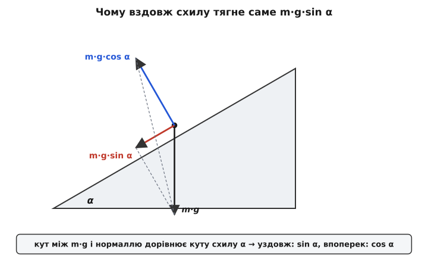
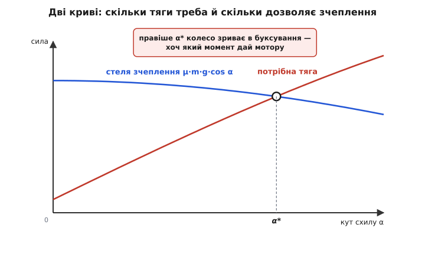
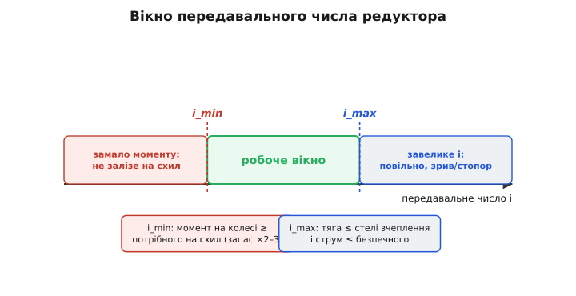

# 🧮 Від схилу до числа зубів: тяга, зчеплення й підбір редуктора

У статті ми порахували один приклад — ровер 4 кг на пандусі 20° — і сказали: кожному колесу треба близько 1.9 кгс·см, а повне виведення винесемо окремо. Ось воно. Але це не просто «те саме, лише детальніше». Тут ми пройдемо весь ланцюг **від першопричини до кінцевого числа, яке замовляють у постачальника** — числа зубів (чи ступенів) редуктора — і дорогою побачимо три різні стелі, об які розбивається наївний підбір «мотора на око».

Питання, на яке ми відповідаємо, звучить просто, аж поки не почнеш його розкладати: **який редуктор поставити між мотором і колесом, щоб ровер заліз на заданий схил і не зірвався в буксування?** У ньому сховано три окремі задачі. Перша — суто геометрична: скільки сили тягне машину назад на укосі. Друга — про межу: скільки сили колесо взагалі здатне передати ґрунту, перш ніж зірветься. Третя — про перетворення: як мізерний момент швидкого мотора перетворити на потрібний повільний момент на колесі, і де тут число зубів. Розберімо їх по черзі, бо кожна дає свою умову на редуктор, і лише всі три разом окреслюють, який редуктор годиться.

## Розклад ваги: чому саме sin і cos

Почнімо з єдиної сили, яку не обійти, — з **ваги**. На рівному вага тисне прямо вниз, у землю, і колесам не заважає: вона їх притискає, а котитися не перешкоджає. Щойно з'являється схил, та сама вага раптом починає **тягнути машину назад**. Звідки? Вага не змінилася — змінилося те, як вона лягає відносно напрямку руху. І весь фокус у тому, щоб розкласти один вертикальний вектор на два зручні напрямки: **уздовж схилу** (туди, куди ровер їде) і **впоперек, у поверхню** (туди, куди він тисне).

Це розкладання — не формальний трюк, а спосіб розділити те, що заважає рухові, від того, що йому допомагає. Складова вздовж схилу — чисте гальмо, її треба долати. Складова впоперек — навпаки, союзник: вона притискає колеса до ґрунту й дає їм за що триматися (до цього ми повернемося, коли говоритимемо про зчеплення). Одна вага, а працює у два боки.

Тепер найголовніше — **чому вздовж виходить синус, а впоперек косинус**, а не навпаки. Тут легко визубрити й переплутати, тож виведемо це так, щоб переплутати стало неможливо. Уяви граничні випадки. На **рівному** (α = 0°) вага тягне назад нітрохи — уся вона притискає. Отже, складова вздовж мусить бути нульова при α = 0, а складова впоперек — повна, m·g. Яка тригонометрична функція дорівнює нулю в нулі? Синус. Яка дорівнює одиниці? Косинус. Значить, уздовж — sin (нуль при 0°), упоперек — cos (повна при 0°). Перевіримо іншим краєм: **вертикальна стіна** (α = 90°). Тут уся вага тягне вздовж (падіння прямо вниз, а «вниз» і є «вздовж стіни»), а притиску нема зовсім. sin 90° = 1 (повна вздовж), cos 90° = 0 (нуль притиску). Сходиться. Тепер це годі переплутати: **синус росте з крутизною, як і сила, що тягне назад; косинус спадає, як і притиск.**

Строгіше воно випливає з простого геометричного факту: **кут між вектором ваги й нормаллю до поверхні дорівнює самому куту схилу α**. Це видно з подібних трикутників — нахили поверхні й нахили векторів повертаються на однаковий кут. А раз вага m·g стоїть під кутом α до нормалі, то її проєкція на нормаль (притиск) — це m·g·cos α, а проєкція на поверхню (тяга назад) — m·g·sin α. Класичне правило проєкції: уздовж напрямку, від якого відлічуємо кут, — косинус; упоперек — синус.


*Розклад ваги на схилі. Повний вектор m·g (чорний, униз) — це діагональ прямокутника, сторони якого напрямлені вздовж схилу (червона, m·g·sin α — вона тягне ровер назад) і по нормалі до нього (синя, m·g·cos α — вона притискає колеса). Ключ до того, чому саме sin і cos: кут між вагою й нормаллю точно дорівнює куту схилу α, тож проєкція на нормаль іде через cos α, а на поверхню — через sin α. На рівному (α=0) червона зникає, синя стає повною; на стіні (α=90°) — навпаки.*

Запишемо обидві складові разом — це фундамент усього подальшого:

```
уздовж схилу (тягне назад):   F_||  = m·g·sin α
по нормалі   (притискає):      N     = m·g·cos α
```

> 🔧 **Навіщо це.** Ці дві формули — не абстракція з підручника, а два різні входи в дальший розрахунок, і плутати їх не можна. `m·g·sin α` піде в **попит на тягу** (скільки моменту замовити мотору). `m·g·cos α` = N піде у **два зовсім інші місця**: в опір кочення (він рахується від притиску, а не від повної ваги) і в межу зчеплення (тертя теж від притиску). Одна помилка тут — переплутати, від чого рахувати опір і зчеплення, — і весь дальший підбір редуктора попливе. Тому спершу твердо: назад тягне синус, притискає косинус.

## Опір кочення: невеличке, але від притиску

До сили, що тягне назад на схилі, додається ще одне гальмо, яке є завжди, навіть на рівному, — **опір кочення** (англ. *rolling resistance*). Він не такий драматичний, як схил, але його треба вкласти в число, інакше на пологому довгому підйомі ровер несподівано не витягне.

Звідки він береться? Ідеально тверде колесо на ідеально твердій площині котилося б вічно, торкаючись у точці. Реальність не така: колесо трохи **вминає** ґрунт (або саме мнеться, якщо гумове), і торкається не точкою, а плямою. Спереду цієї плями матеріал стискається, ззаду розтискається — але розтискається не повністю пружно, частина енергії губиться в тепло (гістерезис). Виходить, що попереду колеса ґрунт «підпирає» трохи сильніше, ніж позаду відпускає, і ця несиметрія створює маленький момент, спрямований проти котіння. Плюс мікропроковзування в плямі контакту. Усе це разом і є опір кочення.

Рахувати кожен із цих механізмів окремо — марна праця для інженера-практика. Їх згортають в один **коефіцієнт кочення** c_rr (безрозмірний), і сила опору виходить простою:

```
опір кочення:   F_roll = c_rr · N = c_rr · m·g·cos α
```

Зверни увагу на дві речі. Перше: опір береться від **нормальної** сили N = m·g·cos α, а не від повної ваги. На крутому схилі притиск менший (cos спадає), тож і опір кочення трохи менший — логічно, колесо менше вдавлюється. На рівному N = m·g, і формула зводиться до звичного F_roll = c_rr·m·g. Друге: c_rr — це не константа природи, а число, що сильно залежить від пари «колесо + поверхня». Ось порядки, які варто тримати в голові (значення орієнтовні, з довідників і практики):

```
тверда гума по бетоні/асфальті ......... c_rr ≈ 0.01…0.02
пневматик по твердому ґрунту ........... c_rr ≈ 0.02…0.04
колесо по щільній землі, гравію ........ c_rr ≈ 0.04…0.08
по траві, піску, м'якому ґрунту ........ c_rr ≈ 0.1…0.3  (і більше)
```

Розкид у десятки разів — і саме тому «прохідність по бездоріжжю» так дорого коштує енергії: на піску опір кочення сам по собі з'їдає стільки ж, скільки помірний схил. У розрахунку беремо c_rr для **найгіршої поверхні**, по якій ровер реально поїде, — бо саме там йому забракне тяги, а не на асфальті.

## Повна тяга й момент на колесі

Тепер зведемо два гальма разом. Щоб ровер **рівномірно** (без розгону) повз угору, ведучі колеса мусять давати тягу, що точно дорівнює сумі того, що тягне назад, і того, що опирається котінню:

```
потрібна тяга:   F_need = F_|| + F_roll
                        = m·g·sin α + c_rr·m·g·cos α
                        = m·g·(sin α + c_rr·cos α)
```

Ця тяга — сила, прикладена в **плямі контакту колеса з ґрунтом**, тобто на радіусі колеса r від його осі. А сила на плечі — це момент. Отже, сумарний момент, який усі ведучі колеса мусять створити на своїх осях:

```
момент на всі колеса:   M_total = F_need · r
```

І якщо вага розкладена порівну між k ведучими колесами, на кожне припадає:

```
момент на одне колесо:  M_wheel = M_total / k = F_need · r / k
```

Тут ховається тонкість, яку легко проґавити: `M_wheel` — це момент **на осі колеса**, тобто **на виході редуктора**, а не те, що віддає голий мотор. Мотор дає набагато менше, і саме різницю між «що дає мотор» і «що треба колесу» закриє передавальне число. Але перш ніж рахувати редуктор, треба з'ясувати межу, за якою весь цей розрахунок стає безглуздим, — бо колесо не передасть ґрунту хоч який завгодно момент.

Прогорнемо приклад зі статті через щойно виведені формули, щоб число не висіло в повітрі.

**Умова: ровер m = 4 кг, схил α = 20°, колеса r = 0.05 м, k = 4 ведучих, c_rr = 0.05 (щільний ґрунт), g = 9.81 м/с².**

```c
// Множник ваги (спільний для обох гальм):
mg      = m * g = 4 · 9.81 = 39.24 Н

// Тяга проти схилу і проти кочення:
F_slope = mg · sin(20°) = 39.24 · 0.342 ≈ 13.4 Н
F_roll  = c_rr · mg · cos(20°) = 0.05 · 39.24 · 0.940 ≈ 1.84 Н
F_need  = F_slope + F_roll ≈ 15.2 Н

// Момент на всі колеса й на одне з чотирьох:
M_total = F_need · r = 15.2 · 0.05 = 0.76 Н·м
M_wheel = 0.76 / 4  = 0.19 Н·м
```

0.19 Н·м на колесо — те саме число, що у статті. Переведемо у звичні для дрібних мотор-редукторів кілограм-сила-сантиметри, бо їх продають саме так: 1 Н·м ≈ 10.2 кгс·см, отже 0.19 Н·м ≈ **1.9 кгс·см**. Це — момент на осі колеса, і саме його редуктор має забезпечити на своєму виході. Запам'ятаймо його; за хвилину він стане нижньою межею вікна передавального числа.

## Стеля зчеплення: чому «потужніший мотор» не завжди їде

Тепер — межа, яка перекреслює наївну логіку «не лізе вгору → постав сильніший мотор». Колесо передає ґрунту силу **через тертя** в плямі контакту. А тертя має стелю. Хоч який момент дай колесу, воно штовхне ровер уперед не сильніше, ніж дозволить зчеплення з ґрунтом; перевищиш цю межу — колесо **зірветься в буксування** (*slip*), крутитиметься на місці, гріючи мотор і риючи яму, а машина стоятиме.

Ця стеля описується законом, який варто знати іменами. Те, що сила тертя пропорційна силі притиску й майже не залежить від видимої площі контакту, першим занотував **Леонардо да Вінчі** (італ. *Leonardo da Vinci*) ще в записниках близько 1490-х — але його нотатки лишилися неопублікованими й невідомими. Незалежно ці закони переоткрив і оприлюднив 1699 року француз **Ґійом Амонтон** (*Guillaume Amontons*), який і ввів поняття коефіцієнта тертя. А 1785 року інший француз, **Шарль-Оґюстен де Кулон** (*Charles-Augustin de Coulomb*, той самий, чиїм ім'ям названо закон для зарядів), ретельними дослідами підтвердив і розширив їх, розділивши тертя спокою й ковзання. Тому модель звуть **законом Амонтона–Кулона**; статус її — усталена інженерна апроксимація (не фундаментальний закон природи: на мікрорівні тертя складніше, але для нашого розрахунку цієї точності досить). *(Джерела: огляди історії закону сухого тертя, Springer «Mechanics of Solids», Wikipedia «Friction».)*

Суть моделі — гранично проста:

```
гранична сила зчеплення:  F_max = µ · N = µ · m·g·cos α
```

де µ (мю) — **коефіцієнт зчеплення** ведучого колеса з ґрунтом. І одразу видно те, чого не побачиш без цієї формули: **межа тяги залежить від притиску N, а не від моменту мотора.** Мотор може мати запас моменту хоч удесятеро — колесо все одно не передасть більше, ніж µ·N. Тому додати тяги можна тільки трьома способами, і жоден із них не «сильніший мотор»: підняти µ (чіпкіша гума, протектор, ширше колесо), підняти N над ведучою віссю (перерозподілити вагу, довантажити), або зменшити потребу (пологіший заїзд).

Ось значення µ, які варто відчувати (орієнтовні, дуже залежать від стану поверхні):

```
гума по сухому асфальті/бетоні ......... µ ≈ 0.7…0.9
гума по вологому асфальті .............. µ ≈ 0.4…0.6
колесо по щільній землі, гравію ........ µ ≈ 0.4…0.6
по мокрій траві, глині ................. µ ≈ 0.3…0.4
по кризі, полірованому металі .......... µ ≈ 0.1…0.2
```

Тепер поєднаймо дві криві — попит і стелю — і побачимо найважливіше число цього розділу. **Попит на тягу** росте з крутизною: F_need = m·g·(sin α + c_rr·cos α), і головний його доданок sin α збільшується з α. А **стеля зчеплення** F_max = µ·m·g·cos α, навпаки, **спадає** з крутизною, бо притиск N = m·g·cos α меншає, коли схил крутіший. Дві криві сходяться назустріч — і там, де вони перетинаються, лежить **гранично прохідний кут** α*, вище за який жоден мотор не допоможе.


*Дві криві, що вирішують прохідність. Червона — потрібна тяга F_need, вона росте з крутизною схилу. Синя — стеля зчеплення µ·m·g·cos α, вона спадає, бо на крутому притиск слабший. Ліворуч від точки перетину α* стеля вища за попит: колесо тягне, ровер їде. Правіше α* попит перевищує стелю — колесо зриває в буксування, і додавати моменту марно. Саме α* — справжня межа прохідності платформи, і задає її зчеплення, а не сила мотора.*

Знайдемо α* формулою — це корисно, бо показує, від чого він насправді залежить. У точці перетину F_need = F_max:

```
m·g·(sin α* + c_rr·cos α*) = µ·m·g·cos α*
```

Маса й g скорочуються (ще одна причина любити цей розклад — межа прохідності від маси **не залежить**!). Ділимо обидві частини на cos α*:

```
tan α* + c_rr = µ        →        tan α* = µ − c_rr        →        α* = arctan(µ − c_rr)
```

Напрочуд чистий результат: **гранично прохідний кут визначається майже самим коефіцієнтом зчеплення** (з невеликою поправкою на кочення). Якщо знехтувати опором кочення (c_rr малий проти µ), то й зовсім `tan α* ≈ µ` — старе туристичне правило «кут, з якого починаєш сповзати, дає коефіцієнт зчеплення». Порахуймо для нашого ґрунту:

**Умова: µ = 0.5 (щільна земля), c_rr = 0.05.**

```c
tan α* = µ − c_rr = 0.5 − 0.05 = 0.45
α*     = arctan(0.45) ≈ 24.2°
```

Тобто наш ровер на щільній землі фізично не залізе на схил, крутіший за ~24°, — **скільки б моменту не мав мотор**. Пандус 20° із прикладу проходить (20° < 24°), але із зовсім невеликим запасом; варто ґрунту зволожитися (µ впаде до 0.35) — і межа опуститься до arctan(0.30) ≈ 17°, і той самий пандус стане непрохідним. Ось чому зчеплення — перша річ, яку рахують, і чому «поставити мотор удвічі сильніший» на слизькому не дає нічого.

> 🔧 **Навіщо це.** α* = arctan(µ − c_rr) — це число, яке треба порахувати **до** вибору мотора, а не після. Воно каже, чи взагалі має сенс шукати сильніший привід. Якщо потрібний схил перевищує α*, задача не в моторі — треба міняти зчеплення (колеса, вагу, поверхню) або відмовлятися від такого схилу. Якщо ж потрібний схил комфортно менший за α* — тоді, і лише тоді, задача зводиться до підбору редуктора, до якого ми нарешті переходимо.

## Момент мотора: звідки взагалі береться крутний момент

Щоб підібрати редуктор, треба знати, що дає **вхід** — голий мотор. Тут ми спираємося на дві золоті пропорції колекторного мотора, які докладно виводяться окремо; нагадаємо лише те, без чого не порахувати редуктор.

> Колекторний DC-мотор має дві прості пропорції. Момент прямо пропорційний струмові: M = kT·I (стала моменту kT задана магнітами й обмоткою). Оберти майже пропорційні прикладеній напрузі. Через це в мотора є **характеристика момент–оберти**: на холостому ходу оберти максимальні, а момент нульовий; що більший момент від нього вимагають, то нижчі оберти, аж до **стопорного моменту** M_stall при нульових обертах — і саме там струм найбільший. Робоча точка ковзає по прямій між цими двома краями. Деталі — у статті про [колекторний DC-мотор](topic:electronics/brushed-dc-motor).

З цього нам критично важливі два числа з даташита мотора: **номінальний момент** M_mot (той, що мотор віддає в робочій точці з добрим ККД, далеко від стопора) і відповідні **номінальні оберти** n_mot. Саме M_mot ми множитимемо на передавальне число. Брати для розрахунку стопорний момент — груба помилка: біля стопора мотор гріється, як [заклинений, до диму](topic:electronics/motor-current-stall-heat), бо тепло в обмотці росте як I², а струм там максимальний. Тому робоча точка приводу має лежати в «здоровій» частині характеристики, з добрим запасом до стопора.

Один голий мотор потрібного нам моменту на колесі не дасть у принципі. Порахуймо, наскільки не дасть. Типовий дрібний DC-мотор віддає номінально десь 0.02–0.05 Н·м. Нам треба 0.19 Н·м на колесо — тобто щонайменше вчетверо-вдесятеро більше. Отже, без підсилення моменту не обійтися, а підсилює його [редуктор](topic:electronics/gears-transmission), обмінюючи зайві оберти мотора на брак моменту. До нього — остання ланка.

## Передавальне число: від моменту мотора до числа зубів

Ось ми й дійшли до числа, яке замовляють. Нагадаємо, що робить редуктор (виводиться окремо, тут — робочі формули):

> Редуктор із передавальним числом i множить момент і ділить оберти. Якщо i = (число зубів веденого колеса)/(число зубів ведучого), то момент на виході M_вих = M_вх·i, а оберти n_вих = n_вх/i (за вирахуванням втрат — реальний ККД однієї зубчастої пари 0.9–0.98, черв'ячної менше). Добуток моменту на оберти — потужність — редуктор змінити не може, лише перекладає момент в оберти й навпаки. Повне виведення — [редуктори й передачі](topic:electronics/gears-transmission).

Тепер зберемо всі три умови, здобуті вище, у вимоги до i. Редуктор мусить підняти номінальний момент мотора M_mot **щонайменше** до потрібного на колесі M_wheel — це дає **нижню** межу передавального числа:

```
умова моменту:   M_mot · i · η ≥ M_wheel
звідси:          i_min = M_wheel / (M_mot · η)
```

де η — ККД редуктора (візьмемо 0.9 для пари шестерень). Але «щойно вистачило» — погано: мотор працюватиме на межі, гріючись і просідаючи в обертах на першій же нерівності. Тому в чисельник закладають **запас** — той самий «×2–3» зі статті:

```
з запасом:       i_min ≈ k_зап · M_wheel / (M_mot · η),   k_зап = 2…3
```

Це нижня стінка вікна. А **верхню** ставлять ще дві умови, які ми вже вивели. По-перше, зчеплення: підсилений момент на колесі не повинен вимагати від ґрунту більше, ніж стеля µ·N, — інакше редуктор просто ефективніше буксуватиме. По-друге, швидкість: що більше i, то повільніше крутиться колесо (n_кол = n_mot/i), і завелике i зробить ровер черепахою. Плюс, тримаючи момент близько до стелі зчеплення, мотор при зриві миттю падає в бік стопора з його струмом. Тому:

```
верхня межа i:   i_max — щоб  (M_mot · i · η)/r ≤ F_max = µ·m·g·cos α
                 і щоб швидкість колеса лишалася прийнятною
```

Між i_min та i_max лежить **робоче вікно передавального числа**. Будь-яке i всередині — годиться; поза ним — або не залізе (замало), або повзтиме й зриватиметься (забагато).


*Вікно передавального числа. Зліва (мале i) моменту на колесі не вистачає навіть на схил — ровер не залізе; ця межа i_min задана умовою моменту із запасом ×2–3. Справа (велике i) момент упирається в стелю зчеплення, а швидкість падає — колесо зриває або машина повзе; ця межа i_max задана зчепленням і прийнятною швидкістю. Годиться будь-яке i із зеленого вікна; зазвичай беруть ближче до i_min, лишаючи швидкість.*

Порахуймо конкретне i для нашого ровера й доведемо його до числа зубів.

**Умова: M_wheel = 0.19 Н·м (потрібно на колесі), мотор M_mot = 0.03 Н·м номінально при n_mot = 3000 об/хв, ККД пари η = 0.9, запас k_зап = 2.5. Колесо r = 0.05 м.**

```c
// Нижня межа передавального числа (з запасом):
i_min = k_зап · M_wheel / (M_mot · η)
      = 2.5 · 0.19 / (0.03 · 0.9)
      = 0.475 / 0.027
      ≈ 17.6

// Округляємо вгору до реального редуктора — беремо i = 20.
// Момент, який дасть колесо при i = 20:
M_out = M_mot · i · η = 0.03 · 20 · 0.9 = 0.54 Н·м   (> 0.19 ✓, запас ~2.8×)

// Оберти колеса й лінійна швидкість ровера при i = 20:
n_кол = n_mot / i = 3000 / 20 = 150 об/хв = 2.5 об/с
v     = 2·π·r · n_кол = 2·π·0.05 · 2.5 ≈ 0.785 м/с ≈ 2.8 км/год
```

Перевіримо верхню межу — чи не проб'ємо стелю зчеплення. Тяга, що відповідає M_out на радіусі колеса:

```c
F_wheel = M_out / r = 0.54 / 0.05 = 10.8 Н  (на одне колесо)
// Стеля зчеплення на одне з 4 коліс на схилі 20°:
N_wheel  = m·g·cos(20°) / 4 = 39.24 · 0.940 / 4 ≈ 9.2 Н
F_max    = µ · N_wheel = 0.5 · 9.2 ≈ 4.6 Н
```

Ось важливий момент, який видно лише з чисел: колесо **здатне запросити** з редуктора до 10.8 Н, а ґрунт віддасть лише 4.6 Н. Це не помилка проєкту — це нормально й навіть добре: запас моменту на валу означає, що на рівному й пологому мотор працюватиме легко, далеко від стопора, а на межі зчеплення просто трохи буксуватиме, не заклинюючись. Погано було б навпаки: якби навіть на повному моменті колесо не могло досягти стелі зчеплення — тоді ровер не використав би зчеплення, яке має. Тобто верхня межа i тут диктується не зчепленням (запас моменту — це ознака здоров'я), а **швидкістю**: 20 дає 2.8 км/год, і збільшувати i далі означало б робити машину повільнішою без потреби. Отже, i = 20 лежить у вікні: вище i_min ≈ 18 і в зоні прийнятної швидкості.

Тепер — **число зубів**. Передавальне число одної зубчастої пари i = z₂/z₁ (ведений/ведучий). Але i = 20 однією парою не зробиш: щоб велике колесо було вдвадцятеро більше за мале, воно вийшло б завбільшки з тарілку. На практиці велике i **набирають ступенями** — послідовними парами, чиї числа перемножуються:

```
для однієї пари:      i₁ = z₂ / z₁
для кількох ступенів: i = i₁ · i₂ · i₃ · …
```

Розкладемо i = 20 на дві ступені. Розумно тримати кожну ступінь у межах i₁ ≈ 3…6 (за це шестерні лишаються сумірних розмірів і зачеплення плавне):

```c
// Дві ступені, приблизно рівні:
i = 20 ≈ 4.5 · 4.44
// Ступінь 1: ведучий z1 = 12 зубів, ведений z2 = 54  → i1 = 54/12 = 4.5
// Ступінь 2: ведучий z3 = 12 зубів, ведений z4 = 53  → i2 = 53/12 ≈ 4.42
// Сумарно:  i = 4.5 · 4.42 ≈ 19.9  ≈ 20  ✓
```

Ось воно — те число, що йде в замовлення: **два ступені редукції, приблизно 4.5 і 4.42, сумарно ≈ 20**, підняте від мізерних 0.03 Н·м мотора до здорових 0.54 Н·м на колесі. На практиці ти рідко нарізаєш шестерні сам — ти **вибираєш готовий мотор-редуктор** із каталогу з найближчим i (скажімо, «1:19» чи «1:21») і перевіряєш його по тих самих трьох умовах: момент на виході більший за потрібний із запасом, тяга не безглуздо нижча за стелю зчеплення, швидкість прийнятна. Увесь цей розрахунок — саме про те, щоб з десятка позицій у каталозі впевнено ткнути пальцем у правильну, а не гадати.

## Що дав цей розрахунок

Ми пройшли ланцюг, у якому кожна ланка витікала з попередньої й тягла за собою наступну. Вага на схилі розклалася на два напрямки — і синус із косинусом перестали бути формулами, які плутають, бо ми прив'язали їх до граничних випадків (рівне й стіна). Складова вздовж дала попит на тягу, нормальна складова — і опір кочення, і межу зчеплення. Момент на колесі виявився моментом на **виході** редуктора, а не на валу мотора, — і це змусило нас звернутися до передавального числа. Але перш ніж його рахувати, стеля зчеплення F_max = µ·N поставила тверду межу: гранично прохідний кут α* = arctan(µ − c_rr), який не залежить ні від маси, ні від мотора, — і показала, чому «сильніший привід» на слизькому не їде. І нарешті три умови — момент із запасом знизу, зчеплення й швидкість зверху — окреслили вікно передавального числа, а розклад на ступені перетворив абстрактне i у конкретні числа зубів.

Головний висновок, який годі отримати «на око»: **прохідність ровера впирається в три різні стелі, і сильний мотор перемагає лише одну з них**. Момент вирішує, чи вистачить сили на схил. Зчеплення вирішує, чи ця сила взагалі дійде до ґрунту. Редуктор — місток, що перекладає одне в друге. Порахувавши всі три, ти замовляєш мотор-редуктор не наздогад, а знаючи наперед, на який схил твоя машина залізе, а де безнадійно забуксує.
