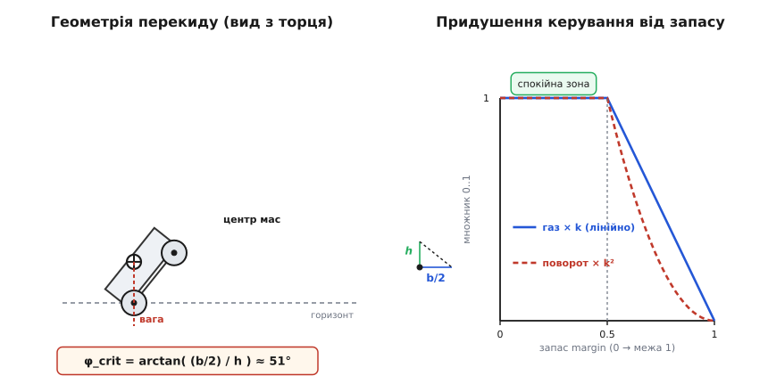
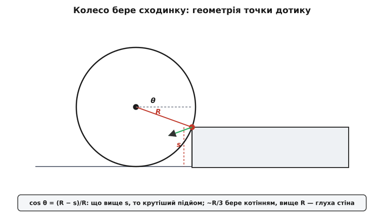
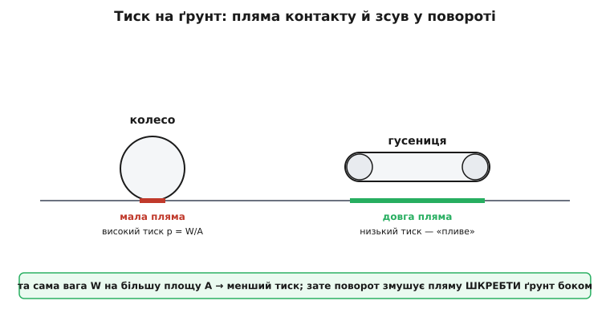
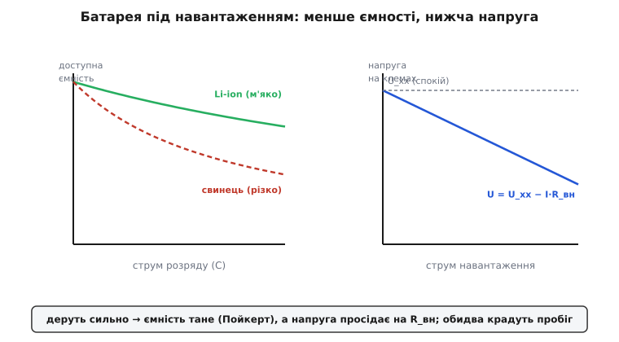

# Шасі ровера/НРК: компонування, прохідність, енергетика — глибше

<preknowlist>
- [Щітковий DC-мотор](root:hw-motion/brushed-dc-motor) — момент прямо пропорційний струму, оберти майже пропорційні напрузі; є характеристика момент–оберти від холостого ходу до стопора.
- [Заклинений мотор гріється до диму](root:hw-motion/motor-current-stall-heat) — біля стопора струм максимальний, а тепло в обмотці росте як I², тож робота на межі випалює привід.
- [Редуктори й передачі](root:hw-motion/gears-transmission) — множать момент і ділять оберти на передавальне число; потужність (момент × оберти) не зростає.
- [H-міст](root:hw-motion/h-bridge) — чотири ключі, що задають напрям і шпаруватість ШІМ на щітковий мотор.
- [Центр мас](root:ph-mechanics/center-of-mass) — точка, у якій ніби зосереджена вся вага тіла; від неї рахують і рівновагу, і момент перекиду.
</preknowlist>

У [базовому кроці](root:embedded/ugv-platform) ми поставили каркас думки: ровер збирається не з деталей, а з рішень про їхнє **розташування**. Ми поклали важку батарею вниз і по центру, щоб опустити центр мас; прив'язали вибір колеса й способу повороту до конкретної поверхні; порахували один приклад моменту на схил і один приклад пробігу; і звели механіку змішування в драйвер шасі. Цього досить, щоб зібрати машину, яка поїде й не осоромиться на першому подвір'ї.

Але між «поїде» і «спроєктовано» лежить прірва, і саме її ми зараз перейдемо. Бо кожне з тих рішень ми в базовому кроці брали **на інтуїції** — «нижче центр мас краще», «більше колесо бере вищу сходинку», «на схилі мотор бере більший струм». Інтуїція правильна, але поки вона не стала **числом і виведенням**, ти не можеш ані передбачити, на якому саме куті ляже твоя машина, ані сказати наперед, чи візьме вона ту сходинку, ані порахувати, скільки хвилин украде розворот. Тут ми перетворюємо кожну інтуїцію на механізм: **чому** вертикаль із центра мас вирішує перекид і на якому куті це стається; **звідки** береться правило «третини радіуса» і як його вивести з геометрії; **чому** гусениця пливе, а skid-steer коштує енергії на кожному повороті; і **як насправді** батарея віддає менше, ніж пише етикетка. Почнімо з першого й найголовнішого числа — стійкості на перекид.

## Перекид як баланс моментів, а не «високо-низько»

У базовому кроці ми сказали: машина перекидається, коли вертикаль із центра мас виходить за опорний багатокутник. Це правда, але це висновок, а не механізм. Розберімо механізм — бо з нього випаде точний кут, на якому твій ровер ляже, і стане видно, чому одні машини перекидаються боком, а інші стають на дибки.

Почнімо з того, що таке **опорний багатокутник** (support polygon). Постав ровер на рівне й познач точки, якими він торкається землі, — плями контакту чотирьох коліс. З'єднай ці точки по зовнішньому обводу: вийде чотирикутник (у ровера з трьома колесами — трикутник, у гусеничного — довгий прямокутник плями). Це і є багатокутник опори — площа, у межах якої машина може «спиратися». Уся вага діє в центрі мас, а тримають її колеса по краях цієї площі. Поки **вертикаль**, проведена з центра мас униз, падає **всередину** багатокутника, кожне колесо тисне на землю додатнім зусиллям, і машина стоїть стійко.

Тепер нахилимо машину — байдуже, схил це чи бічна сила в повороті. Центр мас зсувається вбік, і вертикаль із нього повзе до краю багатокутника. Поки вона всередині — рівновага стійка: якщо машину трохи хитнути, момент ваги повертає її назад. У мить, коли вертикаль дійде **точно до ребра** багатокутника (до лінії між двома колесами одного боку), рівновага стає **байдужою** — машина висить на грані. Ще трішки — вертикаль виходить за ребро, і момент ваги вже не повертає машину, а **перекидає** її через це ребро. Ребро, через яке вона валиться, стає **віссю перекиду**.

Ось чому це саме баланс моментів. Візьмімо вісь перекиду — нижнє ребро багатокутника. Вага m·g створює відносно цієї осі момент, чиє плече — горизонтальна відстань від осі до вертикалі центра мас. Поки центр мас «за ребром углиб машини», це плече повертає машину назад, притискаючи протилежні колеса. Коли центр мас переходить ребро, плече міняє знак — момент починає перекидати. Точка перекиду — це нуль плеча, тобто мить, коли вертикаль проходить рівно над ребром.


*Перекид — це про те, куди падає вертикаль із центра мас. На рівному (ліворуч) вона між колесами, кожне тисне додатнім зусиллям, машина стійка. Нахили машину (праворуч) — і вертикаль повзе до нижнього колеса; у мить, коли вона дійде до нього, машина на межі, а нижнє колесо стає віссю перекиду. Уся геометрія зводиться до двох чисел: половини колії b (як широко стоять колеса) і висоти центра мас h. Критичний кут — там, де вертикаль торкнеться ребра: tan α_кр = b/h.*

Виведімо тепер **критичний кут** — на скільки треба нахилити машину, щоб вертикаль дійшла до ребра. Це геометрія двох чисел. Нехай центр мас стоїть на висоті **h** над площиною, що з'єднує плями коліс, і на горизонтальній відстані **b** від ребра перекиду (для симетричної машини b — це половина колії, тобто половина відстані між лівими й правими колесами). Нахилимо машину на кут α. Вертикаль із центра мас, у системі самої машини, відхиляється від «низу машини» теж на α. Вона дійде до ребра, коли трикутник «висота h — відхилення — ребро» замкнеться:

```
на межі перекиду вертикаль проходить над ребром, тож:

    tan α_кр = b / h
```

Це напрочуд просте й потужне співвідношення, і з нього одразу видно все, що ми в базовому кроці брали на віру. **Опустив центр мас (менше h) — більший α_кр**: машина витримає крутіший нахил. **Розсунув колеса ширше (більше b) — теж більший α_кр**. І навпаки, високий вантаж на даху (велике h) різко зменшує α_кр — ось чому «покласти батарею на дах» карається першою ж канавою. Причому залежність від h — обернена: подвоїв висоту центра мас, і критичний кут (для малих кутів) приблизно вдвічі менший, бо tan майже лінійний біля нуля.

> 🔧 **Навіщо це.** tan α_кр = b/h — це число, яке ти можеш порахувати ще на кресленні, до першого прототипу. Виміряй (чи оціни з CAD) висоту центра мас і половину колії — і ти знаєш наперед, на якому куті машина ляже. Для ровера з h = 12 см і b = 15 см це arctan(15/12) ≈ 51° бічного нахилу до перекиду — солідний запас. Підняв корисне навантаження так, що h стало 24 см, — і вже arctan(15/24) ≈ 32°, удвічі гірше. Це найдешевша перевірка безпеки, яка існує: два виміри лінійкою рятують від перекидів у полі. А якщо потрібно ще запас — не додавай моменту мотору (він тут ні до чого), а розсовуй колію або опускай вантаж.

Тепер важлива тонкість, якої в базовому кроці не було: **вздовж і впоперек машина перекидається по-різному**, бо багатокутник опори не квадратний. У типового ровера колія (відстань між лівим і правим колесом) **менша** за базу (відстань між переднім і заднім). Отже, плече до **бічного** ребра (пів-колії) коротше, ніж плече до **переднього/заднього** ребра (пів-бази). А раз плече менше — критичний кут менший. Звідси залізний факт: **бічний перекид настає раніше за поздовжній**. Ровер, який спокійно лізе на крутий підйом «носом угору», той самий підйом **упоперек** (боком до схилу) може не витримати й перекинутися вбік. Тому найнебезпечніший маневр наземної машини — не крутий підйом, а **траверс**: рух упоперек схилу, коли бічна складова ваги штовхає машину через її вузьке бічне ребро.

## Динамічний перерозподіл ваги: коли машина стає на дибки

Досі центр мас у нас стояв на місці. Але щойно ровер **розганяється, гальмує чи повзе вгору**, вага починає **перетікати** між осями — і це міняє і зчеплення, і межу перекиду. Розберімо цей перетік, бо він пояснює дві речі, які інакше здаються магією: чому ровер на різкому старті **задирає носа**, і чому на підйомі передні колеса зриваються перші.

Механізм — знову момент, але тепер від сили інерції. Уяви ровер, що різко рушає вперед із прискоренням a. Колеса штовхають машину вперед силою в плямі контакту — **низько**, біля землі. А маса машини зосереджена в центрі мас — **вище**, на висоті h. Сила знизу, маса вище: виникає момент, що намагається **повернути машину назад**, довкола задньої осі, — той самий момент, що піднімає ніс мотоцикла в «вілі». Цей момент розвантажує передні колеса й довантажує задні. Порахуймо, наскільки.

Нехай база (відстань між осями) — L, висота центра мас — h, маса — m. У спокої вага розкладена між осями за важільним правилом (де ближче центр мас, туди більше). При прискоренні a момент інерційної сили m·a на плечі h перерозподіляє **нормальні реакції** осей. Приріст навантаження на задню вісь і рівний йому спад на передню:

```
перетік ваги при розгоні:   ΔN = m·a·h / L

передня вісь:  N_пер = N_пер0 − ΔN     (розвантажується)
задня вісь:    N_зад = N_зад0 + ΔN     (довантажується)
```

Одразу видно причинно-наслідковий ланцюг. Що **вища** машина (більше h) і що **коротша** база (менше L), то сильніший перетік — висока коротка машина легко стає на дибки. І межа: якщо ΔN дорівнює всій статичній вазі передньої осі, N_пер падає до нуля — передні колеса **відриваються від землі**, машина «зробила вілі». Умова відриву:

```
відрив передніх коліс:   m·a·h / L ≥ N_пер0
```

На підйомі до цього додається ще й нахил: складова ваги m·g·sin α сама по собі вже перетікає назад (бо тягне вздовж схилу, а прикладена у центрі мас на висоті h), розвантажуючи передні колеса ще до всякого розгону. Тому **на крутому підйомі передні колеса й так ледь притиснуті**, а якщо там ще й газонути — вони злітають, і ровер може перекинутися назад через задню вісь. Це поздовжній перекид, і його критичний кут — теж b/h, тільки b тут пів-бази ззаду.

Практичний висновок для приводу: **на розгоні й на підйомі більше зчеплення має задня вісь**, менше — передня. Тому в ровера, що багато лазить угору, розумно або зробити **задній привід сильнішим**, або взагалі змістити центр мас трохи назад — щоб довантажити те колесо, яке на підйомі й так притиснуте. Це прямо суперечить «поставити центр точно посередині», і компроміс залежить від того, чи машина більше їздить по рівному (тоді центр — посередині), чи багато лазить (тоді трохи назад).

Повне виведення цього перетоку — з рівняннями рівноваги моментів для кожної осі, з комбінацією «схил плюс розгін», і з окремим, найпідступнішим випадком **бічного перекиду в повороті** (де замість інерції розгону діє відцентрова сила m·v²/R на тому самому плечі h) — винесено в [окрему математичну вставку про стійкість](root:embedded/ugv-platform/math-tipover-stability.md); там ми виводимо і граничну швидкість входу в поворот, за якою машина перекинеться боком. Тут досить головного: **вага не стоїть на місці, вона перетікає до того колеса, від якого машину «відштовхує» прискорення чи схил**, і саме недовантажене колесо зривається першим.

## Звідки береться «третина радіуса»: геометрія наїзду на сходинку

У базовому кроці ми сказали, що колесо бере сходинку заввишки приблизно до третини свого радіуса, а вище потрібен ривок. Це робоче правило, але звідки береться саме третина? Виведімо його з геометрії — і заразом побачимо, **чому велике колесо перетворює гостру сходинку на пологий заїзд**, і де межа, за якою жодний момент не допоможе.

Постав колесо радіуса R перед прямокутною сходинкою висотою s. Колесо котиться, доки не впреться в **верхню кромку** сходинки — гострий край, об який воно чіпляється. Далі, щоб піднятися, колесо мусить **обкотитися навколо цієї кромки**, як навколо шарніра: кромка стає віссю, і колесо повертається довкола неї, підіймаючи вісь угору. Уся задача — з якою силою колесо може крутнутися навколо кромки, і чи вистачить її, щоб підняти вагу.

Ключ — **кут θ між радіусом, проведеним у точку дотику (у кромку), і горизонталлю**. Знайдімо його з геометрії. Центр колеса стоїть на висоті R над низьким рівнем (колесо радіуса R котиться по землі). Кромка сходинки — на висоті s. Отже, кромка **нижча за центр** колеса на (R − s). А відстань від центра до кромки — це радіус R (кромка лежить на ободі). Тоді синус/косинус кута θ, що його радіус-у-кромку утворює з горизонталлю, — чиста тригонометрія прямокутного трикутника «центр — рівень кромки — кромка»:

```
вертикальний катет:   R − s   (наскільки кромка нижча за центр)
гіпотенуза:            R       (радіус у точку дотику)

тому:   cos θ = (R − s) / R  = 1 − s/R
```


*Геометрія наїзду на сходинку. Колесо впирається в кромку й мусить обкотитися навколо неї. Усе вирішує кут θ між радіусом у точку дотику й горизонталлю: cos θ = (R − s)/R. Що вища сходинка s, то менший (R − s), то ближче θ до 90° — і то крутіший «підйом», по якому колесо мусить лізти. При s = R кромка на рівні центра, θ = 90°: колесо впирається в стінку строго горизонтально й котінням не бере її взагалі. Ось чому велике R (мале s/R) робить θ малим — сходинка стає пологою для колеса.*

Тепер прочитаймо цю формулу як механік. Реакція кромки на колесо напрямлена **уздовж радіуса** — від кромки до центра колеса (кромка може лише відштовхувати колесо, і тільки вздовж лінії, що з'єднує точку контакту з центром, бо кромка гостра — це фактично точковий контакт). Щоб колесо піднялося, момент рушійної сили навколо кромки має перебороти момент ваги навколо тієї ж кромки. Не заглиблюючись у повний баланс моментів (він у математичній вставці), уловімо головне з самого θ:

- Коли **s мале** проти R, (R − s)/R близьке до 1, тож θ близький до нуля — радіус-у-кромку майже горизонтальний, «підйом» пологий, і колесо легко котиться на сходинку. Груба межа котіння без ривка — саме там, де θ ще помірний, і практика дає це приблизно при **s ≈ R/3** (тоді cos θ ≈ 0.67, θ ≈ 48°): вище цього потрібне вже помітне зусилля й добре зчеплення.
- Коли **s = R**, (R − s)/R = 0, cos θ = 0, θ = 90°: кромка на рівні осі колеса, реакція напрямлена **строго горизонтально** — прямо в центр, ніяк не допомагаючи піднятися. Колесо впирається в стінку й може лише буксувати. Це абсолютна межа: **сходинку заввишки з радіус колеса воно не візьме нізащо**, скільки моменту не дай.
- Коли **s > R**, кромка вище за вісь: колесо взагалі не дістає до кромки ободом так, щоб її обкотити, — воно впирається боком нижче кромки. Глуха стіна.

Ось тепер видно, **чому більше колесо — це і є розв'язок прохідності**, а не сильніший мотор. Візьми ту саму сходинку s і подвій радіус: відношення s/R удвічі менше, θ удвічі (приблизно) менший, «підйом» удвічі пологіший — і те, що маленьке колесо брало ривком на межі зриву, велике бере спокійним котінням. Велике колесо не «сильніше» — воно **міняє геометрію** контакту так, що сама сходинка стає для нього пологою. Тому перше, що роблять, коли ровер не бере поріг, — ставлять колеса більшого діаметра; і лише коли й це не рятує (сходинка ближча до радіуса), переходять до гусениць чи rocker-bogie, що беруть перешкоду принципово інакше.

**Умова: ровер із колесами R = 0.05 м (діаметр 100 мм) наїжджає на бордюр s = 0.03 м. Порахуймо кут θ і оцінімо, чи візьме він бордюр котінням. Потім — той самий бордюр колесами R = 0.09 м.**

```c
// Маленьке колесо R = 0.05 м, сходинка s = 0.03 м:
cos_theta = (R - s) / R = (0.05 - 0.03) / 0.05 = 0.40
theta     = arccos(0.40) ≈ 66°        // круто! s/R = 0.6 — далеко за R/3
// θ = 66° близько до стіни (90°): котінням не візьме, лише ривком і зі зривом.

// Велике колесо R = 0.09 м, той самий s = 0.03 м:
cos_theta = (0.09 - 0.03) / 0.09 = 0.667
theta     = arccos(0.667) ≈ 48°       // s/R = 0.33 — рівно «третина радіуса»
// θ = 48° — межа впевненого котіння: велике колесо бере бордюр спокійно.
```

Числа говорять самі: той самий бордюр, що дрібне колесо бере лише ривком на межі зриву, більше колесо переповзає котінням. Жодного додаткового моменту — сама геометрія. І ще один шар, який часто забувають: **дорожній просвіт**. Навіть якщо колесо здолало кромку, вісь піднялася, але **днище** машини має теж перевалити через сходинку, не черкнувши. Тому реально прохідна висота перешкоди — це мінімум із двох: що бере колесо по кромці **і** що дозволяє кліренс під днищем. Порахував колесо, а забув про черево — і ровер завис на пузі з крутними колесами.

## Тиск на ґрунт і чому skid-steer коштує енергії

Тепер розберімо глибше те, що в базовому кроці було одним реченням: «гусениці розмазують вагу по довгій площі, і тиск на ґрунт падає». Звідки береться тиск, чому він вирішує прохідність по м'якому, і головне — **чому поворот skid-steer з'їдає стільки енергії**. Це друга половина прохідності, і вона вся про площу контакту.

Почнімо з **тиску на ґрунт** (ground pressure). Означення просте: вага машини W, поділена на площу A, якою вона реально спирається на землю. Не на габаритну площу, а саме на суму плям контакту:

```
тиск на ґрунт:   p = W / A
```

У колеса пляма контакту — маленька: тверде колесо торкається землі коротким відтинком, м'яке (пневматик) — трохи довшим, але все одно це кілька квадратних сантиметрів на колесо. У гусениці — довга смуга на всю опорну ділянку траку, у десятки разів більша площа. Та сама вага, розподілена по вдесятеро більшій площі, дає вдесятеро менший тиск.


*Колесо проти гусениці. Та сама вага W, але колесо спирається короткою плямою (тиск p = W/A високий), а гусениця — довгою смугою (площа A велика, тиск малий). Ось чому там, де колесо провалюється в пісок чи багно, гусениця «пливе» поверх: вона не перевищує несучої здатності ґрунту. Плата захована у самій довжині плями: щоб борт skid-steer завернув, ця довга смуга мусить проковзувати боком по ґрунту — шкребти його, — і саме це коштує зайвої енергії на кожному повороті.*

Чому це вирішує прохідність по м'якому? Бо в кожного ґрунту є **несуча здатність** — максимальний тиск, який він тримає, перш ніж почати провалюватися. Сухий пісок, свіжий сніг, багно тримають мало. Якщо тиск машини перевищує цю межу, колесо (чи гусениця) **тоне** — рушій закопується, опір кочення злітає до небес, і машина сідає. Тому по м'якому виграє той, у кого тиск нижчий: гусениця з її великою площею плаває там, де колесо провалюється. Це не «гусениця сильніша» — це **гусениця менше тисне**, тож ґрунт її тримає.

А тепер — плата, і вона захована рівно в тій самій довгій плямі, що дає перевагу. Згадаймо з базового кроку, як повертає skid-steer: борти крутяться з різною швидкістю, і машина завертає, **проковзуючи** колесами (чи гусеницею) боком по ґрунту. Тепер уяви цю довгу гусеничну смугу, коли машина розвертається на місці. Кожна точка смуги рухається по дузі навколо центра повороту, але сама смуга жорстка й напрямлена вздовж машини — тож кожна точка **шкребе** ґрунт боком, під кутом до свого руху. Ось де ховається розхід енергії: щоб провернути машину, привід мусить перебороти силу тертя **всієї плями, що ковзає вбік**. І чим **довша** пляма (що краще для флотації!), то більший момент опору повороту — то дорожчий поворот.

Оцінімо цей опір. Гусениця завдовжки L лежить на ґрунті; при розвороті на місці її передня й задня частини ковзають у протилежні боки навколо центра машини. Сила тертя на кожен клапоть — це µ, помножене на нормальний тиск цього клаптя. Проінтегрувавши тертя по всій довжині смуги (кожна точка на своєму плечі від центра), дістаємо **момент опору повороту**, пропорційний **µ·W·L**: чим важча машина, чим чіпкіший (для зчеплення бажаний!) ґрунт і чим довша гусениця, то більший момент треба, щоб її провернути. Звідси парадокс skid-steer: **те, що робить машину прохідною по прямій (довга пляма — низький тиск, добра флотація), робить її поворот дорогим**. Гусеничний ровер на розвороті легко бере струм удвічі-втричі більший, ніж на прямій, — бо мусить зрушити всю пляму боком проти тертя.

> 🔧 **Навіщо це.** Цей момент опору повороту — не абстракція, а прямий удар по бюджету батареї й по вибору мотора. Якщо твоя машина багато **маневрує** (обстеження, рух у завалах, часті розвороти), поворотний струм гусеничного skid-steer може стати головним споживачем — більшим за їзду по прямій. Тому в енергетичному розрахунку (нижче) маневри рахують **окремим режимом** із підвищеним струмом, а не «трохи більше за прямий». І тому для машини, що часто крутиться на місці, коротша база (менше L) або взагалі колеса замість гусениць можуть виявитися ощаднішими — навіть ціною гіршої флотації. Знову чесний обмін: довга пляма купує прохідність по прямій ціною дорогих поворотів.

## Підвіска: як тримати всі колеса притиснутими

Є ще один бік прохідності, якого базовий крок торкнувся лише через rocker-bogie: **як зробити, щоб на нерівному всі колеса лишалися притиснутими до землі**. Це важить, бо колесо, що повисло в повітрі, не дає ні тяги, ні зчеплення — воно просто крутиться намарно, а машина спирається на решту, перевантажуючи їх. Розберімо, чому жорстка рама тут програє, і що саме роблять підвіски.

Уяви ровер із **жорстко** прикрученими чотирма колесами — рама не гнеться, осі нерухомі. Постав його на ідеально рівне — усі чотири колеса торкаються, вага розкладена. А тепер підклади камінь під одне колесо. Що станеться? Рама жорстка, тож підняте колесо задирає весь той кут машини, і **протилежне по діагоналі колесо відривається від землі** — точно як хитається стіл на нерівній підлозі, спираючись на три ноги з чотирьох. Машина стоїть на трьох колесах, діагональне висить, тяги від нього нуль. На бездоріжжі, де під колесами постійно то камінь, то яма, жорстка чотириколісна рама раз у раз лишається без одного ведучого колеса — саме тоді, коли тяга найпотрібніша.

Розв'язок — дати колесам **свободу рухатися вгору-вниз незалежно**, щоб кожне могло опуститися у свою ямку чи піднятися на свій камінь, не відриваючи інших. Це і є підвіска. Простий варіант — **пружина** на кожне колесо: колесо на важелі, пружина притискає його до землі; наїхало на камінь — важіль піднявся, пружина стиснулася, колесо лишилося притиснутим силою пружини. Так робить будь-який автомобіль. Але для повільного всюдихода в пружин є вада: сила притиску **залежить від ходу** (стиснув пружину сильніше — вона тисне сильніше), тож на великій перешкоді притиск на різних колесах виходить дуже різний, а на межі ходу пружина «замикається» й колесо знову задирає раму.

Тут і сяє механіка rocker-bogie, яку ми в базовому кроці лишили як «геніально просту». Тепер скажемо, **чому** вона геніальна, мовою навантажень. Rocker-bogie не має пружин узагалі — тільки важелі й шарніри. Коромисла лівого й правого боку зв'язані через **диференціальний вузол** (брус чи механізм посередині) так, що коли одне коромисло піднімається, друге опускається на стільки ж, а корпус тримається **посередині між ними**. Ефект: система розкладає вагу між колесами так, що кожне лишається притиснутим **приблизно однаково**, незалежно від того, як колеса стоять на камінні. Одне колесо може задертися на камінь заввишки з нього саме — а корпус лише трохи нахилиться, і **всі колеса лишаться на ґрунті під навантаженням**. Це називають **статично визначеним** розподілом навантаження: геометрія важелів сама розподіляє вагу, без пружин і без зайвих ступенів свободи, що спричиняли б задирання. Звідки взялася ця схема, хто її придумав і чому саме для Марса — [окрема історія](root:embedded/ugv-platform/hist-rocker-bogie.md), варта прочитання: там і про диференціальний брус, і про те, чому марсоходи повзуть так повільно.

Висновок для проєктувальника простий і прагматичний. По **рівному й твердому** жорстка чотириколісна рама — найкраще: проста, легка, нічого не теліпається. Щойно поверхня стає **нерівною**, постає питання притиску, і тоді або пружинна підвіска (швидко, автомобільно, для їзди), або rocker-bogie (повільно, всюдихідно, для лазіння по камінні). І це знову чесний обмін, а не «що крутіше»: підвіска додає складності й ваги заради того, щоб жодне колесо не лишилося без роботи.

## Енергетика чесно: C-rate, Пойкерт і просадка напруги

Останнє й найпідступніше число — пробіг на заряді. У базовому кроці ми порахували один приклад і назвали закон Пойкерта. Тут розкладемо енергетику до кінця: збудуємо **енергію на метр шляху**, розберемо, чому батарея віддає менше під навантаженням (Пойкерт **і** просадка напруги — це два різні ефекти), і як це закладати в запас. Бо саме тут «на око» найбільше бреше.

Почнімо з правильної одиниці. У базовому кроці ми рахували час руху від потужності. Але для маршруту зручніша інша величина — **енергія на метр шляху** (Вт·год/м, чи практично — Вт·год/км). Вона каже, скільки батареї з'їдає кожен пройдений метр, і множиться прямо на дальність маршруту. Виведімо її. На рівномірному русі по рівному вся потужність приводу йде на подолання опору кочення F_roll = c_rr·m·g на швидкості v:

```
потужність руху:      P_рух = F_roll · v = c_rr·m·g·v
енергія на метр:       E/s = P_рух / v = c_rr·m·g     (швидкість скорочується!)
```

Ось чистий і корисний результат: **на рівному енергія на метр шляху від швидкості не залежить** — вона дорівнює просто силі опору кочення. Їхати вдвічі швидше означає їхати вдвічі менше часу, тож та сама енергія витрачається за коротший час; на метр виходить те саме. (Це ідеалізація — на високій швидкості додається опір повітря, що росте як v², але для повільного наземного ровера він мізерний.) На **схилі** до цього додається робота проти сили m·g·sin α, і енергія на метр підскакує на m·g·sin α — ось чому підйом коштує непропорційно дорого. А **маневри** (розвороти skid-steer) додають свою пайку через момент опору повороту, який ми щойно вивели.

Тепер — чому реальний пробіг завжди менший за розрахунковий. Тут **два різні ефекти**, і плутати їх не можна.

**Ефект перший — закон Пойкерта.** Ємність, написана на батареї, чесна лише для помірного струму розряду. Коли деруть сильно, доступна ємність **меншає**: частина заряду ніби зникає. Чому? На великому струмі хімія не встигає підвозити реагенти до поверхні електродів (дифузія повільна), а частина енергії губиться на внутрішньому опорі як тепло ще всередині батареї. Пойкерт (нім. фізик Вільгельм Пойкерт, 1897) описав це емпіричним степеневим законом для свинцево-кислотних батарей: доступна ємність спадає зі струмом за степенем із показником k (для свинцю k ≈ 1.1…1.3, і чим більший k, тим різкіший спад). Статус — усталена інженерна апроксимація, виведена саме для свинцю, де ефект найсильніший. У сучасних Li-ion він **набагато м'якший** (k близький до 1.0…1.05), але не нульовий: розряджаючи ровер струмом у кілька C, реально дістанеш відчутно менше ват-годин, ніж пише етикетка.

**Ефект другий — просадка напруги на внутрішньому опорі.** Це зовсім інша річ, і вона діє миттєво, а не накопичувально. Будь-яка батарея має внутрішній опір R_вн. Коли з неї тече струм I, напруга **на клемах** просідає нижче за напругу спокою (холостого ходу) на величину I·R_вн:

```
напруга під навантаженням:   U = U_хх − I·R_вн
```


*Два різні способи, якими навантаження краде пробіг. Ліворуч — закон Пойкерта: що більший струм розряду, то менше ємності батарея реально віддасть; для свинцю спад різкий (штрихова крива), для Li-ion м'який (суцільна), але в обох ненульовий. Праворуч — просадка напруги: під струмом напруга на клемах падає на I·R_вн нижче за напругу спокою, лінійно зі струмом. Пойкерт з'їдає ампер-години, просадка знижує вольти — і разом вони роблять реальний пробіг помітно коротшим за той, що виходить діленням етикеткової ємності на середній струм.*

Ця просадка б'є двічі. По-перше, менша напруга на моторах — менша швидкість і момент при тій самій команді ШІМ, тож на важкому ровер «в'яне». По-друге, і підступніше: коли ровер бере піковий струм (старт, підйом, буксування), просадка може кинути напругу нижче за поріг, при якому **перезавантажується плата керування** — і машина в найгіршу мить втрачає мозок. Ось чому в бюджеті треба закладати не лише середній струм, а й **піковий**, і перевіряти, що навіть на піку напруга лишається над порогом живлення логіки. Часто саме R_вн, а не ємність, диктує, чи потрібна батарея «жирніша» (більший струм віддачі — менший R_вн).

Зведімо все в чесний розрахунок пробігу по режимах — розвиток того, що ми робили в [бюджеті потужності](root:embedded/power-budget), тільки тепер з окремими режимами й обома поправками.

**Умова: батарея 3S Li-ion, U_хх = 11.1 В, ємність 2.6 А·год (26 Вт·год номінально). Ровер має маршрут: 60% часу — рух по рівному (мотори 2.5 А), 25% — підйоми (5.0 А), 15% — маневри-розвороти (4.0 А). Плата з радіо — постійно 0.3 А. Показник Пойкерта для цього Li-ion k ≈ 1.05, внутрішній опір пакета R_вн ≈ 0.15 Ом. Скільки він реально проходить?**

```c
// 1) Середній струм приводу по режимах (зважений за часткою часу):
I_прив = 0.60·2.5 + 0.25·5.0 + 0.15·4.0
       = 1.5 + 1.25 + 0.60 = 3.35 А
I_повн = I_прив + I_плата = 3.35 + 0.3 = 3.65 А

// 2) Поправка Пойкерта: доступна ємність при цьому струмі менша.
//    Спрощена оцінка — ємність тане як (I_ref/I)^(k−1) від струму калібрування.
//    Хай етикетку дано при 0.5 А (≈0.2C). Ефективний C-rate:
C_rate = I_повн / 2.6 ≈ 1.4 C
// множник Пойкерта (груба оцінка для k=1.05):
peukert_k = (0.5 / 3.65)^(1.05 − 1) ≈ 0.135^0.05 ≈ 0.90
Q_дост   = 2.6 · 0.90 ≈ 2.34 А·год     // ~10% ємності «зникло»

// 3) Просадка напруги під середнім струмом (для перевірки, не для енергії):
U_під   = 11.1 − 3.65·0.15 ≈ 11.1 − 0.55 ≈ 10.55 В   // над порогом плати — ок
// на піку підйому (5.0+0.3 А): U_пік = 11.1 − 5.3·0.15 ≈ 10.3 В — ще ок

// 4) Час роботи від доступної ємності, з резервом 20% на глибокий розряд:
t_груб = Q_дост / I_повн = 2.34 / 3.65 ≈ 0.64 год ≈ 38 хв
t_реал = 0.64 · 0.80 ≈ 0.51 год ≈ 31 хв
```

Тридцять одна хвилина — проти п'ятдесяти шести «ідеальних» (26 Вт·год / потужність спокою), які дав би наївний розрахунок. Різниця майже вдвічі, і вся вона — з речей, які «на око» не видно: підйоми й маневри підняли середній струм, Пойкерт з'їв десяту частину ємності, а резерв на глибокий розряд забрав ще п'яту. **Ось чому рахункові хвилини завжди множать на 0.7–0.8 і рахують по режимах, а не по спокою.** І ось чому машину не планують упритул до нуля: остання чверть ємності — це запас на непередбачене й на те, щоб не садити Li-ion у глибокий розряд, який його вбиває.

Останній штрих, який дає наземна машина й не дає літальна, — **рекуперація на спуску**. Коли ровер їде вниз, сила ваги вже тягне його вперед-вниз, і мотор можна перевести в **гальмівний** режим: замість того щоб живити мотор, ровер дає йому працювати генератором, повертаючи частину енергії в батарею (і заразом гальмуючи, щоб не розігнатися на спуску). Виграш скромний — ККД подвійного перетворення низький, а спуски рідко довгі, — але на довгих затяжних спусках рекуперація і продовжує пробіг, і, головне, дає **безпечне гальмування двигуном** без перегріву механічних гальм. Для більшості малих роверів це не критично, але знати про можливість варто: наземна машина, на відміну від дрона, часто їде вниз, і цей спуск не обов'язково викидати в тепло.

## Прошивка: сторож перекиду поверх драйвера

Зведімо глибшу механіку назад у код. У базовому кроці драйвер шасі перекладав «газ і поворот» у два борти й беріг живлення від ривків струму; повний драйвер із розбором команд і реакцією на обрив лінка зібрано в [код-проєкті танкового змішувача](root:embedded/ugv-platform/proj-tank-mixer.md). Тут додамо шар, який прямо випливає з усього, що ми щойно вивели про стійкість: **сторож перекиду** — логіка, що читає нахил машини й **не дає оператору перекинути ровер**, обрізаючи газ і поворот, коли машина підходить до критичного кута.

Ідея проста й прямо з розділу про перекид: ми вивели, що машина на межі, коли нахил підходить до α_кр = arctan(b/h), і що бічний нахил (траверс) небезпечніший за поздовжній. Отже, якщо ми **вимірюємо нахил** — а це вміє [інерційний вимірювальний модуль (IMU)](root:embedded/imu-barometer), який дає крен і тангаж, — то можемо порівнювати поточний нахил із критичним і **м'яко душити керування**, коли машина кренить забагато. Не різко (різко — теж небезпечно), а пропорційно: чим ближче до межі, то сильніше обмежуємо швидкість і особливо поворот (бо поворот на схилі — це саме той відцентровий доважок, що перекидає боком).

Ось кістяк такого сторожа — реальна структура для ESP32, що вбудовується перед драйвером шасі:

```c
#include <math.h>

// Геометрія машини (виміряти для конкретного шасі)
#define HALF_TRACK_M   0.15f   // пів-колії b, м
#define CM_HEIGHT_M    0.12f   // висота центра мас h, м
#define TIP_MARGIN     0.70f   // працюємо лише до 70% критичного кута

// Критичний кут перекиду (радіани), рахуємо раз при старті
static float tip_angle_lat;    // бічний
static float tip_angle_lon;    // поздовжній (тут для прикладу — той самий b)

void tipguard_init(void) {
    tip_angle_lat = atanf(HALF_TRACK_M / CM_HEIGHT_M);   // arctan(b/h)
    tip_angle_lon = tip_angle_lat;                        // спрощено
}

// roll, pitch — крен і тангаж від IMU (радіани).
// Повертає множник 0..1, на який треба помножити КЕРУВАННЯ.
// Що ближче нахил до межі, то менший множник; за межею — 0.
static float tipguard_scale(float roll, float pitch) {
    // наскільки «вибрали» бічний і поздовжній запас (0 — рівне, 1 — на межі)
    float use_lat = fabsf(roll)  / (tip_angle_lat * TIP_MARGIN);
    float use_lon = fabsf(pitch) / (tip_angle_lon * TIP_MARGIN);
    float use = use_lat > use_lon ? use_lat : use_lon;   // гірший із двох

    if (use <= 0.5f) return 1.0f;          // спокійна зона — не чіпаємо
    if (use >= 1.0f) return 0.0f;          // на межі — глушимо повністю
    // між 0.5 і 1.0 — лінійно від 1 до 0
    return 1.0f - (use - 0.5f) / 0.5f;
}

// Обгортка над драйвером шасі: спершу сторож, тоді змішування.
void chassis_drive_guarded(int throttle, int steer,
                           float i_total, float roll, float pitch) {
    float k = tipguard_scale(roll, pitch);
    // поворот душимо СИЛЬНІШЕ за газ: на схилі саме він перекидає боком
    int thr_safe = (int)(throttle * k);
    int str_safe = (int)(steer    * k * k);   // квадрат — крутіший спад
    chassis_drive(thr_safe, str_safe, i_total);   // драйвер із базового кроку
}
```

Три речі варті уваги, і кожна прямо з виведеного вище. По-перше, ми беремо **гірший із двох запасів** (бічного й поздовжнього) — бо перекинутися можна в будь-який бік, і критичний той, що ближчий до межі; а оскільки колія вужча за базу, зазвичай першим спрацьовує бічний. По-друге, ми лишаємо **спокійну зону** до половини запасу, де не чіпаємо нічого, — щоб сторож не заважав на нормальних нахилах і будив лише перед реальною небезпекою. По-третє, **поворот душимо сильніше за газ** (множимо на k²), бо саме поворот на схилі додає відцентровий момент, що перекидає боком, — а прямий рух угору чи вниз набагато безпечніший.

Повний сторож із фільтрацією нахилу (сирий IMU шумить, тож крен і тангаж треба згладити), гістерезисом (щоб не «тремтів» на межі), звуковим попередженням оператору й журналом подій зібрано в [окремому код-проєкті сторожа перекиду](root:embedded/ugv-platform/proj-tipover-guard.md); тут ми лишили саму логіку обмеження, щоб її зв'язок зі стійкістю було видно чисто. Головне вже видно: **число tan α_кр = b/h, яке ми вивели на початку, живе прямо в прошивці** — воно перетворилося на поріг, за яким машина сама себе береже від перекиду.

## Що ми поглибили

Ми взяли кожну інтуїцію базового кроку й довели її до механізму й числа. «Нижче центр мас краще» стало точною умовою tan α_кр = b/h, з якої видно і чому широка низька машина стійка, і чому траверс небезпечніший за підйом. «Вага перетікає» стало рівнянням ΔN = m·a·h/L, що пояснює і вілі на старті, і зрив передніх коліс на підйомі. «Більше колесо бере вищу сходинку» вивелося з геометрії cos θ = (R − s)/R, і межа s = R («стіна заввишки з радіус») перестала бути правилом і стала наслідком. «Гусениця пливе» розклалося на тиск p = W/A і несучу здатність ґрунту, а плата за флотацію — на момент опору повороту, пропорційний µ·W·L, що робить skid-steer дорогим саме там, де він прохідний. Підвіска показала, чому жорстка рама лишає діагональне колесо в повітрі, а rocker-bogie тримає всі притиснутими. Енергетика розклалася на енергію-на-метр, два різні ефекти втрати (Пойкерт з'їдає ампер-години, R_вн — вольти) і чесний розрахунок по режимах, удвічі скромніший за наївний. І нарешті сторож перекиду вніс виведене число tan α_кр = b/h прямо в прошивку, щоб машина берегла себе сама.

Далі ця сама пара швидкостей бортів, яку ми навчилися безпечно формувати, перетвориться на **траєкторію** — на те, куди й по якій дузі поїде машина. Це наступний крок, [кінематика диференціального приводу](root:embedded/differential-drive-kinematics): від «як швидко й безпечно крутяться борти» до «де саме ровер опиниться».
