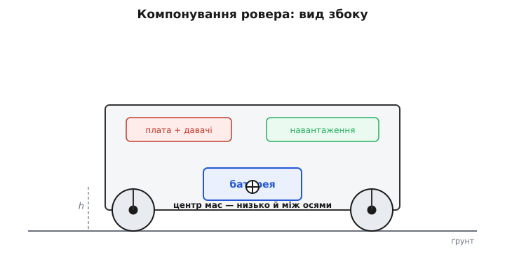
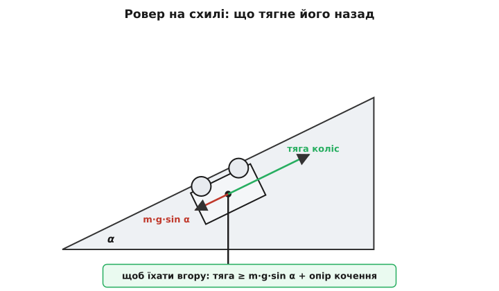
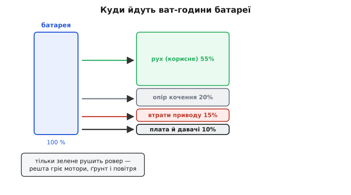

# Шасі ровера/НРК: компонування, прохідність, енергетика

Досі ми крутили мотори поодинці. Ти вже вмієш живити [щітковий DC-мотор](topic:electronics/brushed-dc-motor) через [H-міст](topic:electronics/h-bridge), знаєш, що [заклинений мотор гріється до диму](topic:electronics/motor-current-stall-heat), рахував [бюджет потужності пристрою](root:embedded/power-budget) і зводив [середній струм за циклом роботи](root:embedded/duty-cycle-current). Тепер ми складаємо з цих цеглинок першу справжню машину, що їздить сама, — наземний робот. У військовому й рятувальному вжитку його звуть **НРК** (наземний робототехнічний комплекс), у решті світу — **ровер** (англ. *rover*, «блукач», від *to rove* — тинятися) або **UGV** (*unmanned ground vehicle*, безпілотна наземна машина). Назви різні, задача одна: колеса, рама, батарея й мозок, що самі долають реальний ґрунт.

І ось перше, що ламає наївне очікування. Здається, ровер — це «взяти чотири мотор-редуктори, причепити колеса, зверху покласти плату». Зберемо — і воно поїде по столу. А тоді виїде на подвір'я, ткнеться в бордюр і стане; або з'їде з гірки й перекинеться на спину; або проїде двадцять хвилин і сяде, хоча за розрахунком мало вистачити на годину. Кожна з цих бід — не поломка деталі, а **прорахунок компонування**: помилка не в тому, які деталі, а в тому, **як вони розташовані одна відносно одної й відносно землі**. Шасі — це окрема інженерна задача, і саме її ми зараз розберемо: як розкласти масу, як обрати колеса й поворот під конкретну поверхню, і як порахувати, скільки та машина справді проїде.

## Чому все вирішує, де стоїть маса

Почнімо з єдиного числа, від якого далі залежить майже все, — **положення центра мас** (точки, у якій ніби зосереджена вся вага машини). Візьми олівець і спробуй поставити його сторч на палець: тримається погано, бо центр мас високо, і найменший нахил дає велике перекидне плече. Поклади олівець набік — і його вже нічим не перекинути. Ровер поводиться так само: чим **нижче** центр мас і чим він **ближче до середини** між колесами, тим спокійніша машина на схилах, розгонах і гальмуваннях.

Звідси одразу випливає, куди що класти, і це не питання смаку. Найважча деталь ровера — **батарея**. Отже, батарея йде **вниз і в центр**, просто над віссю коліс, а не зверху й не на краю. Плата керування, давачі, радіо — легкі, їх можна підняти вище, де їм зручніше (антені треба простір, давачам — огляд). Корисне навантаження (камера, маніпулятор, вантаж) намагаємося теж тримати ближче до центра, а якщо воно важке й високе — розуміємо, що заплатимо за це стійкістю.


*Правильне компонування ровера. Найважче — батарея — лежить низько й між осями, тож центр мас (хрестик) опускається до самої землі: висота h мала, перекидне плече коротке. Легкі плата й навантаження підняті вище, де їм зручно, але вони мало важать і майже не піднімають центр мас. Це не естетика, а стійкість: усе далі — схили, розгони, повороти — рахується від цієї точки.*

> 🔧 **Навіщо це.** Висота центра мас — це не абстракція, а конкретний кут, на якому твій ровер ляже. Машина перекидається, коли вертикаль із центра мас виходить за опорний багатокутник — площу, обведену колесами. Опустив центр мас удвічі — приблизно вдвічі крутіший схил витримаєш до перекидання. Тому «покласти батарею на дах, бо там місця більше» — типова помилка новачка, яку ровер прощає рівно до першої канави. Компонуй так, щоб важке було внизу; це найдешевша стійкість, яку взагалі можна купити — вона коштує лише уваги на етапі складання.

Другий бік того самого — **розподіл ваги між колесами**. Зчеплення (сила, з якою колесо чіпляється за ґрунт і не буксує) прямо залежить від того, як сильно колесо притиснуте. Якщо весь вантаж звалено над задньою віссю, передні колеса майже не притиснуті — вони перші зірвуться в проковзування, а на підйомі ровер може просто задерти «носа». Тому масу розкладаємо ще й **уздовж**: так, щоб кожне ведуче колесо несло свою чесну частку й мало за що триматися.

## Прохідність: колесо, кліренс і що вважати перешкодою

«Прохідність» звучить розпливчасто, тож зведімо її до вимірних речей. Перше — **дорожній просвіт** (кліренс, англ. *clearance* — зазор): відстань від найнижчої точки днища до ґрунту. Усе, що вище за просвіт, ровер переповзе; усе, що нижче, зачепить черевом і застрягне, навіть якщо колеса ще крутяться. Тому просвіт — це прямо «яку купину я проігнорую».

Друге, і головне, — **діаметр колеса відносно перешкоди**. Тут працює проста геометрія, і її варто відчути пальцями. Колесо наїжджає на прямокутну сходинку; чи переповзе воно її — залежить від того, де точка дотику. Груба, але робоча межа: колесо бере сходинку заввишки приблизно **до третини свого радіуса** саме котінням; вище — потрібен уже ривок, зчеплення й момент, а зі сходинкою вище за радіус колесо просто впирається в стінку й буксує на місці. Звідси практичний висновок, який економить безліч розчарувань: **хочеш долати вищі перешкоди — став більші колеса**, а не сильніші мотори. Велике колесо перетворює гостру сходинку на пологий заїзд.

Коли колесами вже не взяти — переходять до інших рушіїв, і кожен розв'язує рівно одну проблему компонування.

**Гусениці** (англ. *track*, «слід») розмазують вагу машини по довгій площі контакту. Тиск на ґрунт падає, тож там, де колесо провалилося б у пісок чи багно, гусениця пливе поверх. Плата за це — тертя й складність: гусеничний ровер їсть помітно більше енергії на поворотах, бо гусениці мусять шкребти ґрунт боком.

**Rocker-bogie** (англ., «коромисло-візок») — підвіска марсоходів: важіль-коромисло з кожного боку, до якого через ще один шарнір-візок причеплені колеса, і **жодної пружини**. Уся хитрість у тому, що коромисла лівого й правого боку зв'язані так, що корпус тримається посередині між ними — тому одне колесо може задертися на камінь заввишки з нього саме, а корпус лише трохи нахилиться й **усі шість коліс лишаться на ґрунті**, притиснуті й тягнучі. Це геніально проста механіка, що бере величезні перешкоди на смішній швидкості; звідки вона взялася й чому саме така — [окрема історія](root:embedded/ugv-platform/hist-rocker-bogie.md), варта того, щоб її прочитати.

> 🔧 **Навіщо це.** Вибір рушія — це чесний обмін, не «що крутіше». Колеса: найпростіші, найшвидші, найощадніші по енергії — бери їх завжди, коли поверхня це дозволяє. Гусениці: беруть м'який і сипкий ґрунт ціною енергії й ресурсу. Rocker-bogie: бере велику каменисту непрохідь ціною швидкості й складної механіки. Проєктуючи ровер, спершу чесно опиши **поверхню**, по якій він реально їздитиме, — і рушій вибереться майже сам. Найдорожча помилка тут — тягнути гусениці чи шість коліс туди, де вистачило б чотирьох звичайних.

## Поворот: як машина без керма міняє курс

У ровера немає керма й повороткої осі, як у машини, — і це не спрощення, а окремий спосіб керувати. Найпоширеніший на малих роверах — **диференціальний поворот**, він же **skid-steer** (англ., «поворот проковзуванням»). Ідея гранично проста: ліві й праві колеса мають незалежний привід. Крутиш обидва боки однаково — їдеш прямо; крутиш правий швидше за лівий — завертаєш ліворуч; крутиш боки в різні боки — розвертаєшся на місці, не рушаючи вперед. Керма нема взагалі: увесь маневр — це різниця швидкостей двох бортів.

Назва «skid-steer» чесно каже, чим за це платиш: щоб борт із колесами (чи гусеницею) завернув, колеса мусять **проковзувати** боком по ґрунту — *skid*. Це те саме, як повертає танк, і термін прийшов саме звідти, з гусеничних машин, де іншого повороту й нема. Проковзування означає тертя, знос коліс і зайву витрату енергії на кожному повороті — тим більшу, чим довша база машини. Зате механіка гранично проста: два мотори, жодних поворотних вузлів, і розворот на п'ятачку, недосяжний жодному автомобілю.

Є й альтернатива — **кермо Аккермана** (англ. *Ackermann steering*, за патентом-агентом Рудольфа Аккермана, що 1818 року подав у Британії винахід німця Георга Ланкеншпергера): повертають окремі передні колеса, як у справжньому авто. Так їхати рівніше й ощадніше на швидкості, колеса не шкребуть ґрунт — але ціною поворотного вузла, серва й того, що на місці вже не крутнешся. На малих роверах його беруть рідко, здебільшого коли важлива швидкість і чиста траєкторія.

Як саме різниця швидкостей бортів перетворюється на радіус повороту, кутову швидкість і траєкторію — це вже [кінематика диференціального приводу](root:embedded/differential-drive-kinematics), наступний крок; там ми виведемо формули руху. Зараз досить відчувати механіку: **два незалежні борти — і курс міняється грою їхніх швидкостей**.

## Скільки моменту треба, щоб їхати вгору

Тепер — перше число, яке доводиться рахувати перед тим, як щось замовляти: **який момент мусять давати мотори**. Бо мотор, вибраний «на око», або не витягне ровер на пандус, або виявиться вдвічі важчий і дорожчий, ніж треба.

На рівному ровер долає лише **опір кочення** — невеличке гальмо від того, що колесо трохи вминає ґрунт і само мнеться. На твердому воно мале (одиниці відсотків від ваги), на траві чи піску — помітно більше. Але щойно з'являється **схил**, головним стає інше: складова ваги, що тягне машину назад-униз уздовж укосу. Її дає проста тригонометрія.


*Сили на роверові, що стоїть на схилі. Повну вагу m·g схил розкладає на дві частини: одна притискає машину до укосу (і дає зчеплення), друга — червона — тягне вздовж укосу вниз і дорівнює m·g·sin α. Щоб їхати вгору, зелена тяга коліс мусить перебороти цю складову плюс опір кочення. Ось чому крутий короткий пандус вимагає більше моменту, ніж довга рівна дорога, — рахувати мотори треба саме на схил.*

Зведемо це в число на конкретному прикладі — так, як це роблять перед вибором мотор-редуктора.

**Умова: ровер масою m = 4 кг має заїжджати на пандус із нахилом α = 20°. Колеса радіусом r = 0.05 м (діаметр 100 мм), привід — чотири колеса. Знайдімо повну силу тяги й момент на одне колесо. Прискорення вільного падіння g = 9.81 м/с².**

```c
// Сила, що тягне назад уздовж схилу:
F_slope = m * g * sin(α)
        = 4 · 9.81 · sin(20°)
        = 4 · 9.81 · 0.342
        ≈ 13.4 Н

// Опір кочення (коеф. кочення c_rr ≈ 0.05 для щільного ґрунту),
// береться від складової ваги, що ТИСНЕ на схил:
F_roll  = c_rr · m · g · cos(α)
        = 0.05 · 4 · 9.81 · 0.940
        ≈ 1.8 Н

// Повна потрібна тяга (їхати вгору рівномірно, без розгону):
F_need  = F_slope + F_roll ≈ 13.4 + 1.8 ≈ 15.2 Н

// Момент на ВСІ колеса (тяга на радіусі колеса):
M_total = F_need · r = 15.2 · 0.05 ≈ 0.76 Н·м

// На одне з чотирьох коліс (якщо вага розкладена рівно):
M_wheel = M_total / 4 ≈ 0.19 Н·м ≈ 1.9 кгс·см
```

Отже, кожному колесу треба **близько 1.9 кгс·см** тільки щоб рівномірно повзти вгору — а це ще без запасу на розгін, на пробуксовку й на те, що мотор під навантаженням просідає в обертах. Практика: беремо мотор із запасом моменту **вдвічі-втричі** над розрахунком, бо працювати на межі — це гарантований перегрів того самого [заклинювання, яке ми вже бачили](topic:electronics/motor-current-stall-heat). Сам голий мотор такого моменту не дасть — його створює **[редуктор](topic:electronics/gears-transmission)**, що міняє швидкі й слабкі оберти вала на повільні й сильні; підбір передавального числа під цей момент — половина справи, і повне виведення (від сили на схилі до потрібного числа зубів) винесено в [окрему математичну вставку](root:embedded/ugv-platform/math-slope-traction.md).

І тут ховається межа, об яку розбиваються «потужні» мотори: **зчеплення**. Хоч який момент дай колесу, воно передасть на ґрунт не більше, ніж дозволить тертя. Якщо потрібна тяга перевищує граничне зчеплення — колесо зриває в буксування, і ровер стоїть, гріючи мотор і риючи яму. Тому додати моменту без додавання притиску (ваги на колесо) чи чіпкіших коліс — марно. Часто розв'язок прохідності — не сильніший привід, а **краще зчеплення**: ширші колеса, м'якша гума, більше ваги над ведучою віссю.

## Енергетика: скільки та машина справді проїде

Останнє й найпідступніше число — **скільки ровер проживе на одному заряді**. Підступне, бо тут майже всі рахують надто оптимістично: ділять ємність батареї на «середній струм у спокої» й отримують години, яких машина ніколи не бачить.

Правильний хід — той самий, що ми вже робили в [бюджеті потужності](root:embedded/power-budget), тільки головний споживач тепер не радіо, а **привід**, і його апетит стрибає в рази між «стоїть» і «лізе вгору». Тож рахуємо не «середній струм», а **енергію по режимах**: скільки ват-годин з'їсть їзда, скільки — маневри, скільки — просто ввімкнена електроніка.

**Умова: батарея 3S Li-ion, 11.1 В, ємність 2.6 А·год → запас енергії 11.1 · 2.6 ≈ 28.9 Вт·год. Ровер у русі по рівному тягне з батареї в середньому 2.5 А (усі мотори разом), плата з радіо й давачами — ще 0.3 А. Скільки він проїздить у безперервному русі?**

```c
// Повний струм у русі:
I_move  = I_motors + I_electronics = 2.5 + 0.3 = 2.8 А

// Потужність у русі:
P_move  = U · I_move = 11.1 · 2.8 ≈ 31.1 Вт

// Час руху від ПОВНОГО запасу (ідеал, без урахувань нижче):
t_ideal = 28.9 Вт·год / 31.1 Вт ≈ 0.93 год ≈ 56 хв

// Реальність: з батареї не можна брати «до нуля» — лишаємо резерв ~20 %,
// щоб не садити Li-ion у глибокий розряд і мати запас на фінал:
t_real  = 0.93 · 0.80 ≈ 0.74 год ≈ 45 хв
```

Сорок п'ять хвилин — і то по рівному. Варто пустити той самий ровер на схили й розвороти, де мотори раз у раз беруть удвічі-втричі більший струм, — і реальний час падає ще, легко до півгодини. Ось чому «на око» тут не працює: середній струм у бою куди вищий за струм у спокої, а батарея на додачу **віддає менше, коли з неї деруть сильно**.

Цей останній ефект варто знати окремо. Ємність, написана на батареї, чесна лише для помірного струму розряду; коли тягнеш сильно, доступна ємність **помітно меншає** — частина енергії губиться на внутрішньому опорі як тепло, а хімія не встигає підвозити реагенти до електродів. Це **закон Пойкерта** (нім. фізик Вільгельм Пойкерт, 1897), і виведений він був для свинцево-кислотних батарей, де ефект найсильніший. У сучасних Li-ion він набагато м'якший, ніж у свинцевих, але не нульовий: розряджаючи ровер струмом у кілька C, реально отримаєш відчутно менше ват-годин, ніж пише етикетка. Практичний висновок один — **закладай запас**: рахункові хвилини множ на 0.7–0.8, і не плануй маршрут упритул до нуля.


*Куди насправді йдуть ват-години. Лише частина запасу перетворюється на корисний рух уперед (зелене); решту з'їдають опір кочення, втрати в моторах і редукторах (тепло) і постійне живлення електроніки. Частки тут ілюстративні й гуляють залежно від ґрунту й режиму, але напрям сталий: рушить ровер тільки зелений струмінь. Ощадити пробіг — означає боротися за кожен інший струмінь: чіпкіші колеса й твердіша поверхня зменшують опір кочення, кращий редуктор — втрати приводу.*

## Складаємо в код: драйвер шасі

Тепер зведемо механіку в прошивку. Оператор (чи автономна логіка) думає природними величинами: **«газ»** — як швидко їхати вперед-назад, і **«поворот»** — наскільки крутити. А заліза в нас двоє: лівий борт і правий борт, кожен на своєму [H-мості](topic:electronics/h-bridge). Задача драйвера шасі — перекласти пару «газ + поворот» у дві швидкості бортів. Це те саме **танкове змішування**, що стоїть за диференціальним поворотом: додаєш поворот до одного борту й віднімаєш від іншого.

Але «в лоб» так робити не можна, і саме тут окупається все, що ми знаємо про мотори. Різкий стрибок газу з нуля на повний — це кидок струму, майже як при заклинюванні; ривок просадить живлення й може перезавантажити плату. Тому драйвер **плавно веде** швидкість до бажаної (обмежує швидкість зміни — *slew rate*) і **обрізає** команду за струмом, коли той підходить до небезпечної межі. Ось кістяк такого драйвера для ESP32 — реальна структура, не псевдокод.

**Умова: два борти на H-мостах, керовані знаковим ШІМ у діапазоні −1000…+1000. На вхід — газ і поворот у тих самих одиницях. Драйвер змішує їх у два борти, не дає швидкості мінятися стрибком і придушує команду, коли струм зашкалює.**

```c
#include <math.h>

// Межі й темпи (підібрати під конкретне шасі)
#define DRIVE_MAX     1000     // повний хід ШІМ, безрозмірно
#define SLEW_PER_TICK  40      // макс. приріст швидкості за один цикл (розгін)
#define I_LIMIT_A      6.0f    // поріг сумарного струму бортів, А
#define I_FOLD_A       8.0f    // тут душимо повністю (foldback)

static int cmd_left  = 0;      // поточна (згладжена) швидкість лівого борту
static int cmd_right = 0;      // ... правого

// Плавно підвести val до target не більше ніж на SLEW_PER_TICK за виклик
static int slew(int val, int target) {
    if (target - val >  SLEW_PER_TICK) return val + SLEW_PER_TICK;
    if (target - val < -SLEW_PER_TICK) return val - SLEW_PER_TICK;
    return target;
}

static int clampi(int v, int lo, int hi) {
    return v < lo ? lo : (v > hi ? hi : v);
}

// Головна функція: викликати кожні ~10 мс.
// throttle, steer: −1000..+1000. i_total: виміряний сумарний струм бортів, А.
void chassis_drive(int throttle, int steer, float i_total) {
    // 1) Танкове змішування: поворот додаємо/віднімаємо
    int left  = throttle + steer;
    int right = throttle - steer;

    // 2) Якщо сума вийшла за межу — стиснути ОБИДВА пропорційно,
    //    щоб зберегти співвідношення (курс), а не обрізати один борт
    int peak = (abs(left) > abs(right)) ? abs(left) : abs(right);
    if (peak > DRIVE_MAX) {
        left  = left  * DRIVE_MAX / peak;
        right = right * DRIVE_MAX / peak;
    }

    // 3) Струмовий запобіжник (foldback): що ближче до I_FOLD_A,
    //    то сильніше глушимо команду — колесо буксує чи впав у камінь
    if (i_total > I_LIMIT_A) {
        float k = (I_FOLD_A - i_total) / (I_FOLD_A - I_LIMIT_A); // 1→0
        k = k < 0.0f ? 0.0f : k;
        left  = (int)(left  * k);
        right = (int)(right * k);
    }

    // 4) Плавно вести реальні команди до цілей (без ривка струму)
    cmd_left  = slew(cmd_left,  clampi(left,  -DRIVE_MAX, DRIVE_MAX));
    cmd_right = slew(cmd_right, clampi(right, -DRIVE_MAX, DRIVE_MAX));

    // 5) Віддати на H-мости (знак = напрям, модуль = шпаруватість ШІМ)
    hbridge_set(SIDE_LEFT,  cmd_left);
    hbridge_set(SIDE_RIGHT, cmd_right);
}
```

Вартий уваги крок 2: коли сума газу й повороту вилазить за межу, ми тиснемо **обидва** борти пропорційно, а не обрізаємо той, що зашкалив. Різниця тонка, але вирішальна: обрізавши лише один борт, ти міняєш **співвідношення** швидкостей — а це і є курс, тож ровер поверне не туди. Пропорційне стиснення зберігає курс, лише зменшуючи загальну швидкість, — саме те, чого хоче оператор.

Ця функція — оголене серце шасі; навколо неї наростає читання команди з радіоканалу, обробка втрати зв'язку (газ у нуль, якщо оператор замовк) і телеметрія. Повний драйвер з розбором вхідних команд, дедзоною джойстика й реакцією на обрив лінка зібрано в [окремому код-проєкті](root:embedded/ugv-platform/proj-tank-mixer.md); тут ми лишили саму механіку змішування, щоб її було видно чисто.

## Що ми зібрали

Ровер зібрався не з деталей, а з рішень про їхнє **розташування**. Центр мас, покладений низько й по центру, дав стійкість, якої не купиш потужнішим мотором. Вибір колеса, кліренсу й способу повороту прив'язав машину до конкретної поверхні — і кожен вибір виявився чесним обміном, а не «що крутіше». Розрахунок моменту на схил уберіг мотори від роботи на межі, а зчеплення нагадало, що сила без притиску марна. Енергетичний бюджет по режимах показав справжній пробіг замість оптимістичної казки, а закон Пойкерта звелів закласти запас. І нарешті драйвер шасі переклав людське «газ і поворот» у два борти, не даючи струмові рвати живлення.

Далі ця сама пара швидкостей бортів перетвориться на траєкторію — на те, куди й по якій дузі поїде машина. Це наступний крок, [кінематика диференціального приводу](root:embedded/differential-drive-kinematics): від «як швидко крутяться борти» до «де ровер опиниться».
