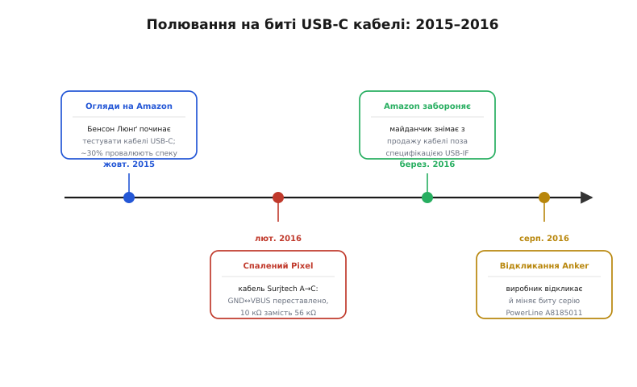
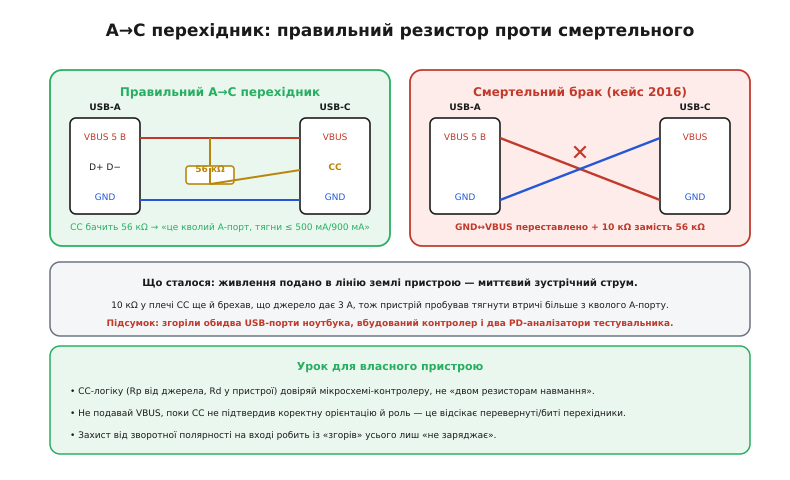

# 📜 Один інженер, мультиметр і акаунт на Amazon

Ми звикли думати про кабель як про даність. Про [резистор CC](book:electronics/type-c-cc) сперечаються стандарти, [профілі PD](book:electronics/usb-pd) виписані на сотнях сторінок, а шнур — ну, шнур і шнур, дріт із двома штекерами. Ця історія — про те, як усього за рік, з кінця 2015-го по кінець 2016-го, галузь **перевчилася** й почала бачити в кабелі повноцінний, ба навіть **небезпечний** компонент. І перевчив її не комітет і не регулятор, а одна людина, що взяла мультиметр, купила пару десятків шнурів на Amazon і почала їх методично перевіряти — а потім писати чесні відгуки під кожним.

Історія повчальна не датами, а **механізмом зрушення**. Вона показує, як буденна, майже нудна робота — «я купив кабель і перевірив, чи він відповідає паспорту» — раптом наштовхнулася на масову проблему, як одна показова аварія довела, що це не теорія, і як після цього правила гри змінив і найбільший у світі магазин, і самі виробники. Розберімо це по порядку, бо кожна ланка тут не випадкова.

## Чому нове гніздо принесло нову небезпеку

Спершу треба відчути, **чому** саме навколо USB-C зчинилася ця буча, а не навколо старого USB-A, який десятиліттями жив собі тихо. Річ у зміні самої **природи роз'єму**.

Старий USB-A був простий і по-своєму захищений власною формою. У ньому текли постійні 5 вольтів, штекер вставлявся лише одним боком, а найгірше, що міг накоїти дешевий кабель, — погано заряджати чи не передавати дані. Спалити ним ноутбук було майже неможливо: не було звідки взятися ні високій напрузі, ні переплутаній полярності — механіка роз'єму сама тримала все на місцях.

USB-C усе це змінив. Тепер по тих самих на око контактах може йти і 5 вольтів, і 9, і 20; штекер симетричний, тож пристрій **мусить сам з'ясувати** орієнтацію по лінії [CC](book:electronics/type-c-cc); а рішення, скільки дати потужності, ухвалюється не механікою, а **переговорами** — тихим цифровим діалогом по тій самій лінії. Гнучкість колосальна, але в неї є зворотний бік: тепер **кабель бере участь у рішеннях про живлення**. Якщо він бреше про свої можливості чи, гірше, переплутав усередині дроти — наслідком буде вже не «повільно заряджається», а спалене залізо.

> 🔧 **Навіщо це.** Ось корінь усієї подальшої історії: з USB-C кабель уперше став **активним учасником** передавання енергії, а не пасивною трубою. Саме тому крива якість шнура, що раніше дратувала, з USB-C почала **знищувати** пристрої. Індустрія не одразу це усвідомила — вона ще жила старим рефлексом «кабель є кабель», — і потрібен був хтось, хто б наочно показав, наскільки ця звичка тепер небезпечна.

## Людина, що почала перевіряти

Цим кимось став **Бенсон Люнґ** (англ. *Benson Leung*) — інженер-програміст Google, який працював над Chromebook-ами й, зокрема, над лінійкою Pixel. Що важливо для сюжету: Люнґ був не стороннім ентузіастом, а саме тим фахівцем, що зсередини знав, як **має** поводитися справний USB-C, бо сам допомагав це реалізувати в пристроях. Він розумів специфікацію не з чуток, а з роботи над кремнієм і прошивкою.

Восени 2015-го, коли USB-C щойно почав з'являтися в масових пристроях — у тому ж Chromebook Pixel, у Nexus 5X і 6P, у перших ноутбуках, — ринок миттєво заполонили дешеві кабелі від безлічі дрібних продавців. І Люнґ зробив річ, на позір буденну: почав **купувати їх на Amazon і перевіряти**, чи відповідають вони специфікації USB-IF (*USB Implementers Forum* — консорціум, що видає й опікує стандарт USB). А результат кожної перевірки він виписував у звичайний **відгук на Amazon** — під тим самим товаром, де його прочитає наступний покупець.

Метод був прозорий і саме тому переконливий. Люнґ не обурювався й не таврував — він **міряв**. Чи стоїть у кабелі правильний резистор на лінії CC? Чи є потрібні лінії? Чи не перегрівається шнур під струмом, який сам же й оголошує? Кожен відгук був маленьким технічним висновком: цей кабель відповідає паспорту, а цей — ні, і ось чому. За кілька місяців таких оглядів набралося чимало — близько **сотні й далі до двохсот** товарів (пік його активності припав на жовтень 2015 — вересень 2016 року), і десь **третина** кабелів не проходила перевірку. Не одиниці, не «трапляється брак» — **третина ринку** не відповідала стандарту, за яким пристрої й ухвалювали рішення про живлення.


*Усе почалося з буденних оглядів на Amazon наприкінці 2015-го, де відкрилося, що близько третини кабелів не відповідають специфікації. Показова аварія в лютому 2016-го довела, що це не теорія, а спалене залізо. У березні майданчик змінив правила, а до серпня й самі виробники почали відкликати свій брак. Одна людина з мультиметром зрушила якість цілого класу заліза.*

Тут варто на мить спинитися на статусі цих фактів. Постать Люнґа, його кампанія оглядів і сам метод — це **добре задокументована, усталена історія**: про неї в 2015–2016 роках писали технічні видання від The Next Web і Gizmodo до Ars Technica й Hackaday, а його відгуки й досі лежать на Amazon під його ім'ям. Тут ми не переказуємо легенду — це радше сучасна хроніка, підтверджена першоджерелом (самими відгуками) і десятками незалежних публікацій.

> 🔧 **Навіщо це.** Найголовніше в методі Люнґа — куди він поніс результат. Не в наукову статтю, не на конференцію, а **під товар, де стоїть кнопка «купити»**. Технічний висновок опинився рівно там, де ухвалює рішення звичайна людина. Це і зробило огляди дієвими: вони працювали не як докір індустрії згори, а як попередження покупцеві просто в момент вибору. Урок для інженера ширший за USB: знання зрушує світ не тоді, коли воно правильне, а тоді, коли лягає **там, де його побачать ті, хто вирішує**.

## Кабель, що спалив три пристрої

Огляди йшли собі місяцями й потроху міняли настрій ринку — та переломним став **один** випадок, на початку лютого 2016 року. Саме він перетворив «дешеві кабелі бувають кепські» на «дешевий кабель може вбити ваш комп'ютер», і саме про нього згадують щоразу, коли заходить мова про якість USB-C.

Люнґ, за своєю звичкою, узяв на перевірку черговий шнур — триметровий кабель **A-to-C** (тобто з класичним USB-A на одному кінці й USB-C на іншому) від продавця **Surjtech**. Устромив його у свій вимірювальний прилад — і той **миттю згорів**. Далі — у другий такий самий прилад: згорів і другий. А коли Люнґ під'єднав кабель до самого **Chromebook Pixel (2015)** — спалив і його. Один шнур — троє мертвих пристроїв поспіль.

Аварія була настільки показова саме тому, що Люнґ, розібравши й прозвонивши кабель, зміг **точно назвати причину**. Усередині цього шнура зійшлося одразу кілька гріхів, і кожен окремо був би поганий, а разом вони склалися в справжню пастку.

Головний, убивчий дефект — **переставлені живлення й земля**. Ось як сам Люнґ описав це в своєму розборі: контакт землі (GND) на боці USB-A був з'єднаний із контактами живлення (VBUS) на боці USB-C, а живлення (VBUS) з боку USB-A — навпаки, із землею (GND) на боці USB-C. Простими словами: **плюс і мінус помінялися місцями** десь усередині кабелю.

Полічімо, що це означає фізично, бо цифри тут промовисті.

**Що робить перевернута полярність.** Джерело подає 5 вольтів: плюс на свій контакт VBUS, нуль (землю) — на GND. Кабель мав би донести їх «як є». Натомість:

```
Джерело: VBUS = +5 В,  GND = 0 В  (як і має бути)

Справний кабель:   +5 В джерела → VBUS пристрою,   0 В → GND пристрою
                   пристрій бачить нормальні +5 В — усе гаразд.

Битий кабель Surjtech (переставлено):
   +5 В джерела  →  GND пристрою      ← живлення потрапило в ЗЕМЛЮ пристрою
    0 В джерела  →  VBUS пристрою     ← а живлення пристрою «сіло» на нуль

Наслідок: між внутрішньою землею пристрою (яку він вважає за 0 В)
          і рештою схеми з'являється +5 В «не туди» → зустрічний струм
          через захисні діоди й доріжки, на які ніхто не чекав такого.
```

Це і є рецепт негайної катастрофи. Уся внутрішня електроніка пристрою побудована з мовчазного припущення, що земля — це нуль, спільна опорна точка для всього. Коли в цю точку раптом заганяють плюсові 5 вольтів, струм ринає **зустрічними**, непередбаченими шляхами — крізь захисні діоди входів, крізь тонкі доріжки, не розраховані на таке, — і випалює те, що трапиться на дорозі. У випадку Pixel це були **обидва порти USB-C** і, найгірше, **вбудований контролер** (англ. *embedded controller*, EC — окремий службовий мікроконтролер, що керує живленням, клавіатурою, зарядкою). Спалення EC мало окремий, майже символічний наслідок: Chrome OS має механізм перевіреного завантаження (*Verified Boot*), який під час старту звіряє цілість своїх компонентів, і, не змігши підтвердити мертвий контролер, система просто **відмовилася вантажитися**. Ноутбук помер не тимчасово, а по-справжньому.

Та переставлена полярність була лише **найголоснішим** із гріхів кабелю. Люнґ знайшов у ньому ще два.

По-перше, **неправильний резистор на лінії CC**. За специфікацією A-to-C кабель мусить нести в собі підтяжку (*pull-up*) на **56 кілоом**, приєднану до VBUS, — саме нею він чесно повідомляє: «мене живить кволий старий A-порт, не тягни з мене більше, ніж він дає». У цьому ж кабелі стояли **10 кілоом** — і не як підтяжка до плюса, а як стяжка (*pull-down*) до землі. Значення резистора на лінії CC пристрій читає як **оголошення струму**: чим менший опір підтяжки, тим більший струм нібито доступний. Замість чесних 56 кОм, що кажуть «бери небагато», кабель фактично брехав, що джерело здатне на значно більше. Пристрій, повіривши, пробував **тягнути з кволого A-порту втричі більше струму**, ніж той міг дати, — ще один шлях до перегріву й вигоряння, тепер уже з боку хоста.

> 🔧 **Навіщо це.** Затямте цю зв'язку: резистор на лінії CC — це не дрібна деталь, а **оголошення можливостей**, якому пристрій беззастережно вірить. Помилка тут не «косметична»: неправильний номінал змушує систему тягнути струм, розрахований на зовсім інше джерело. Саме тому у власному пристрої логіку CC (підтяжку Rp з боку джерела, стяжку Rd з боку споживача) довіряють **мікросхемі-контролеру**, а не «двом резисторам навмання»: правильні номінали тут — це різниця між «заряджається» і «згорів USB-контролер». Пастка Surjtech — це наочний доказ, чому.

По-друге, у кабелі **бракувало швидких ліній** — тих самих SuperSpeed-пар, що несуть дані USB 3.x. Фактично це був USB 2.0-кабель у корпусі з роз'ємом USB-C: заряджати (криво) він міг, а передавати дані на високій швидкості — ні. Сам по собі цей гріх нікого не спалював, але він добре довершує портрет: шнур не відповідав специфікації **в усьому**, від живлення до даних.

Складімо все докупи, бо саме сукупність робить цей випадок таким показовим. Переставлені живлення й земля — миттєвий зустрічний струм у нутрощі пристрою. Резистор 10 кОм замість 56 кОм — брехня про доступний струм, що змушує тягнути втричі більше. Відсутні швидкі лінії — довершення картини несправності. Один-єдиний дешевий шнур зумів зібрати стільки помилок, що спалив і два коштовні вимірювальні прилади, і ноутбук за понад тисячу доларів. Люнґ підсумував це коротко: *«This is a total recipe for disaster»* — «Це достеменний рецепт катастрофи».


*Ліворуч — як має бути: резистор 56 кОм від VBUS до CC чесно каже пристрою «це кволий A-порт, бери небагато». Праворуч — кейс 2016 року: GND і VBUS переставлено (живлення потрапляє в лінію землі пристрою), а 10 кОм замість 56 кОм ще й брешуть, що джерело дає 3 А. Підсумок: згоріли обидва порти ноутбука, вбудований контролер і два PD-аналізатори тестувальника.*

## Прилади, що згоріли, — теж частина уроку

Окрему увагу варто звернути на **два вимірювальні прилади**, які кабель спалив перед ноутбуком, — бо в них ховається тонка й повчальна деталь.

Це були аналізатори живлення USB PD на ім'я **Twinkie**. Цікавинка ось у чім: Twinkie — це не куплений десь дорогий інструмент, а **власна відкрита розробка Google** (його схема й прошивка лежать у відкритому репозиторії Chromium, у гілці вбудованого контролера). Twinkie вміє «підслуховувати» переговори PD на лінії CC, стежити за напругами й струмами на VBUS і VCONN — тобто це саме той інструмент, яким інженер **зазирає всередину** діалогу живлення, щоб бачити, хто що комусь оголосив.

І ось у чому іронія, вартісна окремої згадки. Кабель був настільки бракований, що вбив навіть **прилад, створений спеціально, щоб такі кабелі досліджувати**. Це не курйоз, а важливий доказ: небезпека переставленої полярності не залежить від того, що ти під'єднав. Вона не розбирає, дешевий перед нею телефон чи фаховий аналізатор, — б'є **зустрічним струмом** будь-що, бо порушено найпершу умову, на якій тримається вся електроніка: що земля — це нуль. Проти такого дефекту не рятує ні кваліфікація власника, ні вартість приладу.

> 🔧 **Навіщо це.** Звідси практична обережність, актуальна донині: **непевний кабель спершу перевіряють на тому, що не шкода**, а не одразу на бойовому пристрої. Люнґ був фахівцем із власним інструментарієм — і все одно втратив і прилади, і ноутбук, бо довіряв, що вимірювач витримає. Коли берете в руки шнур сумнівного походження, пам'ятайте: битий кабель здатен убити навіть те, чим ви його міряєте. Захист на вході вашого власного пристрою (бодай від зворотної полярності) — це те, що перетворює таке «згорів» усього лише на «не заряджається».

## Як історія одного шнура змінила правила

Історія зі спаленим Pixel миттю розлетілася технічними виданнями — і не тому, що любили сенсації, а тому, що вона **наочно** довела те, про що Люнґ спокійно писав місяцями: криві USB-C кабелі — це не про зручність, це про безпеку заліза. Одна картинка «шнур за десять доларів убив ноутбук за тисячу» пояснила проблему краще за сотню технічних відгуків. І далі, впродовж 2016-го, ця розказана вголос проблема почала міняти **систему**, а не окремі товари.

Перший великий зсув зробив сам **Amazon**. Наприкінці березня 2016 року — усього за пару місяців після випадку з Surjtech — магазин **оновив свої правила** й вніс до переліку заборонених товарів будь-які USB-C кабелі та перехідники, що **не відповідають** специфікації USB-IF. Тобто найбільший роздрібний майданчик світу вперше визнав криві кабелі не «товаром гіршої якості», а **забороненим до продажу** — таким, що йому не місце на полиці. Цю зміну технічні видання прямо пов'язали з місяцями кампанії Люнґа: саме його огляди зробили масштаб проблеми видимим, а історія зі спаленим ноутбуком — незаперечним.

Другий зсув пішов уже від самих **виробників**. Показовий приклад — компанія Anker, один із великих виробників аксесуарів. У серпні 2016 року вона **відкликала** одну зі своїх серій кабелів PowerLine USB-C (модель A8185011) і запропонувала покупцям повернення грошей, бо кабель неправильно оголошував себе й міг подавати вищу за належну напругу. Тут, задля точності, віддамо належне не лише Люнґу: первісну ваду цієї серії розібрав інший дослідник із тієї самої спільноти, **Нейтан К.** (англ. *Nathan K.*), а Люнґ підтвердив висновок — і разом вони довели справу до відкликання. Це важлива деталь: до 2016 року навколо Люнґа встигла зрости ціла **спільнота** таких перевіряльників, і зрушення вже було не подвигом одинака, а рухом.

Складімо ці три ланки в один ланцюг, бо саме він — головний висновок історії. **Буденні огляди** зробили масову проблему видимою. **Показова аварія** довела, що це не теорія, а спалене залізо. **Системна зміна** — заборона на майданчику й відкликання у виробників — закріпила урок так, щоб він працював уже без участі того, хто його першим побачив. Проблему розв'язали не декретом згори й не одним геройським вчинком, а цим ланцюгом: побачити → довести → вбудувати в правила.

> 🔧 **Навіщо це.** Ось чому сьогодні на пристойному USB-C кабелі стоїть значок сертифікації, чому серйозні виробники ганяють свої шнури через відповідність USB-IF, а маркетплейси бодай на папері забороняють брак. Це не завжди було нормою — цю норму **виборювали** протягом 2016 року, шнур за шнуром. Коли ви кладете в коробку з власним пристроєм сертифікований кабель або радите користувачеві саме такий, ви користуєтеся підсумком цієї історії. А коли проєктуєте вхід пристрою так, щоб він **пережив** випадковий поганий шнур, — ви враховуєте її головний урок: криві кабелі нікуди не зникли, їх лише стало важче продати.

## Що з цієї історії забрати собі

Зведімо нитки, бо за конкретикою дат і резисторів тут ховається кілька уроків, ширших за USB.

Перший — про **природу нового роз'єму**. USB-C дав нам небачену гнучкість (одне гніздо на все — і живлення, і дані, і відео, і будь-яка орієнтація), але ціною того, що кабель став **активним учасником** передавання енергії, а не пасивною трубою. Тому з USB-C крива якість шнура вперше почала не дратувати, а **знищувати** залізо. Це загальне правило: коли система стає гнучкішою й «розумнішою», ланки, які раніше були безпечними за замовчуванням, можуть стати новими джерелами небезпеки. Гнучкість завжди за щось платить.

Другий урок — про **важливість дрібних, «нецікавих» перевірок**. Люнґ не винайшов нової теорії й не зробив відкриття — він **методично міряв** те, що всі вважали дрібницею, і виніс результат туди, де його побачать. Саме ця буденна, майже нудна робота — «купив, прозвонив, написав чесний відгук» — зрушила якість цілого класу заліза. У власній інженерній практиці варто пам'ятати: серйозні проблеми часто ховаються саме там, куди ніхто не дивиться, бо «ну це ж очевидно працює». Іноді найбільшу користь приносить не геніальна ідея, а хтось, хто нарешті **сів і перевірив**.

І третій, найпрактичніший. Усе, що ви приймаєте як спокійні звички надійного пристрою — довіряти логіку CC контролеру, ставити захист на вході, не вимагати від кабелю більше, ніж треба, чесно казати користувачеві «спробуй інший шнур», — це не абстрактна перестраховка. Це **викристалізуваний досвід** конкретних аварій, як-от той спалений Chromebook Pixel лютого 2016-го. За кожним «на вході постав захист від зворотної полярності» стоїть чийсь мертвий ноутбук і два згорілі прилади. Користуючись готовими правилами безпеки, варто бодай раз озирнутися на те, **якою ціною** вони стали правилами, — бо криві кабелі, як ми бачили, з ринку нікуди не зникли. Їх лише стало трохи важче продати, і тепер уже ваша черга спроєктувати пристрій, який їх переживе.
