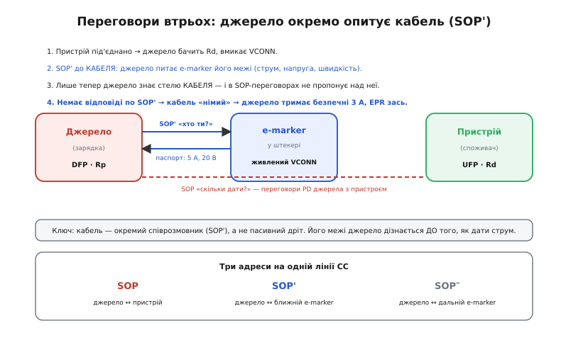
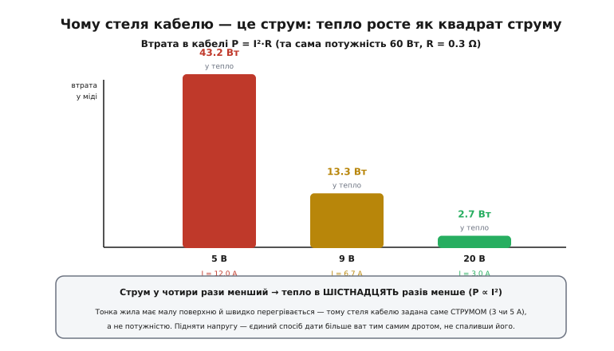
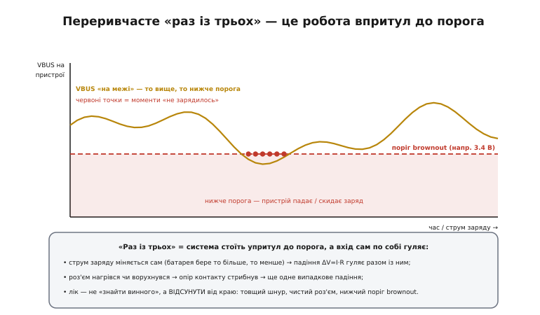

# Кабелі й сумісність — детально

У базовому кроці ми домовилися про головне: кабель — не випадковий дріт, а повноцінний компонент; є [e-marker](topic:electronics/type-c-cc) — паспорт кабелю; є падіння ΔV = I × R, що з'їдає напругу; є скінченний каталог причин «не заряджає» й одне вимірювання, що їх розплутує. Цього досить, щоб у полі не панікувати. Але кожне з цих тверджень спиралося на механізм, який ми лише назвали, — і саме там ховається розуміння без дір.

Тут ми розберемо ці механізми до дна. Чому кабель узагалі мусить мати чип, а не просто товщий дріт? Що фізично відбувається на лінії CC, коли зарядка «питає» кабель, — і чому в цих переговорах не двоє учасників, а троє? Звідки береться саме така форма формули падіння й чому стелю кабелю задають в **амперах**, а не у ватах? Як улаштований той горезвісний перехідник, що не просто повільно заряджає, а **вбиває залізо**? І, нарешті, як перетворити «раз із трьох» — найпідступніший клас відмов — на число, яким можна керувати. Нитку веду ту саму: спершу «чому», тоді механіка, тоді приклад у реальному C.

## Кабель як чотири підсистеми в одному чохлі

У базовому кроці ми сказали, що в кабелі «живуть кілька груп провідників». Тепер придивімося: це не просто групи дротів, а **чотири різні підсистеми з різними законами**, і кожну обмежує щось своє. Плутанина в полі майже завжди від того, що людина міряє один кабель однією міркою, а він насправді — чотири незалежні прилади в одному чохлі.

**Живлення (VBUS/GND) обмежує тепло.** Дві товсті жили несуть повний струм туди й назад. Їхня межа — не «пробій» і не «швидкість», а **нагрів**: по жилі тече струм I, на її опорі R виділяється потужність P = I²·R, і ця потужність гріє мідь. Тонка жила має малу поверхню, з якої тепло стікає в повітря, тож нагрівається швидше. Саме тому цю підсистему характеризують **гранично допустимим струмом** (3 чи 5 А), а не потужністю чи напругою. Це фундаментальна відмінність від інших ліній, і ми до неї повернемося окремим розділом.

**Дані USB 2.0 (D+/D−) обмежує логіка, не тепло.** По цій витій парі біжать мілівольтові сигнали з майже нульовим струмом, тож нагрів тут ні до чого. Її межа — **цілісність сигналу**: чи дійде фронт неспотвореним. Для повільних 480 Мбіт/с USB 2.0 навіть дешевий двометровий шнур упорається. Але саме ця пара несе й переговори [BC1.2](topic:electronics/legacy-charging) — і якщо в «зарядному» кабелі її **нема взагалі**, пристрій втрачає цілий канал домовленостей, хоч живлення й ходить.

**Швидкі дані (SS-пари) обмежує частота й довжина.** Це вже гігагерцові сигнали USB 3.x / USB4, і тут мідь працює як хвилевід, що **втрачає сигнал тим сильніше, чим довший і чим вища частота**. Звідси буденний парадокс, який ми згадали в базовому кроці: двометровий шнур чудово заряджає й тягне USB 2.0, але не бачить швидкої передачі. Це не «поломка» — це фізична межа міді на високій частоті, і саме тому довгі швидкі кабелі роблять **активними**, з підсилювачами-ретаймерами всередині.

**Керування (CC) обмежує точність резисторів.** Найтонша, але найважливіша підсистема: два дроти CC несуть не живлення й не дані, а **переговори про все інше**. Тут струми мікроамперні, а вирішує **точність номіналів резисторів** — саме на цій лінії сидить логіка, що визначає орієнтацію штекера, роль (хто джерело, хто споживач), дозволений струм і тут же живить e-marker через VCONN. Помилка в резисторі на цій лінії коштує найдорожче — аж до згорілого порту, як ми побачимо.

> 🔧 **Навіщо це.** Розділивши кабель на чотири підсистеми, ви одразу правильно ставите діагноз. «Заряджає, але не бачить дані» → підсистема даних (нема пари або SS). «Заряджає повільно» → підсистема живлення (тонкі жили) або CC (не домовилися про струм). «Раз працює, раз ні» → майже завжди контакт на CC чи VBUS. Одна модель у голові економить годину тику навмання: ви знаєте, **яку з чотирьох** підсистем перевіряти, і не чіпаєте три справні.

Ця незалежність підсистем — головна причина, чому «на око однакові» шнури поводяться по-різному. Штекер уніфікований навмисне, щоб будь-що фізично вставлялося будь-куди; а що саме розведено **всередині** — питання ціни й призначення. Виробник дешевого зарядного шнура економить рівно на тих підсистемах, які для зарядки «не потрібні»: викидає SS-пари, іноді й D+/D−, ставить найтонші жили, які ще пролазять під сертифікат. Зовні — той самий USB-C. Усередині — інший прилад.

## e-marker: три співрозмовники на одній лінії

У базовому кроці e-marker був «чипом, що дозволяє більше». Це правда, але вона ховає найцікавіше — **як саме** він це робить. Бо коли ви під'єднуєте кабель до зарядки, у грі не два учасники (зарядка й пристрій), а **три**: зарядка, чип у штекері кабелю й пристрій. І зарядка говорить з кабелем **окремою розмовою**, перш ніж вирішити, скільки давати пристрою.


*Учасників троє. Джерело (DFP) бачить стяжку Rd пристрою й вмикає VCONN. Далі окремою адресою SOP' воно питає e-marker кабелю його паспорт — струм, напругу, швидкість. Лише знаючи стелю кабелю, джерело в основних переговорах SOP пропонує пристрою профілі не вище цієї стелі. Кабель мовчить на SOP' → джерело тримає безпечні 3 А. Три адреси (SOP / SOP' / SOP″) живуть на тій самій парі CC.*

Механізм такий. Коли пристрій під'єднано, джерело спершу за резисторами CC розуміє, що на іншому кінці **споживач** (він тримає стяжку [Rd](topic:electronics/type-c-cc)), і подає живлення VCONN на другий, незадіяний під орієнтацію дріт CC. Це живлення будить e-marker. Тепер джерело шле в лінію CC повідомлення з особливою «адресою» на початку пакета — **SOP'** (*Start Of Packet prime* — «початок пакета, штрих»). Ця адреса означає «звертаюся не до пристрою, а до найближчого чипа в кабелі». E-marker прокидається й відповідає структурою [VDM](topic:electronics/usb-pd) (*Vendor Defined Message*) — своїм паспортом: який струм тримаю (3 чи 5 А), яку напругу, яку швидкість, пасивний я чи активний, яка в мене довжина-затримка. Аж **тепер** джерело знає межу кабелю — і у своїх основних переговорах із пристроєм (адреса SOP, без штриха) не запропонує профіль, вищий за цю межу.

Чому окрема адреса, а не «спитати пристрій, а той хай спитає кабель»? Бо пристрій **не знає** кабелю — він на іншому його кінці й теж бачить лише свій штекер. Кабель — самостійний учасник, і опитати його межі повинен саме той, хто вмикає струм, тобто джерело. Звідси й система з трьох адрес: **SOP** — джерело з пристроєм; **SOP'** — джерело з ближнім (до себе) чипом кабелю; **SOP″** (*prime prime*, «два штрихи») — з дальнім чипом, якщо кабель активний і має чип на обох кінцях. Одна фізична пара дротів CC, три логічні співрозмовники, розділені адресою на початку пакета.

Тепер зрозуміло, **чому** відсутність e-marker так жорстко ріже можливості. Джерело шле SOP' і **не отримує відповіді**. Воно не може розрізнити «кабель тримає 5 А, але чип не відповів» і «кабель — дві тонкі жилки на ліжачку». З погляду безпеки ці випадки нерозрізненні, тож джерело зобов'язане припустити найгірше з допустимого: кабель тримає рівно стільки, скільки **гарантує сам стандарт без жодного чипа**. А стандарт гарантує, що будь-який сертифікований USB-C кабель витримає **3 ампери** — і ні на ампер більше без паспорта. Тому межа «3 А без e-marker» — не забаганка, а точна межа знання: це максимум, який можна дати наосліп, не питаючи кабель.

> 🔧 **Навіщо це.** Ця межа прямо диктує комплектацію власного пристрою. Правило стандарту (усталений факт зі специфікації USB Type-C): e-marker **обов'язковий** для будь-якого кабелю, що виходить за межі «USB 2.0 і рівно 3 А». Тобто щойно вашому виробу треба або понад 3 А, або високу напругу EPR, або швидкі дані — у коробці мусить лежати кабель **з e-marker**. Покладете дешевий шнур без чипа — і пристрій ніколи не покаже паспортної швидкості навіть на ідеальному блоці, а користувач звинуватить виріб. Це не місце для економії.

Варто чітко бачити й межу самої аналогії «паспорт». Паспорт лише **декларує** — він не міряє кабель у реальному часі. E-marker програмують на заводі під конструкцію кабелю; якщо жили з часом окислилися чи один дріт надламався, чип і далі бадьоро рапортує заводські «5 А», хоча кабель уже не той. Тому e-marker гарантує, що система **не перевищить** межу нового кабелю, але не рятує від деградації старого — це вже робота діагностики, до якої ми дійдемо.

## Падіння на дроті: повне виведення й теплова межа

Базовий крок дав формулу ΔV = I × R і показав на числах, як тонкий шнур перетворює 5 В на 3 В. Тут ми виведемо цю формулу **від першопричини** — з геометрії дроту й фізики міді — і, головне, розберемо те, чого базовий крок торкнувся лише мимохідь: **чому межа кабелю задана струмом, а не потужністю**. Це і є теплова природа всієї історії з e-marker.

Почнімо з опору однієї жили. Опір будь-якого провідника росте з довжиною й падає з товщиною — це [питомий опір](topic:physics/resistivity) у чистому вигляді:

```
R_жили = ρ · L / A

  ρ — питомий опір міді ≈ 1.68·10⁻⁸ Ом·м (усталена табличка)
  L — довжина жили (м)
  A — площа перерізу жили (м²)
```

Тепер згадаймо ключову тонкість із базового кроку: струм робить **повну петлю** — туди по VBUS, назад по GND. Працюють обидві жили, тож опір кабелю **подвоєний**, плюс опір контактів у роз'ємах:

```
R_каб = 2 · (ρ · L / A) + R_конт
```

Підставмо реальні числа й переконаймося, що вони збігаються з табличними, якими ми користувалися. Візьмімо жилу 24 AWG: її переріз A ≈ 0.205 мм² = 0.205·10⁻⁶ м². Погонний опір (на метр) виходить:

```
R/L = ρ / A = 1.68·10⁻⁸ / 0.205·10⁻⁶ ≈ 0.082 Ом/м
```

Це рівно ті ~0.084 Ом/м, що стояли в базовому прикладі, — тепер видно, **звідки** вони. Для тоншої 28 AWG переріз учетверо менший (кожні 6 номерів AWG — це приблизно вдвічі тонший переріз), тож і погонний опір учетверо більший: ~0.21 Ом/м. Тому крок від 24 до 28 AWG — це не «трохи гірше», а **вчетверо більший опір**, і саме звідси різкий стрибок падіння на тонких шнурах.

Повне виведення з таблицею опорів за калібром і з розкладкою, звідки береться опір контактів, ми винесли в окрему [математичну вставку про падіння на кабелі](root:embedded/usb-cables-field/math-cable-drop.md) — там і апарат, і числа для різних AWG. Тут же підемо в бік, якого вставка не покриває, а базовий крок лише згадав: **у тепло**.


*Передаємо однакові 60 Вт кабелем з R = 0.3 Ω. По 5 В треба 12 А — у міді гріється 43 Вт (майже стільки, скільки доставляємо!). По 9 В струм 6.7 А — уже 13 Вт. По 20 В струм 3 А — лише 2.7 Вт. Струм у 4 рази менший → тепло в 16 разів менше, бо P ∝ I². Тонка жила має малу поверхню й перегрівається — тому стелю кабелю задають струмом, а не потужністю.*

Ось суть. Напруга, що падає на кабелі, — це ΔV = I·R. Але потужність, що на кабелі **виділяється теплом**, — це добуток цього падіння на струм:

```
P_втрат = ΔV · I = (I·R) · I = I² · R
```

Квадрат струму — ось чому все впирається саме в ампери. Подвойте струм — і падіння напруги подвоїться (лінійно), а **нагрів учетверо** (квадратично). Кабель, що спокійно ніс 3 А, при 6 А грітиметься вчетверо сильніше — і тонкі жили просто не встигнуть віддати це тепло в повітря, ізоляція попливе. Тому стеля кабелю — фізично **теплова**, і виражається вона в струмі: «5 ампер» означає «стільки міді, щоб I²·R при 5 А не перегріло цей конкретний шнур». Потужність тут ні до чого: 100 Вт по 20 В (5 А) грітимуть кабель так само, як 25 Вт по 5 В (5 А), — бо струм однаковий.

Звідси й глибинна, а не просто «зручна» причина стратегії [Power Delivery](topic:electronics/usb-pd): **підняти напругу — єдиний спосіб дати більше ват тим самим дротом, не спаливши його**. Хочете 60 Вт? По 5 В це 12 А — кабель звариться. По 20 В це 3 А — кабель навіть не помітить. Висока напруга не просто «прощає поганий дріт» (як ми сказали в базовому кроці про падіння) — вона знімає **теплову** межу, дозволяючи тонкому кабелю нести потужність, яка спалила б його на низькій напрузі. Падіння напруги (лінійне) — це втрата зручності; нагрів (квадратичний) — це межа безпеки. PD воює саме з другим.

**Приклад: коли той самий кабель безпечний і небезпечний.** Кабель на 3 А, опір жил R = 0.3 Ом. Порахуймо нагрів на двох профілях однакової потужності 36 Вт.

```
Профіль 12 В / 3 А (у межах кабелю):
   P_втрат = 3² × 0.3 = 2.7 Вт у міді   → тепло помірне, кабель ок

Профіль 5 В / 7.2 А (та сама потужність, але низька напруга):
   P_втрат = 7.2² × 0.3 = 15.6 Вт у міді  → кабель на 3 А ПЕРЕГРІВАЄТЬСЯ

Висновок: 36 Вт безпечні по 12 В і небезпечні по 5 В на ТОМУ САМОМУ кабелі.
```

Тому система й не дасть 7.2 А по кабелю на 3 А — не через падіння напруги (воно було б стерпним), а через **нагрів**. І тому e-marker доповідає саме струмову межу: це число, за яким система рахує I²·R і вирішує, чи безпечно.

## A→C перехідник: анатомія смертельної помилки

У базовому кроці ми назвали кривий A→C-перехідник «найнебезпечнішою пасткою списку» й сказали, що він «псує залізо». Тепер розберемо **чому** й **як саме** — бо це найкращий у всій темі урок про те, як помилка в двох резисторах перетворюється на згорілий порт. І це не гіпотетика: рівно таке сталося з інженером Google, і саме той випадок змусив індустрію серйозно взятися за якість кабелів.

Спершу — навіщо в A→C-перехіднику взагалі резистор. Старий USB-A не має лінії CC; він просто дає 5 В і, у кращому разі, домовляється про струм по D+/D− через [BC1.2](topic:electronics/legacy-charging). Пристрій же з боку USB-C **чекає** сигналу на лінії CC, щоб зрозуміти роль і дозволений струм. Перехідник мусить цей сигнал **підробити** — сказати пристрою по CC: «я джерело, тягни з мене стільки-то». Робить він це резистором-підтяжкою від VBUS до CC. І номінал тут не довільний: стандарт закріпив, що підтяжка **56 кОм** означає «я — стандартний USB-порт, тягни з мене обережно, не більше 500 мА (USB 2.0) чи 900 мА (USB 3.0)».


*Правильний A→C: VBUS і GND ідуть прямо, а підтяжка 56 кОм на лінію CC каже пристрою «я кволий A-порт, тягни ≤ 500/900 мА». Смертельний брак: жили GND і VBUS переставлено (живлення потрапляє в лінію землі пристрою — миттєвий зустрічний струм), а 10 кОм замість 56 кОм брешуть, що джерело дає 3 А. Наслідок реального кейса: згоріли обидва порти ноутбука, вбудований контролер і два аналізатори.*

Тепер розберімо, що робить **неправильний** номінал. Підтяжка 56 кОм задає на лінії CC певну напругу, яку пристрій читає своїм [АЦП](topic:electronics/type-c-cc) і за таблицею порогів розуміє «кволий порт, ≤ 900 мА». Постав хтось замість 56 кОм менший опір — 10 кОм — і напруга на CC зміститься в діапазон, який за таблицею означає **зовсім інше**: «повноцінний C-порт, що дає 3 А». Пристрій повірить і почне тягнути 3 ампери — **з кволого USB-A-порту, розрахованого на пів ампера**. Що буде далі, залежить від того, хто слабша ланка: або просяде й перегріється сам A-порт хоста, або згорить його захист, або (якщо захисту нема) щось димить. Помилка в **одному резисторі** перетворила «безпечно повільно» на «тягни втричі більше, ніж джерело здатне дати».

Але 10 кОм замість 56 — це ще пів біди. Найстрашніше в горезвісному кейсі 2016 року було інше: у тому кабелі **переплутали живлення й землю**. Жила, що йшла від VBUS (5 В) боку USB-A, була припаяна до контакту **GND** боку USB-C, а земля USB-A — до **VBUS** USB-C. Коли такий кабель вмикають, 5 вольтів джерела потрапляють у лінію, яку пристрій вважає землею й тримає біля нуля. Виникає **зустрічний струм** просто по живленню — не «повільний заряд», а миттєве коротке між тим, що дає джерело, і тим, що пристрій тримає за нуль. Такий струм б'є по вихідних каскадах, по вбудованому контролеру живлення, по всьому, що сидить на цих лініях.

Історію цього відкриття — хто, коли й ціною чого знайшов ці кабелі, і як один тестувальник з Amazon-відгуками змусив індустрію прибрати найгірше залізо з полиць — ми зібрали в окремій [історичній вставці про полювання на биті USB-C кабелі](root:embedded/usb-cables-field/hist-cable-safety.md). Там і що саме згоріло, і чому це стало поворотним моментом для сертифікації.

> 🔧 **Навіщо це.** Урок для власного пристрою прямий і рятує залізо. **По-перше**, CC-логіку (підтяжку Rp з боку джерела, стяжку Rd з боку споживача) віддавай спеціальній мікросхемі-контролеру, а не «двом резисторам, які я сам порахував»: правильні номінали й пороги — це різниця між «заряджається» і «згорів USB-контролер». **По-друге**, не вмикай VBUS у пристрої, поки CC не підтвердив коректну орієнтацію й роль — це саме собою відсікає перевернуті й биті перехідники ще до подачі струму. **По-третє**, [захист від зворотної полярності](root:embedded/reverse-polarity) на вході робить із «згорів контролер» усього лиш «не заряджає» — дешевий діод чи польовий ключ на вході коштує копійки, а рятує весь пристрій від класу помилок, у якому живлення приходить не туди.

Ось чому в базовому кроці саме ця пастка була позначена як найнебезпечніша: решта причин «не заряджає» коштують часу, а ця коштує **пристрою**. І ось чому грамотний розробник ніколи не будує визначення ролі на дискретних резисторах навмання — ціна помилки надто асиметрична.

## Опір контакту: підсистема, якої нема на схемі

Досі ми рахували опір **жил**. Але в базовому кроці ми чесно додавали до формули загадкове R_конт — «опір контактів», і в реальному полі саме воно винне в найбільш дратівливих відмовах. Розберімо цю приховану підсистему, бо на схемі її немає, а в житті вона вирішує.

Контакт USB-C — це не суцільна мідь, а **дві пружинні поверхні, що торкаються**. І хоч би як гарно вони блищали, торкаються вони не всією площею, а купкою мікроскопічних плямок — там, де мікронерівності однієї поверхні впираються в іншу. Струм тисне саме крізь ці плямки, тож ефективний переріз провідника в точці контакту **набагато менший**, ніж здається оком, — звідси й помітний опір там, де ніби «просто метал торкається металу». Це фундаментальна фізика контакту, а не дефект: ідеального контакту без опору не буває.

Далі цей опір **росте з часом**, і кожна причина — окремий механізм. Пружинні контакти при кожному втиканні трохи стираються, тож із тисячами циклів тиск падає, плямок контакту меншає, опір росте. У кишеньковому пристрої в гніздо набивається **ворс, пил і волога**: волога окислює мідь, а оксид міді — поганий провідник, тож між плямками виростає ізолятор. Є й підступніший ефект — **фретинг** (*fretting* — тертя-корозія від мікрорухів): коли кабель ледь ворушиться, контакти труться мікронними зсувами, стираючи захисне покриття й намелюючи оксидний порошок, який ще додає опору. Тому старий, багато разів увімкнений роз'єм із брудом і слідами вологи має опір контакту в рази вищий за новий.

І тут спрацьовує та сама фізика падіння, тільки тепер джерело опору — не дріт, а контакт: на цьому опорі теж падає ΔV = I·R_конт, і ця напруга так само **не доходить** до пристрою. Гірше: опір контакту **нестабільний** — він стрибає від найменшого руху кабелю чи зміни температури. Ось звідки береться найгидкіший симптом: пристрій то бачить зарядку, то ні, варто шнуру ледь поворухнутися. Дріт дає **сталу** просадку (полічив — і знаєш), а брудний контакт дає **гуляючу**, і саме він — головний винуватець переривчастих відмов, до яких ми зараз перейдемо.

> 🔧 **Навіщо це.** Практичний висновок економить і час, і безпідставні заміни. Коли пристрій «раз заряджає, раз ні», не поспішайте міняти шнур чи звинувачувати блок — спершу **прочистіть гніздо** від ворсу (сухою зубочисткою, стисненим повітрям) і спробуйте інший роз'єм. Дуже часто винен саме контакт, а не кабель. У власному ж пристрої обирайте роз'єм із запасом на цикли втикання й не робіть гніздо пасткою для пилу — це знижує потік гарантійних «зламався», у яких насправді просто забився роз'єм.

## Несумісності складаються: гранична арифметика

Базовий крок дав карту з шести причин і важливу тезу: причини **складаються**. Тут доведемо це числом і покажемо **граничні випадки**, де сума кількох дрібних проблем перекидає систему через край, хоча кожна поодинці була б нешкідлива. Саме недооцінка складання дає класичне «полагодив одне, а легше не стало».

Візьмімо реальну комбінацію. Пристрою треба 5 В і він падає (brownout), якщо VBUS опуститься нижче 4.4 В. Зарядка чесна, дає 5.0 В. Але в системі накопичилося три дрібниці, і жодну користувач не вважає проблемою.

```
Дано: джерело 5.0 В, поріг пристрою 4.4 В, струм заряду 2 А

Внесок 1 — тонкий шнур 28 AWG, 1.5 м:
   R_жил = 2 × (0.21 × 1.5) = 0.63 Ом
   ΔV₁ = 2 А × 0.63 = 1.26 В

Внесок 2 — брудний старий роз'єм:
   R_конт ≈ 0.25 Ом (замість ~0.05 у нового)
   ΔV₂ = 2 А × 0.25 = 0.50 В

Внесок 3 — сам пристрій має вхідний фільтр/ferrite:
   R_вх ≈ 0.05 Ом
   ΔV₃ = 2 А × 0.05 = 0.10 В

Сума: VBUS = 5.0 − 1.26 − 0.50 − 0.10 = 3.14 В   → НИЖЧЕ 4.4 В, пристрій падає
```

Жоден внесок сам по собі не фатальний: 1.26 В на шнурі лишили б 3.74 В (мало, але ще щось), 0.5 В на роз'ємі — 4.5 В (норма). А **разом** вони дають 3.14 В — і пристрій мертвий. Ось математика тези «винних було двоє (чи троє)»: падіння **додаються лінійно**, тож три дрібні просадки складаються в одну фатальну. Тому й діагностика — послідовне **відсікання**: замінили шнур (прибрали 1.26 В) — стало 4.4 В, на самій межі, «раз працює, раз ні»; ще й почистили роз'єм (прибрали 0.5 В) — стало 4.9 В, стабільно. Прибрати треба було **суму**, а не один доданок.

Особливо підступні граничні комбінації, де до падіння додається невдача **переговорів**. Кабель на 3 А без e-marker сам лише обмежить струм трьома амперами. Але поставте його зі слабким блоком, що не має вашого [PD-профілю](root:embedded/pd-sink-design) і відкочує вас у 5 В: тепер ви застрягли на 5 В (бо блок без профілю) **і** не можете підняти струм понад те, що пролазить крізь тонкі жили без завалу напруги. Два обмеження з різних доменів (кабель + переговори) склалися в подвійний недобір, і кожне маскує інше: підніміть напругу — не дасть блок; підніміть струм — завалить кабель. Вихід лише один — прибрати **обидва** обмеження, і жоден поодинокий «фікс» не допоможе.

## Діагностика як процедура, а не здогад

Базовий крок дав дерево з чотирьох перевірок і ключове одкровення: **виміряй VBUS на пристрої під навантаженням** — одне число ділить «падіння в кабелі» від «невдалих переговорів». Тут ми доведемо цю процедуру до формальної точності, додамо **другий вимір** — струм — і покажемо, як зашити цю логіку в прошивку самого пристрою, щоб він діагностував себе сам.

Чому саме «під навантаженням» — не деталь, а суть. Без струму (I = 0) падіння ΔV = I·R теж нуль, тож на холостому ходу навіть найгірший кабель показує повні 5 В. Проблема оживає **лише під струмом** — тому міряти треба, коли пристрій реально тягне заряд. Це відсікає половину хибних діагнозів: «на блоці 5 В, а пристрій не заряджається» майже завжди означає, що людина міряла не там (на блоці) або не так (без навантаження).

Тепер додаймо другий вимір, якого базовий крок не розгортав: **струм**. Напруга каже, чи не завалив кабель, а струм — чи вдалися переговори. Разом вони дають повну діагностичну матрицю з чотирьох клітинок:

```
                     │ струм НИЗЬКИЙ         │ струм ВИСОКИЙ (як просили)
─────────────────────┼──────────────────────┼───────────────────────────
VBUS ТРИМАЄТЬСЯ (5 В) │ переговори не вдались │ усе гаразд — це стеля блока
                     │ (нема ліній/профілю)  │ (більше й не буде)
─────────────────────┼──────────────────────┼───────────────────────────
VBUS ПРОСІДАЄ (< 5 В) │ падіння в кабелі      │ рідкісне: блок «м'який»,
                     │ (тонкий/довгий/контакт)│ просідає сам під струмом
```

Ця матриця — точніша за лінійне дерево, бо ловить і рідкісний четвертий випадок: струм високий, але й напруга сіла — це вже **сам блок м'який**, не тримає напругу під навантаженням (дешеве джерело з поганою стабілізацією). Дерево з базового кроку його пропускало; матриця — ні.

Найкраще, що цю саму логіку пристрій може виконувати **сам**, якщо вміє читати свій VBUS через [АЦП](topic:electronics/type-c-cc) і оцінювати струм заряду. Ось як це виглядає в прошивці — не псевдокод, а реальний каркас на C:

:::tabs
```c
// Самодіагностика живлення: пристрій сам ставить діагноз замість користувача.
// vbus_mv — виміряний АЦП VBUS у мілівольтах; i_charge_ma — струм заряду.
typedef enum {
    PWR_OK,            // напруга тримається, струм є — усе гаразд
    PWR_CABLE_DROP,    // напруга просіла під струмом — винен кабель/контакт
    PWR_NEGOTIATION,   // напруга є, а струму нема — не домовилися
    PWR_SOFT_SOURCE,   // і струм, і просадка — м'який блок
    PWR_NO_POWER       // напруги майже нема — контакт/цілість
} power_diag_t;

#define VBUS_NOMINAL_MV   5000
#define VBUS_SAG_MV       4400   // нижче — вважаємо просадкою
#define VBUS_DEAD_MV      3000   // нижче — живлення практично нема
#define I_EXPECT_MA        900   // скільки ми домовилися тягти

power_diag_t diagnose_power(uint16_t vbus_mv, uint16_t i_charge_ma) {
    if (vbus_mv < VBUS_DEAD_MV)               // майже нуль — шукай контакт
        return PWR_NO_POWER;

    bool sag = (vbus_mv < VBUS_SAG_MV);       // напруга просіла?
    bool low_current = (i_charge_ma < I_EXPECT_MA / 2);  // струм сильно нижчий за очікуваний?

    if (sag && !low_current) return PWR_CABLE_DROP;   // тягнемо струм, а напруга падає → кабель
    if (sag &&  low_current) return PWR_SOFT_SOURCE;  // і те, і те → м'який блок
    if (!sag && low_current) return PWR_NEGOTIATION;  // напруга є, струму нема → переговори
    return PWR_OK;                                    // тримається й тягне → усе добре
}
```
```python
# Самодіагностика живлення: пристрій сам ставить діагноз замість користувача.
# vbus_mv — виміряний АЦП VBUS у мілівольтах; i_charge_ma — струм заряду.
from enum import Enum, auto

class PowerDiag(Enum):
    OK          = auto()  # напруга тримається, струм є — усе гаразд
    CABLE_DROP  = auto()  # напруга просіла під струмом — винен кабель/контакт
    NEGOTIATION = auto()  # напруга є, а струму нема — не домовилися
    SOFT_SOURCE = auto()  # і струм, і просадка — м'який блок
    NO_POWER    = auto()  # напруги майже нема — контакт/цілість

VBUS_NOMINAL_MV = 5000
VBUS_SAG_MV     = 4400   # нижче — вважаємо просадкою
VBUS_DEAD_MV    = 3000   # нижче — живлення практично нема
I_EXPECT_MA     = 900    # скільки ми домовилися тягти

def diagnose_power(vbus_mv: int, i_charge_ma: int) -> PowerDiag:
    if vbus_mv < VBUS_DEAD_MV:                       # майже нуль — шукай контакт
        return PowerDiag.NO_POWER

    sag = vbus_mv < VBUS_SAG_MV                       # напруга просіла?
    low_current = i_charge_ma < I_EXPECT_MA // 2      # струм сильно нижчий за очікуваний?

    if sag and not low_current:                      # тягнемо струм, а напруга падає → кабель
        return PowerDiag.CABLE_DROP
    if sag and low_current:                          # і те, і те → м'який блок
        return PowerDiag.SOFT_SOURCE
    if not sag and low_current:                      # напруга є, струму нема → переговори
        return PowerDiag.NEGOTIATION
    return PowerDiag.OK                              # тримається й тягне → усе добре
```
:::

Ключ у тому, що вимірювання VBUS **під реальним струмом** (а не на холостому ходу) дає всі чотири випадки з однієї-двох цифр. Ця функція перетворює невиразну скаргу на конкретний діагноз ще **всередині пристрою** — і його можна показати в застосунку («заряджаю повільно: схоже на кабель») або записати в лог для підтримки. Далі, у розділі про проєктування, ми побачимо, як така самодіагностика стає частиною чесної розмови з користувачем.

> 🔧 **Навіщо це.** Та сама матриця рятує підтримку вашого продукту. Коли прийде скарга «не заряджається», не приймайте її на віру: попросіть виміряти VBUS на пристрої під навантаженням **і** глянути струм заряду в застосунку — і за дві цифри ви поставите діагноз, не тримаючи виріб у руках. А якщо пристрій діагностує себе сам (функція вище) і пише результат у лог, ви часто отримаєте готову відповідь ще до того, як користувач сформулює скаргу. Це перетворює підтримку з ворожіння на процедуру.

## «Раз із трьох»: коли межа стає числом

Найпідступніший клас відмов базовий крок описав словами: «раз із трьох» — це робота на межі, лікується запасом. Тут перетворимо це на **число**, бо саме кількісний погляд підказує, наскільки саме треба відсунутися від краю, щоб переривчасте стало стабільним.


*Робоча точка стоїть трохи вище порога brownout, але вхід сам по собі гуляє: струм заряду міняється (батарея бере то більше, то менше), опір контакту стрибає від руху кабелю. Коли сумарне падіння перекидає VBUS нижче порога (червоні точки), пристрій скидається. «Раз із трьох» — не поломка, а мала відстань між робочою точкою й порогом; лік — відсунути точку вгору (запас), а не шукати єдиного винного.*

Розберімо механізм кількісно. Напруга на пристрої — це VBUS = V_дж − I·R. Обидва «відніманих» — не сталі: струм заряду I **сам гуляє** (батарея по ходу заряду бере то більше, то менше — це нормальна поведінка зарядного алгоритму), а опір R стрибає через нестабільний контакт. Тож VBUS не стоїть на місці, а **коливається** в якомусь діапазоні навколо середнього. Поки весь цей діапазон вище порога brownout — пристрій стабільний. Щойно нижній край діапазону **зачіпає** поріг — пристрій починає падати саме тоді, коли збіглися «пік струму» і «стрибок контакту». Це й дає статистику «раз із трьох»: не завжди, а лише коли випадковості склалися в найгірший бік.

Порахуймо запас (*margin* — відстань до краю) явно:

```
Запас = VBUS_середнє − поріг_brownout

Приклад «на межі»:
   VBUS_середнє = 4.5 В, поріг = 4.4 В  → запас 0.1 В
   але VBUS гуляє на ±0.2 В (струм + контакт)
   → нижній край 4.3 В < 4.4 В → падає, коли не пощастить  ← «раз із трьох»

Після «товщого шнура» (менший R, менше падіння й менший розкид):
   VBUS_середнє = 4.8 В, гуляє на ±0.1 В
   → нижній край 4.7 В > 4.4 В → стабільно завжди
```

Видно точний рецепт. Стабільність — це коли **нижній край** коливань вище порога, тобто коли запас більший за амплітуду гуляння. Відсунутися від краю можна з двох боків: **підняти середнє** (товщий/коротший шнур, чистий роз'єм — менше падіння) або **опустити поріг** (нижчий brownout у прошивці, якщо схема це терпить). І, що важливо, товщий шнур допомагає **двічі**: він і піднімає середнє (менший R·I), і зменшує розкид (той самий стрибок контакту дає менший ΔV при меншому R). Ось чому в базовому кроці «збільшення запасу» — не абстрактна порада, а точний спосіб відвести систему з зони, де дрібна випадковість вирішує результат.

І звідси ж — чому «раз із трьох» майже ніколи не означає «зламано». Зламане не працює **ніколи**; переривчасте працює **майже завжди**, і саме ця «майже» видає граничний режим. Тому діагностувати переривчасте пошуком одного винного — марно (винного як такого нема, є мала відстань до порога), а лікувати збільшенням запасу — надійно.

## Проєктувати під поле: інженерія байдужості до заліза

Базовий крок дав п'ять звичок надійного пристрою. Тут ми перетворимо кожну на **інженерне рішення з числами** — бо «приймай діапазон» чи «терпи просадку» звучать як гасла, поки не покажеш, який саме діапазон і який саме поріг. Мета одна: щоб пристрій **не помічав**, яке випадкове залізо йому підсунули.

**Приймай діапазон — визнач його краї числом.** Широкий вхід означає конкретне: пристрій справно живиться від найнижчого, що дасть найгірша комбінація (просілі 5 В крізь поганий кабель — це може бути 4.2 В), і не боїться найвищого профілю [PD](topic:electronics/usb-pd), який може прилетіти (20 В EPR). Тобто вхідний перетворювач і захист проєктують на діапазон умисно широкий — скажімо, надійна робота від 4.2 до 20 В. Тоді пристрою байдуже, дала зарядка 5, 9 чи 20 В і скільки з'їв кабель, — він у своєму діапазоні. Це та сама ідея, що в [дизайні PD-споживача](root:embedded/pd-sink-design) й у [павербанку-джерелі](topic:electronics/powerbank-source): широкий вхід = байдужість до профілю.

**Не вимагай максимуму — і менше залежиш від кабелю.** Кожна вимога зверх мінімуму додає точку відмови. Просите 5 А? Тепер вам потрібен кабель з e-marker на 5 А — а таких у шухляді користувача меншість. Просите EPR? Ще вужче коло сумісного заліза. Тому якщо задачу закриває 3 А і 9 В — не просіть 5 А чи EPR: ви одразу перестаєте спотикатися об кабелі без потрібного паспорта. Мінімалізм вимог — це прямо ширша сумісність у полі.

**Міряй VBUS у себе — бо напис на блоці бреше про доставлене.** Напис «5 В / 3 А» на зарядці — це те, що блок дає **на своїх клемах**, а не те, що **дійшло** до пристрою крізь кабель і контакти. Різницю ми весь час рахували: це ΔV = I·R. Тому єдиний спосіб знати правду — виміряти VBUS **у себе** під навантаженням (та сама функція самодіагностики з попереднього розділу). Пристрій, що міряє свій вхід, не тільки правильно поводиться (наприклад, сам знижує апетит, коли бачить просадку), а й може чесно сказати користувачу, що відбувається.

**Терпи просадку — постав поріг brownout з розрахунку, не зі стелі.** Спокуса — поставити поріг якнайвище (мовляв, «хай працює тільки на добрій напрузі»). Це помилка: високий поріг робить пристрій крихким до будь-якого пристойного кабелю. Ставте поріг **з розрахунку на найгірший прийнятний вхід**: якщо внутрішні перетворювачі чесно тримають вихід аж до 4.0 В на вході, то й поріг brownout ставте ближче до 4.0, а не до 4.5. Кожні зайві 0.3 В порога — це кабелі, які ви даремно відкинули. Ось цей компроміс у коді:

:::tabs
```c
// Гістерезис brownout: падаємо низько, а вмикаємось назад із запасом,
// щоб не «дзеленчати» на межі (це саме те дрижання «раз із трьох»).
#define BROWNOUT_TRIP_MV    4000   // нижче цього — переходимо в економний режим
#define BROWNOUT_CLEAR_MV   4300   // назад у повний режим лише вище цього (запас 300 мВ)

static bool low_power_mode = false;

void power_supervise(uint16_t vbus_mv) {
    if (!low_power_mode && vbus_mv < BROWNOUT_TRIP_MV) {
        low_power_mode = true;         // просіли — стишуємо апетит, а не падаємо
        reduce_load();                 // прибрати некритичне: підсвітку, радіо, тактову
    } else if (low_power_mode && vbus_mv > BROWNOUT_CLEAR_MV) {
        low_power_mode = false;        // напруга повернулась із запасом — знову повний режим
        restore_load();
    }
    // проміжок 4000..4300 — «мертва зона» гістерезису: нічого не міняємо,
    // саме вона й не дає системі дрижати на самій межі порога
}
```
```python
# Гістерезис brownout: падаємо низько, а вмикаємось назад із запасом,
# щоб не «дзеленчати» на межі (це саме те дрижання «раз із трьох»).
BROWNOUT_TRIP_MV  = 4000   # нижче цього — переходимо в економний режим
BROWNOUT_CLEAR_MV = 4300   # назад у повний режим лише вище цього (запас 300 мВ)

class PowerSupervisor:
    def __init__(self):
        self.low_power_mode = False   # стан живе в об'єкті, а не у file-scope static

    def supervise(self, vbus_mv: int) -> None:
        if not self.low_power_mode and vbus_mv < BROWNOUT_TRIP_MV:
            self.low_power_mode = True    # просіли — стишуємо апетит, а не падаємо
            reduce_load()                 # прибрати некритичне: підсвітку, радіо, тактову
        elif self.low_power_mode and vbus_mv > BROWNOUT_CLEAR_MV:
            self.low_power_mode = False   # напруга повернулась із запасом — знову повний режим
            restore_load()
        # проміжок 4000..4300 — «мертва зона» гістерезису: нічого не міняємо,
        # саме вона й не дає системі дрижати на самій межі порога
```
:::

Гістерезис тут — не прикраса, а ліки саме від «раз із трьох»: якби поріг спрацьовування й повернення збігалися, система на межі перемикалася б туди-сюди від найменшого гуляння VBUS. Розведені пороги (впав на 4.0, повернувся лише на 4.3) дають «мертву зону», у якій дрібне коливання нічого не ламає. І замість **падати** пристрій **стишується** — прибирає некритичне навантаження й тягне далі на слабкому вході, а не втрачає живлення повністю.

**Кажи користувачу правду — це теж інженерна функція, а не ввічливість.** Пристрій, що вже поставив собі діагноз (розділ про діагностику), може перетворити його на коротке чесне повідомлення: «заряджаю повільно — схоже, кабель, спробуйте інший» замість німого блимання. Це рятує і нерви користувача, і вашу репутацію: людина, якій пояснили, шукає інший шнур, а не пише злий відгук про «поганий пристрій». Мовчазна загадка — найгірший вихід; чесна діагностика вголос — найкращий.

> 🔧 **Навіщо це.** Усі п'ять рішень разом коштують дрібниць на етапі проєктування — ширший вхідний перетворювач, кілька рядків нагляду за VBUS, розведені пороги, скромні вимоги, одне повідомлення. А в полі вони обертаються на пристрій, який «просто працює» з будь-яким випадковим залізом і чесно говорить, коли щось не так. Це і є практична різниця між виробом, на який шлють гарантійні скарги через чужі дешеві кабелі, і виробом, який ті самі кабелі прощає.

Для повного каркаса польової діагностики — як зібрати вимірювання VBUS, оцінку струму, класифікацію відмови й повідомлення користувачу в одну робочу підсистему прошивки — ми винесли готовий [код-проєкт польового діагноста живлення](root:embedded/usb-cables-field/proj-field-diagnostics.md). Там усі шматки з цього кроку зведено в один модуль із пастками реалізації.

## Підсумок

Ми пройшли ту саму територію, що й у базовому кроці, але тепер — до дна кожного механізму. Кабель виявився не «групами дротів», а **чотирма незалежними підсистемами**: живлення (межа теплова, тому в амперах), дані USB 2.0 (межа логічна), швидкі дані (межа частотна, тому активні кабелі), керування CC (межа — точність резисторів). E-marker — не просто «дозвіл», а **третій співрозмовник**: джерело окремою адресою SOP' питає його паспорт по VDM, перш ніж дати струм пристрою, а без відповіді чесно тримає 3 А — точну межу знання без чипа. Падіння ΔV = I·R ми вивели з ρ·L/A й показали головне, чого базовий крок торкнувся мимохідь: у міді гріється **I²·R**, тепло росте як квадрат струму, тому стелю задають струмом, а висока напруга PD знімає саме **теплову** межу. Смертельний A→C-перехідник ми розібрали до топології: неправильний резистор бреше про струм, а переставлені GND↔VBUS дають зустрічний струм, що палить порти, — звідси залізне правило довіряти CC-логіку контролеру й ставити захист від зворотної полярності. Опір контакту — прихована підсистема з власною фізикою (плямки, оксид, фретинг), головний винуватець переривчастих відмов. Несумісності **складаються лінійно**, тож три дрібні просадки дають одну фатальну, і лікувати треба суму. Діагностику ми довели до матриці (напруга × струм) і зашили в прошивку, що ставить діагноз сама. «Раз із трьох» перетворили на число: запас проти амплітуди гуляння VBUS, і товщий шнур допомагає двічі. А проєктування під поле стало п'ятьма рішеннями з числами — широкий вхід, скромні вимоги, вимір у себе, гістерезис brownout, чесна розмова, — які роблять пристрій байдужим до випадкового заліза в руках користувача. USB перестає бути «роз'ємом для зарядки» й стає **зрозумілою системою домовленостей і фізики**, у якій кожну відмову можна не вгадати, а вирахувати.
