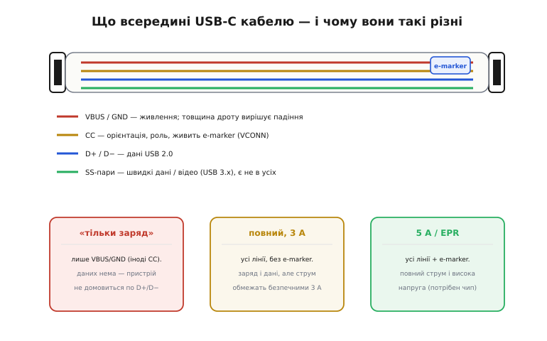
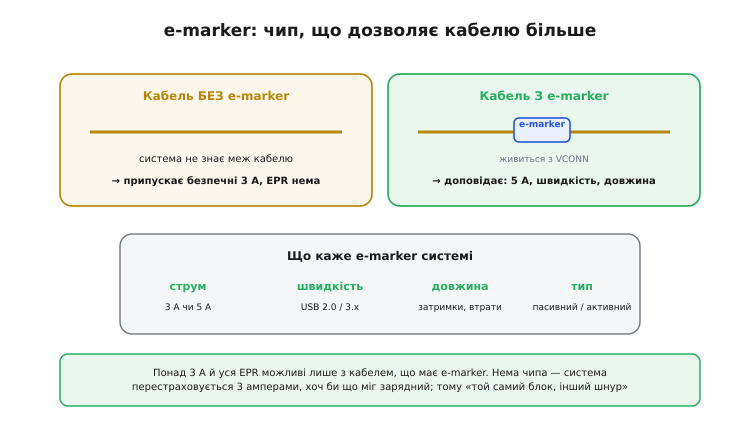
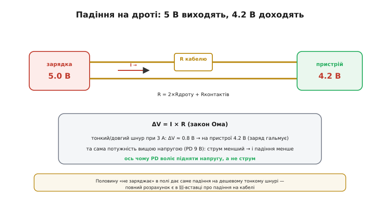
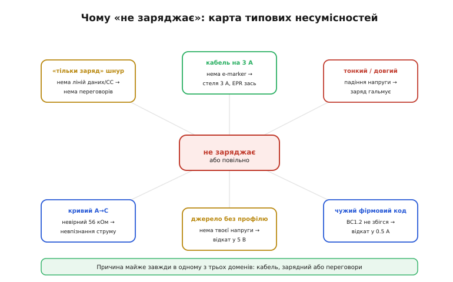
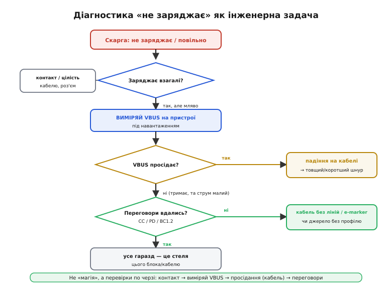
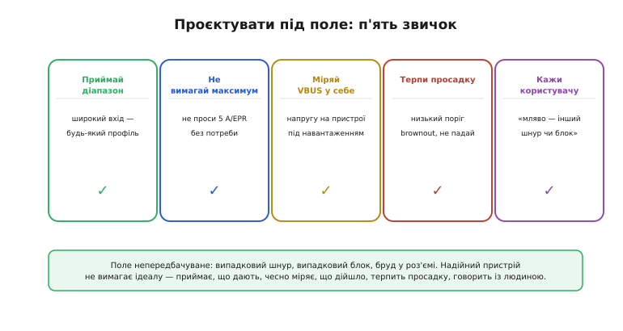

# Кабелі й сумісність

Уся машинерія живлення USB — [резистори CC](root:com-devices/type-c-cc), [профілі PD](root:com-devices/usb-pd), [коди BC1.2](root:com-devices/legacy-charging-dialects) — працює за однієї мовчазної умови: між зарядкою й пристроєм лежить **гідний кабель**. У реальному полі це припущення раз у раз хибне. Користувач бере перший-ліпший шнур із шухляди, тицяє в перший-ліпший блок — і пристрій то заряджається повільно, то не заряджається зовсім, то працює один раз із трьох. Для розробника це не «магія» й не «погана карма», а звичайна **інженерна задача з діагностикою**: у системі є кілька конкретних місць, де щось може піти не так, і їх можна перевірити по черзі.

Ця тема — про останню ланку, яку легко недооцінити: про сам **кабель** і про **сумісність у полі**. Йдеться про те, чому кабелі такі різні й що ховається в чипі e-marker; чому на тонкому довгому шнурі п'ять вольтів перетворюються на чотири з гаком і заряд гальмує; як скласти **карту типових несумісностей** — короткий каталог причин «не заряджає»; і як перетворити все це на **системну діагностику** й на кілька звичок, що роблять наш власний пристрій стійким до випадкового заліза в руках користувача.

### Кабель — не просто дріт

Перше, що варто усвідомити: USB-C кабелі **дуже різні** всередині, хоча штекери однакові. Те, що фізично з'єднує два роз'єми, може бути як повним джгутом з усіма лініями й чипом, так і двома мідними жилками «аби заряджалось».


*У кабелі живуть кілька груп провідників: VBUS/GND (живлення — і саме їхня товщина вирішує падіння напруги), CC (орієнтація, роль, живлення e-marker через VCONN), D+/D− (дані USB 2.0) і швидкі SS-пари (USB 3.x, є не в усіх). Звідси й три типові класи кабелів: «тільки заряд» (часто без даних), повний на 3 А (усі лінії, та без чипа) і повний на 5 А / EPR (з e-marker).*

Самі ці класи прямо визначають, що пристрій узагалі **зможе** зробити. **«Тільки заряд»** — найдешевший: у ньому є VBUS і GND, іноді CC, але нема ліній даних. Заряджати по 5 В він дасть, але **домовитися** по D+/D− ([BC1.2](root:com-devices/legacy-charging-dialects)) пристрій уже не зможе — нема чим. **Повний кабель на 3 А** несе всі лінії й годиться і для даних, і для зарядки, але без чипа e-marker система обмежить струм безпечними трьома амперами. **Кабель на 5 А / EPR** має всередині e-marker і лише він пускає повний струм та високу напругу. Один зовнішній вигляд тут не підказує нічого — два однакові на око шнури можуть належати до різних класів, і саме звідси народжується половина польових загадок.

> 🔧 **Навіщо це.** Коли пристрій поводиться дивно — заряджається повільно, не бачить даних, не бере високу напругу, — перша підозра має падати на **кабель**, а не на пристрій чи зарядку. Найдешевший і найшвидший крок діагностики — замінити шнур на свідомо повноцінний. Дуже часто на цьому історія й закінчується: винним був «зарядний» кабель без потрібних ліній.

Окрема, часто забута частина «кабелю» — самі **роз'єми**. Контакти USB-C пружинні, і з часом вони зношуються, а в кишеньковому пристрої ще й збирають пил, ворс і вологу. Усе це додає **опору контакту**, який стає в один ряд з опором жил і так само з'їдає напругу, а в гіршому разі робить з'єднання **переривчастим**: пристрій то бачить зарядку, то ні, варто кабелю ледь поворухнутися. Тому в діагностиці «не заряджає» поряд із товщиною дроту завжди стоїть і **чистота та цілість роз'ємів** — інколи проблему лікує не новий шнур, а звичайне прочищення гнізда від ворсу.

### e-marker: чип, що дозволяє більше

Чип e-marker (*electronically marked* — «електронно маркований» кабель) живе всередині штекера й тісно пов'язаний із лінією [CC](root:com-devices/type-c-cc). З боку **вибору кабелю** саме він стоїть за буденним «цим шнуром заряджає швидко, а тим — ні».


*Без e-marker система не знає меж кабелю й перестраховується трьома амперами (а EPR не вмикає взагалі). З e-marker чип, живлений від VCONN, доповідає системі реальні дані: який струм кабель тримає (3 чи 5 А), яку швидкість, яку довжину. Тому понад 3 А й уся висока напруга EPR можливі лише з e-marker.*

Логіка тут оборонна. Кабель — теж компонент, і він має межу: тонкі жили не витримають 5 ампер, не перегрівшись, а на велику напругу потрібна відповідна ізоляція. Якщо система **не знає** меж кабелю, вона не має права ризикувати — і чесно припускає найгірше: безпечні 3 ампери, жодної EPR (*Extended Power Range* — «розширений діапазон потужності», вище за звичні 100 Вт). Знати межі вона може лише від **e-marker** — крихітного чипа всередині штекера, що живиться від лінії VCONN (*VCONN* — *configuration channel power*, живлення по тому самому незадіяному [піну CC](root:com-devices/type-c-cc)) і на запит повідомляє паспорт кабелю: струм, швидкість, довжину, тип. Тому правило просте: хочеш понад 3 ампери чи високу напругу EPR ([Power Delivery](root:com-devices/usb-pd)) — потрібен кабель **з e-marker**, і це не забаганка, а вимога безпеки. «Той самий блок, але інший шнур заряджає по-іншому» — майже завжди саме про це: один кабель має чип і паспорт на 5 А, інший — ні.

> 🔧 **Навіщо це.** Це прямо диктує, який шнур класти в коробку з власним пристроєм. Якщо виріб бере понад 3 ампери чи високу напругу, у комплекті має бути кабель **з e-marker** — інакше пристрій ніколи не покаже паспортної швидкості заряду на «правильному» блоці, і користувач звинуватить виріб, а не дешевий шнур. Економія на кабелі тут обертається потоком скарг.

Варто розрізняти й **пасивні та активні** кабелі — це теж зашито в e-marker. Короткий пасивний шнур чудово несе і живлення, і повільні дані USB 2.0 без жодного чипа. Та що довший кабель і що швидші дані, то більше сигнал слабшає в міді — і для високих швидкостей USB 3.x чи 4 потрібен або короткий якісний пасивний кабель з e-marker, або взагалі **активний**, із підсилювачами всередині. Звідси буденний сюрприз: двометровий USB-C шнур може чудово заряджати, але не тягнути швидку передачу даних чи відео. Живлення й швидкі дані — різні вимоги до того самого кабелю, і e-marker існує почасти саме щоб система знала, на що цей конкретний шнур здатен.

### Падіння на дроті

Навіть найдоброякісніший кабель — це **опір**, а опір під струмом з'їдає напругу. Це та сама фізика, що й [закон Ома](root:hw-analog/ohms-law), тільки тепер вона прямо вирішує, зарядиться пристрій чи ні.


*Кабель має опір R (двічі довжина жили плюс опір контактів). Під струмом I на ньому падає ΔV = I × R, тож із 5 В на зарядці до пристрою доходить, скажімо, 4.2 В — і заряд гальмує. Та сама потужність, передана вищою напругою (PD 9 В), іде меншим струмом, тож і падіння менше: ось чому PD воліє підняти напругу, а не струм.*

Механізм прямий: повний струм біжить по VBUS (*VBUS* — *bus voltage*, напруга шини живлення USB) до пристрою й по GND назад, тож працює **подвоєна** довжина жили, плюс опір контактів у двох роз'ємах. На цьому сумарному опорі за [законом Ома](root:hw-analog/ohms-law) падає ΔV = I × R, і ця напруга **не доходить** до пристрою. Що тонший дріт (більший калібр AWG — *American Wire Gauge*, чим більший номер, тим тонша жила) і що довший шнур, то більший опір — і то більша втрата. Полічімо, щоб відчути масштаб.

**Приклад: той самий блок, два різні шнури.** Зарядка дає чесні 5.0 В. Порівняймо короткий товстий і довгий тонкий кабель при струмі заряду 3 А.

```
ΔV = I × R,   R ≈ 2×(довжина×опір жили) + Rконтактів

Шнур A — 1 м, товста жила (~24 AWG):
   R  ≈ 2 × 0.085 + 0.1 ≈ 0.27 Ом
   ΔV = 3 А × 0.27 ≈ 0.8 В  → на пристрої 5.0 − 0.8 = 4.2 В  (ще терпимо)

Шнур B — 2 м, тонка жила (~28 AWG):
   R  ≈ 2 × (2×0.21) + 0.1 ≈ 0.95 Ом
   ΔV = 3 А × 0.95 ≈ 2.0 В  → на пристрої 5.0 − 2.0 = 3.0 В  (заряд СТАЄ)

Та сама потужність 15 Вт, але вищою напругою PD 9 В:
   I  = 15 / 9 ≈ 1.67 А  (струм менший!)
   на шнурі A: ΔV = 1.67 × 0.27 ≈ 0.45 В  → лише 5% від 9 В
```

Висновок видно очима: на тонкому довгому шнурі при 3 амперах пристрій бачить уже не 5, а **3 вольти** — і заряджання просто зупиняється, хоча і зарядка, і пристрій справні. А той самий ват можна доставити **меншим струмом**, піднявши напругу через PD, — і тоді падіння на тому ж кабелі стає майже непомітним. Це і є глибинна причина, чому [Power Delivery](root:com-devices/usb-pd) воліє підвищувати напругу, а не струм: висока напруга «прощає» поганий кабель.

> 🧮 **Розрахунок — у вставці.** Повне виведення падіння на кабелі — звідки беруться опір жили, опір контактів і чому половина проблем «не заряджає» родом саме звідси — є в окремій [математичній вставці про падіння на кабелі](root:embedded/usb-cables-field/math-cable-drop.md). Там і таблиця опорів за калібром AWG, і як прикинути втрату для свого шнура.

### Карта типових несумісностей

Причини «не заряджає» зручно зібрати в один каталог — їх **скінченна** кількість, і кожна належить до одного з трьох доменів: кабель, зарядний або переговори.


*Шість найчастіших причин: шнур «тільки заряд» (нема ліній — нема переговорів), кабель без e-marker (стеля 3 А), тонкий/довгий (падіння напруги), кривий A→C-перехідник з невірним резистором 56 кОм, джерело без потрібного PD-профілю (відкат у 5 В) і чужий фірмовий код BC1.2 (відкат у 0.5 А). Майже все зводиться до трьох доменів: кабель, зарядний, переговори.*

Розберімо кожну. **Шнур «тільки заряд»** не має ліній даних чи CC — пристрій не може провести переговори й лишається на голих 5 В або взагалі ні з чим. **Кабель без e-marker** обмежує струм трьома амперами, хоч би що міг блок. **Тонкий чи довгий** шнур з'їдає напругу падінням, як у розрахунку вище. **Кривий A→C-перехідник** із неправильним [резистором CC](root:com-devices/type-c-cc) — замість потрібних 56 кОм у плечі Rp (*pull-up resistor*, підтяжка від джерела, що оголошує його струм) — збиває визначення струму. У поганих випадках він прикидається повноцінним C-портом і змушує пристрій тягнути з кволого A-порту більше, ніж той дає, аж до вигоряння порту чи живлення хоста. **Джерело без потрібного [PD-профілю](root:embedded/pd-sink-design)** відкочує пристрій у 5 В. **Чужий фірмовий код** [легасі-зарядки](root:com-devices/legacy-charging-dialects) не збігається — і пристрій падає в обережні 0.5 А. Шість причин, три домени — і жодної містики.

> 🔧 **Навіщо це.** Найнебезпечніша в цьому списку — саме пастка з резистором у A→C-кабелі: погано зроблений шнур не лише повільно заряджає, а **псує залізо**. Тому в проєкті власного пристрою CC-логіку (Rp/Rd — підтяжку від джерела й стяжку Rd, *pull-down resistor*, на боці споживача) лишають мікросхемі-контролеру, а не «двом резисторам навмання»: правильні номінали тут — це різниця між «заряджається» і «згорів USB-контролер».

Підступність поля ще й у тому, що причини **складаються**. Кабель на 3 А без e-marker сам по собі лише обмежить струм, але разом зі слабким блоком без потрібного профілю дасть уже подвійний недобір; тонкий шнур плюс брудний роз'єм складуть свої падіння в одне. Через це «полагодив одне, а легше не стало» — звична картина: насправді винних було двоє, і відсікати їх треба по черзі, а не сподіватися на єдину чарівну причину. Саме тому діагностика — це **послідовність перевірок**, а не один постріл навмання.

### Діагностика по кроках

Головне вміння теми — перетворити невиразну скаргу «не заряджає» на **впорядковану перевірку**. Замість тицяти навмання, інженер іде по дереву рішень, відсікаючи домени один за одним.


*Чотири перевірки по черзі. Заряджає взагалі? Ні — дивись контакт і цілість кабелю. Заряджає, але мляво — виміряй VBUS на пристрої під навантаженням. Просідає — це падіння на кабелі (товщий/коротший шнур). Тримається, але струму мало — не вдалися переговори (лінії чи профіль). Усе гаразд, а більше не дає — це чесна стеля цього блока й кабелю.*

Ключ до всього — **виміряти VBUS на боці пристрою, під навантаженням** (а не на блоці й не без струму, [мультиметром](root:hw-sensing/multimeter)). Це одне вимірювання одразу розділяє дві зовсім різні хвороби. Якщо напруга під струмом **просідає** — винен **кабель** (тонкий, довгий чи поганий контакт), і лікується це товщим або коротшим шнуром. Якщо ж VBUS **тримається**, а струму все одно мало — справа не в дроті, а в **переговорах**: не вдалося домовитися по CC/PD/BC1.2, бо кабель без потрібних ліній чи e-marker, або джерело не має нашого профілю. І лише коли і напруга тримається, і переговори пройшли, а більше пристрій не бере — це чесна **стеля** саме цього блока з цим кабелем, і шукати тут більше нема чого. Така послідовність економить години: вона щоразу каже, **де саме** копати, замість навмання міняти то шнур, то блок, то пристрій.

> 🔧 **Навіщо це.** Та сама логіка стає в пригоді й тоді, коли скаржитимуться на **ваш** пристрій. Замість приймати «не заряджається» на віру, попросіть виміряти VBUS на пристрої під навантаженням — і ви за одну цифру відрізните проблему кабелю від проблеми переговорів, не тримаючи виріб у руках. Це перетворює підтримку з ворожіння на діагностику.

Найпідступніший клас скарг — не «ніколи», а «**раз із трьох**»: пристрій то заряджається, то ні. Такі переривчасті відмови майже завжди означають, що система працює **на межі** — гранична просадка чи граничний контакт, який перехиляється від дрібниці. Варто змінитися струму (а він міняється сам по собі, бо батарея в міру заряду бере його то більше, то менше), ледь нагрітися роз'єму чи поворухнутися кабелю — і хитка рівновага падає в «не заряджає». Лікують це не пошуком одного винного, а **збільшенням запасу**: товщий шнур, чистий роз'єм, нижчий поріг brownout — усе, що відсуває систему від краю, де дрібна випадковість вирішує результат. Переривчасте — це майже завжди «впритул», а не «зламано».

### Проєктувати під поле

Знаючи всі ці пастки, грамотний розробник проєктує пристрій так, щоб той **прощав** користувачеві випадкове залізо. Кілька простих звичок складаються тут у єдину настанову.


*П'ять звичок надійного пристрою: приймай діапазон напруг (широкий вхід); не вимагай максимуму (не проси 5 А чи EPR без потреби — менше залежиш від кабелю); міряй VBUS у себе під навантаженням; терпи просадку (низький поріг brownout, не падай від 4.5 В); і чесно кажи користувачу «повільно — спробуй інший шнур чи блок», а не мовчи загадково.*

Кожна звичка б'є по конкретній пастці. **Приймай діапазон** — широкий вхід (як у [дизайні PD-споживача](root:embedded/pd-sink-design) чи [павербанка-джерела](root:hw-power/powerbank-source)) робить пристрій байдужим до того, який саме профіль дала зарядка. **Не вимагай максимуму** — якщо вистачає 3 А й 9 В, не проси 5 А чи EPR, бо тоді менше шансів спіткнутися об кабель без e-marker. **Міряй VBUS у себе**, а не покладайся на напис на блоці, — лише так дізнаєшся, що насправді **дійшло**. **Не падай від просадки** — тримай низький поріг brownout, щоб тимчасові 4.5 В не валили пристрій. І **кажи користувачу** правду: коротке «заряджаю повільно, спробуй інший шнур» рятує і його нерви, і вашу репутацію куди краще за німу загадку. Усе це разом коштує дрібниць на етапі проєктування, а в полі обертається на пристрій, що «просто працює» з чим завгодно.

### Підсумок теми

Кабель — повноцінний компонент системи, а не випадковий дріт: він буває «тільки заряд» (без переговорів), на 3 А (без e-marker) чи на 5 А/EPR (з чипом), і на око їх не розрізнити. **e-marker** — це паспорт кабелю: без нього система перестраховується 3 амперами й не дає EPR. Будь-який шнур має **опір**, і під струмом на ньому падає ΔV = I × R за [законом Ома](root:hw-analog/ohms-law) — на тонкому довгому кабелі 5 В легко стають 4 чи навіть 3, і заряд гальмує; вища напруга PD рятує, бо несе ту саму потужність меншим струмом. Причин «не заряджає» — скінченний каталог із трьох доменів (кабель, зарядний, переговори), а розплутує їх одне вимірювання: **VBUS на пристрої під навантаженням** ділить хворобу на «падіння в кабелі» та «невдалі переговори». І, нарешті, надійний пристрій проєктують **під поле**: приймати діапазон, не вимагати максимуму, міряти напругу в себе, терпіти просадку й чесно говорити з користувачем. Завдяки цьому USB перестає бути «просто роз'ємом для зарядки» й стає зрозумілою системою домовленостей, у якій можна і брати потрібну потужність, і роздавати її, і лагодити, коли щось не зрослося.
