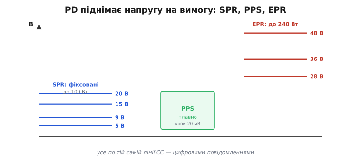

# Карта живлення USB у деталях: повна драбина профілів і як рахується стеля

Базова карта дає каркас: драбина від 2.5 до 240 ват, три способи спитати про струм, живлення розв'язане з даними. Тут той самий краєвид, але з висоти, на якій видно кожен щабель і кожне число. Мета — щоб, тримаючи в руках конкретний порт, конкретний кабель і конкретний пристрій, ти міг **порахувати реальну стелю** живлення й знати, звідки взялося кожне обмеження. Механіку окремих механізмів (як саме фізично працюють [резистори CC](root:com-devices/type-c-cc), як [веде переговори PD](root:com-devices/usb-pd), що [сидить у кабелі](root:embedded/usb-cables-field)) тут не переписуємо — на неї є окремі теми; ця стаття лишається **картою**, тільки докладною: усі профілі, усі стелі й логіка, що зводить їх докупи.

## Чому всюди постає одне рівняння: P = U · I

Перш ніж розкладати профілі, варто закріпити єдину думку, з якої випливає вся карта. Будь-яка передача потужності через USB підкоряється P = U · I, і кожне обмеження сидить в одному з трьох місць: стеля **струму** (її ставить кабель і контакти), стеля **напруги** (її ставить профіль, на який згодилися сторони) і стеля **потужності** (добуток перших двох, плюс теплова витривалість джерела). Уся «розумна зарядка» — це пошук найвищого добутку U · I, який одночасно влазить під усі три стелі.

```text
обмеження струму:    I ≤ I_кабель   (3 А без e-marker, 5 А з ним)
обмеження напруги:   U ∈ {профілі, що пропонує джерело}
обмеження потужності: P = U · I ≤ P_джерела
```

Звідси й випливає головна стратегія драбини — **рости напругою**. Струмова стеля майже завжди впирається в дешевий кабель (3 А), тож єдиний спосіб узяти більше ват — підняти U. Саме тому профілі PD — це передусім перелік дозволених **напруг**, а не струмів: напруга — це та вісь, якою безпечно лізти вгору.

> 🔧 **Навіщо це.** Коли пристрій «заряджається повільно», діагностика завжди зводиться до цих трьох стель: котра з них спрацювала першою? Часто це не джерело й не пристрій, а струмова стеля кабелю — і тоді ні потужніша зарядка, ні кращий контролер не допоможуть, доки не зміниш кабель.

## Повна драбина профілів PD: SPR і EPR

PD пропонує живлення **профілями** — у стандарті їх звуть PDO (англ. *Power Data Object* — об'єкт-опис джерела живлення). Джерело оголошує список своїх PDO, пристрій вибирає один. Профілі діляться на два діапазони: класичний **SPR** (Standard Power Range) до 100 Вт і новий **EPR** (Extended Power Range) до 240 Вт.

### Фіксовані профілі SPR

Серце SPR — чотири фіксовані напруги. Стандарт вимагає, щоб джерело, оголосивши вищий щабель, підтримувало й усі нижчі (зарядка на 20 В мусить уміти й 5, і 9, і 15 В), — тому драбина суцільна, без дір.

```text
профіль   напруга   типовий струм   потужність
fixed 5V    5 В      до 3 А          15 Вт
fixed 9V    9 В      до 3 А          27 Вт
fixed 15V   15 В     до 3 А          45 Вт
fixed 20V   20 В     3 А             60 Вт   (кабель без e-marker)
fixed 20V   20 В     5 А             100 Вт  (потрібен e-marked кабель)
```

Зверни увагу на злам на 20 вольтах: той самий профіль дає **60 або 100 ват** залежно від кабелю. 100 Вт = 20 В × 5 А, а 5 ампер несе лише кабель з e-marker; без нього стеля падає до 3 А, тобто 60 Вт. Це найчастіша причина, чому «100-ватна зарядка» віддає лише 60: не та зарядка й не той пристрій, а кабель без чипа.

### Високовольтні профілі EPR

Коли 100 Вт замало (потужні ноутбуки, монітори з живленням), вступає EPR і додає три нові фіксовані щаблі **поверх** SPR:

```text
профіль    напруга   струм   потужність
fixed 28V   28 В      5 А     140 Вт
fixed 36V   36 В      5 А     180 Вт
fixed 48V   48 В      5 А     240 Вт
```

Усі три EPR-щаблі — це 5 ампер при дедалі вищій напрузі, і всі вимагають **EPR-кабелю** (e-marked, та ще й маркованого саме на EPR-струм при високій напрузі). Тут добре видно філософію драбини в чистому вигляді: щоб подвоїти потужність зі 100 до 240 Вт, струм лишили майже тим самим (5 А), а напругу підняли з 20 до 48 В. Гнати 240 Вт на 20 вольтах означало б 12 ампер — струм, який жоден USB-кабель не протягне.


*Уся драбина PD: фіксовані щаблі SPR і EPR — це дискретні напруги при майже сталому струмі 5 А, а зростання потужності йде вгору по напрузі. PPS заповнює проміжки плавно.*

## Як пристрій читає й вибирає профіль

Драбина профілів — це не те, що пристрій бере як даність: він **дізнається** її щоразу від конкретного джерела. Щойно укладено базовий зв'язок, джерело надсилає свій список PDO — упорядкований перелік усього, що воно вміє: спершу обов'язковий fixed 5V, далі вищі фіксовані щаблі, тоді (якщо є) діапазони PPS, а в EPR-джерелі — ще й високовольтні щаблі та AVS. Пристрій читає цей список і **вибирає один** запис, що найкраще лягає під його потребу й під стелю кабелю.

Логіка вибору на боці пристрою проста за ідеєю: пройди список згори вниз, відкинь усе, що понад твою вхідну витривалість (немає сенсу просити 48 В, якщо вхід тримає 24), відкинь те, що кабель не протягне струмом, і з решти візьми профіль, який дає найбільшу корисну потужність. Якщо джерело пропонує і фіксований 20 В, і PPS-діапазон до 21 В, для зарядки батареї пристрій радше візьме PPS (плавність), а для живлення сталого навантаження — фіксований щабель (простота). Тобто **один і той самий список** двоє різних пристроїв прочитають по-різному, бо в кожного своя мета.

```text
список PDO від джерела (приклад 100-ватної зарядки):
  1) fixed   5 В / 3 А
  2) fixed   9 В / 3 А
  3) fixed  15 В / 3 А
  4) fixed  20 В / 5 А
  5) PPS  3.3–21 В / 5 А
пристрій-ноутбук (вхід до 20 В, кабель 5 А) → вибере №4 (100 Вт)
телефон, що живить банку напряму         → вибере №5 (плавно веде напругу)
```

Тут і ховається ще одна причина «повільної зарядки», тонша за кабель: **списки не перетнулися**. Якщо пристрій уміє лише PPS на високому струмі, а зарядка пропонує тільки фіксовані щаблі, вони зійдуться на найнижчому спільному — 5 В — і потужність буде куца. Сумісність по USB-живленню — це завжди **перетин** двох списків можливостей, а не сума; реальна стеля дорівнює найкращому профілю, що є **в обох** сторін і ще влазить у кабель.

> 🔧 **Навіщо це.** Проєктуючи пристрій, ти задаєш не одне число «скільки ват», а **набір прийнятних профілів** і їхній пріоритет. Від цього залежить, з якими зарядками твій виріб зарядиться швидко, а з якими — ледь повзтиме. Звужений набір (лише екзотичний профіль) робить пристрій вибагливим до зарядок; широкий, із розумним фолбеком на нижчі щаблі, — усеїдним.

## Між щаблями: PPS і AVS

Фіксовані профілі — це сходи з дискретними щаблями. Але батарея не любить сходів: щоб заряджати її швидко й не гріти, напругу треба підкручувати **плавно**, слідом за тим, як росте напруга на самій банці. Для цього PD має два режими плавного живлення — PPS у SPR і AVS у EPR.

**PPS** (Programmable Power Supply) працює в діапазоні SPR. Замість фіксованої напруги джерело оголошує **діапазон** (наприклад, 3.3–11 В чи 3.3–21 В), а пристрій просить будь-яку напругу всередині нього з кроком **20 мВ** і задає стелю струму з кроком **50 мА**. Це перетворює зарядку на кероване джерело: пристрій сам, мікрокроками, веде напругу вслід за батареєю.

**AVS** (англ. *Adjustable Voltage Supply* — регульоване джерело напруги) — це той самий принцип, але для EPR: плавна напруга від 15 В до 48 В із грубшим кроком **100 мВ**. AVS дає високовольтну гнучкість там, де PPS уже не дістає (PPS не лізе вище ~21 В).

```text
режим   діапазон напруги   крок напруги   де живе
PPS     ~3.3 … 21 В         20 мВ          SPR
AVS     15 … 48 В           100 мВ         EPR
```

Покажемо плавність на числах. Банка Li-ion під час заряджання поволі повзе від ~3.4 до 4.2 В, і живити її хочеться напругою на крихту вищою — рівно щоб гнати потрібний струм крізь невеликий опір кола. На фіксованих щаблях найближчий — 5 В, тож надлишок (5 В мінус напруга банки) довелося б палити на стабілізаторі як тепло. PPS прибирає цей надлишок:

```text
стан банки   треба на вході   фіксований 5 В         PPS-запит
3.4 В        ~3.6 В           палить 1.4 В на тепло  просить 3.6 В
3.8 В        ~4.0 В           палить 1.0 В           просить 4.0 В
4.2 В        ~4.4 В           палить 0.6 В           просить 4.4 В
```

Видно, що PPS дозволяє зарядці **їхати слідом** за банкою з кроком 20 мВ, тримаючи надлишок майже нульовим, — тому й тепла майже немає. Це і є фізичний сенс плавного профілю: не «трохи зручніше», а принципово менші втрати, бо зникає каскад, що палив різницю напруг.

> 🔧 **Навіщо це.** PPS — це те, що дає змогу живити банку Li-ion **напряму**, без лінійного стабілізатора між зарядкою й батареєю: контролер просить у зарядки рівно ту напругу, що потрібна банці зараз, і керує струмом, рухаючи цей запит. Менше каскадів — менше тепла й вищий ККД. Саме тому «швидка зарядка» телефонів спирається на PPS, а не на фіксовані щаблі.

## Як відмикається висока напруга EPR

Високовольтні щаблі EPR (28/36/48 В) не з'являються просто тому, що зарядка їх уміє. Перш ніж пустити на дріт 48 вольтів, система мусить упевнитися, що **весь ланцюг** їх витримає, — і ключова ланка тут кабель. Тому EPR-щаблі стають доступні лише тоді, коли джерело **впізнало EPR-здатний кабель**: той самий e-marker не лише каже «тримаю 5 А», а й заявляє, що розрахований на високу напругу EPR. Немає такого кабелю — і драбина обрізається на SPR (до 20 В / 100 Вт), хоч би яка потужна була зарядка.

Логіка тут та сама, що з обмеженням струму без e-marker, тільки суворіша: ціна помилки на 48 вольтах вища, ніж на 20, тож систему свідомо роблять боягузливою. Послідовність відмикання EPR така: базовий зв'язок на 5 В → джерело й кабель підтверджують EPR-здатність → лише тоді в списку профілів узагалі з'являються 28/36/48 В → пристрій просить потрібний. Якщо будь-яка ланка (джерело, кабель, пристрій) не тягне EPR, висока напруга просто **не пропонується** — її немає в переліку, тож і помилково взяти її не можна.

```text
ланцюг для 240 Вт:
  джерело вміє EPR  +  кабель EPR-marked  +  пристрій просить 48 В
  будь-яка ланка ні → стеля падає до SPR (≤ 20 В / 100 Вт)
```

> 🔧 **Навіщо це.** Якщо твій виріб цілиться в EPR (понад 100 Вт), у комплект кладуть **саме EPR-кабель**, а не просто «товстий» 5-амперний — без EPR-маркування кабелю висока напруга не відімкнеться взагалі, і пристрій застрягне на 100 ватах. Це найчастіша пастка проєктування потужних USB-C-виробів.

## Чому до контракту завжди 5 вольтів

Через усю драбину червоною ниткою проходить одне правило безпеки: **поки сторони не уклали контракт, на VBUS лише 5 вольтів** (так звана `vSafe5V`). Це не дрібниця стандарту, а фундамент усієї системи. Уяви протилежне: зарядка подавала б 48 В одразу, «про всяк випадок». Тоді будь-який старий 5-вольтовий пристрій, увіткнутий у неї, згорів би тієї ж миті. Тому послідовність завжди така: спершу безпечні 5 В → пристрій читає, що пропонує джерело → просить профіль → і **лише після згоди** джерело піднімає напругу, а після від'єднання негайно валить її назад до 5 В.

Звідси практичний наслідок для проєктування входу: вхідний каскад пристрою, що вміє PD, мусить пережити **миттєвий перехід** напруги між щаблями (5 → 20 В і назад) і ніколи не подавати на навантаження більше, ніж воно стерпить, доки контракт не підтверджено. Деталі цього рукостискання — повідомлення, таймери, ролі — у [темі про сам протокол PD](root:com-devices/usb-pd); на рівні карти досить пам'ятати інваріант: **висока напруга буває тільки за явною згодою, базова — завжди 5 В**.

## Бюджет безпеки: чого має чекати вхід пристрою

Карта профілів каже, які напруги **можуть** з'явитися на VBUS, — а отже, диктує, до чого має бути готовий вхідний каскад пристрою. Це місток від «що пропонує драбина» до «як не спалити свій виріб». Думати тут варто межами, а не типовими значеннями.

Перша межа — **максимальна напруга**. Якщо пристрій PD-споживач і просить, скажімо, лише до 20 В, його вхід усе одно мусить стерпіти ситуацію, коли щось пішло не так і на VBUS опинилося більше, ніж очікувалось. Тому вхідний захист закладають із запасом над найвищим профілем, який пристрій узагалі здатен попросити, а не над «номінальним». Друга межа — **перехідні стрибки**: між профілями напруга міняється сходинкою (5 → 20 В), і вхідний конденсатор та захист мусять пережити цей фронт без дзвону, що вилетить за межу.

```text
що подаватиме джерело     до чого готувати вхід
5 В до контракту          штатно, завжди
стрибок 5 → обраний В      фронт без перельоту за межу захисту
обраний профіль (≤ 48 В)   тривала робота на цій напрузі
зрив контракту → 5 В       миттєве падіння, без провалу живлення плати
```

Симетрично з боку **струму**: профіль обіцяє стелю (3 чи 5 А), але справжній захист від перевантаження (OCP) і короткого замикання лежить і на джерелі, і на пристрої. Джерело за стандартом мусить обмежити струм і зняти напругу, якщо пристрій тягне понад домовлене; пристрій, своєю чергою, не має права брати понад те, на що погодився, інакше джерело піде в захист і зв'язок обірветься. Тонкощі того, **як саме** джерело стежить за струмом і напругою, — це вже [внутрішній устрій PD](root:com-devices/usb-pd); на рівні карти важливо інше: дозволений профіль — це **контракт із двома підписами**, і порушення стелі будь-якою стороною розриває живлення, а не «просто дає трохи більше».

> 🔧 **Навіщо це.** Найдорожча помилка проєктування входу — розрахувати каскад на «свою» напругу (скажімо, 5 В), а потім випадково чи через дефект отримати 20. Тому вхідний транзистор, конденсатори й супресор беруть під найвищу напругу, яку пристрій може **попросити** чи **випадково побачити**, а не під ту, що очікується в нормі. Драбина профілів — це і є перелік напруг, проти яких треба загартувати вхід.

## Три механізми поруч: коли який спрацьовує

Базова карта називає три способи спитати про струм. Тут зведемо їх в одну таблицю-порівняння — з тим, що кожен дає й чого не дає, бо реальний пристрій часто мусить підтримувати кілька й вибирати найкращий доступний.

```text
механізм        порт            як питає                стеля        напруга
BC 1.2          A / micro       рівні на D+/D−          ~1.5 А       5 В
резистори CC    Type-C          напруга дільника Rp/Rd  3 А          5 В
USB-PD          Type-C          цифрові повідомлення    5 А          5…48 В
```

Логіка вибору в пристрої така: спершу він дивиться на **тип роз'єму**. Якщо це Type-C, у нього на лінії CC вже є резистори, тож базові 5 В і до 3 А доступні **одразу й пасивно** — навіть до того, як прокинеться будь-яка прошивка. Якщо ж пристрій хоче більше за 15 Вт або іншу напругу, він **поверх** цього починає PD-переговори по тій самій CC. А якщо роз'єм старий (A чи micro), CC немає взагалі, і єдиний доступний механізм — [угода BC 1.2](root:com-devices/legacy-charging-dialects) по лініях даних, зі скромною стелею 1.5 А при 5 В.

Важлива деталь сумісності: ці механізми **не конфліктують**, а нашаровуються. Type-C-зарядка, щоб годувати старі пристрої без CC, часто додатково реалізує й BC 1.2 на лініях даних. Тому той самий фізичний порт може віддати 1.5 А тупому старому телефону (через D+/D−) і 100 Вт ноутбуку (через PD по CC) — кожному за його розумінням. Як це використати з боку пристрою-споживача, на готовому контролері, — у [темі про PD-sink](root:embedded/pd-sink-design).

## Наскрізний приклад: рахуємо стелю для конкретного випадку

Зберемо всю карту в один практичний розрахунок. Маємо: ноутбук, що просить 90 Вт, зарядку з профілями до 20 В / 5 А (100 Вт), і — варіант А — дешевий кабель на 3 А, варіант Б — e-marked кабель на 5 А. Питання: яку потужність реально отримає ноутбук у кожному разі й чому.

:::tabs
```c
// Вхідні дані сценарію
const float P_want   = 90.0f;   // Вт — апетит ноутбука
const float V_max    = 20.0f;   // В  — найвищий профіль зарядки
const float I_src    = 5.0f;    // А  — стеля зарядки на 20 В

float pick_ceiling(float i_cable) {
    // на найвищій напрузі стеля струму = мінімум(зарядка, кабель)
    float i_lim = (i_cable < I_src) ? i_cable : I_src;
    return V_max * i_lim;        // максимум ват на цьому профілі
}

float P_caseA = pick_ceiling(3.0f); // дешевий кабель: 20 × 3 = 60 Вт
float P_caseB = pick_ceiling(5.0f); // e-marked:      20 × 5 = 100 Вт
// А: стеля 60 Вт < 90 → ноутбук заряджається повільно (просяде запит до 60 Вт).
// Б: стеля 100 Вт ≥ 90 → ноутбук бере свої 90 Вт (18 В·5 А чи 20 В·4.5 А — як домовляться).
```
```python
# Вхідні дані сценарію
P_want = 90.0   # Вт — апетит ноутбука
V_max  = 20.0   # В  — найвищий профіль зарядки
I_src  = 5.0    # А  — стеля зарядки на 20 В

def pick_ceiling(i_cable: float) -> float:
    # на найвищій напрузі стеля струму = мінімум(зарядка, кабель)
    i_lim = min(i_cable, I_src)
    return V_max * i_lim         # максимум ват на цьому профілі

P_caseA = pick_ceiling(3.0)  # дешевий кабель: 20 × 3 = 60 Вт
P_caseB = pick_ceiling(5.0)  # e-marked:      20 × 5 = 100 Вт
# А: стеля 60 Вт < 90 → ноутбук заряджається повільно (просяде запит до 60 Вт).
# Б: стеля 100 Вт ≥ 90 → ноутбук бере свої 90 Вт (18 В·5 А чи 20 В·4.5 А — як домовляться).
```
:::

```text
варіант А (кабель 3 А): стеля = 20 × 3 = 60 Вт  → 90 Вт не вийде, повільно
варіант Б (кабель 5 А): стеля = 20 × 5 = 100 Вт → 90 Вт доступні, повна швидкість
```

Висновок прямий і повчальний: **та сама зарядка й той самий ноутбук** дають різний результат лише через кабель. У варіанті А винна не потужність зарядки (її 100 Вт ніде не діли) і не апетит ноутбука — винна струмова стеля кабелю, що зрізала добуток U · I до 60 Вт. Це і є вся карта живлення USB в одному прикладі: спершу знайди, котра з трьох стель (струм кабелю, напруга профілю, потужність джерела) спрацює першою, — вона й визначає реальну потужність.

> 🔧 **Навіщо це.** Цей розрахунок — готовий чекліст для діагностики й для комплектації виробу. Якщо твій пристрій має брати понад 60 Вт, у коробку **обов'язково** кладуть e-marked кабель: інакше користувач зі своїм старим шнуром отримає 60 Вт і подумає, що пристрій несправний. Стеля живлення — це властивість усього ланцюга «зарядка + кабель + пристрій», а не лише зарядки.

## Карта працює в обидва боки: брати й давати

Уся розмова досі йшла від імені пристрою, що **бере** живлення. Та з USB-C карта симетрична: той самий роз'єм дозволяє пристрою й **давати** струм. Ноутбук може живити телефон, а може сам живитися від док-станції; павербанк то віддає заряд у телефон, то набирає його від зарядки. Тому повне питання карти — не лише «скільки можу взяти», а й дзеркальне «скільки маю віддати й кому».

На рівні драбини це означає, що сторона-джерело **оголошує** список профілів, а сторона-споживач **вибирає** з нього, — і обидві ролі живуть на тому самому роз'ємі. Хто з двох стане джерелом, а хто споживачем, сторони теж узгоджують (за замовчуванням джерело — той, хто має зарядку, але роль можна й поміняти). Для проєктувальника це питання «який бік я будую»: якщо пристрій **тільки бере** (звичайний гаджет), йому досить вибирати профіль з чужого списку — про це [тема pd-sink](root:embedded/pd-sink-design); якщо пристрій **віддає** (зарядка, [павербанк](root:hw-power/powerbank-source)), він мусить сам сформувати чесний список PDO й гарантувати кожен оголошений щабель струмом і захистом.

```text
роль          що робить зі списком профілів
джерело (src) оголошує PDO й тримає кожен оголошений щабель
споживач (snk) вибирає один профіль, що влазить під його межі
USB-C: ролі на тому самому роз'ємі, узгоджуються при з'єднанні
```

> 🔧 **Навіщо це.** Перше архітектурне рішення потужної частини виробу — це «беру / даю / і те, і те». Воно визначає, чи потрібен лише sink-контролер, чи ще й здатність бути джерелом із чесними PDO. Помилка тут найдорожча: оголосити профіль, який не можеш утримати струмом, — гірше, ніж не оголосити його взагалі, бо споживач повірить і перевантажить твоє джерело.

## Що лишається поза картою

Ця карта свідомо не залазить у три сусідні теми, і варто знати межу. **Фізична механіка роз'єму** — розпіновка двадцяти чотирьох контактів, дзеркальні половини, як визначається орієнтація — це [тема про сам конектор](root:com-devices/usb-c-connector). **Внутрішній устрій протоколу PD** — формати повідомлень, кінцевий автомат, таймінги, ролі джерела й споживача — у [темі про PD](root:com-devices/usb-pd). **Кут мікроконтролера-споживача** — як саме прошивка читає стан і керує контролером — у [темі про USB як джерело живлення для МК](root:com-devices/usb-power). Карта показує **що** доступно й **скільки**; кожне «**як** саме воно влаштоване» має свою адресу. Тримати цю межу важливо: інакше карта розпухне в переказ усіх сусідніх тем і втратить головну чесноту — давати цілісний огляд драбини з одного погляду.
