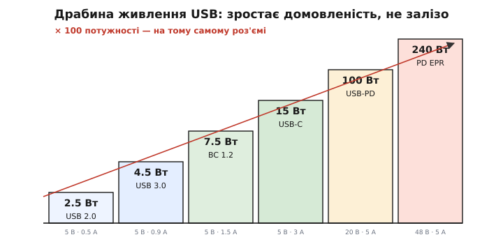
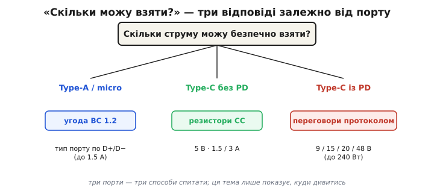

# Від 500 мА до 240 Вт: карта живлення через USB

<preknowlist>
- [USB як джерело живлення](topic:programming/usb-power) — USB несе не лише дані, а й 5 вольтів, якими можна живити пристрій.
</preknowlist>

USB ми вже знаємо як шину даних, що [заодно несе 5 вольтів](topic:programming/usb-power) — звідти беруться вольти для мишки чи флешки. Та за одне десятиліття той самий роз'єм із кволого «джерела для дрібнички» виріс у інтерфейс, що годує ноутбук: потужність піднялася **на два порядки** — з 2.5 до 240 ват, — а штекер фізично майже не змінився. Як таке можливо? Бо зросло не залізо, а **домовленість** про те, скільки можна взяти.

Тут і ховається головна думка всієї теми, тож перелаштуймо мислення одразу. Звична розетка чи батарея — **тупе** джерело: напруга на ній стоїть завжди, бери скільки хочеш до межі. USB — інше. Це **домовлене** джерело: скільки на ньому напруги й дозволеного струму, залежить від **розмови** між пристроєм і портом. Сам порт обережний — тримає лише безпечні 5 вольтів і малий струм, доки пристрій не доведе право на більше. Тому «живити пристрій від USB» означає не просто «під'єднати 5 В», а навчити його спершу **спитати**, а вже тоді взяти. Ця тема — карта тієї розмови: драбина, до якої вона доросла, і способи, якими пристрій питає джерело «скільки даси?».

## Драбина потужності: та сама, що виросла на домовленостях


*Той самий роз'єм — на два порядки більша потужність. USB 2.0 давав 2.5 Вт, базовий USB-C — 15 Вт, USB PD — 100 Вт, а новітній PD EPR — аж 240 Вт. Зросло не залізо, а домовленість про те, скільки можна взяти.*

Живлення через USB пройшло цілу драбину, і кожен щабель на ній — не нове залізо, а нова домовленість про напругу чи струм. Найнижчий — **USB 2.0**: 5 вольтів, 500 міліампер, разом **2.5 Вт**, рівно на мишку чи флешку, заради яких живлення й додали до шини даних. Далі окрема угода дозволила брати більший струм для зарядки, сам **USB-C** без жодного протоколу підняв межу до 15 ват, а протокол **USB Power Delivery** (англ. *power delivery* — доставляння потужності; скорочують PD) зніс стелю зовсім: спершу до 100 ват, а в новітній версії з розширеним діапазоном — аж до **240 ват**, чого досить навіть потужному ноутбуку.

Ключове тут — уся ця драбина живе на **тому самому** фізичному кабелі. Між 2.5 і 240 ватами немає нового заліза; є дедалі розумніша розмова про те, скільки взяти. І ці домовленості з'явилися не самі собою: [спільний зарядний вибороли п'ятнадцять років](root:embedded/usb-power-map/hist-one-charger.md) консорціуми, стандартизатори й регулятори — вся драбина потужності є закам'янілим слідом тієї повільної боротьби за спільну мову.

Одну сходинку цієї логіки варто пройти явно, бо на ній тримається весь верх драбини: чому потужність нарощують переважно **напругою**, а не струмом? Бо струм у тонкому дроті впирається в тепло. [Дріт гріється](topic:physics/joule-heating) як I²·R, і подвоївши струм, учетверо збільшуєш втрати на ньому; тонкий USB-кабель фізично не протягне десятки ампер — він би розплавився. А от підняти напругу дешево:

```text
240 Вт на  5 В:   I = 240 /  5 = 48 А   (кабель згорить)
240 Вт на 48 В:   I = 240 / 48 =  5 А   (у межах кабелю)
```

Ті самі 240 ват на 5 вольтах — це немислимі 48 ампер і розплавлений шнур, а на 48 вольтах — лише 5 ампер, цілком підйомні для дроту. Тому вся драбина PD — це насамперед драбина **напруг**: більше ват беруть вищими вольтами при помірному струмі. Це та сама логіка, що гнала високовольтні лінії електропередач, тільки в мініатюрі роз'єму.

## «Скільки я можу взяти?»: карта рішення


*Три способи спитати джерело. Старий порт (A чи micro) — за угодою BC 1.2 пристрій визначає тип порту по лініях даних. Type-C без PD — читає резистори CC. Type-C із PD — веде переговори й може підняти напругу. Тут — лише карта, куди дивитись.*

Уся ця розмова зводиться до одного практичного питання, яке ставить кожен пристрій, увіткнутий у USB: **скільки струму я можу безпечно взяти?** Наосліп брати не можна — або недобереш і заряджатимешся годинами, або перевантажиш джерело, і воно піде в захист чи вимкнеться. А відповідь залежить від того, **який** порт перед тобою; способів спитати рівно три.

Якщо це старий **Type-A чи micro-USB**, пристрій користується угодою [BC 1.2](topic:electronics/legacy-charging): за тим, як з'єднані лінії даних, він упізнає тип порту й дозволений струм — скромний, до 1.5 А при 5 В. Якщо це **Type-C без PD**, пристрій читає [резистори CC](topic:electronics/type-c-cc): два резистори на спеціальній лінії задають дозволений струм (до 3 А, тобто 15 Вт) зовсім без протоколу й прошивки. А якщо це **Type-C із PD**, пристрій [домовляється протоколом](topic:electronics/usb-pd) і може підняти напругу аж до 48 вольтів — це весь верх драбини. Три порти — три різні способи спитати те саме.

І ще один голос у цій розмові — сам **кабель**. Дешевий шнур розрахований лише на 3 ампери, і повну потужність несуть [лише відповідні кабелі](root:embedded/usb-cables-field) з внутрішнім чипом, що доповідає про свою спроможність. Звідси буденна загадка «чому цей кабель заряджає повільно»: часто винен не пристрій і не зарядка, а саме шнур, що не вміє заявити, скільки витримує.

Чому ж це питання не дрібниця? Бо ціна помилки реальна з обох боків. Візьмеш **більше**, ніж порт дозволяє, — слабке джерело просяде й вимкнеться, і пристрій узагалі не запуститься. Візьмеш **менше** — повзтимеш годинами, хоча поруч потужна зарядка, готова дати вп'ятеро більше. Тому «розумна зарядка» — не маркетинг, а необхідність: пристрій мусить спершу **дізнатися** межу, а вже тоді брати струм.

> 🔧 **Навіщо це.** Це питання визначає всю вхідну частину пристрою: який роз'єм ставити, чи потрібен контролер PD, на яку максимальну напругу (5? 20? 48 В?) розрахувати вхідний перетворювач і захист, який кабель класти в комплект. Помилишся тут — або пристрій не запуститься від слабкого порту, або вхідний каскад не витримає 20 вольтів, яких не чекав. Як саме [спроєктувати такий пристрій-споживач](root:embedded/pd-sink-design) на готовому контролері — наступний практичний крок; тут головне засвоїти звичку: перш ніж брати струм із USB, спитай, скільки можна.
