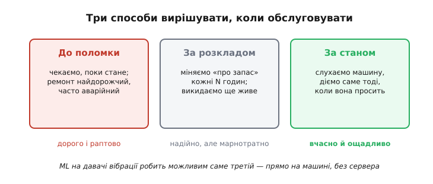
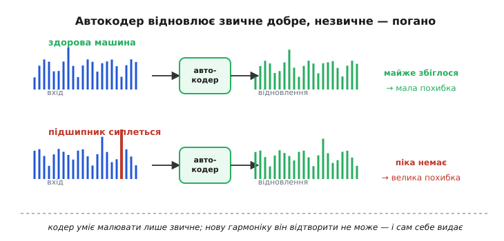
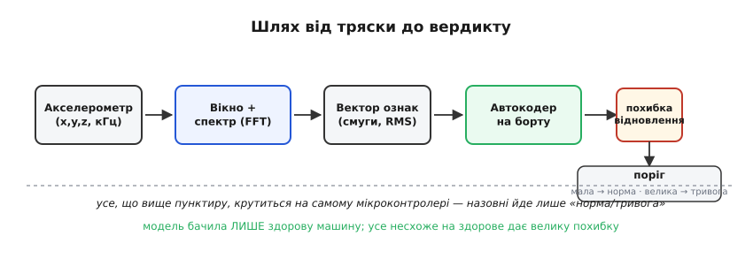

# Аномалії вібрацій через ML

Дотепер у цьому модулі ми навчили мікроконтролер тримати навчену модель у кишені: [стиснути її до кількадесяти кілобайтів](topic:sf-ml/tinyml), [викликати `.tflite` зі свого super-loop](root:embedded/edge-inference) і поміряти, скільки це коштує в тактах. Але всі приклади були про те, що людина й так уміє: почути слово-команду, побачити людину в кадрі. Тепер візьмімося за задачу, де машина від початку сильніша за нас, — і де саме вбудований ML розкриває свою природну перевагу.

Задача проста на словах: **мотор, насос, вентилятор чи підшипник дрону починають ламатися задовго до того, як стають.** Спершу з'являється ледь чутне биття, потім гул на новій частоті, потім скрегіт — і аж наприкінці заклинювання. Людське вухо ловить лихо на останніх відсотках цього шляху. А акселерометр, притулений до корпусу, «чує» перший натяк за тижні до аварії — якщо тільки хтось безперервно слухає й уміє відрізнити «здоровий» гул від «хворого». Оце безперервне слухання просто на самій машині, без відсилання даних на сервер, і є наша сьогоднішня тема.

> 🔧 **Навіщо це.** Це один із небагатьох застосунків, де вбудований ML економить не зручність, а гроші й безпеку напряму. Незапланований простій конвеєра коштує тисячі доларів за годину; підшипник, що заклинив у польоті, губить дрон. Давач за кілька доларів, який завчасно каже «цей мотор скоро стане», окуповується з першого спрацювання. Через це **передбачувальне обслуговування** (англ. *predictive maintenance*) — чи не найзатребуваніший промисловий випадок TinyML, і саме тому ми ставимо його останнім акордом модуля.

## Три способи дожити до ремонту

Щоб побачити, навіщо тут узагалі ML, треба спершу зрозуміти, як обслуговують техніку без нього. Способів рівно три, і вони шикуються за зростанням розуму.

Найпростіший — **до поломки** (run-to-failure): крутимо, поки не стане, тоді ремонтуємо. Дешево доти, доки поломка не спиняє все навколо або не нищить дорожче. Другий — **за розкладом** (planned maintenance): міняємо вузол кожні N годин напрацювання, «про запас». Надійніше, але марнотратне — викидаємо деталі, що прослужили б іще довго, і все одно проґавлюємо ранні відмови між планами. Третій, найрозумніший, — **за станом** (condition-based): не гадаємо за календарем, а **слухаємо саму машину** й діємо рівно тоді, коли вона починає скаржитися.



*Три способи вирішувати, коли обслуговувати. Перші два не дивляться на машину зовсім — один чекає біди, другий вірить календарю. Обслуговування за станом слухає саму техніку, тож ремонтує ні зарано, ні запізно. Саме його вбудований ML робить можливим прямо на давачі, без сервера.*

Ідея слухати машину, а не календар, стара — [народилася вона ще в 1940-х на залізниці](root:embedded/vibration-anomaly-ml/hist-condition-monitoring.md) й довго спиралася на людину-експерта з приладом. Нове тут одне: раніше «слухав» дорогий стаціонарний аналізатор і навчений діагност, а тепер той самий висновок робить копійчаний чип, приклеєний до корпусу мотора. Що змінилося — не ідея, а **ціна її втілення**.

## Чому вібрація, а не температура чи струм

Хворобу вузла можна ловити різними давачами: грітися він теж почне, струм споживання попливе, з'явиться запах. Але вібрація випереджає їх усіх, і причина суто фізична.

Механічна відмова — це майже завжди **порушення геометрії руху**. Кулька підшипника наїхала на першу мікровищербину; лопать вентилятора набрала на кінчик грудку бруду й розбалансувалася; зуб шестерні вищербився. Кожна така дрібниця негайно породжує **удар раз на оберт** (чи раз на кілька обертів) — крихітний, невидимий оку поштовх, що б'ється в корпус тисячі разів на секунду. Температура зросте лише згодом, коли тертя вже розігріє метал; струм — коли опір руху стане помітним для двигуна. А поштовх від дефекту виникає **тієї ж миті**, щойно дефект з'явився. Вібрація — це рання ознака, бо вона наслідок причини, а не наслідок наслідку.

Ловить ці поштовхи [MEMS-акселерометр](topic:hw-sensing/accelerometer) — той самий кремнієвий давач прискорення, що вже стояв у наших пристроях для нахилу й руху. Тут ми вживаємо його інакше: нам байдужий повільний нахил, нас цікавить **швидка змінна складова** — та сама тряска на сотнях і тисячах герц. Тому й читаємо його часто: не десятки разів на секунду, як для орієнтації, а кілька тисяч — щоб не проґавити високочастотний скрегіт. Тут стають у пригоді навички з попередніх модулів: [DMA годує потік відліків без участі ядра](root:embedded/dma-adc), поки ядро зайняте своєю справою.

## Сирі відліки — погана їжа для моделі

Спокуса — згодувати моделі прямо потік чисел з акселерометра: ось тобі тисяча відліків, скажи, норма чи ні. Так майже ніколи не роблять, і варто зрозуміти чому, бо це визначає всю архітектуру рішення.

Проблема в тому, що **однакова несправність виглядає щоразу інакше в часовому ряді**. Той самий поштовх від тріщини потрапляє то на пік синусоїди обертання, то на спад; вузол крутиться то трохи швидше, то повільніше; фаза між нашим читанням і обертом валу випадкова. Модель, яка дивиться на сирі відліки, змушена вчити купу неістотних варіацій замість самої суті. А суть — **на яких частотах трясе й наскільки сильно** — у часовому ряді захована.

Витягти її вміє перетворення, з яким ми познайомилися ще в модулі про змінний струм: [швидке перетворення Фур'є](topic:com-signal/fft) розкладає шматок сигналу на складові частоти й каже, скільки енергії сидить на кожній. Дефект підшипника, що б'ється, скажімо, 120 разів на секунду, дасть чіткий стовпчик на 120 Гц — **незалежно** від того, коли ми почали міряти й з якої фази. Спектр стабільний там, де часовий ряд метушливий; саме тому його майже завжди беруть за вхід моделі.

Один нюанс FFT доводиться пам'ятати завжди: перетворення припускає, що шматок сигналу нескінченно повторюється, а він обірваний з країв — і цей обрив розмазує чіткі піки в спектрі. Лікують це **вікном** — плавним прибиранням країв шматка до нуля перед FFT; [чому обрив бруднить спектр і як вікно це чинить](topic:com-signal/windowing-leakage) — окрема тема, тут досить правила: перед FFT сигнал завжди множать на вікно.

На виході маємо не сотні сирих відліків, а короткий **вектор ознак** (feature vector): енергія в кожній частотній смузі плюс кілька простих чисел про весь шматок — загальний [середньоквадратичний](topic:ph-electromagnetism/rms-value) рівень тряски, пікове значення, їхнє відношення. Десяток-два чисел замість тисячі відліків, і кожне з них про суть, а не про випадкову фазу. Оце й піде в модель.

## Аномалія — це «несхоже на здорове», а не «схоже на поломку»

Тут криється поворот, що відрізняє цю задачу від упізнавання слів чи облич, — і зрозуміти його треба до коду, бо він диктує вибір моделі.

Щоб навчити мережу впізнавати кота, їй показують тисячі котів. Щоб навчити впізнавати **зламаний** мотор, треба тисячі зламаних моторів — а їх немає й не буде. Ніхто не ламатиме сотню коштовних насосів заради даних; ба більше, ламаються вони **всіма різними способами** — тріщина, дисбаланс, розцентровка, брак мащення, — і наперед усіх не передбачиш. Зате чого вдосталь — це записів **здорової** роботи: увімкни справний вузол і пиши хоч тиждень.

Звідси єдино робочий підхід: **вчити модель тільки на нормі й ловити все, що на норму не схоже.** Це вже не класифікація («кіт чи собака»), а **виявлення аномалій** (anomaly detection) — інструмент [навчання без учителя](topic:sf-ml/what-is-ml), де правильних відповідей моделі ніхто не дає, вона сама вибудовує уявлення про «звичне». Модель не знає, який буває злам; вона знає лише, який буває **лад**, і б'є на сполох на всьому іншому. Дефект, якого світ ще не бачив, вона впіймає нарівні зі знайомим — бо ловить не конкретну ваду, а **відхилення від здоров'я**.

Оцей самий принцип став основою відомого академічного змагання зі стеження за станом машин: у [наборі DCASE](root:embedded/vibration-anomaly-ml/hist-condition-monitoring.md) моделям дають лише звуки справних насосів, вентиляторів і клапанів, а перевіряють на суміші справних і зламаних — і саме «вчися на нормі, суди за несхожістю» показує там найкращі результати.

## Автокодер: детектор, що вчиться лише на здоровому

Як же реалізувати «несхоже на здорове» мережею? Найпоширеніший на мікроконтролері спосіб — **автокодер** (англ. *autoencoder*), і його ідея елегантна до краси.

Автокодер — це мережа, яку змушують **відтворити власний вхід** через вузьке горло. Спершу вона стискає вектор ознак у кілька чисел (це «горло», *bottleneck*), а тоді з цих кількох чисел намагається відновити весь вихідний вектор. Стиснути двадцять чисел до трьох і розгорнути назад без утрат неможливо — хіба що ці двадцять чисел насправді підкоряються простому прихованому закону. І якщо годувати мережу **тільки здоровими** спектрами, вона цей закон здорової машини й вивчить: навчиться пропускати крізь горло рівно те, що буває в нормі, і відновлювати його майже точно.

Тепер фокус. Подаємо на вхід спектр **справної** роботи — мережа бачила таке тисячі разів, стисне й відновить майже без похибки. Подаємо спектр **хворої** машини з новою гармонікою від тріщини — а мережа такого горла для неї не має, вона вчилася лише на здоровому. Вона відновить щось схоже на здорове, без тієї нової гармоніки, — і відновлене **сильно розійдеться** зі входом. Ця розбіжність між тим, що подали, і тим, що мережа спромоглася відтворити, зветься **похибкою відновлення** (reconstruction error), і саме вона — наш детектор.



*Чому похибка відновлення ловить навіть небачену ваду. Автокодер уміє малювати лише те, що бачив на навчанні, — звичний, здоровий спектр. Знайомий вхід він відтворює майже точно (мала похибка). Нову гармоніку від дефекту він відтворити не здатен — виходить щось «здорове» без неї, і розбіжність зі входом підскакує. Мережа сама себе видає, не знаючи наперед жодної конкретної поломки.*

Уся хитрість, отже, в одному числі — **порозі похибки**. Похибка на здоровій машині гуляє в якомусь вузькому коридорі; коли вона вистрибує за поріг — оголошуємо аномалію. Де провести цей поріг — не вгадування, а невелика статистика на записі здорової роботи: [як з розкиду похибки на нормі вибирають поріг](root:embedded/vibration-anomaly-ml/math-reconstruction-threshold.md), щоб і ранню ваду не проґавити, і на кожен випадковий сплеск не панікувати, — розібрано окремо. Сам автокодер, його горло й те, [чому стиснення-відновлення взагалі виуджує структуру даних](topic:sf-ml/autoencoder), теж заслуговують окремого погляду — тут нам досить робочої картинки: вчимо на здоровому, судимо за похибкою.

## Увесь конвеєр на одному чипі

Складімо шлях цілком — від тряски корпусу до слова «тривога». Він розпадається на чотири кроки, і всі чотири вміщаються в тому самому мікроконтролері, що вже крутить наш super-loop.



*Шлях від тряски до вердикту. Акселерометр дає потік відліків; вікно й FFT перетворюють шматок у спектр; з нього збирають короткий вектор ознак; автокодер відновлює його й видає похибку; поріг перетворює похибку на «норма/тривога». Усе вище пунктиру крутиться на самому мікроконтролері — назовні йде лише вердикт, кілька байтів на годину, а не потік сирих даних.*

Зверни увагу на головний виграш цієї схеми, видимий саме зараз: **назовні майже нічого не тече.** Сирий потік акселерометра — це кілька тисяч відліків на секунду; гнати їх на сервер по радіо означало б садити батарею й забивати ефір. Натомість на сервер (чи просто на світлодіод) іде один біт на кілька секунд — «усе гаразд» або «гляньте на мене». Це та сама перевага [інференсу на краю](root:embedded/edge-inference), що ми вже цінували, але тут вона особливо разюча: стиснення «тисяча чисел за секунду → один вердикт за годину» дає сам характер задачі.

Ось як три перші кроки виглядають у прошивці. Акселерометр уже наповнив буфер відліків (скажімо, через DMA); ми множимо їх на вікно, женемо FFT і збираємо вектор ознак:

```cpp
#define N        256          // розмір вікна FFT (степінь двійки)
#define N_BANDS  16           // скільки частотних смуг у векторі ознак

// window[] — заздалегідь пораховане вікно Ганна, вшите у Flash як константа.
// re[], im[] — робочі буфери для FFT (im занулюємо, вхід дійсний).
static void make_features(const int16_t *samples, float *feat)
{
    float re[N], im[N];

    // 1. Вікно: прибираємо краї шматка, щоб піки в спектрі не розмазувались.
    for (int i = 0; i < N; i++) {
        re[i] = (float)samples[i] * window[i];
        im[i] = 0.0f;
    }

    fft_radix2(re, im, N);     // 2. FFT на місці: re/im стають спектром

    // 3. Енергію дзеркальних бінів (0..N/2) розкладаємо по N_BANDS смугах.
    const int per_band = (N / 2) / N_BANDS;
    for (int b = 0; b < N_BANDS; b++) {
        float energy = 0.0f;
        for (int k = 0; k < per_band; k++) {
            int idx = b * per_band + k;
            energy += re[idx]*re[idx] + im[idx]*im[idx];   // |спектр|²
        }
        feat[b] = logf(energy + 1e-6f);   // лог робить малі й великі смуги сумірними
    }
}
```

Тепер найголовніше — четвертий крок. Вектор ознак `feat[]` іде рівно в ту саму `Invoke()`-машинерію, яку ми зібрали для [інференсу на борту](root:embedded/edge-inference): кладемо вхід у вхідний тензор, кличемо модель, читаємо вихід. Різниця лише в тому, що виходом автокодера є **не мітка класу, а відновлений вектор** — і ми самі рахуємо, наскільки він розійшовся зі входом:

```cpp
// model_input, model_output — вказівники на тензори інтерпретатора TFLM
// (той самий скелет, що в темі про інференс: AllocateTensors один раз при старті).

float anomaly_score(const float *feat)
{
    for (int i = 0; i < N_BANDS; i++)
        model_input[i] = feat[i];        // вхід автокодера

    interpreter->Invoke();               // прохід: детермінований, сталий за часом

    // Похибка відновлення = наскільки вихід розійшовся зі входом (MSE).
    float err = 0.0f;
    for (int i = 0; i < N_BANDS; i++) {
        float d = feat[i] - model_output[i];
        err += d * d;
    }
    return err / N_BANDS;
}

// У super-loop: поріг THRESHOLD підібрано на записі здорової роботи.
if (anomaly_score(feat) > THRESHOLD) {
    raise_alarm();                       // світлодіод, або один пакет по радіо
}
```

Оце і все ядро. Ознаки — арифметика, яку тягне будь-який чип; `Invoke()` — той самий детермінований прохід сталої моделі, що ми вже вміємо вписувати в бюджет реального часу; а рішення — одне порівняння з порогом. Ніякого сервера, ніякого потоку даних назовні, ніякого навчання на борту — тільки читання застиглих ваг, як і належить [інференсу](topic:sf-ml/train-vs-inference).

## Коли простого автокодера досить, а коли ні

Лишається чесно окреслити межі, бо спокуса вбачати в цьому чарівну пігулку велика.

Автокодер на порозі **не скаже, що саме зламалося** — він скаже лише «щось не так». Розрізнити дисбаланс від браку мащення він не вміє; для діагнозу треба або людина, що гляне на спектр, або окрема, багатша модель. Далі, поріг **дрейфує з умовами**: та сама машина холодного ранку й після годин роботи трясеться трохи інакше, а знос підшипника повільно піднімає фон — і поріг, вибраний торік, потроху бреше. У серйозних системах його раз у раз переглядають чи роблять плавучим.

Ще одна тонкість — **де брати навчальні дані**. «Здоровий» запис мусить бути справді здоровим: якщо вузол уже трохи хворий на момент запису, модель вивчить хворобу як норму й проґавить її ж. Тому навчання роблять на завідомо новому чи щойно обслуженому обладнанні.

І все ж, попри ці межі, підхід працює й окуповується там, де класифікація безсила: він ловить **першу-ліпшу** відмову без жодного її прикладу, коштує копійки й живе прямо на давачі. Для більшості моторів, насосів і підшипників питання стоїть просто — «здоровий чи ні, і як швидко гіршає», — а на нього автокодер на порозі відповідає чесно й дешево. Саме тому передбачувальне обслуговування на TinyML з академічної цікавинки перетворилося на робочий промисловий інструмент — і гідно завершує наш модуль про машинне навчання на мікроконтролері.
